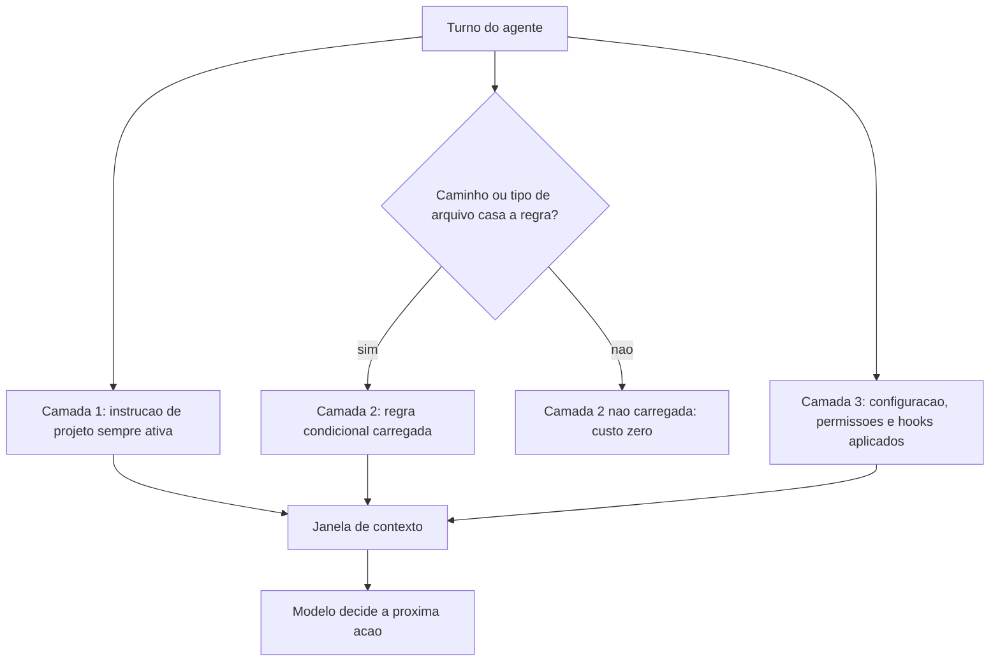

# Capítulo 3: O arquivo que todo agente lê: AGENTS.md, config.json e rules

## 1. Introdução

No Capítulo 2, você separou o que pertence ao código do que pertence ao modelo e escreveu sua primeira barreira determinística. Mas há uma classe de informação que nenhum gate resolve: o que o agente precisa saber *antes* de começar. Quem é este projeto, como se roda, o que é proibido, qual é o contrato de qualidade. Sem isso, o agente começa cada tarefa do zero — e você paga esse zero em tokens e em erro.

Neste capítulo, você vai escrever as três camadas de instrução persistente que sustentam um harness maduro: o arquivo de instruções portável, o arquivo de configuração que liga e desliga comportamentos, e as regras condicionais que só carregam quando fazem sentido.

**Resumo em uma frase:** instrução persistente é o único componente do harness que melhora todos os turnos de uma vez — e o único que pode destruí-los se for mal escrita.

## 2. Explica

Os termos da casa: LLM é o modelo probabilístico que gera texto; token é a unidade mínima de texto que ele processa; harness é a camada que decide o que entra na janela e o que é verificado depois. E **instrução persistente** é o texto que o harness reinjeta automaticamente a cada turno, sem você pedir.

Por que reinjetar? Porque o modelo não tem memória entre chamadas. Ele não "lembra" do que foi combinado na sessão anterior, nem do que você disse cinco minutos antes se aquilo saiu da janela. Toda sensação de continuidade é o harness reenviando o passado. A consequência econômica é direta: **tudo que está na instrução persistente é pago a cada turno**. Por exemplo: uma regra hipotética de duzentos tokens, numa sessão de algumas dezenas de turnos, já soma milhares de tokens de entrada só para repetir a mesma frase — multiplicado por todas as sessões, por todos os membros do time.

Daí a primeira lei da instrução persistente: **densidade, não volume**. A recomendação prática que emergiu dos harnesses de código é manter o arquivo de instruções curto e operacional, no espírito de um README para agentes: comandos que funcionam, convenções que importam, armadilhas específicas do projeto [1][2]. Regras genéricas de estilo de código não pertencem aí — elas não mudam comportamento e ocupam orçamento.

A segunda lei é a **estabilidade do prefixo**. Como vamos ver em detalhe no Capítulo 6, provedores cobram muito menos por tokens que já foram processados antes, desde que o início do prompt permaneça idêntico [3]. Instrução persistente que muda a cada sessão — com data, contador de tarefas, nome do usuário no topo — destrói esse desconto silenciosamente. Instrução persistente estável é, literalmente, dinheiro.

A terceira lei é a **separação por camada de escopo**. Um harness maduro organiza a instrução em três níveis:

1. **Escopo de projeto, sempre ativo.** O arquivo de instruções na raiz. Aplica-se a tudo, carrega sempre. Deve ser curto, porque o custo é universal.
2. **Escopo de projeto, condicional.** Regras que só valem para certos caminhos, tipos de arquivo ou frameworks [4]. Ótimo lugar para detalhes que não interessam ao resto do trabalho: convenções de migração de banco, padrão de componentes de UI, regras de uma pasta legada.
3. **Escopo de harness, comportamental.** O arquivo de configuração do agente — permissões, hooks, limites, lista de servidores de ferramentas, escolha de modelo [5]. Não ensina; restringe e habilita.

Essa separação resolve um conflito que aparece em todo time: o arquivo de instruções vira uma enciclopédia porque todo mundo quer deixar sua regra ali. A cura é perguntar, para cada regra nova: *isto vale para toda tarefa, ou só para uma parte do repositório?* Se vale só para uma parte, é camada 2. Se é restrição executável, é camada 3.

Agora, o ponto contraintuitivo: **a camada 2 é frequentemente mais valiosa que a camada 1**. Regras condicionais custam zero quando não se aplicam. Isso significa que você pode ser específico e detalhado sem poluir o orçamento global. Um time que só conhece a camada 1 escreve pouco e vago; um time que domina a camada 2 escreve muito e preciso, sem pagar por isso.

Falta a camada 3, e ela tem uma propriedade especial: é onde você define o que o agente **não pode** fazer. Permissões negadas, comandos bloqueados, hooks que interceptam. Instrução de camada 1 pede; configuração de camada 3 impede. Você já sabe, desde o Capítulo 2, qual das duas é confiável.

Um último aspecto prático merece atenção: **quem lê a instrução**. O modelo lê o texto, mas quem opera o harness lê o arquivo de configuração. Isso significa que a camada 3 precisa ser legível por humanos — comentários, nomes claros, agrupamento por intenção — enquanto a camada 1 deve ser legível por máquina e por humano ao mesmo tempo. Arquivos de configuração que ninguém consegue auditar são a origem da maioria dos incidentes silenciosos, tema que retomaremos no Capítulo 14.

## 3. Ilustra

Na cabine, a distinção entre os três níveis é visível a olho nu. O **checklist de pré-voo** é camada 1: curto, universal, lido em voz alta em todo voo, sempre igual. Os **procedimentos específicos de tipo de aeronave** são camada 2: quem voa um jato regional não abre o manual do wide-body. E o **painel de configuração** — disjuntores, seletores, modos do piloto automático — é camada 3: não ensina nada, apenas define o que está ligado, o que está bloqueado e o que acontece automaticamente.



Repare no nó "Camada 2 não carregada: custo zero". Essa é a diferença estrutural entre escrever uma regra no arquivo global e escrever uma regra condicional. Na cabine, é a diferença entre imprimir o manual inteiro e ter o manual na prateleira — disponível quando o procedimento certo for necessário.

## 4. Técnica

Vamos construir as três camadas de um harness real, na ordem em que você deve escrevê-las.

### Camada 1: o arquivo de instruções do projeto

Escreva menos do que você quer. O teste de aceitação de cada linha é: *se eu remover esta linha, algo quebra?* Se a resposta é não, a linha é decoração.

```markdown
# AGENTS.md

### Projeto
Servico de cotacao em FastAPI + PostgreSQL. Sem fila externa.

### Comandos
- Testes: `python -m pytest -q`
- Rodar local: `uvicorn app.main:app --reload`
- Migracao: `alembic upgrade head`

### Contratos (verificados por CI)
- Nenhum commit sem suite verde.
- Todo endpoint novo precisa de teste de contrato.
- Nunca alterar `migrations/` a mao: gerar via alembic.

### Armadilhas deste repositorio
- `app/legado/` usa Python 2 style: nao refatorar sem pedido.
- O campo `peso_kg` e opcional na API mas obrigatorio no banco.
```

Quatro seções, nenhuma regra genérica. Note que os contratos apontam para verificações reais — a instrução descreve o que o CI já garante, criando redundância saudável: o agente sabe antes, o CI garante depois.

### Camada 2: regras condicionais

A forma exata depende do harness; a ideia é sempre a mesma — uma regra com um casador de escopo. Em harnesses que usam arquivos de regras por pasta ou por padrão de arquivo, o escopo vem do caminho [4].

```yaml
# .agent/rules/migracoes.yaml
escopo:
  caminhos: ["migrations/**", "app/models/**"]
regras:
  - "Toda migracao precisa de funcao de downgrade."
  - "Nome do arquivo: <revisao>_<verbo>_<entidade>.py"
  - "Nunca usar DROP COLUMN direto: criar coluna nova e migrar dados."
```

Se o seu harness não suporta regras condicionais nativas, o mesmo efeito se obtém com um arquivo em subpasta e uma linha na camada 1 apontando para ele — a instrução global deve dizer *quando* ler o arquivo específico, não repetir o conteúdo.

### Camada 3: configuração, permissões e hooks

Aqui a linguagem muda: você não descreve comportamento, você o habilita ou bloqueia.

```json
{
  "model": "herdar",
  "permissions": {
    "allow": ["Bash(python -m pytest*)", "Bash(alembic upgrade head)", "Read(**)"],
    "deny": ["Bash(git push*)", "Bash(alembic downgrade*)", "Bash(dropdb*)", "Write(migrations/*)"]
  },
  "hooks": {
    "PreToolUse": [
      { "matcher": "Bash", "hooks": [{ "type": "command", "command": "python scripts/guard.py" }] }
    ],
    "PostToolUse": [
      { "matcher": "Edit", "hooks": [{ "type": "command", "command": "python scripts/format.py" }] }
    ]
  }
}
```

Três decisões merecem justificativa. `Write(migrations/*)` negado impede que o agente edite migração a mão — exatamente o contrato declarado na camada 1, agora com dente. `alembic downgrade` negado evita o acidente clássico de reverter banco em ambiente errado. E o hook de pós-edição roda formatação automaticamente, o que elimina uma classe inteira de discussão sobre estilo de código: o agente não precisa saber formatar, o harness formata.

### Ordem de precedência: o teste que revela o harness real

Todo harness tem uma ordem de precedência entre configuração de usuário, de projeto e de sistema. **Descubra a sua** com um teste empírico, não pela documentação:

```bash
# 1. Defina um valor reconhecivel no escopo de usuario
echo '{"model": "valor-do-usuario"}' > ~/.agent/settings.json
# 2. Defina outro valor no escopo de projeto
echo '{"model": "valor-do-projeto"}' > .agent/settings.json
# 3. Pergunte ao harness qual valor venceu
agent config get model
```

Se o resultado for `valor-do-projeto`, o projeto sobrepõe o usuário; se for `valor-do-usuario`, o usuário ganha. Esse detalhe parece acadêmico até o dia em que um hook de time é silenciosamente anulado pela configuração pessoal de alguém — o tipo de incidente que só se explica quando você sabe a ordem.

### Checklist de auditoria das três camadas

- [ ] A camada 1 cabe em uma tela e cada linha sobrevive ao teste de remoção?
- [ ] A camada 1 começa com conteúdo estável (sem datas, sem nomes voláteis)?
- [ ] Existe pelo menos uma regra condicional, para não sobrecarregar o global?
- [ ] A camada 3 nega pelo menos uma ação irreversível?
- [ ] Existe um hook que executa verificação, não apenas formatação?
- [ ] A ordem de precedência foi testada empiricamente neste projeto?

### Camada 1 em versão compacta: o teste das 40 linhas

Se a sua camada 1 passar de 40 linhas, provavelmente contém conteúdo que pertence a outra camada. Este é o formulário mínimo que funciona para a maioria dos repositórios.

```markdown
### Projeto
<uma frase: o que e, linguagem, banco, dependencias externas>

### Comandos
- testes: <comando exato>
- rodar local: <comando exato>
- migracao: <comando exato>

### Contratos verificados
- <regra 1 — e onde ela e verificada>
- <regra 2 — e onde ela e verificada>

### Armadilhas
- <comportamento surpreendente que so vale para este repositorio>
```

Quatro blocos, nenhum adjetivo. Cada linha responde a uma pergunta que o agente faria se pudesse perguntar.

### Como migrar um arquivo-enciclopédia

Quando o arquivo de instruções já virou depósito, a correção é mecânica e cabe em uma tarde. O procedimento tem quatro passos, aplicados linha por linha.

| Classificação da linha | Destino | Teste de decisão |
|---|---|---|
| Regra que vale para todo trabalho | fica na camada 1 | "isso se aplica a um PR de CSS e a uma migração?" |
| Regra que vale para parte do repositório | camada 2 condicional | "posso declarar um casador de escopo para isso?" |
| Restrição executável | camada 3 (permissão ou hook) | "existe comando que verifica isso?" |
| Contexto histórico ou decisão antiga | `docs/decisoes/` | "isso ensina uma ação ou explica um passado?" |
| Exemplo de código longo | arquivo de referência | "isso precisa ser pago a cada turno?" |

A pergunta que resolve 90% dos casos é a primeira: **vale para todo trabalho?** Tudo que responde "não" sai da camada 1, e o arquivo encolhe sem perder informação — apenas a realoca para onde ela custa menos.

### Calibrando a camada 2

Regras condicionais são o recurso mais subutilizado do harness, e a razão é quase sempre a mesma: o time não sabe que elas existem. Um exemplo de catálogo bem calibrado.

```yaml
regras_condicionais:
  migracoes:
    caminhos: ["migrations/**", "app/models/**"]
    regras:
      - "toda migracao precisa de downgrade testado"
      - "nunca DROP COLUMN direto"
  ui:
    caminhos: ["frontend/**/*.tsx"]
    regras:
      - "componente sem estado por padrao"
      - "acessibilidade: todo controle interativo com rotulo"
  legado:
    caminhos: ["app/legado/**"]
    regras:
      - "nao refatorar sem pedido explicito"
      - "manter compatibilidade com o contrato atual"
```

Observe que nenhuma dessas regras estaria na camada 1 — e todas seriam perdidas em um arquivo-enciclopédia, porque ninguém mantém 900 linhas.

### Ordem de precedência: além do teste empírico

Saber qual camada vence não basta; é preciso saber **o que fazer** com essa informação. As combinações mais comuns e suas consequências práticas.

| Cenário | Efeito | Ação recomendada |
|---|---|---|
| Projeto vence usuário | configuração do time é lei | manter padrões do time na camada de projeto |
| Usuário vence projeto | cada pessoa tem regras próprias | mover regra crítica para hook, não para config |
| Ambiente vence tudo | a máquina decide, não o repositório | proibir variáveis que afetam comportamento |
| Argumento de linha de comando vence | execução pontual pode divergir | registrar o comando exato nos relatórios |

Se o seu harness permite que uma variável de ambiente anule uma restrição de segurança definida no projeto, você tem uma configuração frágil — e a solução correta não é documentar a precedência, é mover a restrição para um mecanismo não sobrescrevível, como um hook versionado.

### Manutenção: a rotina trimestral

Instrução persistente apodrece como qualquer documentação, só que em silêncio. Uma rotina de trinta minutos por trimestre evita o acúmulo.

```console
$ python scripts/auditar-instrucao.py AGENTS.md
linhas................: 34
regras declaradas.....: 11
regras verificadas....: 4  (36%)
linhas sem acao.......: 6  <- candidatas a remocao
termos ambiguos.......: 2  ("adequado", "quando necessario")
idade do ultimo ajuste: 96 dias
```

Os dois últimos números são os mais úteis. Termo ambíguo é regra que cada agente interpreta de um jeito; idade alta sem revisão sugere decisão que ninguém revisitou.

## 5. Aplica

**A cena.** Você assume um repositório com dez anos e três times. O arquivo de instruções tem 900 linhas: histórico de decisões, tutoriais, listas de convenções que ninguém segue mais. O agente, obedientemente, carrega tudo a cada turno. As sessões ficam lentas, caras e confusas — e, pior, o agente começa a tratar regras obsoletas como lei, recusando padrões que o time adotou há dois anos.

O diagnóstico não é "arquivo grande". É que as três camadas foram colapsadas em uma. Coisas que eram restrição executável (como proibir alteração manual de migrações) estavam escritas como pedido educado no meio de 900 linhas. Coisas que valiam só para uma pasta estavam globais. E coisas que eram história estavam carregadas como se fossem instrução.

A correção levou uma tarde e teve três passos. Primeiro, cada linha foi classificada: contrato executável, regra condicional, ou história. As histórias saíram para `docs/decisoes/`, referenciadas por uma linha. Segundo, as restrições viraram permissões na camada 3 — de pedido a impedimento. Terceiro, as regras específicas foram para arquivos condicionais. O arquivo de camada 1 ficou com 38 linhas. O tempo médio de sessão caiu e, mais importante, os contratos passaram a ser cumpridos.

**Métricas.** Acompanhe: tamanho da camada 1 em tokens (alinhe com sua meta de orçamento de contexto); número de regras que são verificadas por código contra o total declarado; quantidade de regras condicionais existentes; e taxa de sessões que terminam sem o agente pedir esclarecimento sobre convenções — um bom proxy de instrução bem escrita.

**Armadilhas comuns.** (a) *Arquivo-enciclopédia*: tudo global, custo universal. (b) *Regra sem dente*: contrato importante escrito como sugestão em vez de permissão negada. (c) *Data no topo*: instrução que muda sozinha e invalida o cache de prefixo. (d) *Configuração fantasma*: hooks definidos só na máquina de quem configurou — o resto do time não os tem. (e) *Precedência desconhecida*: nunca testar qual escopo vence, e descobrir durante um incidente.

**Segunda cena.** Um projeto pequeno copia sem pensar a estrutura de instrução de um projeto grande: cinco arquivos de rule, dois níveis de condicionais, precedências testadas. O efeito é o oposto do pretendido — o agente lê mais contexto para decidir menos, e as regras condicionais disparam em momentos em que não deveriam. A correção é uma redução agressiva: uma camada 1 de 30 linhas, nenhuma regra condicional, e uma única permissão negada. O sistema fica menor, mais rápido de entender e mais fácil de manter. A lição é desconfortável para quem gosta de estrutura: a arquitetura certa é a menor que resolve o problema de decisão da equipe.

**Erros de julgamento.** O primeiro é tratar a estrutura de três camadas como meta de maturidade em vez de ferramenta — quem não tem regras condicionais não está atrasado, está no tamanho certo. O segundo é escrever regra antes de ter evidência de que ela é necessária; regra preventiva é custo permanente para um problema que talvez nunca apareça. O terceiro é deixar a camada 1 crescer por acúmulo, sem um ritual de remoção — a entropia de instrução só anda em uma direção.

**Antipadrão observável.** Quando o agente cita uma regra que a equipe não lembra ter escrito, ou pede desculpas por violar uma convenção que já foi abandonada, há instrução morta na cabine. O arquivo de instruções precisa de manutenção como qualquer outro artefato de código: revisão, poda e histórico.

### Síntese operacional

| Pergunta | Camada que responde | Teste de sanidade |
|---|---|---|
| Vale sempre? | 1 — instrução estável | Sobrevive ao teste de remoção linha por linha? |
| Vale só neste contexto? | 2 — regra condicional | Dispara apenas quando o glob casa? |
| Precisa ser garantido? | 3 — permissão e hook | É impedimento executável, não pedido? |
| É histórico de decisão? | nenhuma das três — vai para docs | Alguém consulta isso durante o trabalho? |

Três regras que ficam com quem opera:

- **Uma regra, um dono.** Se a mesma restrição vive em dois arquivos, ela vai ser lida duas vezes e obedecida de forma diferente nos dois lugares.
- **Camada 1 não cresce por acúmulo.** Toda linha nova precisa remover ou justificar uma existente.
- **Restrição importante não mora em prosa.** Se é inegociável, ela é verificada por código.

### Nota do revisor

Os três desvios mais comuns neste capítulo, em ordem de frequência:

1. **Arquivo de instruções como diário do projeto.** Cada decisão histórica vira uma linha, e o arquivo cresce sem limite. O teste de remoção resolve na hora da escrita, não na revisão.
2. **Regra condicional sem caminho absoluto.** Um glob que casa com tudo transforma a regra em regra global, e o custo que estava sendo evitado volta pelas costas.
3. **Permissão declarada e não testada.** Só se sabe que a camada 3 funciona quando se tenta violá-la de propósito e recebe a recusa. Enquanto isso não acontece, é apenas texto.

### Exercício de bancada

Quatro tarefas curtas para fixar os três níveis de memória:

1. **Teste de remoção.** Pegue três linhas do arquivo de instruções do seu projeto e remova cada uma mentalmente. Se o comportamento do agente não muda em nenhuma hipótese, as três linhas são candidatas a sair. Registre o resultado antes de editar o arquivo.
2. **Migração de camada.** Escolha uma regra que hoje vive como prosa e reescreva-a como impedimento executável. A pergunta de controle é direta: se o agente tentar desobedecer, o sistema recusa ou apenas avisa?
3. **Precedência.** Escreva duas regras conflitantes em escopos diferentes — uma global e uma específica — e descubra empiricamente qual vence. A resposta precisa estar registrada; descoberta durante um incidente é caro demais.
4. **Poda.** Reduza a camada 1 em 20% sem perder nenhuma restrição real. O que sobrar depois da poda é o núcleo estável que merece morar no prefixo cacheado do capítulo seguinte.

## 6. Conclusão

Você estruturou a memória do seu harness em três camadas. A camada 1 diz o que vale sempre, e é paga a cada turno — por isso precisa ser curta e estável. A camada 2 diz o que vale em contextos específicos e custa zero quando não se aplica. A camada 3 não ensina: restringe, habilita e intercepta, sendo a única das três que se pode chamar de garantia.

**Seu turno.** Escreva a camada 1 do seu projeto em no máximo 40 linhas, aplicando o teste de remoção linha por linha. Depois escolha uma restrição que hoje é pedido e transforme-a em impedimento executável na camada 3.

- [ ] Camada 1 escrita e abaixo de 40 linhas
- [ ] Cada linha sobreviveu ao teste de remoção
- [ ] Uma regra migrou para arquivo condicional (camada 2)
- [ ] Uma regra virou permissão negada (camada 3)
- [ ] Ordem de precedência testada empiricamente

No próximo capítulo, você faz o agente descobrir capacidade sem inflar a janela: skills, servidores de ferramentas e a arte de escrever o gatilho certo.

## 7. Referências

[1] AGENTS.MD. *agentsmd/agents.md — Repositório oficial do padrão*. Disponível em: https://github.com/agentsmd/agents.md. Acesso em: 12 set. 2026.
[2] AIHERO. *A Complete Guide To AGENTS.md*. Disponível em: https://www.aihero.dev/a-complete-guide-to-agents-md. Acesso em: 12 set. 2026.
[3] GOOGLE CLOUD. *Prompt caching — Claude partner models*. Disponível em: https://docs.cloud.google.com/gemini-enterprise-agent-platform/models/partner-models/claude/prompt-caching. Acesso em: 12 set. 2026.
[4] CURSOR. *Rules — Cursor Docs*. Disponível em: https://cursor.com/docs/rules. Acesso em: 12 set. 2026.
[5] ANTHROPIC. *All settings — Claude Code Docs*. Disponível em: https://code.claude.com/docs/en/settings-reference. Acesso em: 12 set. 2026.
[6] ANTHROPIC. *Automate actions with hooks — Claude Code Docs*. Disponível em: https://code.claude.com/docs/en/hooks-guide. Acesso em: 12 set. 2026.
[7] ANTHROPIC. *Hooks reference — Claude Code Docs*. Disponível em: https://code.claude.com/docs/en/hooks. Acesso em: 12 set. 2026.
[8] ANTHROPIC. *Effective context engineering for AI agents*. Disponível em: https://www.anthropic.com/engineering/effective-context-engineering-for-ai-agents. Acesso em: 12 set. 2026.
[9] ANTHROPIC. *Agent Skills — Overview*. Disponível em: https://platform.claude.com/docs/en/agents-and-tools/agent-skills/overview. Acesso em: 12 set. 2026.
[10] MODEL CONTEXT PROTOCOL. *Specification (2025-06-18)*. Disponível em: https://modelcontextprotocol.io/specification/2025-06-18. Acesso em: 12 set. 2026.
[11] MODEL CONTEXT PROTOCOL. *Server Features — Tools*. Disponível em: https://modelcontextprotocol.io/specification/2026-07-28/server/tools. Acesso em: 12 set. 2026.
[12] WANG, Lei et al. *A survey on large language model based autonomous agents*. Disponível em: https://doi.org/10.1007/s11704-024-40231-1. Acesso em: 12 set. 2026.
[13] XI, Zhiheng et al. *The Rise and Potential of Large Language Model Based Agents: A Survey*. Disponível em: http://arxiv.org/abs/2309.07864. Acesso em: 12 set. 2026.
[14] MOHAMMADI, Mahmoud et al. *Evaluation and Benchmarking of LLM Agents: A Survey*. Disponível em: https://doi.org/10.1145/3711896.3736570. Acesso em: 12 set. 2026.
[15] LANGCHAIN. *Context Engineering*. Disponível em: https://www.langchain.com/blog/context-engineering-for-agents. Acesso em: 12 set. 2026.
[16] INFOQ. *AGENTS.md Emerges as Open Standard for AI Coding Agents*. Disponível em: https://www.infoq.com/news/2025/08/agents-md/. Acesso em: 12 set. 2026.
[17] TESSL. *Agents.md: an open standard for AI coding agents*. Disponível em: https://tessl.io/blog/the-rise-of-agents-md-an-open-standard-and-single-source-of-truth-for-ai-coding-agents. Acesso em: 12 set. 2026.
[18] ANTHROPIC. *Subagents in the SDK — Claude Code Docs*. Disponível em: https://code.claude.com/docs/en/agent-sdk/subagents. Acesso em: 12 set. 2026.
[19] GIT. *git-worktree — Referência oficial*. Disponível em: https://git-scm.com/docs/git-worktree. Acesso em: 12 set. 2026.
[20] GRESHAKE, Kai et al. *Not What You've Signed Up For: Compromising Real-World LLM-Integrated Applications with Indirect Prompt Injection*. Disponível em: https://doi.org/10.1145/3605764.3623985. Acesso em: 12 set. 2026.
