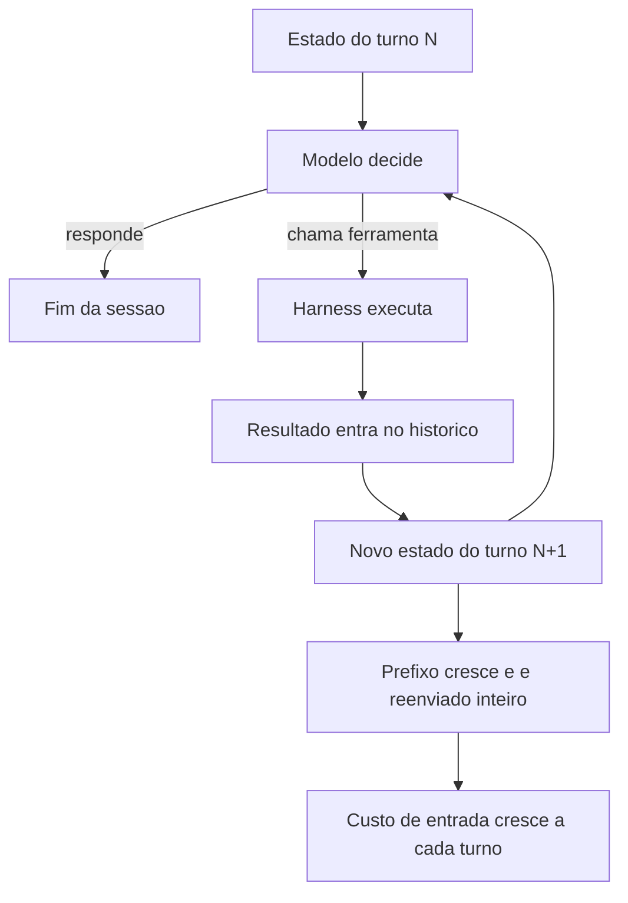

# Capítulo 5: Turnos agênticos: anatomia de um loop e por que ele custa dinheiro

## 1. Introdução

No Capítulo 4, você organizou o catálogo de capacidades do agente. Mas capacidade tem preço, e o preço não é cobrado por resposta — é cobrado por **turno**. Quem entende o que compõe um turno agêntico entende onde o dinheiro vaza; quem não entende otimiza no lugar errado e economiza centavos enquanto queima dólares.

Ao final, você vai saber decompor um turno em suas partes, medir o custo real de uma sessão, identificar as três fontes de desperdício mais comuns e instrumentar sua própria esteira para enxergar o consumo antes que ele apareça na fatura.

**Resumo em uma frase:** o custo de um agente é o custo do prefixo reenviado a cada turno — e prefixo é justamente o que ninguém olha.

## 2. Explica

Os termos da casa: LLM é o modelo probabilístico que gera texto; token é a unidade mínima de texto que ele processa; harness é a camada que decide o que entra na janela e o que é verificado depois.

Um **turno agêntico** é uma iteração completa do ciclo: o modelo recebe o estado atual, decide uma ação — responder ou chamar uma ferramenta —, o harness executa a ação, e o resultado volta para o modelo. Cada iteração é uma chamada nova de inferência. Não existe memória: o que o modelo "sabe" é exatamente o que o harness acabou de enviar [1].

Aqui está o ponto que muda tudo. Considere uma sessão de 20 turnos. No turno 20, o harness envia: a instrução persistente, a definição de todas as ferramentas, o histórico completo dos 19 turnos anteriores, mais o resultado da última ação. **O custo de entrada cresce de forma aproximadamente quadrática com o número de turnos.** Não porque o modelo ficou mais caro, mas porque o prefixo cresce a cada passo e é reenviado integralmente [2][3].

Formalizando, com `P` = prefixo estável (instrução + ferramentas) e `c_i` = conteúdo acrescentado no turno `i`, o custo total de entrada de uma sessão de `n` turnos é proporcional a `n·P + Σ (n − i + 1)·c_i`. Dois termos, duas alavancas distintas — e é por isso que o livro separa o Capítulo 6 (cache do prefixo `P`) do Capítulo 8 (controle do conteúdo incremental `c_i`).

Vale sublinhar a consequência prática mais contraintuitiva, que decorre direto da fórmula acima: **reduzir o número de turnos vale mais do que reduzir o tamanho do prompt**. Cortar o prefixo `P` pela metade só afeta o primeiro termo; eliminar uma fração dos turnos de uma sessão afeta o somatório inteiro — o termo que domina o custo. É por isso que um harness com boas verificações — que impede o agente de tentar, errar, tentar, errar — é uma ferramenta de economia antes de ser uma ferramenta de qualidade.

As três fontes de desperdício aparecem em praticamente todo projeto.

A primeira é o **resultado de ferramenta sem teto**. Um comando que despeja 5.000 linhas de log no contexto não custa uma vez: custa em *todos os turnos seguintes*, porque a partir dali ele faz parte do prefixo. Uma única leitura descuidada na metade da sessão pode dobrar o custo da segunda metade [4].

A segunda é o **turno de retrabalho**. Agente que não sabe o contrato de qualidade erra, você corrige, ele erra de outra forma. Cada ciclo desses adiciona conteúdo incremental que ficará no histórico. O desperdício não é o erro em si — é o erro persistido no prefixo.

A terceira é **capacidade não usada carregada sempre**. Cinquenta definições de ferramentas, das quais três são usadas na tarefa, custam em todo turno. Esse é o item mais fácil de corrigir e o mais frequentemente ignorado.

Existe ainda um fenômeno de segunda ordem, documentado na engenharia de contexto: **contexto grande degrada a atenção**. Modelos tendem a performar melhor com o conjunto certo de tokens do que com o conjunto máximo [4]. Ou seja, a economia não é só financeira — é de qualidade. O agente que recebe menos ruído decide melhor. Isso inverte a intuição de que "mais informação é sempre melhor" e explica por que harnesses maduros tendem a ser enxutos.

Por fim, a distinção entre **turno** e **sessão** importa para quem mede. Sessão é a unidade de trabalho humano ("corrigir o bug 1042"); turno é a unidade de inferência. Você otimiza por sessão (resultado por dólar) e diagnostica por turno (onde o token foi queimado). Confundir as duas leva a metas erradas: reduzir o custo por turno sem olhar o número de turnos é o equivalente a economizar combustível acelerando mais.

## 3. Ilustra

Na cabine, cada turno é um **trecho de voo**: uma decisão do piloto, um ajuste no painel, uma leitura de instrumento, e o avião segue. O combustível gasto em um trecho não é só o daquele momento — é o peso acumulado da aeronave. Cada item que você embarca (contexto) continua pesando em todos os trechos seguintes do mesmo voo.



E há a terceira armadilha, que é a mais traiçoeira: **o resultado de ferramenta é carga permanente, não descartável**. Na cabine, um relatório de manutenção mal resumido fica no envelope de voo e é relido em cada checagem. A carga não some sozinha. Como Engenheiro de Bordo, seu trabalho é garantir que o que embarca tem o tamanho do que importa.

## 4. Técnica

Esta seção entrega a instrumentação: medir um turno, calcular o custo de uma sessão, aplicar teto a saídas de ferramenta e eliminar turnos de retrabalho.

### Passo 1: registre cada turno com números

Sem medição, otimização é palpite. Grava um registro por turno — tokens de entrada, tokens de saída, tokens lidos de cache, ferramenta chamada e duração.

```json
{
  "sessao": "corrigir-bug-1042",
  "turno": 7,
  "tokens_entrada": 48210,
  "tokens_saida": 1420,
  "tokens_cache_leitura": 41984,
  "ferramenta": "run_tests",
  "linhas_resultado": 38,
  "duracao_s": 8.4,
  "custo_estimado_usd": 0.0231
}
```

O campo `tokens_cache_leitura` é o mais revelador do conjunto. Se ele é próximo de zero em uma sessão longa, você está pagando preço cheio pelo prefixo em todo turno — e o Capítulo 6 vai mostrar como corrigir isso.

### Passo 2: calcule o custo da sessão, não do turno

Colete os registros e produza o resumo que interessa para a decisão.

```python
#!/usr/bin/env python3
"""Resume o custo de uma sessao a partir dos registros por turno."""
import json
from pathlib import Path

PRECO_ENTRADA = 3.00 / 1_000_000      # por token
PRECO_SAIDA = 15.00 / 1_000_000
PRECO_CACHE = 0.30 / 1_000_000


def resumir(caminho):
    turnos = [json.loads(l) for l in Path(caminho).read_text(encoding="utf-8").splitlines() if l.strip()]
    entrada = sum(t["tokens_entrada"] for t in turnos)
    saida = sum(t["tokens_saida"] for t in turnos)
    cache = sum(t.get("tokens_cache_leitura", 0) for t in turnos)
    custo = entrada * PRECO_ENTRADA + saida * PRECO_SAIDA + cache * PRECO_CACHE
    return {
        "turnos": len(turnos),
        "tokens_entrada": entrada,
        "tokens_saida": saida,
        "tokens_cache": cache,
        "proporcao_cache": round(cache / entrada, 3) if entrada else 0.0,
        "custo_usd": round(custo, 4),
        "custo_por_turno": round(custo / len(turnos), 4) if turnos else 0.0,
    }


if __name__ == "__main__":
    import sys
    print(json.dumps(resumir(sys.argv[1]), ensure_ascii=False, indent=2))
```

A `proporcao_cache` é o indicador que você quer empurrar para cima: quanto mais alta, mais barato cada turno fica. Sem cache, essa proporção é zero e o crescimento quadrático aparece inteiro na conta.

### Passo 3: aplique teto a toda saída de ferramenta

Esta é a intervenção com melhor relação custo-benefício de todo o livro, em termos de tokens salvos por linha alterada. Nunca deixe uma ferramenta devolver conteúdo ilimitado.

```python
def comprimir_saida(texto, primeiras=3, ultimas=4, limite_linhas=200):
    """Mantem cabeca e cauda; resume o meio. Padrao identico ao usado em logs."""
    linhas = texto.splitlines()
    if len(linhas) <= limite_linhas:
        return texto
    cabeca = linhas[:primeiras]
    cauda = linhas[-ultimas:]
    omitidas = len(linhas) - primeiras - ultimas
    return "\n".join(cabeca + [f"... [{omitidas} linhas omitidas] ..."] + cauda)
```

O princípio — cabeça e cauda, nunca o meio — é o mesmo que a economia de contexto prescreve para logs: os primeiros erros e o resumo final carregam quase toda a informação; o miolo é repetição. Quando o agente precisa do miolo, ele pede por trecho específico, e aí sim paga por ele.

### Passo 4: elimine turnos de retrabalho com contrato explícito

Cada turno economizado vale mais que qualquer micro-otimização de prompt. Duas intervenções atacam a maior parte do retrabalho.

Primeiro, **entregue o critério de pronto antes da tarefa**. Agente que não sabe o que é "terminado" vai iterar até você dizer.

```yaml
tarefa: corrigir-bug-1042
criterio_de_pronto:
  - "suite completa executa sem falha"
  - "teste novo cobre o caso relatado"
  - "nenhum arquivo fora de app/ foi alterado"
limite_de_tentativas: 3
ao_atingir_limite: "parar e reportar o bloqueio com a ultima falha"
```

Segundo, **proíba tentativa cega**. `limite_de_tentativas` é a diferença entre um agente que converge e um que gasta dez turnos variando a mesma tentativa. Três tentativas e reportar é quase sempre mais barato do que vinte e acertar.

### Tabela de decisão: o que fazer com o custo alto

| Sintoma medido | Causa provável | Ação |
|---|---|---|
| `proporcao_cache` ≈ 0 | prefixo instável, sem cache | Cap. 6: estabilizar a ordem das partes |
| entrada cresce muito rápido por turno | saída de ferramenta sem teto | aplicar compressão cabeça+cauda |
| muitos turnos para tarefa simples | critério de pronto ausente | declarar contrato antes da tarefa |
| custo por turno baixo, custo por sessão alto | muitos turnos | atacar causa raiz das repetições |
| erro recorrente do mesmo tipo | gate ausente | mover verificação para script (Cap. 2) |

### Passo 5: projete o custo antes de gastar

Antes de rodar uma tarefa longa, projete o custo. Uma estimativa grosseira já evita surpresas de ordem de magnitude.

```python
def projetar_custo(turnos_estimados, prefixo_tokens, crescimento_medio_por_turno,
                   preco_entrada=3.0 / 1_000_000, preco_saida=15.0 / 1_000_000,
                   saida_media_por_turno=800, proporcao_cache=0.0,
                   preco_cache=0.30 / 1_000_000):
    """Custo projetado de uma sessao, com e sem reaproveitamento de prefixo."""
    entrada_total = 0
    for turno in range(1, turnos_estimados + 1):
        entrada_total += prefixo_tokens + (turno - 1) * crescimento_medio_por_turno

    cacheado = entrada_total * proporcao_cache
    comum = entrada_total - cacheado
    saida = turnos_estimados * saida_media_por_turno
    custo = comum * preco_entrada + cacheado * preco_cache + saida * preco_saida
    return {
        "turnos": turnos_estimados,
        "tokens_entrada": entrada_total,
        "tokens_saida": saida,
        "custo_usd": round(custo, 4),
        "custo_por_turno_usd": round(custo / turnos_estimados, 4),
    }
```

Rode a projeção para 10, 20 e 40 turnos com o mesmo prefixo. O crescimento será visivelmente superlinear, e essa curva é o argumento mais eficaz para convencer um time a investir em redução de turnos em vez de micro-otimização de prompt.

### Passo 6: catálogo de tetos por ferramenta

Teto único para todas as ferramentas é melhor que nenhum teto, mas é grosseiro. A tabela abaixo calibra o teto pelo valor informacional da cauda.

| Ferramenta | Teto sugerido | Estratégia | Racional |
|---|---|---|---|
| buscar por padrão | 40 linhas | cabeça + contagem | agente refaz a busca mais específica |
| rodar testes | 25 linhas | cabeça + cauda | erro e resumo são o sinal |
| listar diretório | 60 entradas | truncar com contagem | hierarquia importa mais que volume |
| ler intervalo | parâmetro explícito | sem truncamento | o agente pediu aquele tamanho |
| log de build | 40 linhas | cabeça + cauda | falha inicial e veredito final |
| diff | 400 linhas | truncar por arquivo | diff completo de 1 arquivo é útil |
| consulta a banco | 50 linhas | sempre com limite na query | a query é o teto real |

```yaml
tetos:
  padrao: 200
  por_ferramenta:
    run_tests: 25
    buscar_padrao: 40
    listar_diretorio: 60
    consultar_banco: 50
  ao_truncar: "anexar marcador com quantidade omitida"
  excecao: "ferramenta com parametro explicito de tamanho nunca trunca"
```

O campo `ao_truncar` é obrigatório. Truncar em silêncio é pior do que não truncar: o agente passa a decidir com informação parcial sem saber que ela é parcial — o mesmo mecanismo que produz o falso diagnóstico de alucinação.

### Passo 7: dez táticas para reduzir turnos

Reduzir turnos é a alavanca mais rentável, e as táticas são conhecidas. A tabela abaixo ordena por impacto típico observado.

| # | Tática | Impacto típico em turnos |
|---|---|---|
| 1 | Critério de pronto escrito antes da tarefa | −30% a −50% |
| 2 | Teto em toda saída de ferramenta | −15% a −30% |
| 3 | Comando verboso trocado por versão silenciosa (`-q`, `--oneline`) | −10% a −25% |
| 4 | Limite de tentativas com reporte obrigatório | −10% a −20% |
| 5 | Memória externa do que já foi lido | −10% a −20% |
| 6 | Verificação automática antes de perguntar ao humano | −5% a −15% |
| 7 | Roteamento por exigência cognitiva | −5% a −15% |
| 8 | Delegação de varredura pesada | −5% a −15% (e custo bem menor) |
| 9 | Instrução de estilo telegráfico na resposta | −5% a −10% |
| 10 | Reuso de resultado já obtido na sessão | −5% a −10% |

As três primeiras cobrem a maior parte do ganho disponível, e nenhuma delas exige mudar de modelo ou de ferramenta. É por isso que o capítulo insiste: a economia está na cabine, não no motor.

### Passo 8: instrumentação contínua

Medir uma vez é diagnóstico; medir sempre é engenharia. O mínimo viável é um registro append-only por turno e um resumo por sessão.

```yaml
coleta:
  formato: jsonl
  destino: "logs/turnos.jsonl"
  campos: [sessao, turno, tokens_entrada, tokens_saida, tokens_cache_leitura, ferramenta, linhas_resultado, duracao_s]
  proibido:
    - "payload de entrada do operador"
    - "conteudo de arquivo lido"
    - "dados pessoais de qualquer natureza"
```

```bash
# Resumo do dia: turnos, custo e proporcao de cache
python scripts/resumir-turnos.py logs/turnos.jsonl --dia hoje \
  --campos turnos,custo_usd,proporcao_cache,mediana_turnos_por_tarefa
```

A lista `proibido` é tão importante quanto os campos. Registro de telemetria é um dos lugares onde dado sensível vaza com mais frequência, justamente porque nasce como ferramenta interna e nunca passa por revisão de segurança.

### Passo 9: cinco erros de medição que enganam

| Erro | Por que engana | Correção |
|---|---|---|
| Medir só a média | esconde a sessão de 200 turnos | acompanhar p95 e máximo |
| Medir custo por token | ignora retrabalho | medir custo por tarefa concluída |
| Medir só tarefas concluídas | exclui as que falharam e consumiram | incluir abandonadas e esgotadas |
| Medir sem separar por tipo de tarefa | compara o incomparável | agrupar por perfil de tarefa |
| Medir uma vez | decisão sobre ruído | janela mínima de duas semanas |

## 5. Aplica

**A cena.** Uma equipe de plataforma roda um agente de manutenção que "funciona bem" — ninguém reclama da qualidade. No fim do trimestre, a fatura triplica e o crescimento não corresponde a mais tarefas. Você é chamado para investigar. O registro mostra sessões de 40 a 60 turnos para tarefas que, no relato dos engenheiros, "eram simples".

Você instrumenta e encontra o padrão. Primeiro turno: o agente roda a suíte de testes completa — 900 linhas de saída entram no contexto. Turno dois: lê dois arquivos grandes, mais 1.200 linhas. A partir do turno três, **cada chamada de inferência reenvia 2.100 linhas de log**, e o modelo, para não se perder, começa a pedir confirmações: "rodar os testes novamente para confirmar?". Cada confirmação é um turno. O custo não estava na qualidade: estava no miolo de log que embarcou no envelope de voo e nunca mais saiu.

A correção, aplicada em uma tarde, tem três partes. Teto em toda saída de ferramenta (`cabeça + 4 linhas`). Argumento `-q` na suíte de testes, que reduz 900 linhas a 12. E critério de pronto escrito no pedido, o que corta as confirmações. Resultado: turnos médios de 52 para 17; custo por tarefa caiu 71%; taxa de conclusão na primeira tentativa subiu. A qualidade, que já era boa, ficou igual — o desperdício não estava comprando nada.

**Métricas.** Acompanhe por semana: turnos por tarefa, custo por tarefa concluída, proporção de tokens lidos de cache, tamanho máximo de saída de ferramenta em uma sessão, e percentual de sessões que terminam por limite de tentativas em vez de conclusão.

**Armadilhas comuns.** (a) *Otimizar o prompt e ignorar os turnos*: o termo dominante fica intocado. (b) *Teto só no log e não no arquivo*: leitura de arquivo grande é a segunda maior fonte. (c) *Medir só o custo médio*: a média esconde a sessão de 200 turnos que sozinha consumiu metade do orçamento. (d) *Confundir cache ausente com economia*: sem `tokens_cache_leitura` medido, você não sabe se está pagando preço cheio. (e) *Limite de tentativas como punição*: ele é instrumento de reporte, não de disciplina.

**Segunda cena.** Uma sessão de depuração consome quatro vezes o orçamento previsto. O extrato mostra que não houve nenhum turno caro: houve trinta e um turnos baratos, quase todos lendo o mesmo arquivo com recortes ligeiramente diferentes. O padrão é comum e tem nome — turno de confirmação. O agente lê, conclui, e lê de novo para conferir o que já concluiu. Cada volta reenvia o contexto inteiro. A correção é de contrato, não de limite: o resultado da leitura vai para um bloco de estado persistente, e a instrução proíbe reler o que já está no bloco.

**Erros de julgamento.** O primeiro é otimizar o turno mais caro quando o custo está distribuído em muitos turnos médios. O segundo é medir só a entrada e ignorar que a saída verbosa de um turno volta como entrada do próximo. O terceiro é interpretar custo alto como "modelo caro" e trocar de modelo, quando o problema é o número de voltas. O quarto é cortar contexto para economizar e, com isso, aumentar os turnos — economia que se paga com retrabalho é prejuízo disfarçado.

**Antipadrão observável.** Um log em que a mesma consulta aparece repetida com variação mínima é o sinal mais claro de que falta contrato de turno. Se o agente pergunta duas vezes a mesma coisa, não é o agente que está confuso: é o estado da tarefa que não está escrito em lugar nenhum.

### Síntese operacional

| Fase do turno | O que registrar | O que evitar |
|---|---|---|
| Abertura | Estado da tarefa e restrições | Reler o que já está no estado |
| Busca | Comando e recorte usado | Varrer diretório inteiro |
| Leitura | Janela e motivo | Abrir arquivo grande por inteiro |
| Escrita | Diff e alvo autorizado | Editar fora da lista |
| Verificação | Saída de teste e evidência | Repetir comando sem ler o erro |
| Fechamento | Nota curta e próximo passo | Deixar o estado implícito |

Três regras que ficam com quem opera:

- **Um turno, uma decisão.** Turno que não muda nada é turno desperdiçado.
- **Estado escrito vence memória implícita.** O bloco de estado é o que impede releitura.
- **Custo é tokens vezes turnos.** Otimizar só um dos fatores não reduz o gasto.

### Nota do revisor

Os três desvios mais comuns neste capítulo, em ordem de frequência:

1. **Teto de saída que trunca sem avisar.** O resultado chega cortado e o agente decide com base em informação incompleta sem sinalizar nada. Todo teto precisa de um caminho de resumo explícito.
2. **Custo medido por sessão e não por tarefa.** A sessão agrega trabalhos distintos, e a média esconde a tarefa que realmente custou. Registre a fronteira da tarefa no log.
3. **Turno de confirmação confundido com zelo.** Reler para conferir o que já está no estado é desperdício, mesmo quando o resultado parece mais seguro.

### Exercício de bancada

Quatro tarefas curtas para fixar o custo por turno:

1. **Contabilidade de uma sessão.** Reconstrua o custo de uma sessão real e classifique cada turno em: necessário, confirmação ou retrabalho. A proporção entre as três classes é o retrato da eficiência do harness.
2. **Orçamento projetado.** Antes de rodar, estime o consumo de uma tarefa — número de turnos previstos multiplicado pelo contexto médio. Compare com o real e registre o erro da projeção.
3. **Corte de vazamento.** Escolha um dos nove vazamentos do capítulo e elimine-o. Meça o efeito na sessão seguinte, mantendo a tarefa equivalente.
4. **Teto com resumo.** Implemente um limite de saída que, ao ser atingido, produz um resumo em vez de truncar. Verifique que o turno seguinte não precisa reler nada do que ficou de fora.

## 6. Conclusão

Você decompôs o motor econômico dos agentes. Primeiro: o custo mora no prefixo reenviado a cada turno, e por isso cresce de forma aproximadamente quadrática com o número de turnos. Segundo: as três fontes de vazamento são saída de ferramenta sem teto, turno de retrabalho e capacidade não usada carregada sempre — nessa ordem de impacto. Terceiro: reduzir turnos (contrato de pronto, limite de tentativas) é mais rentável do que reduzir prompt.

**Seu turno.** Instrumente uma sessão real: grave um registro por turno com entrada, saída, cache e ferramenta. Depois aplique dois cortes — teto em toda saída de ferramenta e critério de pronto explícito — e compare o custo por tarefa antes e depois.

- [ ] Registro por turno implementado com tokens de cache
- [ ] Toda saída de ferramenta passou a ter teto de linhas
- [ ] Critério de pronto escrito antes da tarefa, com limite de tentativas
- [ ] Custo por tarefa medido antes e depois das mudanças
- [ ] Identificada a sessão mais cara do mês e sua causa

No próximo capítulo, você ataca o termo dominante de forma direta: o cache de prefixo — o desconto que existe, que é grande, e que se perde com uma única linha instável no lugar errado.

## 7. Referências

[1] MODEL CONTEXT PROTOCOL. *Specification (2025-06-18)*. Disponível em: https://modelcontextprotocol.io/specification/2025-06-18. Acesso em: 12 set. 2026.
[2] GOOGLE CLOUD. *Prompt caching — Claude partner models*. Disponível em: https://docs.cloud.google.com/gemini-enterprise-agent-platform/models/partner-models/claude/prompt-caching. Acesso em: 12 set. 2026.
[3] KONISHI, Hidekazu. *Anthropic Claude API Prompt Caching and Token Efficiency*. Disponível em: https://hidekazu-konishi.com/entry/anthropic_claude_api_prompt_caching_and_token_efficiency.html. Acesso em: 12 set. 2026.
[4] ANTHROPIC. *Effective context engineering for AI agents*. Disponível em: https://www.anthropic.com/engineering/effective-context-engineering-for-ai-agents. Acesso em: 12 set. 2026.
[5] ANTHROPIC. *Context engineering: memory, compaction, and tool clearing*. Disponível em: https://platform.claude.com/cookbook/tool-use-context-engineering-context-engineering-tools. Acesso em: 12 set. 2026.
[6] LANGCHAIN. *Context Engineering*. Disponível em: https://www.langchain.com/blog/context-engineering-for-agents. Acesso em: 12 set. 2026.
[7] ANTHROPIC. *Explore the context window — Claude Code Docs*. Disponível em: https://code.claude.com/docs/en/context-window. Acesso em: 12 set. 2026.
[8] ANTHROPIC. *All settings — Claude Code Docs*. Disponível em: https://code.claude.com/docs/en/settings-reference. Acesso em: 12 set. 2026.
[9] MOHAMMADI, Mahmoud et al. *Evaluation and Benchmarking of LLM Agents: A Survey*. Disponível em: https://doi.org/10.1145/3711896.3736570. Acesso em: 12 set. 2026.
[10] WANG, Lei et al. *A survey on large language model based autonomous agents*. Disponível em: https://doi.org/10.1007/s11704-024-40231-1. Acesso em: 12 set. 2026.
[11] XI, Zhiheng et al. *The Rise and Potential of Large Language Model Based Agents: A Survey*. Disponível em: http://arxiv.org/abs/2309.07864. Acesso em: 12 set. 2026.
[12] XU, Weikai et al. *LLM-Based Agents for Tool Learning: A Survey*. Disponível em: https://doi.org/10.1007/s41019-025-00296-9. Acesso em: 12 set. 2026.
[13] KWON, Woosuk et al. *Efficient Memory Management for Large Language Model Serving with PagedAttention*. Disponível em: https://arxiv.org/abs/2309.06180. Acesso em: 12 set. 2026.
[14] VLLM. *Easy, Fast, and Cheap LLM Serving with PagedAttention*. Disponível em: https://vllm.ai/blog/2023-06-20-vllm. Acesso em: 12 set. 2026.
[15] ANTHROPIC. *Hooks reference — Claude Code Docs*. Disponível em: https://code.claude.com/docs/en/hooks. Acesso em: 12 set. 2026.
[16] ANTHROPIC. *Subagents in the SDK — Claude Code Docs*. Disponível em: https://code.claude.com/docs/en/agent-sdk/subagents. Acesso em: 12 set. 2026.
[17] ANTHROPIC. *Agent Skills — Overview*. Disponível em: https://platform.claude.com/docs/en/agents-and-tools/agent-skills/overview. Acesso em: 12 set. 2026.
[18] SOURCEGRAPH. *Context Engineering: A Practical Guide for AI Agents*. Disponível em: https://sourcegraph.com/blog/context-engineering. Acesso em: 12 set. 2026.
[19] ORCA. *What is Orca? — Orca Docs*. Disponível em: https://www.onorca.dev/docs. Acesso em: 12 set. 2026.
[20] GIT. *git-worktree — Referência oficial*. Disponível em: https://git-scm.com/docs/git-worktree. Acesso em: 12 set. 2026.
