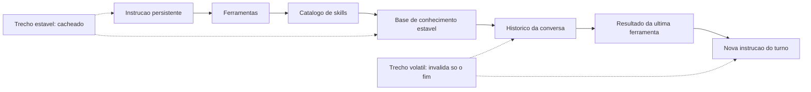

# Capítulo 6: Cache hit: prompt caching e a ordem das partes

## 1. Introdução

No Capítulo 5, você mediu o custo dos turnos e descobriu que o prefixo reenviado domina a conta. Agora vem a boa notícia: existe um desconto enorme para exatamente esse padrão de uso — desde que você respeite uma única condição, que quase todo harness viola por descuido.

Ao final, você vai entender como o cache de prefixo é gravado, lido e invalidado; vai auditar a estabilidade do seu prompt e vai reorganizar a ordem das partes para transformar custo cheio em custo de leitura de cache.

**Resumo em uma frase:** cache hit é arquitetura de prompt, não configuração — quem coloca conteúdo volátil no início paga preço cheio para sempre.

## 2. Explica

Os termos da casa: LLM é o modelo que gera texto; token é a unidade mínima que ele processa; harness é a camada que decide o que entra na janela. E **context window** é o teto de tokens que um modelo consegue receber em uma única chamada — o "tamanho do para-brisa".

O mecanismo funciona assim. Ao processar um prompt, o modelo calcula estados internos para cada token. Se o mesmo prefixo for enviado novamente, esses estados podem ser reaproveitados em vez de recalculados [1][2]. O provedor cobra três preços distintos: **escrita de cache** (um pouco mais caro que o token comum, porque você está pagando pelo armazenamento), **leitura de cache** (uma fração pequena do token comum) e **token comum** (o que não foi cacheado) [1].

A condição é única e absoluta: **o prefixo precisa ser idêntico**. Não "parecido" — idêntico, byte a byte, do início até o ponto de corte. Basta um caractere diferente no começo para que todo o resto precise ser reprocessado. Essa exigência tem uma consequência de projeto que o livro inteiro depende: **a ordem das partes do prompt é uma decisão de arquitetura, não de estilo**.

A regra de ordenação é uma só, e é simples: **do mais estável para o mais volátil**. Da esquerda para a direita, a janela deve conter: definição de papel e instrução persistente, definição de ferramentas, catálogo de skills, base de conhecimento estável, e só então histórico da conversa e resultados de ferramenta. Conteúdo que muda a cada turno vai para o fim — porque invalidar o fim custa pouco, e invalidar o começo custa tudo [1][3].

Vale entender *por que* essa ordem é eficiente, não apenas que ela é. O cache é um armazenamento de prefixos: se um bloco inicial de tokens é sempre igual, ele é calculado uma vez e lido nas vezes seguintes. Tome como exemplo um prefixo de dezenas de milhares de tokens: se um único token perto do início muda, todo o estado a partir dele é descartado — inclusive a enorme maioria de tokens estáveis que vinha depois. É por isso que uma data no topo do prompt de sistema é um erro caro: ela não custa uma linha, custa a invalidação de todo o prefixo.

Os invalidadores mais comuns, em ordem de frequência em projetos reais: **timestamp ou data no início** do prompt de sistema; **lista de ferramentas montada dinamicamente** em ordem não determinística; **serialização de JSON com ordem de chaves variável**; **nome do usuário ou do diretório** injetado no topo; **contadores** ("tarefa 3 de 12") na instrução; e **conteúdo de arquivo colado antes da instrução** em vez de depois. Todos compartilham a mesma característica: parecem inofensivos e são invisíveis no resultado, mas mudam o custo em uma ordem de magnitude.

Há também uma sutileza de contabilidade que engana muita gente. Reduzir tokens **nem sempre** reduz custo. Se você encurtar o prefixo estável e, com isso, torná-lo diferente do prefixo cacheado anteriormente, você paga escrita de cache de novo e pode sair mais caro do que mantendo o prefixo maior e estável. A métrica correta não é "tamanho do prompt": é **custo por leitura**, ou seja, quanto do que você envia veio de cache.

Daí a formulação mais útil do capítulo: **o alvo é a proporção de leitura de cache, não o tamanho do prompt**. Um prefixo grande lido integralmente de cache pode custar menos que um prefixo bem menor pago do zero a cada turno — a proporção lida é o que importa, não o tamanho absoluto. Otimizar tamanho antes de estabilidade é otimizar a coisa errada — e essa inversão de prioridade é o erro de economia mais frequente em harnesses reais.

Por fim, uma consequência organizacional: cache é um contrato entre o harness e o provedor, e esse contrato tem **prazo de validade**. Caches expiram (por tempo ou por volume) e o desconto some sem aviso. Por isso o monitoramento contínuo não é opcional: sem medir `tokens_cache_leitura` por sessão, você não sabe se está economizando ou apenas acreditando que está.

## 3. Ilustra

Na cabine, a analogia é o **briefing de pré-voo**. Ele contém duas partes: o padrão da companhia (procedimentos, sempre idênticos, memorizados pela tripulação — custo zero de releitura) e as condições do dia (tempo, rota, NOTAMs — lidos uma vez, e só eles). Ninguém reescreve o manual a cada decolagem. Quem colocasse a previsão do tempo na primeira página do manual obrigaria a tripulação a reler o manual inteiro em todo voo.



Note a segunda metade do diagrama: o material estável é cacheado e o volátil fica depois dele. Quando o volátil muda — o que acontece em todo turno —, apenas a cauda é reprocessada. O briefing padrão continua lido de memória; só as condições do dia são lidas de novo.

## 4. Técnica

Esta seção entrega: a auditoria de estabilidade, a reordenação do prompt, a medição da taxa de acerto e as decisões sobre o que fazer quando o cache não colabora.

### Passo 1: audite a estabilidade do prefixo

Antes de reorganizar, descubra o que muda. A técnica é comparar duas capturas do prompt de sistema em turnos diferentes e ver onde divergem.

```bash
# Capture o prompt montado em dois turnos distintos
python scripts/dump-prompt.py --sessao bug-1042 --turno 1 > /tmp/turno1.txt
python scripts/dump-prompt.py --sessao bug-1042 --turno 9 > /tmp/turno9.txt

# Descubra a primeira linha de divergencia
diff /tmp/turno1.txt /tmp/turno9.txt | head -20
```

Se a divergência aparece nas primeiras 20 linhas, você tem um invalidado de topo — o pior tipo. O valor de um `diff` aqui é grande: ele transforma uma suspeita vaga em um número de linha.

### Passo 2: reorganize o prompt em quatro blocos

Reescreva a montagem do prompt explicitamente, com o estável primeiro e comentários que documentam a decisão.

```python
def montar_prompt(instrucao, ferramentas, skills, base, historico, turno_atual):
    """Monta o prompt na ordem: estavel -> semi-estavel -> volatil.

    Bloco 1 (estavel): muda apenas em release do projeto.
    Bloco 2 (semi-estavel): muda por sessao, nao por turno.
    Bloco 3 (volatil): muda a cada turno — sempre no fim.
    """
    bloco_1 = [instrucao, ferramentas, skills]          # cacheavel entre sessoes
    bloco_2 = [base]                                     # cacheavel na sessao
    bloco_3 = [*historico, turno_atual]                  # nunca cacheavel
    return {"estavel": bloco_1, "sessao": bloco_2, "volatil": bloco_3}
```

O ganho aqui não é o código — é a estrutura explícita. Quem lê o harness entende imediatamente o que pode envelhecer no cache e o que não pode.

### Passo 3: elimine voláteis do topo

Cada item desta tabela deve sair do topo do prompt. Nenhuma dessas mudanças altera o comportamento do agente; todas alteram a conta.

| Item volátil | Onde estava | Onde deve ficar |
|---|---|---|
| Data de hoje | prompt de sistema, linha 1 | instrução do turno |
| Contador de tarefas | prompt de sistema | instrução do turno |
| Nome do usuário | prompt de sistema | instrução do turno |
| Lista de ferramentas | ordem de um `set()` | lista ordenada e determinística |
| JSON de config | serializado sem `sort_keys` | serialização estável |
| Trechos de arquivo | antes da instrução | depois da instrução |

```python
import json

# Errado: ordem das chaves depende da insercao — o prefixo muda sem necessidade
config_instavel = json.dumps(config)

# Certo: serializacao deterministica — o mesmo conteudo produz o mesmo texto
config_estavel = json.dumps(config, sort_keys=True, ensure_ascii=False, separators=(",", ":"))
```

### Passo 4: meça a taxa de acerto e o custo por leitura

Sem medição, cache é fé. Registre a cada turno quanto foi lido de cache e acompanhe a tendência.

```python
def taxa_acerto(registros):
    """Proporcao de tokens de entrada lidos de cache em uma sessao."""
    entrada = sum(r["tokens_entrada"] for r in registros)
    cache = sum(r.get("tokens_cache_leitura", 0) for r in registros)
    escritos = sum(r.get("tokens_cache_escrita", 0) for r in registros)
    return {
        "leitura": cache,
        "escrita": escritos,
        "comum": entrada - cache - escritos,
        "taxa": round(cache / entrada, 3) if entrada else 0.0,
    }
```

Metas realistas: acima de 0,70 em sessões longas com prefixo estável; entre 0,30 e 0,50 em sessões curtas ou com muitos anexos; abaixo de 0,20 é sinal de prefixo instável e merece investigação imediata.

### Passo 5: decida com base na economia, não no tamanho

```yaml
diagnostico:
  taxa_acerto_baixa:
    causa_provavel: "volatil no topo do prompt"
    acao: "mover para a instrucao do turno e remedir"
  taxa_acerto_alta_mas_custo_alto:
    causa_provavel: "prefixo grande demais, mesmo cacheado"
    acao: "reduzir catalogo de skills e ferramentas (Cap. 4)"
  custo_de_escrita_recorrente:
    causa_provavel: "prefixo muda a cada sessao"
    acao: "estabilizar a instrucao persistente (Cap. 3)"
  cache_expirando_entre_tarefas:
    causa_provavel: "intervalo longo entre sessões"
    acao: "aceitar; agrupar tarefas correlatas na mesma sessao"
```

### Passo 6: invalide o cache de propósito, não por acidente

Existe uma inversão contraintuitiva neste capítulo: manter o prefixo estável é o objetivo, mas existe um momento em que a coisa certa a fazer é quebrá-lo de propósito. Esse momento é quando o conteúdo do prefixo deixou de ser verdade.

A regra prática é a seguinte. O prefixo carrega três categorias de conteúdo: identidade do projeto (o que não muda nunca), estado corrente (o que muda a cada sessão) e dados derivados (o que pode ser recalculado). Só a primeira categoria merece morar no prefixo cacheado. Estado corrente e dados derivados podem estar *desatualizados* dentro de um cache quente — e um cache quente servindo conteúdo errado é pior do que um cache frio servindo conteúdo certo, porque o erro se propaga silenciosamente, sem alarme no painel.

Um procedimento de invalidação explícita, para colocar no checklist de toda sessão longa:

1. **Lista de gatilhos de invalidação.** Escreva quais eventos tornam o prefixo mentiroso: mudança de branch, alteração em arquivo de configuração, nova versão de dependência, rotação de credencial, mudança de schema. Guarde essa lista no próprio repositório.
2. **Versão no topo do prefixo.** Prefixe o bloco estável com um número de versão ou hash curto do conjunto de arquivos que ele representa. Quando a versão muda, o cache é naturalmente perdido — sem que você precise limpar nada.
3. **Prefixo curto vence prefixo longo.** Se a decisão é entre um prefixo de 30 mil tokens que talvez fique obsoleto e dois prefixos de 15 mil tokens que são sempre verdadeiros, os dois prefixos menores ganham. A economia de cache não compensa o custo de confiar em informação vencida.

### Passo 7: cache compartilhado entre subagentes

O ganho maior de cache em sistemas agênticos não está no turno seguinte da mesma sessão: está no *primeiro turno de cada subagente*. Quando um orquestrador dispara cinco subagentes que compartilham o mesmo bloco de contexto de projeto, um prefixo bem desenhado faz com que o custo de leitura dos cinco seja uma leitura mais quatro acertos.

Para isso funcionar, três condições precisam ser satisfeitas ao mesmo tempo:

- **Prefixo byte a byte idêntico.** Não basta ser semanticamente igual. Qualquer diferença — um espaço, uma ordem de chaves diferente em um JSON, um caminho absoluto que muda por máquina — derrota o cache. A torre de controle não negocia com aproximação.
- **Bloco comum como primeiro conteúdo.** O que é compartilhado entre os subagentes vem antes; o que é específico de cada um vem depois. Invertido, cada subagente tem seu próprio prefixo e o compartilhamento zera.
- **Mesmo modelo para os subagentes de leitura.** Cache não atravessa modelos. Se o orquestrador usa um modelo e os subagentes usam outro, o prefixo é lido duas vezes, uma para cada família.

Um antipadrão comum: o orquestrador injeta no prompt do subagente o *resultado* do subagente anterior. Isso é útil para qualidade e péssimo para cache, porque cada injeção cria um prefixo novo. A saída é padronizar: o bloco comum fica fixo e o resultado variável entra sempre *depois* dele, no mesmo ponto exato do prompt.

### Passo 8: diagnóstico — os quatro sintomas de prefixo quebrado

Você não precisa instrumentar nada sofisticado para saber que o cache parou de funcionar. Existem quatro sintomas que aparecem, em ordem, conforme o problema piora. O painel da cabine mostra todos.

| Sintoma | O que significa | Como confirmar |
|---|---|---|
| Custo por turno constante, sem queda após o turno 3 | Cache não está sendo escrito | Compare o custo do turno 1 com o do turno 5 do mesmo prefixo |
| Custo cai no início e sobe no meio da sessão | Prefixo muda no meio do caminho (ferramenta reescrevendo o topo) | Registre um hash do prefixo a cada turno |
| Subagente A barato, subagente B caro, com prompts "iguais" | Prefixos não são byte a byte idênticos | Compare os dois prompts com `diff`, não com os olhos |
| Tudo barato e a qualidade cai | Cache servindo conteúdo obsoleto | Aplique a lista de gatilhos do Passo 6 |

O teste mais barato de todos é o hash do prefixo. Antes de cada chamada, calcule um hash curto do primeiro bloco do prompt e registre no log da sessão. Se o hash se repete, o cache tem chance de acertar. Se muda a cada turno, nenhuma política de economia vai salvar o seu orçamento — e o problema é de arquitetura, não de preço de token.

### Passo 9: o que nunca vale a pena cachear

O cache tem fronteiras. Ultrapassá-las é uma forma elegante de gastar mais. Três categorias quase nunca compensam:

- **Prefixos curtos.** Abaixo de umas poucas centenas de tokens, o ganho de leitura é menor do que o custo de ordem e de janela de validade. Cache é instrumento para volume, não para detalhe.
- **Conteúdo que muda a cada turno.** Se o bloco é reescrito em 90% das chamadas, você está pagando escrita de cache todas as vezes e quase nunca recebendo leitura. É combustível queimado no aquecimento.
- **Segredos e credenciais.** Além do risco de segurança óbvio, o conteúdo muda em rotação e derrota o prefixo justamente quando mais importa. Segredo não vai para o prefixo — vai para o ambiente.

A síntese do capítulo cabe em uma frase que serve de alarme de cabine: **cache recompensa o que é estável e verdadeiro; qualquer coisa fora disso é despesa disfarçada de otimização.**

## 5. Aplica

**A cena.** Você revisa uma esteira de revisão de código que roda em um assistente de linha de comando. O custo por sessão é alto e ninguém sabe explicar: o prompt de sistema tem apenas 1.800 tokens, o repositório é pequeno, e as tarefas duram dez turnos. Você instrumenta e vê algo estranho: a proporção de leitura de cache é 0,04 — praticamente zero.

A investigação leva a uma linha, na primeira do prompt de sistema: `Hoje é {data}.` e, três linhas depois, `Você está na pasta {cwd}.`. Ambas são úteis e nenhuma é culpada isoladamente. Juntas, elas invalidam todo o prefixo em cada turno, porque a data muda no dia e o caminho muda por sessão e por worktree. O agente não estava errado: o harness é que colocava o giz de cera na primeira página do manual.

A correção tem três movimentos: a data e o caminho saem do topo e passam para a instrução do turno; o catálogo de ferramentas passa a ser serializado com `sort_keys=True`; e um teste automatizado compara o hash do prefixo entre dois turnos da mesma sessão. Resultado: a taxa de leitura de cache subiu para 0,81 e o custo por sessão caiu 63%. Nenhuma linha de comportamento do agente mudou.

**Métricas.** Acompanhe: taxa de leitura de cache por sessão; custo médio por turno após estabilização; número de invalidadores de topo detectados na auditoria; e quantidade de releases que alteraram o prefixo estável (cada release paga escrita de cache de novo — planeje-as em lote).

**Armadilhas comuns.** (a) *Data no topo*: o clássico, presente em metade dos harnesses auditados. (b) *JSON não determinístico*: mesma informação, ordem de chaves diferente, cache inválido. (c) *Enxugar o prefixo antes de estabilizá-lo*: paga escrita de cache por uma economia menor. (d) *Confiar em cache sem medir*: o desconto existe, mas nada garante que você o esteja recebendo. (e) *Cache como desculpa para contexto infinito*: ler de cache é barato, mas contexto grande continua degradando a atenção [4].

**Segunda cena.** Um pipeline com cinco subagentes custa quase exatamente a soma dos custos individuais, embora os cinco compartilhem o mesmo bloco de projeto. A investigação encontra a causa em uma linha: cada subagente recebe o resultado do anterior concatenado no *início* do prompt. O bloco comum deixa de ser comum — cada chamada tem um prefixo diferente, e o cache acerta zero vezes. A correção é mover o conteúdo variável para o fim e fixar o bloco compartilhado no topo. O custo da rodada seguinte cai para pouco mais da metade.

**Erros de julgamento.** (a) Assumir que "prompts equivalentes" produzem o mesmo cache — a comparação precisa ser byte a byte. (b) Deixar caminho absoluto da máquina dentro do prefixo, o que garante prefixo único por estação de trabalho. (c) Reordenar seções do arquivo de instruções em cada edição, invalidando o prefixo sem perceber. (d) Medir cache só pela primeira resposta, quando o efeito aparece a partir do segundo turno.

**Antipadrão observável.** Um gráfico de custo por turno que oscila para cima no meio da sessão. Cache saudável produz curva monotonicamente decrescente de custo por turno enquanto o prefixo permanece o mesmo; qualquer subida no meio indica que algo reescreveu o topo — e o topo, na cabine, é área de acesso restrito.

**Cuidado com o limite da técnica.** Acima de um certo número de subagentes concorrentes lendo o mesmo bloco compartilhado, o ganho de cache atinge um teto: o gargalo deixa de ser token e passa a ser I/O de disco ou concorrência no provedor. Cache de prefixo resolve custo repetido, não paralelismo mal desenhado — não force esse desenho além do ponto em que a taxa de leitura para de subir.

### Síntese operacional

| Condição | Vale cachear? | Motivo |
|---|---|---|
| Prefixo longo e estável | Sim | Leitura custa menos que escrita |
| Bloco que muda a cada turno | Não | Paga escrita e não recebe leitura |
| Contexto compartilhado por subagentes | Sim | Uma escrita, várias leituras |
| Contentor de credencial | Não | Risco e rotação destroem o prefixo |
| Prefixo curto | Não | O ganho não cobre a ordem |

Três regras que ficam com quem opera:

- **Hash do prefixo a cada turno.** Se muda sempre, o problema é de arquitetura, não de preço.
- **Versão no topo do bloço estável.** A invalidação passa a ser consequência, não tarefa.
- **Byte a byte, não "equivalente".** Cache não negocia com aproximação.

### Nota do revisor

Os três desvios mais comuns neste capítulo, em ordem de frequência:

1. **Prefixo "quase igual" entre subagentes.** Diferença de um espaço ou de um caminho absoluto já invalida a leitura compartilhada. Compare com `diff`, não com inspeção visual.
2. **Conteúdo variável no topo do prompt.** A injeção do resultado anterior no início é o erro mais recorrente e o mais caro em esteiras longas.
3. **Cache tratado como interruptor ligado.** Sem medir taxa de acerto, a equipe acredita que economiza; sem versão no prefixo, serve conteúdo vencido com a mesma confiança.

### Exercício de bancada

Quatro tarefas curtas para fixar a estabilidade do prefixo:

1. **Hash do prefixo.** Instrumente a sessão para registrar um hash curto do primeiro bloco do prompt. Rode a mesma tarefa duas vezes e compare: hash constante significa que o cache tem chance de acertar.
2. **Ordem dos blocos.** Reorganize o prompt nos quatro blocos do método — estável, projeto, tarefa e variável — e verifique que nada volátil subiu para o topo.
3. **Comparação entre subagentes.** Dispare dois subagentes com o mesmo bloco de projeto e compare os prompts com `diff`. Qualquer diferença além do trecho específico é defeito de montagem.
4. **Diagnóstico de curva.** Desenhe o custo por turno de uma sessão longa. Curva monotonicamente decrescente é saúde; qualquer subida no meio indica que algo reescreveu o prefixo.

## 6. Conclusão

Três pontos fixam o capítulo. Primeiro: o cache de prefixo está entre os descontos mais relevantes disponíveis para agentes de longa duração, e ele depende de uma única condição — prefixo idêntico. Segundo: essa condição se traduz em arquitetura, porque a ordem das partes decide quanto é cacheável; estável primeiro, volátil por último. Terceiro: a métrica que importa é a proporção de tokens lidos de cache, não o tamanho do prompt.

**Seu turno.** Audite seu prompt com um `diff` entre dois turnos da mesma sessão. Encontre o primeiro ponto de divergência, mova esse conteúdo volátil para o fim e meça a taxa de leitura de cache antes e depois.

- [ ] Rodei o diff entre prompt do turno 1 e de um turno tardio
- [ ] Identifiquei o primeiro ponto de divergência
- [ ] Removi data, caminho e contadores do topo do prompt de sistema
- [ ] Serialização de config está determinística
- [ ] Taxa de leitura de cache medida antes e depois

No próximo capítulo, você fecha o ciclo econômico: as configurações reais que cortam consumo sem cortar qualidade — e a disciplina de compressão que faz um turno render dez.

## 7. Referências

[1] GOOGLE CLOUD. *Prompt caching — Claude partner models*. Disponível em: https://docs.cloud.google.com/gemini-enterprise-agent-platform/models/partner-models/claude/prompt-caching. Acesso em: 12 set. 2026.
[2] KONISHI, Hidekazu. *Anthropic Claude API Prompt Caching and Token Efficiency*. Disponível em: https://hidekazu-konishi.com/entry/anthropic_claude_api_prompt_caching_and_token_efficiency.html. Acesso em: 12 set. 2026.
[3] ANTHROPIC. *Effective context engineering for AI agents*. Disponível em: https://www.anthropic.com/engineering/effective-context-engineering-for-ai-agents. Acesso em: 12 set. 2026.
[4] ANTHROPIC. *Explore the context window — Claude Code Docs*. Disponível em: https://code.claude.com/docs/en/context-window. Acesso em: 12 set. 2026.
[5] ANTHROPIC. *Context engineering: memory, compaction, and tool clearing*. Disponível em: https://platform.claude.com/cookbook/tool-use-context-engineering-context-engineering-tools. Acesso em: 12 set. 2026.
[6] KWON, Woosuk et al. *Efficient Memory Management for Large Language Model Serving with PagedAttention*. Disponível em: https://arxiv.org/abs/2309.06180. Acesso em: 12 set. 2026.
[7] VLLM. *Easy, Fast, and Cheap LLM Serving with PagedAttention*. Disponível em: https://vllm.ai/blog/2023-06-20-vllm. Acesso em: 12 set. 2026.
[8] RED HAT DEVELOPERS. *How PagedAttention resolves memory waste of LLM systems*. Disponível em: https://developers.redhat.com/articles/2025/07/24/how-pagedattention-resolves-memory-waste-llm-systems. Acesso em: 12 set. 2026.
[9] LANGCHAIN. *Context Engineering*. Disponível em: https://www.langchain.com/blog/context-engineering-for-agents. Acesso em: 12 set. 2026.
[10] ANTHROPIC. *All settings — Claude Code Docs*. Disponível em: https://code.claude.com/docs/en/settings-reference. Acesso em: 12 set. 2026.
[11] MODEL CONTEXT PROTOCOL. *Specification (2025-06-18)*. Disponível em: https://modelcontextprotocol.io/specification/2025-06-18. Acesso em: 12 set. 2026.
[12] WANG, Lei et al. *A survey on large language model based autonomous agents*. Disponível em: https://doi.org/10.1007/s11704-024-40231-1. Acesso em: 12 set. 2026.
[13] MOHAMMADI, Mahmoud et al. *Evaluation and Benchmarking of LLM Agents: A Survey*. Disponível em: https://doi.org/10.1145/3711896.3736570. Acesso em: 12 set. 2026.
[14] ORCA. *What is Orca? — Orca Docs*. Disponível em: https://www.onorca.dev/docs. Acesso em: 12 set. 2026.
[15] GIT. *git-worktree — Referência oficial*. Disponível em: https://git-scm.com/docs/git-worktree. Acesso em: 12 set. 2026.
[16] ANTHROPIC. *Agent Skills — Overview*. Disponível em: https://platform.claude.com/docs/en/agents-and-tools/agent-skills/overview. Acesso em: 12 set. 2026.
[17] ANTHROPIC. *Subagents in the SDK — Claude Code Docs*. Disponível em: https://code.claude.com/docs/en/agent-sdk/subagents. Acesso em: 12 set. 2026.
[18] ANTHROPIC. *Hooks reference — Claude Code Docs*. Disponível em: https://code.claude.com/docs/en/hooks. Acesso em: 12 set. 2026.
[19] SOURCEGRAPH. *Context Engineering: A Practical Guide for AI Agents*. Disponível em: https://sourcegraph.com/blog/context-engineering. Acesso em: 12 set. 2026.
[20] CURSOR. *Rules — Cursor Docs*. Disponível em: https://cursor.com/docs/rules. Acesso em: 12 set. 2026.
