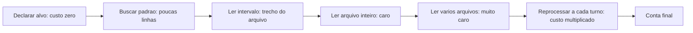

# Capítulo 7: Economia severa de tokens: as configurações reais

## 1. Introdução

No Capítulo 6, você estabilizou o prefixo e passou a pagar leitura de cache em vez de preço cheio. Isso resolve o lado do desconto. Falta o lado do volume: mesmo com desconto, o que você envia continua sendo a conta. Neste capítulo, entram as configurações concretas que cortam consumo sem cortar qualidade — as regras que separam um harness caro de um harness econômico.

Ao final, você terá um conjunto de configurações reais para copiar, um protocolo de compressão de saída, um orçamento por fase de trabalho e a disciplina de saber onde gastar tokens de propósito.

**Resumo em uma frase:** economia severa não é cortar contexto — é gastar o token caro só onde ele compra decisão.

## 2. Explica

Os termos da casa: LLM é o modelo que gera texto; token é a unidade mínima que ele processa; harness é a camada que decide o que entra na janela e o que é verificado depois.

Economia de tokens tem três alavancas, e elas têm ordens de grandeza diferentes. A primeira é **não buscar o que não precisa** — a leitura preguiçosa, que reduz a entrada em ordens de magnitude. A segunda é **comprimir o que já entrou**, que reduz volume em fatores de três a dez. A terceira é **reduzir a verbosidade da saída**, que corta o token mais caro do sistema: o token gerado custa tipicamente várias vezes o token lido [1].

Comece pela alavanca mais rentável, que é também a mais contraintuitiva: **a hierarquia de custo das operações de leitura**. Abrir um arquivo inteiro custa o tamanho do arquivo; buscar por padrão custa algumas linhas; declarar onde está custa nada. Um agente disciplinado nunca abre um arquivo sem saber o que procura. Essa inversão — buscar antes de abrir — é a diferença entre um harness que opera em 20.000 tokens de contexto e outro que opera em 200.000 [2].

A segunda alavanca é o **protocolo de compressão**. Saídas de comando, logs e resultados de teste têm uma propriedade estatística útil: os primeiros itens e o resumo final carregam quase toda a informação acionável. O miolo é repetição. Comprimir mantendo cabeça e cauda — e declarando quantas linhas foram omitidas — preserva a capacidade de decisão do agente e reduz o volume drasticamente [3]. É uma compressão com perda declarada, o que é diferente de uma perda silenciosa: o agente sabe que existe um miolo e pode pedi-lo se necessário.

A terceira alavanca é a **economia de saída**, e ela é a mais mal compreendida. Tokens de saída custam mais que tokens de entrada, e o agente gasta saída em três lugares: raciocínio intermediário, texto explicativo e conteúdo real. A configuração econômica ataca os dois primeiros. Raciocínio pode ser limitado por orçamento explícito; texto explicativo pode seguir um protocolo de estilo obrigatório — telegráfico, sem preâmbulo, sem saudação, sem reafirmar o pedido. O conteúdo real é o único que deve receber saída generosa [4].

Existe um quarto fator, menos citado e muito poderoso: **a granularidade da delegação**. Um subagente com contexto próprio gasta entrada para ler material pesado e devolve apenas um resumo compacto. O pai nunca vê as 3.000 linhas lidas — vê 200 linhas de conclusão. É a mesma lógica da compressão, aplicada à arquitetura em vez de ao texto, e por isso o Capítulo 11 volta a ela.

Agora, o ponto que diferencia economia de mesquinharia. **Há tokens que você deve gastar de propósito.** Três categorias: (1) contexto que muda uma decisão de arquitetura — ler o schema real evita inventar um modelo de dados errado; (2) verificação que evita retrabalho — vale gastar um punhado de tokens validando um artefato antes de gerar páginas inteiras dependentes dele; (3) instrução que elimina ambiguidade — poucas linhas de critério de pronto valem mais do que vários turnos de tentativa e erro. Economia severa não é minimização cega: é alocação consciente.

Isso sugere a formulação de orçamento que usaremos como referência: **o token não é um custo uniforme, é um investimento com retorno variável**. Um harness maduro tem fases, e cada fase tem um orçamento — fase de descoberta gasta mais leitura; fase de geração gasta mais saída; fase de verificação gasta quase nada e protege tudo o que veio antes. O erro comum é aplicar a mesma política de economia em todas as fases, cortando justamente onde o token compra segurança.

Fechando a parte conceitual: existem **limites duros** que se deve configurar e **limites moles** que se deve negociar. Limite duro é o teto de linhas de uma ferramenta, o máximo de tokens de saída, o número de turnos permitido para uma tarefa. Limite mole é a instrução de estilo de resposta. Duros são impostos pelo código do harness; moles dependem da obediência do modelo. Você já sabe, desde o Capítulo 2, em qual dos dois confiar.

## 3. Ilustra

Na cabine, a economia severa é a **lista de peso e balanceamento**. Não se embarca "tudo que pode ser útil": embarca-se o que o voo exige, com peso calculado, e cada item tem justificativa. O combustível é caro demais para ser desperdiçado com bagagem que ninguém vai abrir — mas ninguém economiza combustível deixando de levar o instrumento de navegação.



Repare no último nó: o custo de uma leitura não termina na leitura. Se ela entra no histórico e o prefixo é reenviado, aquele conteúdo é pago em todos os turnos seguintes. A economia severa acontece, portanto, na **decisão de leitura** — não na edição do que já entrou.

## 4. Técnica

Esta é a seção das configurações para copiar. Cada bloco é uma decisão com efeito medível.

### Configuração 1: hierarquia de leitura obrigatória

Coloque na instrução persistente a ordem de operações de leitura. É a regra com maior retorno por linha do livro inteiro.

```markdown
### Ordem obrigatoria de leitura
1. Antes de abrir qualquer arquivo, declare o que procura.
2. Use busca por padrao para localizar a linha.
3. Leia apenas o intervalo necessario (offset + limite).
4. Abra o arquivo inteiro SOMENTE se ele tiver menos de 200 linhas.
5. Nunca leia dois arquivos grandes no mesmo turno.
```

### Configuração 2: teto e compressão em toda ferramenta

Teto é limite duro: não depende de obediência do modelo.

```python
LIMITE_SAIDA_PADRAO = 200


def teto(texto, primeiras=3, ultimas=4, limite=LIMITE_SAIDA_PADRAO):
    linhas = texto.splitlines()
    if len(linhas) <= limite:
        return texto
    omitidas = len(linhas) - primeiras - ultimas
    return "\n".join(linhas[:primeiras] + [f"... [{omitidas} linhas omitidas] ..."] + linhas[-ultimas:])
```

Aplique a **saída de todo comando**, não só a logs: resultado de testes, busca, listagem de diretório, diff e resposta de API.

### Configuração 3: orçamento de saída por fase

Cada fase do trabalho tem um perfil de gasto diferente. Declarar isso evita que o agente escreva prosa em fase de verificação.

```yaml
orcamento_por_fase:
  descoberta:
    tokens_saida_alvo: 800
    regra: "listar achados, sem explicar"
  geracao:
    tokens_saida_alvo: 6000
    regra: "conteudo real; nada de preambulo"
  verificacao:
    tokens_saida_alvo: 300
    regra: "apenas veredito e localizacao de falhas"
  relato:
    tokens_saida_alvo: 500
    regra: "telegrafico: caminho, numero, veredito"
teto_de_turnos_por_tarefa: 25
```

### Configuração 4: protocolo de estilo da resposta

Estilo é limite mole, mas com efeito grande em saída cumulativa ao longo de uma sessão.

```markdown
### Protocolo de resposta
- Sem saudacao, sem preambulo, sem reafirmar o pedido.
- Sem resumo do que acabou de ser feito, salvo pedido explicito.
- Listas em vez de paragrafos quando houver 3+ itens.
- Nunca repetir o conteudo de um arquivo ja mostrado: citar caminho e linha.
- Se a resposta passar de 400 palavras, ela precisa de subtitulos.
```

### Configuração 5: limpeza de resultado de ferramenta já consumido

Existe uma técnica com ganho desproporcional em sessões longas: **descartar o resultado de ferramenta que já foi consumido**. Se o agente leu um arquivo, usou a informação e seguiu, não há razão para pagar aquele conteúdo em todos os turnos seguintes [3].

```json
{
  "politica_resultado_ferramenta": {
    "apos_consumo": "substituir por resumo de 1 linha",
    "exemplo": "[resultado de run_tests: 34 passaram, 0 falharam]",
    "excecao": "se o agente declarar que precisara reusar, manter integral"
  }
}
```

### Configuração 6: delegação comprimida

Quando a leitura é pesada, isole: o subagente lê muito e devolve pouco.

```yaml
subagente:
  papel: "investigador"
  entrada: "pergunta objetiva"
  saida_maxima_tokens: 250
  formato_saida: "lista de achados com caminho:linha"
  proibido: "colar trechos de codigo; apenas referenciar"
```

### Tabela de decisão: onde economizar e onde não

| Situação | Economizar? | Por quê |
|---|---|---|
| Ler arquivo para localizar um símbolo | sim, sempre | busca responde em 1% do custo |
| Ler schema do banco antes de modelar | não | erro de modelo custa geração inteira |
| Rodar verificação antes de gerar 10 páginas | não | previne retrabalho massivo |
| Explicar o que já foi feito | sim | não compra decisão |
| Ler o mesmo arquivo pela terceira vez | sim (memorizar) | repetição pura |
| Instrução de critério de pronto | não | 200 tokens por 10 turnos |
| Formatar saída de ferramenta usada | sim | resultado já consumido |

### Configuração 7: tesoura de boilerplate

A maior parte do texto que o agente lê todo dia não é informação: é cerimônia. Cabeçalhos de licença, blocos de import que ninguém usa, comentários de changelog, instruções duplicadas em três arquivos de configuração diferentes. Cada linha dessas é combustível queimado sem que o avião saia do chão.

A tesoura tem quatro cortes que rendem mais que todos os outros:

1. **Deduplique instrução.** Se a mesma regra aparece em `AGENTS.md`, em uma rule e em uma skill, o agente lê três vezes e obedece uma. Escolha um dono por regra e deixe os outros dois apenas apontando.
2. **Cole por ponteiro, não por cópia.** Um bloco de convenções que vale para dez projetos mora em um arquivo e é referenciado por caminho. Cópia envelhece, ponteiro não.
3. **Separe instrução de leitura de instrução de ação.** O agente precisa saber *o que ler* mais do que precisa de um manual de 400 linhas sobre como ler. Descreva o critério, não o procedimento inteiro.
4. **Corte o histórico morto.** Comentários de decisão antiga que já não valem, TODOs de dois anos, código comentado. Se não influencia a próxima edição, não pertence ao contexto lido pelo agente.

O ganho aqui é composto: menos texto reduz o custo de leitura direta e ao mesmo tempo aumenta a probabilidade de o prefixo permanecer estável o suficiente para acertar o cache.

### Configuração 8: o painel de tokens por sessão

Economia severa sem medição é superstição. Você precisa de um painel — quatro números, nada mais, atualizados ao fim de cada sessão:

| Indicador | O que mede | Sinal de alarme |
|---|---|---|
| Tokens de entrada por turno | Peso do contexto carregado | Crescendo turno a turno sem mudança de tarefa |
| Tokens de saída por turno | Verbosidade do agente | Muito acima do tamanho da resposta útil |
| Chamadas de ferramenta por turno | Dispersão de busca | Muitas leituras para poucas decisões |
| Turnos até a primeira edição correta | Eficácia do contexto | Alto com contexto pequeno = falta de sinal |

O quarto indicador é o mais importante e o mais ignorado. Um agente que gasta pouquíssimo token mas precisa de doze turnos para acertar uma edição é *mais caro* do que um agente que gasta o dobro e acerta na primeira vez, porque cada turno de retrabalho carrega o contexto inteiro de novo. Economia severa não é minimizar tokens: é minimizar o produto entre tokens e turnos desperdiçados.

### Configuração 9: orçamento com teto duro

Toda configuração anterior pressupõe que o gasto é discreto. Existe, porém, uma classe de falha em que o agente entra em laço e o consumo cresce sem retorno — o equivalente a um alarme que ninguém programou.

A defesa é um teto duro, com três camadas:

- **Teto por turno.** Um limite de tokens de saída por resposta. Ao atingir, o agente para e resume — não continua truncado.
- **Teto por tarefa.** Um limite acumulado para a tarefa inteira. Ao atingir, o sistema não mata o trabalho: ele *escala* — grava o estado, para e devolve o controle ao operador com um resumo do que já foi feito.
- **Teto por sessão.** Um limite de janela. Ao atingir, a sessão é encerrada com relatório — nunca com uma parede silenciosa.

O ponto de projeto é que o teto nunca deve produzir perda de trabalho. Um teto que mata o processo no meio de uma edição deixa o repositório em estado ambíguo; um teto que persiste o estado e devolve o controle mantém a cabine sob comando humano.

### Configuração 10: os nove vazamentos silenciosos

Os gastos que mais assustam no extrato não vêm de uma decisão cara isolada. Vêm de nove vazamentos pequenos, repetidos centenas de vezes:

1. **Saída de ferramenta não comprimida.** Um comando de build que devolve 4 mil linhas quando as 20 úteis estão no topo e no fim.
2. **Leitura integral de arquivo grande.** Puxar 2 mil linhas para editar três.
3. **Contexto reescrito a cada turno.** O bloco de estado que muda de formato e derrota o cache.
4. **Listagem recursiva de diretório.** Enumerar milhares de caminhos que não serão usados.
5. **Repetição de análise.** Dois subagentes investigando a mesma pergunta por falta de contrato.
6. **Verbosidade de estilo.** Explicações longas sobre o que o agente acabou de fazer — o mesmo arquivo de convenções de estilo que o capítulo 7 introduziu.
7. **Retentativa sem diagnóstico.** Rodar de novo o comando que falhou sem ler o erro.
8. **Instrução duplicada lida três vezes.** A cerimônia do Passo anterior.
9. **Contexto de ferramenta que nunca é descartado.** O resultado já consumido que continua ocupando janela até o fim da sessão.

Cada vazamento, isolado, é irrelevante. Somados, explicam por que duas equipes que usam o mesmo modelo relatam custos que diferem em uma ordem de grandeza. A diferença raramente está no modelo: está no número de torneiras abertas na cabine.

## 5. Aplica

**A cena.** Uma consultoria mantém um agente que documenta sistemas legados. Cada documento sai bom, mas o custo por entrega incomoda. Ao instrumentar, você vê uma sessão típica: 118 turnos, 1,4 milhão de tokens de entrada, 62 mil de saída. O agente lê, em média, 9 arquivos completos por documento — muitos deles relidos em turnos diferentes, porque "esqueceu" que já tinha lido.

O diagnóstico tem três camadas. A primeira é ausência de hierarquia de leitura: o agente nunca busca, sempre abre. A segunda é ausência de teto: um comando de listagem devolveu 812 linhas que ficaram no envelope de voo até o fim. A terceira é a mais interessante — releitura. Sem memória externa, o agente não sabe que já abriu aquele arquivo no turno 20, então abre de novo no turno 47.

A correção usa as seis configurações deste capítulo. Hierarquia de leitura obrigatória na instrução. Teto de 200 linhas em toda ferramenta. Limpeza de resultado consumido. Um arquivo de estado simples (`docs/lidos.md`) com a lista de arquivos já lidos e a conclusão extraída de cada um — memória externa que substitui releitura. E delegação comprimida para a varredura inicial do repositório. Resultado: 118 turnos caíram para 41; entrada caiu 78%; e a qualidade melhorou, porque o agente passou a trabalhar com achados em vez de arquivos inteiros.

**Métricas.** Acompanhe: tokens de entrada por entrega; número de leituras de arquivo por documento; proporção de releituras (arquivo lido mais de uma vez na mesma sessão); turnos por entrega; e tokens de saída gastos em prosa sem conteúdo (meta: abaixo de 15% da saída total).

**Armadilhas comuns.** (a) *Cortar contexto que mudava decisão*: economia que gera retrabalho é prejuízo disfarçado. (b) *Protocolo de estilo sem teto duro*: instrução de brevidade que o modelo ignora em respostas longas — combine com limite de saída. (c) *Comprimir demais e perder o sinal*: omitir as três primeiras linhas de um erro é pior que não comprimir. (d) *Delegação sem limite de retorno*: subagente que devolve 4.000 tokens anula o ganho. (e) *Otimizar saída antes de leitura*: a alavanca maior fica intocada.

**Segunda cena.** Uma equipe implementa teto rigoroso de tokens em todas as ferramentas e vê o custo cair — junto com a qualidade. O agente passa a tomar decisões com informação truncada e produz edições que precisam de correção. O custo total da tarefa, somado o retrabalho, sobe. A correção é diferenciada: teto apertado em leitura exploratória, teto generoso em saída de teste e resultado de build, porque ali o detalhe é justamente o sinal. Economia severa é seletiva por natureza — cortar tudo igual é a forma mais rápida de gastar mais.

**Erros de julgamento.** O primeiro é confundir economia com corte uniforme. O segundo é otimizar o custo do turno isolado e ignorar o custo da tarefa. O terceiro é contar tokens apenas como número, sem identificar de onde eles vêm — sem atribuição por origem, não há decisão de corte defensável. O quarto é tratar orçamento como assunto financeiro e não como critério de engenharia, deixando de usar a restrição como força de projeto.

**Antipadrão observável.** Quando o operador não consegue dizer qual bloco de contexto consumiu mais na última sessão, o painel está incompleto. Medição sem atribuição por origem informa que houve gasto, mas não mostra a torneira aberta.

### Síntese operacional

| Decisão | Corte recomendado | Justificativa |
|---|---|---|
| Resultado de busca exploratória | Agressivo | O detalhe raramente muda a decisão |
| Saída de teste que falhou | Nenhum | O erro exato é o sinal |
| Resultado de build bem-sucedido | Agressivo | O topo e o fim bastam |
| Arquivo de estado da tarefa | Nenhum | É a memória da sessão |
| Histórico de turnos antigos | Total, com ponteiro | Reproduzível sob demanda |

Três regras que ficam com quem opera:

- **Meça por origem.** Sem saber qual bloco consumiu mais, todo corte é palpite.
- **Teto nunca trunca em silêncio.** Ao atingir o limite, o agente resume e sinaliza — não entrega resposta pela metade.
- **Economia que aumenta retrabalho não é economia.** Compare sempre custo por entrega aceita, não custo por turno.

### Nota do revisor

Os três desvios mais comuns neste capítulo, em ordem de frequência:

1. **Corte uniforme em todas as saídas.** Truncar igualmente o log de erro e a lista de arquivos destrói o sinal mais valioso da sessão. A política de teto precisa ser por natureza de saída.
2. **Instrução duplicada.** A mesma regra em três arquivos é lida três vezes por turno, todo turno. É o vazamento mais fácil de cortar e o mais frequentemente ignorado.
3. **Economia declarada sem painel.** Sem os quatro números por sessão, a redução de custo é anedota. Medir é o que transforma corte em engenharia.

### Exercício de bancada

Quatro tarefas curtas para fixar a economia seletiva:

1. **Painel de quatro números.** Monte a planilha mínima por sessão — tokens de entrada, tokens de saída, chamadas de ferramenta e turnos até a primeira edição correta. Sem ela, toda otimização é palpite.
2. **Atribuição por origem.** Classifique o consumo da última sessão por origem — instrução, resultado de ferramenta, histórico, saída de modelo — e identifique a maior torneira aberta.
3. **Tesoura de boilerplate.** Encontre uma instrução duplicada em dois arquivos, escolha um dono e transforme o outro em ponteiro. Meça a diferença na leitura média por turno.
4. **Teto honesto.** Defina um teto por tarefa que, ao ser atingido, persiste o estado e devolve o controle ao operador com resumo — nunca deixa o repositório em estado ambíguo.

## 6. Conclusão

Você recebeu seis configurações concretas e um critério para usá-las. Primeiro: a maior parte da economia vem da hierarquia de leitura — buscar antes de abrir, recortar antes de ler inteiro. Segundo: compressão de saída de ferramenta e limpeza de resultado consumido cortam volume sem cortar capacidade de decisão. Terceiro: economia severa é alocação, não avareza — há tokens que compram segurança e devem ser gastos sem hesitação.

**Seu turno.** Aplique as configurações 1, 2 e 5 no seu harness (hierarquia de leitura, teto, limpeza de resultado consumido) e meça tokens de entrada por entrega antes e depois. Depois escreva o orçamento por fase da sua esteira.

- [ ] Hierarquia de leitura obrigatória escrita na instrução persistente
- [ ] Teto de linhas aplicado a todas as ferramentas
- [ ] Política de limpeza de resultado consumido ativa
- [ ] Orçamento de saída declarado por fase
- [ ] Medição antes/depois de tokens por entrega

No próximo capítulo, você generaliza tudo isso em um método: as quatro operações de contexto — escrever, selecionar, comprimir e isolar — e quando cada uma compensa.

## 7. Referências

[1] GOOGLE CLOUD. *Prompt caching — Claude partner models*. Disponível em: https://docs.cloud.google.com/gemini-enterprise-agent-platform/models/partner-models/claude/prompt-caching. Acesso em: 12 set. 2026.
[2] ANTHROPIC. *Effective context engineering for AI agents*. Disponível em: https://www.anthropic.com/engineering/effective-context-engineering-for-ai-agents. Acesso em: 12 set. 2026.
[3] ANTHROPIC. *Context engineering: memory, compaction, and tool clearing*. Disponível em: https://platform.claude.com/cookbook/tool-use-context-engineering-context-engineering-tools. Acesso em: 12 set. 2026.
[4] LANGCHAIN. *Context Engineering*. Disponível em: https://www.langchain.com/blog/context-engineering-for-agents. Acesso em: 12 set. 2026.
[5] ANTHROPIC. *Explore the context window — Claude Code Docs*. Disponível em: https://code.claude.com/docs/en/context-window. Acesso em: 12 set. 2026.
[6] SOURCEGRAPH. *Context Engineering: A Practical Guide for AI Agents*. Disponível em: https://sourcegraph.com/blog/context-engineering. Acesso em: 12 set. 2026.
[7] KONISHI, Hidekazu. *Anthropic Claude API Prompt Caching and Token Efficiency*. Disponível em: https://hidekazu-konishi.com/entry/anthropic_claude_api_prompt_caching_and_token_efficiency.html. Acesso em: 12 set. 2026.
[8] ANTHROPIC. *All settings — Claude Code Docs*. Disponível em: https://code.claude.com/docs/en/settings-reference. Acesso em: 12 set. 2026.
[9] ANTHROPIC. *Subagents in the SDK — Claude Code Docs*. Disponível em: https://code.claude.com/docs/en/agent-sdk/subagents. Acesso em: 12 set. 2026.
[10] ANTHROPIC. *Agent Skills — Overview*. Disponível em: https://platform.claude.com/docs/en/agents-and-tools/agent-skills/overview. Acesso em: 12 set. 2026.
[11] ANTHROPIC. *Hooks reference — Claude Code Docs*. Disponível em: https://code.claude.com/docs/en/hooks. Acesso em: 12 set. 2026.
[12] MODEL CONTEXT PROTOCOL. *Server Features — Tools*. Disponível em: https://modelcontextprotocol.io/specification/2026-07-28/server/tools. Acesso em: 12 set. 2026.
[13] WANG, Lei et al. *A survey on large language model based autonomous agents*. Disponível em: https://doi.org/10.1007/s11704-024-40231-1. Acesso em: 12 set. 2026.
[14] XU, Weikai et al. *LLM-Based Agents for Tool Learning: A Survey*. Disponível em: https://doi.org/10.1007/s41019-025-00296-9. Acesso em: 12 set. 2026.
[15] MOHAMMADI, Mahmoud et al. *Evaluation and Benchmarking of LLM Agents: A Survey*. Disponível em: https://doi.org/10.1145/3711896.3736570. Acesso em: 12 set. 2026.
[16] KWON, Woosuk et al. *Efficient Memory Management for Large Language Model Serving with PagedAttention*. Disponível em: https://arxiv.org/abs/2309.06180. Acesso em: 12 set. 2026.
[17] ORCA. *What is Orca? — Orca Docs*. Disponível em: https://www.onorca.dev/docs. Acesso em: 12 set. 2026.
[18] GIT. *git-worktree — Referência oficial*. Disponível em: https://git-scm.com/docs/git-worktree. Acesso em: 12 set. 2026.
[19] ARXIV. *Agent Skills for Large Language Models: Architecture, Acquisition and Progressive Disclosure*. Disponível em: https://arxiv.org/html/2602.12430v3. Acesso em: 12 set. 2026.
[20] CURSOR. *Rules — Cursor Docs*. Disponível em: https://cursor.com/docs/rules. Acesso em: 12 set. 2026.
