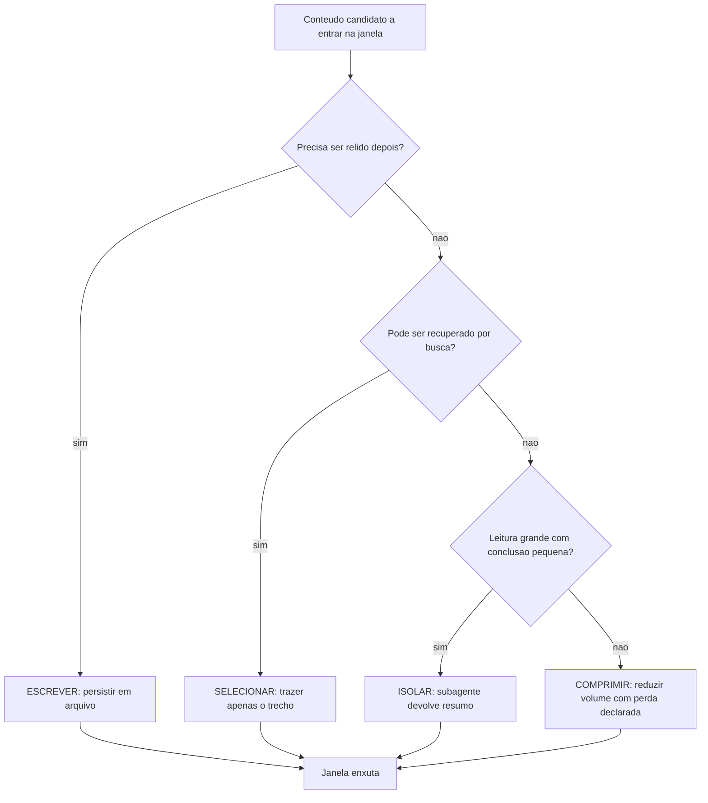

# Capítulo 8: Otimização de contexto: selecionar, comprimir, isolar

## 1. Introdução

Nos três capítulos anteriores, você mediu, estabilizou e cortou. Agora vamos generalizar: existe um método por trás de todas essas decisões, e ele tem quatro operações. Quem domina as quatro para de resolver economia de contexto caso a caso e passa a projetar harnesses que já nascem econômicos.

Ao final, você vai saber aplicar escrever, selecionar, comprimir e isolar em qualquer projeto; vai escolher a operação certa para cada tipo de conteúdo; e vai saber quando contexto grande é inevitável — e o que fazer então.

**Resumo em uma frase:** otimizar contexto é escolher uma das quatro operações antes de colocar qualquer coisa na janela.

## 2. Explica

Os termos da casa: LLM é o modelo que gera texto; token é a unidade mínima que ele processa; harness é a camada que decide o que entra na janela. E context engineering é a disciplina de curar o conjunto ótimo de tokens durante a inferência. Vale fixar ainda dois termos que voltam adiante: hook é um comando que o harness dispara automaticamente em um evento do ciclo de vida do agente; checkpoint é um ponto de salvamento do estado da tarefa, usado para retomar o trabalho sem recomeçar.

A literatura de contexto para agentes converge para quatro operações, com nomes que variam entre autores mas conteúdo estável [1][2][3]: **escrever** (tirar informação de dentro da janela e guardá-la fora), **selecionar** (trazer para a janela apenas o que importa agora), **comprimir** (reduzir o volume do que já está na janela) e **isolar** (processar em outro contexto e trazer apenas o resultado). Vamos examinar cada uma, com o critério de quando compensa.

**Escrever** é a operação mais barata e a mais ignorada. Consiste em persistir fora da janela aquilo que não precisa ser relido: decisões tomadas, arquivos já analisados, conclusões parciais. Um arquivo `decisoes.md` com cinco linhas economiza releituras e, mais importante, sobrevive ao fim da sessão [2]. O critério é simples: se a informação vai ser necessária de novo, ela deve viver em um arquivo, não no histórico.

**Selecionar** é a operação que decide o que entra. Aqui o princípio é a busca por relevância em vez de carregamento por proximidade: em vez de "abrir os arquivos que parecem relacionados", faça "recuperar os trechos que respondem à pergunta". Em projetos maiores, isso toma a forma de índice ou recuperação semântica; em projetos pequenos, de busca textual disciplinada. O ganho é proporcional ao tamanho do repositório — em monorepos, selecionar é a diferença entre viabilidade e inviabilidade [4].

**Comprimir** é reduzir o volume do que já entrou. Tem duas variantes: compressão sem perda aparente (resumir um log mantendo cabeça e cauda) e compactação de histórico (substituir os turnos antigos por um resumo do que foi decidido) [3]. A compactação tem um custo cognitivo real: o agente perde detalhes que podem importar depois. Por isso ela deve preservar, explicitamente, decisões, restrições e nomes de artefatos — e descartar primeiro a conversa intermediária.

**Isolar** é a operação mais poderosa e a mais subutilizada. Em vez de trazer 3.000 linhas para o contexto principal, delega-se a leitura a um processo com contexto próprio, que devolve um resumo. O contexto principal nunca paga o volume [5][6]. O critério para isolar é a assimetria entre o que se lê e o que se conclui: leitura grande com conclusão pequena é o caso perfeito.

A escolha entre as quatro operações segue uma ordem de preferência, do mais barato ao mais caro: primeiro **escreva** o que não precisa ficar; depois **selecione** o mínimo necessário; depois **isole** quando a desproporção leitura/conclusão for grande; por último **comprima**, porque comprimir aceita perda e a perda é irreversível.

Há um segundo eixo, mais sutil: **a janela não é o único lugar onde o contexto vive**. Um harness maduro tem camadas: a janela (caro e volátil), o estado em arquivo (barato e persistente), o índice consultável (barato e seletivo) e a memória de longo prazo entre sessões. A maior parte dos problemas de contexto é, na verdade, um problema de alocação entre camadas — informação que deveria estar em arquivo está na janela; informação que deveria estar no índice está sendo carregada inteira [2][4].

E existe um terceiro eixo, que é o mais desconfortável: **nem todo contexto grande é evitável**. Tarefas de refatoração ampla, migração de framework ou auditoria de segurança precisam de visão global. Nesses casos, a estratégia não é cortar, é **fatiar**: dividir a tarefa em unidades que caibam em janelas separadas, com contrato explícito entre elas. É exatamente o princípio que reaparece no Capítulo 11, com subagentes, e no Capítulo 12, com worktrees.

Uma advertência final sobre uma armadilha conceitual: contexto não é memória, e tratá-los como sinônimos causa confusão. Memória é o que persiste; contexto é o que está visível agora. Um agente com ótima memória e contexto poluído continua decidindo mal; um agente com memória pobre mas contexto limpo decide bem e esquece rápido. O equilíbrio correto é memória externa generosa e contexto enxuto — a combinação que os harnesses maduros convergem a adotar.

## 3. Ilustra

Na cabine, as quatro operações têm equivalentes diretos. **Escrever** é o diário de bordo: registro fora da cabeça, consultável quando necessário. **Selecionar** é a carta de aproximação do aeroporto de destino — você não carrega o atlas inteiro. **Comprimir** é o resumo meteorológico: "vento 15 nós, teto 2.000 pés" em vez de dez páginas de dados brutos. **Isolar** é o copiloto fazendo a checagem completa e reportando "trem travado, três verdes" — o piloto não refaz a checagem na cabeça.



A ordem do diagrama não é estética: ela é econômica. Escrever e selecionar não perdem informação; comprimir perde. Por isso a compressão fica por último — é o recurso de quem já tentou as outras três.

## 4. Técnica

Esta seção entrega as quatro operações como artefatos concretos: um arquivo de estado, uma função de seleção, uma política de compactação e um contrato de isolamento.

### Operação 1: escrever — o arquivo de estado da tarefa

Toda tarefa longa deveria ter um arquivo de estado. Ele é a memória externa que substitui o histórico da conversa.

```markdown
# Estado da tarefa: migrar autenticacao para JWT

### Decisoes tomadas
- Assinatura HS256 com segredo em variavel de ambiente.
- Refresh token com validade de 7 dias; access token de 15 minutos.

### Arquivos ja analisados
- app/auth/legacy.py — define validate_session(), que sera removida.
- app/middleware.py — injeta usuario no request; precisa do novo token.

### Restricoes descobertas
- Nao alterar contrato de /login: clientes moveis dependem do formato atual.

### Proximo passo
- Escrever middleware novo e manter o antigo atras de flag por 1 release.
```

Cinco seções, todas com valor de retomada. Quando a sessão morre ou estoura o contexto, este arquivo é o contexto que sobrevive.

### Operação 2: selecionar — função de recuperação com orçamento

Selecionar bem é selecionar com teto. Esta função devolve os trechos mais relevantes, respeitando um orçamento explícito.

```python
def selecionar(consulta, arquivos, orcamento_linhas=120):
    """Retorna trechos relevantes ordenados por densidade de ocorrencia."""
    termos = [t.lower() for t in consulta.split() if len(t) > 3]
    achados = []
    for caminho in arquivos:
        linhas = caminho.read_text(encoding="utf-8", errors="replace").splitlines()
        for i, linha in enumerate(linhas):
            texto = linha.lower()
            pontos = sum(texto.count(t) for t in termos)
            if pontos:
                achados.append((pontos, caminho, i, linha.strip()))
    achados.sort(key=lambda x: -x[0])
    return achados[:orcamento_linhas]
```

O parâmetro de orçamento é o que impede a função de virar um carregador disfarçado. Sem teto, "selecionar" degenera em "trazer tudo que casa o termo".

### Operação 3: comprimir — política de compactação que preserva o essencial

Compactar histórico é perder informação. Faça a perda ser consciente, com lista explícita do que nunca pode ser descartado.

```yaml
politica_compactacao:
  gatilho: "contexto acima de 70% da janela"
  preservar_sempre:
    - "decisoes tomadas e seu motivo"
    - "restricoes e contratos declarados"
    - "caminhos de arquivo e nomes de simbolos"
    - "falhas nao resolvidas"
  descartar_primeiro:
    - "conversa intermediaria de ajuste"
    - "resultados de ferramenta ja consumidos"
    - "repeticoes de leitura"
  registrar: "gravar resumo no arquivo de estado antes de compactar"
```

O último campo é o mais importante: **compactar sem persistir é perder**. Grave primeiro, compacte depois.

### Operação 4: isolar — contrato de delegação

Isolamento só funciona com contrato. Sem ele, o subagente devolve um texto longo e você perde o ganho.

```json
{
  "papel": "investigador-de-codigo",
  "pergunta": "quais pontos do repositorio dependem do contrato de /login?",
  "limite_leitura": "sem restricao",
  "limite_retorno_tokens": 250,
  "formato_retorno": "lista: caminho:linha — motivo em ate 12 palavras",
  "proibido": ["colar trechos maiores que 3 linhas", "sugerir implementacao"]
}
```

### Como escolher a operação

| Conteúdo | Operação | Motivo |
|---|---|---|
| Decisão tomada na tarefa | escrever | será necessário de novo |
| Arquivo de 2.000 linhas, interesse em 1 símbolo | selecionar | busca responde por 1% do custo |
| Log de 900 linhas | comprimir | cabeça e cauda carregam o sinal |
| Varredura de 40 arquivos | isolar | leitura grande, conclusão pequena |
| Histórico de 60 turnos | comprimir + escrever | compactar e persistir decisões |
| Schema de banco antes de modelar | selecionar | erro aqui custa geração inteira |

### Operação 5: recupere por estrutura antes de ler

A leitura linear de arquivos é o método mais caro de descobrir onde está a informação. Existe uma ordem de preferência que reduz o consumo em uma ordem de grandeza:

1. **Buscar o símbolo.** Encontrar a definição e as referências de uma função custa uma fração do custo de ler o arquivo inteiro.
2. **Ler a assinatura, não o corpo.** Nomes, parâmetros e tipos dizem o que uma unidade faz. O corpo só é necessário quando a assinatura é insuficiente.
3. **Ler a janela, não o arquivo.** Depois de localizar a linha, leia algumas dezenas de linhas em volta. Nunca o arquivo todo.
4. **Usar o índice do projeto.** Quando existe um grafo de dependências construído, a pergunta "quem usa isso" é respondida sem abrir arquivo nenhum.

A regra que resume a operação: **cada nível da hierarquia só é aberto quando o nível anterior foi insuficiente para decidir.** É a aplicação direta do princípio de divulgação progressiva que rege as skills.

### Operação 6: memória entre sessões

Contexto é volátil por natureza: a sessão termina e o que ela descobriu morre com ela. O desperdício mais caro de todos, portanto, é *redescobrir*. A operação de memória tem duas peças:

- **Notas de sessão.** Ao final de cada sessão, um arquivo curto registra o que foi decidido, o que ficou em aberto, quais restrições foram descobertas e qual é o próximo passo. Não é um diário: é a lista de verificação do próximo piloto.
- **Aprendizados duráveis.** Quando um problema custa várias tentativas para ser resolvido, o caminho que funcionou é promovido a uma nota permanente: como alcançar o ambiente de produção, onde ficam as credenciais, qual comando revela o estado. A próxima sessão começa sabendo, em vez de investigando.

O critério de promoção é simples e vale a pena ser explícito: **se levou mais de duas tentativas ou tocou algo não óbvio, vira nota.** O que é óbvio não precisa ser registrado; o que é surpreendente precisa.

### Operação 7: orçamento de janela por fase

A janela de contexto é finita. Gastá-la sem plano é aceitar que a fase mais importante — a decisão — vai acontecer com o contexto já poluído. Um plano de alocação para uma tarefa típica de quatro fases:

| Fase | Participação da janela | Conteúdo dominante |
|---|---|---|
| Compreender | 40% | Instruções estáveis, estado da tarefa, restrições |
| Investigar | 30% | Resultados de busca e leitura, já comprimidos |
| Decidir | 20% | Síntese, opções e critério de escolha |
| Executar e verificar | 10% | Diff, saída de teste, evidência de validação |

A ordem importa: o que é estável fica no começo e sobrevive ao longo de toda a tarefa; o que é volumoso e descartável fica no meio e é limpo cedo; o que prova o resultado fica no fim e é o último a ser comprimido. Uma sessão que inverte essa ordem — começa despejando 200 arquivos e depois tenta raciocinar — não tem plano de contexto. Tem só esperança.

### Operação 8: descarte com rastro

Comprimir contexto sem deixar rastro cria um problema novo: quando o resultado final está errado, ninguém sabe qual informação foi jogada fora. A solução é o descarte auditável — a caixa-preta do contexto.

Três práticas suficientes:

- **Registre a decisão de descarte.** Ao comprimir ou remover um bloco, grave uma linha: o que saiu, por que saiu e como recuperá-lo.
- **Mantenha ponteiros, não conteúdo.** Em vez de guardar o resultado completo de uma busca, guarde o comando que a reproduz. Reproduzir sob demanda é mais barato do que carregar sempre.
- **Nunca descarte evidência de validação.** Saída de teste, diff e log de erro são o que sustenta uma afirmação de conclusão. Contexto que prova é o último a sair da janela.

Com isso, o contexto deixa de ser um lugar onde as coisas aparecem e desaparecem, e passa a ser um instrumento com histórico — exatamente o que a cabine exige para que o voo seja reproduzível, e não apenas bem-sucedido uma vez.

## 5. Aplica

**A cena.** Você assume a liderança técnica de um produto com um agente que faz auditorias de conformidade em um monorepo de 40 mil arquivos. O relatório é bom. O problema aparece no fim do mês: cada auditoria consome contexto até o limite em menos de trinta turnos, e as sessões terminam truncadas — o agente se perde, repete análise já feita e às vezes conclui com base em informação que não leu.

O diagnóstico, ao olhar as sessões, é o colapso das quatro operações em uma só: o harness **carrega** (arquivos por proximidade), não seleciona. Não escreve (nada é persistido fora do histórico). Não isola (toda leitura entra no contexto principal). E comprime mal (resume o histórico descartando justamente as decisões).

A correção tem quatro entregas, uma por operação. Um índice de consulta por diretório, gerado por script, para que a seleção parta de candidatos relevantes e não de todo o repositório. Um arquivo de estado por auditoria, com decisões e restrições, gravado a cada checkpoint. Um subagente investigador com teto de retorno de 250 tokens para as varreduras amplas. E uma política de compactação que preserva decisões e restrições, descartando primeiro a conversa intermediária. Resultado: sessões passaram a completar em 34 turnos médios, sem truncamento, e o custo por auditoria caiu 66%.

**Métricas.** Acompanhe: taxa de sessões que terminam por limite de contexto (meta: abaixo de 5%); proporção de decisões persistidas em arquivo; número de repetições de leitura na mesma sessão; tokens devolvidos por subagente comparados a tokens lidos por ele (razão de compressão de isolamento — meta: acima de 10:1).

**Armadilhas comuns.** (a) *Selecionar sem teto*: recuperação que devolve tudo é carregamento disfarçado. (b) *Compactar sem persistir*: perda definitiva de decisão. (c) *Isolar tarefa que precisa de contexto compartilhado*: o subagente decide sem ver o todo e volta com conclusão desalinhada. (d) *Confundir memória com contexto*: arquivo grande carregado na janela inteira por comodidade. (e) *Fatiar sem contrato*: dividir a tarefa e não definir o que cada fatia entrega ao final.

**Segunda cena.** Um agente completo uma tarefa longa e, no meio dela, esquece uma restrição que havia descoberto no início: o banco de produção não pode ser tocado diretamente. A restrição estava no contexto — mas foi comprimida junto com material descartável. O erro não é de memória do modelo; é de política de compressão sem hierarquia. A correção introduz três classes de informação com destinos distintos: restrição (nunca comprime, vai para o arquivo de estado), decisão (comprime para uma linha), dado bruto (descartável, substituído por ponteiro). Depois disso, a mesma tarefa longa não repete a falha.

**Erros de julgamento.** (a) Comprimir por volume, não por função — o que ocupa mais espaço recebe mais tesoura. (b) Descartar evidência de validação por ser "detalhe técnico". (c) Recuperar por leitura integral quando a ferramenta de busca já responde. (d) Não registrar o que saiu da janela, deixando o agente sem forma de saber que a informação existiu.

**Antipadrão observável.** Quando o agente faz uma pergunta cujo dado já foi apresentado trinta turnos antes, o contexto foi comprimido de forma cega. Um bom sistema mantém a restrição e o critério; descarta a tabela grande e o log de execução.

### Síntese operacional

| Classe de informação | Destino | Nunca fazer |
|---|---|---|
| Restrição e proibição | Bloco de estado, íntegro | Comprimir junto com dados |
| Decisão tomada | Uma linha no estado | Repetir o raciocínio completo |
| Dado bruto consultado | Ponteiro reproduzível | Manter o conteúdo na janela |
| Evidência de validação | Fim da janela, preservada | Descartar antes da entrega |
| Convenção do projeto | Prefixo estável | Reordenar a cada edição |

Três regras que ficam com quem opera:

- **Recupere por nível.** Símbolo antes de assinatura, assinatura antes de corpo, corpo antes de arquivo inteiro.
- **Registre o descarte.** O que saiu da janela precisa deixar rastro de como voltar.
- **Proteja o que prova.** O que sustenta a afirmação de conclusão é o último a ser comprimido.

### Nota do revisor

Os três desvios mais comuns neste capítulo, em ordem de frequência:

1. **Compressão por volume.** A tesoura vai onde ocupa mais espaço, e com isso corta a restrição — que é curta — junto com o log — que é longo e descartável. Comprima por função.
2. **Leitura integral como primeiro reflexo.** Abrir o arquivo inteiro para responder uma pergunta de uma linha é o maior consumidor isolado de janela em sessões de depuração.
3. **Descarte sem registro.** Depois de algumas compressões, ninguém sabe mais qual informação saiu — e o diagnóstico de um erro passa a ser arqueologia.

### Exercício de bancada

Quatro tarefas curtas para fixar as operações de contexto:

1. **Arquivo de estado.** Crie o bloco de estado da tarefa no formato do capítulo — decisões, arquivos já analisados, restrições descobertas e próximo passo — e comece a próxima sessão a partir dele.
2. **Recuperação em níveis.** Escolha um símbolo do projeto e responda uma pergunta sobre ele percorrendo a hierarquia: busca, assinatura, janela. Compare o consumo com o da leitura integral do arquivo.
3. **Política de compactação.** Escreva, em uma página, o que nunca comprime e o que é sempre descartável. A restrição de domínio é o primeiro item da lista.
4. **Rastro de descarte.** Ao remover um bloco da janela, registre o que saiu, por que saiu e como recuperá-lo. Depois simule um erro e verifique se é possível reconstruir a informação.

## 6. Conclusão

Você agora tem um método, não um conjunto de truques. Primeiro: quatro operações — escrever, selecionar, isolar e comprimir —, aplicadas nessa ordem de preferência, porque comprimir é a única que perde informação. Segundo: a maior parte dos problemas de contexto é problema de alocação entre camadas, não de tamanho de janela. Terceiro: quando o contexto grande é inevitável, a saída é fatiar com contrato, não cortar às cegas.

**Seu turno.** Escolha a tarefa mais longa do seu fluxo atual e aplique as quatro operações em sequência: escreva o arquivo de estado, selecione com orçamento, isole a leitura pesada e só então defina a política de compactação. Compare turnos e custo antes e depois.

- [ ] Arquivo de estado da tarefa criado e atualizado em checkpoints
- [ ] Seleção com orçamento explícito implementada
- [ ] Varredura pesada delegada a subagente com teto de retorno
- [ ] Política de compactação com lista de preservação
- [ ] Fatiamento com contrato definido onde o contexto é inevitável

No próximo capítulo, você sai do contexto e entra na esteira: scripts e gates que fazem o trabalho se verificar sozinho, para que o agente não precise ser a última linha de defesa.

## 7. Referências

[1] LANGCHAIN. *Context Engineering*. Disponível em: https://www.langchain.com/blog/context-engineering-for-agents. Acesso em: 12 set. 2026.
[2] ANTHROPIC. *Effective context engineering for AI agents*. Disponível em: https://www.anthropic.com/engineering/effective-context-engineering-for-ai-agents. Acesso em: 12 set. 2026.
[3] ANTHROPIC. *Context engineering: memory, compaction, and tool clearing*. Disponível em: https://platform.claude.com/cookbook/tool-use-context-engineering-context-engineering-tools. Acesso em: 12 set. 2026.
[4] SOURCEGRAPH. *Context Engineering: A Practical Guide for AI Agents*. Disponível em: https://sourcegraph.com/blog/context-engineering. Acesso em: 12 set. 2026.
[5] ANTHROPIC. *Subagents in the SDK — Claude Code Docs*. Disponível em: https://code.claude.com/docs/en/agent-sdk/subagents. Acesso em: 12 set. 2026.
[6] ANTHROPIC. *Explore the context window — Claude Code Docs*. Disponível em: https://code.claude.com/docs/en/context-window. Acesso em: 12 set. 2026.
[7] KONISHI, Hidekazu. *Anthropic Claude API Prompt Caching and Token Efficiency*. Disponível em: https://hidekazu-konishi.com/entry/anthropic_claude_api_prompt_caching_and_token_efficiency.html. Acesso em: 12 set. 2026.
[8] ANTHROPIC. *Agent Skills — Overview*. Disponível em: https://platform.claude.com/docs/en/agents-and-tools/agent-skills/overview. Acesso em: 12 set. 2026.
[9] ARXIV. *Agent Skills for Large Language Models: Architecture, Acquisition and Progressive Disclosure*. Disponível em: https://arxiv.org/html/2602.12430v3. Acesso em: 12 set. 2026.
[10] MODEL CONTEXT PROTOCOL. *Server Features — Resources*. Disponível em: https://modelcontextprotocol.io/specification/2026-07-28/server/resources. Acesso em: 12 set. 2026.
[11] WANG, Lei et al. *A survey on large language model based autonomous agents*. Disponível em: https://doi.org/10.1007/s11704-024-40231-1. Acesso em: 12 set. 2026.
[12] XI, Zhiheng et al. *The Rise and Potential of Large Language Model Based Agents: A Survey*. Disponível em: http://arxiv.org/abs/2309.07864. Acesso em: 12 set. 2026.
[13] XU, Weikai et al. *LLM-Based Agents for Tool Learning: A Survey*. Disponível em: https://doi.org/10.1007/s41019-025-00296-9. Acesso em: 12 set. 2026.
[14] MOHAMMADI, Mahmoud et al. *Evaluation and Benchmarking of LLM Agents: A Survey*. Disponível em: https://doi.org/10.1145/3711896.3736570. Acesso em: 12 set. 2026.
[15] ANTHROPIC. *All settings — Claude Code Docs*. Disponível em: https://code.claude.com/docs/en/settings-reference. Acesso em: 12 set. 2026.
[16] ANTHROPIC. *Hooks reference — Claude Code Docs*. Disponível em: https://code.claude.com/docs/en/hooks. Acesso em: 12 set. 2026.
[17] ORCA. *What is Orca? — Orca Docs*. Disponível em: https://www.onorca.dev/docs. Acesso em: 12 set. 2026.
[18] GIT. *git-worktree — Referência oficial*. Disponível em: https://git-scm.com/docs/git-worktree. Acesso em: 12 set. 2026.
[19] KWON, Woosuk et al. *Efficient Memory Management for Large Language Model Serving with PagedAttention*. Disponível em: https://arxiv.org/abs/2309.06180. Acesso em: 12 set. 2026.
[20] CURSOR. *Rules — Cursor Docs*. Disponível em: https://cursor.com/docs/rules. Acesso em: 12 set. 2026.
