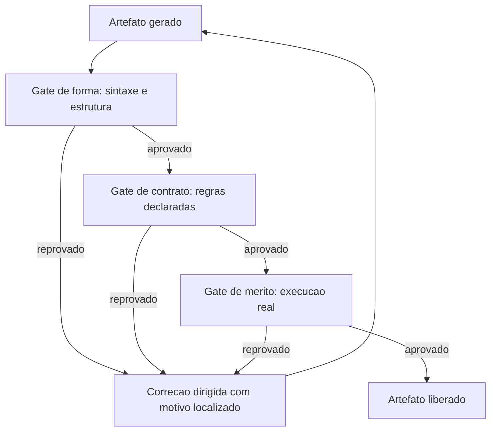

# Capítulo 9: Scripts e gates: o determinismo que sustenta a esteira

## 1. Introdução

No Capítulo 8, você aprendeu a alocar contexto entre camadas. Agora mudamos de lado: em vez de economizar o que entra, vamos garantir o que sai. Um gate é a peça que transforma uma esteira de agentes em um sistema auditável — e ele é, sem exagero, o componente mais subestimado de toda a engenharia agêntica.

Ao final, você vai saber escrever gates que reprovam de verdade, encadeá-los na ordem correta, distinguir verificação de forma, contrato e mérito, e montar o encadeamento completo de auditoria que decide se um artefato avança ou volta.

**Resumo em uma frase:** o gate é o único componente do harness que nunca mente — por isso ele decide, e o modelo apenas executa.

## 2. Explica

Os termos da casa: LLM é o modelo que gera texto; token é a unidade mínima que ele processa; harness é a camada que decide o que entra na janela e o que é verificado depois.

Um **gate** é um programa determinístico que recebe um artefato, avalia um contrato e devolve um veredito com código de saída. Três propriedades o definem. É **binário** — passa ou não passa, sem "quase". É **reprodutível** — mesma entrada, mesmo veredito, executado mil vezes. É **localizado** — informa onde falhou, não apenas que falhou.

A terceira propriedade é a que separa um gate útil de um estorvo. Um gate que diz "documento inválido" obriga uma investigação humana; um gate que diz "cap_07.md seção 4: zero blocos de código" entrega a correção pronta. E há um efeito colateral valioso: essa mensagem localizada entra no contexto do próximo agente como instrução precisa, substituindo tentativa e erro por execução dirigida.

Existem três famílias de gate, com custos e forças distintos.

**Gate de forma** verifica estrutura sintática: JSON parseável, YAML com indentação correta, arquivo existente, seção presente. Custa milissegundos, não tem falso positivo, e elimina a classe de erro mais estúpida e mais frequente.

**Gate de contrato** verifica regras de negócio declaradas: o mínimo de referências, o formato obrigatório das citações, o tamanho mínimo do artefato, a presença de um campo específico. Custa pouco e é onde vive a maior parte do valor — é aqui que a política da organização se torna executável [1].

**Gate de mérito** verifica se o artefato funciona: o código executa, o exemplo roda, o teste passa, a métrica está dentro da meta. Custa mais — pode envolver execução real — e é o único que toca o mundo. Justamente por isso, é o que mais convence [3].

A ordem entre as famílias não é opcional. Forma antes de contrato, contrato antes de mérito. A razão é econômica e é a mesma do Capítulo 2: verificação barata primeiro. Rodar um teste de integração em um documento que falha na checagem de estrutura é queimar orçamento em artefato já condenado.

Há um princípio que merece ser chamado de lei, porque sua violação é a origem de quase toda perda de confiança em esteiras automatizadas: **nunca commite (ou promova) com o gate vermelho**. Um gate que às vezes é ignorado é pior do que gate nenhum, porque destrói a associação entre veredito e verdade. A regra prática é transformá-lo em bloqueio mecânico — hook de commit, proteção de branch, etapa obrigatória no pipeline [2].

Um erro simétrico, e igualmente caro: **usar o modelo como gate**. Pedir ao agente "confira se está tudo certo" é verificação probabilística com custo alto e resultado variável. Modelos podem *ajudar* a triagem — sugerir onde olhar — mas a decisão precisa ser de código. A divisão saudável é: modelo gera e sugere; código julga.

Existe também a questão da **cobertura versus rigor**. Um gate muito permissivo dá sensação falsa de segurança; um gate muito estrito reprova trabalho bom e é desativado pelo time. O ponto de equilíbrio é calibrar por dados: registre reprovações, verifique se eram legítimas, e ajuste. Gates não são escritos uma vez — são mantidos como qualquer outro código.

Por fim, o aspecto arquitetural que dá nome ao capítulo: **scripts são o substrato dos gates**. Todo gate é um script, e um script bem escrito tem uma qualidade que o prompt não tem: é testável. Você pode escrever um teste para o gate, o que cria uma hierarquia de confiança — o gate confia no artefato, e o teste confia no gate. Esta é a única forma conhecida de construir confiança em sistemas cujo componente central é probabilístico.

## 3. Ilustra

Na cabine, um gate é um **instrumento com veredito próprio**: o altímetro não opina, informa. O alarme de estol não sugere, soa. E o mais importante: ninguém decola com um instrumento marcado como inoperante. O MEL — *minimum equipment list* — é exatamente uma lista de gates de liberação: define o que pode estar inoperante e o que impede o voo.



Repare no retorno `X --> A`: o gate não é obstáculo, é orientação. Ele devolve o artefato para a geração com uma instrução precisa — e é essa precisão que transforma um ciclo infinito de tentativa e erro em convergência rápida.

## 4. Técnica

Esta seção entrega um gate de cada família, o encadeador, o registro de auditoria e a calibração.

### Gate de forma: estrutura mínima verificável

```python
#!/usr/bin/env python3
"""Gate de forma: verifica estrutura obrigatoria de um documento."""
import re
import sys
from pathlib import Path

SECOES = ["Introducao", "Explica", "Ilustra", "Tecnica", "Aplica", "Conclusao", "Referencias"]


def verificar(caminho):
    texto = Path(caminho).read_text(encoding="utf-8", errors="replace")
    erros = []
    for nome in SECOES:
        if not re.search(rf"^##\s*\d*\.?\s*{nome}", texto, re.MULTILINE | re.IGNORECASE):
            erros.append(f"{caminho}: secao ausente -> {nome}")
    if "```mermaid" not in texto:
        erros.append(f"{caminho}: nenhum diagrama mermaid encontrado")
    if re.search(r"^---\s*$", texto, re.MULTILINE):
        erros.append(f"{caminho}: regra horizontal '---' proibida")
    return erros


if __name__ == "__main__":
    problemas = verificar(sys.argv[1])
    for p in problemas:
        print(f"[FORMA] {p}")
    sys.exit(1 if problemas else 0)
```

### Gate de contrato: regras do domínio

```python
#!/usr/bin/env python3
"""Gate de contrato: referencias minimas e citacoes rastreaveis."""
import re
import sys
from pathlib import Path

MIN_REFERENCIAS = 20


def verificar(caminho, minimo=MIN_REFERENCIAS):
    texto = Path(caminho).read_text(encoding="utf-8", errors="replace")
    secoes = re.split(r"^##\s*\d*\.?\s*", texto, flags=re.MULTILINE)
    corpo = "\n".join(secoes[:-1])
    refs = secoes[-1] if secoes else ""

    citadas = {m for m in re.findall(r"\[(\d{1,3})\]", corpo)}
    listadas = {m for m in re.findall(r"^\[(\d{1,3})\]", refs, re.MULTILINE)}

    erros = []
    orfas = sorted(citadas - listadas, key=int)
    if orfas:
        erros.append(f"{caminho}: citacoes sem referencia -> {', '.join(orfas)}")
    if len(listadas) < minimo:
        erros.append(f"{caminho}: {len(listadas)} referencias (minimo {minimo})")
    return erros


if __name__ == "__main__":
    problemas = verificar(sys.argv[1])
    for p in problemas:
        print(f"[CONTRATO] {p}")
    sys.exit(1 if problemas else 0)
```

### Gate de mérito: execução real

O gate de mérito é o que executa. Aqui, um exemplo de smoke test de blocos de código.

```python
#!/usr/bin/env python3
"""Gate de merito: executa blocos Python marcados como verificaveis."""
import re
import subprocess
import sys
import tempfile
from pathlib import Path


def executar(caminho):
    texto = Path(caminho).read_text(encoding="utf-8", errors="replace")
    falhas = []
    for i, bloco in enumerate(re.findall(r"```python\n(.*?)```", texto, re.DOTALL), 1):
        if "SMOKE: pular" in bloco:
            continue
        with tempfile.NamedTemporaryFile("w", suffix=".py", delete=False,
                                         encoding="utf-8") as arq:
            arq.write(bloco)
            nome = arq.name
        r = subprocess.run([sys.executable, "-m", "py_compile", nome],
                           capture_output=True, text=True, encoding="utf-8")
        if r.returncode != 0:
            falhas.append(f"{caminho}: bloco python #{i} nao compila -> {r.stderr.strip()[:120]}")
    return falhas


if __name__ == "__main__":
    problemas = executar(sys.argv[1])
    for p in problemas:
        print(f"[MERITO] {p}")
    sys.exit(1 if problemas else 0)
```

### O encadeador: uma esteira que para no primeiro erro

```bash
#!/usr/bin/env bash
set -euo pipefail

ARTEFATO="${1:?uso: auditar.sh <arquivo>}"

python scripts/gate_forma.py "$ARTEFATO"
python scripts/gate_contrato.py "$ARTEFATO"
python scripts/gate_merito.py "$ARTEFATO"

echo "[OK] $ARTEFATO aprovado nos tres niveis"
```

O `set -euo pipefail` é a peça que torna o encadeamento confiável: qualquer falha interrompe a execução, e erro dentro de pipe não passa silenciosamente.

### Registro de auditoria: o gate que deixa rastro

```json
{
  "artefato": "cap_09.md",
  "data": "2026-09-12T14:31:00Z",
  "gates": [
    { "nome": "forma", "resultado": "aprovado", "duracao_ms": 12 },
    { "nome": "contrato", "resultado": "reprovado", "duracao_ms": 31,
      "motivos": ["citacoes sem referencia -> 19, 21"] },
    { "nome": "merito", "resultado": "nao executado" }
  ],
  "veredito": "reprovado"
}
```

Registrar "não executado" é tão importante quanto registrar reprovação: mostra que a esteira parou na ordem correta e não gastou com mérito em artefato já condenado.

### Calibração: o gate está funcionando?

| Indicador | Valor saudável | Sinal de problema |
|---|---|---|
| Reprovações por semana | entre 5% e 40% dos artefatos | 0% = gate fraco ou desativado |
| Reprovação revertida por argumento humano | abaixo de 10% | acima disso, contrato mal escrito |
| Tempo de execução do gate de forma | menos de 100 ms | lento demais para rodar sempre |
| Motivos com localização (arquivo/linha) | 100% | motivo genérico não orienta correção |
| Gates novos por trimestre | 1 a 3 | zero indica esteira estagnada |

### Gate de escopo: a escrita não sai da caixa

Todo agente com permissão de escrita é um risco de raio de ação. O gate de escopo compara o conjunto de arquivos que a mudança tocou com o conjunto que a tarefa autorizava e reprova a diferença.

Um gate de escopo honesto verifica três coisas: que nenhum arquivo fora da lista foi modificado, que nenhum arquivo sensível (credencial, configuração de produção, migração já aplicada) foi tocado, e que os arquivos autorizados foram de fato alterados — a ausência de edição também é um sinal, porque costuma indicar que o agente mudou de caminho sem avisar.

### Gate de segurança: o segredo que escapou

Este é o gate mais barato de escrever e o mais caro de não ter. Ele varre o diff e reprova quando encontra padrões que se parecem com credencial: chaves de API com formato conhecido, strings de conexão com senha embutida, tokens longos de alta entropia, arquivos `.env` versionados.

A diferença entre um gate de segurança e um aviso de lint é o que acontece ao falhar. O aviso é ignorável; o gate bloqueia o commit. Não existe "corrijo depois" para um segredo que entrou no histórico do Git — a remediação exige reescrever a história e rotacionar a credencial.

### Gate de custo: o orçamento como critério de aceite

Custo é um critério de qualidade, não apenas de finanças. Um trabalho que ficou dez vezes mais caro que o previsto não está pronto, mesmo que esteja correto: ele consumiu o orçamento que pertencia às próximas tarefas.

O gate de custo é simples de escrever porque o sistema já mede tokens. Ele compara o consumo da tarefa com um teto declarado e classifica o resultado em três faixas — dentro do orçamento, tolerável com justificativa, fora do orçamento. A faixa intermediária é a mais importante: ela não bloqueia, mas obriga o agente a declarar por que extrapolou, o que transforma um número em uma decisão consciente.

### Gate de frescor: dado vencido não passa

Dados envelhecem. Uma versão de dependência, um preço, uma métrica de mercado, um limite de plano: qualquer afirmação numérica sobre o mundo tem prazo de validade.

O gate de frescor exige que toda afirmação factual carregue a data em que foi verificada e reprova quando essa data é mais antiga que o limite do domínio. Em obras técnicas, ele é a diferença entre um material que envelhece bem e um material que vira passivo em seis meses.

### Como escrever um gate em vinte minutos

Existe receita. Escolher um critério, convertê-lo em pergunta binária, automatizar a resposta, e pendurar o resultado no ponto de decisão. A receita, em cinco passos:

1. **Nomeie o critério em uma frase afirmativa.** "Nenhum capítulo tem menos de três citações." Se você não consegue escrever a frase, o critério ainda está vago.
2. **Converta em comando.** O critério precisa de uma expressão que devolva zero ou não zero. Métricas de julgamento subjetivo não são gates; são revisões.
3. **Decida o momento de disparo.** Antes do commit, depois da geração, no fechamento da fase. O gate no momento errado é ruído.
4. **Defina a resposta à falha.** Bloquear, avisar ou registrar. Essa escolha é de risco, não de estética.
5. **Registre o resultado.** Todo gate deixa rastro: quando rodou, sobre o que, com qual veredito. Sem rastro, o gate vira folclore.

### Calibração: o gate está funcionando?

Um gate sem manutenção tem dois modos de falha simétricos: vira ruído (reprova tudo, todos aprendem a ignorar) ou vira decoração (nunca reprova nada, todos acreditam que estão protegidos).

A calibração é um exercício simples: injete um erro de propósito e confirme que o gate o pega; injete uma mudança legítima e confirme que o gate a deixa passar. Um gate que não é testado contra os dois lados não é um instrumento de cabine — é um enfeite no painel.

## 5. Aplica

**A cena.** Uma equipe de dados usa um agente para gerar pipelines de ingestão. O agente é bom, mas de vez em quando um pipeline chega a produção com um erro que qualquer verificação pegaria: coluna com nome errado, tipo incompatível, ausência de tratamento de nulo. O time reage com revisão humana integral — e o ganho de velocidade evapora.

Você propõe uma mudança de foco: em vez de revisar mais, verificar melhor. O diagnóstico mostra que o time não tinha nenhum gate; a revisão humana era o único controle, e por isso precisava ser total. A correção foram três gates em cascata. Forma: o YAML do pipeline precisa parsear e todas as tabelas referenciadas precisam existir. Contrato: toda coluna precisa ter tipo declarado e todo `SELECT` precisa nomear as colunas explicitamente. Mérito: o pipeline roda em ambiente efêmero com uma amostra de 100 linhas e precisa terminar sem erro.

O ganho aparece em qualquer esteira com encadeamento bem calibrado: quando a verificação é objetiva e barata, o esforço humano migra da conferência para o julgamento [4]. O resultado mudou a economia do time. A revisão humana caiu de 100% para 20% dos pipelines — apenas os que tocam dados sensíveis. Os gates reprovam cerca de 15% das gerações, e cada reprovação chega com mensagem localizada, o que faz o agente corrigir em um turno em vez de três. E o mais importante: os três incidentes por mês caíram a zero.

**Métricas.** Acompanhe: taxa de reprovação por gate (deve existir, e não ser 0% nem 100%); tempo médio entre detecção e correção; incidentes em produção que passaram por todos os gates (a métrica que define cobertura real); e custo de verificação por artefato comparado ao custo de geração.

**Armadilhas comuns.** (a) *Gate que avisa e não bloqueia*: vira decoração em duas semanas. (b) *Motivo genérico*: "inválido" sem localização obriga investigação manual e anula o ganho. (c) *Mérito antes de forma*: queima execução em artefato estruturalmente inválido. (d) *Usar o modelo como juiz final*: veredito variável não é veredito. (e) *Gate sem teste próprio*: um gate com bug reprova tudo ou aprova tudo, e ninguém percebe.

**Segunda cena.** Um gate de forma entra em produção e reprova 40% dos capítulos por "bloco de código sem fechamento". A equipe reage desligando o gate — e perde junto a detecção de um erro real que ele fazia. O problema nunca foi o critério, foi a ausência de calibração: o gate nunca havia sido testado contra um caso legítimo. Refinada a regra para ignorar blocos em exemplos ilustrativos, o gate volta com taxa de falso positivo próxima de zero e passa a ser respeitado. Um gate respeitado é um gate calibrado, não um gate rigoroso.

**Erros de julgamento.** O primeiro é tratar veredito do gate como opinião e silenciar o que incomoda. O segundo é escrever gate para critério subjetivo, o que produz discussão em vez de decisão. O terceiro é deixar a mensagem de falha vaga — "estrutura inválida" — obrigando o operador a investigar o que a máquina deveria ter dito. O quarto é acumular gates sem remover os que deixaram de corresponder ao risco atual.

**Antipadrão observável.** Quando um gate é sempre ignorado pela equipe, ele já foi desativado na prática. Gates sem custo de desobediência são decoração; a decisão de bloquear precisa ser tomada de uma vez, não deixada em aberto.

**Cuidado com o teto implícito.** Acima de um certo volume de execuções, um gate de custo que só "avisa" deixa de proteger orçamento — ele precisa virar bloqueio automático assim que o teto é atingido, e esse teto tem que estar declarado no próprio gate, não na cabeça de quem revisa.

### Síntese operacional

| Tipo de gate | Verifica | Se falhar |
|---|---|---|
| Forma | Estrutura mínima do artefato | Bloqueia |
| Contrato | Regras do domínio | Bloqueia com local exato |
| Execução | O código roda de verdade | Bloqueia com a saída do erro |
| Escopo | Nada fora da lista foi tocado | Bloqueia a operação |
| Segurança | Padrões de credencial no diff | Bloqueia e exige rotação |
| Custo | Consumo contra orçamento | Avisa; bloqueia no teto |
| Frescor | Data de verificação do dado | Bloqueia se vencido |

Três regras que ficam com quem opera:

- **Todo gate é testado nos dois sentidos.** Com erro injetado, reprova; com mudança legítima, passa.
- **Mensagem de falha aponta o local.** Diagnóstico na saída reduz um turno de investigação.
- **Gate sem dono é gate morto.** Cada critério tem quem responde por ele.

### Nota do revisor

Os três desvios mais comuns neste capítulo, em ordem de frequência:

1. **Gate não calibrado.** Nasce rigoroso, reprova caso legítimo, e é desligado na primeira semana. Injetar um erro e uma mudança válida no dia da criação evita o ciclo inteiro.
2. **Veredito sem local.** "Estrutura inválida" devolve o diagnóstico para o operador e acrescenta um turno de investigação a cada falha. O gate deve dizer arquivo, linha e regra.
3. **Gate de custo como bloqueio puro.** Sem faixa intermediária com justificativa, a equipe contorna o gate; com a faixa, o desvio vira decisão registrada.

### Exercício de bancada

Quatro tarefas curtas para fixar a disciplina dos gates:

1. **Primeiro gate.** Converta um critério que hoje é revisão manual em comando de verificação. Se ele exigir mais de vinte minutos para ficar pronto, o critério ainda está vago demais.
2. **Calibração dupla.** Injete um erro de propósito e confirme a reprovação; injete uma mudança legítima e confirme a aprovação. Um gate testado só de um lado é um gate pela metade.
3. **Mensagem útil.** Reescreva a saída de falha para apontar arquivo, linha e regra violada. O tempo economizado em cada falha é o retorno imediato do exercício.
4. **Encadeamento.** Monte a esteira que para no primeiro erro e registre o veredito de cada etapa. A ordem importa: o gate mais barato roda primeiro.

## 6. Conclusão

Três ideias sustentam o capítulo. Primeira: gate é veredito binário, reprodutível e localizado — e a localização é o que o torna útil como instrução para a próxima tentativa. Segunda: existem três famílias (forma, contrato, mérito), e a ordem entre elas é econômica: barato primeiro. Terceira: a lei da esteira é nunca seguir com gate vermelho, porque um gate ignorado às vezes é pior que gate nenhum.

**Seu turno.** Escolha a etapa do seu fluxo que mais gera retrabalho e escreva um gate de contrato para ela, com motivo localizado e código de saída. Depois transforme-o em bloqueio mecânico no pipeline, para que ignorá-lo deixe de ser possível.

- [ ] Gate escrito com veredito binário e motivo localizado
- [ ] Encadeamento na ordem forma, contrato, mérito
- [ ] Bloqueio mecânico ativo (hook, CI ou proteção de branch)
- [ ] Registro de auditoria gravando também os gates não executados
- [ ] Taxa de reprovação medida após duas semanas

No próximo capítulo, você conecta esse determinismo ao ciclo de vida do agente: os eventos, os hooks e a hora certa de cada interceptação.

## 7. Referências

[1] ANTHROPIC. *Automate actions with hooks — Claude Code Docs*. Disponível em: https://code.claude.com/docs/en/hooks-guide. Acesso em: 12 set. 2026.
[2] ANTHROPIC. *Hooks reference — Claude Code Docs*. Disponível em: https://code.claude.com/docs/en/hooks. Acesso em: 12 set. 2026.
[3] ANTHROPIC. *All settings — Claude Code Docs*. Disponível em: https://code.claude.com/docs/en/settings-reference. Acesso em: 12 set. 2026.
[4] MOHAMMADI, Mahmoud et al. *Evaluation and Benchmarking of LLM Agents: A Survey*. Disponível em: https://doi.org/10.1145/3711896.3736570. Acesso em: 12 set. 2026.
[5] WANG, Lei et al. *A survey on large language model based autonomous agents*. Disponível em: https://doi.org/10.1007/s11704-024-40231-1. Acesso em: 12 set. 2026.
[6] ANTHROPIC. *Effective context engineering for AI agents*. Disponível em: https://www.anthropic.com/engineering/effective-context-engineering-for-ai-agents. Acesso em: 12 set. 2026.
[7] MODEL CONTEXT PROTOCOL. *Server Features — Tools*. Disponível em: https://modelcontextprotocol.io/specification/2026-07-28/server/tools. Acesso em: 12 set. 2026.
[8] AGENTS.MD. *agentsmd/agents.md — Repositório oficial do padrão*. Disponível em: https://github.com/agentsmd/agents.md. Acesso em: 12 set. 2026.
[9] CURSOR. *Rules — Cursor Docs*. Disponível em: https://cursor.com/docs/rules. Acesso em: 12 set. 2026.
[10] ANTHROPIC. *Subagents in the SDK — Claude Code Docs*. Disponível em: https://code.claude.com/docs/en/agent-sdk/subagents. Acesso em: 12 set. 2026.
[11] ANTHROPIC. *Agent Skills — Overview*. Disponível em: https://platform.claude.com/docs/en/agents-and-tools/agent-skills/overview. Acesso em: 12 set. 2026.
[12] ANTHROPIC. *Context engineering: memory, compaction, and tool clearing*. Disponível em: https://platform.claude.com/cookbook/tool-use-context-engineering-context-engineering-tools. Acesso em: 12 set. 2026.
[13] LANGCHAIN. *Context Engineering*. Disponível em: https://www.langchain.com/blog/context-engineering-for-agents. Acesso em: 12 set. 2026.
[14] SOURCEGRAPH. *Context Engineering: A Practical Guide for AI Agents*. Disponível em: https://sourcegraph.com/blog/context-engineering. Acesso em: 12 set. 2026.
[15] GRESHAKE, Kai et al. *Not What You've Signed Up For: Compromising Real-World LLM-Integrated Applications with Indirect Prompt Injection*. Disponível em: https://doi.org/10.1145/3605764.3623985. Acesso em: 12 set. 2026.
[16] KWON, Woosuk et al. *Efficient Memory Management for Large Language Model Serving with PagedAttention*. Disponível em: https://arxiv.org/abs/2309.06180. Acesso em: 12 set. 2026.
[17] ORCA. *What is Orca? — Orca Docs*. Disponível em: https://www.onorca.dev/docs. Acesso em: 12 set. 2026.
[18] GIT. *git-worktree — Referência oficial*. Disponível em: https://git-scm.com/docs/git-worktree. Acesso em: 12 set. 2026.
[19] XU, Weikai et al. *LLM-Based Agents for Tool Learning: A Survey*. Disponível em: https://doi.org/10.1007/s41019-025-00296-9. Acesso em: 12 set. 2026.
[20] SAPKOTA, Ranjan; ROUMELIOTIS, Konstantinos I.; KARKEE, Manoj. *AI Agents vs. Agentic AI: A Conceptual Taxonomy, Applications and Challenges*. Disponível em: https://doi.org/10.1016/j.inffus.2025.103599. Acesso em: 12 set. 2026.
