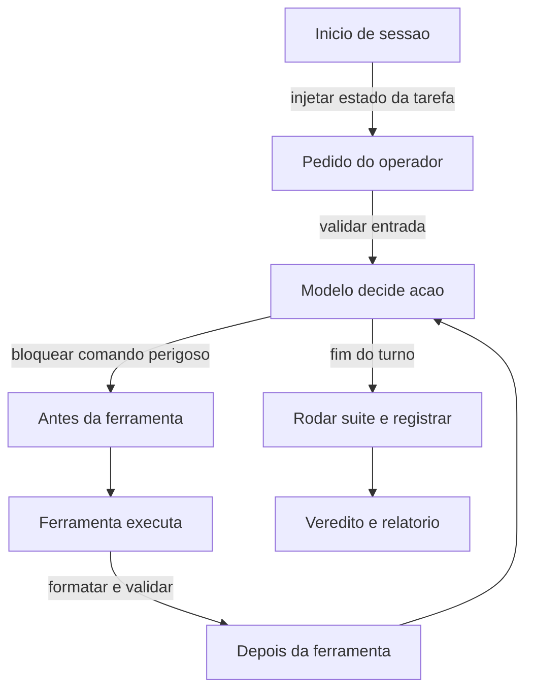

# Capítulo 10: Hooks: a camada que intercepta o agente

## 1. Introdução

No Capítulo 9, você construiu gates que avaliam artefatos. Mas existe uma diferença entre verificar depois e **interceptar durante** — e é essa diferença que separa um controle reativo de um controle preventivo. Hooks são a única parte do harness que decide antes do dano acontecer.

Ao final, você vai conhecer os eventos do ciclo de vida que importam, saber escolher entre hook de comando, de prompt e de agente, e escrever hooks que bloqueiam de verdade — inclusive o mais importante de todos: o que impede o commit de uma suíte vermelha.

**Resumo em uma frase:** hook é a política do harness virando mecânica — o único jeito de uma regra não depender de boa vontade.

## 2. Explica

Os termos da casa: LLM é o modelo que gera texto; token é a unidade mínima que ele processa; harness é a camada que decide o que entra na janela. E **hook** é um comando que o harness executa automaticamente quando um evento do ciclo de vida do agente acontece.

O ciclo de vida tem pontos bem definidos, e cada um resolve um problema diferente [1][2]:

- **Início de sessão** — antes de qualquer ação. Serve para injetar contexto: estado da tarefa, regras do dia, avisos do repositório.
- **Antes da submissão do pedido** — quando você envia uma mensagem. Serve para enriquecer ou validar a entrada.
- **Antes da execução de ferramenta** — o ponto mais importante. É aqui que se bloqueia ação perigosa, comando destrutivo ou escrita em arquivo proibido.
- **Depois da execução de ferramenta** — serve para reagir ao resultado: formatar, validar, registrar, disparar verificação.
- **Fim da sessão ou do turno** — serve para fechar o ciclo: rodar a suíte, gerar relatório, checar pendências.

A distinção fundamental é entre **interceptar** e **observar**. Um hook de observação registra; um hook de interceptação pode impedir. O valor está no segundo, e o mecanismo é sempre o mesmo: código de saída diferente de zero interrompe a ação. Essa é a razão pela qual o capítulo insiste tanto em código de saída — ele é a única linguagem que o harness e o shell entendem sem interpretação.

Existem três tipos de hook, com custos e poderes distintos.

Um **hook de comando** executa um programa. É determinístico, barato (milissegundos quando bem escrito) e não depende de julgamento. É o tipo correto para tudo que é regra objetiva: bloquear `git push`, impedir escrita em uma pasta, validar sintaxe.

Um **hook de prompt** (ou baseado em modelo) usa o próprio LLM para avaliar uma condição — por exemplo, "esta edição respeita o padrão do projeto?". É flexível e mais caro, e tem uma característica que deve ser lida como aviso: o veredito é probabilístico. Use para triagem, nunca como bloqueio final.

Um **hook de agente** delega a verificação a um subagente com contexto próprio, útil quando a checagem exige leitura ampla — "verifique se esta mudança quebra algum contrato de API em outro módulo". Custa mais e deve ser reservado para o que realmente exige raciocínio.

A regra de escolha, portanto, não é preferência de estilo: **o que é objetivo vira comando; o que é ambíguo pode virar prompt; o que exige exploração pode virar agente**. E como você já sabe desde o Capítulo 2, só o primeiro pode bloquear.

Um ponto operacional que decide o sucesso de qualquer hook: **tempo de execução**. Hooks rodam em toda ação relevante, e um hook lento transforma a experiência do time em espera. A meta prática é: hook de comando abaixo de 100 ms; hook que executa suíte de testes apenas no evento de fim de turno ou de commit, nunca em cada edição. Hooks lentos são desativados — não por indisciplina, mas por economia de paciência.

Depois, o hook mais valioso de todos, e o único que quase todo time deveria ter no primeiro dia: **o pre-commit que bloqueia suíte vermelha**. Ele resolve um problema que nenhuma instrução de prompt resolve de forma confiável. Por mais bem escrito que esteja o pedido de "só commite com os testes passando", a instrução é probabilística; o hook é binário. É a materialização mais pura da fronteira do Capítulo 2 [3].

Há ainda um aspecto de auditoria: hooks deixam rastro por design. Registrar cada chamada de ferramenta com horário, comando e resultado cria a caixa-preta da sessão — o único registro confiável do que um agente realmente fez. Quando um incidente acontece, essa trilha é a diferença entre investigar e especular.

Por fim, uma advertência de segurança que conecta este capítulo ao problema de injeção indireta: **hook é código que roda com o seu nível de permissão**. Um hook que executa conteúdo vindo de uma resposta do modelo — sem validação — cria uma via de execução arbitrária. Hooks devem ser estáticos, versionados e auditados como qualquer outro código de produção [4].

## 3. Ilustra

Na cabine, hook é o **sistema que age antes do piloto**. O aviso de proximidade do solo soa sem consultar ninguém. O trem de pouso não recolhe com peso sobre as rodas — não porque o piloto é proibido, mas porque o sistema não deixa. E, como todo sistema de bordo, é versionado: cada aeronave tem a mesma configuração aprovada, e qualquer alteração passa por revisão.



Repare que o caminho normal passa por dois pontos de controle. O primeiro impede o dano; o segundo corrige e registra. E nenhum deles pede licença ao modelo para decidir — esse é o ponto inteiro do capítulo.

## 4. Técnica

Esta seção entrega cinco hooks reais: o guardião de comandos, o formatador pós-edição, o pre-commit bloqueante, o injetor de contexto e o registrador de auditoria.

### Hook 1: guardião de comandos (antes da ferramenta)

Recebe o comando por entrada padrão e decide se ele pode rodar. A regra é explícita e versionada.

```python
#!/usr/bin/env python3
"""Guarda de comandos: bloqueia padroes destrutivos antes de executar."""
import json
import sys

PADROES_PROIBIDOS = [
    "rm -rf /",
    "git push --force",
    "dropdb",
    "DROP TABLE",
    "> /dev/sda",
]

LIMITE_CARACTERES_COMANDO = 4000


def main():
    try:
        evento = json.load(sys.stdin)
    except json.JSONDecodeError:
        print("[guard] evento invalido na entrada", file=sys.stderr)
        sys.exit(2)

    comando = (evento.get("tool_input") or {}).get("command", "")

    for padrao in PADROES_PROIBIDOS:
        if padrao in comando:
            print(f"[guard] BLOQUEADO: padrao proibido -> {padrao}", file=sys.stderr)
            sys.exit(2)

    if len(comando) > LIMITE_CARACTERES_COMANDO:
        print("[guard] BLOQUEADO: comando suspeito pelo tamanho", file=sys.stderr)
        sys.exit(2)

    sys.exit(0)


if __name__ == "__main__":
    main()
```

O guardião nunca executa o comando: ele apenas decide. Essa separação é deliberada — manter o hook simples é o que permite confiar nele.

### Hook 2: formatador pós-edição (depois da ferramenta)

Roda logo após uma edição, para que estilo deixe de ser assunto do modelo.

```bash
#!/usr/bin/env bash
set -euo pipefail
ARQUIVO="${1:-}"
case "$ARQUIVO" in
  *.py)  python -m ruff format "$ARQUIVO" >/dev/null 2>&1 || true ;;
  *.ts|*.tsx) npx --no-install prettier --write "$ARQUIVO" >/dev/null 2>&1 || true ;;
esac
exit 0
```

Note o `|| true` e o `exit 0`: um hook de formatação não deve bloquear nada. Ele corrige quando consegue e segue em frente quando não consegue.

### Hook 3: pre-commit que bloqueia suíte vermelha

Este é o hook que mecaniza a disciplina. Ele roda a suíte e impede o commit em caso de falha.

```bash
#!/usr/bin/env bash
set -euo pipefail

echo "[pre-commit] rodando suite de testes..."
if ! python -m pytest -q; then
  echo "[pre-commit] BLOQUEADO: suite vermelha. Corrija e tente novamente." >&2
  exit 1
fi

echo "[pre-commit] suite verde — commit liberado"
```

Instalado em `.git/hooks/pre-commit`, ele vale para humanos e para agentes. É o gate do Capítulo 9 no lugar certo: na porta de saída do trabalho.

### Hook 4: injetor de contexto no início da sessão

Sessão começa, contexto útil entra — sem ocupar a instrução persistente.

```json
{
  "evento": "SessionStart",
  "hooks": [
    {
      "type": "command",
      "command": "cat docs/estado-tarefa.md 2>/dev/null | head -40"
    }
  ]
}
```

O `head -40` é a proteção de orçamento: o hook pode injetar contexto, e é exatamente por isso que precisa de teto.

### Hook 5: registrador de auditoria

Toda chamada de ferramenta vira uma linha de registro. É a caixa-preta da sessão.

```json
{
  "evento": "PostToolUse",
  "matcher": "*",
  "hooks": [
    {
      "type": "command",
      "command": "python scripts/registrar.py >> logs/sessao.jsonl"
    }
  ]
}
```

```python
import json
import sys
from datetime import datetime, timezone


def main():
    evento = json.load(sys.stdin)
    linha = {
        "ts": datetime.now(timezone.utc).isoformat(),
        "ferramenta": evento.get("tool_name"),
        "sessao": evento.get("session_id"),
        "resultado": str(evento.get("tool_response"))[:200],
    }
    print(json.dumps(linha, ensure_ascii=False))


if __name__ == "__main__":
    main()
```

O truncamento em 200 caracteres é intencional: registro de auditoria não é lugar de despejar resultado de ferramenta.

### Hook 6: roteador por tipo de artefato

Nem todo arquivo merece o mesmo tratamento. Um hook de roteamento classifica o artefato tocado e decide o esforço: uma correção de texto não precisa acionar a bateria de testes de integração, enquanto uma alteração de lógica de cobrança precisa. O ganho é duplo — a verificação fica proporcional ao risco e o gasto deixa de ser uniforme.

O caso mais comum é o do formulário: o hook inspeciona o diff, detecta que a mudança ficou restrita a texto, e responde com um conjunto menor de verificações, registrando a decisão no log de auditoria. Nada é escondido, apenas escalonado.

### Hook 7: bloqueador de escrita fora do escopo

Existe uma diferença entre um agente que erra e um agente que se expande. O primeiro produz um resultado ruim; o segundo modifica arquivos que ninguém pediu, muitas vezes em diretórios que exigem cuidado.

O bloqueador de escrita fora do escopo intercepta a operação de edição, compara o caminho com a lista de alvos autorizados e recusa a operação com uma mensagem explícita de motivo. É o equivalente, no ambiente do agente, ao limite de raio de ação que se aplica a um processo em produção. A recusa deve vir com o caminho que seria tocado, para que o erro seja visível e corrigível em um único turno.

### Hook 8: alerta de custo por limiar

Hooks não servem só para bloquear. Servem, também, para avisar no momento certo. Um hook de custo acumula o consumo da sessão e dispara um aviso quando um limiar intermediário é cruzado — antes do teto, não depois.

A diferença entre alerta e teto é de intenção: o teto protege o orçamento; o alerta protege a decisão. Ao receber o aviso, o agente pode optar por comprimir o contexto, encerrar a investigação lateral ou concluir com o que já tem. O alerta devolve ao operador a escolha que o teto simplesmente executa.

### Hook 9: verificador de convenção de estilo

O estilo é onde as convenções do projeto são mais fáceis de perder. Um hook posterior à edição aplica as convenções de formatação, nomenclatura e estrutura de arquivo, e falha se a mudança as viola de forma não corrigível automaticamente.

O critério de utilidade aqui é o mesmo de todo instrumento: o hook deve ser determinístico e a mensagem de falha deve apontar a linha exata e a regra violada. Um estilizador que reclama sem dizer onde é um alarme falso permanente — e alarmes falsos permanentes treinam todos a ignorar o painel.

### Ciclo de vida: onde cada hook se pendura

Hooks não têm apenas um tipo; têm um momento. O mapa de decisão completo, por evento do ciclo de vida do agente:

| Momento | Pergunta útil do hook | Exemplos deste capítulo |
|---|---|---|
| Início da sessão | Faltou contexto para começar bem? | Hook 4 (injetor) |
| Antes da ferramenta | Vou executar algo perigoso? | Hook 1 (guardião), Hook 7 (escopo) |
| Depois da ferramenta | O resultado precisa de tratamento? | Hook 2 (formatador), Hook 9 (estilo) |
| Depois da edição | A mudança tem risco proporcional? | Hook 6 (roteador) |
| Limiar de consumo | Já gastei demais para continuar assim? | Hook 8 (custo) |
| Antes do commit | A suíte está verde? | Hook 3 (pre-commit) |
| Fim da sessão | Ficou rastro do que aconteceu? | Hook 5 (auditoria) |

Lido em coluna, o mapa mostra que o ciclo de vida completo de um agente tem pontos de intervenção em todas as suas fases — não apenas no começo e no fim. Uma cabine com painel só na decolagem e no pouso é uma cabine cega no meio do voo.

### Tabela de decisão: qual tipo de hook usar

| Necessidade | Tipo | Pode bloquear? |
|---|---|---|
| Impedir comando destrutivo | comando | sim |
| Formatar após edição | comando | não deve |
| Validar padrão subjetivo de código | prompt | sim, com ressalva |
| Conferir contrato entre módulos | agente | sim, com custo |
| Injetar estado da tarefa no início | comando | não |
| Registrar trilha de auditoria | comando | não |

## 5. Aplica

**A cena.** Uma equipe de infraestrutura dá a agentes permissão de shell para tarefas de operação. A regra está escrita com destaque na instrução: "nunca execute comando destrutivo em produção; peça confirmação ao operador". Durante seis semanas, funciona. Na sétima, uma tarefa de limpeza de disco roda um `rm` com um caminho mal montado, e apaga dados de um volume que deveria ter sido poupado.

O diagnóstico é direto: a política era uma instrução, não um hook. O agente não desobedeceu por má-fé — ele montou um caminho plausível e executou o que parecia correto. O harness não tinha nenhum ponto de interceptação entre a decisão e o dano.

A correção teve três partes, todas pequenas. Primeiro, um guardião de comandos que bloqueia padrões destrutivos e caminhos fora do diretório de trabalho permitido. Segundo, um hook que exige, para comandos que começam com `rm`, que o caminho esteja declarado em um arquivo de permissão explícito — o que transforma a boa intenção em lista verificável. Terceiro, registro de toda execução de shell em log append-only, para que a próxima investigação dure minutos em vez de dias. Nenhuma instrução de prompt foi adicionada; três controles mecânicos assumiram o lugar de uma frase educada.

**Métricas.** Acompanhe: número de bloqueios por hook (deve ser maior que zero); tempo médio de execução de cada hook; percentual de commits que chegam ao repositório com suíte vermelha (meta: zero, garantido pelo hook); e cobertura de auditoria — percentual de chamadas de ferramenta registradas.

**Armadilhas comuns.** (a) *Hook lento em evento quente*: suíte completa a cada edição destrói a experiência. (b) *Hook que trava silenciosamente*: falha no hook não pode ser ignorada; trate erro como bloqueio. (c) *Hook que executa saída do modelo*: via direta para execução arbitrária. (d) *Hook só na máquina de quem configurou*: versionar é obrigatório para valer para o time. (e) *Muitos hooks de prompt*: veredito variável e custo por ação.

**Segunda cena.** Um hook de formatação roda a cada edição e leva alguns segundos. Em um dia de muitas edições, a soma vira minutos de espera — e o operador passa a desabilitá-lo quando está com pressa. O hook deixa de proteger exatamente quando o risco é maior. A correção é escopar: o formatador roda sobre o diff, não sobre o projeto; dispara apenas quando há arquivo da linguagem alvo; e não roda duas vezes sobre o mesmo conteúdo. Hooks precisam ser baratos o suficiente para nunca valer a pena desligá-los.

**Erros de julgamento.** (a) Escrever hook que depende de raciocínio do modelo em vez de regra determinística. (b) Fazer hook com efeito colateral amplo — limpar diretório, reinstalar dependência — quando o objetivo era verificar. (c) Deixar hook falhar silenciosamente; um hook que engole exceção é pior que hook ausente. (d) Definir hook só na máquina local de quem o criou, criando um comportamento que não se reproduz no restante da equipe.

**Antipadrão observável.** Quando alguém no time não sabe dizer quais hooks estão ativos na própria máquina, o comportamento do agente varia por estação. Hooks são parte do contrato do projeto e devem estar versionados junto com os demais arquivos de configuração.

**Cuidado com o hook de custo.** Acima de um certo limiar de consumo, um hook que apenas avisa vira ruído ignorado; passado o segundo limiar — o de orçamento inegociável — ele precisa bloquear a ação, não apenas registrar um alerta que ninguém lê.

### Síntese operacional

| Hook | Momento | Efeito se mal calibrado |
|---|---|---|
| Guardião de comando | Antes da ferramenta | Bloqueia trabalho legítimo |
| Formatador | Depois da edição | Lentidão que leva a desligar |
| Pre-commit | Antes do registro | Fila de commits travada |
| Injetor de contexto | Início da sessão | Contexto irrelevante no topo |
| Auditoria | Fim da sessão | Log volumoso sem uso |
| Roteador | Depois da edição | Verificação desproporcional ao risco |
| Custo | Limiar de consumo | Avisos frequentes viram ruído |

Três regras que ficam com quem opera:

- **Hook é determinístico.** Se depende de julgamento do modelo, é gate de mérito — não hook.
- **Hook barato o suficiente para nunca valer a pena desligar.** Um hook lento vira hook desabilitado.
- **Hook versionado.** Comportamento que só existe na sua máquina não é contrato de projeto.

### Nota do revisor

Os três desvios mais comuns neste capítulo, em ordem de frequência:

1. **Hook definido só na máquina local.** O comportamento do agente passa a variar por estação de trabalho, e o diagnóstico da diferença consome mais tempo do que o hook economiza.
2. **Hook que engole exceção.** O silêncio faz o operador acreditar que houve verificação quando ela não aconteceu. Falha de hook precisa ser visível.
3. **Hook com efeito colateral amplo.** Limpar diretório, reinstalar dependência ou resetar estado quando o objetivo era apenas verificar. Verificação e mutação precisam estar em hooks distintos.

### Exercício de bancada

Quatro tarefas curtas para fixar os hooks:

1. **Guardião.** Escreva um hook que recusa um comando destrutivo antes da execução, com mensagem que diga qual comando foi barrado e por quê. A recusa precisa ser visível, não silenciosa.
2. **Formatador escopado.** Escreva um hook que formata apenas o arquivo tocado e apenas se for da linguagem alvo. Meça o tempo adicionado por edição — se passar de alguns segundos, ele será desligado.
3. **Auditoria.** Registre início e fim de sessão em um log com caminho, comando e veredito. Esse é o material bruto para descobrir, semanas depois, o que mudou o comportamento do sistema.
4. **Teste de falha.** Desabilite um hook de propósito e verifique se o trabalho continua correto. Se ele não é essencial, talvez esteja no lugar errado do ciclo de vida.

## 6. Conclusão

Você fechou a camada que dá garantias ao harness. Primeiro: hooks interceptam em eventos do ciclo de vida, e só o hook de comando pode bloquear de forma confiável. Segundo: a ordem de preferência é comando para o objetivo, prompt para o ambíguo, agente para o que exige exploração. Terceiro: hooks precisam ser rápidos, versionados e auditados — hook lento é desativado, hook pessoal não protege o time, hook que executa saída do modelo é vulnerabilidade.

**Seu turno.** Instale o pre-commit que bloqueia suíte vermelha hoje. Depois escreva um guardião de comandos com três padrões proibidos do seu contexto e um registrador de auditoria. Meça quantos bloqueios acontecem na primeira semana.

- [ ] Pre-commit bloqueante instalado e versionado
- [ ] Guardião de comandos com padrões proibidos explícitos
- [ ] Hook de início de sessão injetando estado da tarefa com teto
- [ ] Registro de auditoria append-only ativo
- [ ] Tempo de execução de cada hook medido

No próximo capítulo, você aprende a delegar: subagentes com contexto isolado, e o contrato que faz a delegação economizar em vez de multiplicar custo.

## 7. Referências

[1] ANTHROPIC. *Automate actions with hooks — Claude Code Docs*. Disponível em: https://code.claude.com/docs/en/hooks-guide. Acesso em: 12 set. 2026.
[2] ANTHROPIC. *Hooks reference — Claude Code Docs*. Disponível em: https://code.claude.com/docs/en/hooks. Acesso em: 12 set. 2026.
[3] ANTHROPIC. *All settings — Claude Code Docs*. Disponível em: https://code.claude.com/docs/en/settings-reference. Acesso em: 12 set. 2026.
[4] GRESHAKE, Kai et al. *Not What You've Signed Up For: Compromising Real-World LLM-Integrated Applications with Indirect Prompt Injection*. Disponível em: https://doi.org/10.1145/3605764.3623985. Acesso em: 12 set. 2026.
[5] ANTHROPIC. *Intercept and control agent behavior with hooks — Agent SDK*. Disponível em: https://code.claude.com/docs/en/agent-sdk/hooks. Acesso em: 12 set. 2026.
[6] ANTHROPIC. *Subagents in the SDK — Claude Code Docs*. Disponível em: https://code.claude.com/docs/en/agent-sdk/subagents. Acesso em: 12 set. 2026.
[7] ANTHROPIC. *Effective context engineering for AI agents*. Disponível em: https://www.anthropic.com/engineering/effective-context-engineering-for-ai-agents. Acesso em: 12 set. 2026.
[8] ANTHROPIC. *Context engineering: memory, compaction, and tool clearing*. Disponível em: https://platform.claude.com/cookbook/tool-use-context-engineering-context-engineering-tools. Acesso em: 12 set. 2026.
[9] MODEL CONTEXT PROTOCOL. *Specification (2025-06-18)*. Disponível em: https://modelcontextprotocol.io/specification/2025-06-18. Acesso em: 12 set. 2026.
[10] MODEL CONTEXT PROTOCOL. *Server Features — Tools*. Disponível em: https://modelcontextprotocol.io/specification/2026-07-28/server/tools. Acesso em: 12 set. 2026.
[11] WANG, Lei et al. *A survey on large language model based autonomous agents*. Disponível em: https://doi.org/10.1007/s11704-024-40231-1. Acesso em: 12 set. 2026.
[12] MOHAMMADI, Mahmoud et al. *Evaluation and Benchmarking of LLM Agents: A Survey*. Disponível em: https://doi.org/10.1145/3711896.3736570. Acesso em: 12 set. 2026.
[13] AGENTS.MD. *agentsmd/agents.md — Repositório oficial do padrão*. Disponível em: https://github.com/agentsmd/agents.md. Acesso em: 12 set. 2026.
[14] CURSOR. *Rules — Cursor Docs*. Disponível em: https://cursor.com/docs/rules. Acesso em: 12 set. 2026.
[15] ANTHROPIC. *Agent Skills — Overview*. Disponível em: https://platform.claude.com/docs/en/agents-and-tools/agent-skills/overview. Acesso em: 12 set. 2026.
[16] LANGCHAIN. *Context Engineering*. Disponível em: https://www.langchain.com/blog/context-engineering-for-agents. Acesso em: 12 set. 2026.
[17] SOURCEGRAPH. *Context Engineering: A Practical Guide for AI Agents*. Disponível em: https://sourcegraph.com/blog/context-engineering. Acesso em: 12 set. 2026.
[18] ORCA. *What is Orca? — Orca Docs*. Disponível em: https://www.onorca.dev/docs. Acesso em: 12 set. 2026.
[19] GIT. *git-worktree — Referência oficial*. Disponível em: https://git-scm.com/docs/git-worktree. Acesso em: 12 set. 2026.
[20] XU, Weikai et al. *LLM-Based Agents for Tool Learning: A Survey*. Disponível em: https://doi.org/10.1007/s41019-025-00296-9. Acesso em: 12 set. 2026.
