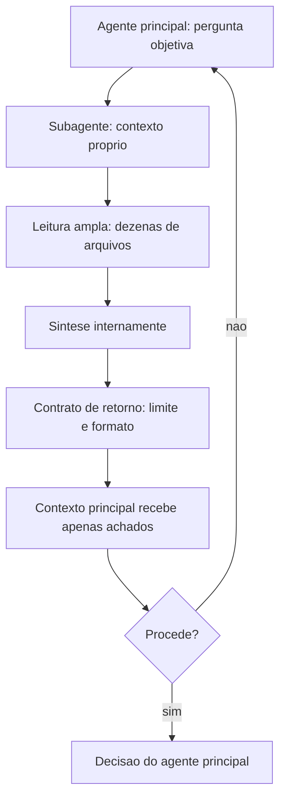

# Capítulo 11: Agents e subagentes: delegação com contexto isolado

## 1. Introdução

No Capítulo 10, você instalou a camada que intercepta o agente. Agora vamos multiplicá-lo. Delegação é a operação de contexto mais poderosa que existe — e também a que mais frequentemente vira desperdício, porque a maioria dos times delega sem contrato e acaba pagando mais do que economizaria.

Ao final, você vai entender a diferença entre agente e subagente, saber o que delegar e o que nunca delegar, e escrever o contrato de saída que faz uma delegação economizar contexto em vez de inflá-lo.

**Resumo em uma frase:** subagente vale quando a razão entre o que ele lê e o que ele conclui é alta — e o contrato de retorno é o que garante isso.

## 2. Explica

Os termos da casa: LLM é o modelo que gera texto; token é a unidade mínima que ele processa; harness é a camada que decide o que entra na janela e o que é verificado depois.

Um **subagente** é uma instância separada, com janela de contexto própria, prompt de sistema próprio e lista de ferramentas própria. Ele executa uma tarefa e devolve ao agente principal apenas o resultado — não o histórico [1][2]. Essa é a propriedade definidora: **o que aconteceu dentro do subagente não entra no contexto do pai**. Só o retorno entra.

Vale nomear o que isso resolve. Sem isolamento, toda leitura pesada que o agente faz permanece no histórico e é reprocessada em todos os turnos seguintes — o efeito que você mediu no Capítulo 5. Com isolamento, a leitura pesada acontece uma vez, em outro contexto, e o contexto principal recebe apenas a conclusão. A economia é proporcional à diferença entre o volume lido e o volume concluído, e é exatamente por isso que **a razão de compressão** — tokens lidos divididos por tokens devolvidos — é a métrica que define se a delegação valeu.

Três tipos de tarefa compensam delegação, e vale conhecê-los bem, porque a fronteira é sutil.

**Varredura ampla com conclusão estreita.** "Em quais lugares do repositório este contrato de API é consumido?" — o subagente lê dezenas de arquivos e devolve quinze linhas. Compressão altíssima.

**Execução isolada e ruidosa.** "Rode a suíte de testes e me diga quais falharam e por quê." — a saída bruta é enorme, a conclusão é curta. Compressão alta, e há bônus: o ruído fica fora do contexto principal [3].

**Trabalho paralelo independente.** Três investigações que não dependem entre si podem rodar ao mesmo tempo, cada uma em seu contexto. Aqui o ganho não é só de token: é de tempo.

Três tipos de tarefa **não** compensam, e insistir nelas explica a maioria das delegações que dão prejuízo.

**Tarefa que precisa de contexto compartilhado.** Se o subagente precisa saber tudo o que o pai sabe para decidir bem, você vai gastar tokens reenviando contexto — e ainda corre o risco de o subagente decidir de forma desalinhada, porque a reconstrução do contexto nunca é perfeita.

**Tarefa de escrita longa e coerente.** Um capítulo, um relatório extenso, um documento com voz única: o isolamento atrapalha, porque o resultado final precisa de consistência interna que só o contexto completo garante.

**Tarefa pequena.** Se a conclusão é tão grande quanto a leitura, o overhead de montar o subagente (prompt, ferramentas, retorno) supera o ganho. Delegação tem custo fixo; abaixo de certo tamanho, ela só adiciona latência.

Existe ainda uma assimetria de informação que precisa ser declarada explicitamente em todo contrato de delegação: **o subagente não sabe o que o pai sabe**. Ele não tem o histórico, não viu as decisões anteriores, não conhece as restrições descobertas. Se essas informações forem relevantes, elas precisam viajar no pedido — e isso é um custo de entrada que deve entrar na conta. Delegar bem é, em boa medida, escrever um briefing completo e curto.

O contraponto é a razão pela qual delegação funciona apesar disso: **o pai também não sabe o que o subagente lê**. A assimetria corta nos dois sentidos, e o contrato de retorno é o que controla o lado que importa. Um contrato bem escrito diz o formato, o limite e o que é proibido — e o proibido quase sempre inclui "colar trechos longos".

Há um efeito colateral valioso que muitas equipes descobrem por acidente: **subagente é também um filtro de ruído**. Erro de execução verboso, log de build, saída de teste e stack trace — tudo isso fica no contexto do subagente, e o pai recebe apenas "a falha é X na linha Y". Isso melhora não só o custo, mas a qualidade da decisão do pai, que passa a trabalhar com sinais em vez de com matéria-prima.

Por fim, a armadilha mais perigosa: **subagente que não verifica**. Como ninguém vê o que ele leu, um retorno errado é praticamente indetectável — não há como auditar o caminho, apenas o resultado. A mitigação é a mesma do Capítulo 9: exigir no retorno a **procedência** (caminho e linha, comando executado) para que qualquer afirmação possa ser reconferida pelo pai com um comando barato.

## 3. Ilustra

Na cabine, o subagente é o **copiloto fazendo a checagem externa**. O piloto não lê a lista inteira de itens externos: ele pede "checagem externa", o copiloto percorre o perímetro, examina painéis, confere luzes, e reporta "tudo verde, exceto a luz de pressurização". O piloto nunca vê cada painel — vê o resultado da varredura. Seria absurdo o copiloto descrever cada painel em detalhe, e é exatamente isso que um contrato de retorno mal escrito produz.



Note os dois nós que fazem o sistema funcionar: o contrato de retorno, que limita o volume, e o nó de reconferência de procedência, que devolve ao pai o poder de auditar sem reexecutar a varredura inteira.

## 4. Técnica

Esta seção entrega: o contrato de delegação, uma implementação de orquestração simples, o cálculo de economia e a decisão de quando paralelizar.

### Passo 1: escreva o contrato de delegação

O contrato é o artefato central. Ele define o que entra, o que sai e o que é proibido.

```json
{
  "papel": "investigador-de-consumidores",
  "pergunta": "Quais modulos consomem o contrato de /login e como?",
  "contexto_necessario": [
    "contrato atual de /login: POST com {usuario, senha}",
    "restricao: clientes moveis dependem do formato de resposta"
  ],
  "limite_retorno_tokens": 250,
  "formato_retorno": "tabela: caminho:linha | tipo de consumo | risco (alto/medio/baixo)",
  "obrigatorio": ["citacao de caminho e linha para cada afirmacao"],
  "proibido": [
    "colar trechos maiores que 3 linhas",
    "sugerir implementacao",
    "resumir arquivos nao consultados"
  ]
}
```

Dois campos merecem destaque. `contexto_necessario` resolve a assimetria de informação — é o briefing que o subagente não pode buscar sozinho. `obrigatorio` exige procedência, o que torna o retorno verificável por comando barato em vez de por confiança.

### Passo 2: orquestre de forma simples antes de paralelizar

Comece serial e meça. Paralelismo adiciona complexidade; só vale quando o tempo é gargalo real.

```python
import json
from concurrent.futures import ThreadPoolExecutor


def delegar(contrato, executor_subagente):
    """Executa um contrato e devolve o retorno validado."""
    retorno = executor_subagente(contrato)
    if len(retorno.split()) > contrato["limite_retorno_tokens"]:
        return {"erro": "retorno acima do limite", "bruto": retorno[:500]}
    return {"resultado": retorno}


def delegar_em_paralelo(contratos, executor_subagente, max_workers=3):
    with ThreadPoolExecutor(max_workers=max_workers) as pool:
        futuros = [pool.submit(delegar, c, executor_subagente) for c in contratos]
        return [f.result() for f in futuros]
```

O detalhe que importa está na validação do limite: **retorno acima do contrato é tratado como erro**, não como sucesso parcial. Sem isso, o contrato vira sugestão e o ganho desaparece na primeira execução mais verbosa.

### Passo 3: calcule a razão de compressão

Delegação que não é medida não é gerenciada. Registre entrada e saída de cada subagente.

```python
def razao_compressao(registros):
    """Tokens lidos pelo subagente / tokens devolvidos por ele."""
    lidos = sum(r["tokens_lidos"] for r in registros)
    devolvidos = sum(r["tokens_devolvidos"] for r in registros)
    if not devolvidos:
        return {"razao": float("inf"), "lidos": lidos, "devolvidos": 0}
    return {
        "razao": round(lidos / devolvidos, 1),
        "lidos": lidos,
        "devolvidos": devolvidos,
        "veredito": "vale" if lidos / devolvidos >= 8 else "nao compensa",
    }
```

A referência prática: razão acima de 10 é excelente; entre 5 e 10 compensa; abaixo de 3 é delegação por gosto, não por economia.

### Passo 4: decida entre serial e paralelo

| Situação | Estratégia | Motivo |
|---|---|---|
| 3 varreduras independentes | paralelo (3) | tempo é o gargalo |
| varredura única com conclusão curta | serial | não há o que paralelizar |
| tarefas que compartilham achados entre si | serial com estado em arquivo | paralelo geraria decisões desalinhadas |
| suíte de testes longa | subagente dedicado | ruído fora do contexto principal |
| escrita de um capítulo | sem delegação | coerência exige contexto único |
| revisão de 12 artefatos independentes | paralelo (4) | caso clássico de fan-out |

### Passo 5: reconfira procedência

O pai deve poder verificar qualquer afirmação do subagente sem repetir a varredura.

```bash
# Reconfere uma afirmacao do subagente: caminho e linha citados realmente contem o termo?
sed -n '142p' app/routes/legacy.py | grep -n "login" && echo "[OK] procedencia confirmada"
```

Esse comando de uma linha é a diferença entre confiar e verificar. Aplique-o por amostragem — um item por retorno é suficiente na prática.

### Passo 6: o contrato de retorno com esquema fixo

Delegar é fácil; recolher é difícil. O erro mais comum de quem começa a usar subagentes é receber de volta um relatório em prosa, longo, que o agente principal precisa ler inteiro para extrair duas informações. O custo da delegação se anula na volta.

A solução é um contrato de retorno com esquema fixo. O subagente devolve sempre a mesma forma, com campos nomeados e preenchidos — por exemplo, um veredito de três valores acompanhado da evidência que o sustenta e da lista de arquivos relevantes. O agente principal passa a consumir o resultado por campo, não por leitura: um campo diz o que fazer, o outro diz por quê.

O contrato tem dois efeitos que valem o exercício. Primeiro, reduz o tamanho do resultado que volta para a janela principal — o retorno comprimido é uma fração do que seria um relatório livre. Segundo, obriga o subagente a decidir antes de escrever: se a forma exige um veredito, o subagente não pode terminar o trabalho em cima do muro.

### Passo 7: o subagente revisor adversarial

A delegação mais valiosa não é a que produz, é a que *contradiz*. Um subagente revisor adversarial recebe o trabalho pronto e a lista de critérios, e sua função é tentar refutá-lo — encontrar a lacuna, a afirmação sem evidência, o teste que passa por acidente.

Três regras tornam o revisor adversarial útil em vez de performático:

- **Ele recebe os critérios, não o resumo do autor.** Se receber o resumo, revisa o resumo. Precisa do artefato e da régua.
- **Ele não corrige nada.** Aplica a separação entre quem produz e quem julga. Se corrigir, vira co-autor e perde a independência do olhar.
- **Ele responde com evidência, não com opinião.** Cada reparo aponta o local exato e o critério violado, no formato verificado no Passo anterior.

Um sistema com um produtor e um revisor adversarial é qualitativamente diferente de um sistema com dois produtores. O primeiro tem controle interno; o segundo tem redundância.

### Passo 8: versionar agentes, skills e comandos

Subagentes são artefatos de software como quaisquer outros — e a maioria das equipes os trata como arquivos de configuração descartáveis, sem histórico e sem teste. O resultado aparece meses depois: ninguém sabe quando o comportamento mudou nem qual versão produziu o artefato em produção.

Versionar tem três componentes mínimos: os arquivos de definição vivem no repositório, cada mudança de comportamento é um commit com descrição do efeito esperado, e o resultado produzido registra qual versão o produziu. O terceiro item é o que fecha o ciclo: sem ele, é impossível fazer engenharia reversa de um resultado ruim até a definição que o gerou.

Um teste de fumaça por subagente completa o quadro. Não é preciso uma bateria completa: basta uma tarefa pequena e representativa que prove que o subagente ainda responde no formato contratado. Um subagente que retorna no formato errado é pior do que um subagente que falha em voz alta, porque corrompe o contrato de quem o chama.

### Passo 9: quando NÃO delegar

A delegação tem custo de contexto fixo: montar o prompt, escolher o recorte, pagar a latência, recolher o resultado. Quando esse custo supera o ganho, delegar piora o sistema.

Quatro situações em que a resposta é fazer localmente:

| Situação | Por quê |
|---|---|
| Tarefa de um único passo | O custo de montar a delegação é maior que a tarefa |
| Decisão que exige o contexto inteiro | O isolamento da janela destrói a informação necessária |
| Trabalho estritamente sequencial | Não há paralelismo a explorar; só latência acrescentada |
| Resultado que precisa de rastreabilidade linha a linha | O retorno comprimido perde o detalhe exigido |

O critério geral é o mesmo que rege o resto do livro: delegue onde o trabalho *comprime* ou *paraleliza*; faça local onde o trabalho *expande* e depende do contexto acumulado.

## 5. Aplica

**A cena.** Uma equipe de produto usa um agente para revisar pull requests em um monorepo. A primeira versão é simples: o agente principal lê o diff, lê os arquivos afetados, procura usos relacionados e escreve o parecer. Funciona bem em PRs pequenos e degrada nos grandes — justamente quando a revisão importa mais. Nos PRs grandes, o contexto estoura, o agente perde o fio e o parecer fica genérico.

O diagnóstico é o padrão que este livro vem descrevendo: leitura ampla dentro do contexto principal. Cada uso relacionado lido entra no histórico, e a partir do quinto o agente já está navegando em contexto poluído.

A correção foi uma arquitetura de dois níveis. Três subagentes independentes, com fan-out: um procura consumidores do contrato alterado; outro verifica cobertura de testes nas áreas tocadas; outro procura padrões semelhantes no repositório para checar consistência. Cada um com contrato de retorno de 250 tokens e obrigação de citar caminho e linha. O agente principal recebe três tabelas curtas e escreve o parecer com contexto limpo.

O efeito foi melhor do que o previsto. Além da queda de custo de 58% por revisão, o parecer melhorou — porque o agente principal passou a raciocinar sobre achados estruturados em vez de sobre trechos de código. E a taxa de falso positivo caiu, porque cada achado vinha com procedência verificável. A revisão de PRs grandes deixou de ser o ponto fraco.

**Métricas.** Acompanhe: razão de compressão por subagente (meta acima de 8); percentual de retornos acima do limite contratado (deve tender a zero); tempo de parede em fan-out; taxa de achados com procedência confirmada por amostragem; e custo por revisão antes e depois.

**Armadilhas comuns.** (a) *Delegar sem briefing*: subagente decide sem saber as restrições e volta desalinhado. (b) *Sem limite de retorno*: o subagente devolve tudo e a economia vira prejuízo. (c) *Paralelizar tarefas dependentes*: cada subagente decide com informação parcial e o pai recebe conclusões contraditórias. (d) *Delegar a escrita longa*: coerência se perde no isolamento. (e) *Confiar sem procedência*: retorno errado é indetectável sem caminho e linha.

**Segunda cena.** Um orquestrador dispara três subagentes para "revisar o capítulo". Os três devolvem relatórios longos, em estilos diferentes, com sugestões parcialmente conflitantes. O agente principal gasta mais contexto lendo os três retornos do que gastaria revisando o capítulo ele mesmo. O problema é de contrato: sem esquema de retorno fixo, cada subagente inventa o próprio formato e o trabalho de consolidação volta para quem delegou. Com um formato único — veredito, evidência, lista de correções — os três retornos passam a ser comparáveis e a consolidação vira uma operação trivial.

**Nota de campo.** A primeira delegação de uma equipe costuma falhar por escopo largo demais: "revise o projeto e proponha melhorias". O subagente, sem fronteira, produz um relatório genérico que ninguém consegue transformar em ação. A regra prática que emergiu de várias dessas tentativas é delimitar a delegação por *pergunta*, não por área — "quais chamadas deste módulo ignoram erro de rede?" produz resultado utilizável; "revise o módulo de rede" não produz. Pergunta estreita e verificável é o que torna a delegação barata na volta.

**Erros de julgamento.** (a) Delegar para ganhar velocidade sem definir o formato do retorno. (b) Usar subagente para tarefa que exige o contexto acumulado da conversa. (c) Não registrar qual versão do subagente produziu o resultado. (d) Confundir número de subagentes com capacidade — três subagentes sem contrato produzem menos que um bem instruído.

**Antipadrão observável.** Quando o agente principal reescreve o resultado recebido antes de usá-lo, o contrato de retorno está errado. Um bom contrato devolve exatamente o que o próximo passo precisa consumir, e nada mais.

### Síntese operacional

| Situação | Forma de trabalho | Motivo |
|---|---|---|
| Tarefa de um passo | Local | Custo de delegação supera o ganho |
| Busca em muitos arquivos | Subagente de leitura | O trabalho comprime |
| Escrita em arquivos independentes | Subagentes paralelos | Cada um tem janela própria |
| Julgamento sobre trabalho pronto | Revisor adversarial | Independência do olhar |
| Decisão que usa todo o contexto | Local | O isolamento destrói a informação |

Três regras que ficam com quem opera:

- **Contrato antes da delegação.** Defina o formato de retorno antes de disparar o subagente.
- **Pergunta estreita, não área ampla.** Delegação por pergunta produz resultado utilizável.
- **Produtor e revisor são papéis distintos.** Quem corrige não é quem julga.

### Nota do revisor

Os três desvios mais comuns neste capítulo, em ordem de frequência:

1. **Delegação sem contrato de retorno.** O relatório em prosa devolve o trabalho de consolidação para o agente principal, e o custo da delegação se anula na volta.
2. **Subagente com escopo de área.** "Revise o módulo" produz relatório genérico; "quais chamadas ignoram erro de rede?" produz correção utilizável. Delegação por pergunta.
3. **Revisor que corrige.** Ao editar o trabalho revisado, o revisor deixa de ser independente e passa a ser coautor — e o valor da revisão adversarial desaparece.

### Exercício de bancada

Quatro tarefas curtas para fixar a delegação:

1. **Primeiro contrato.** Escreva o formato de retorno de um subagente antes de escrever o prompt dele. Com o formato nas mãos, o prompt fica mais curto e o resultado mais utilizável.
2. **Pergunta estreita.** Reformule uma delegação de área em uma delegação de pergunta verificável. Compare a proporção de resultado aproveitável nos dois formatos.
3. **Revisor adversarial.** Submeta um artefato pronto a um subagente cuja única instrução é refutá-lo com evidência. Registre quantos defeitos reais a revisão encontra que a auto-revisão não encontrou.
4. **Fronteira de autonomia.** Liste, por projeto, o que o subagente pode fazer sozinho e o que exige confirmação. Essa lista é o que separa delegação de terceirização de risco.

## 6. Conclusão

Três pontos organizam o capítulo. Primeiro: subagente isola contexto, e o valor está na razão entre o que ele lê e o que ele devolve — abaixo de 3, delegação é prejuízo. Segundo: delegue varredura ampla, execução ruidosa e trabalho paralelo; nunca delegue tarefa que precisa de contexto compartilhado, escrita longa ou trabalho pequeno. Terceiro: sem contrato de retorno e procedência, a delegação é inauditável.

Volte à metáfora da cabine: o agente principal é a torre de controle, não o piloto de todo voo. Delegar é despachar outro piloto com um plano de voo explícito — origem, destino, restrições — e esperar de volta um relatório verificável, não a caixa-preta inteira do trajeto. A torre que insiste em pilotar cada avião pessoalmente não escala; a que despacha sem plano de voo perde o rastro de por que cada decisão foi tomada.

**Seu turno.** Escolha a tarefa mais ruidosa do seu fluxo — aquela cuja saída bruta é grande e a conclusão é curta. Desenhe o contrato de delegação, execute por uma semana e calcule a razão de compressão.

- [ ] Um contrato de delegação escrito com contexto, limite e proibições
- [ ] Razão de compressão medida por subagente
- [ ] Procedência exigida no retorno e conferida por amostragem
- [ ] Decisão serial/paralelo justificada por dependência
- [ ] Caso identificado em que delegar foi revertido por não compensar

No próximo capítulo, você escala: várias tarefas ao mesmo tempo, cada uma em seu próprio diretório de trabalho, sem que os agentes se atropelem.

## 7. Referências

[1] ANTHROPIC. *Subagents in the SDK — Claude Code Docs*. Disponível em: https://code.claude.com/docs/en/agent-sdk/subagents. Acesso em: 12 set. 2026.
[2] ANTHROPIC. *Explore the context window — Claude Code Docs*. Disponível em: https://code.claude.com/docs/en/context-window. Acesso em: 12 set. 2026.
[3] ANTHROPIC. *Context engineering: memory, compaction, and tool clearing*. Disponível em: https://platform.claude.com/cookbook/tool-use-context-engineering-context-engineering-tools. Acesso em: 12 set. 2026.
[4] ANTHROPIC. *Effective context engineering for AI agents*. Disponível em: https://www.anthropic.com/engineering/effective-context-engineering-for-ai-agents. Acesso em: 12 set. 2026.
[5] LANGCHAIN. *Context Engineering*. Disponível em: https://www.langchain.com/blog/context-engineering-for-agents. Acesso em: 12 set. 2026.
[6] MOHAMMADI, Mahmoud et al. *Evaluation and Benchmarking of LLM Agents: A Survey*. Disponível em: https://doi.org/10.1145/3711896.3736570. Acesso em: 12 set. 2026.
[7] WANG, Lei et al. *A survey on large language model based autonomous agents*. Disponível em: https://doi.org/10.1007/s11704-024-40231-1. Acesso em: 12 set. 2026.
[8] XI, Zhiheng et al. *The Rise and Potential of Large Language Model Based Agents: A Survey*. Disponível em: http://arxiv.org/abs/2309.07864. Acesso em: 12 set. 2026.
[9] XU, Weikai et al. *LLM-Based Agents for Tool Learning: A Survey*. Disponível em: https://doi.org/10.1007/s41019-025-00296-9. Acesso em: 12 set. 2026.
[10] MODEL CONTEXT PROTOCOL. *Server Features — Tools*. Disponível em: https://modelcontextprotocol.io/specification/2026-07-28/server/tools. Acesso em: 12 set. 2026.
[11] ANTHROPIC. *Agent Skills — Overview*. Disponível em: https://platform.claude.com/docs/en/agents-and-tools/agent-skills/overview. Acesso em: 12 set. 2026.
[12] ANTHROPIC. *Hooks reference — Claude Code Docs*. Disponível em: https://code.claude.com/docs/en/hooks. Acesso em: 12 set. 2026.
[13] ANTHROPIC. *All settings — Claude Code Docs*. Disponível em: https://code.claude.com/docs/en/settings-reference. Acesso em: 12 set. 2026.
[14] SOURCEGRAPH. *Context Engineering: A Practical Guide for AI Agents*. Disponível em: https://sourcegraph.com/blog/context-engineering. Acesso em: 12 set. 2026.
[15] ARXIV. *Agent Skills for Large Language Models: Architecture, Acquisition and Progressive Disclosure*. Disponível em: https://arxiv.org/html/2602.12430v3. Acesso em: 12 set. 2026.
[16] SAPKOTA, Ranjan; ROUMELIOTIS, Konstantinos I.; KARKEE, Manoj. *AI Agents vs. Agentic AI: A Conceptual Taxonomy, Applications and Challenges*. Disponível em: https://doi.org/10.1016/j.inffus.2025.103599. Acesso em: 12 set. 2026.
[17] ORCA. *What is Orca? — Orca Docs*. Disponível em: https://www.onorca.dev/docs. Acesso em: 12 set. 2026.
[18] GIT. *git-worktree — Referência oficial*. Disponível em: https://git-scm.com/docs/git-worktree. Acesso em: 12 set. 2026.
[19] GRESHAKE, Kai et al. *Not What You've Signed Up For: Compromising Real-World LLM-Integrated Applications with Indirect Prompt Injection*. Disponível em: https://doi.org/10.1145/3605764.3623985. Acesso em: 12 set. 2026.
[20] ANTHROPIC. *Equipping agents for the real world with Agent Skills*. Disponível em: https://www.anthropic.com/engineering/equipping-agents-for-the-real-world-with-agent-skills. Acesso em: 12 set. 2026.
