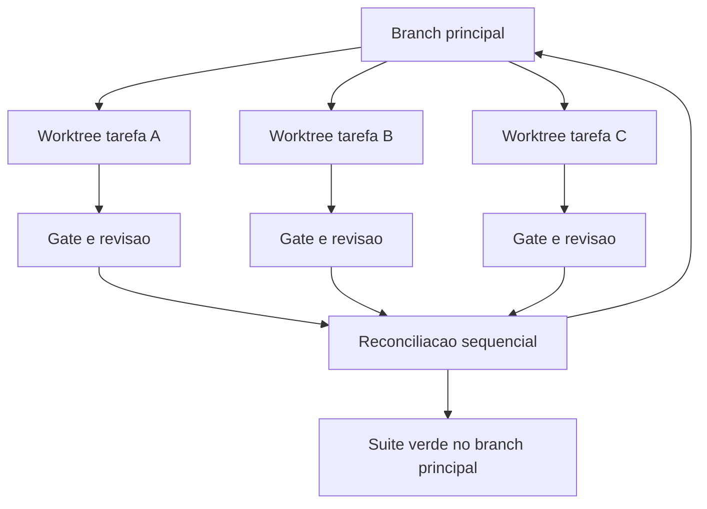

# Capítulo 12: Orquestração: worktrees, paralelismo e o Orca ADE

## 1. Introdução

No Capítulo 11, você aprendeu a delegar dentro de um mesmo diretório de trabalho. Agora o problema muda de escala: como rodar cinco agentes ao mesmo tempo, em tarefas diferentes, sem que eles sobrescrevam o trabalho um do outro? A resposta começa em uma funcionalidade do git de 2015 e termina em uma categoria de ferramenta que só existe desde 2025.

Ao final, você vai saber criar isolamento real por tarefa, decidir quando paralelizar (e quando isso é armadilha), reconciliar trabalho concorrente sem conflito destrutivo e usar um ambiente de desenvolvimento de agentes como o Orca ADE para coordenar uma frota.

**Resumo em uma frase:** paralelismo sem isolamento não é velocidade — é corrupção de estado em câmera lenta.

## 2. Explica

Os termos da casa: LLM é o modelo que gera texto; token é a unidade mínima que ele processa; harness é a camada que decide o que entra na janela e o que é verificado depois.

Um **worktree** é um diretório de trabalho adicional ligado ao mesmo repositório git. O mesmo histórico, o mesmo remoto, mas um diretório separado com seu próprio branch e seu próprio estado de arquivos [1][2]. Criado com um comando, ele resolve o problema que antes exigia clonar o repositório de novo.

Por que isso importa para agentes? Porque um agente modifica arquivos o tempo todo, e dois agentes no mesmo diretório produzem exatamente o mesmo tipo de dano que dois programadores editando o mesmo arquivo sem coordenação: edições que se sobrescrevem, resultados de teste que refletem um estado híbrido que nunca existiu, e investigações que partem de premissas falsas. O worktree dá a cada tarefa um **estado de arquivos isolado** — e, com ele, um resultado atribuível.

Existem três camadas de isolamento, e vale distinguir porque a confusão entre elas é frequente. A primeira é o **isolamento de contexto** (Capítulo 11): cada subagente tem sua janela, o resultado não se mistura. A segunda é o **isolamento de arquivos** (este capítulo): cada tarefa tem seu diretório, edições não colidem. A terceira é o **isolamento de processo**: cada agente roda em seu próprio terminal, com seu próprio ciclo de vida. Um harness maduro tem as três; a maioria dos times tem apenas a primeira e se surpreende com o caos.

A economia do paralelismo é direta: se três tarefas independentes levam uma hora cada e você roda as três ao mesmo tempo, o relógio marca uma hora. Mas o paralelismo tem custos que frequentemente são ignorados.

O primeiro custo é **conflito de merge**. Dois agentes que precisam da mesma função corrigida vão, cada um, implementá-la de forma diferente. Na reconciliação, você descobre duas implementações concorrentes — e uma decisão de arquitetura não planejada que ninguém tomou conscientemente.

O segundo é **trabalho duplicado**. Sem visibilidade do que os outros estão fazendo, agentes investigam os mesmos arquivos, chegam às mesmas conclusões e gastam o dobro do orçamento.

O terceiro é **recurso compartilhado**. Banco de testes, serviço de staging, porta local, limite de taxa de API: paralelismo ingênuo derruba serviços compartilhados. Agentes não sabem que existe concorrência a menos que o harness diga.

A conclusão prática é uma regra de bom senso econômico: **paralelize o que é independente por natureza, serialize o que compartilha estado**. Tarefas independentes são aquelas cujo resultado não muda se executadas em qualquer ordem: revisar 12 artefatos, rodar 5 suítes diferentes, investigar 4 módulos distintos. Tarefas dependentes são as que decidem sobre o mesmo artefato — e essas pertencem a uma sessão só, com estado em arquivo.

Sobre o **Orca ADE**: a categoria é nova e vale descrevê-la com precisão. Um *Agent Development Environment* é um ambiente em que cada tarefa recebe seu próprio worktree, seu próprio terminal de agente e seu próprio navegador, e onde a coordenação entre tarefas é de primeira classe [3][4]. O Orca é uma implementação de código aberto que roda agentes de linha de comando de diferentes fornecedores — o harness que você já usa — em worktrees isolados, com um agente coordenador opcional e recursos como compartilhamento de artefatos e revisão entre tarefas [5].

Duas capacidades do modelo ADE merecem ser observadas com atenção, porque respondem diretamente aos custos listados acima. A primeira é a **atribuição**: cada tarefa tem worktree, branch e artefatos próprios, o que torna trivial saber o que cada agente fez. A segunda é o **gate de revisão entre tarefas**: um agente revisor, somente leitura, avalia o resultado de um agente escritor antes da reconciliação. É o gate do Capítulo 9 aplicado na camada de frota.

Resta o problema que nenhuma ferramenta resolve sozinha: **a reconciliação**. Worktrees isolados no fim precisam convergir para o branch principal. A ordem e a forma dessa convergência são decisão humana, e as três estratégias possíveis têm perfis distintos. *Integração sequencial* (merge um por vez, com a suíte rodando a cada merge) é lenta e segura. *Integração em lote* (todos juntos, um merge) é rápida e arriscada quando há sobreposição. *Reconciliação por reescrita* (um agente reescreve o resultado final usando os diffs como entrada) escala para muitas tarefas e exige revisão rigorosa. A escolha depende da sobreposição esperada — e medir sobreposição antes é o que separa decisão de aposta.

## 3. Ilustra

Na cabine, o worktree é a **mesa de trabalho separada**. Numa torre de controle com múltiplos setores, ninguém compartilha a mesma mesa de cartas: cada controlador tem sua posição, com seus mapas e suas fichas, e a coordenação acontece por protocolo — não por sorte de não se esbarrarem. A torre inteira coordena; as mesas não se misturam.



Repare que o gate existe **antes** da reconciliação e **depois** dela. Antes, para não integrar trabalho inválido; depois, para garantir que a integração não quebrou o que cada tarefa, isoladamente, havia acertado.

## 4. Técnica

Esta seção entrega: criação e gestão de worktrees, fan-out organizado, política de recursos compartilhados, reconciliação e o desenho de um painel de frota.

### Passo 1: crie worktrees por tarefa

```bash
# Cria um worktree por tarefa, cada um em seu branch
git worktree add ../wt-bug-1042 -b fix/bug-1042
git worktree add ../wt-bug-1101 -b fix/bug-1101
git worktree add ../wt-review-pr-88 -b review/pr-88

# Lista e verifica
git worktree list
```

Três detalhes operacionais: mantenha os worktrees **fora** do diretório principal (evita que ferramentas de busca do projeto os incluam); nomeie o diretório com identificador da tarefa (rastreabilidade imediata); e remova com `git worktree remove` ao terminar — worktree esquecido é lixo que confunde as próximas sessões.

### Passo 2: organize o fan-out com metadados

Antes de disparar agentes, materialize o plano em um arquivo. É o equivalente, na camada de frota, do contrato de delegação do Capítulo 11.

```yaml
frota:
  - tarefa: fix/bug-1042
    worktree: ../wt-bug-1042
    objetivo: "corrigir timeout no endpoint de cotacao"
    arquivos_provaveis: ["app/services/cotacao.py", "tests/test_cotacao.py"]
    gate: "python -m pytest -q tests/test_cotacao.py"
  - tarefa: fix/bug-1101
    worktree: ../wt-bug-1101
    objetivo: "tratar nulo no campo peso_kg"
    arquivos_provaveis: ["app/models/encomenda.py"]
    gate: "python -m pytest -q tests/test_encomenda.py"
recursos_compartilhados:
  banco_de_testes: "serializado — uma tarefa por vez"
  limite_api: "3 chamadas simultaneas"
```

O campo `arquivos_provaveis` é o mais subestimado: ele permite detectar sobreposição **antes** de gastar tokens. Duas tarefas com o mesmo arquivo na lista são candidatas a serialização.

### Passo 3: detecte sobreposição antes de paralelizar

```python
def sobreposicao(frota):
    """Pares de tarefas que provavelmente vao colidir no merge."""
    conflitos = []
    for i, a in enumerate(frota):
        for b in frota[i + 1:]:
            comuns = set(a.get("arquivos_provaveis", [])) & set(b.get("arquivos_provaveis", []))
            if comuns:
                conflitos.append({
                    "a": a["tarefa"], "b": b["tarefa"],
                    "arquivos_comuns": sorted(comuns),
                    "acao_sugerida": "serializar ou isolar por arquivo",
                })
    return conflitos
```

Rode isso antes do fan-out. Um par detectado aqui economiza uma reconciliação dolorosa e um par de horas de investigação.

### Passo 4: serialize recursos compartilhados

```json
{
  "politica_recursos": {
    "banco_de_testes": { "modo": "fila", "concorrencia_maxima": 1 },
    "servico_staging": { "modo": "fila", "concorrencia_maxima": 1 },
    "api_fornecedor": { "modo": "teto", "requisicoes_por_minuto": 60 },
    "cache_de_build": { "modo": "compartilhado", "somente_leitura": false }
  }
}
```

Sem essa política, três agentes rodando suíte de testes contra a mesma instância de banco produzem falhas fantasma — e o time perde dias perseguindo um bug que é artefato da própria concorrência.

### Passo 5: reconcile em ordem, com gate nos dois lados

```bash
#!/usr/bin/env bash
set -euo pipefail

for WT in ../wt-bug-1042 ../wt-bug-1101 ../wt-review-pr-88; do
  echo "[reconciliacao] integrando $WT"
  (cd "$WT" && python -m pytest -q) || { echo "[ABORTA] gate do worktree falhou"; exit 1; }
  git merge --no-ff "$(git -C "$WT" rev-parse --abbrev-ref HEAD)"
  python -m pytest -q || { echo "[ABORTA] suite principal quebrou apos merge"; exit 1; }
done

echo "[OK] frota reconciliada com suite verde"
```

O script faz o mesmo trabalho que o capítulo anterior chamava de "integração sequencial": gate no worktree, merge, gate no principal. É lento por construção e é essa lentidão que evita descobrir a quebra três merges depois.

### Passo 6: painel de frota

| Campo | Para que serve |
|---|---|
| tarefa e worktree | atribuição de responsabilidade |
| branch e commit | ponto exato de partida e de chegada |
| turnos e tokens | custo por tarefa, não por média |
| gate e veredito | o que foi verificado antes do merge |
| arquivos tocados | detecção de sobreposição real |
| status | em execução, aguardando revisão, integrada |

O campo "arquivos tocados" fecha um ciclo importante: compara o que o agente *disse* que ia tocar (planejado) com o que ele *de fato* tocou. Divergência sistemática indica planejamento fraco ou tarefa mal delimitada.

### Passo 7: o plano de fases com pontos de sincronização

Paralelismo sem plano de sincronização não é orquestração: é corrida. Workers independentes que nunca convergem produzem cinco resultados que ninguém consegue integrar.

O instrumento que resolve isso é o plano de fases com pontos de sincronização explícitos. O trabalho é dividido em estágios, e entre estágios existe um ponto onde todos os workers precisam ter terminado antes que o próximo comece. Um plano típico de quatro estágios:

| Estágio | Trabalho | Paraleliza? | Sincroniza? |
|---|---|---|---|
| 1. Levantar | Pesquisar, inventariar, medir | Sim | Sim — ninguém escreve antes do inventário fechar |
| 2. Projetar | Decidir a interface comum | Não | Sim — a decisão é uma só |
| 3. Executar | Implementar por fatia | Sim | Não — cada fatia evolui isolada |
| 4. Integrar | Juntar, testar, reconciliar | Não | Sim — a suíte é global |

A regra por trás da tabela vem do princípio de derivação: faz fan-out onde o trabalho expande e paraleliza de fato; faz cascata onde existe uma decisão única que define o contrato. O erro clássico é paralelizar o estágio 2 — cinco workers decidindo a interface comum produzem cinco interfaces incompatíveis.

### Passo 8: integração entre worktrees

Duas árvores de trabalho paralelas sobre o mesmo repositório vão produzir conflitos: é uma propriedade do sistema, não um acidente. O que diferencia uma orquestração sã de uma caótica é que os conflitos são *esperados e baratos*.

Três medidas reduzem o custo:

- **Fronteiras de arquivo por worker.** Atribuir cada fatia a arquivos distintos elimina a maior parte dos conflitos antes que existam. Conflito de linha é sintoma de fronteira mal desenhada.
- **Contrato antes do paralelismo.** O estágio 2 do plano existe exatamente para isso: fixar assinaturas, nomes e formatos antes de o estágio 3 disparar.
- **Integração em estágio único e serial.** Recolher os resultados um a um, rodando a suíte entre cada recolhimento. Integrar tudo de uma vez e descobrir depois qual das cinco árvores quebrou o teste é o caminho mais caro possível.

### Passo 9: telemetria da orquestração

Uma esteira paralela não se governa por impressão. Ela se governa por quatro números, por rodada:

| Número | Pergunta que responde |
|---|---|
| Workers concluídos por estágio | O plano está dimensionado corretamente? |
| Conflitos por integração | As fronteiras estão bem desenhadas? |
| Tempo de parede vs. tempo somado | O paralelismo está de fato acontecendo? |
| Retrabalho após integração | O contrato do estágio 2 foi suficiente? |

O terceiro número merece atenção especial. É comum encontrar uma esteira com cinco workers que leva mais tempo do que a execução serial, porque os workers disputam recurso, esperam por bloqueio de arquivo ou gastam tempo montando contexto. Paralelismo que não reduz tempo de parede não é paralelismo: é despesa disfarçada de arquitetura.

### Passo 10: quando não paralelizar

O paralelismo tem custo fixo — criar a árvore, montar o contexto, sincronizar, integrar. Abaixo de um certo tamanho de tarefa, esse custo domina e a execução serial ganha. Vale serializar quando:

- **A tarefa é pequena em relação ao custo de setup.** O critério prático é comparar com o custo de criar a árvore somado ao de integrar.
- **Existe um recurso compartilhado em disputa.** Banco de teste único, porta única, credencial de uso exclusivo: nesses casos o paralelismo apenas cria fila.
- **A ordem é essencial ao resultado.** Quando o passo B depende do que o passo A descobriu, executar em paralelo significa executar B com informação incompleta — e pagar o retrabalho depois.
- **A verificação é global.** Se testar exige a suíte inteira, cada worker carrega a suíte inteira e o custo de verificação se multiplica.

A pergunta que resume os quatro casos: **o ganho de tempo do paralelismo é maior que o custo de montar, sincronizar e integrar?** Quando a resposta não é um sim claro, a resposta certa é a fila única.

## 5. Aplica

**A cena.** Um time de migração recebe 60 módulos para atualizar para uma nova versão de framework. Animados, disparam oito agentes em paralelo no mesmo diretório. O primeiro dia parece um sucesso: os agentes trabalham rápido. No terceiro dia, o desastre aparece. Um agente sobrescreveu o arquivo de configuração que outro havia acabado de corrigir; a suíte passou em um estado de arquivos híbrido que nunca existiu; dois agentes implementaram a mesma função utilitária de formas incompatíveis; e ninguém consegue dizer qual dos oito tocou o quê.

O diagnóstico tem três camadas, todas deste capítulo. Isolamento de arquivos ausente: oito agentes, um diretório. Recursos compartilhados sem política: todos rodando suíte contra o mesmo banco. E ausência de atribuição: sem worktree e sem branch, não havia como reconstruir o que cada um fez.

A correção foi mecânica. Um worktree por módulo, com branch nomeado. Um arquivo de plano de frota com `arquivos_provaveis` por tarefa, alimentando a detecção de sobreposição. Banco de testes serializado. Reconciliador sequencial com gate nos dois lados — o mesmo script deste capítulo. E uma mudança cultural pequena e decisiva: nenhum merge sem veredito de gate registrado. O time voltou a ter velocidade, agora com recuperabilidade: qualquer regressão podia ser atribuída a um branch e revertida sozinha.

**Métricas.** Acompanhe: tarefas paralelas por dia e conflitos de merge por semana; percentual de tarefas com sobreposição detectada antes do fan-out; tempo de reconciliação por lote; tokens por tarefa paralela (medir a frota inteira, não só uma); e percentual de merges revertidos.

**Armadilhas comuns.** (a) *Oito agentes, um diretório*: o erro que gera todos os outros. (b) *Worktree esquecido*: lixo que confunde buscas e consome disco. (c) *Recurso compartilhado sem fila*: falhas fantasma que parecem bug de código. (d) *Fan-out sem sobreposição calculada*: trabalho duplicado e conflito garantido. (e) *Reconciliação em lote com sobreposição*: perde a atribuição e reverte o valor do isolamento.

**Segunda cena.** Uma esteira com quatro árvores paralelas termina em conflito de merge em um único arquivo central de configuração. O conflito existia desde o começo: as quatro frentes precisavam registrar ali suas dependências. Nenhum gate detectou porque o problema só aparece na integração. A correção foi de desenho — o arquivo central passa a ser editado em um único estágio serial, e as quatro frentes trabalham sobre arquivos próprios. A lição vale para qualquer paralelismo: procure o arquivo que todos tocam e trate-o como recurso compartilhado, com dono e momento definidos.

**Nota de campo.** Em execuções reais, o gargalo raramente é a capacidade de rodar vários workers em paralelo — isso é fácil. O gargalo é a *recolha*: alguém precisa validar quatro resultados, decidir a ordem de integração e reconciliar divergências de estilo. Quando esse trabalho é subestimado, a esteira paralela termina produzindo mais horas de integração do que teria custado fazer tudo em série. Antes de paralelizar, conte quem vai integrar e quanto tempo essa pessoa tem.

**Erros de julgamento.** (a) Paralelizar antes de fixar o contrato comum. (b) Deixar workers competindo pelo mesmo recurso de teste. (c) Integrar tudo de uma vez em vez de recolher uma árvore por vez. (d) Medir sucesso da orquestração pelo número de workers, e não pelo tempo de parede até a entrega.

**Antipadrão observável.** Quando duas árvores produzem diffs que se sobrepõem nas mesmas linhas, a divisão de trabalho foi feita por tema e não por fronteira de arquivo. Fronteira boa produz diffs disjuntos.

### Síntese operacional

| Estágio | Paraleliza? | Ponto de sincronização |
|---|---|---|
| Levantar | Sim | Inventário fechado |
| Projetar contrato | Não | Decisão única registrada |
| Executar por fatia | Sim | Fronteiras de arquivo disjuntas |
| Integrar | Não | Suíte verde após cada recolha |

Três regras que ficam com quem opera:

- **Recurso compartilhado tem dono e momento.** Arquivo central, porta e banco de teste não são paralelos.
- **Recolha serial, integração incremental.** Uma árvore por vez, com verificação no meio.
- **Paralelismo se mede em tempo de parede.** Mais workers com o mesmo tempo total é despesa, não arquitetura.

### Nota do revisor

Os três desvios mais comuns neste capítulo, em ordem de frequência:

1. **Paralelizar sem contrato comum.** O estágio de decisão é serial por natureza; abri-lo em várias árvores produz interfaces incompatíveis e integração caríssima.
2. **Recurso compartilhado tratado como independente.** Banco de teste, porta e arquivo central são pontos únicos de disputa. Cada um precisa de dono e de momento definido.
3. **Integração em lote único.** Recolher quatro árvores de uma vez e descobrir depois qual delas quebrou a suíte custa mais do que recolher uma a uma com verificação no meio.

## 6. Conclusão

Três ideias fecham o capítulo. Primeiro: worktree dá isolamento de arquivos, que é a camada que falta na maioria dos times que já fazem isolamento de contexto. Segundo: paralelismo tem custos reais — conflito, duplicação e disputa de recurso — e a decisão correta é paralelizar o independente e serializar o que compartilha estado. Terceiro: reconciliação é decisão humana com estratégia explícita, e o gate deve existir antes e depois do merge.

**Seu turno.** Escolha duas tarefas independentes do seu backlog, crie um worktree para cada, escreva o plano de frota com `arquivos_provaveis`, detecte sobreposição e reconcile com gate nos dois lados. Meça o tempo de relógio comparado à execução serial.

- [ ] Dois worktrees criados, nomeados e depois removidos
- [ ] Plano de frota com arquivos prováveis por tarefa
- [ ] Detecção de sobreposição executada antes do fan-out
- [ ] Recursos compartilhados com política de fila
- [ ] Reconciliador com gate nos dois lados

No próximo capítulo, você decide o que quase ninguém decide conscientemente: qual modelo usar em cada turno, e por quê.

## 7. Referências

[1] GIT. *git-worktree — Referência oficial*. Disponível em: https://git-scm.com/docs/git-worktree. Acesso em: 12 set. 2026.
[2] ANTHROPIC. *Run parallel sessions with worktrees — Claude Code Docs*. Disponível em: https://code.claude.com/docs/en/worktrees. Acesso em: 12 set. 2026.
[3] ORCA. *What is Orca? — Orca Docs*. Disponível em: https://www.onorca.dev/docs. Acesso em: 12 set. 2026.
[4] ORCA. *Orca — The agent development environment*. Disponível em: https://www.onorca.dev/. Acesso em: 12 set. 2026.
[5] STABLY AI. *stablyai/orca — GitHub*. Disponível em: https://github.com/stablyai/orca. Acesso em: 12 set. 2026.
[6] ANTHROPIC. *Subagents in the SDK — Claude Code Docs*. Disponível em: https://code.claude.com/docs/en/agent-sdk/subagents. Acesso em: 12 set. 2026.
[7] ANTHROPIC. *All settings — Claude Code Docs*. Disponível em: https://code.claude.com/docs/en/settings-reference. Acesso em: 12 set. 2026.
[8] ANTHROPIC. *Hooks reference — Claude Code Docs*. Disponível em: https://code.claude.com/docs/en/hooks. Acesso em: 12 set. 2026.
[9] ANTHROPIC. *Effective context engineering for AI agents*. Disponível em: https://www.anthropic.com/engineering/effective-context-engineering-for-ai-agents. Acesso em: 12 set. 2026.
[10] MOHAMMADI, Mahmoud et al. *Evaluation and Benchmarking of LLM Agents: A Survey*. Disponível em: https://doi.org/10.1145/3711896.3736570. Acesso em: 12 set. 2026.
[11] WANG, Lei et al. *A survey on large language model based autonomous agents*. Disponível em: https://doi.org/10.1007/s11704-024-40231-1. Acesso em: 12 set. 2026.
[12] XI, Zhiheng et al. *The Rise and Potential of Large Language Model Based Agents: A Survey*. Disponível em: http://arxiv.org/abs/2309.07864. Acesso em: 12 set. 2026.
[13] SAPKOTA, Ranjan; ROUMELIOTIS, Konstantinos I.; KARKEE, Manoj. *AI Agents vs. Agentic AI: A Conceptual Taxonomy, Applications and Challenges*. Disponível em: https://doi.org/10.1016/j.inffus.2025.103599. Acesso em: 12 set. 2026.
[14] MODEL CONTEXT PROTOCOL. *Specification (2025-06-18)*. Disponível em: https://modelcontextprotocol.io/specification/2025-06-18. Acesso em: 12 set. 2026.
[15] LANGCHAIN. *Context Engineering*. Disponível em: https://www.langchain.com/blog/context-engineering-for-agents. Acesso em: 12 set. 2026.
[16] SOURCEGRAPH. *Context Engineering: A Practical Guide for AI Agents*. Disponível em: https://sourcegraph.com/blog/context-engineering. Acesso em: 12 set. 2026.
[17] AGENTS.MD. *agentsmd/agents.md — Repositório oficial do padrão*. Disponível em: https://github.com/agentsmd/agents.md. Acesso em: 12 set. 2026.
[18] GRESHAKE, Kai et al. *Not What You've Signed Up For: Compromising Real-World LLM-Integrated Applications with Indirect Prompt Injection*. Disponível em: https://doi.org/10.1145/3605764.3623985. Acesso em: 12 set. 2026.
[19] ANTHROPIC. *Explore the context window — Claude Code Docs*. Disponível em: https://code.claude.com/docs/en/context-window. Acesso em: 12 set. 2026.
[20] XU, Weikai et al. *LLM-Based Agents for Tool Learning: A Survey*. Disponível em: https://doi.org/10.1007/s41019-025-00296-9. Acesso em: 12 set. 2026.
