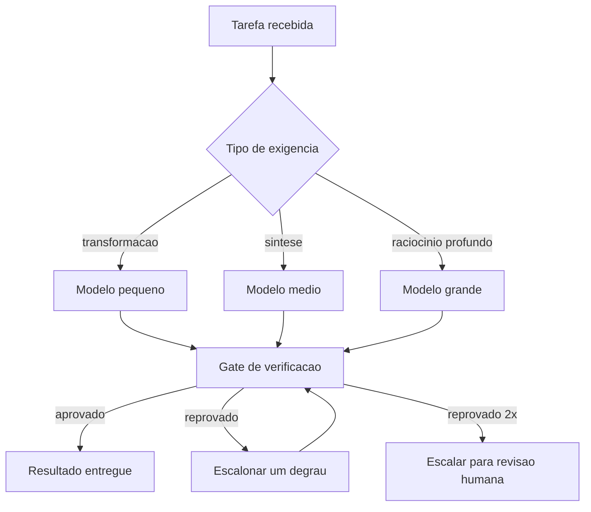

# Capítulo 13: Roteamento inteligente de LLM: o modelo certo por turno

## 1. Introdução

No Capítulo 12, você rodou uma frota em paralelo. Agora a pergunta deixa de ser "quantos agentes" e passa a ser "qual cérebro para cada um deles". A maioria dos times escolhe um modelo por hábito — o mais forte para tudo, ou o mais barato para tudo — e paga a diferença em dinheiro ou em qualidade. Roteamento é a disciplina de decidir por turno, com critério explícito.

Ao final, você vai saber classificar tarefas por exigência cognitiva, montar uma cascata de modelos com escalonamento, definir contratos que sobrevivem à troca de modelo e medir se o seu roteador está de fato economizando sem perder qualidade.

**Resumo em uma frase:** roteamento é a única otimização que não exige abrir mão de nada — desde que você saiba medir qualidade por tarefa, e não por sensação.

## 2. Explica

Os termos da casa: LLM é o modelo de linguagem de grande porte que gera texto; token é a unidade mínima que ele processa; harness é a camada que decide o que entra na janela e o que é verificado depois. Três termos técnicos aparecem adiante e ficam definidos aqui: hook é um comando que o harness dispara automaticamente em um evento do ciclo de vida do agente; retry é a repetição de uma chamada que falhou; e context engineering é a disciplina de curar o conjunto ótimo de tokens durante a inferência.

A literatura de roteamento parte de uma observação simples e economicamente poderosa: para a maior parte das consultas, um modelo menor entrega resultado equivalente a um modelo maior por uma fração do custo. O trabalho do roteador é identificar *quais* consultas são essas [1][2]. Em vez de tratar o modelo como escolha única e global, o roteador trata a decisão como uma alocação por chamada.

Existem três estratégias de roteamento, e elas se combinam.

A primeira é **roteamento por regra**: o harness decide com base em metadados da tarefa — tipo de operação, tamanho do contexto, fase do trabalho. É determinística, gratuita e auditável. "Extração de campos estruturados vai para o modelo pequeno; geração de prosa vai para o grande" é uma regra, e você pode lê-la, revisá-la e versioná-la.

A segunda é **roteamento por cascata** (ou escalonamento): tenta o modelo barato primeiro; se a verificação falhar, escala para o mais caro [3]. É a estratégia que combina melhor com este livro, porque depende de verificação — e você construiu verificação nos Capítulos 2 e 9. Sem gate, cascata é aposta; com gate, é economia com garantia.

A terceira é **roteamento aprendido**: um modelo (ou classificador) decide qual modelo usar, treinado em dados de preferência ou de desempenho [1][4]. É a mais sofisticada e a que exige mais infraestrutura: você precisa de medição contínua e de um conjunto de avaliação confiável. Vale quando o volume é alto o suficiente para amortizar.

A dimensão que organiza tudo é a **exigência cognitiva da tarefa**, não o tamanho do prompt. Três perfis merecem ser distinguidos.

**Tarefas de transformação** aplicam uma regra conhecida a uma entrada: extrair campos de um JSON, formatar dados, classificar por categoria, resumir em N palavras, traduzir. São previsíveis, verificáveis e quase sempre resolvidas por modelos pequenos. É aqui que vive o dinheiro economizado.

**Tarefas de síntese** combinam informações dispersas em algo novo: escrever um parecer, propor um desenho de solução, revisar um documento. Exigem mais e a verificação é parcial — você consegue verificar forma e consistência, não a qualidade do juízo.

**Tarefas de raciocínio profundo** envolvem múltiplos passos interdependentes com decisões que mudam o caminho: depurar um bug sutil, decidir arquitetura, conduzir investigação longa. Aqui modelos menores degradam de forma visível, e é onde vale pagar.

Duas armadilhas merecem nome. A primeira é **rotear por sensação**: o time "sente" que o modelo pequeno não serve para certa tarefa, sem nunca ter testado com medição. A segunda, simétrica, é **rotear por preço unitário**: escolher sempre o mais barato e não perceber que o custo real subiu por causa de mais turnos e mais retrabalho. A métrica que resolve as duas é a mesma: **custo por tarefa concluída com verificação aprovada**.

Isso reposiciona o problema. Não se otimiza custo por token; otimiza-se custo por **resultado aceito**. Um modelo duas vezes mais caro que conclui a tarefa na metade dos turnos pode ser mais barato no fim. Um modelo barato que falha na verificação e escala para o caro é mais caro que começar pelo caro — e é por isso que a taxa de acerto do primeiro degrau da cascata é o número mais importante para dimensioná-la.

Há, por fim, a condição que torna tudo isso seguro: **o contrato**. Um harness bem projetado não depende de um modelo específico, porque o contrato — formato de saída, esquema de ferramenta, critério de pronto — é verificado externamente. Assim, trocar de modelo passa a ser um parâmetro, não uma reescrita. É a mesma lição do Capítulo 1: o que garante o resultado é a cabine, não o piloto. Roteamento só é uma alavanca de custo onde o harness já é a garantia de qualidade.

## 3. Ilustra

Na cabine, o roteamento é a **escolha do modo de pilotagem**. Em cruzeiro, o piloto automático conduz — é preciso, econômico e suficiente. Em aproximação com tempo ruim, o piloto assume manualmente, com toda a atenção e todo o consumo de combustível do procedimento. Em decolagem, o automático jamais é usado. Ninguém defende "sempre manual" nem "sempre automático": a escolha é por fase, com critério escrito no manual.



O nó decisivo é o gate, não o modelo. A cascata só é honesta porque existe uma verificação que diz "este resultado está bom" sem consultar o modelo que o produziu — a mesma assimetria do Capítulo 2.

## 4. Técnica

Esta seção entrega: a matriz de roteamento, a cascata com escalonamento, a medição de custo por resultado aceito e a validação do roteador.

### Passo 1: escreva a matriz de roteamento como configuração

Roteamento por regra precisa ser legível e versionado. Não espalhe condicionais pelo código.

```yaml
roteamento:
  extracao-campos:
    modelo: pequeno
    verificacao: "schema json obrigatorio"
  classificacao:
    modelo: pequeno
    verificacao: "categoria pertence ao enum"
  resumo-curto:
    modelo: pequeno
    verificacao: "limite de palavras + presenca de 3 entidades citadas"
  parecer-tecnico:
    modelo: medio
    verificacao: "secoes obrigatorias + citacao de caminho:linha"
  escrita-longa:
    modelo: grande
    verificacao: "estrutura + consistencia entre secoes"
  depuracao-multi-passo:
    modelo: grande
    verificacao: "teste que falhava agora passa"
  decidir-arquitetura:
    modelo: grande
    verificacao: "revisao humana obrigatoria"
custo_maximo_por_tarefa_usd: 2.50
```

Cada linha nomeia o modelo e a verificação. Uma tarefa sem verificação declarada não pode ser roteada para o modelo pequeno — essa regra sozinha evita a maior parte do risco.

### Passo 2: implemente a cascata com escalonamento

```python
DEGRAUS = ["pequeno", "medio", "grande"]
MAX_TENTATIVAS = 2


def executar_com_cascata(tarefa, executar_modelo, verificar):
    """Tenta do mais barato ao mais caro, escalando apenas quando a verificacao falha."""
    inicio = DEGRAUS.index(tarefa.get("modelo_inicial", "pequeno"))
    historico = []
    for tentativa in range(MAX_TENTATIVAS):
        degrau = min(inicio + tentativa, len(DEGRAUS) - 1)
        modelo = DEGRAUS[degrau]
        saida = executar_modelo(modelo, tarefa)
        veredito = verificar(tarefa, saida)
        historico.append({"modelo": modelo, "aprovado": veredito["aprovado"],
                          "motivo": veredito.get("motivo", "")})
        if veredito["aprovado"]:
            return {"saida": saida, "modelo_final": modelo, "historico": historico}
    return {"saida": None, "modelo_final": None, "historico": historico,
            "escalar_humano": True}
```

Dois detalhes de projeto. O `historico` é obrigatório: sem ele você não descobre se o primeiro degrau acerta a maior parte das vezes ou menos da metade — e é essa taxa que decide a economia real. E `escalar_humano` é um resultado legítimo, não uma falha: duas tentativas reprovadas significam que a tarefa exige julgamento, não mais capacidade.

### Passo 3: meça custo por resultado aceito

```python
PRECOS = {"pequeno": 0.6, "medio": 3.0, "grande": 15.0}  # por milhão de tokens de saida


def custo_por_aceito(execucoes):
    """Custo medio por tarefa que passou na verificacao."""
    aceitas = [e for e in execucoes if e["aprovado"]]
    gasto_total = sum(e["custo"] for e in execucoes)
    return {
        "tarefas": len(execucoes),
        "aceitas": len(aceitas),
        "taxa_aceitacao": round(len(aceitas) / len(execucoes), 3) if execucoes else 0.0,
        "gasto_total": round(gasto_total, 4),
        "custo_por_aceita": round(gasto_total / len(aceitas), 4) if aceitas else None,
        "tentativas_medias": round(sum(e["tentativas"] for e in execucoes) / len(execucoes), 2),
    }
```

`custo_por_aceita` é a métrica de decisão. Compare-a entre o cenário "sempre grande" e o cenário com cascata: quando a cascata tem taxa de aceitação alta no primeiro degrau, a economia tende a ser expressiva sem perda de qualidade medida — mas o número exato depende da sua tarefa, e é por isso que a comparação precisa ser medida no seu próprio pipeline, não assumida deste livro.

### Passo 4: valide o roteador antes de confiar nele

Roteador é código; código precisa de teste. Monte um conjunto pequeno e estável de tarefas com resultado esperado.

```json
{
  "conjunto_avaliacao": [
    { "tarefa": "extracao-campos", "entrada": "exemplo_01.json", "esperado": "schema valido" },
    { "tarefa": "classificacao", "entrada": "ticket_07.txt", "esperado": "categoria=entrega" },
    { "tarefa": "depuracao-multi-passo", "entrada": "bug_1042.md", "esperado": "teste passa" }
  ],
  "criterio_aprovacao": {
    "taxa_minima_aceitacao": 0.9,
    "custo_maximo_por_aceita_usd": 0.35
  }
}
```

Rode esse conjunto a cada mudança de regra de roteamento. Sem ele, você não sabe se a economia veio de sabedoria ou de sorte.

### Tabela de decisão: qual degrau para qual tarefa

| Sinal da tarefa | Degrau | Verificação |
|---|---|---|
| Saída cabe em esquema fechado | pequeno | validador de esquema |
| Classificação com poucas categorias | pequeno | pertence ao enum |
| Resumo com limite objetivo | pequeno | limite + entidades citadas |
| Síntese com estrutura obrigatória | médio | seções e citações |
| Escrita longa e coerente | grande | consistência entre seções |
| Múltiplos passos com decisões encadeadas | grande | teste que exercita o caminho |
| Decisão irreversível | grande + humano | revisão humana |

### Passo 5: a matriz de roteamento por natureza da tarefa

Roteamento começa com um mapa: qual modelo para qual trabalho. Não existe resposta universal, mas existe um critério — a tarefa pede *geração*, *julgamento* ou *extração*?

| Natureza da tarefa | Exigência dominante | Escolha típica |
|---|---|---|
| Extração e classificação | Determinismo, custo baixo | Modelo pequeno, com esquema de saída fixo |
| Transformação de texto | Estilo, consistência | Modelo médio, temperatura baixa |
| Julgamento e revisão | Capacidade de refutação | Modelo grande, com critérios explícitos |
| Geração longa e criativa | Coerência global | Modelo grande, streaming |
| Ferramenta com resultado estruturado | Precisão de formato | Modelo pequeno com validação de esquema |

A coluna da direita é menos importante que a do meio. O valor do mapa não está em escolher um nome de modelo, mas em explicitar *que tipo de capacidade a tarefa exige*. Sem essa explicitação, o roteamento degenera em preferência pessoal — e preferência pessoal envelhece a cada lançamento.

### Passo 6: roteador determinístico antes de roteador semântico

Existe uma tentação de começar o roteamento por um classificador inteligente, que lê a tarefa e decide o modelo. É a ordem errada.

Comece por regras determinísticas: tamanho da entrada, presença de bloco de código, tipo de artefato, fase do fluxo. Essas regras são auditáveis, não custam token e não têm modo de falha silencioso — se uma regra erra, o erro é visível na tabela. Só depois de esgotar o que é determinístico vale a pena considerar um roteador semântico.

O roteador semântico tem dois custos que precisam estar no orçamento: ele próprio consome um turno de inferência antes de a tarefa começar, e ele erra de forma calada — mandando uma tarefa pesada para um modelo pequeno e produzindo um resultado plausível mas raso. Por isso, quando ele entra, entra atrás de um piso: nunca abaixo de um modelo mínimo, independentemente do que o classificador decidir.

### Passo 7: avaliar o roteador antes de promovê-lo

Um roteador só pode ser promovido com evidência. O teste mínimo usa um conjunto de tarefas representativas com resultado conhecido, e compara três políticas: sempre o modelo grande, sempre o modelo pequeno, e o roteador. Quatro medidas:

- **Qualidade.** O roteador entrega resultado aceitável na maioria dos casos?
- **Custo.** Qual é a economia real contra o modelo grande sempre?
- **Evasão silenciosa.** Quantos casos foram mal encaminhados sem gerar erro explícito?
- **Latência.** O turno extra do classificador compensa no tempo total?

O número que mais importa é o terceiro. Falha explícita é barata: o sistema detecta e reencaminha. Falha silenciosa é a que corrói a confiança na esteira, porque produz artefatos que passam nos gates de forma e falham no mérito.

### Passo 8: fallback e degradação controlada

Todo roteador precisa de resposta para a pergunta: e quando o modelo escolhido não está disponível? Sem política, a resposta acaba sendo "o sistema para" — e um sistema que para no meio da esteira é pior que um sistema que degrada com aviso.

Uma política de fallback em três degraus: tentar o modelo escolhido; em falha de disponibilidade, subir um nível de capacidade com registro do desvio; em falha persistente, degradar para o último nível conhecido com aviso explícito ao operador e marcação no artefato produzido.

O ponto de projeto é que a degradação *deixa rastro*. Um artefato produzido em modo degradado precisa carregar essa informação, para que a revisão humana saiba onde olhar. Fallback silencioso é a mesma doença da falha silenciosa do roteador, com o agravante de acontecer justamente quando algo já está errado no sistema.

## 5. Aplica

**A cena.** Uma empresa de logística processa 40 mil comprovantes por mês com um agente que extrai dados e classifica ocorrências. O time escolheu o modelo mais forte por segurança, e o custo por comprovante é alto. A proposta de trocar tudo pelo modelo pequeno é recebida com resistência: "vai errar em campo crítico".

Você propõe uma terceira via: roteamento com cascata. O diagnóstico mostra que 82% do volume é extração de campos com esquema fechado — tarefa de transformação. Outros 14% são classificação com sete categorias. Apenas 4% exigem síntese ou raciocínio.

A implementação tem três degraus e um gate. Extração e classificação saem no modelo pequeno, com validação de esquema e enum. O que falha na validação escala para o médio. Ambiguidade genuína — texto ilegível, ocorrência sem categoria — escala para o grande e é marcada para conferência. Resultado em três meses: custo por comprovante caiu 76%; a taxa de erro em campo crítico ficou *menor* que antes, porque a validação de esquema pegou erros que passavam despercebidos quando a saída era aceita por confiança.

**Métricas.** Acompanhe: taxa de aceitação no primeiro degrau (meta acima de 70% em tarefas de transformação); custo por resultado aceito; taxa de escalonamento para o segundo e terceiro degraus; percentual que termina em revisão humana; e qualidade medida no conjunto de avaliação, comparada ao cenário de modelo único.

**Armadilhas comuns.** (a) *Roteamento sem gate*: cascata sem verificação é retry caro. (b) *Medir custo por token*: ignora turnos e retrabalho, e por isso mente. (c) *Conjunto de avaliação desatualizado*: o roteador parece bom porque o teste é fácil. (d) *Roteamento por sensação*: decisão sem dado, mantida por hierarquia. (e) *Dependência do modelo no contrato*: instruções e esquemas escritos para um modelo específico impedem a troca que o roteamento pressupõe.

**Segunda cena.** Um roteador manda a revisão final de um texto longo para o modelo pequeno, com a justificativa de que "revisar é tarefa simples". O texto sai sem erros de forma e com dois problemas de coerência que um modelo maior teria apontado. Como o gate de forma aprovou, o defeito só aparece na leitura humana. O caso ilustra o custo real do roteamento mal calibrado: ele não produz erro visível, produz aprovação falsa. A correção é fixar um piso de capacidade para tarefas de julgamento e nunca abaixo dele, por economia que seja.

**Nota de campo.** Praticamente toda equipe que adota roteamento passa por uma fase de entusiasmo em que manda quase tudo para o modelo menor e depois descobre o custo nas revisões. O aprendizado comum é manter o roteamento conservador por padrão e expandi-lo por evidência: só degrade a tarefa X para o modelo menor depois de mostrar, com um conjunto de casos, que a qualidade se mantém. O caminho oposto — degradar tudo e subir o que reclamar — transfere o custo para quem revisa, que é exatamente quem tem menos tempo.

**Erros de julgamento.** (a) Rotear por custo do token sem considerar o custo da revisão humana. (b) Deixar o roteador decidir sem piso mínimo. (c) Promover política de roteamento sem conjunto de avaliação. (d) Fazer fallback silencioso, produzindo artefato degradado sem marca.

**Antipadrão observável.** Quando a mesma tarefa produz resultados de qualidade visivelmente diferente em execuções distintas sem que a entrada tenha mudado, há roteamento instável em ação. Roteamento precisa ser auditável: dado o mesmo caso, a mesma escolha.

### Síntese operacional

| Caso | Política | Piso |
|---|---|---|
| Extração e classificação | Modelo pequeno com esquema | Validação de formato |
| Resumo de material longo | Modelo médio | Checagem de fidelidade |
| Revisão e refutação | Modelo grande | Nunca degradar |
| Geração longa | Modelo grande com streaming | Coerência global |
| Ferramenta com saída estruturada | Modelo pequeno | Validação de esquema |

Três regras que ficam com quem opera:

- **Determinístico antes de semântico.** Regra auditável só é substituída por classificador depois de evidência.
- **Piso mínimo sempre.** Nenhuma economia justifica rotear tarefa de julgamento para baixo do piso.
- **Fallback deixa marca.** Artefato produzido em degradação carrega o registro da degradação.

### Nota do revisor

Os três desvios mais comuns neste capítulo, em ordem de frequência:

1. **Roteador promovido sem avaliação.** Sem conjunto de casos conhecidos, a economia medida no primeiro dia vira custo de revisão no segundo.
2. **Tarefa de julgamento roteada para baixo.** O resultado passa nos gates de forma e falha no mérito — a pior combinação possível, porque a falha não gera alarme.
3. **Fallback silencioso.** Quando o modelo escolhido não responde, a degradação precisa deixar marca no artefato. Sem marca, a revisão não sabe onde olhar.

## 6. Conclusão

Três pontos ficam. Primeiro: rotear é decidir por tarefa, com três estratégias combináveis — regra, cascata e aprendido — e a cascata só é confiável onde existe verificação. Segundo: a métrica correta é custo por resultado aceito, não custo por token; ela é a única que enxerga o preço do retrabalho. Terceiro: o que torna a troca de modelo segura é o contrato verificado externamente — sem ele, roteamento é aposta.

**Seu turno.** Classifique as cinco tarefas mais frequentes do seu fluxo por exigência cognitiva (transformação, síntese, raciocínio). Escreva a matriz de roteamento com a verificação de cada linha e rode uma cascata de dois degraus em uma delas, medindo custo por resultado aceito.

- [ ] Cinco tarefas classificadas por exigência cognitiva
- [ ] Matriz de roteamento escrita com verificação por linha
- [ ] Cascata de dois degraus implementada com histórico de tentativas
- [ ] Custo por resultado aceito medido contra o cenário anterior
- [ ] Conjunto de avaliação criado para validar mudanças de regra

No próximo capítulo, você enfrenta a parte que ninguém documenta: as configurações que existem, têm efeito, e não te contam nada.

## 7. Referências

[1] ONG, Isaac et al. *RouteLLM: Learning to Route LLMs with Preference Data*. Disponível em: https://arxiv.org/abs/2406.18665. Acesso em: 12 set. 2026.
[2] MOHAMMADI, Mahmoud et al. *Evaluation and Benchmarking of LLM Agents: A Survey*. Disponível em: https://doi.org/10.1145/3711896.3736570. Acesso em: 12 set. 2026.
[3] ANTHROPIC. *All settings — Claude Code Docs*. Disponível em: https://code.claude.com/docs/en/settings-reference. Acesso em: 12 set. 2026.
[4] KWON, Woosuk et al. *Efficient Memory Management for Large Language Model Serving with PagedAttention*. Disponível em: https://arxiv.org/abs/2309.06180. Acesso em: 12 set. 2026.
[5] GOOGLE CLOUD. *Prompt caching — Claude partner models*. Disponível em: https://docs.cloud.google.com/gemini-enterprise-agent-platform/models/partner-models/claude/prompt-caching. Acesso em: 12 set. 2026.
[6] ANTHROPIC. *Effective context engineering for AI agents*. Disponível em: https://www.anthropic.com/engineering/effective-context-engineering-for-ai-agents. Acesso em: 12 set. 2026.
[7] ANTHROPIC. *Subagents in the SDK — Claude Code Docs*. Disponível em: https://code.claude.com/docs/en/agent-sdk/subagents. Acesso em: 12 set. 2026.
[8] ANTHROPIC. *Hooks reference — Claude Code Docs*. Disponível em: https://code.claude.com/docs/en/hooks. Acesso em: 12 set. 2026.
[9] WANG, Lei et al. *A survey on large language model based autonomous agents*. Disponível em: https://doi.org/10.1007/s11704-024-40231-1. Acesso em: 12 set. 2026.
[10] XI, Zhiheng et al. *The Rise and Potential of Large Language Model Based Agents: A Survey*. Disponível em: http://arxiv.org/abs/2309.07864. Acesso em: 12 set. 2026.
[11] XU, Weikai et al. *LLM-Based Agents for Tool Learning: A Survey*. Disponível em: https://doi.org/10.1007/s41019-025-00296-9. Acesso em: 12 set. 2026.
[12] LANGCHAIN. *Context Engineering*. Disponível em: https://www.langchain.com/blog/context-engineering-for-agents. Acesso em: 12 set. 2026.
[13] SOURCEGRAPH. *Context Engineering: A Practical Guide for AI Agents*. Disponível em: https://sourcegraph.com/blog/context-engineering. Acesso em: 12 set. 2026.
[14] KONISHI, Hidekazu. *Anthropic Claude API Prompt Caching and Token Efficiency*. Disponível em: https://hidekazu-konishi.com/entry/anthropic_claude_api_prompt_caching_and_token_efficiency.html. Acesso em: 12 set. 2026.
[15] AGENTS.MD. *agentsmd/agents.md — Repositório oficial do padrão*. Disponível em: https://github.com/agentsmd/agents.md. Acesso em: 12 set. 2026.
[16] CURSOR. *Rules — Cursor Docs*. Disponível em: https://cursor.com/docs/rules. Acesso em: 12 set. 2026.
[17] MODEL CONTEXT PROTOCOL. *Server Features — Tools*. Disponível em: https://modelcontextprotocol.io/specification/2026-07-28/server/tools. Acesso em: 12 set. 2026.
[18] ORCA. *What is Orca? — Orca Docs*. Disponível em: https://www.onorca.dev/docs. Acesso em: 12 set. 2026.
[19] GIT. *git-worktree — Referência oficial*. Disponível em: https://git-scm.com/docs/git-worktree. Acesso em: 12 set. 2026.
[20] ANTHROPIC. *Context engineering: memory, compaction, and tool clearing*. Disponível em: https://platform.claude.com/cookbook/tool-use-context-engineering-context-engineering-tools. Acesso em: 12 set. 2026.
