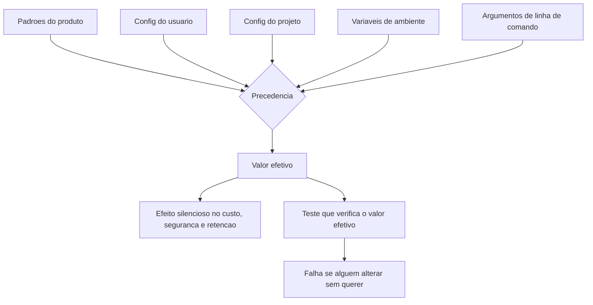

# Capítulo 14: Configurações que nunca te contam

## 1. Introdução

No Capítulo 13, você aprendeu a escolher o modelo por tarefa. Agora vamos ao território onde quase ninguém olha: as configurações que já existem, que têm efeito real sobre custo, segurança e comportamento — e que não produzem nenhum aviso quando estão erradas. Nenhum erro no console, nenhum teste vermelho. Apenas um sistema que se comporta de um jeito que ninguém escolheu.

Ao final, você vai saber onde essas configurações moram, como descobrir o valor efetivo (e não o que você acha que configurou), quais são os padrões perigosos e como executar uma auditoria de harness em oito perguntas.

**Resumo em uma frase:** configuração silenciosa é aquela cujo efeito aparece só na fatura, no incidente ou no vazamento — nunca no aviso.

## 2. Explica

Os termos da casa: LLM é o modelo que gera texto; token é a unidade mínima que ele processa; harness é a camada que decide o que entra na janela e o que é verificado depois. E sandbox é o ambiente restrito onde uma ferramenta executa, isolado do resto do sistema. Três termos voltam adiante: hook é um comando disparado automaticamente em um evento do ciclo de vida do agente; feedback é o sinal que o sistema devolve depois de uma ação; e context engineering é a disciplina de curar o conjunto ótimo de tokens durante a inferência.

A primeira razão pela qual configurações silenciosas existem é **precedência**. Todo harness combina camadas: padrões do produto, configuração do usuário, configuração do projeto, variáveis de ambiente, argumentos de linha de comando. A ordem em que elas vencem é documentada, mas raramente lembrada [1]. Na prática, quem decide o comportamento do sistema é a última camada avaliada, e não a que você escreveu com cuidado no repositório. Resultado: um valor definido no projeto é anulado por uma variável de ambiente herdada do shell, e ninguém entende por que o comportamento mudou — um fenômeno recorrente nas auditorias de configuração [2].

A segunda razão é a **assimetria de feedback**. Uma configuração errada que gera erro é corrigida em minutos. Uma configuração errada que gera apenas degradação não gera nenhum sinal: o tempo limite de ferramenta que corta uma resposta válida no meio; o teto de tokens de saída que trunca um relatório; o nível de log que descarta a informação necessária para investigar. O sistema funciona — só funciona pior.

Vamos aos grupos de configuração que mais aparecem em auditorias reais, com o efeito silencioso de cada um.

O primeiro grupo é **orçamento de contexto**: janela máxima, limiar de compactação automática, teto de tokens de saída, teto de resultados de ferramenta. Efeito silencioso: truncamento. O texto corta no meio de uma frase e o modelo continua a partir dali, produzindo conclusão baseada em informação parcial — sem nenhum aviso de que houve corte.

O segundo é **tempo e retentativa**: timeout por ferramenta, timeout por turno, número de retentativas, backoff. Efeito silencioso: falha intermitente que parece flutuação de rede, quando na verdade é o próprio harness abortando operações legítimas e lentas [3].

O terceiro é **permissão e sandbox**: acesso à rede, escrita fora do projeto, execução de shell, leitura de variáveis de ambiente. Efeito silencioso: superfície de ataque aberta e inesperada. Um agente com rede habilitada e leitura de ambiente pode exfiltrar um segredo sem que ninguém tenha decidido conceder essa combinação.

O quarto é **persistência e telemetria**: histórico de sessão gravado em disco, envio de dados para o provedor, retenção por quanto tempo, nível de log. Efeito silencioso: dado sensível em repouso além do necessário, ou registro de auditoria que simplesmente não existe quando você precisa dele.

O quinto é **comportamento automático**: compactação automática, resumo automático de histórico, fallback automático de modelo, atualização automática do harness. Efeito silencioso: o sistema muda de comportamento sem release, sem changelog e sem ninguém ter mexido em nada.

Há três padrões perigosos que aparecem repetidamente e merecem ser memorizados. O primeiro é **o padrão permissivo**: o produto vem configurado para funcionar rápido — rede ligada, sandbox amplo, timeout longo — e o time nunca revê. O segundo é **o padrão herdado**: a configuração de projeto foi copiada de outro projeto e carrega decisões que não se aplicam. O terceiro é **o padrão invisível**: o valor efetivo vem de uma variável de ambiente definida na máquina de uma pessoa e não versionada em lugar nenhum.

Contra isso, existe um método — e ele tem um princípio único que vale o capítulo: **nunca confie no valor que você escreveu; confie no valor efetivo**. Auditar configuração é comparar o que o harness realmente usa com o que está documentado no repositório. A diferença entre os dois é o seu passivo.

O segundo princípio é **versionar o que importa e revisar o que versionou**. Configuração que afeta custo, segurança e retenção pertence ao repositório, mesmo quando o harness permite defini-la globalmente. E precisa de data de revisão: configurações não apodrecem como código, elas apodrecem como decisões — o contexto muda e ninguém revisita.

O terceiro princípio é o mais prático: **toda configuração silenciosa precisa de um teste**. Se o comportamento é importante, ele deve ser verificável. Um teste que falha quando alguém remove a negação de `git push` vale mais que qualquer documentação.

## 3. Ilustra

Na cabine, é a diferença entre a **posição dos seletores** e o que está escrito no manual. O piloto precisa confirmar o estado real do painel — e a checagem é item obrigatório, porque um seletor na posição errada não gera alarme. A aeronave voa; só voa com uma configuração que ninguém escolheu. É exatamente por isso que a checagem de painel existe como procedimento, e não como memória.



Note que o valor efetivo não é a soma das camadas: é o **vencedor da precedência**. E é ele — não a configuração que você escreveu — que governa o sistema.

## 4. Técnica

Esta seção entrega: a descoberta do valor efetivo, a auditoria em oito perguntas, a proteção por teste e o registro de decisões de configuração.

### Passo 1: descubra o valor efetivo, não o declarado

```bash
# Dump da configuracao efetiva do harness (adaptar ao seu)
agent config dump --json > /tmp/efetiva.json

# Compare com o que esta versionado no projeto
python - <<'EOF'
import json
from pathlib import Path

efetiva = json.loads(Path("/tmp/efetiva.json").read_text(encoding="utf-8"))
projeto = json.loads(Path(".agent/settings.json").read_text(encoding="utf-8"))

for chave, valor in sorted(projeto.items()):
    real = efetiva.get(chave, "<ausente>")
    marca = "OK " if real == valor else "DIF"
    print(f"[{marca}] {chave}: projeto={valor!r} efetiva={real!r}")
EOF
```

Toda linha marcada com `DIF` é um passivo: alguém está operando com um valor diferente do que o time escreveu. O `DIF` mais comum é uma variável de ambiente herdada do shell.

### Passo 2: execute a auditoria em oito perguntas

| # | Pergunta | Resposta saudável |
|---|---|---|
| 1 | Qual é o valor efetivo da precedência? | testado, não presumido |
| 2 | Qual é o teto de tokens de saída? | declarado e compatível com o maior artefato |
| 3 | Qual é o timeout por ferramenta? | maior que o p95 real da operação mais lenta |
| 4 | O agente tem acesso à rede? | negado por padrão; permitido por exceção |
| 5 | Há leitura de variáveis de ambiente sensíveis? | negada |
| 6 | O histórico é gravado em disco? Por quanto tempo? | política de retenção documentada |
| 7 | Há compactação ou fallback automático? | limiar conhecido e monitorado |
| 8 | Quem revisa essas decisões, e quando? | data de revisão registrada |

Responder a oito perguntas leva vinte minutos e, em quase todo harness auditado pela primeira vez, encontra pelo menos uma surpresa relevante.

### Passo 3: transforme decisão em teste

Configuração importante precisa de verificação automática. Sem isso, a próxima pessoa desfaz sem perceber.

```python
#!/usr/bin/env python3
"""Testa invariantes de configuracao do harness."""
import json
from pathlib import Path

INVARIANTES = [
    ("permissions.deny", "Bash(git push*)", "push deve ser proibido para agentes"),
    ("permissions.deny", "Write(migrations/*)", "migracao nao pode ser editada a mao"),
    ("limites.tokens_saida_max", 8000, "teto de saida precisa ser explicito"),
    ("rede.allow", False, "rede deve estar negada por padrao"),
    ("retencao.historico_dias", 30, "retencao declarada"),
]


def verificar(caminho=".agent/settings.json"):
    cfg = json.loads(Path(caminho).read_text(encoding="utf-8"))
    falhas = []
    for caminho_chave, esperado, motivo in INVARIANTES:
        atual = cfg
        for parte in caminho_chave.split("."):
            atual = atual.get(parte, {}) if isinstance(atual, dict) else {}
        if esperado not in atual and esperado != atual:
            falhas.append(f"{caminho_chave}: esperado {esperado!r} ({motivo})")
    return falhas


if __name__ == "__main__":
    for f in verificar():
        print(f"[CONFIG] {f}")
    raise SystemExit(1 if verificar() else 0)
```

O detalhe que faz esse teste valer: ele não verifica se você "tem a chave", verifica se o **valor** é o esperado. Configuração presente com valor errado é tão perigosa quanto ausente.

### Passo 4: registre a decisão, com data

```markdown
# Decisoes de configuracao do harness

### 2026-09-12 — teto de saida em 8000 tokens
Motivo: maior artefato gerado tem ~6500 tokens; 8000 da margem sem truncar.
Revisar em: 2027-03-12 ou quando o maior artefato crescer 20%.
Dono: time de plataforma.

### 2026-09-12 — rede negada por padrao
Motivo: nenhuma tarefa atual exige rede; reduz superficie de exfiltracao.
Revisar em: ao integrar a primeira ferramenta que consulte API externa.
```

A data de revisão é o que impede que uma decisão boa para setembro vire uma armadilha em março.

### Tabela de decisão: suspeita e onde olhar

| Sintoma | Configuração suspeita |
|---|---|
| Resposta cortada no meio | teto de tokens de saída |
| Operação legítima "falhou" com erro de rede | timeout por ferramenta |
| Comportamento muda entre máquinas | variável de ambiente herdada |
| Custo subiu sem mudar o volume | compactação ou fallback automático |
| Falta trilha para investigar incidente | nível de log e retenção |
| Segredo apareceu em log | leitura de ambiente e registro de payload |

### Passo 5: auditoria de defaults herdados

Nenhuma configuração nasce do zero. Toda ferramenta chega com um conjunto de padrões que ninguém escolheu — e o operador herda esse conjunto no momento em que instala, sem ler. A maior parte dos problemas de comportamento do agente nasce exatamente aí, em decisões que ninguém recorda ter tomado.

A auditoria de defaults é um exercício de três perguntas por chave relevante:

1. **Qual é o valor atual e quem o escolheu?** Se ninguém consegue responder, o valor é herdado e precisa ser justificado de novo.
2. **Qual é o alcance do efeito?** Uma chave que afeta apenas a formatação da saída tem risco baixo; uma que afeta permissão de escrita ou retenção de log tem risco alto.
3. **O que acontece se eu mudar?** Mudanças em chave de risco alto exigem plano de reversão antes da alteração.

O produto da auditoria é uma lista curta — tipicamente entre dez e vinte chaves — de decisões que passam a ser conscientes. Tudo o que não entra na lista permanece herdado, e isso também é uma decisão, desde que declarada.

### Passo 6: o que fica gravado — logs, histórico e telemetria

Toda sessão de agente gera rastro. A pergunta que quase ninguém faz é: esse rastro fica onde, por quanto tempo, legível por quem?

Existem quatro fluxos típicos, cada um com um risco próprio:

| Fluxo | Conteúdo típico | Risco |
|---|---|---|
| Histórico local da sessão | Conversa inteira, incluindo trechos de código | Alto — pode conter segredo colado no meio |
| Log de ferramenta | Comandos executados e saída | Médio — revela estrutura do projeto |
| Telemetria do fornecedor | Uso, erro, às vezes conteúdo | Variável — depende do contrato |
| Banco de estado da esteira | Status, contadores, caminhos | Baixo — mas cresce indefinidamente |

As três decisões que esse mapa obriga: definir retenção em dias para cada fluxo, definir expurgo automático em vez de limpeza manual, e decidir explicitamente se histórico local pode conter conteúdo sensível. Sem a terceira decisão, o padrão é "pode", porque ninguém construiu o filtro.

### Passo 7: configurações de rede, sandbox e fronteira de execução

A configuração que mais silenciosamente muda o risco é a de fronteira de execução: o agente roda no seu equipamento, em contêiner, em máquina remota? Cada arranjo tem um perfil de exposição distinto.

Dois temas merecem decisão explícita:

- **Saída de rede.** Se o ambiente permite requisição para qualquer destino, um comando de dependência pode trazer código de origem desconhecida. Restringir destinos a uma lista conhecida é a diferença entre um ambiente descrito e um ambiente desconhecido.
- **Ponto de montagem do projeto.** Um agente que enxerga a pasta pessoal inteira tem superfície de leitura muito maior do que precisa. Montar apenas o diretório do projeto reduz o alcance de qualquer instrução mal interpretada.

### Passo 8: a matriz de exposição

Depois de auditar defaults, retenção e fronteira, o material se organiza em uma única tabela — a matriz de exposição do sistema. Cinco linhas bastam para cobrir os pontos que a documentação padrão costuma omitir:

| Dimensão | Pergunta de controle |
|---|---|
| Credencial | Onde mora, como é injetada, quando roda? |
| Dados | O que entra no contexto e o que sai dele? |
| Histórico | O que fica gravado, onde e por quanto tempo? |
| Execução | Onde o código roda e o que ele alcança? |
| Publicação | O que vai para fora e com qual revisão? |

Preencher a matriz não é burocracia: é o instrumento que transforma "configurar o agente" de atividade de tentativa em atividade de engenharia. As linhas em branco são o mapa exato do que ainda não foi decidido — e, portanto, do que ainda vai ser decidido por acidente.

## 5. Aplica

**A cena.** Um time de fintech investiga uma reclamação interna curiosa: o agente de suporte "às vezes inventa" um valor de saldo. Não é sempre; é em cerca de 4% dos casos. Como os outros 96% estão corretos, o time descarta como alucinação eventual e pede ajuste no prompt. Você pede os registros e encontra o padrão: todas as ocorrências são de consultas a contas com histórico muito longo — aquelas cujo retorno da ferramenta ultrapassa o teto de tamanho.

O diagnóstico não tinha nada a ver com prompt. O harness estava truncando a resposta da ferramenta de consulta — silenciosamente, sem marcar o corte — e o modelo, recebendo dados parciais, completava o valor com a estimativa mais plausível. O modelo estava sendo acusado de inventar quando, na verdade, estava preenchendo um buraco que o harness cavou.

A correção foi em três partes, todas de configuração — nenhuma delas envolvendo prompt, que era exatamente o caminho sugerido no início [5]. Primeiro, truncamento passou a ser **explicitado**: o resultado cortado agora traz a marca "[resultado truncado: N de M linhas]". Segundo, o teto daquela ferramenta específica subiu, porque a operação legitimamente precisa de mais linhas. Terceiro, um teste de invariante passou a verificar que toda ferramenta que devolve dado financeiro tem teto compatível com o maior registro esperado. A taxa de "alucinação" caiu para zero — e a lição ficou registrada no repositório de decisões.

**Métricas.** Acompanhe: número de divergências entre configuração efetiva e versionada (meta: zero); data da última revisão de cada decisão de configuração; incidentes com causa raiz em configuração versus causa raiz em código; e tempo médio para diagnosticar um incidente (trilha de auditoria existe ou não).

**Armadilhas comuns.** (a) *Confiar no declarado*: o valor efetivo pode vir de outra camada. (b) *Teto de saída copiado de outro projeto*: trunca silenciosamente o artefato maior do seu. (c) *Rede habilitada "para testar"*: nunca revista, e é exfiltração em potencial. (d) *Log sem retenção definida*: existe para tudo, menos para a investigação que você precisa. (e) *Atualização automática sem revisão*: o comportamento do sistema muda sem release e sem changelog.

**Segunda cena.** Uma equipe descobre, durante uma auditoria, que o histórico completo de sessão estava sendo gravado em disco havia oito meses, incluindo trechos de arquivos de configuração com credenciais coladas em algum momento por engano. Ninguém havia decidido isso: era o padrão de instalação. A remediação exigiu rotação de credenciais e uma política de retenção que antes não existia. O episódio é o exemplo perfeito de uma configuração que ninguém contou — ela não estava errada por decisão, estava errada por omissão.

**Nota de campo.** O hábito que mais rende em auditorias de configuração é manter um arquivo de decisões de ambiente: uma linha por chave relevante, com valor, razão e data. Não é documentação para leitor externo — é a memória do sistema. Sem ele, seis meses depois ninguém sabe distinguir escolha de herança, e toda mudança passa a ser arriscada por falta de contexto, não por complexidade real.

**Erros de julgamento.** (a) Supor que o padrão de fábrica é seguro — ele é apenas o mais comum. (b) Tratar retenção de histórico como detalhe operacional, quando é decisão de risco. (c) Deixar o agente enxergar todo o sistema de arquivos por conveniência. (d) Não registrar quem alterou uma chave sensível e por quê.

**Antipadrão observável.** Quando a resposta a "onde ficam as credenciais?" varia entre membros da equipe, a configuração não está sob controle. Configuração sob controle tem uma resposta única, conhecida e verificável.

### Síntese operacional

| Chave | Natureza | Precisa de decisão explícita? |
|---|---|---|
| Arquivo de instrução ativo | Comportamento | Sim |
| Modelo padrão | Custo e qualidade | Sim |
| Permissão de escrita | Risco | Sim, sempre |
| Retenção de histórico | Dados sensíveis | Sim, com prazo em dias |
| Fronteira de execução | Exposição | Sim, por ambiente |
| Destinos de rede permitidos | Cadeia de suprimentos | Sim, lista fechada |

Três regras que ficam com quem opera:

- **Padrão de fábrica não é decisão.** Toda chave herdada relevante precisa ser reavaliada uma vez.
- **Retenção é risco, não operação.** Definir prazo e expurgo automático é parte do projeto.
- **Matriz de exposição com linha em branco é pendência.** O que não foi decidido será decidido por acidente.

### Nota do revisor

Os três desvios mais comuns neste capítulo, em ordem de frequência:

1. **Retenção de histórico sem prazo.** O padrão grava por tempo indeterminado o que ninguém decidiu guardar. Definir prazo e expurgo automático é decisão de risco, não de operação.
2. **Fronteira de execução ampla por conveniência.** Agente com acesso à pasta pessoal inteira tem uma superfície de leitura muito maior que a necessária para o trabalho.
3. **Matriz de exposição incompleta.** Linha em branco na matriz é pendência real: significa que aquela dimensão será decidida por acidente, provavelmente no dia do incidente.

## 6. Conclusão

Três ideias fecham o capítulo. Primeiro: configuração silenciosa tem efeito real e nenhum aviso — só auditoria por valor efetivo resolve. Segundo: os grupos que mais causam dano são orçamento de contexto, tempo, permissão, retenção e automação; cada um com um padrão perigoso específico. Terceiro: toda configuração que importa precisa de teste e de data de revisão, porque decisões também apodrecem.

**Seu turno.** Rode o dump de configuração efetiva e compare com o versionado. Depois responda as oito perguntas da auditoria e escreva um teste de invariante para as duas configurações mais críticas do seu contexto.

- [ ] Diff entre configuração efetiva e configuração versionada executado
- [ ] Oito perguntas respondidas, com as surpresas anotadas
- [ ] Dois testes de invariante escritos
- [ ] Decisões de configuração registradas com dono e data de revisão
- [ ] Truncamento de saída tornado explícito em todas as ferramentas

No próximo capítulo, você reúne tudo em princípios que sobrevivem à próxima mudança de produto, modelo e padrão.

## 7. Referências

[1] ANTHROPIC. *All settings — Claude Code Docs*. Disponível em: https://code.claude.com/docs/en/settings-reference. Acesso em: 12 set. 2026.
[2] CURSOR. *Rules — Cursor Docs*. Disponível em: https://cursor.com/docs/rules. Acesso em: 12 set. 2026.
[3] ANTHROPIC. *Hooks reference — Claude Code Docs*. Disponível em: https://code.claude.com/docs/en/hooks. Acesso em: 12 set. 2026.
[4] ANTHROPIC. *Explore the context window — Claude Code Docs*. Disponível em: https://code.claude.com/docs/en/context-window. Acesso em: 12 set. 2026.
[5] GRESHAKE, Kai et al. *Not What You've Signed Up For: Compromising Real-World LLM-Integrated Applications with Indirect Prompt Injection*. Disponível em: https://doi.org/10.1145/3605764.3623985. Acesso em: 12 set. 2026.
[6] MODEL CONTEXT PROTOCOL. *Specification (2025-06-18)*. Disponível em: https://modelcontextprotocol.io/specification/2025-06-18. Acesso em: 12 set. 2026.
[7] MODEL CONTEXT PROTOCOL. *Server Features — Tools*. Disponível em: https://modelcontextprotocol.io/specification/2026-07-28/server/tools. Acesso em: 12 set. 2026.
[8] ANTHROPIC. *Effective context engineering for AI agents*. Disponível em: https://www.anthropic.com/engineering/effective-context-engineering-for-ai-agents. Acesso em: 12 set. 2026.
[9] ANTHROPIC. *Context engineering: memory, compaction, and tool clearing*. Disponível em: https://platform.claude.com/cookbook/tool-use-context-engineering-context-engineering-tools. Acesso em: 12 set. 2026.
[10] ANTHROPIC. *Subagents in the SDK — Claude Code Docs*. Disponível em: https://code.claude.com/docs/en/agent-sdk/subagents. Acesso em: 12 set. 2026.
[11] GOOGLE CLOUD. *Prompt caching — Claude partner models*. Disponível em: https://docs.cloud.google.com/gemini-enterprise-agent-platform/models/partner-models/claude/prompt-caching. Acesso em: 12 set. 2026.
[12] MOHAMMADI, Mahmoud et al. *Evaluation and Benchmarking of LLM Agents: A Survey*. Disponível em: https://doi.org/10.1145/3711896.3736570. Acesso em: 12 set. 2026.
[13] WANG, Lei et al. *A survey on large language model based autonomous agents*. Disponível em: https://doi.org/10.1007/s11704-024-40231-1. Acesso em: 12 set. 2026.
[14] AGENTS.MD. *agentsmd/agents.md — Repositório oficial do padrão*. Disponível em: https://github.com/agentsmd/agents.md. Acesso em: 12 set. 2026.
[15] ORCA. *What is Orca? — Orca Docs*. Disponível em: https://www.onorca.dev/docs. Acesso em: 12 set. 2026.
[16] GIT. *git-worktree — Referência oficial*. Disponível em: https://git-scm.com/docs/git-worktree. Acesso em: 12 set. 2026.
[17] ONG, Isaac et al. *RouteLLM: Learning to Route LLMs with Preference Data*. Disponível em: https://arxiv.org/abs/2406.18665. Acesso em: 12 set. 2026.
[18] KWON, Woosuk et al. *Efficient Memory Management for Large Language Model Serving with PagedAttention*. Disponível em: https://arxiv.org/abs/2309.06180. Acesso em: 12 set. 2026.
[19] LANGCHAIN. *Context Engineering*. Disponível em: https://www.langchain.com/blog/context-engineering-for-agents. Acesso em: 12 set. 2026.
[20] SOURCEGRAPH. *Context Engineering: A Practical Guide for AI Agents*. Disponível em: https://sourcegraph.com/blog/context-engineering. Acesso em: 12 set. 2026.
