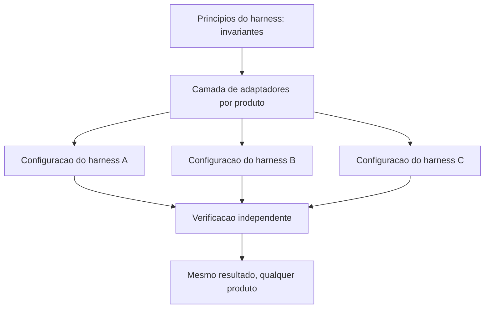

# Capítulo 15: Os segredos universais aplicáveis a qualquer harness

## 1. Introdução

Nos catorze capítulos anteriores, você montou uma cabine: instruções, ferramentas, contexto, custo, gates, hooks, delegação, frota e configuração. Cada uma dessas peças foi apresentada com o detalhe do produto onde ela aparece hoje. Este capítulo separa o que é **invariante de engenharia** do que é **detalhe de produto** — porque a próxima ferramenta que você usar vai ter nomes diferentes, e você precisa saber o que sobrevive à troca.

Ao final, você vai ter um conjunto de princípios que valem em qualquer harness, uma matriz para classificar o que é moda e o que é fundamento, e um critério de portabilidade para escrever hoje configurações que continuarão fazendo sentido quando o produto mudar.

**Resumo em uma frase:** invariantes descrevem relações entre as partes; modas descrevem superfícies de produto — e só os primeiros sobrevivem ao próximo lançamento.

## 2. Explica

Os termos da casa: LLM é o modelo que gera texto; token é a unidade mínima que ele processa; harness é a camada que decide o que entra na janela e o que é verificado depois. E context engineering é a disciplina de curar o conjunto ótimo de tokens durante a inferência.

Vamos começar pelo critério de classificação, que é o que torna o capítulo útil e não apenas uma lista. Um princípio é **invariante** quando ele decorre de uma relação estrutural: modelo probabilístico gera incerteza, contexto tem custo, verificação precisa ser independente. Um princípio é **moda** quando decorre de uma escolha de produto: o nome do arquivo de configuração, o formato do arquivo de regras, o evento exato do hook, a extensão da skill.

A diferença tem consequência prática. Invariantes podem ser ensinados e transferidos; modas precisam ser consultadas na documentação da vez. Confundir os dois é o que faz um time reescrever o harness inteiro a cada dois anos — ou, pior, defender com fervor uma decisão que era circunstancial.

Passemos aos invariantes. São dez, e cada um já apareceu antes neste livro, geralmente demonstrado por um sintoma e não por um princípio.

**1. O modelo é probabilístico; a confiança vem do entorno.** Nada que você configure torna a geração determinística. O que se pode garantir é que o erro não passe — e isso exige verificação independente do gerador [1].

**2. Verificação independente vale mais que capacidade bruta.** Um teste barato impede o erro caro. Essa assimetria é o que permite usar modelos menores sem perder segurança, e é o que sustenta roteamento [2].

**3. Instrução estável, ferramenta estreita, contrato explícito.** Três invariantes em um: instrução que não muda preserva cache; ferramenta de superfície pequena é auditável; contrato declarado permite verificação.

**4. Contexto é orçamento, não recipiente.** Toda informação colocada na janela tem custo por turno e degrada atenção. As quatro operações — escrever, selecionar, comprimir, isolar — são a resposta estrutural a esse fato [3][4].

**5. Ordem das partes é arquitetura.** O que é estável vai primeiro, o que é volátil vai por último. Isso decorre de como cache de prefixo funciona, não de preferência de estilo [5].

**6. Nada é gratuito em paralelo.** Duplicação, conflito e disputa de recurso são custos estruturais de concorrência. Isolamento resolve parte; contrato resolve o resto.

**7. Delegação vale pela razão entre o que se lê e o que se devolve.** Isolamento de contexto é uma troca econômica, não uma virtude.

**8. Toda ação precisa ser atribuível.** Quem fez, em que branch, com que veredito. Sem atribuição não existe investigação — só especulação.

**9. Custa-se por resultado aceito, não por token.** A métrica que enxerga retrabalho é a única que não mente [2].

**10. Configuração é código: versionada, testada, datada.** Vale para permissões, limites, retenção e automação. Decisão de configuração apodrece como qualquer decisão.

Observe que nenhum desses dez menciona um produto. É aí que se vê o critério. "Use o arquivo `settings.json`" é moda; "toda configuração que importa está versionada" é invariante. "Chame a ferramenta no evento *antes da ferramenta*" é moda; "intercepte antes do dano" é invariante.

A matriz de classificação ajuda a decidir onde investir tempo de aprendizado:

| Elemento | Natureza | Como tratar |
|---|---|---|
| Verificação independente do gerador | invariante | aprenda uma vez, aplique sempre |
| Ordem estável/volátil no prompt | invariante | vire política de projeto |
| Nome e formato do arquivo de instruções | moda | consulte a documentação |
| Eventos disponíveis de hook | moda | consulte a documentação |
| Isolamento por worktree | quase-invariante | implementação varia, princípio fica |
| Sintaxe de declaração de skill | moda | consulte a documentação |
| Custo cresce com turnos | invariante | base de toda otimização |
| Limite exato de contexto do modelo | moda | muda a cada release |
| Verificação em cascata por custo | invariante | aplique sempre |

O critério de portabilidade que decorre disso é simples e contraintuitivo: **escreva o conteúdo em invariantes e isole a moda em uma camada fina**. Na prática, isso significa ter um documento de princípios do seu harness (invariante, durável) e adaptadores finos para cada produto (moda, descartável). Times que fazem o contrário — princípios espalhados dentro de configurações específicas de produto — pagam uma migração completa a cada mudança de ferramenta.

Há ainda o teste final, que é o mesmo do Capítulo 1 e agora pode ser aplicado com precisão: **troque o harness mantendo o modelo**. O que quebrar é moda mal isolada. O que continuar funcionando é invariante bem aplicado. É a medida mais honesta de maturidade de engenharia agêntica que existe, e ela custa uma tarde.

Fechando: por que isso importa tanto? Porque a velocidade de mudança nesse campo é alta e vai continuar alta. Um time que aprende produtos fica permanentemente atrás do lançamento. Um time que aprende invariantes absorve cada lançamento como uma troca de adaptador. A diferença entre os dois não é de ferramenta — é de onde cada um colocou o conhecimento.

## 3. Ilustra

Na cabine, os invariantes são a **física do voo**. Sustentação, empuxo, arrasto, peso: nenhuma dessas relações muda quando o fabricante lança um modelo novo de aeronave. Os instrumentos mudam de forma, de cor, de posição — a física não. O piloto que entende a física voa qualquer aeronave em duas horas; o que decorou a posição dos botões precisa de um curso a cada modelo.



Note que as três configurações descem de uma mesma fonte de princípios. Quando um produto novo chega, o que se escreve é um adaptador — não um novo conjunto de princípios. É essa economia de conhecimento que o capítulo está vendendo.

## 4. Técnica

Esta seção entrega: o documento de princípios, a camada de adaptadores, o teste de portabilidade e o inventário de moda que precisa ser revisitado.

### Passo 1: escreva o documento de princípios

Curto, sem nomes de produto, com consequência operacional em cada linha.

```markdown
# Principios do harness (invariantes — sem dependencia de produto)

1. Nenhuma geracao entra em uso sem verificacao independente do gerador.
2. Instrucao persistente: curta, estavel, sem dado volatil no inicio.
3. Ferramenta: superficie minima, esquema fechado, teto de saida.
4. Contexto: escrever, selecionar, isolar e so entao comprimir.
5. Ordem do prompt: estavel primeiro, volatil por ultimo.
6. Paralelismo apenas para tarefas independentes, com atribuicao por tarefa.
7. Delegacao com contrato: limite de retorno e procedencia obrigatoria.
8. Custo medido por resultado aceito, nunca por token.
9. Configuracao versionada, testada e com data de revisao.
10. Trocar de modelo deve ser parametro, nunca reescrita.
```

Dez linhas. Cada uma é verificável por uma pergunta objetiva, e nenhuma delas muda quando o produto muda.

### Passo 2: isole a moda em adaptadores

Toda dependência de produto fica em um arquivo por produto. O conteúdo é descartável; a estrutura é durável.

```yaml
# adaptadores/produto-a.yaml
produto: "harness-a"
arquivo_instrucao: "AGENTS.md"
arquivo_config: ".agent/settings.json"
eventos:
  antes_da_ferramenta: "PreToolUse"
  depois_da_ferramenta: "PostToolUse"
  fim_de_sessao: "SessionEnd"
declaracao_skill:
  arquivo: "SKILL.md"
  frontmatter: ["name", "description"]
```

```yaml
# adaptadores/produto-b.yaml
produto: "harness-b"
arquivo_instrucao: ".rules/instructions.md"
arquivo_config: ".harness/config.json"
eventos:
  antes_da_ferramenta: "tool.before"
  depois_da_ferramenta: "tool.after"
  fim_de_sessao: "session.stop"
declaracao_skill:
  arquivo: "skill.yaml"
  frontmatter: ["id", "trigger"]
```

Esse par de arquivos é o que faz a migração custar horas em vez de semanas. Note que os **princípios não aparecem aqui**: eles já existem acima. O adaptador só responde "onde" e "como", nunca "por quê".

### Passo 3: rode o teste de portabilidade

O teste mais útil do capítulo, e o mais barato.

```bash
#!/usr/bin/env bash
set -euo pipefail

# 1. Rode uma tarefa representativa no harness atual
python scripts/medir-tarefa.py --tarefa exemplo-01 --saida /tmp/antes.json

# 2. Rode a MESMA tarefa no harness alternativo, com os mesmos arquivos de projeto
HARNESS=alternativo python scripts/medir-tarefa.py --tarefa exemplo-01 --saida /tmp/depois.json

# 3. Compare: o que degradou e dependencia de produto; o que se manteve e invariante
python scripts/comparar-tarefa.py /tmp/antes.json /tmp/depois.json
```

Três resultados possíveis, com leituras distintas:

| Resultado | Leitura | Ação |
|---|---|---|
| Tudo se mantém | invariantes bem aplicados | trocar modelo é decisão de custo |
| Uma etapa degrada | moda mal isolada naquela etapa | mover para adaptador |
| Tudo degrada | princípios vivem dentro do produto | reescrever o documento de princípios |

### Passo 4: mantenha o inventário de moda

```json
{
  "inventario_moda": [
    { "item": "nome do arquivo de config", "onde": "adaptadores/produto-a.yaml", "revisado": "2026-09-12" },
    { "item": "eventos de hook", "onde": "adaptadores/produto-a.yaml", "revisado": "2026-09-12" },
    { "item": "limite de contexto do modelo", "onde": "config/limites.json", "revisado": "2026-09-12" },
    { "item": "formato de declaracao de skill", "onde": "adaptadores/produto-a.yaml", "revisado": "2026-09-12" }
  ],
  "regra": "revisar a cada release do produto ou a cada 6 meses"
}
```

O inventário transforma "moda" de conceito em lista de trabalho. Cada item tem um lugar e uma data — e nada fica invisível.

### Passo 5: o segredo do contexto mínimo suficiente

Todo operador passa por uma fase em que acredita que a solução para um agente que erra é dar mais contexto. A fase seguinte — geralmente depois de um estouro de janela — é acreditar que a solução é dar menos. Nenhuma das duas está certa: a solução é dar o *mínimo suficiente*.

O mínimo suficiente não é uma quantidade, é um critério. Contexto suficiente é aquele em que cada bloco presente muda pelo menos uma decisão possível. Se um trecho pode ser removido sem alterar nenhuma escolha do agente, ele não é contexto: é peso.

Aplicar o critério na prática exige uma pergunta por bloco, feita na hora de montar a janela: **qual decisão este bloco habilita?** Blocos que habilitam decisão ficam. Blocos que apenas informam, e cuja informação nunca é consultada, saem — e se um dia forem necessários, o ponteiro para recuperá-los fica no lugar.

### Passo 6: o segredo da reprodutibilidade

Um resultado que não pode ser reproduzido não é um resultado: é uma anedota. Em sistemas agênticos, a reprodutibilidade tem quatro componentes, e a maioria dos projetos tem apenas o primeiro:

| Componente | Pergunta |
|---|---|
| Entrada | Qual era o estado exato do repositório? |
| Configuração | Quais arquivos de instrução e chaves estavam ativos? |
| Plano | Quais passos o agente seguiu, em que ordem? |
| Evidência | O que provou que cada passo funcionou? |

O terceiro componente é o mais negligenciado. Sem o registro do plano *como executado* — e não como planejado —, descobrir por que uma execução deu certo e a seguinte falhou vira arqueologia.

O segredo da reprodutibilidade não é caro: é um hash do estado de entrada, um registro da configuração ativa e um relatório curto de execução com evidência anexada. Três artefatos pequenos que transformam "aconteceu uma vez" em "acontece sempre que eu quiser".

### Passo 7: o segredo do erro barato

Sistemas que aprendem são sistemas que erram barato. A maior parte das equipes trabalha exatamente ao contrário: faz o custo do erro alto (testar em produção, sem gate, sem verificação) e depois tenta compensar com revisão humana — o que é apenas transferir o custo, não reduzi-lo.

Tornar o erro barato tem três movimentos:

1. **Adiantar a detecção.** O gate no momento da escrita custa uma fração do gate no momento da entrega.
2. **Isolar a consequência.** Rodar em árvore separada, em ambiente descartável, com fronteira de escrita estreita.
3. **Recompensar a evidência de falha.** Um agente que reporta o que não funcionou facilita o diagnóstico; um agente que esconde a falha produz um passivo que aparece três turnos depois, maior.

Um sistema em que errar é barato itera mais. Um sistema em que errar é caro evita mexer — e é justamente ali que ele para de melhorar.

### Passo 8: os dez segredos em uma página

A obra inteira se condensa em dez afirmações. Elas não substituem os capítulos — mas funcionam como o cartão de checklist que fica preso ao painel, e servem de critério rápido para julgar qualquer harness novo que apareça:

1. O agente é probabilístico; o harness é onde o determinismo é construído.
2. O que é estável e verdadeiro pertence ao prefixo; o resto, não.
3. Contexto suficiente é o contexto em que cada bloco muda uma decisão.
4. Custo é o produto entre tokens e turnos desperdiçados, não tokens.
5. Gate no momento da escrita custa uma fração do gate na entrega.
6. Delega onde comprime; faça local onde expande.
7. Paralelismo só se paga quando o ganho supera o custo de sincronizar.
8. Roteia por natureza da tarefa, não por preferência de modelo.
9. Toda configuração não decidida será decidida por acidente.
10. Se não pode ser reproduzido, não é resultado.

O leitor que chegou até aqui já percebeu o que os dez têm em comum: nenhum deles é sobre o modelo. Todos são sobre a cabine.

## 5. Aplica

**A cena.** Um time de plataforma passa por três migrações de harness em dois anos. A primeira consome seis semanas; a segunda, quatro; a terceira, três dias. O gerente conclui que "a ferramenta nova é melhor". Você examina o repositório e a explicação é outra.

Na primeira migração, os princípios estavam dentro das configurações: a regra de verificação antes de commit existia como texto no arquivo de instruções do produto antigo, com uma referência à sintaxe daquele produto. Migrar significou reescrever, redescobrir e reintroduzir. Na segunda, o time já tinha um documento curto de princípios, mas ainda copiava sintaxe de um lugar para outro. Na terceira, existia a separação: dez linhas de princípios, um adaptador por produto, inventário de moda com data. A migração consistiu em escrever um adaptador e rodar o teste de portabilidade.

A lição não é "menos trabalho" — é **onde o conhecimento foi armazenado**. Na primeira, na superfície do produto; na terceira, na estrutura. E o efeito colateral mais valioso aparece na contratação: um engenheiro novo entende o harness do time em uma tarde lendo dez linhas, em vez de decifrar meses de configuração acumulada.

**Métricas.** Acompanhe: tempo de migração entre harnesses (meta: dias, não semanas); percentual de princípios com teste automatizado; número de itens no inventário de moda; tempo para um novo membro entender o harness; e taxa de reescrita de configuração por release do produto.

**Armadilhas comuns.** (a) *Aprender produtos, não princípios*: garante defasagem permanente. (b) *Princípios espalhados na configuração*: cada migração vira reescrita. (c) *Adaptador gordo*: se o adaptador decide comportamento, a moda voltou para dentro do princípio. (d) *Inventário desatualizado*: pior que não ter, porque dá falsa sensação de controle. (e) *Tratar quase-invariante como invariante puro*: isolamento por worktree é princípio, mas a mecânica varia entre produtos.

**Segunda cena.** Um time escreve um livro inteiro com agente, revisa tudo, publica — e seis meses depois não consegue reproduzir uma única tabela de resultados. As fontes estavam citadas, mas as versões dos dados não; os comandos existiam, mas o estado do repositório não. O material não é inválido, é *não auditável*, e isso limita o valor de tudo que foi construído. A correção para os próximos materiais foi pequena e barata: hash da entrada, registro da configuração e evidência anexada a cada número publicado.

**Nota de campo.** Quem trabalha com agentes por tempo suficiente acaba desenvolvendo um instinto: desconfiar de resultado bom demais que não deixa rastro. Um harness maduro não produz apenas entregas — produz a capacidade de mostrar como cada entrega foi feita. Essa capacidade é o que separa um sistema em que se pode confiar de um sistema em que se pode apenas torcer.

**Erros de julgamento.** (a) Confundir velocidade de geração com velocidade de entrega confiável. (b) Guardar o resultado e descartar a evidência que o sustenta. (c) Manter contexto por acúmulo, sem o teste de "qual decisão este bloco habilita". (d) Aceitar resultado não reproduzível porque ele saiu certo uma vez.

**Antipadrão observável.** Quando ninguém consegue dizer qual versão do sistema produziu um artefato em produção, o sistema não tem rastro. Rastro não é burocracia de auditoria: é o instrumento que permite melhorar sem adivinhar.

### Síntese operacional

| Segredo | Em uma frase | Como verificar |
|---|---|---|
| Contexto mínimo suficiente | Cada bloco muda uma decisão | Remoção não altera o resultado |
| Reprodutibilidade | Entrada, configuração, plano e evidência | Repetir produz o mesmo artefato |
| Erro barato | Detectar cedo e isolar a consequência | Falha aparece antes da publicação |
| Prefixo estável | Estável e verdadeiro, versão no topo | Hash do prefixo constante |
| Fronteira explícita | O que controlo, o que delego | Resposta única por projeto |

Três regras que ficam com quem opera:

- **Desconfie do resultado sem rastro.** Se não há evidência, não há conclusão.
- **Ponha número no que afirma.** Toda métrica publicada carrega valor, unidade e fonte.
- **Deixe o próximo começar sabendo.** Nota de sessão não é diário; é checklist do próximo piloto.

### Nota do revisor

Os três desvios mais comuns neste capítulo, em ordem de frequência:

1. **Contexto acumulado sem critério.** Cada bloco entra porque "pode ser útil", e nenhum sai. O teste de retirada — qual decisão este bloco habilita — é o que mantém a janela utilizável.
2. **Entrega sem evidência.** O resultado é bom e não há como mostrar por quê. Sem rastro, o material não é auditável e seu valor fica limitado ao momento em que foi produzido.
3. **Erro caro por verificação tardia.** Testar em produção, revisar no fim ou aceitar sem gate transforma aprendizado em prejuízo, e a equipe reage reduzindo o ritmo em vez de corrigir o instrumento.

## 6. Conclusão

Três ideias fecham o capítulo. Primeiro: existe um critério claro para separar invariante de moda — invariante decorre de relação estrutural, moda decorre de escolha de produto. Segundo: os dez invariantes deste capítulo valem em qualquer harness, e todos já foram demonstrados nos capítulos anteriores por sintoma. Terceiro: portabilidade se conquista escrevendo conteúdo em invariantes e isolando moda em adaptadores finos, com teste de portabilidade executado a cada troca.

**Seu turno.** Escreva os princípios do seu harness em no máximo doze linhas, sem citar nenhum nome de produto. Depois liste os itens de moda que estão hoje espalhados pela sua configuração e mova cada um para um adaptador.

- [ ] Documento de princípios escrito sem nome de produto
- [ ] Itens de moda identificados e movidos para adaptador
- [ ] Teste de portabilidade executado uma vez
- [ ] Inventário de moda com data de revisão
- [ ] Nenhum princípio dependendo de sintaxe específica

No próximo capítulo, você fecha a obra montando o desenho completo: a arquitetura de uma esteira agêntica auditável, do tema à entrega.

## 7. Referências

[1] ANTHROPIC. *Effective context engineering for AI agents*. Disponível em: https://www.anthropic.com/engineering/effective-context-engineering-for-ai-agents. Acesso em: 12 set. 2026.
[2] ONG, Isaac et al. *RouteLLM: Learning to Route LLMs with Preference Data*. Disponível em: https://arxiv.org/abs/2406.18665. Acesso em: 12 set. 2026.
[3] LANGCHAIN. *Context Engineering*. Disponível em: https://www.langchain.com/blog/context-engineering-for-agents. Acesso em: 12 set. 2026.
[4] ANTHROPIC. *Context engineering: memory, compaction, and tool clearing*. Disponível em: https://platform.claude.com/cookbook/tool-use-context-engineering-context-engineering-tools. Acesso em: 12 set. 2026.
[5] GOOGLE CLOUD. *Prompt caching — Claude partner models*. Disponível em: https://docs.cloud.google.com/gemini-enterprise-agent-platform/models/partner-models/claude/prompt-caching. Acesso em: 12 set. 2026.
[6] AGENTS.MD. *agentsmd/agents.md — Repositório oficial do padrão*. Disponível em: https://github.com/agentsmd/agents.md. Acesso em: 12 set. 2026.
[7] ANTHROPIC. *Agent Skills — Overview*. Disponível em: https://platform.claude.com/docs/en/agents-and-tools/agent-skills/overview. Acesso em: 12 set. 2026.
[8] ANTHROPIC. *All settings — Claude Code Docs*. Disponível em: https://code.claude.com/docs/en/settings-reference. Acesso em: 12 set. 2026.
[9] ANTHROPIC. *Hooks reference — Claude Code Docs*. Disponível em: https://code.claude.com/docs/en/hooks. Acesso em: 12 set. 2026.
[10] MODEL CONTEXT PROTOCOL. *Specification (2025-06-18)*. Disponível em: https://modelcontextprotocol.io/specification/2025-06-18. Acesso em: 12 set. 2026.
[11] MODEL CONTEXT PROTOCOL. *Server Features — Tools*. Disponível em: https://modelcontextprotocol.io/specification/2026-07-28/server/tools. Acesso em: 12 set. 2026.
[12] GIT. *git-worktree — Referência oficial*. Disponível em: https://git-scm.com/docs/git-worktree. Acesso em: 12 set. 2026.
[13] ORCA. *What is Orca? — Orca Docs*. Disponível em: https://www.onorca.dev/docs. Acesso em: 12 set. 2026.
[14] MOHAMMADI, Mahmoud et al. *Evaluation and Benchmarking of LLM Agents: A Survey*. Disponível em: https://doi.org/10.1145/3711896.3736570. Acesso em: 12 set. 2026.
[15] WANG, Lei et al. *A survey on large language model based autonomous agents*. Disponível em: https://doi.org/10.1007/s11704-024-40231-1. Acesso em: 12 set. 2026.
[16] XI, Zhiheng et al. *The Rise and Potential of Large Language Model Based Agents: A Survey*. Disponível em: http://arxiv.org/abs/2309.07864. Acesso em: 12 set. 2026.
[17] GRESHAKE, Kai et al. *Not What You've Signed Up For: Compromising Real-World LLM-Integrated Applications with Indirect Prompt Injection*. Disponível em: https://doi.org/10.1145/3605764.3623985. Acesso em: 12 set. 2026.
[18] KWON, Woosuk et al. *Efficient Memory Management for Large Language Model Serving with PagedAttention*. Disponível em: https://arxiv.org/abs/2309.06180. Acesso em: 12 set. 2026.
[19] SOURCEGRAPH. *Context Engineering: A Practical Guide for AI Agents*. Disponível em: https://sourcegraph.com/blog/context-engineering. Acesso em: 12 set. 2026.
[20] CURSOR. *Rules — Cursor Docs*. Disponível em: https://cursor.com/docs/rules. Acesso em: 12 set. 2026.
