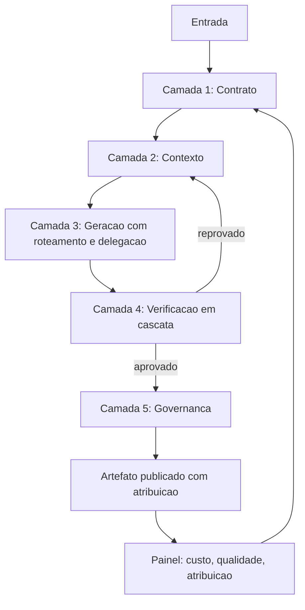

# Capítulo 16: Arquitetura para desenvolvimento com IA: o sistema que constrói sistemas

## 1. Introdução

No Capítulo 15, você isolou o que sobrevive à troca de ferramenta. Chegamos ao último capítulo, e ele tem uma tarefa diferente dos anteriores: montar. Você tem, agora, todos os instrumentos — instruções, ferramentas, contexto, custo, gates, hooks, delegação, frota, configuração e invariantes. O que falta é o desenho que os coloca em relação: uma esteira que transforma uma entrada em um artefato verificável, com custo controlado, segurança declarada e responsabilidade atribuível.

Ao final, você vai ter o desenho completo de uma esteira agêntica em camadas, o modelo de governança que a mantém honesta, o painel de métricas que a mantém saudável e o papel profissional que nasce desse trabalho — o Engenheiro de Bordo.

**Resumo em uma frase:** arquitetura agêntica é a arte de decidir o que é contrato, o que é verificação e o que é julgamento — e de não confundir os três.

## 2. Explica

Um último repasse dos termos da casa, agora sob a lente da montagem: LLM continua sendo o motor que gera texto, mas nesta arquitetura ele nunca decide sozinho o que é contrato, o que é verificação ou o que é julgamento — essa é a fronteira que este capítulo desenha. Token é a unidade que cada camada consome e que, somada ao longo da esteira, vira a fatura real do projeto. Harness é a cabine completa, não mais uma peça isolada: é o conjunto das cinco camadas que você vai ver amarradas abaixo. E context engineering é o que torna essa cabine sustentável — curar, em cada camada, só o que a próxima etapa precisa enxergar.

Toda esteira agêntica que funciona tem cinco camadas, e a ordem entre elas não é arbitrária — é a ordem do fluxo do trabalho.

**Camada 1 — Contrato.** Define o que entra e o que sai, com formato explícito. É o que permite automatizar sem ambiguidade: qual é a entrada, qual é a saída, qual é o critério de pronto. Sem contrato, cada etapa inventa seu próprio formato e a esteira se desmonta na segunda fase.

**Camada 2 — Contexto.** Decide o que a etapa enxerga. Aplica as quatro operações — escrever, selecionar, comprimir, isolar — e a ordem estável/volátil. É a camada que determina custo e qualidade de decisão simultaneamente [1][2].

**Camada 3 — Geração.** Onde o modelo atua. Delegação, roteamento por exigência cognitiva, paralelismo com isolamento. É a camada mais visível e, curiosamente, a que menos determina o resultado: cabine boa com modelo medíocre supera o inverso.

**Camada 4 — Verificação.** Gates em cascata (forma, contrato, mérito), hooks de interceptação e atribuição por tarefa. É a camada que transforma probabilidade em confiabilidade [3].

**Camada 5 — Governança.** Custo, segurança, retenção e responsabilidade. É a camada que ninguém projeta primeiro e que decide se o sistema sobrevive ao primeiro incidente.

O erro arquitetural mais comum é começar pela camada 3. Times empolgados com um modelo novo constroem toda a esteira em torno dele, e depois descobrem que não conseguem nem medir custo nem provar qualidade. A inversão correta é começar pelo contrato: defina entradas, saídas e critérios de pronto; só então escolha o que gera.

A segunda decisão estrutural é **onde colocar cada tipo de conhecimento**, e ela se repete em toda etapa. Conhecimento estável vai para instrução. Conhecimento condicional vai para regra escopada. Restrição vai para permissão ou hook. Procedimento reutilizável vai para skill. Capacidade atômica vai para ferramenta. Dado vai para arquivo de estado. Cada um desses destinos tem um custo e uma garantia diferente — e escolher errado é o que produz harness caro e frágil.

A terceira decisão é o **modelo de responsabilidade**. Um sistema agêntico em produção precisa responder a três perguntas: quem responde quando um artefato errado é publicado; quem autoriza uma ação irreversível; e quem revisa as decisões de configuração. A resposta saudável é sempre a mesma: **a ação irreversível é humana**, a verificação é automática e a configuração tem dono nomeado com data de revisão. Sistemas que não respondem a essas perguntas não falham por capacidade técnica — falham por não ter para quem apontar.

Sobre **governança**, quatro dimensões merecem ser explícitas em qualquer desenho.

*Custo*: orçamento por etapa, alerta por desvio, teto de turnos por tarefa e custo medido por resultado aceito. Sem isso, o sistema escala o gasto junto com o volume, sem escalar o valor.

*Segurança*: privilégio mínimo para o agente, conteúdo externo marcado, ação irreversível atrás de confirmação humana e hooks como mecanismo de bloqueio. Lembre-se do invariante: conteúdo que entra por ferramenta é dado, nunca instrução [4].

*Retenção*: o que é gravado, por quanto tempo e com qual base. Histórico de sessão pode conter dado sensível; registro de auditoria, por definição, contém tudo. Definir retenção é parte do desenho, não um detalhe de operação.

*Atribuição*: cada artefato remete a uma tarefa, um branch e um veredito de verificação. É o que permite reverter, investigar e aprender.

Existe uma propriedade que emerge quando as cinco camadas estão no lugar, e vale nomeá-la porque é o objetivo real do livro: **o sistema passa a ser auditável**. Não "confiável" no sentido de que nunca erra — mas auditável no sentido de que todo erro pode ser rastreado até sua origem: uma instrução ambígua, um teto mal dimensionado, um gate ausente, uma configuração herdada. Auditabilidade é o que transforma incidentes em aprendizado em vez de mistério.

Por fim, o ofício. Este livro descreveu um conjunto de decisões que ninguém tomava há três anos e que hoje decidem se um time entrega ou não. Quem as toma com critério está exercendo um papel específico: o **Engenheiro de Bordo**. Não é quem escreve mais prompts nem quem conhece mais produtos — é quem projeta a cabine, escolhe os instrumentos, define o que se verifica, mede o consumo e garante que o erro caro não passe. É um papel de arquitetura, com uma diferença: o sistema que ele projeta é feito de probabilidade e precisa, apesar disso, ser previsível.

## 3. Ilustra

Na cabine, uma esteira é um **plano de voo completo**. Ele tem pontos de checagem obrigatórios (contrato), combustível previsto (contexto e custo), tripulação com papéis definidos (geração e delegação), alarmes que impedem procedimento inválido (verificação) e regras de quem decide em emergência (governança). Nenhum plano de voo é apenas "decolar e ir para o destino" — e nenhuma esteira séria é apenas uma sequência de chamadas de modelo.



O retorno `E --> C` é o coração operacional: reprovação volta para contexto, não para geração. Corrigir com o mesmo contexto que produziu o erro é o caminho mais caro para o mesmo resultado. E o retorno `H --> B` fecha o ciclo de aprendizado: o painel alimenta a revisão dos contratos.

## 4. Técnica

Esta seção entrega: o esqueleto de uma esteira em cinco camadas, o painel de métricas, o modelo de governança em arquivo e o roteiro de implantação em quatro semanas.

### Passo 1: declare a esteira inteira em um único arquivo

Uma esteira que não pode ser lida não pode ser auditada.

```yaml
esteira:
  nome: "relatorio-tecnico"
  entrada:
    formato: "json"
    schema: "schemas/entrada.json"
  saida:
    formato: "markdown"
    criterio_de_pronto: ["todas as secoes preenchidas", "toda metrica com fonte"]
  camadas:
    contrato:
      arquivo: "contratos/relatorio.yaml"
    contexto:
      operacoes: ["escrever", "selecionar", "isolar", "comprimir"]
      ordem_prompt: ["instrucao", "ferramentas", "base", "historico"]
    geracao:
      roteamento:
        extracao: "pequeno"
        sintese: "medio"
        raciocinio: "grande"
      delegacao:
        varredura: { limite_retorno_tokens: 250, procedencia: obrigatoria }
    verificacao:
      gates: ["forma", "contrato", "merito"]
      bloqueio_mecanico: "pre-commit"
    governanca:
      custo_maximo_por_tarefa_usd: 1.20
      teto_de_turnos: 30
      retencao_historico_dias: 30
      aprovacao_humana: ["publicacao externa"]
```

### Passo 2: monte o painel de métricas

Cinco métricas por esteira, medidas sempre nos mesmos lugares.

```python
METRICAS = {
    "custo_por_resultado_aceito_usd": {"meta": 0.35, "janela": "semanal"},
    "turnos_por_tarefa": {"meta": 18, "janela": "semanal"},
    "taxa_aceitacao_primeiro_degrau": {"meta": 0.70, "janela": "semanal"},
    "sessoes_terminadas_por_limite_de_contexto": {"meta": 0.05, "janela": "semanal"},
    "artefatos_sem_atribuicao": {"meta": 0.0, "janela": "diaria"},
}


def avaliar(painel):
    fora = []
    for nome, ref in METRICAS.items():
        valor = painel.get(nome)
        if valor is None:
            fora.append({"metrica": nome, "estado": "ausente"})
            continue
        if nome.endswith("taxa_aceitacao_primeiro_degrau"):
            ok = valor >= ref["meta"]
        elif nome in ("artefatos_sem_atribuicao", "sessoes_terminadas_por_limite_de_contexto"):
            ok = valor <= ref["meta"]
        else:
            ok = valor <= ref["meta"]
        if not ok:
            fora.append({"metrica": nome, "valor": valor, "meta": ref["meta"]})
    return fora
```

A regra do painel é severa e simples: **métrica ausente é métrica reprovada**. Um sistema sem medição não é um sistema confiável; é um sistema com sorte.

### Passo 3: transforme governança em arquivo verificável

```json
{
  "governanca": {
    "custo": { "orcamento_mensal_usd": 900, "alerta_em": 0.8, "teto_por_tarefa_usd": 1.2 },
    "seguranca": {
      "rede": false,
      "leitura_de_ambiente": false,
      "conteudo_externo": "marcado_e_sem_escrita",
      "acoes_irreversiveis": "somente_humano"
    },
    "retencao": { "historico_dias": 30, "auditoria_dias": 180, "payload_de_lead": "nao_registrar" },
    "responsabilidade": {
      "dono_da_configuracao": "time-plataforma",
      "revisao_de_configuracao": "trimestral",
      "aprovador_de_publicacao": "operador-humano"
    }
  }
}
```

Cada bloco tem consequência prática imediata. `payload_de_lead` como "não registrar" evita o vazamento mais comum em sistemas que registram tudo por conveniência. `acoes_irreversiveis` como "somente humano" elimina a classe de incidente mais cara. E `revisao_de_configuracao` trimestral combate o apodrecimento que vimos no Capítulo 14.

### Passo 4: implante em quatro semanas

| Semana | Entrega | Critério de conclusão |
|---|---|---|
| 1 | Contrato e critério de pronto | entrada e saída declaradas, com schema |
| 2 | Contexto e custo medidos | painel ativo com tokens por turno |
| 3 | Gates em cascata e bloqueio mecânico | reprovação registrada e bloqueando |
| 4 | Governança e atribuição | todo artefato rastreável a tarefa e veredito |

A ordem importa mais que a velocidade. Ir para a semana 3 sem o painel da semana 2 produz gates que ninguém sabe calibrar; ir para a semana 2 sem contrato produz medição de nada.

### Passo 5: o diagrama de referência

Toda a obra pode ser resumida em uma arquitetura única, com cinco camadas concêntricas. Da mais externa para a mais interna:

| Camada | Papel | Instrumentos dos capítulos anteriores |
|---|---|---|
| 5. Governança | Decidir o que pode ser feito | Gates de escopo, segurança e custo |
| 4. Orquestração | Decidir quem faz e quando | Planos de fase, worktrees, subagentes |
| 3. Contexto | Decidir o que o agente vê | Prefixo estável, orçamento de janela, compressão |
| 2. Ferramentas | Decidir o que o agente alcança | MCPs, CLIs, permissões, sandbox |
| 1. Instrução | Decidir como o agente se comporta | `AGENTS.md`, rules, skills, hooks |

A propriedade da arquitetura é a direção de dependência: cada camada pressupõe a de baixo resolvida. Não adianta desenhar um plano de orquestração elaborado sobre uma camada de contexto sem política — o paralelismo apenas multiplica o desperdício. É o mesmo raciocínio do plano de fases: a decisão vem antes da execução.

### Passo 6: os cinco níveis de maturidade

Sistemas agênticos amadurecem em degraus reconhecíveis. O valor do mapa não é classificar projetos, é mostrar qual é o próximo degrau — e qual não vale a pena pular.

| Nível | Marca | Sintoma quando o time tenta pular |
|---|---|---|
| 1. Uso direto | O operador conversa com o agente sem instrução versionada | Resultado irreproduzível |
| 2. Instrução versionada | Arquivos de instrução e rules no repositório | Decisões repetidas em cada sessão |
| 3. Verificação | Gates e hooks bloqueiam o que não passa | Gates que ninguém calibra |
| 4. Delegação | Subagentes com contrato de retorno | Paralelismo sem contrato, retrabalho na volta |
| 5. Governança | Orçamento, retenção, auditoria e fallback | Governança sem dados; política no lugar de medição |

O degrau 3 é o mais pulado, e é o único pulo que costuma sair caro. Sem verificação determinística, a delegação do nível 4 introduz erro em paralelo — cinco workers produzindo desvios que ninguém detecta até a integração final.

### Passo 7: o plano de noventa dias

A evolução de um harness é incremental e tem ordem. Um roteiro realista, para quem parte do nível 1:

- **Dias 1 a 15 — Instrução.** Um arquivo de instruções versionado, com as regras do domínio separadas das de forma. Uma skill para o procedimento mais repetido da equipe.
- **Dias 16 a 40 — Verificação.** Três gates: forma, contrato e execução. Um hook de pre-commit que bloqueia suíte vermelha. Calibração inicial contra erro injetado.
- **Dias 41 a 65 — Contexto.** Prefixo estável com versão, orçamento de janela por fase e política de descarte com rastro. Medição de tokens por sessão.
- **Dias 66 a 90 — Delegação e governança.** Primeiro subagente com contrato de retorno fixo, um revisor adversarial, e a matriz de exposição preenchida. Teto de orçamento com persistência de estado.

Cada fase entrega valor sozinha. A ordem importa porque cada degrau usa a evidência produzida pelo anterior: sem medição de tokens, o orçamento é chute; sem gates, a delegação é aposta.

### Passo 8: as métricas de valor do sistema

Se a arquitetura funciona, isso aparece em números. Quatro indicadores que separam um sistema que gera valor de um sistema que gera atividade:

| Indicador | O que prova |
|---|---|
| Tempo até a primeira entrega correta | O contexto está bem montado |
| Proporção de mudanças que passam nos gates na primeira tentativa | A instrução está clara |
| Custo por entrega aceita | A economia é real, não cosmética |
| Proporção de defeitos capturados antes da publicação | A verificação está no lugar certo |

O quarto indicador é o resumo de toda a obra. Um sistema que captura defeitos cedo não é um sistema que erra menos: é um sistema em que o erro é barato — e é exatamente isso que torna possível iterar rápido sem perder controle. A cabine não impede o piloto de errar; ela garante que o erro apareça no instrumento antes de virar acidente.

## 5. Aplica

**A cena.** Uma empresa de mídia opera uma esteira que produz 200 peças editoriais por mês com agentes. Os números parecem bons: custo por peça caiu 60% no primeiro trimestre. No segundo, chega a crise: uma peça publicada contém um dado incorreto que a assessoria jurídica classifica como risco. A investigação não encontra a causa — ninguém consegue dizer qual versão da instrução estava ativa, qual verificação rodou, nem qual agente produziu o trecho.

O diagnóstico não é técnico, é arquitetural. A esteira tinha camada 3 excelente — modelos roteados, subagentes, paralelismo — e nada das outras quatro. Sem contrato, cada peça tinha formato próprio. Sem medição por resultado aceito, a economia aparente escondia retrabalho. Sem verificação, o erro chegou à publicação. E sem atribuição, a investigação era impossível.

A reconstrução seguiu o roteiro deste capítulo, em quatro semanas. Contrato de entrada e saída com schema. Painel com cinco métricas. Gates em cascata, com bloqueio de publicação por gate vermelho e aprovação humana obrigatória para conteúdo sensível. Governança em arquivo, com retenção definida e responsabilidade nomeada. O custo por peça subiu 18% em relação ao trimestre "econômico" — e o custo por peça **publicada sem correção** caiu 94%. A economia anterior era, na verdade, retrabalho não contabilizado.

**Métricas do desenho.** Além das cinco do painel, acompanhe: tempo para responder "quem produziu este artefato e com qual veredito"; número de ações irreversíveis executadas sem aprovação humana (meta: zero); incidentes com causa raiz em configuração; e tempo de onboarding de um engenheiro no harness.

**Armadilhas comuns.** (a) *Começar pela geração*: a esteira fica dependente de um modelo e órfã de garantias. (b) *Painel sem dono*: métrica que ninguém olha é decoração. (c) *Governança no documento e não no arquivo*: política não verificável não é política. (d) *Atribuição opcional*: sem ela, todo incidente vira especulação. (e) *Auditabilidade confundida com ausência de erro*: o objetivo não é nunca errar; é poder explicar, reverter e aprender.

**Segunda cena.** Uma equipe de doze pessoas adota agentes em três frentes ao mesmo tempo — escrita de código, revisão e documentação — sem camada de verificação comum. Em dois meses, a velocidade de produção dobra e o número de defeitos que chegam à publicação também. O sistema estava, na linguagem deste capítulo, no nível 4 de delegação sobre um nível 3 inexistente. A correção não foi reduzir o uso: foi instalar três gates e um hook de pre-commit, que devolveram a proporção de defeitos capturados antes da publicação ao patamar anterior — agora com produtividade alta.

**Nota de campo.** A pergunta que mais ajuda na prática não é "qual modelo usar", é "o que eu delego e o que eu controlo". Todo o resto — configuração, ferramenta, gate, orçamento — decorre dessa fronteira. Equipes que respondem essa pergunta por projeto, e não por preferência individual, constroem harnesses que duram mais do que a próxima versão de modelo. Equipes que não respondem descobrem a resposta durante o incidente.

**Erros de julgamento.** (a) Comprar capacidade (modelo maior) quando o problema é verificação. (b) Pular o nível 3 para chegar logo ao paralelismo. (c) Governar por política escrita sem dados de medição. (d) Tratar o harness como projeto com fim, quando ele é sistema em operação contínua.

**Antipadrão observável.** Quando o número de defeitos encontrados depois da publicação cresce junto com o volume produzido, a arquitetura está escalando a produção sem escalar a verificação. É o sintoma exato de uma cabine menor que a aeronave.

### Síntese operacional

| Camada | Pergunta de controle | Evidência de que funciona |
|---|---|---|
| Instrução | O agente sabe se comportar? | Menos perguntas de convenção |
| Ferramentas | O agente alcança o necessário? | Menos soluções improvisadas |
| Contexto | O agente vê o suficiente? | Primeira edição correta |
| Orquestração | Quem faz o quê? | Tempo de parede menor com contrato |
| Governança | O que pode ser feito? | Defeito capturado antes da publicação |

Três regras que ficam com quem opera:

- **Não pule o nível 3.** Delegação sem verificação multiplica desvio.
- **Progresso tem número.** Quatro indicadores bastam para saber se o sistema melhora.
- **O harness é sistema em operação.** Revisão periódica, como qualquer peça de infraestrutura.

### Nota do revisor

Os três desvios mais comuns neste capítulo, em ordem de frequência:

1. **Escalar produção sem escalar verificação.** O volume cresce, os gates continuam os mesmos, e os defeitos passam a chegar à publicação. Velocidade sem instrumento não é maturidade.
2. **Pular o nível de verificação para chegar ao paralelismo.** Delegação sem gate multiplica o desvio pelo número de workers simultâneos.
3. **Tratar o harness como projeto com data de término.** Ele é sistema em operação contínua: revisão periódica dos gates, das regras e do orçamento, como qualquer peça de infraestrutura crítica.

## 6. Conclusão

Você fechou a obra com três entregas. Primeiro: a arquitetura em cinco camadas — contrato, contexto, geração, verificação e governança — e a regra de construí-las nessa ordem, começando pelo contrato. Segundo: o painel de cinco métricas e a lei de que métrica ausente é métrica reprovada. Terceiro: a ideia que costura o livro inteiro — auditabilidade é o produto final da engenharia agêntica, e ela se conquista movendo garantias para fora do modelo.

**Seu turno final.** Desenhe a sua esteira nas cinco camadas, declare-a em um único arquivo, suba o painel com pelo menos três métricas e defina em qual das quatro semanas do roteiro você está hoje. Depois responda à pergunta que resume a obra: o que, no seu sistema, você controla por código — e o que você está, consciente ou inconscientemente, entregando à sorte de um modelo probabilístico?

- [ ] Esteira declarada em um único arquivo legível
- [ ] Contrato com schema de entrada e critério de pronto
- [ ] Painel com ao menos três métricas ativas
- [ ] Gates em cascata com bloqueio mecânico
- [ ] Governança em arquivo com dono e data de revisão
- [ ] Atribuição de artefato a tarefa e veredito funcionando

Este é o fim do livro. Você começou desmontando um agente e termina projetando cabines. O que resta não é técnica nova: é prática. Cada sistema que você instrumentar a partir daqui vai ensinar algo que nenhum capítulo consegue — porque a engenharia agêntica, como toda engenharia, se aprende construindo, medindo e corrigindo.

## 7. Referências

[1] ANTHROPIC. *Effective context engineering for AI agents*. Disponível em: https://www.anthropic.com/engineering/effective-context-engineering-for-ai-agents. Acesso em: 12 set. 2026.
[2] LANGCHAIN. *Context Engineering*. Disponível em: https://www.langchain.com/blog/context-engineering-for-agents. Acesso em: 12 set. 2026.
[3] ANTHROPIC. *Hooks reference — Claude Code Docs*. Disponível em: https://code.claude.com/docs/en/hooks. Acesso em: 12 set. 2026.
[4] GRESHAKE, Kai et al. *Not What You've Signed Up For: Compromising Real-World LLM-Integrated Applications with Indirect Prompt Injection*. Disponível em: https://doi.org/10.1145/3605764.3623985. Acesso em: 12 set. 2026.
[5] MODEL CONTEXT PROTOCOL. *Specification (2025-06-18)*. Disponível em: https://modelcontextprotocol.io/specification/2025-06-18. Acesso em: 12 set. 2026.
[6] ANTHROPIC. *Subagents in the SDK — Claude Code Docs*. Disponível em: https://code.claude.com/docs/en/agent-sdk/subagents. Acesso em: 12 set. 2026.
[7] ANTHROPIC. *All settings — Claude Code Docs*. Disponível em: https://code.claude.com/docs/en/settings-reference. Acesso em: 12 set. 2026.
[8] ANTHROPIC. *Context engineering: memory, compaction, and tool clearing*. Disponível em: https://platform.claude.com/cookbook/tool-use-context-engineering-context-engineering-tools. Acesso em: 12 set. 2026.
[9] AGENTS.MD. *agentsmd/agents.md — Repositório oficial do padrão*. Disponível em: https://github.com/agentsmd/agents.md. Acesso em: 12 set. 2026.
[10] GIT. *git-worktree — Referência oficial*. Disponível em: https://git-scm.com/docs/git-worktree. Acesso em: 12 set. 2026.
[11] ORCA. *What is Orca? — Orca Docs*. Disponível em: https://www.onorca.dev/docs. Acesso em: 12 set. 2026.
[12] ONG, Isaac et al. *RouteLLM: Learning to Route LLMs with Preference Data*. Disponível em: https://arxiv.org/abs/2406.18665. Acesso em: 12 set. 2026.
[13] MOHAMMADI, Mahmoud et al. *Evaluation and Benchmarking of LLM Agents: A Survey*. Disponível em: https://doi.org/10.1145/3711896.3736570. Acesso em: 12 set. 2026.
[14] WANG, Lei et al. *A survey on large language model based autonomous agents*. Disponível em: https://doi.org/10.1007/s11704-024-40231-1. Acesso em: 12 set. 2026.
[15] XI, Zhiheng et al. *The Rise and Potential of Large Language Model Based Agents: A Survey*. Disponível em: http://arxiv.org/abs/2309.07864. Acesso em: 12 set. 2026.
[16] XU, Weikai et al. *LLM-Based Agents for Tool Learning: A Survey*. Disponível em: https://doi.org/10.1007/s41019-025-00296-9. Acesso em: 12 set. 2026.
[17] SAPKOTA, Ranjan; ROUMELIOTIS, Konstantinos I.; KARKEE, Manoj. *AI Agents vs. Agentic AI: A Conceptual Taxonomy, Applications and Challenges*. Disponível em: https://doi.org/10.1016/j.inffus.2025.103599. Acesso em: 12 set. 2026.
[18] GOOGLE CLOUD. *Prompt caching — Claude partner models*. Disponível em: https://docs.cloud.google.com/gemini-enterprise-agent-platform/models/partner-models/claude/prompt-caching. Acesso em: 12 set. 2026.
[19] SOURCEGRAPH. *Context Engineering: A Practical Guide for AI Agents*. Disponível em: https://sourcegraph.com/blog/context-engineering. Acesso em: 12 set. 2026.
[20] CURSOR. *Rules — Cursor Docs*. Disponível em: https://cursor.com/docs/rules. Acesso em: 12 set. 2026.
