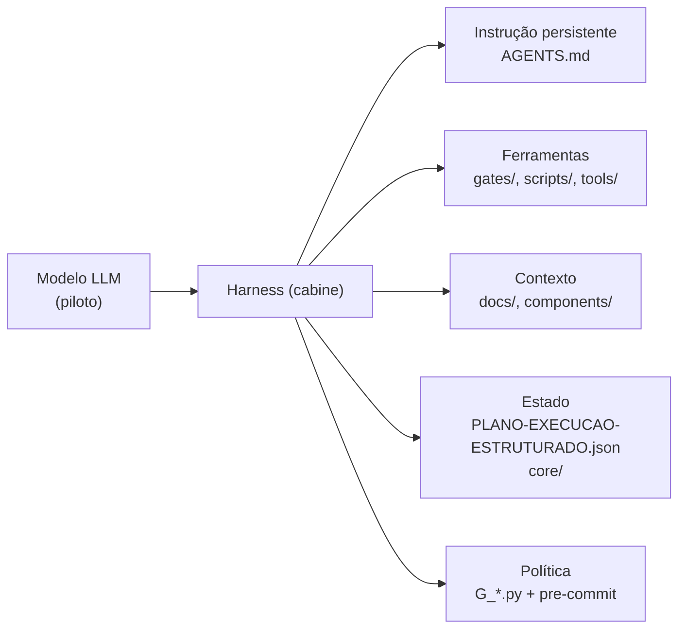

# Dia 1 — O agente não é o modelo

## Meta do dia

Identificar as **5 peças da cabine** (o harness) que existem em volta de um modelo de IA dentro de um projeto real — e localizar cada uma delas no repositório `ecossistema-aidd`.

## A ideia em uma frase

O modelo de IA é só o motor; a qualidade do seu resultado depende da **cabine** que você constrói em volta dele — e a cabine é feita de arquivos e configurações que você *controla*.

## A explicação simples

Quando alguém diz "uso a IA para programar", a frase esconde o essencial. O modelo de linguagem (LLM) é, literalmente, uma função: recebe texto e devolve texto. Ele não lembra de nada entre uma chamada e outra, não sabe qual pasta é o seu projeto e não conhece as suas regras. a impressão de que ele "entende e continua de onde parou" é reconstruída a cada vez, reenviando o histórico anterior na entrada.

Então o que você realmente usa no dia a dia — a coisa que lê seus arquivos, roda seus testes e respeita suas regras — não é o modelo. É uma camada de software construída em volta dele. Essa camada tem um nome: **harness** [1].

Pense em um avião: o piloto é o modelo — potente, esperto, capaz de improvisar. A cabine é o harness — painel, checklists, alarmes, piloto automático. Ninguém entrega um avião a um piloto sem cabine; ninguém deveria entregar um projeto a um modelo sem harness. Voar bem não é "pilotar melhor" — é ter uma cabine melhor [2].

## As 5 peças da cabine

cada harness que funciona bem tem estas 5 peças:

**1. Instrução persistente.** É o texto que define papel, limites e regras do agente. Ele é reinjetado a cada turno — por isso se chama persistente. Mora em arquivos de projeto como `AGENTS.md`, em arquivos de regras como `CLAUDE.md`, ou no prompt de sistema.

**2. Ferramentas.** São funções que o modelo pode chamar: ler um arquivo, editar, rodar um comando, buscar na web, consultar um banco. Sem ferramentas, o agente só conversa; com ferramentas, ele age no mundo.

**3. Contexto.** É o recorte do mundo colocado na janela a cada turno: trechos de código, saídas de comando, resultados de busca. É o recurso mais escasso do sistema — e o mais mal gerenciado.

**4. Estado.** É o que ele lembra fora da conversa: arquivos de tarefa, bancos de dados, memória externa. O modelo não tem estado; o harness fabrica um.

**5. Política.** São as regras garantidas por código: permissões de ferramenta, hooks, gates de validação, limites de custo e tempo. A diferença entre instrução e política é a mais importante deste dia: instrução é um pedido — o modelo pode esquecer; política é uma lei — o código não deixa [3].

## O exemplo real: a cabine do `ecossistema-aidd`

O `ecossistema-aidd` é um **meta-repositório de engenharia agêntica**: um monorepo que distribui a mesma governança para qualquer assistente de IA — Claude Code, Antigravity, OpenCode, MimoCode, Cursor — e entrega software testado a partir de uma ideia. E adivinhe: ele é ele próprio um grande harness. Dá para encontrar as 5 peças nele em poucos minutos de exploração.



| Peça | Onde está no projeto real |
|---|---|
| instrução persistente | `AGENTS.md` na raiz (com as 8 Leis Invioláveis) |
| ferramentas | os 16 gates em `gates/` (ex.: `G_ECOSSISTEMA_INTEGRIDADE.py`) e as 6 ferramentas em `tools/` |
| contexto | `docs/`, `componentes/compartilhado/skills/` e o mapa do README |
| estado | `PLANO-EXECUCAO-ESTRUTURADO.json` e o ledger em `core/cognitive_ledger.py` |
| política | `python ecossistema.py audit` → `pre-commit run --all-files` |

Abra cada um desses arquivos agora, mesmo que não entenda tudo. O ato de localizar a peça já ensina: o ecossistema inteiro depende menos do modelo e mais desses arquivos.

O vetor condutor do projeto é declarado no `ecossistema.py`: um ponto único de entrada que roteia para 5 ferramentas integradas (forge, generate, master, enterprise, ops) e para o audit de integridade. Essa é uma peça de ferramenta emblemática: o LLM não precisa saber o comando de cada ferramenta — ele chama um CLI determinístico, que resolve o resto [4].

## Mão na massa

Abra o terminal na pasta `ecossistema-aidd` e faça:

1. Liste os arquivos de instrução:

   ```bash
   ls AGENTS.md CLAUDE.md GEMINI.md CODEBUDDY.md QODER.md
   ```

2. Abra o começo do `AGENTS.md` e encontre as seções "Inviolable Laws" — são instruções persistentes compartilhadas por todos os harnesses.

3. Liste os gates (as ferramentas determinísticas):

   ```bash
   ls gates/ | grep "^G_"
   ```

4. Rode o status da cabine:

   ```bash
   python ecossistema.py status
   ```

5. Procure o estado em `PLANO-EXECUCAO-ESTRUTURADO.json` e leia o campo com a telemetria de testes.

## Três regras que ficam

1. Modelo, harness e agente são três coisas diferentes: o modelo decide, o harness instrumenta, o agente é a soma dos dois.
2. As 5 peças da cabine podem ser localizadas em qualquer projeto real — o ecossistema-aidd as expõe todas as.
3. Política (lei, garantida por código) vence instrução (pedido, esquecível).

## Erros de julgamento deste dia

- Confundir o LLM com o harness e sair "tunando o modelo" quando o problema está nos arquivos da cabine.
- Achar que um projeto de IA é "só código" e ignorar os arquivos de governança que o orquestram.
- Trocar o modelo e esperar que os problemas desapareçam sozinhos: se quebrar, o problema provavelmente está na cabine.

## Checklist do dia

- [ ] Sei a diferença entre modelo, harness e agente.
- [ ] Consigo dizer as 5 peças da cabine de memória.
- [ ] Sei qual é a diferença entre instrução (pedido) e política (lei).
- [ ] Localizei as 5 peças dentro de `ecossistema-aidd`.
- [ ] Expliquei, com as minhas palavras, o que o `python ecossistema.py status` faz.

## Para saber mais

1. `AGENTS.md` do `ecossistema-aidd` — a Lei Fundamental e as 8 Leis Invioláveis (github.com/heverton-dev/ecossistema-aidd).
2. README do projeto — o portal unificado com as 6 Ferramentas e os 12 Portões de Segurança.
3. "Effective context engineering for AI agents" — Anthropic Engineering Blog (anthropic.com/engineering).
4. `ecossistema.py` — a CLI unificada que orquestra as ferramentas.

No Dia 2, vamos responder a pergunta que este dia deixou aberta: o que deve ser decidido pelo modelo (probabilístico) e o que deve ser garantido por código (determinístico) — e como o ecossistema-aidd usa gates com exit 0/1 para impor a segunda.