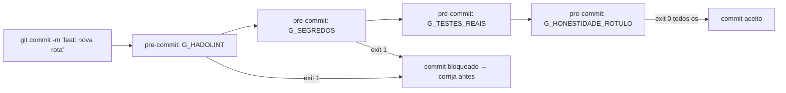

# Dia 10 — Hooks: a camada que intercepta o agente

## Meta do dia

Entender os **hooks** como camadas de interceptação que impõem regras ao agente *sem que ele peça* — e ver como o `ecossistema-aidd` integra os gates ao ciclo de vida do git via pre-commit framework, mantendo o desenvolvedor no controle.

## A ideia em uma frase

Hook é o alarme que toca sozinho: a regra não depende do agente pedir — ela roda automaticamente antes, durante ou depois de uma ação, e bloqueia se não for cumprida.

## A explicação simples

Hooks são interceptadores: código que roda automaticamente em resposta a um evento, sem que o agente (ou o humano) peça. No contexto de engenharia agêntica, existem dois tipos principais:

- **Hooks de ferramenta**: um gate que é acionado *antes* do agente usar uma tool, ou *depois* de usar. É o determinismo imposto pela infraestrutura, não pelo LLM.
- **Hooks de ciclo de vida**: como o pre-commit — rodam antes do commit, antes do push, ou em resposta a outros eventos do git.

A força dos hooks é que não dependem de memória do agente. O LLM pode esquecer que existe uma regra; o hook não — ele roda.

## O framework pre-commit no `ecossistema-aidd`

No `ecossistema-aidd`, a integração com hooks se dá pelo framework pre-commit. Os gates `G_*.py` são declarados em `.pre-commit-config.yaml` e rodam automaticamente a cada `git commit` [1]. O `python ecossistema.py audit` é um alias que roda `pre-commit run --all-files` — verifica todos os arquivos do repositório, não só os modificados.

O efeito é que a política (Dia 2) se torna **infraestrutura** — ela não pode ser contornada, porque o git a impõe antes do commit.

Mas existe um detalhe que separa o ecossistema-aidd de outros projetos: a Lei 8 (Honestidade do Rótulo) não é *verificada automaticamente* pelo audit — ela requer um estágio manual adicional [2]. Isso é intencional: a política que exige julgamento humano (o que conta como "honestidade") não pode ser 100% automatizada sem risco de falso positivo.

## O exemplo real: `.pre-commit-config.yaml`

Abra o `.pre-commit-config.yaml` do `ecossistema-aidd`. Cada gate `G_*.py` aparece como um hook que roda `python caminho do gate` em todos os arquivos. O formato é o padrão do pre-commit framework [3]:

```yaml
repos:
  - repo: local
    hooks:
      - id: g-honestidade-rotulo
        name: G_HONESTIDADE_ROTULO
        entry: python gates/G_HONESTIDADE_ROTULO.py
        language: system
        pass_filenames: false
```

A configuração `pass_filenames: false` é essencial — o gate recebe o repositório inteiro, não arquivos individuais. Cada um tem seu comportamento.



## Mão na massa

Abra o terminal na pasta `ecossistema-aidd`:

1. Liste os hooks declarados no pre-commit:

   ```bash
   grep -n "id:" .pre-commit-config.yaml
   ```

2. Veja se o framework está instalado no ambiente:

   ```bash
   pre-commit --version
   ```

3. Rode todos os hooks manualmente (o equivalente ao audit):

   ```bash
   pre-commit run --all-files
   ```

4. Simule um commit e veja se os hooks disparam — altere um arquivo e faça:

   ```bash
   touch teste_hook.txt && git add teste_hook.txt && git commit -m "teste hook" 2>&1 | tail -n 20
   ```

5. Limpe:

   ```bash
   git reset HEAD~1 && rm -f teste_hook.txt
   ```

6. Observe que `G_HONESTIDADE_ROTULO` é um dos hooks — e entenda por que ele tem um estágio manual no fluxo normal (lei 8).

## Três regras que ficam

1. Hooks impõem regras sem depender da memória ou pedido do agente — são infraestrutura.
2. O pre-commit framework integra os gates ao ciclo git — a política é coagida pelo fluxo de trabalho.
3. Nem cada regra deve ser 100% automatizada — a honestidade de rótulo exige julgamento humano, e o ecossistema respeita isso.

## Erros de julgamento deste dia

- Rodar `python ecossistema.py audit` no terminal e esquecer que os hooks já rodam automaticamente antes do commit — a redundant não machuca, mas a omissão sim.
- Desligar um hook que falha "porque é chato" — se é chato, registre a exceção em allowlist.
- Deixar `.pre-commit-config.yaml` sem sincronia com `ecossistema.py` — os dois devem listar os mesmos gates.

## Checklist do dia

- [ ] Sei o que são hooks e por que são mais fortes do que instruções no AGENTS.md.
- [ ] Localizei os hooks no `.pre-commit-config.yaml`.
- [ ] Rodei `pre-commit run --all-files` e entendi o resultado.
- [ ] Entendi por que `G_HONESTIDADE_ROTULO` tem um estágio manual.
- [ ] Compreendo a relação entre hooks e o `python ecossistema.py audit`.

## Para saber mais

1. `.pre-commit-config.yaml` do ecossistema-aidd — a configuração local dos gates.
2. `ecossistema.py`, função `cmd_audit` — a delegação para o pre-commit.
3. Documentação oficial do framework pre-commit (pre-commit.com).
4. `AGENTS.md` do ecossistema-aidd, Lei 8 — "Label Honesty" e seu papel.

No Dia 11, vamos olhar para a delegação: como o agente delega trabalho a subagentes e quais são os princípios de isolamento que tornam isso seguro.