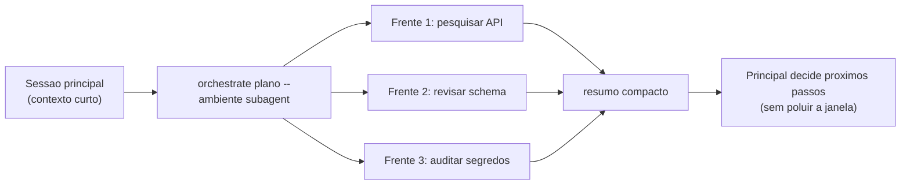

# Dia 11 — Agents e subagentes: delegação com contexto isolado

## Meta do dia

Entender como o agente **delega trabalho a uma frente isolada** (subagente ou worktree) e porque o isolamento de contexto — e não apenas de arquivos — é o que torna o paralelismo seguro, usando o ambiente `subagent` do `ecossistema-aidd`.

## A ideia em uma frase

Delegar não é "ter um assistente" — é **transferir trabalho para um contexto novo e limitado**, que pode morrer no fim, carregando seu lixo consigo e devolvendo só o resumo.

## A explicação simples

Até aqui vimos um agente trabalhando sozinho no seu contexto. Mas um projeto real de engenharia agêntica não roda um único cérebro: ele **reparte tarefas**. E a repartição só escala se cada fatia tiver seu próprio contexto, separado do principal.

O harness oferece uma ferramenta típica: o **subagente** (Agent tool, "Task", "subagent"). Você descreve a tarefa, o subagente sai com um contexto próprio, trabalha com suas próprias chamadas de ferramenta e **devolve apenas um resumo** ao agente principal. O detalhe crucial é este último: o contexto do subagente não entra na janela do agente principal. O que entra é o resultado — seco, comprimido [1].

Isso muda a economia da sessão inteira: as milhares de linhas que o subagente leu para resolver uma subtarefa não poluem a janela principal. O principal mantém um "resumo do estado" (como o `CognitiveSessionLedger` do Dia 8), enquanto o subagente faz o trabalho pesado de leitura.

## O ambiente `subagent` no `ecossistema-aidd`

O comando `python ecossistema.py orchestrate "plano-exemplo.md" --ambiente subagent` compila um **plano de subagentes**: lê um plano em Markdown, decompõe em frentes de trabalho e gera uma sequência de invocações da ferramenta de agente da sessão atual [2].

A característica definidora desse ambiente está documentada no próprio CLI:

- sem worktree, sem terminal separado;
- roda dentro do contexto da sessão atual;
- **compartilha o contexto** — as frentes não têm isolamento de arquivo real;
- útil para tarefas de leitura/análise que custam caro em tokens e podem ser terceirizadas [2].

Ou seja: `subagent` é o modo "leitura terceirizada". Ele economiza contexto do principal, mas o trabalho de edição exige a sessão principal — porque edita no mesmo filesystem, sem barreira.

Já os ambientes `orca` e `gitworktree` (que veremos no Dia 12) existem exatamente para o caso em que as frentes **precisam** mexer em arquivos sem pisar umas nas outras — aí o isolamento não é só de contexto, é de diretório de trabalho real.

## O exemplo real: um plano de subagentes

Rode um plano de 3 frentes no modo `subagent` e observe como ele se comporta:

```bash
python ecossistema.py orchestrate plano-exemplo.md --ambiente subagent --dry-run
```

O comando renderiza um **plano de voo** — a programação das frentes com contexto, critérios de aceite e dependências — e salva o estado em `.orca-flight-plan.json` [3]. Na prática do ecossistema, essa compilação é feita pelo módulo `scripts/subagent_plan.py`, que transforma o plano em Markdown em uma lista de chamadas ao agente.



Repare no papel do orquestrador: ele não roda o subagente como "caixa-preta"; ele **prescreve** o contexto de cada frente (o que assumir, o que verificar, o que devolver), preservando o padrão determinístico (Dia 8).

## Mão na massa

Abra o terminal na pasta `ecossistema-aidd`:

1. Veja as opções do ambiente subagent:

   ```bash
   python ecossistema.py orchestrate --help 2>&1 | grep -A 12 "ambiente"
   ```

2. Veja o compilador de plano de subagentes:

   ```bash
   grep -n "def compilar_plano_subagentes" scripts/subagent_plan.py
   ```

3. Olhe o renderizador — como o resumo é montado:

   ```bash
   grep -n "def renderizar_plano_subagentes" scripts/subagent_plan.py
   ```

4. Veja como o isolamento de contexto se manifesta no CLI:

   ```bash
   grep -n "compartilhado\|sem worktree\|contexto" ecossistema.py | head -10
   ```

5. Rode a compilação em modo seco para visualizar as frentes:

   ```bash
   python ecossistema.py orchestrate plano-exemplo.md --ambiente subagent --dry-run 2>&1 | tail -30
   ```

## Três regras que ficam

1. Subagente devolve resumo, não contexto — a janela principal fica limpa.
2. `--ambiente subagent` serve para leitura/análise terceirizada; sem isolamento de arquivo real.
3. O orquestrador prescreve contexto e critérios de aceite de cada frente, mantendo o padrão determinístico.

## Erros de julgamento deste dia

- Usar subagente para editar o mesmo arquivo que outra frente — sem worktree, não há barreira de filesystem.
- Esperar que o subagente "lembre do raciocínio" depois do retorno — o que persiste é o resumo.
- Delegar a mesma busca para todas as frentes e inflar o custo em vez de comprimir resultados comuns.

## Checklist do dia

- [ ] Sei explicar por que o resumo (e não o contexto) é a interface entre principal e subagente.
- [ ] Entendo a diferença de isolamento entre `subagent`, `orca` e `gitworktree`.
- [ ] Localizei `compilar_plano_subagentes` em `scripts/subagent_plan.py`.
- [ ] Rodei a compilação em modo seco e li o plano de voo.
- [ ] Sei quando usar subagente (leitura/análise) e quando usar worktree (edição paralela).

## Para saber mais

1. `ecossistema.py`, comando `orchestrate` — a docstring do ambiente `subagent`, 3 (linha ~370).
2. `scripts/subagent_plan.py` — `compilar_plano_subagentes` e `renderizar_plano_subagentes`.
3. `scripts/flight_plan.py` — `gerar_plano_de_voo` e `renderizar_plano_de_voo` (o estado do plano de voo).
4. Skill `orca-plan-orchestrator` em `componentes/compartilhado/skills/` — o protocolo completo de frentes.

No Dia 12, entramos na suíte de orquestração completa: worktrees reais, paralelismo e o motor `gitworktree` — o ambiente que isola até o diretório.