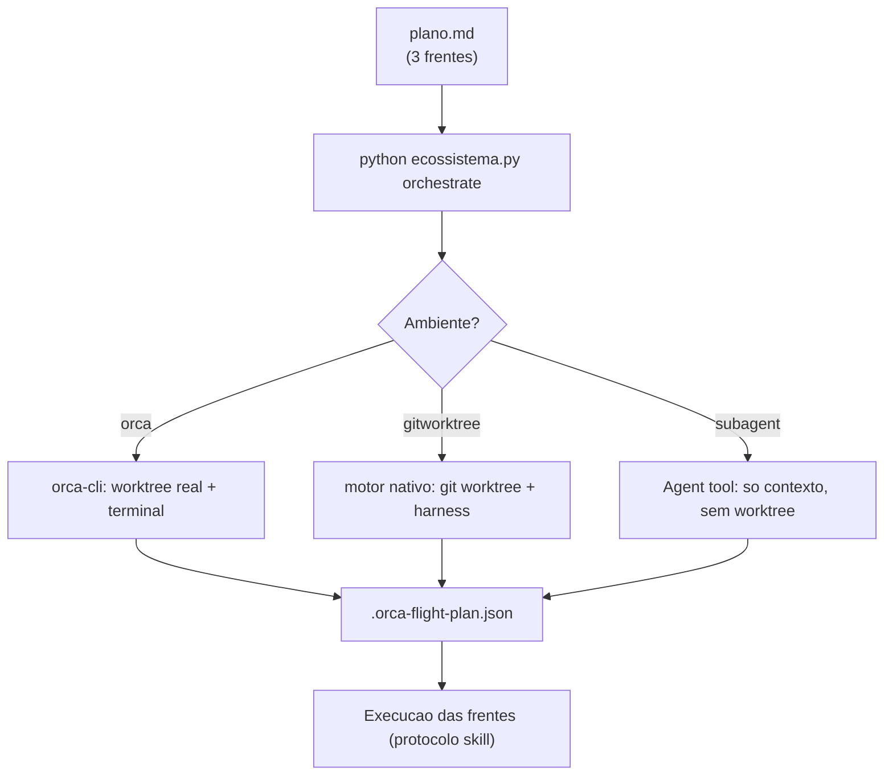

# Dia 12 — Orquestração: worktrees, paralelismo e o ambiente de agentes

## Meta do dia

Mapear o **comando `orchestrate`** do `ecossistema-aidd` e seus três ambientes de execução — `orca`, `subagent` e `gitworktree` — entendendo quando cada um isola contexto, arquivo e terminal, e como o **plano de voo** orquestra frentes paralelas.

## A ideia em uma frase

Orquestrar não é "chamar N agentes" — é **decidir, por tarefa, o grau de isolamento**: contexto (subagent), diretório (gitworktree) ou ambiente completo (orca) — e registrar esse desenho num plano executável.

## A explicação simples

Paralelismo agêntico tem um problema fundamental: agentes compartilhando o mesmo diretório pisam nos pés uns dos outros e o resultado de um vaza no contexto do outro. A solução não é "rodar muitos agentes"; é **dar a cada frente o isolamento que ela precisa**.

O `git worktree` resolve o isolamento de arquivos com elegância: cria um diretório de trabalho **separado** apontando para o mesmo repositório git. Cada frente opera no seu diretório, com seu próprio branch; ao final, os resultados são integrados de volta ao repositório principal [1].

O ecossistema-aidd eleva isso a um comando: `python ecossistema.py orchestrate plano-exemplo.md`. Ele lê um plano em Markdown, decompõe em **frentes de trabalho** e escolhe o ambiente de execução para cada uma:

- `orca` — usa o aplicativo ORCA real (via `orca-cli`), com worktree e terminal de verdade;
- `subagent` — sem worktree, contexto compartilhado (Dia 11);
- `gitworktree` — motor nativo: `git worktree` + harness spawnado, sem precisar do app ORCA instalado [2].

## O papel do plano de voo

Quando você roda `orchestrate`, o ecossistema não executa as frentes na hora (em modo default): ele **compila e renderiza um plano de voo** — um documento que lista cada frente, o harness recomendado, o ambiente, os critérios de aceite e as dependências — e o salva em `.orca-flight-plan.json` [3].

O plano de voo é a interface entre o humano e a máquina: você revisa, ajusta, e então o assistente da sessão executa cada frente seguindo o protocolo (Worktree create → Terminal → send). É orquestração declarativa: o desenho primeiro, a execução depois [3].



Repare na decisão implícita: nem cada trabalho precisa de worktree. Uma frente de pesquisa que só lê arquivos pode rodar em `subagent` (barata, sem infraestrutura). Já uma frente que reescreve um módulo inteiro precisa de `gitworktree` (isolamento de arquivo + branch próprio). O orquestrador cruza isso com o `harness_profiles.json` — qual harness usar em cada ambiente [2].

## O exemplo real: orquestrando `gitworktree` sem ORCA instalado

O ambiente `gitworktree` é o destaque para quem quer paralelismo sem instalar o aplicativo ORCA. A docstring do CLI é explícita: "motor nativo deste projeto — git worktree + harness spawnado direto, sem precisar do app ORCA".

O `harness_map` permite mapear cada frente para um harness específico: `frente1=claude,frente2=agy` (para Antigravity), etc. — usando `--harness-map` ou um arquivo JSON. E o `--dry-run` exibe o plano sem executar nada, ideal para revisão antes do commit.

## Mão na massa

Abra o terminal na pasta `ecossistema-aidd`:

1. Veja o help completo do orchestrate:

   ```bash
   python ecossistema.py orchestrate --help
   ```

2. Rode em modo seco (não executa, só desenha) com 2 ambientes distintos:

   ```bash
   python ecossistema.py orchestrate plano-exemplo.md --ambiente gitworktree --dry-run
   python ecossistema.py orchestrate plano-exemplo.md --ambiente orca --dry-run
   ```

3. Veja o compilador do plano orca e o mapeamento de trabalho:

   ```bash
   grep -n "def compilar_plano_orca\|PARENT_WORKTREE" scripts/orca_real_plan.py | head
   ```

4. Veja como o fluxo registra o plano de voo:

   ```bash
   python ecossistema.py orchestrate plano-exemplo.md --ambiente gitworktree --dry-run 2>&1 | grep -i "flight"
   ```

5. Se tiver ORCA instalado, explore a skill que documenta o protocolo completo:

   ```bash
   ls componentes/compartilhado/skills/orchestrate/
   ```

## Três regras que ficam

1. Escolha o ambiente pelo isolamento que a tarefa exige: subagent (leitura), gitworktree (edição), orca (experiência completa).
2. O plano de voo é o contrato: frentes, harnesses, critérios de aceite e dependências — antes da execução.
3. Git worktree isola arquivo e branch sem duplicar o repositório — é a base do paralelismo seguro.

## Erros de julgamento deste dia

- Rodar tudo em `orca` porque é "o mais completo" — subagente resolve leitura com custo menor.
- Executar frentes imediatamente sem revisar o plano de voo — a revisão é o controle de qualidade.
- Deixar as frentes trabalharem no mesmo diretório sem worktree e ignorar o conflito de arquivos.

## Checklist do dia

- [ ] Consigo explicar os 3 ambientes do `orchestrate` e quando usar cada um.
- [ ] Rodei o `--dry-run` para `gitworktree` e `orca` e li o plano.
- [ ] Entendi o papel do `.orca-flight-plan.json` na orquestração.
- [ ] Sei o que é `--harness-map` e como parametrizar cada frente.
- [ ] Localizei a skill `orchestrate` em `componentes/compartilhado/skills/`.

## Para saber mais

1. `ecossistema.py`, comando `orchestrate` — a docstring dos 3 ambientes (linhas ~283-335).
2. `scripts/flight_plan.py` — `gerar_plano_de_voo` (o plano declarado).
3. `scripts/orca_real_plan.py` — `compilar_plano_orca` e `PARENT_WORKTREE_PADRAO`.
4. Skill `orchestrate` (componentes/compartilhado/skills/orchestrate/SKILL.md) — o protocolo completo de execução.

Dias 9-12 fecham a linha de montagem: do gate ao paralelismo. No Dia 13, abrimos a Parte IV — o ofício: roteamento inteligente de LLM, o modelo certo por turno.