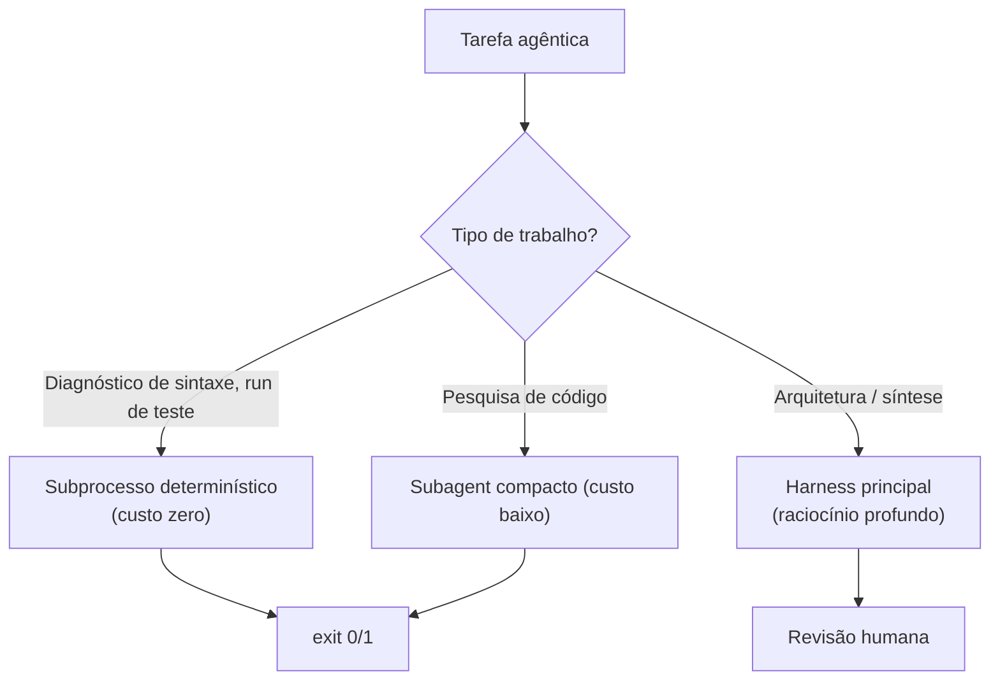

# Dia 13 — Roteamento inteligente de LLM: o modelo certo por turno

## Meta do dia

Entender o **roteamento de modelo como arquitetura**: como o `ecossistema-aidd` roteia tarefas entre harnesses e perfis distintos — e por que a regra que o `AGENTS.md` do ecossistema mantém ("model: inherit" como padrão) é a exceção consciente para um meta-repositório.

## A ideia em uma frase

Roteamento não é "escolher o modelo na mão" — é **declarar qual perfil de modelo atende cada tipo de tarefa** e deixar o orquestrador decidir por frente, com custo, latência e qualidade por turno.

## A explicação simples

Cada tarefa agêntica tem um perfil de custo diferente (Dia 5). Pesquisar mais folder em um arquivo é barato e determinístico — não precisa de modelo de última geração. Desenhar a arquitetura de um sistema novo precisa de raciocínio concentrado. Detectar um bug num teste flaky precisa de contexto longo. **Usar o mesmo modelo (e o mesmo preço) para todas as tarefas é jogar fora dinheiro** — e usar o modelo grande para tudo reduz o roteamento estrutural que o harness deveria oferecer [1].

Roteamento inteligente é a disciplina de classificar tarefas e atribuir a elas um executor com o perfil adequado. Três dimensões governam a escolha:

- **Custo por token** — o modelo premium é para poucos turnos; o modelo compacto para a maioria.
- **Janela de contexto** — o modelo certo busca especificidade do contexto (assunto do Dia 8).
- **Qualidade do raciocínio** — tarefas de síntese e validação estão no topo da hierarquia.

Não existe um "melhor modelo": existe um delegador que decide *por tarefa*.

## O exemplo real: o roteamento no `ecossistema-aidd`

O ecossistema é agnóstico por lei (supremacia agnóstica — Lei 6): ele não amarra o projeto a um provedor. Mas ele **roteia de verdade** em duas camadas:

**1. Roteamento por harness (a "pista" de execução).** O `orchestrate` aceita `--harness` (harness default) e `--harness-map` — que mapeia *cada frente* a um harness específico: `frente1=claude,frente2=agy` [2], ou via arquivo `harness_profiles.json` em `.orca/`. Cada frente do plano de voo (Dia 12) passa a rodar no harness — e portanto no modelo — mais adequado ao tipo de trabalho.

**2. Roteamento por ferramenta (subprocesso determinístico).** Quando o fluxo chama um gate ou uma etapa do generator (8 fases), o trabalho é delegado a um script Python que **não usa LLM nenhum** — custo zero (Dia 4). O LLM fica reservado para as fases de raciocínio da linha de montagem; o que é mecânico sai do circuito de modelos.



## A escolha consciente do "model: inherit"

A regra de ouro no `AGENTS.md` do ecossistema é `model: inherit` — o harness usa o modelo que a sessão configurou, sem travar um provedor no arquivo de instrução. Isso pode parecer contraditório com o Dia de hoje, mas não é: o ecossistema é um **meta-repositório** que roda em qualquer harness (Claude, Antigravity, OpenCode, MimoCode).

Para um meta-projeto, ancorar um modelo específico sabotaria a agnostização: cada usuário roda com o harness que tem, e a cabine vai além do modelo (Dia 1). O roteamento fino acontece nas **frentes** (`harness_map`) e nas **ferramentas** (subprocesso), não no arquivo de governança. O "model: inherit" é a generalização correta; o roteamento específico é a exceção por tarefa [3].

## Mão na massa

Abra o terminal na pasta `ecossistema-aidd`:

1. Veja o `--harness` e o `--harness-map` no comando de orquestração:

   ```bash
   python ecossistema.py orchestrate --help 2>&1 | grep -A 4 "harness"
   ```

2. Abra o perfil de harnesses de exemplo:

   ```bash
   head -30 .orca/harness_profiles.json 2>/dev/null
   ```

3. Veja como o `AGENTS.md` declara a regra de modelo:

   ```bash
   grep -rn "model\|inherit" AGENTS.md | head
   ```

4. Confirme que as ferramentas rodam como subprocessos sem LLM (a camada de roteamento determinística):

   ```bash
   grep -n "subprocess\|sys.executable" ecossistema.py | head
   ```

5. Explore os scripts que materializam fases sem LLM:

   ```bash
   ls tools/aidd-generator/scripts/ | grep -i "fase\|pipeline"
   ```

## Três regras que ficam

1. Roteamento por tarefa: mecânico → subprocesso (zero), orquestração → perfil barato, síntese → modelo profundo.
2. Harness_map por frente é a forma declarativa de rotear entre modelos sem tocar no código.
3. "Model: inherit" no AGENTS.md é a regra para meta-projetos agnósticos; rotear está no orquestrador, não no arquivo.

## Erros de julgamento deste dia

- Gravar `model: claude-...` no arquivo de instrução de um projeto multi-harness — trava a portabilidade (Dia 15).
- Rodar modelo premium para cada tarefa, ignorando que gates e fases mecânicas custam zero com subprocesso.
- Confundir "roteamento de modelo" com "preferência de um modelo" — a decisão é por frente, não global.

## Checklist do dia

- [ ] Sei explicar as 3 dimensões do roteamento de modelo (custo, janela, qualidade).
- [ ] Entendi o papel de `--harness-map` e `harness_profiles.json` no roteamento por frente.
- [ ] Sei por que `model: inherit` é a regra correta para um meta-repositório.
- [ ] Diferendo roteamento no orquestrador (por frente) de escolha global (no config).
- [ ] Identifiquei no código onde o ecossistema delega para subprocesso (custo zero).

## Para saber mais

1. `ecossistema.py` — opções `--harness`, `--harness-map`, `--profiles` do comando `orchestrate`.
2. `.orca/harness_profiles.json` — o arquivo de perfis por harness.
3. `AGENTS.md` do ecossistema — Supremacia Agnóstica e a regra de modelo.
4. `tools/aidd-generator/scripts/` — as fases executadas como subprocesso sem LLM.

No Dia 14, abrimos a caixa-preta das configurações: o que ninguém te conta sobre `.env`, dependências de harness e a inicialização auto-bootstrap do ecossistema.