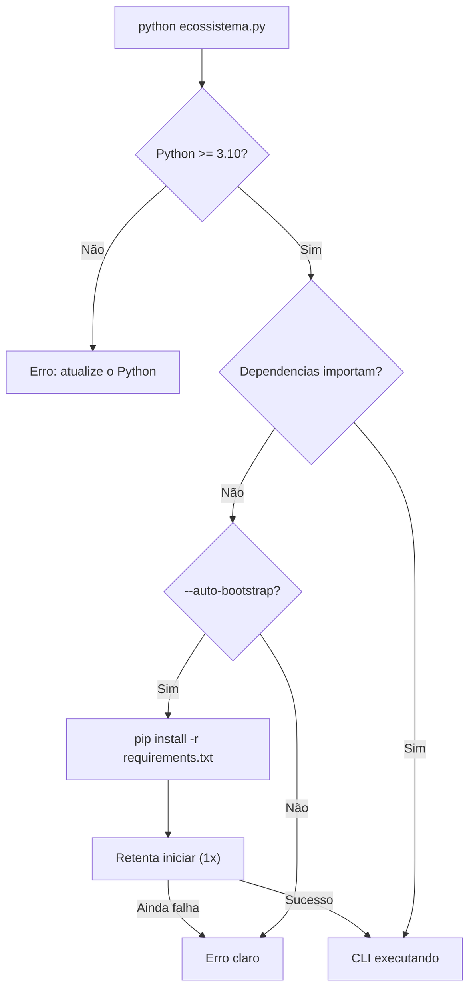

# Dia 14 — Configurações que nunca te contam

## Meta do dia

Descobrir a camada que fica **fora do AGENTS.md**: `.env` carregado do jeito certo, `PYTHONPATH` montado por ferramenta, bare. do auto-bootstrap (`requirements.txt` + retry único) e as armadilhas de variável já exportada.

## A ideia em uma frase

Metade das configurações que quebram uma sessão agêntica não está em nenhum markdown — está em **variáveis de ambiente**, **arquivos `.env`** e **caminhos de Python**, e o detalhe que mata é a ordem em que eles são resolvidos.

## A explicação simples

O AGENTS.md instrui o agente, os gates impõem política, mas o ambiente (credentials, URLs, tokens) vivo em **variáveis de ambiente**. E aqui mora o problema mais comum de engenharia agêntica real: o projeto depende de variáveis que o harness — lançado pelo IDE, pelo terminal, por um worktree — **não herdou**.

Três configurações são as campeãs de "ninguém te contou":

**1. `.env` com `override=False`.** O arquivo `.env` da raiz carrega variáveis para `os.environ`, mas **não sobrescreve** as que já existem no processo. Se o terminal já tem `OPENAI_API_KEY=X`, o `.env` com `OPENAI_API_KEY=Y` é silenciosamente ignorado. A ordem importa: variável do processo > `.env` [1].

**2. `PYTHONPATH` por ferramenta.** Cada ferramenta do ecossistema roda com um `PYTHONPATH` próprio que aponta para o diretório dela. Isso faz com que `aidd-generator` importe `aidd_generator` do lugar certo, mesmo com 6 diretórios-irmãos na mesma árvore. Sem essa linha, o Python importaria qualquer coisa de qualquer lugar — pior: nada [2].

**3. Auto-bootstrap com retry único.** O pré-flight do `ecossistema.py` verifica a versão do Python (mínimo 3.10) e, se o usuário passar `--auto-bootstrap`, instala `requirements.txt` e **tenta de novo uma única vez**. Na segunda chamada o script chega ao código real — ou falha com mensagem clara [3].

## O bootstrap na prática

O fluxo de inicialização do `ecossistema.py` é antes de tudo o verdadeiro "segredo" do início de sessão:



Repare: o auto-bootstrap não é "instalar sempre" — é **instalar sob demanda, apenas quando o usuário pede o flag**, e retentar uma vez. Isso mantém o projeto determinístico: nenhum efeito colateral acontece sem pedido explícito (Dia 2).

## O exemplo real: `load_dotenv` no `ecossistema.py`

No topo do `ecossistema.py`:

```python
load_dotenv(os.path.join(ROOT_DIR, ".env"), override=False)
```

E a função que roda cada ferramenta prepara o ambiente herdando o `os.environ` já mesclado:

```python
merged_env = os.environ.copy()
env = {"PYTHONPATH": forge_dir}
env.update(merged_env)  # na pratica: PYTHONPATH do forge + tudo do .env
```

A lição de ouro escondida aqui: o `load_dotenv` acontece **antes** de qualquer import que possa falhar por faltar credencial, e com `override=False` — o ambiente do shell manda. Quem edita o `.env` esperando trocar a variável do processo vai quebrar o queixo silenciosamente. A prática de configuração que ninguém te contou é: **diagnostique o ambiente com `env | grep` antes de culpar o código** [4].

## Mão na massa

Abra o terminal na pasta `ecossistema-aidd`:

1. Verifique o carregamento do `.env` (não sobrescreve o processo):

   ```bash
   grep -n "load_dotenv\|override" ecossistema.py | head
   ```

2. Veja o `PYTHONPATH` montado por ferramenta:

   ```bash
   grep -n "PYTHONPATH" ecossistema.py
   ```

3. Entenda o pré-flight de versão de Python:

   ```bash
   grep -n "PYTHON_MINIMO" ecossistema.py
   ```

4. Veja se há um `.env.example` como modelo (sem segredos reais):

   ```bash
   ls -la .env* 2>/dev/null; echo "---"; head -20 .env.example 2>/dev/null
   ```

5. Rode o pré-flight explícito (que valida o ambiente antes de qualquer ferramenta):

   ```bash
   python ecossistema.py --help 2>&1 | head -20
   ```

## Três regras que ficam

1. `.env` com `override=False`: o ambiente do processo vence; o `.env` só preenche o que falta.
2. `PYTHONPATH` por ferramenta evita import errado entre 6 diretórios-irmãos — config implícita, mas decisiva.
3. Sempre começar a sessão com um pré-flight de versão/dependência, com bootstrap só sob flag explícita.

## Erros de julgamento deste dia

- Editar o `.env` esperando trocar uma variável que já está exportada no processo — nada muda silenciosamente.
- Rodar a ferramenta sem o `PYTHONPATH` adequado e ver "ModuleNotFoundError" inexplicável.
- Chamar o bootstrap automático sem flag e reclamar que o ambiente instalou coisas sem permissão.

## Checklist do dia

- [ ] Sei a regra `override=False` do `load_dotenv` e quando ela surpreende.
- [ ] Entendo por que `PYTHONPATH` é montado por ferramenta no `ecossistema.py`.
- [ ] Vejo o pré-flight de Python (>= 3.10) e o retry único do auto-bootstrap.
- [ ] Meço o ambiente real com `env | grep` antes de culpar configuração.
- [ ] Sei onde mora o `.env` do projeto e o que ele deve (e não deve) conter.

## Para saber mais

1. `ecossistema.py` — `load_dotenv(..., override=False)` e o merge de ambiente nas ferramentas.
2. `ecossistema.py` — `PYTHON_MINIMO`, `_instalar_requirements()`, `--auto-bootstrap`.
3. `.env.example` — o modelo de variáveis esperadas pelo projeto.
4. Documentação do `python-dotenv` (saurabh-maurya.gitbook.io/python-dotenv) — semântica de `override`.

No Dia 15, os segredos universais: quais princípios deste ecossistema se aplicam a QUALQUER harness que você use.