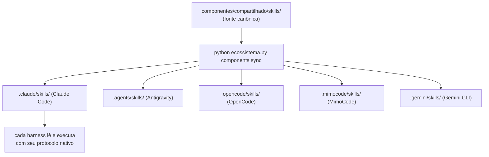

# Dia 15 — Os segredos universais aplicáveis a qualquer harness

## Meta do dia

Sistematizar as **8 Leis Invioláveis** do `ecossistema-aidd` — e ver como cada uma delas se aplica a qualquer harness (Claude, Antigravity, OpenCode, MimoCode) sem depender de um provedor específico.

## A ideia em uma frase

Há regras que funcionam em qualquer harness porque são leis de engenharia, não convenções de produto: determinismo primeiro, zero stubs, suprema agnóstica e o desenvolvedor no controle.

## A explicação simples

Ao longo de 14 dias, vimos centenas de detalhes do `ecossistema-aidd`. Agora a pergunta é: **quais desses detalhes se aplicam a qualquer projeto, independentemente do harness?** A resposta são as 8 Leis Invioláveis — princípios que o `AGENTS.md` do ecossistema declara como não-negociáveis, e que funcionam em qualquer ambiente [1].

Cada lei é um segredo univers porque seu efeito não depende do modelo nem da ferramenta:

1. **Determinism First** (Lei 1) — scripts determinísticos decidem o que pode ser repetido; o LLM decide o que precisa de julgamento (Dia 2).
2. **Binary Quality** (Lei 2) — exit 0/1, sem "mais ou menos"; gates são a política (Dia 9).
3. **Structured Persistence** (Lei 3) — estado em JSON/SQLite, nunca no histórico conversacional (Dia 8).
4. **Extreme Token Economy** (Lei 4) — cada token conta; pensamento compacto, pipe em comandos (Dia 7).
5. **Zero Stubs, Zero Mocks** (Lei 5) — código stub/moc é código que mentem sobre o que funciona; testes reais substituem (G_TESTES_REAIS).
6. **Supremacy Agnostic** (Lei 6) — governança cannoto a um só provedor; o harness é porta de entrada, não destino (Dia 13).
7. **Developer in Control** (Lei 7) — nenhuma automação roda sem explícito pedido; hook, não instalação silenciosa.
8. **Label Honesty** (Lei 8) — nunca alegar o que não está provado; testes reais definem o que é cobertura (G_HONESTIDADE_ROTULO) [2].

## O exemplo real: como a agnóstica se aplica a qualquer harness

O manifesto `gates/manifesto_harnesses.json` lista os harnesses suportados pelo sync: Claude Code, Antigravity, OpenCode, MimoCode, Gemini CLI. O script `gestor_componentes.py` (`python ecossistema.py components sync`) distribui os componentes de `componentes/compartilhado/skills/` para a pasta de cada harness, corrigindo data de criação.

O que faz isso funcionar em qualquer harness é o princípio: **a pasta canônica (`componentes/`) é a fonte da verdade; as pastas por harness são só destinos de distribuição** [3]. Se amanhã surgir um harness novo, basta uma entrada no manifesto e o sync passa a distribuir.



## A universaliade de prática

Considere essas outras práticas que são leis de mercado para qualquer projeto agêntico:

- **Geração contra stubs é fraude**: se o agente gera um teste que dá certo só porque o código é stub, o teste mente (Lei 5).
- **Roteamento declarativo por frente** funciona em qualquer frentes e qualquer harness (Dia 13).
- **Estado serializado em JSON** (`PLANO-EXECUCAO-ESTRUTURADO.json`) é legível por qualquer harness que suporte leitura de arquivo (Dia 5).
- **Python >= 3.10** como mínimo é o preço de usar dataclasses com tipos, `match/case` e `tomllib` — qualquer harness no universo aceita.

## Mão na massa

Abra o terminal na pasta `ecossistema-aidd`:

1. Leia as 8 Leis do AGENTS.md (são ~20 linhas):

   ```bash
   grep -A 20 "Inviolable Laws" AGENTS.md
   ```

2. Veja como o manifesto lista os harnesses:

   ```bash
   cat gates/manifesto_harnesses.json | head -30
   ```

3. Veja os comandos de distribuição:

   ```bash
   python ecossistema.py components --help
   ```

4. Teste a agnóstica: rode o mesmo comando com outro `PYTHONPATH` e veja se muda algo no resultado (não deveria mudar):

   ```bash
   python ecossistema.py status 2>&1 | head -8
   ```

## Três regras que ficam

1. As 8 Leis Invioláveis são leis de engenharia — funcionam em qualquer harness.
2. A agnóstica do ecossistema se materializa num manifesto e num sync — não em heurísticas.
3. Zero stubs + binary quality = o antídoto contra testes que mentem.

## Erros de julgamento deste dia

- Implementar uma lei "quando puder" em vez de tratá-la como não-negociável.
- Manter código stub como "placeholder temporário" que nunca evolui para real.
- Editar a pasta física do harness (`.claude/`) direto em vez de usar `components sync`.

## Checklist do dia

- [ ] Consigo citar as 8 Leis Invioláveis pelo número.
- [ ] Sei onde está o manifesto de harnesses e o que o `components sync` faz.
- [ ] Entendo por que a fonte canônica é `componentes/compartilhado/` e as pastas por harness são só destino.
- [ ] Identifiquei na prática qual lei aplica ao seu próximo projeto, independentemente do harness.
- [ ] Entendi o efeito das leis 5 e 8 no código real (gates `G_TESTES_REAIS` e `G_HONESTIDADE_ROTULO`).

## Para saber mais

1. `AGENTS.md` do ecossistema — "Inviolable Laws" completas (linhas ~10-30).
2. `gates/manifesto_harnesses.json` — a lista de harnesses suportados.
3. Script `scripts/gestor_componentes.py` — `sync` e `verify` de distribuição.
4. `gates/G_HONESTIDADE_ROTULO.py` — a implementação da Lei 8.

No Dia 16, encerramos com o panorama completo: a fábrica agêntica AIDD de ponta a ponta — do ideia ao software testado.