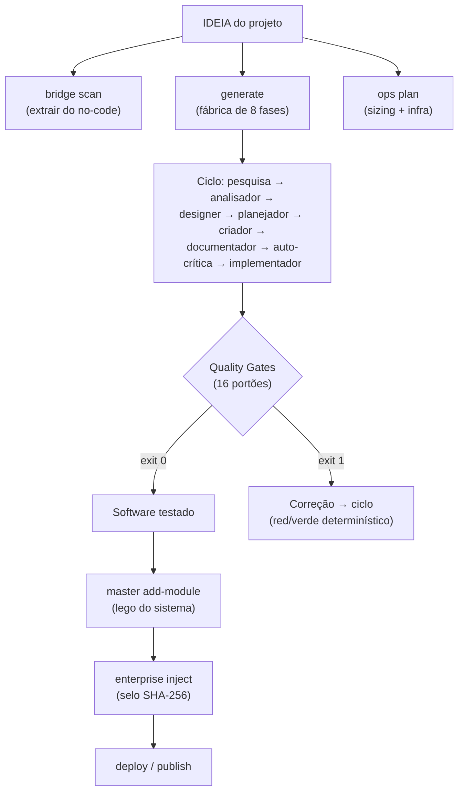
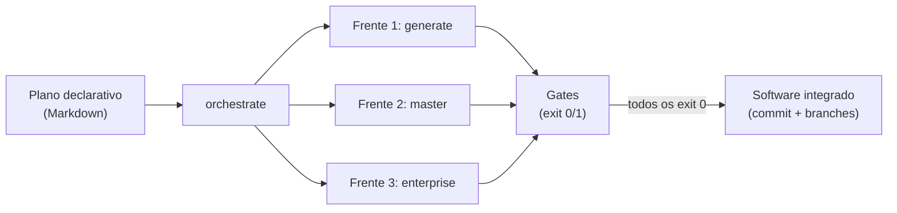

# Dia 16 — Arquitetura para desenvolvimento com IA: o sistema que constrói sistemas

## Meta do dia

Fechar o ciclo compreendendo o **ecossistema AIDD como arquitetura viva**: como as 6 ferramentas, os 16 gates, a orquestração multi-harness e as 8 leis formam um sistema que transforma uma ideia em software testado — e o que disso leva você para qualquer projeto.

## A ideia em uma frase

Um ecossistema agêntico não é "uma IA que programa" — é um **sistema que constrói sistemas**: pipeline declarativo, gates que bloqueiam, orquestração que decide, e a governança que mantém tudo honesto.

## A explicação simples

Ao longo de 15 dias, vimos as camadas: a cabine (Dias 1-3), a bancada (Dias 4-8), a linha de montagem (Dias 9-12) e o ofício do arquiteto (Dias 13-15). Agora vamos juntar tudo num panorama que mostra como o `ecossistema-aidd` se organiza como arquitetura viva.

A premissa central é: **um repositório não é um projeto — é uma fábrica**. E a fábrica tem etapas, portões de qualidade e um orquestrador que decide quem faz o quê [1].

## O exemplo real: o fluxo de ponta a ponta



## As 6 ferramentas como etapas de uma fábrica

Relembre a tabela que abrimos no Dia 4, agora com o contexto completo:

| Ferramenta | Papel na fábrica | Analogia |
|---|---|---|
| aidd-forge | Cria ambientes isolados, governança e determinismo básico | O chassi |
| aidd-generator | Converte uma ideia em código por 8 fases com gates | A linha de montagem |
| aidd-master | Organiza o código em módulos modulares com SQLite WAL | Os blocos de Lego |
| aidd-enterprise | Aplica verificação criptográfica e zero-trust | O selo de auditoria |
| aidd-ops | Dimensiona infraestrutura (Docker, VPS, hardening) | A pista e o abastecimento |
| aidd-bridge | Extrai projetos low-code e migra para VPS própria | O tradutor |

O `ecossistema.py` é a porta de entrada: uma CLI unificada que roteia comandos para a ferramenta certa, monta o `PYTHONPATH`, carrega o `.env` e resolve dependências. Quando uma ferramenta vira um subprocesso, o ecossistema mede o resultado com exit code — a mesma moeda binária dos dias 2 e 9 — e esse gerenciamento de fluxo é o que transforma a fábrica num sistema confiável [2].

## Os 16 gates como sistema nervoso

Não são 16 soluções isoladas — é um sistema que valida **em todas as dimensões**:

- Integridade do repositório (`G_ECOSSISTEMA_INTEGRIDADE`, `G_ARQUITETURA_DELIVERABLE`)
- Segurança (`G_SEGREDOS`, `G_HADOLINT`, `G_SAST` implicito)
- Qualidade (`G_TESTES_REAIS`, `G_HONESTIDADE_ROTULO`, `G_COBERTURA`)
- Governança (`G_DRIFT_NUCLEO_COMPARTILHADO`, `G_HARNESS_COMPAT`, `G_UNIVERSAL_HARNESS`)
- Economia (`G_ZERO_HEADLESS`, `G_ESCRITOR_ATOMICO`)

E a lista de allowlists é o compromisso com a transparência: quando algo é dispensado, está documentado, revisado e versionado.

## O modelo que o ecossistema entrega

No Dia 12 vimos a orquestração. No Dia 13, o roteamento. A síntese destes dois é: **a fábrica não executa tarefas — ela executa frentes, com isolamento, em paralelo, e devolve resultados testados**.

Isso muda o paradigma do "programador e a IA": o humano define o plano, o ecossistema o executa, os gates garantem a qualidade, e o resultado é um sistema que se constrói e se mantém com governança.



## O que levar para qualquer projeto

Se você entendeu as 8 Leis, aplicou os 3 modos de orquestração e usou pelo menos 2 ferramentas, você já tem o que levar:

1. **Um `AGENTS.md` com leis claras** — não regras vagas; limites binários.
2. **Gates de qualidade mínimos** — pelo menos um que valide o que é real.
3. **Estado em JSON** — não dependa de memória conversacional.
4. **Orquestração por frente** — nem tudo pode rodar no mesmo contexto.
5. **Honestidade do rótulo** — nunca alegar o que não foi testado.

O resultado é que o ecossistema-aidd se apresenta como o "sistema que constrói sistemas": a cada rodada, a linha de montagem produz código, os gates o avaliam, e apenas o que passa de verdade é integrado — sem stubs, sem mocks, sem promessas que os testes não confirmam [3].

O `ecossistema-aidd` é isso: não um software, mas um **método para construir software com IA**. E o método, diferente do modelo, você controla.

## Mão na massa: checklist final

1. Rode o status completo do ecossistema:

   ```bash
   python ecossistema.py status
   ```

2. Liste todos os gates reais (não só os do README):

   ```bash
   ls gates/G_*.py | wc -l
   ```

3. Veja o manifesto de harnesses:

   ```bash
   cat gates/manifesto_harnesses.json | head -10
   ```

4. Rode o audit completo — a inspeção periódica que tudo valida:

   ```bash
   python ecossistema.py audit 2>&1 | tail -20
   ```

5. Leia as 8 Leis uma última vez — e decida quais você vai implementar amanhã.

## Três regras que ficam (as 3 últimas)

1. A fábrica não é a IA — é o **sistema** que orchestra a IA: cli, gates, hooks e governança.
2. Software não é produto; é o resultado de um processo com gates que bloqueiam o que não está pronto.
3. O que você leva para qualquer projeto não é o código — são as leis, os padrões e a mentalidade determinística.

## Erros de julgamento deste dia (finais)

- Pular da ideia direto para o código sem definir o plano de frentes e os gates.
- Achar que "basta ter IA" e ignorar a camada de governança e determinismo.
- Tratar o ecossistema como projeto final em vez de método — o método é que se replica.

## Checklist do dia

- [ ] Consigo descrever o fluxo ponta a ponta de uma ideia a software testado.
- [ ] Sei nomear as 6 ferramentas e o papel de cada uma na fábrica.
- [ ] Entendo por que os 16 gates são um sistema nervoso, não soluções avulsas.
- [ ] Tenho pelo menos 3 ações concretas para implementar no meu projeto amanhã.
- [ ] Sei que o método se replica: as leis e os gates funcionam em qualquer harness.

## Para saber mais (leituras finais)

1. README do ecossistema-aidd — o mapa completo (github.com/heverton-dev/ecossistema-aidd).
2. `AGENTS.md` do ecossistema — as 8 Leis Invioláveis e a governança canônica.
3. `ecossistema.py` — a CLI unificada que orquestra tudo.
4. `docs/protocolos/AGENTS-REFERENCIA-COMPLETA.md` — a referência completa da governança.

Fim da jornada de 16 dias. Você não saiu apenas sabendo "usar um assistente de IA" — saiu com o método para construir assistentes de IA que funcionam, que têm porta, e que se mantêm honestos. Boa sorte com o seu próximo ecossistema.