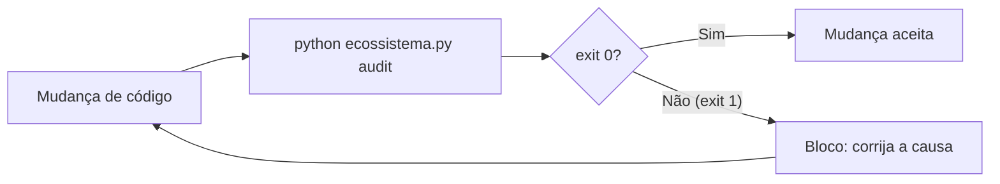

# Dia 2 — Probabilismo e determinismo: onde cada um manda

## Meta do dia

Entender **o que o modelo decide** (probabilístico) versus **o que o código garante** (determinístico) — e ver como o `ecossistema-aidd` impõe o segundo com gates de qualidade que respondem apenas `exit 0` (passa) ou `exit 1` (bloqueia).

## A ideia em uma frase

O modelo é bom para escolher entre respostas plausíveis, mas péssimo para repetir exatamente o mesmo procedimento; o que precisa ser exato, você escreve em código — e o código não aceita "mais ou menos".

## A explicação simples

Um LLM, por dentro, é uma máquina de probabilidade: ele observa um texto e calcula qual é a próxima palavra mais provável, dado tudo que já viu. Isso faz dele genial para criar, parafrasear e raciocinar — e inútil para ser *repetível*. Peça duas vezes "valide esse arquivo" e você pode receber dois procedimentos diferentes, ambos corretos.

Por isso, engenharia agêntica madura tem uma regra de ouro: **procedimento no código, julgamento no modelo**. Tarefas mecânicas — conferir sintaxe, comparar arquivos, checar segredos, validar esquema — viram script. O LLM só entra onde o resultado não pode ser previsto antecipadamente [1].

Como transformar um pedido em lei? Com um **gate de qualidade**: um programa que roda e devolve um código de saída binário. Se o programa passa, o fluxo segue; se falha, o fluxo morre. Não existe "passa mais ou menos". Para o agente, isso muda tudo: não basta ele *achar* que está certo — a máquina *verifica* de novo.

## O determinismo como primeira lei

O `AGENTS.md` do ecossistema-aidd é explícito. Sua primeira Lei Inviolável é "Determinism First": use scripts determinísticos, AST, regex ou JSON Schema para tarefas mecânicas — **nunca** o LLM para isso. A segunda é "Binary Quality": cada mudança precisa passar nos Quality Gates, com `exit 0 = pass` e `exit 1 = block` [2].

Repare no detalhe: não é uma preferência de estilo. É uma lei. E leis, neste projeto, têm consequência no código.



## O exemplo real: os gates do `ecossistema-aidd`

O `ecossistema-aidd` tem 16 gates em `gates/`, com nomes como `G_ECOSSISTEMA_INTEGRIDADE.py`, `G_SEGREDOS.py`, `G_HADOLINT.py` e `G_TESTES_REAIS.py`. Cada um é um script Python determinístico que varre o repositório e devolve exit code. Juntos, formam o audit consolidado.

O comando central é:

```bash
python ecossistema.py audit
```

E aqui mora um detalhe de arquitetura que vale o dia inteiro: o comando `audit` não roda os gates na ordem em que aparecem na lista — ele delega para o framework `pre-commit` com `pre-commit run --all-files`. Os mesmos gates `_GATES_AUDIT` que estão no `ecossistema.py` viram hooks locais em `.pre-commit-config.yaml` [3].

Isso significa que a política de qualidade não depende de "quem roda o comando": o gate está integrado ao ciclo de vida do git. E mais importante: o ecossistema usa `gates/allowlist_*` (como `allowlist_cli_help.json` e `allowlist_orfaos.json`) — listas de exceção revisadas por humano, em vez de simplesmente desligar um gate que falha. O determinismo continua valendo com transparência do que foi dispensado e por quê.

Observe ainda a Lei 8, "Label Honesty": nunca alegar certificação ou cobertura de testes além do que os testes automatizados reais comprovam. Isso é probabilismo *honesto* aplicado à comunicação: o marketing não conta, o teste mede [4].

## Mão na massa

Abra o terminal na pasta `ecossistema-aidd` e faça:

1. Liste os gates:

   ```bash
   ls gates/ | grep "^G_"
   ```

2. Leia o miolo de um gate pequeno, o `G_HONESTIDADE_ROTULO.py`, e identifique onde ele decide aprovar/reprovar (o retorno com exit code).

3. Veja o rol de gates auditáveis declarados no `ecossistema.py`:

   ```bash
   grep -n "_GATES_AUDIT" -A 12 ecossistema.py
   ```

4. Rode um gate isolado (não o audit completo) para ver a saída binária:

   ```bash
   python gates/G_ECOSSISTEMA_INTEGRIDADE.py > /dev/null; echo "exit=$?"
   ```

   (Se o ambiente não estiver 100%, você verá `exit=1` — e isso, por design, é a resposta certa do determinismo.)

5. Abra `gates/allowlist_cli_help.json` e tente entender que tipo de exceção foi registrada e por quê.

## Três regras que ficam

1. Julgamento ao modelo, procedimento ao código — nunca o contrário para tarefas que precisam de repetição exata.
2. Gate de qualidade com exit 0/1 transforma pedido em lei e acaba com o "mais ou menos".
3. Exceção a um gate é um arquivo revisto por humano (allowlist), não um gate desligado.

## Erros de julgamento deste dia

- Pedir ao modelo para fazer o que um script faria melhor (ex.: validar sintaxe) e sofrer com inconsistência entre execuções.
- Ver um gate falhar e "corrigir o teste" para ele passar, em vez de corrigir a causa (o modo red/verde só funciona se o verde for honesto).
- Confiar em obviedade verbal: o agente diz que passou; o exit code é que decide.

## Checklist do dia

- [ ] Sei explicar a diferença entre decisão probabilística e procedimento determinístico.
- [ ] Entendi por que `exit 0`/`exit 1` é mais forte do que uma instrução.
- [ ] Localizei os 16 gates em `gates/` no ecossistema-aidd.
- [ ] Entendi o papel das allowlists (exceção revistada) versus gate desativado.
- [ ] Rodei o comando para imprimir o exit code de um gate isolado.

## Para saber mais

1. `AGENTS.md` do `ecossistema-aidd` — seção "Inviolable Laws", Lei 1 (Determinism First) e Lei 2 (Binary Quality).
2. README do projeto — "Os 12 Portões de Segurança", a lista com o propósito de cada gate.
3. `ecossistema.py` — função `_GATES_AUDIT` e `cmd_audit`, onde o audit delega para o pre-commit.
4. Documentação oficial do framework pre-commit (pre-commit.com) — como hooks locais rodam no ciclo git.

No Dia 3, vamos abrir o arquivo que cada agente lê em primeiro lugar: o `AGENTS.md` — e ver como o ecossistema-aidd o usa como Lei Fundamental compartilhada entre todos os harnesses.