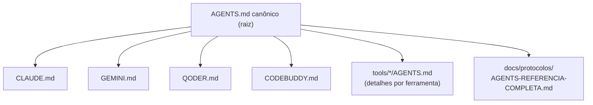

# Dia 3 — O arquivo que cada agente lê: AGENTS.md, config.json e rules

## Meta do dia

Dominar os **arquivos de instrução persistente** do `ecossistema-aidd`: entender o que é o `AGENTS.md` canônico, por que ele é o primeiro arquivo que cada agente lê e como ele se espalha para cada harness (Claude, Antigravity, OpenCode, MimoCode) com o mesmo conteúdo.

## A ideia em uma frase

Um repositório de engenharia agêntica não ensina o agente pelo "jeito certo" uma vez — ele ensina **todos os** os harnesses, o tempo cada, pelo mesmo arquivo de governança.

## A explicação simples

Na primeira mensagem de uma sessão, o agente de IA não sabe nada sobre o seu projeto. Ele só sabe o que o harness injeta nele: o prompt de sistema, as ferramentas disponíveis e os **arquivos de contexto**. Entre esses arquivos, um se destaca: o `AGENTS.md`.

Se existe um `AGENTS.md` na raiz, quase cada harness moderno o lê automaticamente e o mantém em contexto do começo ao fim da sessão [1]. É como o manual de bordo: o copiloto não precisa decorar tudo de antemão, mas precisa *saber que o manual existe e onde consultá-lo*.

O `ecossistema-aidd` leva isso ao limite: além do `AGENTS.md` canônico na raiz, existem `CLAUDE.md`, `GEMINI.md`, `CODEBUDDY.md`, `QODER.md` — um para cada harness — mas todos os apontam para a **mesma** governança, em vez de duplicarem conteúdo divergente. O `AGENTS.md` é descrito como "A Lei Fundamental e a governança canônica" [2]; os demais são pontes para o mesmo texto, com detalhes específicos do harness apenas onde o formato exige.

## A anatomia de um AGENTS.md bem feito

Observe a estrutura do `AGENTS.md` do ecossistema-aidd. Ele não começa com "seja educado" — começa com restrições operacionais que desperdiçam menos tokens:

- **Core Execution Constraints**: pensamento compacto (<150 palavras de raciocínio), resolver em 3 a 5 passos discretos, saída de executor silencioso, edição por busca/substituição exata, sempre dar pipe em comandos verbosos (`pytest 2>&1 | tail -n 25`) e consultar o knowledge graph (MCP `code-review-graph`) **antes** de Grep/Glob/leitura integral [3].
- **Inviolable Laws**: determinismo primeiro, qualidade binária, persistência estruturada, economia extrema de tokens, zero stubs, supremacia agnóstica, desenvolvedor no controle, honestidade do rótulo.
- **Architecture & Context Dispatch**: diz onde os detalhes moram — `tools/aidd-forge/AGENTS.md`, `tools/aidd-generator/AGENTS.md` etc. O canônico não tenta conter tudo; ele *roteia*.

Repare no princípio: o arquivo de instrução não detalha cada ferramenta — ele define limites e indica onde os detalhes estão. Isso mantém o prefixo de contexto curto e estável, o que é decisivo para prompt caching (assunto do Dia 6) [4].

## O exemplo real: a governança em arquivo do `ecossistema-aidd`

Na raiz do `ecossistema-aidd` você encontra o `AGENTS.md` completo em apenas ~50 linhas. Ele declara o nome do repositório, o padrão de governança ("Zero Stubs, Strict Determinism, Context Optimization <2000 tokens") e a referência completa em `docs/protocolos/AGENTS-REFERENCIA-COMPLETA.md`.



A instrução persistente não é um texto único gigante: é uma **árvore**. O canônico é o tronco (limites e leis); as ferramentas são os galhos (detalhes de cada dominio); o documento de referência completa é a folhagem (o wiki completo). O agente lê o tronco sempre, os galhos sob demanda e a folhagem quando precisa mergulhar.

E quando uma instrução precisa ser *distribuída* — por exemplo, uma skill nova que deve funcionar em todos os harnesses? O ecossistema usa `python ecossistema.py components sync --tipo todos os`, que sincroniza a distribuição física multi-harness a partir do cofre canônico em `componentes/` [2]. Instrução persistente aqui se escreve uma vez e se distribui igualdade.

## Mão na massa

Abra o terminal na pasta `ecossistema-aidd` e faça:

1. Leia o `AGENTS.md` inteiro do começo ao fim (são ~50 linhas — leitura obrigatória).

2. Compare os harness bridges:

   ```bash
   ls AGENTS.md CLAUDE.md GEMINI.md CODEBUDDY.md QODER.md
   ```

3. Veja como o tronco roteia para os galhos:

   ```bash
   for d in tools/aidd-forge tools/aidd-master tools/aidd-ops; do echo "== $d =="; head -8 "$d/AGENTS.md"; done
   ```

4. Leia as "Inviolable Laws" de novo e escreva com suas palavras o que cada uma impede na prática.

5. Consulte a referência completa:

   ```bash
   head -40 docs/protocolos/AGENTS-REFERENCIA-COMPLETA.md
   ```

## Três regras que ficam

1. O `AGENTS.md` é o primeiro arquivo que o harness lê na sessão — é o manual de bordo do agente.
2. Instrução persistente boa é curta no tronco (leis) e profunda nos galhos (detalhes por ferramenta).
3. Governança canônica se escreve uma vez e se distribui para todos os harnesses — nunca se mantém duplicada na mão.

## Erros de julgamento deste dia

- Inflar o `AGENTS.md` com regras de cada ferramenta, criando um prefixo de contexto gigante e instável.
- Manter `CLAUDE.md`, `GEMINI.md` e outros duplicados e divergentes entre si — cada harness aprende uma verdade diferente.
- Escrever instrução do tipo "seja cuidadoso" sem mecanismo: o arquivo instrui, mas sem gate (Dia 2) nada garante.

## Checklist do dia

- [ ] Li o `AGENTS.md` canônico inteiro do ecossistema-aidd.
- [ ] Sei o que são as 8 Leis Invioláveis e consigo citar pelo menos 4.
- [ ] Entendi a diferença entre tronco, galhos e folhagem na árvore de instruções.
- [ ] Sei qual comando sincroniza a distribuição física de componentes multi-harness.
- [ ] Consigo explicar por que o canônico não deve duplicar o conteúdo das ferramentas.

## Para saber mais

1. `AGENTS.md` do ecossistema-aidd — a Lei Fundamental (github.com/heverton-dev/ecossistema-aidd).
2. README, seção "Mapa do Repositório" — onde `AGENTS.md` é listado como "A Lei Fundamental e a governança canônica".
3. `core/context_slicer.py` — como o projeto extrai contexto de arquivos sem ler o corpo inteiro (os "galhos" sob demanda).
4. `docs/protocolos/AGENTS-REFERENCIA-COMPLETA.md` — a referência completa da governança canônica.

No Dia 4, vamos entrar na cabine de verdade: as ferramentas que o agente tem em mãos — skills, MCPs e tools — e as 6 Ferramentas Integradas do ecossistema.