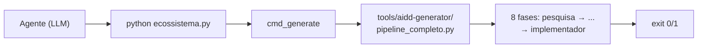

# Dia 4 — Skills, MCPs e tools: o que o agente sabe fazer

## Meta do dia

Conhecer as **três camadas de capacidade** do harness — tools, skills e MCPs — e mapear as **6 Ferramentas Integradas** que o `ecossistema-aidd` oferece para o agente executar de verdade (forja, geração, modularização, enterprise, operações e bridge).

## A ideia em uma frase

O modelo sabe conversar; as **tools** fazem ele agir no mundo; as **skills** ensinam um procedimento de memória; os **MCPs** conectam serviços externos — e um projeto maduro de engenharia agêntica distribui tudo isso de forma determinística.

## A explicação simples

Dia 1 apresentou as ferramentas como uma das 5 peças da cabine. Agora vamos distinguir três tipos que se confundem:

- **Tool**: uma função programática que o modelo pode invocar — ler arquivo, rodar comando, buscar na web. É a unidade básica de ação.
- **Skill**: um pacote de instruções e scripts que ensina ao agente *como fazer algo complexo e repetível* (um procedimento completo), carregado em contexto quando o tema aparece. Não é uma chamada pontual: é um "curso de procedimento" que fica disponível.
- **MCP (Model Context Protocol)**: um protocolo aberto que conecta o agente a serviços externos (bancos, APIs, ferramentas) de forma padronizada — como um barramento onde ferramentas de terceiros encaixam sem code integrado.

No `ecossistema-aidd`, a distinção é levada a sério: as skills vivem como diretórios versionados em `componentes/compartilhado/skills/` e são distribuídas para todos os harnesses pelo `gestor_componentes`; os MCPs de terceiros (ex.: o `code-review-graph`) são declarados e integrados sem código proprietário [1].

## As 6 Ferramentas Integradas

O coração do ecossistema são 6 ferramentas em `tools/`, cada uma com uma analogia no "mundo real" e um comando determinístico:

| Ferramenta | Papel | Analogia | Comando |
|---|---|---|---|
| `aidd-forge` | Bootstrap, governança e isolamento de ambiente | O chassi e as cercas | `forge init` |
| `aidd-generator` | Fábrica autônoma de software (8 fases) | A linha de montagem | `generate "sistema de delivery"` |
| `aidd-master` | Monolito modular, fatias verticais, SQLite WAL | Os blocos de Lego | `master add-module pedidos` |
| `aidd-enterprise` | Componentes SHA-256, zero-trust | O selo de auditoria | `enterprise inject` |
| `aidd-ops` | Sizing de VPS, Docker, hardening | A pista e o abastecimento | `ops plan "farmácia digital"` |
| `aidd-bridge` | Saída do no-code para VPS própria | O tradutor de código | `bridge scan` |

Cada ferramenta é invocada por `python ecossistema.py ferramenta argumentos` — o CLI unificado resolve o diretório, monta o `PYTHONPATH` e dispara o subprocesso. O agente não precisa saber o caminho físico de nada: a cabine resolve [2].

## O exemplo real: tools e skills no `ecossistema-aidd`

Veja o `ecossistema.py` na prática. Para chamar o Generator:

```python
def cmd_generate(args):
    gen_dir = os.path.join(TOOLS_DIR, "aidd-generator")
    pipeline_script = os.path.join(gen_dir, "scripts", "pipeline_completo.py")
    env = {"PYTHONPATH": gen_dir}
    cmd = [sys.executable, pipeline_script] + args
    return run_command(cmd, cwd=gen_dir, env=env)
```

Isso é uma **tool** canonica: o LLM chama `python ecossistema.py generate "sistema de delivery"` e o harness instancia o subprocesso com o ambiente certo. O resultado volta com exit code — e o fluxo decide (Dia 2) [3].



E as skills? Em `componentes/compartilhado/skills/` existem skills que ensinam o agente a orquestrar (ex.: `orca-plan-orchestrator`, com o protocolo completo de worktrees e terminal), a auditar planos (`planos-auditoria-runner`) e a operar cada ferramenta (`aidd-forge-runner`, `aidd-generator-runner` e afins). O comando `python ecossistema.py status` lista as skills universais e marca cada uma como `[OK]` ou `[AUSENTE]` [4].

O terceiro eixo — MCPs — aparece no `AGENTS.md`, seção 4: o `code-review-graph` deve ser consultado antes de qualquer varredura de arquivos. É um servidor MCP externo (rodando via `uvx`) que expõe queries de grafo de conhecimento, economizando contexto.

## Mão na massa

Abra o terminal na pasta `ecossistema-aidd` e faça:

1. Veja o status do ecossistema listando as 6 ferramentas, as skills universais e os slash commands:

   ```bash
   python ecossistema.py status
   ```

2. Liste as skills compartilhadas:

   ```bash
   ls componentes/compartilhado/skills/
   ```

3. Abra uma skill e veja sua estrutura (SKILL.md + scripts):

   ```bash
   ls componentes/compartilhado/skills/aidd-forge-runner/
   ```

4. Veja como o CLI resolve o caminho real de cada ferramenta no `ecossistema.py`:

   ```bash
   grep -n "def cmd_" ecossistema.py
   ```

5. Rode a ajuda com um comando de exemplo:

   ```bash
   python ecossistema.py help
   ```

## Três regras que ficam

1. Tool = ação pontual; skill = procedimento completo; MCP = integração de serviço externo — são camadas diferentes, não sinônimos.
2. Ferramentas determinísticas são chamadas pelo mesmo CLI unificado — o agente nunca precisa saber o caminho físico.
3. Skills se escrevem uma vez em `componentes/compartilhado/skills/` e se distribuem por sync para todos os harnesses.

## Erros de julgamento deste dia

- Tratar skill como simples tool e ficar sem o procedimento completo quando ele é necessário.
- Adicionar um MCP de terceiros sem registrar no `gestor_dependencias`, criando setup manual não reproduzível.
- Chamar o pipeline interno de uma ferramenta direto pelo caminho, em vez de usar o CLI unificado (perde governança e rastreabilidade).

## Checklist do dia

- [ ] Sei a diferença entre tool, skill e MCP com exemplos do ecossistema-aidd.
- [ ] Consigo listar as 6 Ferramentas Integradas e o propósito de cada uma.
- [ ] Rodei `python ecossistema.py status` e reconheci as linhas de ferramentas, skills e comandos.
- [ ] Entendi como `cmd_generate` (no `ecossistema.py`) resolve o subprocesso da ferramenta.
- [ ] Sei onde vivem as skills universais e como elas são distribuídas.

## Para saber mais

1. `ecossistema.py` — as funções `cmd_forge`, `cmd_generate`, `cmd_master`, `cmd_enterprise`, `cmd_ops`, `cmd_bridge` e `cmd_status`.
2. `AGENTS.md`, seção 4 — o papel do MCP `code-review-graph` na economia de contexto.
3. README — a seção "As 6 Ferramentas: Do Leigo ao PhD" com a tabela completa de analogias.
4. `componentes/compartilhado/skills/` — a coleção real de skills universais distribuíveis.

No Dia 5, vamos olhar o que cada chamada custa: a anatomia de um turno agêntico e por que um loop — mesmo simples — consome tokens a cada etapa.