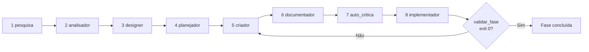

# Dia 5 — Turnos agênticos: anatomia de um loop e por que ele custa dinheiro

## Meta do dia

Entender o que é um **turno agêntico** — uma única iteração do loop "pensa, chama ferramenta, observa resultado" — e por que cada turno representa um gasto de tokens que se multiplica, usando o pipeline do `aidd-generator` (8 fases) como exemplo de loop complexo.

## A ideia em uma frase

Um agente não "conversa": ele executa um **loop** onde cada passo leva a uma ferramenta e ao resultado dela — e cada volta do loop cobra entrada (contexto) e saída (resposta) de tokens.

## A explicação simples

Quando você conversa com um agente de IA, a interface esconde um ciclo. A cada mensagem sua, o harness monta um pacote de contexto, envia ao modelo e recebe uma resposta; se essa resposta for uma chamada de ferramenta, o harness executa a ferramenta, devolve o resultado ao modelo e pede a próxima decisão. Isso é um turno.

Imagine pedir a um agente para "gerar um sistema de delivery para farmácias". O agente não escreve tudo numa resposta: ele decide "vou pesquisar", "vou analisar", "vou desenhar", "vou criar", e cada decisão gera um ciclo completo. Um único pedido do usuário pode virar **dezenas ou centenas de turnos** — e cada turno paga o envio do contexto inteiro de novo [1].

É por isso que a frase "o token é o combustível e o contexto é o tanque" resume a economia agêntica: cada volta consome mais do mesmo tanque — e o tanque não é infinito. O resumo que o harness mantém é a estimativa de capacidade da janela; a cada turno que adiciona conteúdo novo, suma conteúdo antigo ou comprime o histórico [2].

## O custo tem três dimensões

- **Custo de entrada**: os tokens de contexto reenviados a cada turno. É o maior de todos os — e cai com cache (Dia 6).
- **Custo de saída**: os tokens que o modelo gera por resposta. Quanto mais verboso o agente, maior.
- **Custo de retrabalho**: quando o fluxo falha e precisa repetir etapas. Um gate que falha no fim de um pipeline custa todos os turnos gastos até ali.

Reduzir custo não é só "usar modelo mais barato": é **não criar turnos desnecessários** e **não reenviar o que não mudou**.

## O exemplo real: o pipeline de 8 fases do `aidd-generator`

O `aidd-generator` é um loop agêntico declarado com 8 fases fixas: pesquisa, analisador, designer, planejador, criador, documentador, auto-crítica e implementador [3]. A cada transição entre fases, um gate de validação exige `exit 0` — senão a progressão é bloqueada.



Repare em dois detalhes de economia que o ecossistema aplica ao próprio loop:

1. **Estado em JSON, não em conversa.** O `PLANO-EXECUCAO-ESTRUTURADO.json` na raiz é a persistência canônica do pipeline (a "fonte da verdade"). O `AGENTS.md` do generator é explícito: o agente lê o JSON de estado (~5k tokens) em vez de reconstituir o histórico conversacional — que cresceria muito mais e repetiria tudo a cada turno [3].
2. **Detalhes fora do contexto.** Cada fase tem scripts próprios (`scripts/executar_fase.py --fase N`, `scripts/validar_fase.py --fase N`); o agente não carrega todos os scripts no contexto — ele chama a ferramenta certa na fase certa, com o resultado voltando pelo fluxo.

Esse desenho é o antibiótico do "loop caro": o agente mantém o contexto curto (só o estado), chama subprocessos determinísticos (que não gastam token de saída LLM) e só o raciocínio que sobra custa.

## Mão na massa

Abra o terminal na pasta `ecossistema-aidd` e faça:

1. Veja as 8 fases declaradas na governança:

   ```bash
   grep -n "Phase" tools/aidd-generator/AGENTS.md
   ```

2. Veja a persistência do estado:

   ```bash
   head -20 PLANO-EXECUCAO-ESTRUTURADO.json
   ```

3. Liste os scripts de fase do generator:

   ```bash
   ls tools/aidd-generator/scripts/
   ```

4. Rode a entrada do ciclo de geração em modo seco apenas para ver como ele se comporta:

   ```bash
   python ecossistema.py generate --help 2>/dev/null | tail -10
   ```

5. Observe o mapeamento no `ecossistema.py`: a função `cmd_generate` resolve o `pipeline_completo.py` — um subprocesso, não um LLM:

   ```bash
   grep -n "pipeline_completo" ecossistema.py
   ```

## Três regras que ficam

1. Um pedido simples ao agente vira muitos turnos — cada um paga contexto + saída.
2. Estado em arquivo/JSON em vez de histórico conversacional corta a repetição de contexto a cada turno.
3. Tarefa mecânica como subprocesso determinístico custa zero token de LLM.

## Erros de julgamento deste dia

- Deixar o agente "relembrar" o passado pelo chat quando a fonte da verdade vive em um JSON de estado.
- Acoplar todos os scripts no contexto quando bastaria chamá-los por subprocesso na fase certa.
- Medir custo só pelo modelo escolhido e ignorar o número de turnos — que domina a conta final.

## Checklist do dia

- [ ] Sei explicar o que é um turno agêntico e onde ele acontece.
- [ ] Conheço as três dimensões de custo (entrada, saída, retrabalho).
- [ ] Entendi as 8 fases do `aidd-generator` e como o gate `exit 0` trava o avanço.
- [ ] Sei por que o estado em JSON (~5k tokens) substitui o histórico conversacional.
- [ ] Identifiquei no `ecossistema.py` a chamada que dispara o pipeline como subprocesso.

## Para saber mais

1. `tools/aidd-generator/AGENTS.md` — as 8 fases, os gates mecânicos e a persistência em JSON.
2. `ecossistema.py` — função `cmd_generate` e a resolução do `pipeline_completo.py`.
3. README — a tabela "As 6 Ferramentas", linha do AIDD Generator (linha de montagem).
4. "Iterative Loop" em documentação de agentes (platform.openai.com/docs) — a mecânica padrão de turnos e tool calls.

No Dia 6, vamos atacar o maior custo de todos os: o reenvio do contexto — e a ferramenta que o transforma em desconto: o cache.