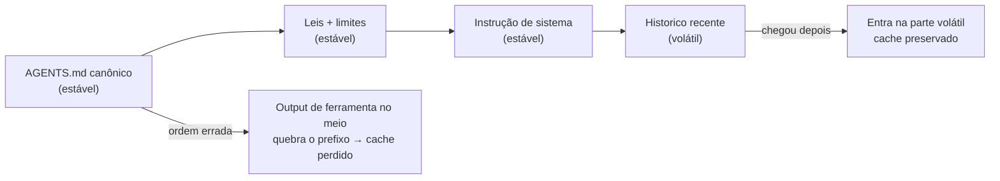

# Dia 6 — Cache hit: prompt caching e a ordem das partes

## Meta do dia

Entender como o **prompt caching** corta o custo de entrada em quase 90% nas chamadas repetidas — e como a *ordem estável* das partes do contexto determina se você acerta o cache ou não.

## A ideia em uma frase

Se o contexto é o tanque (Dia 5), o cache é o combustível que você já pagou: a parte do contexto que não mudou entre turnos é recomprada por uma fração do preço — desde que ela esteja sempre no mesmo lugar.

## A explicação simples

Quando o agente chama o modelo na segunda vez, no terceiro turno, no quinto, ele reenvia quase tudo que já enviou: instrução persistente (AGENTS.md), histórico, e a cada novo passo um pouco mais. Reenviar verbatim desse contexto inteiro seria pagar a entrada completa a cada vez.

O prompt caching resolve isso com um truque de engenharia: **a plataforma memoiza prefixos do prompt por um tempo**. Se você reenviar os mesmos tokens no mesmo prefixo (a partir do índice 0 até o ponto de `cache_control`), a cobrança na reutilização cai para uma fração do preço da entrada total — tipicamente 10% do custo de input normal, ou menos, dependendo do provedor [1].

Repare na condição crítica: ele não é um "cache de conteúdo têmico". É um cache de **prefixo textual exato**. O fornecedor guarda o prefixo como apareceu na última chamada; se na chamada seguinte aquele trecho reaparecer intacto, no mesmo lugar, você paga barato. Se qualquer caractere mudar no meio, o prefixo quebra e o cache inteiro é perdido [2].

## A regra de ouro que muda tudo

A otimização número 1 de custo não é trocar de modelo — é **ordenar o contexto do mais estável para o mais volátil**:

1. **Mais estável primeiro**: instrução de sistema, AGENTS.md, docs de referência que não mudam, exemplos fixos.
2. **Estabilidade média**: porções de conhecimento que variam raramente (manual de uma lib).
3. **Mais volátil por último**: mensagens do usuário, saídas de ferramentas, histórico recente.

Se você colocar uma saída de ferramenta gigante *antes* de um bloco estável (ou pior, intercalar blocos instáveis no meio do prefixo estável), tudo que está depois dela reenche sem cache. Dezenas de milhares de tokens passam a ser cobrados a preço cheio em cada turno subsequente. Um único item deslocado pode anular a economia de cada o pipeline [3].

## O exemplo real: como o `ecossistema-aidd` governa o prefixo

O `AGENTS.md` do ecossistema é **explícito sobre o custo de contexto** — a própria governança declara "Context Optimization <2000 tokens" como padrão. E o efeito prático é visível na arquitetura:

- A instrução canônica é curta por design (o tronco com leis, não a folhagem completa). Prefixo estável enxuto = cache barato e robusto.
- Os detalhes ficam **fora do prefixo**: em `tools/*/AGENTS.md`, `docs/protocolos/`, `componentes/`. O agente busca sob demanda — e essas buscas de arquivos novos entram *depois*, na parte volátil, sem quebrar o prefixo.
- O `core/context_slicer.py` extrai apenas os símbolos relevantes de um arquivo (AST), em vez de injetar o arquivo inteiro. Menos tokens mutáveis no prefixo = mais do contexto cabendo na região cacheável.



A regra prática que o ecossistema demonstra: **nunca injetar bloco instável no meio de bloco estável**; buscar conhecimento sob demanda (que é volátil e fica no fim) e manter a governança canônica fixa no início [4].

## Mão na massa

Abra o terminal na pasta `ecossistema-aidd` e observe o quanto o projeto protege o prefixo:

1. Meça o tamanho real do AGENTS.md canônico:

   ```bash
   wc -c AGENTS.md
   ```

2. Contraste com a folhagem — veja como a referência completa existe fora do prefixo:

   ```bash
   wc -c docs/protocolos/AGENTS-REFERENCIA-COMPLETA.md
   ```

3. Explore o `context_slicer` que extrai contexto em vez de injetar arquivo inteiro:

   ```bash
   grep -n "class \|def " core/context_slicer.py | head -20
   ```

4. Rode o auditor de integridade (não é um teste de cache, mas mostra o momento em que o contexto é puxado de volta):

   ```bash
   python ecossistema.py audit 2>&1 | tail -15
   ```

5. No código do `context_slicer.py`, localize onde o JSON de payload é compactado (os limites de token por extração).

## Três regras que ficam

1. Cache de prompt é cache de **prefixo exato**: o texto do prefixo precisa ser idêntico a cada chamada, no mesmo lugar.
2. Ordene o contexto do estável para o volátil; qualquer bloco instável no meio do prefixo quebra o cache inteiro.
3. Governança curta no início + busca sob demanda no fim = o desenho que maximiza cache hit.

## Erros de julgamento deste dia

- Achar que "o cache é automático" e intercalar saídas de ferramentas dentro das instruções fixas do projeto.
- Rodar a tudo com prefixo gigante e mutável "para garantir contexto", pagando preço cheio em cada turno.
- Colocar o arquivo de instrução reescrito a cada sessão (regras dinâmicas demais) na frente do prefixo — instabilidade infinita.

## Checklist do dia

- [ ] Sei explicar o que é cache de prefixo e quando ele melhora o custo.
- [ ] Identifico o que é estável e o que é volátil num contexto de agente.
- [ ] Entendo a relação entre a ordem das partes e a possibilidade de cache hit.
- [ ] Medei o tamanho do AGENTS.md canônico versus a referência completa no ecossistema-aidd.
- [ ] Sei qual é a regra prática para não quebrar o prefixo cacheável.

## Para saber mais

1. Documentação de prompt caching da API da Anthropic (docs.anthropic.com/en/docs/build-with-claude/prompt-caching) — como prefixos são cacheados e cobrados.
2. Análise do custo de contexto no "Builder patterns" da documentação de agentes (platform.openai.com) — a taxonomia de contexto estável/volátil.
3. `AGENTS.md` do ecossistema-aidd — a meta explícita "Context Optimization <2000 tokens".
4. `core/context_slicer.py` — extração por AST que mantém o prefixo enxuto e estável.

No Dia 7, vamos abrir a caixa de ferramentas da economia: as configurações reais que reduzem tokens por turno — com as que existem no ecossistema-aidd.