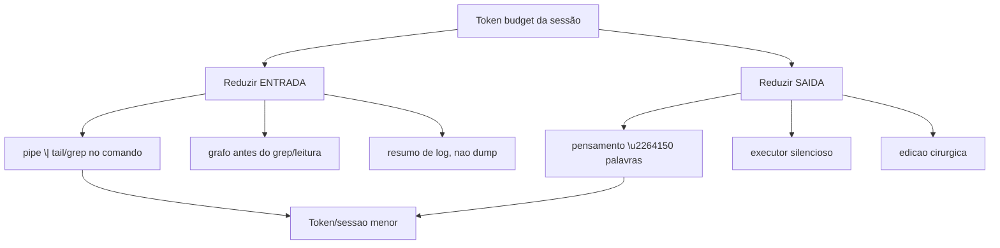

# Dia 7 — Economia severa de tokens: as configurações reais

## Meta do dia

Aplicar a **economia severa de tokens** — a Lei 4 do ecossistema-aidd — conhecendo as configurações e hábitos reais que reduzem o gasto por turno: pensamento compacto, comandos filtrados, edição cirúrgica e zero verbosidade em logs.

## A ideia em uma frase

Economia de tokens não é usar modelo barato — é **forçar, por configuração e por hábito, que o agente escreva menos, leia menos e filtre mais** sem perder correção.

## A explicação simples

O custo de uma sessão agêntica é dominado por tokens — e a assimetria fundamental é que **o contexto de entrada cresce mais rápido do que a resposta**. Cada turno reenvia o prefixo (Dia 6) e adiciona histórico; se o agente responde com um parágrafo de texto a cada ferramenta, a saída multiplica, o retorno para o próximo turno multiplica de novo, e a sessão inteira vira uma bola de neve.

A economia severa ataca pelos dois lados:

- **Reduzir saída**: instruir o agente a responder em modo telegráfico (3-5 pontos, sem preâmbulos).
- **Reduzir entrada**: nunca ler arquivos inteiros para "contexto"; filtrar com pipe, consultar grafo de conhecimento primeiro, e usar resumos de log em vez de dumps.

Isso aparece como regra *global* no ecossistema-aidd — Lei 4: "Extreme Token Economy". E não fica no discurso: vira padrão de comportamento na seção "Core Execution Constraints" do AGENTS.md, com comandos práticos [1].

## As configurações reais que cortam custo

O ecossistema-aidd observa e recomenda um conjunto de práticas que funcionam em qualquer harness:

1. **Pensamento compacto**: limitar o raciocínio do agente a ~150 palavras (um parágrafo), proibindo rascunhos intermináveis antes de agir. Menos saída, menos contexto no próximo turno.
2. **Executor silencioso**: o agente faz a tarefa e anuncia só o resultado — sem narrar o que "está pensando em fazer". A narração é taxa de saída paga sem valor.
3. **Pipe em comandos verbosos**: nunca capturar 500 linhas de log. Sempre `comando 2>&1 | tail -n 25` ou `| grep padrão` — cortando a entrada de ferramenta que polui o contexto [2].
4. **Grafo antes de varredura**: consultar o MCP `code-review-graph` (buscas por grafo de conhecimento) antes de Grep/Glob/leitura integral — um único resultado dirigido vale mais do que a varredura inteira [3].
5. **Edição por busca/substituição exata**: preferir `replace_file_content`/edições pontuais em arquivos pequenos a "sobrescrever" o arquivo inteiro — evitando respostas grandes e diffs gigantes que reentram no contexto.



## O exemplo real: as regras de economia no `AGENTS.md`

Abra o `AGENTS.md` do `ecossistema-aidd` e leia a seção de restrições de execução. O que você encontra é uma lista de comandos para o agente:

- `pensar compacto` — resolver em 3 a 5 passos discretos de raciocínio;
- `fornecer saída silenciosa do executor` — ação primeiro, texto curto depois;
- `fazer pipe de comandos que produzem muito log` — `pytest 2>&1 | tail -n 25`, `ls ... | grep ...` sem imprimir tudo;
- `substituição exata e buscas dirigidas` — edição por `Buscar + Substituir` em trechos pequenos;
- `consultar o code-review-graph` **antes** de qualquer busca de arquivo.

Cada linha da governança mapeia direto para uma redução de tokens de entrada ou de saída. Repare também que o próprio padrão de governança declara o teto: "<2000 tokens" — o projeto limita o prefixo canônico para caber barato no cache (Dia 6) [4].

Se o seu harness não tiver um `AGENTS.md` com essas regras, é isso que você está configurando hoje: o arquivo de instrução É a configuração-da-economia do agente.

## Mão na massa

Para sentir a diferença, rode o mesmo comando com e sem o filtro — e observe quanto do resultado você realmente precisa:

1. Sem filtro (dump completo):

   ```bash
   python ecossistema.py status
   ```

2. Com filtro (só o que interessa — as 6 ferramentas):

   ```bash
   python ecossistema.py status 2>/dev/null | grep -i -E "forge|generator|master|enterprise|ops|bridge"
   ```

3. Com resumo de log:

   ```bash
   python ecossistema.py audit 2>&1 | tail -n 12
   ```

4. Abra o AGENTS.md e sublinhe as 4 regras de "core execution constraints" que são economia pura:

   ```bash
   grep -n "pipe\|tail\|silent\|compact\|search" AGENTS.md | head -25
   ```

5. Medindo o custo escondido: conte quantas linhas o `status` completo gerou versus a versão filtrada:

   ```bash
   python ecossistema.py status | wc -l
   ```

## Três regras que ficam

1. Corte a saída e a entrada ao mesmo tempo: pensamento compacto + pipe em comandos verbosos.
2. A governança do projeto (AGENTS.md) é onde a economia vira regra para o agente.
3. Prefira um resultado dirigido (grafo, grep fino) a uma varredura inteira que infla o contexto.

## Erros de julgamento deste dia

- Deixar o agente "narrar o plano" antes de cada ação — narrativa é saída paga sem entrega.
- Capturar dumps completos de comandos verbosos "para garantir contexto" — e pagar por isso em cada turno seguinte.
- Tornar a economia uma preferência de estilo, e não uma linha da governança.

## Checklist do dia

- [ ] Sei listar as 4 práticas de "core execution constraints" do AGENTS.md.
- [ ] Consegui rodar o mesmo comando com e sem filtro e vi a diferença de saída.
- [ ] Entendo por que pensamento compacto ≠ perder rigor técnico.
- [ ] Sei o papel do `code-review-graph` na economia de entrada.
- [ ] Apliquei a regra do pipe pelo menos uma vez no terminal hoje.

## Para saber mais

1. `AGENTS.md` do ecossistema-aidd — "Core Execution Constraints" e "Inviolable Laws", Lei 4.
2. `core/context_slicer.py` — a leitura por símbolos que reduz a entrada por arquivo.
3. MCP `code-review-graph` (github.com/tirth8205/code-review-graph) — a fonte do grafo de conhecimento consultado antes das leituras.
4. `docs/protocolos/AGENTS-REFERENCIA-COMPLETA.md` — a governança expandida, com as melhores práticas de contexto.

No Dia 8, vamos além das regras de bolso: a otimização de contexto em si — selecionar, comprimir e isolar o que entra na janela.