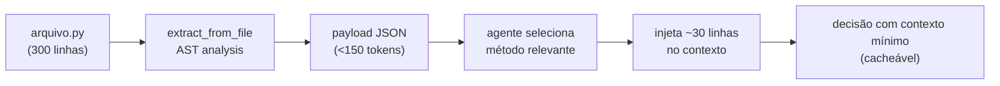

# Dia 8 — Otimização de contexto: selecionar, comprimir, isolar

## Meta do dia

Entender o mecanismo **DynamicContextSlicer** — como o `ecossistema-aidd` seleciona por AST, comprime via payload JSON (<150 tokens) e isola via Context-Purge, garantindo que o contexto fique pequeno, estruturado e não contaminado entre sessões.

## A ideia em uma frase

Otimizar contexto não é só "ler menos" — é **transformar a leitura em um payload mínimo, estruturado e não contaminado**, de modo que o agente receba apenas o suficiente para decidir.

## A explicação simples

Até aqui vimos por que o contexto é escasso (Dia 5), como o cache o transforma em desconto (Dia 6) e quais regras cortam tokens no dia a dia (Dia 7). Agora vamos ao mecanismo que implementa esses princípios como código: o `DynamicContextSlicer`, módulo central do `core/context_slicer.py` do ecossistema.

Três conceitos compõem a otimização: **selecionar** (o que entrar), **comprimir** (em quanto), **isolar** (de quem).

**Selecionar: extração por AST.** Em vez de injetar um arquivo inteiro de 200 linhas, o slicer analisa a árvore sintática abstrata (AST) do Python e extrai só as assinaturas de classes e funções. Resultado: um map que diz "classe X está na linha 45, função Y está na linha 89". Com isso o agente navega o mapa e pede o trecho que importa — em vez de carregar tudo no prefixo [1].

**Comprimir: payload JSON <150 tokens.** A saída do slicer não é um trecho textual: é um dicionário compacto serializado em JSON. As regras de extração são rígidas: label da classe, label do método, nome do arquivo, linha. Se o payload exceder 150 tokens, é truncado [2]. Isso garante que a **chamada de ferramenta** que devolve o contexto não gaste mais do que a janela permite.

**Isolar: Context-Purge Isolation.** Cada ferramenta que roda como subprocesso recebe um contexto que morre com ela. Não há contaminção entre frentes de trabalho: o resultado volta para o agente e o restante é descartado. O `aidd-forge` formaliza isso como uma de suas leis de determinismo ambiental [3].

## O exemplo real: o slice em ação

Imagine que o agente precisa entender a classe `AIDDGeneratorPipeline` em `tools/aidd-generator/aidd_generator/pipeline.py`. Sem otimização, ele leria o arquivo inteiro — possivelmente 300 linhas no contexto. Com o slicer:

1. O agente pede `get_minimal_context("pipeline.py")`.
2. O slicer dispara `extract_from_file("pipeline.py")`, analisa o AST e devolve o mapa de assinaturas.
3. O payload: `{"classe": "AIDDGeneratorPipeline", "linha": 45, "metodos": [...]}` — 120 tokens.
4. O agente lê só o método que importa — com `search_symbols` — e injeta 30 linhas no contexto, em vez de 300 [1].

A economia é significativa, mas o benefício maior é a **predição**: o payload JSON é determinístico. Não importa quem ou quando chama — o mesmo arquivo sempre devolve o mesmo payload mínimo. Isso transforma contexto em algo auditável e cacheável (Dia 6).



## O Ledger: estado persistente sem pesar

Junto ao slicer, o `core/cognitive_ledger.py` implementa um **Cognitive Session Ledger** — um banco SQLite WAL persistente (`.aidd/cognitive_ledger.db`) que registra eventos de contexto, decisões e resultados de forma imutável [4].

O ledger resolve o problema de "quanto contexto usar": em vez de perguntar "o que aconteceu na última sessão?", o agente consulta a tabela de eventos do ledger (consulta barata, contexto mínimo). O estado persiste entre sessões, mas o prefixo do prompt não carrega o histórico conversacional inteiro — carrega só o estado derivado, que é muito menor.

A combinação slicer + ledger é o antibiótico completo: o slicer minimiza *cada leitura* e o ledger minimiza *a necessidade de ler o passado*. Contexto mínimo, estruturado, não contaminado.

## Mão na massa

Abra o terminal na pasta `ecossistema-aidd`:

1. Veja a estrutura do slicer — onde ele extrai classes e funções:

   ```bash
   grep -n "class \|def \|def _" core/context_slicer.py | head -30
   ```

2. Localize o payload JSON compacto e o limite de 150 tokens:

   ```bash
   grep -n "token\|payload\|compact" core/context_slicer.py
   ```

3. Veja a estrutura do ledger:

   ```bash
   grep -n "cognitive_events\|CREATE TABLE\|session_id" core/cognitive_ledger.py | head -20
   ```

4. Observe o diretório `.aidd/` — lá mora o ledger:

   ```bash
   ls -la .aidd/ 2>/dev/null || echo "Pasta .aidd ainda não existe (será criada na primeira sessão)"
   ```

5. Rode o auditor e veja que ele valida arquivos do core (slicer + ledger incluídos):

   ```bash
   python ecossistema.py audit 2>&1 | grep -i "core\|cognitive\|slicer"
   ```

## Três regras que ficam

1. Selecione por AST (o que), comprima em JSON mínimo (quanto), isole por subprocesso (de quem) — o trio da otimização de contexto.
2. O payload determinístico (mesmo arquivo → mesmo JSON) transforma contexto em algo auditável e cacheável.
3. Ledger persistente substitui o histórico conversacional completo — estado pequeno em vez de conversa grande.

## Erros de julgamento deste dia

- Injetar um arquivo inteiro no contexto "para não perder nada" — o payload AST são 150 tokens contra 6 mil.
- Carregar o histórico de sessões anteriores como mensagens quando o ledger já traz o estado derivado.
- Confundir Context-Purge com "apagar dados": ele isola, não destrói — o ledger preserva, mas o contexto transitório morre.

## Checklist do dia

- [ ] Sei o que o DynamicContextSlicer faz e por que AST é melhor do que regex para extração.
- [ ] Entendo o limite de 150 tokens por payload e o que acontece quando ele é atingido.
- [ ] Consigo explicar Context-Purge Isolation no ecossistema.
- [ ] Localizei o cognitive_ledger.py e entendi que ele é SQLite WAL.
- [ ] Sei a diferença entre "estado persistente" e "histórico conversacional".

## Para saber mais

1. `core/context_slicer.py` — `extract_from_file`, `get_minimal_context`, `search_symbols`, o JSON de payload e o limite de tokens.
2. `core/cognitive_ledger.py` — `CognitiveSessionLedger`, tabela `cognitive_events`, WAL no `.aidd/`.
3. `AGENTS.md` do ecossistema-aidd — "Extreme Token Economy" (Lei 4) e "Graph-first" (Lei: consultar MCP antes de grep/leitura).
4. Seção "Context-Purge Isolation" em `tools/aidd-forge/AGENTS.md` — como o forge isola cada execução ambiental.

No Dia 9, vamos fechar a bancada: os scripts e gates de qualidade — o determinismo que sustenta a esteira inteira.