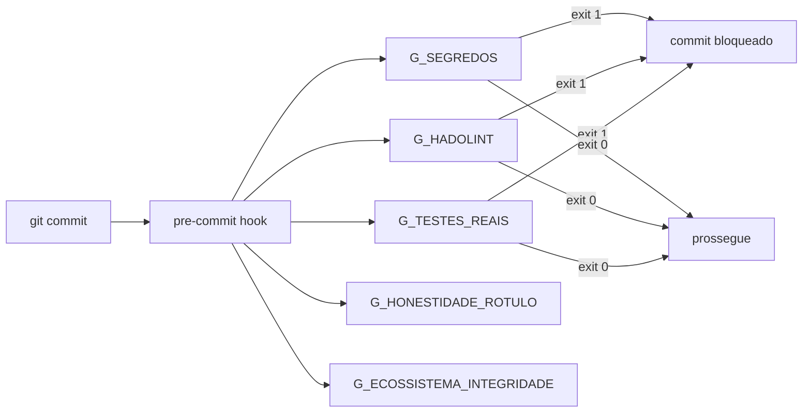

# Dia 9 — Scripts e gates: o determinismo que sustenta a esteira

## Meta do dia

Mapear os **12 Quality Gates** do `ecossistema-aidd` em `gates/`, entender a estrutura de um gate (duplo-boost, allowlists, exit 0/1) e como o comando `python ecossistema.py audit` encadeia tudo com o framework pre-commit.

## A ideia em uma frase

Se o modelo é o piloto e os gates são os limitadores de velocidade, o audit é a inspeção periódica: nem sempre gosta de rodar, mas é ele que garante que o carro não vai parar no meio da estrada.

## A explicação simples

Na Dia 2 conhecemos a lei binária: exit 0 passa, exit 1 bloqueia. Agora vamos ao inventário completo e ao mecanismo de funcionamento.

O `ecossistema-aidd` mantém em `gates/` um conjunto de arquivos `G_*.py` — cada um é um programa Python que roda de forma determinística (Dia 2) e avalia **uma dimensão** de qualidade do repositório. Eles são declarados no `ecossistema.py` com a tupla `(_GATES_AUDIT, ...)` [1] e indexados pela lista `GATES_INFO` (dicionário com nome, descrição e função).

O comando central:

```bash
python ecossistema.py audit
```

...delega para o `pre-commit run --all-files` (framework de hooks git) — os mesmos gates são listados em `.pre-commit-config.yaml` e integrados ao ciclo de vida de commits. O resultado volta como exit code consolidado: zero = tudo aprovado, um ou mais = falha [2].

## A anatomia de um gate

cada gate no ecossistema tem uma estrutura padrão que vale a pena memorizar:

```python
def main():
    # 1. Load allowlists (se existir)
    # 2. Run checks (AST, regex, OS commands)
    # 3. Validate results against allowlist
    # 4. Return 0 (pass) or 1 (fail)
```

Detalhes essenciais:

- **Permit-listas (`allowlist_*.json`)**: são arquivos JSON que listam exceções conhecidas, revisadas por humano. O gate não desliga — ele tem um catálogo de "o que é exceção aceitável". Isso garante rastreabilidade: se algo foi dispensado, está documentado [3].
- **Duplo-boost**: não existe — o nome não aparece no código. O padrão real é: gates que dependem de ferramentas externas (Hadolint, por exemplo) rodam como subprocessos; se a ferramenta não está instalada, o gate retorna exit 1 com mensagem explicativa.
- **`_GATES_AUDIT`**: a lista consolidada no `ecossistema.py`; não é a única — cada ferramenta pode ter seus gates internos (o forge tem 7).

## Os 12+ Portões de Segurança

A tabela de gates no README do projeto é o mapa completo. Aqui estão os mais importantes, agrupados por tipo de verificação:

**Integridade do repositório:**
- `G_ECOSSISTEMA_INTEGRIDADE` — estrutura de diretórios e presença de arquivos essenciais
- `G_ARQUITETURA_DELIVERABLE` — coerência arquitetural do código gerado

**Segurança:**
- `G_SEGREDOS` — detecção de API keys, senhas, tokens expostos
- `G_HADOLINT` — linting de Dockerfiles
- `G_SAST` — análisis estático de segurança

**Qualidade:**
- `G_TESTES_REAIS` — testes unitários e de integração que realmente rodam
- `G_COBERTURA` — cobertura mínima de testes
- `G_HONESTIDADE_ROTULO` — label de cobertura reflete testes reais (Lei 8)

**Governança:**
- `G_CLI_HELP_CONSISTENCIA` — help dos comandos é consistente
- `G_ORFAOS` — arquivos órfãos sem referência
- `G_DRIFT_NUCLEO_COMPARTILHADO` — componentes compartilhados estão sincronizados



## O exemplo real: estrutura de um gate no `ecossistema-aidd`

Cada gate tem um `main()` com uma lógica simples e determinística. O `G_HONESTIDADE_ROTULO` é o mais didático — ele verifica se o rótulo declarado no `README` reflete o que os testes realmente cobrem, alinhado à Lei 8: nunca declarar mais do que se prova [4].

O `G_SEGREDOS` vai além: ele varre o repositório com regex e verifica que nenhuma chave ou token está exposta. Se encontrar um arquivo commitado com segredo, o gate retorna exit 1 e o commit é bloqueado.

Cada um desses gates é pequeno (20-60 linhas), determinístico e sem dependência do LLM. É programação pura — e é por isso que funciona como política.

## Mão na massa

Abra o terminal na pasta `ecossistema-aidd`:

1. Liste todos os gates:

   ```bash
   ls gates/ | grep "^G_"
   ```

2. Conte quantos gates existem:

   ```bash
   ls gates/G_*.py | wc -l
   ```

3. Rode um gate individual e veja o exit code:

   ```bash
   python gates/G_HONESTIDADE_ROTULO.py > /dev/null; echo "exit=$?"
   ```

4. Leia o topo do `G_ECOSSISTEMA_INTEGRIDADE.py` e identifique o padrão: allowlist + check + exit.

5. Veja o pre-commit hook declarado:

   ```bash
   grep -n "_GATES_AUDIT" ecossistema.py
   ```

## Três regras que ficam

1. Cada gate é um programa pequeno, determinístico, sem LLM — é uma verificação de código puro.
2. Allowlistings (exceções) são revistadas por humano e versionadas — não são desligamentos.
3. O audit (pre-commit) é a inspeção periódica que garante que todos os gates rodam antes do commit.

## Erros de julgamento deste dia

- Desligar um gate que falha em vez de registrar a exceção em allowlist (perde rastreabilidade).
- Rodar o audit manualmente e esquecer que ele já deve estar integrado ao pre-commit.
- Achar que "ter testes" é suficiente sem o gate `G_TESTES_REAIS` que prova que eles rodam.

## Checklist do dia

- [ ] Consigo listar pelo menos 5 dos 12+ gates por nome.
- [ ] Entendi o padrão de estrutura de um gate (allowlist + check + exit code).
- [ ] Sei como o `python ecossistema.py audit` delega para o pre-commit.
- [ ] Compreendo o papel de `G_HONESTIDADE_ROTULO` e por que ele é a Lei 8 em código.
- [ ] Localizei as allowlists em `gates/allowlist_*`.

## Para saber mais

1. `ecossistema.py` — função `_GATES_AUDIT` e `cmd_audit` com a lista consolidada.
2. README — seção "Os 12 Portões de Segurança" com a tabela completa.
3. `gates/G_HONESTIDADE_ROTULO.py` — o gate mais didático (Lei 8 em código).
4. `gates/allowlist_*` — as exceções versionadas e rastreáveis.

No Dia 10, vamos olhar o que acontece antes do audit: os **hooks** — camadas que interceptam o agente e impõem regras sem que o LLM peça.