# Engenharia Agêntica — Versão Iniciante

## Do zero ao agente em produção: 16 dias de jornada

**v1.0 · 2026**

**Publico-alvo:** nivel iniciante  
**Extensao:** formato GG

Obra composta por tres partes e doze capitulos, organizados pelo framework pedagogico EITA-V2 (Introducao, Explica, Ilustra, Tecnica, Aplica, Conclusao e Referencias).

# Prefácio

# Como Este Livro Foi Escrito: A Metodologia EITA

Todo capítulo deste livro segue a metodologia **EITA** — um framework pedagógico de 7 seções projetado para transformar o leitor de "não sei" para "consigo fazer" em cada tema abordado.

## As 7 Seções do EITA

### 1. INTRODUÇÃO
Contextualiza o tema. Explica o que será abordado, por que importa, e o que você será capaz ao final. Uma ponte conecta com o capítulo anterior (quando houver).

### 2. EXPLICA
Desconstrói o conceito: causa raiz, mecânica subjacente, definições precisas. Você passa de "não sei o que é" para "sei definir e explicar".

### 3. ILUSTRA
Uma analogia concreta ancora o conceito na sua intuição — sempre acompanhada de um diagrama visual que torna o abstrato tangível. Você passa de "parece abstrato" para "faz sentido".

### 4. TÉCNICA
O núcleo de valor: artefatos práticos — código executável, configurações reais, arquiteturas, passo a passo de implementação ou operação. O formato segue o `estilo_tecnica` da obra (código, híbrido ou operacional). É aqui você ganha as mãos para fazer. Você passa de "não sei fazer" para "consigo implementar".

### 5. APLICA
Contextualização em cenário real: onde aquilo se aplica no mercado, armadilhas comuns e como evitá-las. Você passa de "isso é teórico" para "vou usar no trabalho".

### 6. CONCLUSÃO
Síntese dos 3 pontos principais, conexão com o próximo capítulo e um desafio opcional para fixar o aprendizado.

### 7. REFERÊNCIAS BIBLIOGRÁFICAS
Fontes citadas no capítulo, em formato ABNT numerado. Toda afirmação factual tem sua referência.

## Por Que Funciona

O EITA não é uma lista de tópicos — é uma **jornada de transformação**. Cada seção leva o leitor a um estado mental diferente:

```
Introdução → "Quero aprender"
Explica     → "Entendi a teoria"
Ilustra     → "Faz sentido na prática"
Técnica     → "Consigo fazer"
Aplica      → "Vou usar no trabalho"
Conclusão   → "Dominei este tema"
```

## Diagrama do Fluxo EITA


## Dica de Leitura

Você pode ler os capítulos em ordem (recomendado para iniciantes) ou pular diretamente para o tema de interesse. Cada capítulo é autocontido, mas a sequência cria conexões que ampliam o aprendizado.


*A metodologia EITA é uma criação da Fábrica Agêntica de Livros, projetada para produzir literatura técnica que transforma leitores em profissionais.*

# Sumário Geral da Obra

**Parte I — O Terreno — o que é um agente, de verdade**

- Dia 1: O agente não é o modelo: anatomia de um harness
- Dia 2: Probabilismo e determinismo: onde cada um manda
- Dia 3: O arquivo que todo agente lê: AGENTS.md, config.json e rules
- Dia 4: Skills, MCPs e tools: o que o agente sabe fazer

**Parte II — A Bancada — configurando o que realmente custa dinheiro**

- Dia 5: Turnos agênticos: anatomia de um loop e por que ele custa dinheiro
- Dia 6: Cache hit: prompt caching e a ordem das partes
- Dia 7: Economia severa de tokens: as configurações reais
- Dia 8: Otimização de contexto: selecionar, comprimir, isolar

**Parte III — A Linha de Montagem — escala, scripts e frota**

- Dia 9: Scripts e gates: o determinismo que sustenta a esteira
- Dia 10: Hooks: a camada que intercepta o agente
- Dia 11: Agents e subagentes: delegação com contexto isolado
- Dia 12: Orquestração: worktrees, paralelismo e o ambiente de agentes

**Parte IV — O Ofício — decisões de arquiteto**

- Dia 13: Roteamento inteligente de LLM: o modelo certo por turno
- Dia 14: Configurações que nunca te contam
- Dia 15: Os segredos universais aplicáveis a qualquer harness
- Dia 16: Arquitetura para desenvolvimento com IA: o sistema que constrói sistemas

**Conclusão Geral**

# Parte I — O Terreno — o que é um agente, de verdade

# Dia 1 — O agente não é o modelo

## Meta do dia

Identificar as **5 peças da cabine** (o harness) que existem em volta de um modelo de IA dentro de um projeto real — e localizar cada uma delas no repositório `ecossistema-aidd`.

## A ideia em uma frase

O modelo de IA é só o motor; a qualidade do seu resultado depende da **cabine** que você constrói em volta dele — e a cabine é feita de arquivos e configurações que você *controla*.

## A explicação simples

Quando alguém diz "uso a IA para programar", a frase esconde o essencial. O modelo de linguagem (LLM) é, literalmente, uma função: recebe texto e devolve texto. Ele não lembra de nada entre uma chamada e outra, não sabe qual pasta é o seu projeto e não conhece as suas regras. a impressão de que ele "entende e continua de onde parou" é reconstruída a cada vez, reenviando o histórico anterior na entrada.

Então o que você realmente usa no dia a dia — a coisa que lê seus arquivos, roda seus testes e respeita suas regras — não é o modelo. É uma camada de software construída em volta dele. Essa camada tem um nome: **harness** [1].

Pense em um avião: o piloto é o modelo — potente, esperto, capaz de improvisar. A cabine é o harness — painel, checklists, alarmes, piloto automático. Ninguém entrega um avião a um piloto sem cabine; ninguém deveria entregar um projeto a um modelo sem harness. Voar bem não é "pilotar melhor" — é ter uma cabine melhor [2].

## As 5 peças da cabine

cada harness que funciona bem tem estas 5 peças:

**1. Instrução persistente.** É o texto que define papel, limites e regras do agente. Ele é reinjetado a cada turno — por isso se chama persistente. Mora em arquivos de projeto como `AGENTS.md`, em arquivos de regras como `CLAUDE.md`, ou no prompt de sistema.

**2. Ferramentas.** São funções que o modelo pode chamar: ler um arquivo, editar, rodar um comando, buscar na web, consultar um banco. Sem ferramentas, o agente só conversa; com ferramentas, ele age no mundo.

**3. Contexto.** É o recorte do mundo colocado na janela a cada turno: trechos de código, saídas de comando, resultados de busca. É o recurso mais escasso do sistema — e o mais mal gerenciado.

**4. Estado.** É o que ele lembra fora da conversa: arquivos de tarefa, bancos de dados, memória externa. O modelo não tem estado; o harness fabrica um.

**5. Política.** São as regras garantidas por código: permissões de ferramenta, hooks, gates de validação, limites de custo e tempo. A diferença entre instrução e política é a mais importante deste dia: instrução é um pedido — o modelo pode esquecer; política é uma lei — o código não deixa [3].

## O exemplo real: a cabine do `ecossistema-aidd`

O `ecossistema-aidd` é um **meta-repositório de engenharia agêntica**: um monorepo que distribui a mesma governança para qualquer assistente de IA — Claude Code, Antigravity, OpenCode, MimoCode, Cursor — e entrega software testado a partir de uma ideia. E adivinhe: ele é ele próprio um grande harness. Dá para encontrar as 5 peças nele em poucos minutos de exploração.

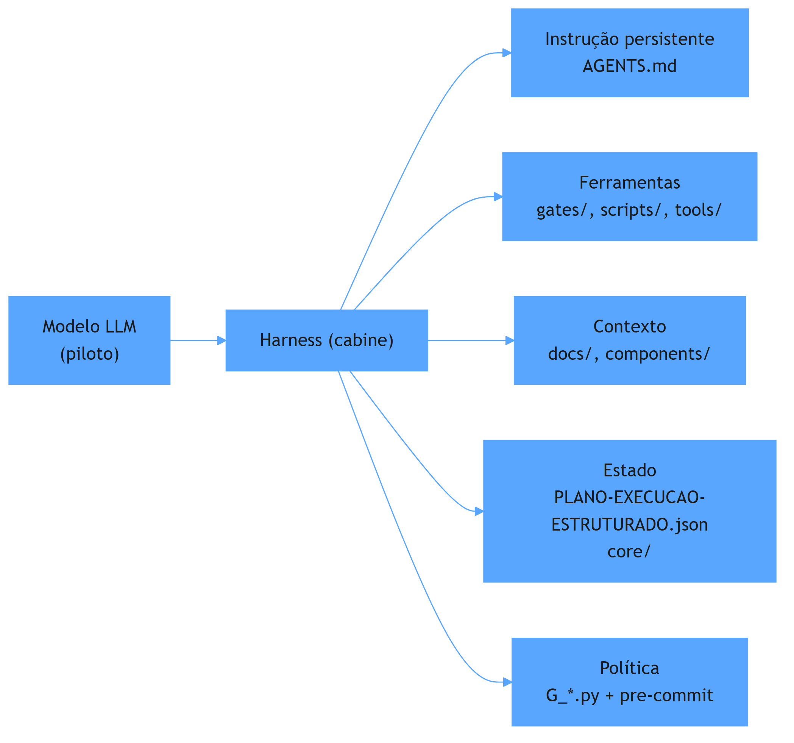

| Peça | Onde está no projeto real |
|---|---|
| instrução persistente | `AGENTS.md` na raiz (com as 8 Leis Invioláveis) |
| ferramentas | os 16 gates em `gates/` (ex.: `G_ECOSSISTEMA_INTEGRIDADE.py`) e as 6 ferramentas em `tools/` |
| contexto | `docs/`, `componentes/compartilhado/skills/` e o mapa do README |
| estado | `PLANO-EXECUCAO-ESTRUTURADO.json` e o ledger em `core/cognitive_ledger.py` |
| política | `python ecossistema.py audit` → `pre-commit run --all-files` |

Abra cada um desses arquivos agora, mesmo que não entenda tudo. O ato de localizar a peça já ensina: o ecossistema inteiro depende menos do modelo e mais desses arquivos.

O vetor condutor do projeto é declarado no `ecossistema.py`: um ponto único de entrada que roteia para 5 ferramentas integradas (forge, generate, master, enterprise, ops) e para o audit de integridade. Essa é uma peça de ferramenta emblemática: o LLM não precisa saber o comando de cada ferramenta — ele chama um CLI determinístico, que resolve o resto [4].

## Mão na massa

Abra o terminal na pasta `ecossistema-aidd` e faça:

1. Liste os arquivos de instrução:

   ```bash
   ls AGENTS.md CLAUDE.md GEMINI.md CODEBUDDY.md QODER.md
   ```

2. Abra o começo do `AGENTS.md` e encontre as seções "Inviolable Laws" — são instruções persistentes compartilhadas por todos os harnesses.

3. Liste os gates (as ferramentas determinísticas):

   ```bash
   ls gates/ | grep "^G_"
   ```

4. Rode o status da cabine:

   ```bash
   python ecossistema.py status
   ```

5. Procure o estado em `PLANO-EXECUCAO-ESTRUTURADO.json` e leia o campo com a telemetria de testes.

## Três regras que ficam

1. Modelo, harness e agente são três coisas diferentes: o modelo decide, o harness instrumenta, o agente é a soma dos dois.
2. As 5 peças da cabine podem ser localizadas em qualquer projeto real — o ecossistema-aidd as expõe todas as.
3. Política (lei, garantida por código) vence instrução (pedido, esquecível).

## Erros de julgamento deste dia

- Confundir o LLM com o harness e sair "tunando o modelo" quando o problema está nos arquivos da cabine.
- Achar que um projeto de IA é "só código" e ignorar os arquivos de governança que o orquestram.
- Trocar o modelo e esperar que os problemas desapareçam sozinhos: se quebrar, o problema provavelmente está na cabine.

## Checklist do dia

- [ ] Sei a diferença entre modelo, harness e agente.
- [ ] Consigo dizer as 5 peças da cabine de memória.
- [ ] Sei qual é a diferença entre instrução (pedido) e política (lei).
- [ ] Localizei as 5 peças dentro de `ecossistema-aidd`.
- [ ] Expliquei, com as minhas palavras, o que o `python ecossistema.py status` faz.

## Para saber mais

1. `AGENTS.md` do `ecossistema-aidd` — a Lei Fundamental e as 8 Leis Invioláveis (github.com/heverton-dev/ecossistema-aidd).
2. README do projeto — o portal unificado com as 6 Ferramentas e os 12 Portões de Segurança.
3. "Effective context engineering for AI agents" — Anthropic Engineering Blog (anthropic.com/engineering).
4. `ecossistema.py` — a CLI unificada que orquestra as ferramentas.

No Dia 2, vamos responder a pergunta que este dia deixou aberta: o que deve ser decidido pelo modelo (probabilístico) e o que deve ser garantido por código (determinístico) — e como o ecossistema-aidd usa gates com exit 0/1 para impor a segunda.

# Dia 2 — Probabilismo e determinismo: onde cada um manda

## Meta do dia

Entender **o que o modelo decide** (probabilístico) versus **o que o código garante** (determinístico) — e ver como o `ecossistema-aidd` impõe o segundo com gates de qualidade que respondem apenas `exit 0` (passa) ou `exit 1` (bloqueia).

## A ideia em uma frase

O modelo é bom para escolher entre respostas plausíveis, mas péssimo para repetir exatamente o mesmo procedimento; o que precisa ser exato, você escreve em código — e o código não aceita "mais ou menos".

## A explicação simples

Um LLM, por dentro, é uma máquina de probabilidade: ele observa um texto e calcula qual é a próxima palavra mais provável, dado tudo que já viu. Isso faz dele genial para criar, parafrasear e raciocinar — e inútil para ser *repetível*. Peça duas vezes "valide esse arquivo" e você pode receber dois procedimentos diferentes, ambos corretos.

Por isso, engenharia agêntica madura tem uma regra de ouro: **procedimento no código, julgamento no modelo**. Tarefas mecânicas — conferir sintaxe, comparar arquivos, checar segredos, validar esquema — viram script. O LLM só entra onde o resultado não pode ser previsto antecipadamente [1].

Como transformar um pedido em lei? Com um **gate de qualidade**: um programa que roda e devolve um código de saída binário. Se o programa passa, o fluxo segue; se falha, o fluxo morre. Não existe "passa mais ou menos". Para o agente, isso muda tudo: não basta ele *achar* que está certo — a máquina *verifica* de novo.

## O determinismo como primeira lei

O `AGENTS.md` do ecossistema-aidd é explícito. Sua primeira Lei Inviolável é "Determinism First": use scripts determinísticos, AST, regex ou JSON Schema para tarefas mecânicas — **nunca** o LLM para isso. A segunda é "Binary Quality": cada mudança precisa passar nos Quality Gates, com `exit 0 = pass` e `exit 1 = block` [2].

Repare no detalhe: não é uma preferência de estilo. É uma lei. E leis, neste projeto, têm consequência no código.

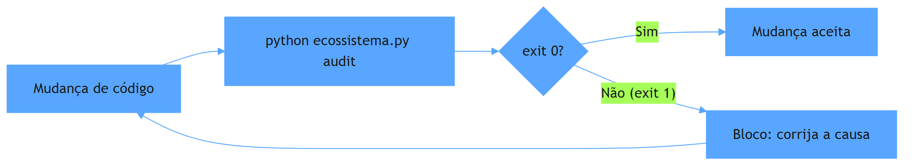

## O exemplo real: os gates do `ecossistema-aidd`

O `ecossistema-aidd` tem 16 gates em `gates/`, com nomes como `G_ECOSSISTEMA_INTEGRIDADE.py`, `G_SEGREDOS.py`, `G_HADOLINT.py` e `G_TESTES_REAIS.py`. Cada um é um script Python determinístico que varre o repositório e devolve exit code. Juntos, formam o audit consolidado.

O comando central é:

```bash
python ecossistema.py audit
```

E aqui mora um detalhe de arquitetura que vale o dia inteiro: o comando `audit` não roda os gates na ordem em que aparecem na lista — ele delega para o framework `pre-commit` com `pre-commit run --all-files`. Os mesmos gates `_GATES_AUDIT` que estão no `ecossistema.py` viram hooks locais em `.pre-commit-config.yaml` [3].

Isso significa que a política de qualidade não depende de "quem roda o comando": o gate está integrado ao ciclo de vida do git. E mais importante: o ecossistema usa `gates/allowlist_*` (como `allowlist_cli_help.json` e `allowlist_orfaos.json`) — listas de exceção revisadas por humano, em vez de simplesmente desligar um gate que falha. O determinismo continua valendo com transparência do que foi dispensado e por quê.

Observe ainda a Lei 8, "Label Honesty": nunca alegar certificação ou cobertura de testes além do que os testes automatizados reais comprovam. Isso é probabilismo *honesto* aplicado à comunicação: o marketing não conta, o teste mede [4].

## Mão na massa

Abra o terminal na pasta `ecossistema-aidd` e faça:

1. Liste os gates:

   ```bash
   ls gates/ | grep "^G_"
   ```

2. Leia o miolo de um gate pequeno, o `G_HONESTIDADE_ROTULO.py`, e identifique onde ele decide aprovar/reprovar (o retorno com exit code).

3. Veja o rol de gates auditáveis declarados no `ecossistema.py`:

   ```bash
   grep -n "_GATES_AUDIT" -A 12 ecossistema.py
   ```

4. Rode um gate isolado (não o audit completo) para ver a saída binária:

   ```bash
   python gates/G_ECOSSISTEMA_INTEGRIDADE.py > /dev/null; echo "exit=$?"
   ```

   (Se o ambiente não estiver 100%, você verá `exit=1` — e isso, por design, é a resposta certa do determinismo.)

5. Abra `gates/allowlist_cli_help.json` e tente entender que tipo de exceção foi registrada e por quê.

## Três regras que ficam

1. Julgamento ao modelo, procedimento ao código — nunca o contrário para tarefas que precisam de repetição exata.
2. Gate de qualidade com exit 0/1 transforma pedido em lei e acaba com o "mais ou menos".
3. Exceção a um gate é um arquivo revisto por humano (allowlist), não um gate desligado.

## Erros de julgamento deste dia

- Pedir ao modelo para fazer o que um script faria melhor (ex.: validar sintaxe) e sofrer com inconsistência entre execuções.
- Ver um gate falhar e "corrigir o teste" para ele passar, em vez de corrigir a causa (o modo red/verde só funciona se o verde for honesto).
- Confiar em obviedade verbal: o agente diz que passou; o exit code é que decide.

## Checklist do dia

- [ ] Sei explicar a diferença entre decisão probabilística e procedimento determinístico.
- [ ] Entendi por que `exit 0`/`exit 1` é mais forte do que uma instrução.
- [ ] Localizei os 16 gates em `gates/` no ecossistema-aidd.
- [ ] Entendi o papel das allowlists (exceção revistada) versus gate desativado.
- [ ] Rodei o comando para imprimir o exit code de um gate isolado.

## Para saber mais

1. `AGENTS.md` do `ecossistema-aidd` — seção "Inviolable Laws", Lei 1 (Determinism First) e Lei 2 (Binary Quality).
2. README do projeto — "Os 12 Portões de Segurança", a lista com o propósito de cada gate.
3. `ecossistema.py` — função `_GATES_AUDIT` e `cmd_audit`, onde o audit delega para o pre-commit.
4. Documentação oficial do framework pre-commit (pre-commit.com) — como hooks locais rodam no ciclo git.

No Dia 3, vamos abrir o arquivo que cada agente lê em primeiro lugar: o `AGENTS.md` — e ver como o ecossistema-aidd o usa como Lei Fundamental compartilhada entre todos os harnesses.

# Dia 3 — O arquivo que cada agente lê: AGENTS.md, config.json e rules

## Meta do dia

Dominar os **arquivos de instrução persistente** do `ecossistema-aidd`: entender o que é o `AGENTS.md` canônico, por que ele é o primeiro arquivo que cada agente lê e como ele se espalha para cada harness (Claude, Antigravity, OpenCode, MimoCode) com o mesmo conteúdo.

## A ideia em uma frase

Um repositório de engenharia agêntica não ensina o agente pelo "jeito certo" uma vez — ele ensina **todos os** os harnesses, o tempo cada, pelo mesmo arquivo de governança.

## A explicação simples

Na primeira mensagem de uma sessão, o agente de IA não sabe nada sobre o seu projeto. Ele só sabe o que o harness injeta nele: o prompt de sistema, as ferramentas disponíveis e os **arquivos de contexto**. Entre esses arquivos, um se destaca: o `AGENTS.md`.

Se existe um `AGENTS.md` na raiz, quase cada harness moderno o lê automaticamente e o mantém em contexto do começo ao fim da sessão [1]. É como o manual de bordo: o copiloto não precisa decorar tudo de antemão, mas precisa *saber que o manual existe e onde consultá-lo*.

O `ecossistema-aidd` leva isso ao limite: além do `AGENTS.md` canônico na raiz, existem `CLAUDE.md`, `GEMINI.md`, `CODEBUDDY.md`, `QODER.md` — um para cada harness — mas todos os apontam para a **mesma** governança, em vez de duplicarem conteúdo divergente. O `AGENTS.md` é descrito como "A Lei Fundamental e a governança canônica" [2]; os demais são pontes para o mesmo texto, com detalhes específicos do harness apenas onde o formato exige.

## A anatomia de um AGENTS.md bem feito

Observe a estrutura do `AGENTS.md` do ecossistema-aidd. Ele não começa com "seja educado" — começa com restrições operacionais que desperdiçam menos tokens:

- **Core Execution Constraints**: pensamento compacto (<150 palavras de raciocínio), resolver em 3 a 5 passos discretos, saída de executor silencioso, edição por busca/substituição exata, sempre dar pipe em comandos verbosos (`pytest 2>&1 | tail -n 25`) e consultar o knowledge graph (MCP `code-review-graph`) **antes** de Grep/Glob/leitura integral [3].
- **Inviolable Laws**: determinismo primeiro, qualidade binária, persistência estruturada, economia extrema de tokens, zero stubs, supremacia agnóstica, desenvolvedor no controle, honestidade do rótulo.
- **Architecture & Context Dispatch**: diz onde os detalhes moram — `tools/aidd-forge/AGENTS.md`, `tools/aidd-generator/AGENTS.md` etc. O canônico não tenta conter tudo; ele *roteia*.

Repare no princípio: o arquivo de instrução não detalha cada ferramenta — ele define limites e indica onde os detalhes estão. Isso mantém o prefixo de contexto curto e estável, o que é decisivo para prompt caching (assunto do Dia 6) [4].

## O exemplo real: a governança em arquivo do `ecossistema-aidd`

Na raiz do `ecossistema-aidd` você encontra o `AGENTS.md` completo em apenas ~50 linhas. Ele declara o nome do repositório, o padrão de governança ("Zero Stubs, Strict Determinism, Context Optimization <2000 tokens") e a referência completa em `docs/protocolos/AGENTS-REFERENCIA-COMPLETA.md`.

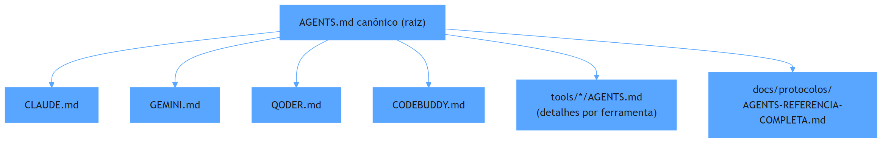

A instrução persistente não é um texto único gigante: é uma **árvore**. O canônico é o tronco (limites e leis); as ferramentas são os galhos (detalhes de cada dominio); o documento de referência completa é a folhagem (o wiki completo). O agente lê o tronco sempre, os galhos sob demanda e a folhagem quando precisa mergulhar.

E quando uma instrução precisa ser *distribuída* — por exemplo, uma skill nova que deve funcionar em todos os harnesses? O ecossistema usa `python ecossistema.py components sync --tipo todos os`, que sincroniza a distribuição física multi-harness a partir do cofre canônico em `componentes/` [2]. Instrução persistente aqui se escreve uma vez e se distribui igualdade.

## Mão na massa

Abra o terminal na pasta `ecossistema-aidd` e faça:

1. Leia o `AGENTS.md` inteiro do começo ao fim (são ~50 linhas — leitura obrigatória).

2. Compare os harness bridges:

   ```bash
   ls AGENTS.md CLAUDE.md GEMINI.md CODEBUDDY.md QODER.md
   ```

3. Veja como o tronco roteia para os galhos:

   ```bash
   for d in tools/aidd-forge tools/aidd-master tools/aidd-ops; do echo "== $d =="; head -8 "$d/AGENTS.md"; done
   ```

4. Leia as "Inviolable Laws" de novo e escreva com suas palavras o que cada uma impede na prática.

5. Consulte a referência completa:

   ```bash
   head -40 docs/protocolos/AGENTS-REFERENCIA-COMPLETA.md
   ```

## Três regras que ficam

1. O `AGENTS.md` é o primeiro arquivo que o harness lê na sessão — é o manual de bordo do agente.
2. Instrução persistente boa é curta no tronco (leis) e profunda nos galhos (detalhes por ferramenta).
3. Governança canônica se escreve uma vez e se distribui para todos os harnesses — nunca se mantém duplicada na mão.

## Erros de julgamento deste dia

- Inflar o `AGENTS.md` com regras de cada ferramenta, criando um prefixo de contexto gigante e instável.
- Manter `CLAUDE.md`, `GEMINI.md` e outros duplicados e divergentes entre si — cada harness aprende uma verdade diferente.
- Escrever instrução do tipo "seja cuidadoso" sem mecanismo: o arquivo instrui, mas sem gate (Dia 2) nada garante.

## Checklist do dia

- [ ] Li o `AGENTS.md` canônico inteiro do ecossistema-aidd.
- [ ] Sei o que são as 8 Leis Invioláveis e consigo citar pelo menos 4.
- [ ] Entendi a diferença entre tronco, galhos e folhagem na árvore de instruções.
- [ ] Sei qual comando sincroniza a distribuição física de componentes multi-harness.
- [ ] Consigo explicar por que o canônico não deve duplicar o conteúdo das ferramentas.

## Para saber mais

1. `AGENTS.md` do ecossistema-aidd — a Lei Fundamental (github.com/heverton-dev/ecossistema-aidd).
2. README, seção "Mapa do Repositório" — onde `AGENTS.md` é listado como "A Lei Fundamental e a governança canônica".
3. `core/context_slicer.py` — como o projeto extrai contexto de arquivos sem ler o corpo inteiro (os "galhos" sob demanda).
4. `docs/protocolos/AGENTS-REFERENCIA-COMPLETA.md` — a referência completa da governança canônica.

No Dia 4, vamos entrar na cabine de verdade: as ferramentas que o agente tem em mãos — skills, MCPs e tools — e as 6 Ferramentas Integradas do ecossistema.

# Dia 4 — Skills, MCPs e tools: o que o agente sabe fazer

## Meta do dia

Conhecer as **três camadas de capacidade** do harness — tools, skills e MCPs — e mapear as **6 Ferramentas Integradas** que o `ecossistema-aidd` oferece para o agente executar de verdade (forja, geração, modularização, enterprise, operações e bridge).

## A ideia em uma frase

O modelo sabe conversar; as **tools** fazem ele agir no mundo; as **skills** ensinam um procedimento de memória; os **MCPs** conectam serviços externos — e um projeto maduro de engenharia agêntica distribui tudo isso de forma determinística.

## A explicação simples

Dia 1 apresentou as ferramentas como uma das 5 peças da cabine. Agora vamos distinguir três tipos que se confundem:

- **Tool**: uma função programática que o modelo pode invocar — ler arquivo, rodar comando, buscar na web. É a unidade básica de ação.
- **Skill**: um pacote de instruções e scripts que ensina ao agente *como fazer algo complexo e repetível* (um procedimento completo), carregado em contexto quando o tema aparece. Não é uma chamada pontual: é um "curso de procedimento" que fica disponível.
- **MCP (Model Context Protocol)**: um protocolo aberto que conecta o agente a serviços externos (bancos, APIs, ferramentas) de forma padronizada — como um barramento onde ferramentas de terceiros encaixam sem code integrado.

No `ecossistema-aidd`, a distinção é levada a sério: as skills vivem como diretórios versionados em `componentes/compartilhado/skills/` e são distribuídas para todos os harnesses pelo `gestor_componentes`; os MCPs de terceiros (ex.: o `code-review-graph`) são declarados e integrados sem código proprietário [1].

## As 6 Ferramentas Integradas

O coração do ecossistema são 6 ferramentas em `tools/`, cada uma com uma analogia no "mundo real" e um comando determinístico:

| Ferramenta | Papel | Analogia | Comando |
|---|---|---|---|
| `aidd-forge` | Bootstrap, governança e isolamento de ambiente | O chassi e as cercas | `forge init` |
| `aidd-generator` | Fábrica autônoma de software (8 fases) | A linha de montagem | `generate "sistema de delivery"` |
| `aidd-master` | Monolito modular, fatias verticais, SQLite WAL | Os blocos de Lego | `master add-module pedidos` |
| `aidd-enterprise` | Componentes SHA-256, zero-trust | O selo de auditoria | `enterprise inject` |
| `aidd-ops` | Sizing de VPS, Docker, hardening | A pista e o abastecimento | `ops plan "farmácia digital"` |
| `aidd-bridge` | Saída do no-code para VPS própria | O tradutor de código | `bridge scan` |

Cada ferramenta é invocada por `python ecossistema.py ferramenta argumentos` — o CLI unificado resolve o diretório, monta o `PYTHONPATH` e dispara o subprocesso. O agente não precisa saber o caminho físico de nada: a cabine resolve [2].

## O exemplo real: tools e skills no `ecossistema-aidd`

Veja o `ecossistema.py` na prática. Para chamar o Generator:

```python
def cmd_generate(args):
    gen_dir = os.path.join(TOOLS_DIR, "aidd-generator")
    pipeline_script = os.path.join(gen_dir, "scripts", "pipeline_completo.py")
    env = {"PYTHONPATH": gen_dir}
    cmd = [sys.executable, pipeline_script] + args
    return run_command(cmd, cwd=gen_dir, env=env)
```

Isso é uma **tool** canonica: o LLM chama `python ecossistema.py generate "sistema de delivery"` e o harness instancia o subprocesso com o ambiente certo. O resultado volta com exit code — e o fluxo decide (Dia 2) [3].

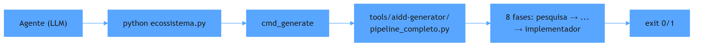

E as skills? Em `componentes/compartilhado/skills/` existem skills que ensinam o agente a orquestrar (ex.: `orca-plan-orchestrator`, com o protocolo completo de worktrees e terminal), a auditar planos (`planos-auditoria-runner`) e a operar cada ferramenta (`aidd-forge-runner`, `aidd-generator-runner` e afins). O comando `python ecossistema.py status` lista as skills universais e marca cada uma como `[OK]` ou `[AUSENTE]` [4].

O terceiro eixo — MCPs — aparece no `AGENTS.md`, seção 4: o `code-review-graph` deve ser consultado antes de qualquer varredura de arquivos. É um servidor MCP externo (rodando via `uvx`) que expõe queries de grafo de conhecimento, economizando contexto.

## Mão na massa

Abra o terminal na pasta `ecossistema-aidd` e faça:

1. Veja o status do ecossistema listando as 6 ferramentas, as skills universais e os slash commands:

   ```bash
   python ecossistema.py status
   ```

2. Liste as skills compartilhadas:

   ```bash
   ls componentes/compartilhado/skills/
   ```

3. Abra uma skill e veja sua estrutura (SKILL.md + scripts):

   ```bash
   ls componentes/compartilhado/skills/aidd-forge-runner/
   ```

4. Veja como o CLI resolve o caminho real de cada ferramenta no `ecossistema.py`:

   ```bash
   grep -n "def cmd_" ecossistema.py
   ```

5. Rode a ajuda com um comando de exemplo:

   ```bash
   python ecossistema.py help
   ```

## Três regras que ficam

1. Tool = ação pontual; skill = procedimento completo; MCP = integração de serviço externo — são camadas diferentes, não sinônimos.
2. Ferramentas determinísticas são chamadas pelo mesmo CLI unificado — o agente nunca precisa saber o caminho físico.
3. Skills se escrevem uma vez em `componentes/compartilhado/skills/` e se distribuem por sync para todos os harnesses.

## Erros de julgamento deste dia

- Tratar skill como simples tool e ficar sem o procedimento completo quando ele é necessário.
- Adicionar um MCP de terceiros sem registrar no `gestor_dependencias`, criando setup manual não reproduzível.
- Chamar o pipeline interno de uma ferramenta direto pelo caminho, em vez de usar o CLI unificado (perde governança e rastreabilidade).

## Checklist do dia

- [ ] Sei a diferença entre tool, skill e MCP com exemplos do ecossistema-aidd.
- [ ] Consigo listar as 6 Ferramentas Integradas e o propósito de cada uma.
- [ ] Rodei `python ecossistema.py status` e reconheci as linhas de ferramentas, skills e comandos.
- [ ] Entendi como `cmd_generate` (no `ecossistema.py`) resolve o subprocesso da ferramenta.
- [ ] Sei onde vivem as skills universais e como elas são distribuídas.

## Para saber mais

1. `ecossistema.py` — as funções `cmd_forge`, `cmd_generate`, `cmd_master`, `cmd_enterprise`, `cmd_ops`, `cmd_bridge` e `cmd_status`.
2. `AGENTS.md`, seção 4 — o papel do MCP `code-review-graph` na economia de contexto.
3. README — a seção "As 6 Ferramentas: Do Leigo ao PhD" com a tabela completa de analogias.
4. `componentes/compartilhado/skills/` — a coleção real de skills universais distribuíveis.

No Dia 5, vamos olhar o que cada chamada custa: a anatomia de um turno agêntico e por que um loop — mesmo simples — consome tokens a cada etapa.

# Parte II — A Bancada — configurando o que realmente custa dinheiro

# Dia 5 — Turnos agênticos: anatomia de um loop e por que ele custa dinheiro

## Meta do dia

Entender o que é um **turno agêntico** — uma única iteração do loop "pensa, chama ferramenta, observa resultado" — e por que cada turno representa um gasto de tokens que se multiplica, usando o pipeline do `aidd-generator` (8 fases) como exemplo de loop complexo.

## A ideia em uma frase

Um agente não "conversa": ele executa um **loop** onde cada passo leva a uma ferramenta e ao resultado dela — e cada volta do loop cobra entrada (contexto) e saída (resposta) de tokens.

## A explicação simples

Quando você conversa com um agente de IA, a interface esconde um ciclo. A cada mensagem sua, o harness monta um pacote de contexto, envia ao modelo e recebe uma resposta; se essa resposta for uma chamada de ferramenta, o harness executa a ferramenta, devolve o resultado ao modelo e pede a próxima decisão. Isso é um turno.

Imagine pedir a um agente para "gerar um sistema de delivery para farmácias". O agente não escreve tudo numa resposta: ele decide "vou pesquisar", "vou analisar", "vou desenhar", "vou criar", e cada decisão gera um ciclo completo. Um único pedido do usuário pode virar **dezenas ou centenas de turnos** — e cada turno paga o envio do contexto inteiro de novo [1].

É por isso que a frase "o token é o combustível e o contexto é o tanque" resume a economia agêntica: cada volta consome mais do mesmo tanque — e o tanque não é infinito. O resumo que o harness mantém é a estimativa de capacidade da janela; a cada turno que adiciona conteúdo novo, suma conteúdo antigo ou comprime o histórico [2].

## O custo tem três dimensões

- **Custo de entrada**: os tokens de contexto reenviados a cada turno. É o maior de todos os — e cai com cache (Dia 6).
- **Custo de saída**: os tokens que o modelo gera por resposta. Quanto mais verboso o agente, maior.
- **Custo de retrabalho**: quando o fluxo falha e precisa repetir etapas. Um gate que falha no fim de um pipeline custa todos os turnos gastos até ali.

Reduzir custo não é só "usar modelo mais barato": é **não criar turnos desnecessários** e **não reenviar o que não mudou**.

## O exemplo real: o pipeline de 8 fases do `aidd-generator`

O `aidd-generator` é um loop agêntico declarado com 8 fases fixas: pesquisa, analisador, designer, planejador, criador, documentador, auto-crítica e implementador [3]. A cada transição entre fases, um gate de validação exige `exit 0` — senão a progressão é bloqueada.

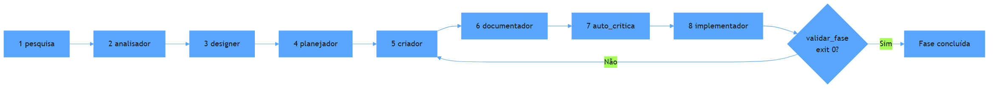

Repare em dois detalhes de economia que o ecossistema aplica ao próprio loop:

1. **Estado em JSON, não em conversa.** O `PLANO-EXECUCAO-ESTRUTURADO.json` na raiz é a persistência canônica do pipeline (a "fonte da verdade"). O `AGENTS.md` do generator é explícito: o agente lê o JSON de estado (~5k tokens) em vez de reconstituir o histórico conversacional — que cresceria muito mais e repetiria tudo a cada turno [3].
2. **Detalhes fora do contexto.** Cada fase tem scripts próprios (`scripts/executar_fase.py --fase N`, `scripts/validar_fase.py --fase N`); o agente não carrega todos os scripts no contexto — ele chama a ferramenta certa na fase certa, com o resultado voltando pelo fluxo.

Esse desenho é o antibiótico do "loop caro": o agente mantém o contexto curto (só o estado), chama subprocessos determinísticos (que não gastam token de saída LLM) e só o raciocínio que sobra custa.

## Mão na massa

Abra o terminal na pasta `ecossistema-aidd` e faça:

1. Veja as 8 fases declaradas na governança:

   ```bash
   grep -n "Phase" tools/aidd-generator/AGENTS.md
   ```

2. Veja a persistência do estado:

   ```bash
   head -20 PLANO-EXECUCAO-ESTRUTURADO.json
   ```

3. Liste os scripts de fase do generator:

   ```bash
   ls tools/aidd-generator/scripts/
   ```

4. Rode a entrada do ciclo de geração em modo seco apenas para ver como ele se comporta:

   ```bash
   python ecossistema.py generate --help 2>/dev/null | tail -10
   ```

5. Observe o mapeamento no `ecossistema.py`: a função `cmd_generate` resolve o `pipeline_completo.py` — um subprocesso, não um LLM:

   ```bash
   grep -n "pipeline_completo" ecossistema.py
   ```

## Três regras que ficam

1. Um pedido simples ao agente vira muitos turnos — cada um paga contexto + saída.
2. Estado em arquivo/JSON em vez de histórico conversacional corta a repetição de contexto a cada turno.
3. Tarefa mecânica como subprocesso determinístico custa zero token de LLM.

## Erros de julgamento deste dia

- Deixar o agente "relembrar" o passado pelo chat quando a fonte da verdade vive em um JSON de estado.
- Acoplar todos os scripts no contexto quando bastaria chamá-los por subprocesso na fase certa.
- Medir custo só pelo modelo escolhido e ignorar o número de turnos — que domina a conta final.

## Checklist do dia

- [ ] Sei explicar o que é um turno agêntico e onde ele acontece.
- [ ] Conheço as três dimensões de custo (entrada, saída, retrabalho).
- [ ] Entendi as 8 fases do `aidd-generator` e como o gate `exit 0` trava o avanço.
- [ ] Sei por que o estado em JSON (~5k tokens) substitui o histórico conversacional.
- [ ] Identifiquei no `ecossistema.py` a chamada que dispara o pipeline como subprocesso.

## Para saber mais

1. `tools/aidd-generator/AGENTS.md` — as 8 fases, os gates mecânicos e a persistência em JSON.
2. `ecossistema.py` — função `cmd_generate` e a resolução do `pipeline_completo.py`.
3. README — a tabela "As 6 Ferramentas", linha do AIDD Generator (linha de montagem).
4. "Iterative Loop" em documentação de agentes (platform.openai.com/docs) — a mecânica padrão de turnos e tool calls.

No Dia 6, vamos atacar o maior custo de todos os: o reenvio do contexto — e a ferramenta que o transforma em desconto: o cache.

# Dia 6 — Cache hit: prompt caching e a ordem das partes

## Meta do dia

Entender como o **prompt caching** corta o custo de entrada em quase 90% nas chamadas repetidas — e como a *ordem estável* das partes do contexto determina se você acerta o cache ou não.

## A ideia em uma frase

Se o contexto é o tanque (Dia 5), o cache é o combustível que você já pagou: a parte do contexto que não mudou entre turnos é recomprada por uma fração do preço — desde que ela esteja sempre no mesmo lugar.

## A explicação simples

Quando o agente chama o modelo na segunda vez, no terceiro turno, no quinto, ele reenvia quase tudo que já enviou: instrução persistente (AGENTS.md), histórico, e a cada novo passo um pouco mais. Reenviar verbatim desse contexto inteiro seria pagar a entrada completa a cada vez.

O prompt caching resolve isso com um truque de engenharia: **a plataforma memoiza prefixos do prompt por um tempo**. Se você reenviar os mesmos tokens no mesmo prefixo (a partir do índice 0 até o ponto de `cache_control`), a cobrança na reutilização cai para uma fração do preço da entrada total — tipicamente 10% do custo de input normal, ou menos, dependendo do provedor [1].

Repare na condição crítica: ele não é um "cache de conteúdo têmico". É um cache de **prefixo textual exato**. O fornecedor guarda o prefixo como apareceu na última chamada; se na chamada seguinte aquele trecho reaparecer intacto, no mesmo lugar, você paga barato. Se qualquer caractere mudar no meio, o prefixo quebra e o cache inteiro é perdido [2].

## A regra de ouro que muda tudo

A otimização número 1 de custo não é trocar de modelo — é **ordenar o contexto do mais estável para o mais volátil**:

1. **Mais estável primeiro**: instrução de sistema, AGENTS.md, docs de referência que não mudam, exemplos fixos.
2. **Estabilidade média**: porções de conhecimento que variam raramente (manual de uma lib).
3. **Mais volátil por último**: mensagens do usuário, saídas de ferramentas, histórico recente.

Se você colocar uma saída de ferramenta gigante *antes* de um bloco estável (ou pior, intercalar blocos instáveis no meio do prefixo estável), tudo que está depois dela reenche sem cache. Dezenas de milhares de tokens passam a ser cobrados a preço cheio em cada turno subsequente. Um único item deslocado pode anular a economia de cada o pipeline [3].

## O exemplo real: como o `ecossistema-aidd` governa o prefixo

O `AGENTS.md` do ecossistema é **explícito sobre o custo de contexto** — a própria governança declara "Context Optimization <2000 tokens" como padrão. E o efeito prático é visível na arquitetura:

- A instrução canônica é curta por design (o tronco com leis, não a folhagem completa). Prefixo estável enxuto = cache barato e robusto.
- Os detalhes ficam **fora do prefixo**: em `tools/*/AGENTS.md`, `docs/protocolos/`, `componentes/`. O agente busca sob demanda — e essas buscas de arquivos novos entram *depois*, na parte volátil, sem quebrar o prefixo.
- O `core/context_slicer.py` extrai apenas os símbolos relevantes de um arquivo (AST), em vez de injetar o arquivo inteiro. Menos tokens mutáveis no prefixo = mais do contexto cabendo na região cacheável.

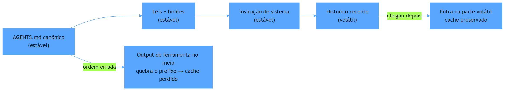

A regra prática que o ecossistema demonstra: **nunca injetar bloco instável no meio de bloco estável**; buscar conhecimento sob demanda (que é volátil e fica no fim) e manter a governança canônica fixa no início [4].

## Mão na massa

Abra o terminal na pasta `ecossistema-aidd` e observe o quanto o projeto protege o prefixo:

1. Meça o tamanho real do AGENTS.md canônico:

   ```bash
   wc -c AGENTS.md
   ```

2. Contraste com a folhagem — veja como a referência completa existe fora do prefixo:

   ```bash
   wc -c docs/protocolos/AGENTS-REFERENCIA-COMPLETA.md
   ```

3. Explore o `context_slicer` que extrai contexto em vez de injetar arquivo inteiro:

   ```bash
   grep -n "class \|def " core/context_slicer.py | head -20
   ```

4. Rode o auditor de integridade (não é um teste de cache, mas mostra o momento em que o contexto é puxado de volta):

   ```bash
   python ecossistema.py audit 2>&1 | tail -15
   ```

5. No código do `context_slicer.py`, localize onde o JSON de payload é compactado (os limites de token por extração).

## Três regras que ficam

1. Cache de prompt é cache de **prefixo exato**: o texto do prefixo precisa ser idêntico a cada chamada, no mesmo lugar.
2. Ordene o contexto do estável para o volátil; qualquer bloco instável no meio do prefixo quebra o cache inteiro.
3. Governança curta no início + busca sob demanda no fim = o desenho que maximiza cache hit.

## Erros de julgamento deste dia

- Achar que "o cache é automático" e intercalar saídas de ferramentas dentro das instruções fixas do projeto.
- Rodar a tudo com prefixo gigante e mutável "para garantir contexto", pagando preço cheio em cada turno.
- Colocar o arquivo de instrução reescrito a cada sessão (regras dinâmicas demais) na frente do prefixo — instabilidade infinita.

## Checklist do dia

- [ ] Sei explicar o que é cache de prefixo e quando ele melhora o custo.
- [ ] Identifico o que é estável e o que é volátil num contexto de agente.
- [ ] Entendo a relação entre a ordem das partes e a possibilidade de cache hit.
- [ ] Medei o tamanho do AGENTS.md canônico versus a referência completa no ecossistema-aidd.
- [ ] Sei qual é a regra prática para não quebrar o prefixo cacheável.

## Para saber mais

1. Documentação de prompt caching da API da Anthropic (docs.anthropic.com/en/docs/build-with-claude/prompt-caching) — como prefixos são cacheados e cobrados.
2. Análise do custo de contexto no "Builder patterns" da documentação de agentes (platform.openai.com) — a taxonomia de contexto estável/volátil.
3. `AGENTS.md` do ecossistema-aidd — a meta explícita "Context Optimization <2000 tokens".
4. `core/context_slicer.py` — extração por AST que mantém o prefixo enxuto e estável.

No Dia 7, vamos abrir a caixa de ferramentas da economia: as configurações reais que reduzem tokens por turno — com as que existem no ecossistema-aidd.

# Dia 7 — Economia severa de tokens: as configurações reais

## Meta do dia

Aplicar a **economia severa de tokens** — a Lei 4 do ecossistema-aidd — conhecendo as configurações e hábitos reais que reduzem o gasto por turno: pensamento compacto, comandos filtrados, edição cirúrgica e zero verbosidade em logs.

## A ideia em uma frase

Economia de tokens não é usar modelo barato — é **forçar, por configuração e por hábito, que o agente escreva menos, leia menos e filtre mais** sem perder correção.

## A explicação simples

O custo de uma sessão agêntica é dominado por tokens — e a assimetria fundamental é que **o contexto de entrada cresce mais rápido do que a resposta**. Cada turno reenvia o prefixo (Dia 6) e adiciona histórico; se o agente responde com um parágrafo de texto a cada ferramenta, a saída multiplica, o retorno para o próximo turno multiplica de novo, e a sessão inteira vira uma bola de neve.

A economia severa ataca pelos dois lados:

- **Reduzir saída**: instruir o agente a responder em modo telegráfico (3-5 pontos, sem preâmbulos).
- **Reduzir entrada**: nunca ler arquivos inteiros para "contexto"; filtrar com pipe, consultar grafo de conhecimento primeiro, e usar resumos de log em vez de dumps.

Isso aparece como regra *global* no ecossistema-aidd — Lei 4: "Extreme Token Economy". E não fica no discurso: vira padrão de comportamento na seção "Core Execution Constraints" do AGENTS.md, com comandos práticos [1].

## As configurações reais que cortam custo

O ecossistema-aidd observa e recomenda um conjunto de práticas que funcionam em qualquer harness:

1. **Pensamento compacto**: limitar o raciocínio do agente a ~150 palavras (um parágrafo), proibindo rascunhos intermináveis antes de agir. Menos saída, menos contexto no próximo turno.
2. **Executor silencioso**: o agente faz a tarefa e anuncia só o resultado — sem narrar o que "está pensando em fazer". A narração é taxa de saída paga sem valor.
3. **Pipe em comandos verbosos**: nunca capturar 500 linhas de log. Sempre `comando 2>&1 | tail -n 25` ou `| grep padrão` — cortando a entrada de ferramenta que polui o contexto [2].
4. **Grafo antes de varredura**: consultar o MCP `code-review-graph` (buscas por grafo de conhecimento) antes de Grep/Glob/leitura integral — um único resultado dirigido vale mais do que a varredura inteira [3].
5. **Edição por busca/substituição exata**: preferir `replace_file_content`/edições pontuais em arquivos pequenos a "sobrescrever" o arquivo inteiro — evitando respostas grandes e diffs gigantes que reentram no contexto.

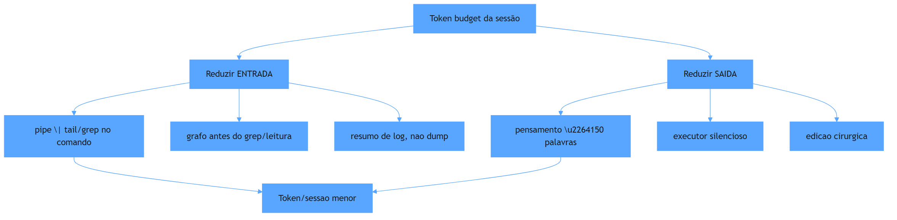

## O exemplo real: as regras de economia no `AGENTS.md`

Abra o `AGENTS.md` do `ecossistema-aidd` e leia a seção de restrições de execução. O que você encontra é uma lista de comandos para o agente:

- `pensar compacto` — resolver em 3 a 5 passos discretos de raciocínio;
- `fornecer saída silenciosa do executor` — ação primeiro, texto curto depois;
- `fazer pipe de comandos que produzem muito log` — `pytest 2>&1 | tail -n 25`, `ls ... | grep ...` sem imprimir tudo;
- `substituição exata e buscas dirigidas` — edição por `Buscar + Substituir` em trechos pequenos;
- `consultar o code-review-graph` **antes** de qualquer busca de arquivo.

Cada linha da governança mapeia direto para uma redução de tokens de entrada ou de saída. Repare também que o próprio padrão de governança declara o teto: "<2000 tokens" — o projeto limita o prefixo canônico para caber barato no cache (Dia 6) [4].

Se o seu harness não tiver um `AGENTS.md` com essas regras, é isso que você está configurando hoje: o arquivo de instrução É a configuração-da-economia do agente.

## Mão na massa

Para sentir a diferença, rode o mesmo comando com e sem o filtro — e observe quanto do resultado você realmente precisa:

1. Sem filtro (dump completo):

   ```bash
   python ecossistema.py status
   ```

2. Com filtro (só o que interessa — as 6 ferramentas):

   ```bash
   python ecossistema.py status 2>/dev/null | grep -i -E "forge|generator|master|enterprise|ops|bridge"
   ```

3. Com resumo de log:

   ```bash
   python ecossistema.py audit 2>&1 | tail -n 12
   ```

4. Abra o AGENTS.md e sublinhe as 4 regras de "core execution constraints" que são economia pura:

   ```bash
   grep -n "pipe\|tail\|silent\|compact\|search" AGENTS.md | head -25
   ```

5. Medindo o custo escondido: conte quantas linhas o `status` completo gerou versus a versão filtrada:

   ```bash
   python ecossistema.py status | wc -l
   ```

## Três regras que ficam

1. Corte a saída e a entrada ao mesmo tempo: pensamento compacto + pipe em comandos verbosos.
2. A governança do projeto (AGENTS.md) é onde a economia vira regra para o agente.
3. Prefira um resultado dirigido (grafo, grep fino) a uma varredura inteira que infla o contexto.

## Erros de julgamento deste dia

- Deixar o agente "narrar o plano" antes de cada ação — narrativa é saída paga sem entrega.
- Capturar dumps completos de comandos verbosos "para garantir contexto" — e pagar por isso em cada turno seguinte.
- Tornar a economia uma preferência de estilo, e não uma linha da governança.

## Checklist do dia

- [ ] Sei listar as 4 práticas de "core execution constraints" do AGENTS.md.
- [ ] Consegui rodar o mesmo comando com e sem filtro e vi a diferença de saída.
- [ ] Entendo por que pensamento compacto ≠ perder rigor técnico.
- [ ] Sei o papel do `code-review-graph` na economia de entrada.
- [ ] Apliquei a regra do pipe pelo menos uma vez no terminal hoje.

## Para saber mais

1. `AGENTS.md` do ecossistema-aidd — "Core Execution Constraints" e "Inviolable Laws", Lei 4.
2. `core/context_slicer.py` — a leitura por símbolos que reduz a entrada por arquivo.
3. MCP `code-review-graph` (github.com/tirth8205/code-review-graph) — a fonte do grafo de conhecimento consultado antes das leituras.
4. `docs/protocolos/AGENTS-REFERENCIA-COMPLETA.md` — a governança expandida, com as melhores práticas de contexto.

No Dia 8, vamos além das regras de bolso: a otimização de contexto em si — selecionar, comprimir e isolar o que entra na janela.

# Dia 8 — Otimização de contexto: selecionar, comprimir, isolar

## Meta do dia

Entender o mecanismo **DynamicContextSlicer** — como o `ecossistema-aidd` seleciona por AST, comprime via payload JSON (<150 tokens) e isola via Context-Purge, garantindo que o contexto fique pequeno, estruturado e não contaminado entre sessões.

## A ideia em uma frase

Otimizar contexto não é só "ler menos" — é **transformar a leitura em um payload mínimo, estruturado e não contaminado**, de modo que o agente receba apenas o suficiente para decidir.

## A explicação simples

Até aqui vimos por que o contexto é escasso (Dia 5), como o cache o transforma em desconto (Dia 6) e quais regras cortam tokens no dia a dia (Dia 7). Agora vamos ao mecanismo que implementa esses princípios como código: o `DynamicContextSlicer`, módulo central do `core/context_slicer.py` do ecossistema.

Três conceitos compõem a otimização: **selecionar** (o que entrar), **comprimir** (em quanto), **isolar** (de quem).

**Selecionar: extração por AST.** Em vez de injetar um arquivo inteiro de 200 linhas, o slicer analisa a árvore sintática abstrata (AST) do Python e extrai só as assinaturas de classes e funções. Resultado: um map que diz "classe X está na linha 45, função Y está na linha 89". Com isso o agente navega o mapa e pede o trecho que importa — em vez de carregar tudo no prefixo [1].

**Comprimir: payload JSON <150 tokens.** A saída do slicer não é um trecho textual: é um dicionário compacto serializado em JSON. As regras de extração são rígidas: label da classe, label do método, nome do arquivo, linha. Se o payload exceder 150 tokens, é truncado [2]. Isso garante que a **chamada de ferramenta** que devolve o contexto não gaste mais do que a janela permite.

**Isolar: Context-Purge Isolation.** Cada ferramenta que roda como subprocesso recebe um contexto que morre com ela. Não há contaminção entre frentes de trabalho: o resultado volta para o agente e o restante é descartado. O `aidd-forge` formaliza isso como uma de suas leis de determinismo ambiental [3].

## O exemplo real: o slice em ação

Imagine que o agente precisa entender a classe `AIDDGeneratorPipeline` em `tools/aidd-generator/aidd_generator/pipeline.py`. Sem otimização, ele leria o arquivo inteiro — possivelmente 300 linhas no contexto. Com o slicer:

1. O agente pede `get_minimal_context("pipeline.py")`.
2. O slicer dispara `extract_from_file("pipeline.py")`, analisa o AST e devolve o mapa de assinaturas.
3. O payload: `{"classe": "AIDDGeneratorPipeline", "linha": 45, "metodos": [...]}` — 120 tokens.
4. O agente lê só o método que importa — com `search_symbols` — e injeta 30 linhas no contexto, em vez de 300 [1].

A economia é significativa, mas o benefício maior é a **predição**: o payload JSON é determinístico. Não importa quem ou quando chama — o mesmo arquivo sempre devolve o mesmo payload mínimo. Isso transforma contexto em algo auditável e cacheável (Dia 6).

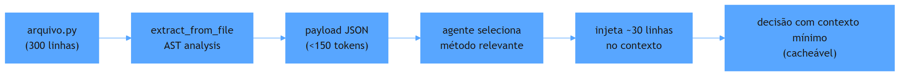

## O Ledger: estado persistente sem pesar

Junto ao slicer, o `core/cognitive_ledger.py` implementa um **Cognitive Session Ledger** — um banco SQLite WAL persistente (`.aidd/cognitive_ledger.db`) que registra eventos de contexto, decisões e resultados de forma imutável [4].

O ledger resolve o problema de "quanto contexto usar": em vez de perguntar "o que aconteceu na última sessão?", o agente consulta a tabela de eventos do ledger (consulta barata, contexto mínimo). O estado persiste entre sessões, mas o prefixo do prompt não carrega o histórico conversacional inteiro — carrega só o estado derivado, que é muito menor.

A combinação slicer + ledger é o antibiótico completo: o slicer minimiza *cada leitura* e o ledger minimiza *a necessidade de ler o passado*. Contexto mínimo, estruturado, não contaminado.

## Mão na massa

Abra o terminal na pasta `ecossistema-aidd`:

1. Veja a estrutura do slicer — onde ele extrai classes e funções:

   ```bash
   grep -n "class \|def \|def _" core/context_slicer.py | head -30
   ```

2. Localize o payload JSON compacto e o limite de 150 tokens:

   ```bash
   grep -n "token\|payload\|compact" core/context_slicer.py
   ```

3. Veja a estrutura do ledger:

   ```bash
   grep -n "cognitive_events\|CREATE TABLE\|session_id" core/cognitive_ledger.py | head -20
   ```

4. Observe o diretório `.aidd/` — lá mora o ledger:

   ```bash
   ls -la .aidd/ 2>/dev/null || echo "Pasta .aidd ainda não existe (será criada na primeira sessão)"
   ```

5. Rode o auditor e veja que ele valida arquivos do core (slicer + ledger incluídos):

   ```bash
   python ecossistema.py audit 2>&1 | grep -i "core\|cognitive\|slicer"
   ```

## Três regras que ficam

1. Selecione por AST (o que), comprima em JSON mínimo (quanto), isole por subprocesso (de quem) — o trio da otimização de contexto.
2. O payload determinístico (mesmo arquivo → mesmo JSON) transforma contexto em algo auditável e cacheável.
3. Ledger persistente substitui o histórico conversacional completo — estado pequeno em vez de conversa grande.

## Erros de julgamento deste dia

- Injetar um arquivo inteiro no contexto "para não perder nada" — o payload AST são 150 tokens contra 6 mil.
- Carregar o histórico de sessões anteriores como mensagens quando o ledger já traz o estado derivado.
- Confundir Context-Purge com "apagar dados": ele isola, não destrói — o ledger preserva, mas o contexto transitório morre.

## Checklist do dia

- [ ] Sei o que o DynamicContextSlicer faz e por que AST é melhor do que regex para extração.
- [ ] Entendo o limite de 150 tokens por payload e o que acontece quando ele é atingido.
- [ ] Consigo explicar Context-Purge Isolation no ecossistema.
- [ ] Localizei o cognitive_ledger.py e entendi que ele é SQLite WAL.
- [ ] Sei a diferença entre "estado persistente" e "histórico conversacional".

## Para saber mais

1. `core/context_slicer.py` — `extract_from_file`, `get_minimal_context`, `search_symbols`, o JSON de payload e o limite de tokens.
2. `core/cognitive_ledger.py` — `CognitiveSessionLedger`, tabela `cognitive_events`, WAL no `.aidd/`.
3. `AGENTS.md` do ecossistema-aidd — "Extreme Token Economy" (Lei 4) e "Graph-first" (Lei: consultar MCP antes de grep/leitura).
4. Seção "Context-Purge Isolation" em `tools/aidd-forge/AGENTS.md` — como o forge isola cada execução ambiental.

No Dia 9, vamos fechar a bancada: os scripts e gates de qualidade — o determinismo que sustenta a esteira inteira.

# Parte III — A Linha de Montagem — escala, scripts e frota

# Dia 9 — Scripts e gates: o determinismo que sustenta a esteira

## Meta do dia

Mapear os **12 Quality Gates** do `ecossistema-aidd` em `gates/`, entender a estrutura de um gate (duplo-boost, allowlists, exit 0/1) e como o comando `python ecossistema.py audit` encadeia tudo com o framework pre-commit.

## A ideia em uma frase

Se o modelo é o piloto e os gates são os limitadores de velocidade, o audit é a inspeção periódica: nem sempre gosta de rodar, mas é ele que garante que o carro não vai parar no meio da estrada.

## A explicação simples

Na Dia 2 conhecemos a lei binária: exit 0 passa, exit 1 bloqueia. Agora vamos ao inventário completo e ao mecanismo de funcionamento.

O `ecossistema-aidd` mantém em `gates/` um conjunto de arquivos `G_*.py` — cada um é um programa Python que roda de forma determinística (Dia 2) e avalia **uma dimensão** de qualidade do repositório. Eles são declarados no `ecossistema.py` com a tupla `(_GATES_AUDIT, ...)` [1] e indexados pela lista `GATES_INFO` (dicionário com nome, descrição e função).

O comando central:

```bash
python ecossistema.py audit
```

...delega para o `pre-commit run --all-files` (framework de hooks git) — os mesmos gates são listados em `.pre-commit-config.yaml` e integrados ao ciclo de vida de commits. O resultado volta como exit code consolidado: zero = tudo aprovado, um ou mais = falha [2].

## A anatomia de um gate

cada gate no ecossistema tem uma estrutura padrão que vale a pena memorizar:

```python
def main():
    # 1. Load allowlists (se existir)
    # 2. Run checks (AST, regex, OS commands)
    # 3. Validate results against allowlist
    # 4. Return 0 (pass) or 1 (fail)
```

Detalhes essenciais:

- **Permit-listas (`allowlist_*.json`)**: são arquivos JSON que listam exceções conhecidas, revisadas por humano. O gate não desliga — ele tem um catálogo de "o que é exceção aceitável". Isso garante rastreabilidade: se algo foi dispensado, está documentado [3].
- **Duplo-boost**: não existe — o nome não aparece no código. O padrão real é: gates que dependem de ferramentas externas (Hadolint, por exemplo) rodam como subprocessos; se a ferramenta não está instalada, o gate retorna exit 1 com mensagem explicativa.
- **`_GATES_AUDIT`**: a lista consolidada no `ecossistema.py`; não é a única — cada ferramenta pode ter seus gates internos (o forge tem 7).

## Os 12+ Portões de Segurança

A tabela de gates no README do projeto é o mapa completo. Aqui estão os mais importantes, agrupados por tipo de verificação:

**Integridade do repositório:**
- `G_ECOSSISTEMA_INTEGRIDADE` — estrutura de diretórios e presença de arquivos essenciais
- `G_ARQUITETURA_DELIVERABLE` — coerência arquitetural do código gerado

**Segurança:**
- `G_SEGREDOS` — detecção de API keys, senhas, tokens expostos
- `G_HADOLINT` — linting de Dockerfiles
- `G_SAST` — análisis estático de segurança

**Qualidade:**
- `G_TESTES_REAIS` — testes unitários e de integração que realmente rodam
- `G_COBERTURA` — cobertura mínima de testes
- `G_HONESTIDADE_ROTULO` — label de cobertura reflete testes reais (Lei 8)

**Governança:**
- `G_CLI_HELP_CONSISTENCIA` — help dos comandos é consistente
- `G_ORFAOS` — arquivos órfãos sem referência
- `G_DRIFT_NUCLEO_COMPARTILHADO` — componentes compartilhados estão sincronizados

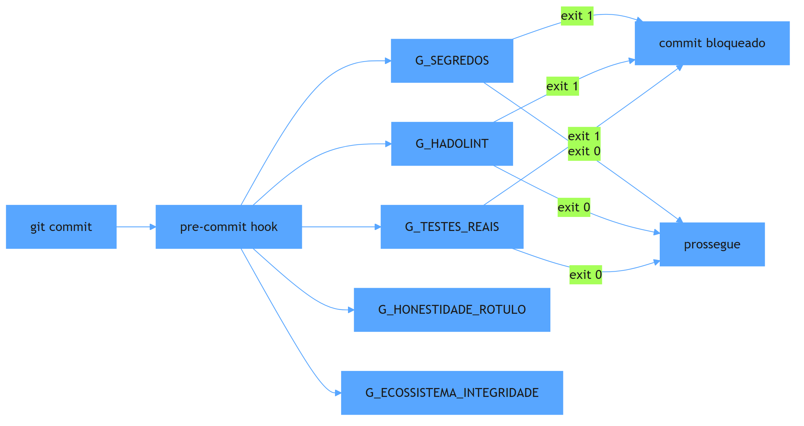

## O exemplo real: estrutura de um gate no `ecossistema-aidd`

Cada gate tem um `main()` com uma lógica simples e determinística. O `G_HONESTIDADE_ROTULO` é o mais didático — ele verifica se o rótulo declarado no `README` reflete o que os testes realmente cobrem, alinhado à Lei 8: nunca declarar mais do que se prova [4].

O `G_SEGREDOS` vai além: ele varre o repositório com regex e verifica que nenhuma chave ou token está exposta. Se encontrar um arquivo commitado com segredo, o gate retorna exit 1 e o commit é bloqueado.

Cada um desses gates é pequeno (20-60 linhas), determinístico e sem dependência do LLM. É programação pura — e é por isso que funciona como política.

## Mão na massa

Abra o terminal na pasta `ecossistema-aidd`:

1. Liste todos os gates:

   ```bash
   ls gates/ | grep "^G_"
   ```

2. Conte quantos gates existem:

   ```bash
   ls gates/G_*.py | wc -l
   ```

3. Rode um gate individual e veja o exit code:

   ```bash
   python gates/G_HONESTIDADE_ROTULO.py > /dev/null; echo "exit=$?"
   ```

4. Leia o topo do `G_ECOSSISTEMA_INTEGRIDADE.py` e identifique o padrão: allowlist + check + exit.

5. Veja o pre-commit hook declarado:

   ```bash
   grep -n "_GATES_AUDIT" ecossistema.py
   ```

## Três regras que ficam

1. Cada gate é um programa pequeno, determinístico, sem LLM — é uma verificação de código puro.
2. Allowlistings (exceções) são revistadas por humano e versionadas — não são desligamentos.
3. O audit (pre-commit) é a inspeção periódica que garante que todos os gates rodam antes do commit.

## Erros de julgamento deste dia

- Desligar um gate que falha em vez de registrar a exceção em allowlist (perde rastreabilidade).
- Rodar o audit manualmente e esquecer que ele já deve estar integrado ao pre-commit.
- Achar que "ter testes" é suficiente sem o gate `G_TESTES_REAIS` que prova que eles rodam.

## Checklist do dia

- [ ] Consigo listar pelo menos 5 dos 12+ gates por nome.
- [ ] Entendi o padrão de estrutura de um gate (allowlist + check + exit code).
- [ ] Sei como o `python ecossistema.py audit` delega para o pre-commit.
- [ ] Compreendo o papel de `G_HONESTIDADE_ROTULO` e por que ele é a Lei 8 em código.
- [ ] Localizei as allowlists em `gates/allowlist_*`.

## Para saber mais

1. `ecossistema.py` — função `_GATES_AUDIT` e `cmd_audit` com a lista consolidada.
2. README — seção "Os 12 Portões de Segurança" com a tabela completa.
3. `gates/G_HONESTIDADE_ROTULO.py` — o gate mais didático (Lei 8 em código).
4. `gates/allowlist_*` — as exceções versionadas e rastreáveis.

No Dia 10, vamos olhar o que acontece antes do audit: os **hooks** — camadas que interceptam o agente e impõem regras sem que o LLM peça.

# Dia 10 — Hooks: a camada que intercepta o agente

## Meta do dia

Entender os **hooks** como camadas de interceptação que impõem regras ao agente *sem que ele peça* — e ver como o `ecossistema-aidd` integra os gates ao ciclo de vida do git via pre-commit framework, mantendo o desenvolvedor no controle.

## A ideia em uma frase

Hook é o alarme que toca sozinho: a regra não depende do agente pedir — ela roda automaticamente antes, durante ou depois de uma ação, e bloqueia se não for cumprida.

## A explicação simples

Hooks são interceptadores: código que roda automaticamente em resposta a um evento, sem que o agente (ou o humano) peça. No contexto de engenharia agêntica, existem dois tipos principais:

- **Hooks de ferramenta**: um gate que é acionado *antes* do agente usar uma tool, ou *depois* de usar. É o determinismo imposto pela infraestrutura, não pelo LLM.
- **Hooks de ciclo de vida**: como o pre-commit — rodam antes do commit, antes do push, ou em resposta a outros eventos do git.

A força dos hooks é que não dependem de memória do agente. O LLM pode esquecer que existe uma regra; o hook não — ele roda.

## O framework pre-commit no `ecossistema-aidd`

No `ecossistema-aidd`, a integração com hooks se dá pelo framework pre-commit. Os gates `G_*.py` são declarados em `.pre-commit-config.yaml` e rodam automaticamente a cada `git commit` [1]. O `python ecossistema.py audit` é um alias que roda `pre-commit run --all-files` — verifica todos os arquivos do repositório, não só os modificados.

O efeito é que a política (Dia 2) se torna **infraestrutura** — ela não pode ser contornada, porque o git a impõe antes do commit.

Mas existe um detalhe que separa o ecossistema-aidd de outros projetos: a Lei 8 (Honestidade do Rótulo) não é *verificada automaticamente* pelo audit — ela requer um estágio manual adicional [2]. Isso é intencional: a política que exige julgamento humano (o que conta como "honestidade") não pode ser 100% automatizada sem risco de falso positivo.

## O exemplo real: `.pre-commit-config.yaml`

Abra o `.pre-commit-config.yaml` do `ecossistema-aidd`. Cada gate `G_*.py` aparece como um hook que roda `python caminho do gate` em todos os arquivos. O formato é o padrão do pre-commit framework [3]:

```yaml
repos:
  - repo: local
    hooks:
      - id: g-honestidade-rotulo
        name: G_HONESTIDADE_ROTULO
        entry: python gates/G_HONESTIDADE_ROTULO.py
        language: system
        pass_filenames: false
```

A configuração `pass_filenames: false` é essencial — o gate recebe o repositório inteiro, não arquivos individuais. Cada um tem seu comportamento.

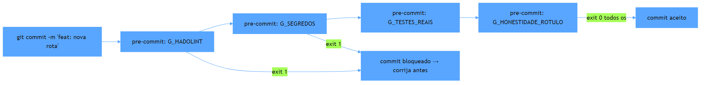

## Mão na massa

Abra o terminal na pasta `ecossistema-aidd`:

1. Liste os hooks declarados no pre-commit:

   ```bash
   grep -n "id:" .pre-commit-config.yaml
   ```

2. Veja se o framework está instalado no ambiente:

   ```bash
   pre-commit --version
   ```

3. Rode todos os hooks manualmente (o equivalente ao audit):

   ```bash
   pre-commit run --all-files
   ```

4. Simule um commit e veja se os hooks disparam — altere um arquivo e faça:

   ```bash
   touch teste_hook.txt && git add teste_hook.txt && git commit -m "teste hook" 2>&1 | tail -n 20
   ```

5. Limpe:

   ```bash
   git reset HEAD~1 && rm -f teste_hook.txt
   ```

6. Observe que `G_HONESTIDADE_ROTULO` é um dos hooks — e entenda por que ele tem um estágio manual no fluxo normal (lei 8).

## Três regras que ficam

1. Hooks impõem regras sem depender da memória ou pedido do agente — são infraestrutura.
2. O pre-commit framework integra os gates ao ciclo git — a política é coagida pelo fluxo de trabalho.
3. Nem cada regra deve ser 100% automatizada — a honestidade de rótulo exige julgamento humano, e o ecossistema respeita isso.

## Erros de julgamento deste dia

- Rodar `python ecossistema.py audit` no terminal e esquecer que os hooks já rodam automaticamente antes do commit — a redundant não machuca, mas a omissão sim.
- Desligar um hook que falha "porque é chato" — se é chato, registre a exceção em allowlist.
- Deixar `.pre-commit-config.yaml` sem sincronia com `ecossistema.py` — os dois devem listar os mesmos gates.

## Checklist do dia

- [ ] Sei o que são hooks e por que são mais fortes do que instruções no AGENTS.md.
- [ ] Localizei os hooks no `.pre-commit-config.yaml`.
- [ ] Rodei `pre-commit run --all-files` e entendi o resultado.
- [ ] Entendi por que `G_HONESTIDADE_ROTULO` tem um estágio manual.
- [ ] Compreendo a relação entre hooks e o `python ecossistema.py audit`.

## Para saber mais

1. `.pre-commit-config.yaml` do ecossistema-aidd — a configuração local dos gates.
2. `ecossistema.py`, função `cmd_audit` — a delegação para o pre-commit.
3. Documentação oficial do framework pre-commit (pre-commit.com).
4. `AGENTS.md` do ecossistema-aidd, Lei 8 — "Label Honesty" e seu papel.

No Dia 11, vamos olhar para a delegação: como o agente delega trabalho a subagentes e quais são os princípios de isolamento que tornam isso seguro.

# Dia 11 — Agents e subagentes: delegação com contexto isolado

## Meta do dia

Entender como o agente **delega trabalho a uma frente isolada** (subagente ou worktree) e porque o isolamento de contexto — e não apenas de arquivos — é o que torna o paralelismo seguro, usando o ambiente `subagent` do `ecossistema-aidd`.

## A ideia em uma frase

Delegar não é "ter um assistente" — é **transferir trabalho para um contexto novo e limitado**, que pode morrer no fim, carregando seu lixo consigo e devolvendo só o resumo.

## A explicação simples

Até aqui vimos um agente trabalhando sozinho no seu contexto. Mas um projeto real de engenharia agêntica não roda um único cérebro: ele **reparte tarefas**. E a repartição só escala se cada fatia tiver seu próprio contexto, separado do principal.

O harness oferece uma ferramenta típica: o **subagente** (Agent tool, "Task", "subagent"). Você descreve a tarefa, o subagente sai com um contexto próprio, trabalha com suas próprias chamadas de ferramenta e **devolve apenas um resumo** ao agente principal. O detalhe crucial é este último: o contexto do subagente não entra na janela do agente principal. O que entra é o resultado — seco, comprimido [1].

Isso muda a economia da sessão inteira: as milhares de linhas que o subagente leu para resolver uma subtarefa não poluem a janela principal. O principal mantém um "resumo do estado" (como o `CognitiveSessionLedger` do Dia 8), enquanto o subagente faz o trabalho pesado de leitura.

## O ambiente `subagent` no `ecossistema-aidd`

O comando `python ecossistema.py orchestrate "plano-exemplo.md" --ambiente subagent` compila um **plano de subagentes**: lê um plano em Markdown, decompõe em frentes de trabalho e gera uma sequência de invocações da ferramenta de agente da sessão atual [2].

A característica definidora desse ambiente está documentada no próprio CLI:

- sem worktree, sem terminal separado;
- roda dentro do contexto da sessão atual;
- **compartilha o contexto** — as frentes não têm isolamento de arquivo real;
- útil para tarefas de leitura/análise que custam caro em tokens e podem ser terceirizadas [2].

Ou seja: `subagent` é o modo "leitura terceirizada". Ele economiza contexto do principal, mas o trabalho de edição exige a sessão principal — porque edita no mesmo filesystem, sem barreira.

Já os ambientes `orca` e `gitworktree` (que veremos no Dia 12) existem exatamente para o caso em que as frentes **precisam** mexer em arquivos sem pisar umas nas outras — aí o isolamento não é só de contexto, é de diretório de trabalho real.

## O exemplo real: um plano de subagentes

Rode um plano de 3 frentes no modo `subagent` e observe como ele se comporta:

```bash
python ecossistema.py orchestrate plano-exemplo.md --ambiente subagent --dry-run
```

O comando renderiza um **plano de voo** — a programação das frentes com contexto, critérios de aceite e dependências — e salva o estado em `.orca-flight-plan.json` [3]. Na prática do ecossistema, essa compilação é feita pelo módulo `scripts/subagent_plan.py`, que transforma o plano em Markdown em uma lista de chamadas ao agente.

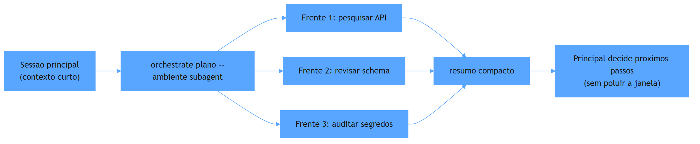

Repare no papel do orquestrador: ele não roda o subagente como "caixa-preta"; ele **prescreve** o contexto de cada frente (o que assumir, o que verificar, o que devolver), preservando o padrão determinístico (Dia 8).

## Mão na massa

Abra o terminal na pasta `ecossistema-aidd`:

1. Veja as opções do ambiente subagent:

   ```bash
   python ecossistema.py orchestrate --help 2>&1 | grep -A 12 "ambiente"
   ```

2. Veja o compilador de plano de subagentes:

   ```bash
   grep -n "def compilar_plano_subagentes" scripts/subagent_plan.py
   ```

3. Olhe o renderizador — como o resumo é montado:

   ```bash
   grep -n "def renderizar_plano_subagentes" scripts/subagent_plan.py
   ```

4. Veja como o isolamento de contexto se manifesta no CLI:

   ```bash
   grep -n "compartilhado\|sem worktree\|contexto" ecossistema.py | head -10
   ```

5. Rode a compilação em modo seco para visualizar as frentes:

   ```bash
   python ecossistema.py orchestrate plano-exemplo.md --ambiente subagent --dry-run 2>&1 | tail -30
   ```

## Três regras que ficam

1. Subagente devolve resumo, não contexto — a janela principal fica limpa.
2. `--ambiente subagent` serve para leitura/análise terceirizada; sem isolamento de arquivo real.
3. O orquestrador prescreve contexto e critérios de aceite de cada frente, mantendo o padrão determinístico.

## Erros de julgamento deste dia

- Usar subagente para editar o mesmo arquivo que outra frente — sem worktree, não há barreira de filesystem.
- Esperar que o subagente "lembre do raciocínio" depois do retorno — o que persiste é o resumo.
- Delegar a mesma busca para todas as frentes e inflar o custo em vez de comprimir resultados comuns.

## Checklist do dia

- [ ] Sei explicar por que o resumo (e não o contexto) é a interface entre principal e subagente.
- [ ] Entendo a diferença de isolamento entre `subagent`, `orca` e `gitworktree`.
- [ ] Localizei `compilar_plano_subagentes` em `scripts/subagent_plan.py`.
- [ ] Rodei a compilação em modo seco e li o plano de voo.
- [ ] Sei quando usar subagente (leitura/análise) e quando usar worktree (edição paralela).

## Para saber mais

1. `ecossistema.py`, comando `orchestrate` — a docstring do ambiente `subagent`, 3 (linha ~370).
2. `scripts/subagent_plan.py` — `compilar_plano_subagentes` e `renderizar_plano_subagentes`.
3. `scripts/flight_plan.py` — `gerar_plano_de_voo` e `renderizar_plano_de_voo` (o estado do plano de voo).
4. Skill `orca-plan-orchestrator` em `componentes/compartilhado/skills/` — o protocolo completo de frentes.

No Dia 12, entramos na suíte de orquestração completa: worktrees reais, paralelismo e o motor `gitworktree` — o ambiente que isola até o diretório.

# Dia 12 — Orquestração: worktrees, paralelismo e o ambiente de agentes

## Meta do dia

Mapear o **comando `orchestrate`** do `ecossistema-aidd` e seus três ambientes de execução — `orca`, `subagent` e `gitworktree` — entendendo quando cada um isola contexto, arquivo e terminal, e como o **plano de voo** orquestra frentes paralelas.

## A ideia em uma frase

Orquestrar não é "chamar N agentes" — é **decidir, por tarefa, o grau de isolamento**: contexto (subagent), diretório (gitworktree) ou ambiente completo (orca) — e registrar esse desenho num plano executável.

## A explicação simples

Paralelismo agêntico tem um problema fundamental: agentes compartilhando o mesmo diretório pisam nos pés uns dos outros e o resultado de um vaza no contexto do outro. A solução não é "rodar muitos agentes"; é **dar a cada frente o isolamento que ela precisa**.

O `git worktree` resolve o isolamento de arquivos com elegância: cria um diretório de trabalho **separado** apontando para o mesmo repositório git. Cada frente opera no seu diretório, com seu próprio branch; ao final, os resultados são integrados de volta ao repositório principal [1].

O ecossistema-aidd eleva isso a um comando: `python ecossistema.py orchestrate plano-exemplo.md`. Ele lê um plano em Markdown, decompõe em **frentes de trabalho** e escolhe o ambiente de execução para cada uma:

- `orca` — usa o aplicativo ORCA real (via `orca-cli`), com worktree e terminal de verdade;
- `subagent` — sem worktree, contexto compartilhado (Dia 11);
- `gitworktree` — motor nativo: `git worktree` + harness spawnado, sem precisar do app ORCA instalado [2].

## O papel do plano de voo

Quando você roda `orchestrate`, o ecossistema não executa as frentes na hora (em modo default): ele **compila e renderiza um plano de voo** — um documento que lista cada frente, o harness recomendado, o ambiente, os critérios de aceite e as dependências — e o salva em `.orca-flight-plan.json` [3].

O plano de voo é a interface entre o humano e a máquina: você revisa, ajusta, e então o assistente da sessão executa cada frente seguindo o protocolo (Worktree create → Terminal → send). É orquestração declarativa: o desenho primeiro, a execução depois [3].

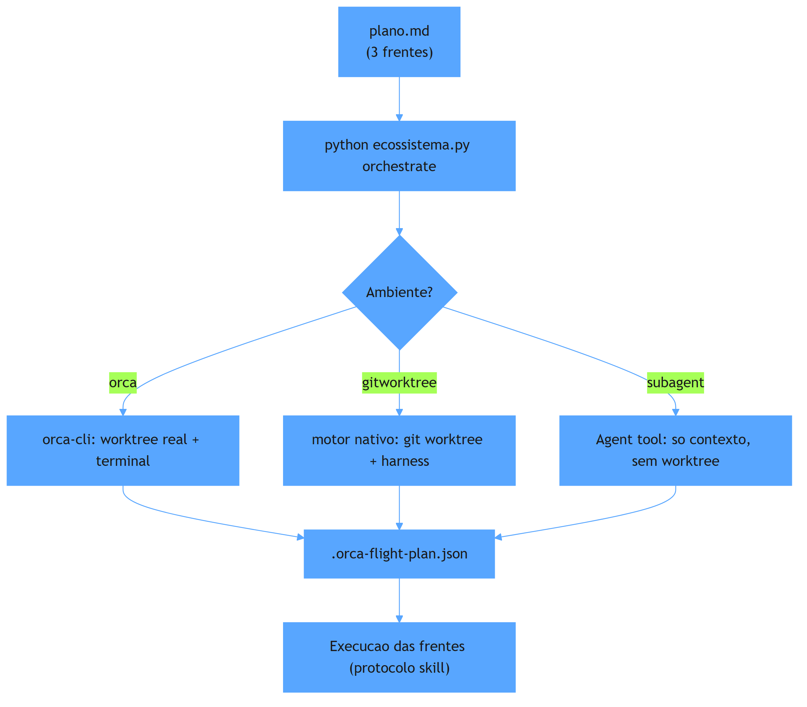

Repare na decisão implícita: nem cada trabalho precisa de worktree. Uma frente de pesquisa que só lê arquivos pode rodar em `subagent` (barata, sem infraestrutura). Já uma frente que reescreve um módulo inteiro precisa de `gitworktree` (isolamento de arquivo + branch próprio). O orquestrador cruza isso com o `harness_profiles.json` — qual harness usar em cada ambiente [2].

## O exemplo real: orquestrando `gitworktree` sem ORCA instalado

O ambiente `gitworktree` é o destaque para quem quer paralelismo sem instalar o aplicativo ORCA. A docstring do CLI é explícita: "motor nativo deste projeto — git worktree + harness spawnado direto, sem precisar do app ORCA".

O `harness_map` permite mapear cada frente para um harness específico: `frente1=claude,frente2=agy` (para Antigravity), etc. — usando `--harness-map` ou um arquivo JSON. E o `--dry-run` exibe o plano sem executar nada, ideal para revisão antes do commit.

## Mão na massa

Abra o terminal na pasta `ecossistema-aidd`:

1. Veja o help completo do orchestrate:

   ```bash
   python ecossistema.py orchestrate --help
   ```

2. Rode em modo seco (não executa, só desenha) com 2 ambientes distintos:

   ```bash
   python ecossistema.py orchestrate plano-exemplo.md --ambiente gitworktree --dry-run
   python ecossistema.py orchestrate plano-exemplo.md --ambiente orca --dry-run
   ```

3. Veja o compilador do plano orca e o mapeamento de trabalho:

   ```bash
   grep -n "def compilar_plano_orca\|PARENT_WORKTREE" scripts/orca_real_plan.py | head
   ```

4. Veja como o fluxo registra o plano de voo:

   ```bash
   python ecossistema.py orchestrate plano-exemplo.md --ambiente gitworktree --dry-run 2>&1 | grep -i "flight"
   ```

5. Se tiver ORCA instalado, explore a skill que documenta o protocolo completo:

   ```bash
   ls componentes/compartilhado/skills/orchestrate/
   ```

## Três regras que ficam

1. Escolha o ambiente pelo isolamento que a tarefa exige: subagent (leitura), gitworktree (edição), orca (experiência completa).
2. O plano de voo é o contrato: frentes, harnesses, critérios de aceite e dependências — antes da execução.
3. Git worktree isola arquivo e branch sem duplicar o repositório — é a base do paralelismo seguro.

## Erros de julgamento deste dia

- Rodar tudo em `orca` porque é "o mais completo" — subagente resolve leitura com custo menor.
- Executar frentes imediatamente sem revisar o plano de voo — a revisão é o controle de qualidade.
- Deixar as frentes trabalharem no mesmo diretório sem worktree e ignorar o conflito de arquivos.

## Checklist do dia

- [ ] Consigo explicar os 3 ambientes do `orchestrate` e quando usar cada um.
- [ ] Rodei o `--dry-run` para `gitworktree` e `orca` e li o plano.
- [ ] Entendi o papel do `.orca-flight-plan.json` na orquestração.
- [ ] Sei o que é `--harness-map` e como parametrizar cada frente.
- [ ] Localizei a skill `orchestrate` em `componentes/compartilhado/skills/`.

## Para saber mais

1. `ecossistema.py`, comando `orchestrate` — a docstring dos 3 ambientes (linhas ~283-335).
2. `scripts/flight_plan.py` — `gerar_plano_de_voo` (o plano declarado).
3. `scripts/orca_real_plan.py` — `compilar_plano_orca` e `PARENT_WORKTREE_PADRAO`.
4. Skill `orchestrate` (componentes/compartilhado/skills/orchestrate/SKILL.md) — o protocolo completo de execução.

Dias 9-12 fecham a linha de montagem: do gate ao paralelismo. No Dia 13, abrimos a Parte IV — o ofício: roteamento inteligente de LLM, o modelo certo por turno.

# Parte IV — O Ofício — decisões de arquiteto

# Dia 13 — Roteamento inteligente de LLM: o modelo certo por turno

## Meta do dia

Entender o **roteamento de modelo como arquitetura**: como o `ecossistema-aidd` roteia tarefas entre harnesses e perfis distintos — e por que a regra que o `AGENTS.md` do ecossistema mantém ("model: inherit" como padrão) é a exceção consciente para um meta-repositório.

## A ideia em uma frase

Roteamento não é "escolher o modelo na mão" — é **declarar qual perfil de modelo atende cada tipo de tarefa** e deixar o orquestrador decidir por frente, com custo, latência e qualidade por turno.

## A explicação simples

Cada tarefa agêntica tem um perfil de custo diferente (Dia 5). Pesquisar mais folder em um arquivo é barato e determinístico — não precisa de modelo de última geração. Desenhar a arquitetura de um sistema novo precisa de raciocínio concentrado. Detectar um bug num teste flaky precisa de contexto longo. **Usar o mesmo modelo (e o mesmo preço) para todas as tarefas é jogar fora dinheiro** — e usar o modelo grande para tudo reduz o roteamento estrutural que o harness deveria oferecer [1].

Roteamento inteligente é a disciplina de classificar tarefas e atribuir a elas um executor com o perfil adequado. Três dimensões governam a escolha:

- **Custo por token** — o modelo premium é para poucos turnos; o modelo compacto para a maioria.
- **Janela de contexto** — o modelo certo busca especificidade do contexto (assunto do Dia 8).
- **Qualidade do raciocínio** — tarefas de síntese e validação estão no topo da hierarquia.

Não existe um "melhor modelo": existe um delegador que decide *por tarefa*.

## O exemplo real: o roteamento no `ecossistema-aidd`

O ecossistema é agnóstico por lei (supremacia agnóstica — Lei 6): ele não amarra o projeto a um provedor. Mas ele **roteia de verdade** em duas camadas:

**1. Roteamento por harness (a "pista" de execução).** O `orchestrate` aceita `--harness` (harness default) e `--harness-map` — que mapeia *cada frente* a um harness específico: `frente1=claude,frente2=agy` [2], ou via arquivo `harness_profiles.json` em `.orca/`. Cada frente do plano de voo (Dia 12) passa a rodar no harness — e portanto no modelo — mais adequado ao tipo de trabalho.

**2. Roteamento por ferramenta (subprocesso determinístico).** Quando o fluxo chama um gate ou uma etapa do generator (8 fases), o trabalho é delegado a um script Python que **não usa LLM nenhum** — custo zero (Dia 4). O LLM fica reservado para as fases de raciocínio da linha de montagem; o que é mecânico sai do circuito de modelos.

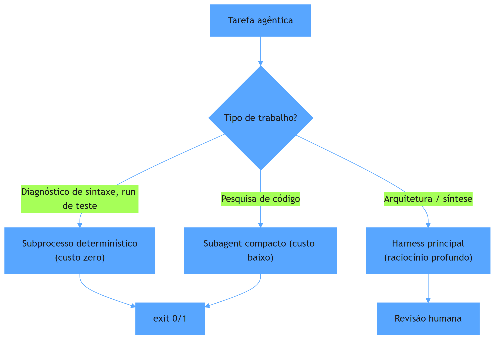

## A escolha consciente do "model: inherit"

A regra de ouro no `AGENTS.md` do ecossistema é `model: inherit` — o harness usa o modelo que a sessão configurou, sem travar um provedor no arquivo de instrução. Isso pode parecer contraditório com o Dia de hoje, mas não é: o ecossistema é um **meta-repositório** que roda em qualquer harness (Claude, Antigravity, OpenCode, MimoCode).

Para um meta-projeto, ancorar um modelo específico sabotaria a agnostização: cada usuário roda com o harness que tem, e a cabine vai além do modelo (Dia 1). O roteamento fino acontece nas **frentes** (`harness_map`) e nas **ferramentas** (subprocesso), não no arquivo de governança. O "model: inherit" é a generalização correta; o roteamento específico é a exceção por tarefa [3].

## Mão na massa

Abra o terminal na pasta `ecossistema-aidd`:

1. Veja o `--harness` e o `--harness-map` no comando de orquestração:

   ```bash
   python ecossistema.py orchestrate --help 2>&1 | grep -A 4 "harness"
   ```

2. Abra o perfil de harnesses de exemplo:

   ```bash
   head -30 .orca/harness_profiles.json 2>/dev/null
   ```

3. Veja como o `AGENTS.md` declara a regra de modelo:

   ```bash
   grep -rn "model\|inherit" AGENTS.md | head
   ```

4. Confirme que as ferramentas rodam como subprocessos sem LLM (a camada de roteamento determinística):

   ```bash
   grep -n "subprocess\|sys.executable" ecossistema.py | head
   ```

5. Explore os scripts que materializam fases sem LLM:

   ```bash
   ls tools/aidd-generator/scripts/ | grep -i "fase\|pipeline"
   ```

## Três regras que ficam

1. Roteamento por tarefa: mecânico → subprocesso (zero), orquestração → perfil barato, síntese → modelo profundo.
2. Harness_map por frente é a forma declarativa de rotear entre modelos sem tocar no código.
3. "Model: inherit" no AGENTS.md é a regra para meta-projetos agnósticos; rotear está no orquestrador, não no arquivo.

## Erros de julgamento deste dia

- Gravar `model: claude-...` no arquivo de instrução de um projeto multi-harness — trava a portabilidade (Dia 15).
- Rodar modelo premium para cada tarefa, ignorando que gates e fases mecânicas custam zero com subprocesso.
- Confundir "roteamento de modelo" com "preferência de um modelo" — a decisão é por frente, não global.

## Checklist do dia

- [ ] Sei explicar as 3 dimensões do roteamento de modelo (custo, janela, qualidade).
- [ ] Entendi o papel de `--harness-map` e `harness_profiles.json` no roteamento por frente.
- [ ] Sei por que `model: inherit` é a regra correta para um meta-repositório.
- [ ] Diferendo roteamento no orquestrador (por frente) de escolha global (no config).
- [ ] Identifiquei no código onde o ecossistema delega para subprocesso (custo zero).

## Para saber mais

1. `ecossistema.py` — opções `--harness`, `--harness-map`, `--profiles` do comando `orchestrate`.
2. `.orca/harness_profiles.json` — o arquivo de perfis por harness.
3. `AGENTS.md` do ecossistema — Supremacia Agnóstica e a regra de modelo.
4. `tools/aidd-generator/scripts/` — as fases executadas como subprocesso sem LLM.

No Dia 14, abrimos a caixa-preta das configurações: o que ninguém te conta sobre `.env`, dependências de harness e a inicialização auto-bootstrap do ecossistema.

# Dia 14 — Configurações que nunca te contam

## Meta do dia

Descobrir a camada que fica **fora do AGENTS.md**: `.env` carregado do jeito certo, `PYTHONPATH` montado por ferramenta, bare. do auto-bootstrap (`requirements.txt` + retry único) e as armadilhas de variável já exportada.

## A ideia em uma frase

Metade das configurações que quebram uma sessão agêntica não está em nenhum markdown — está em **variáveis de ambiente**, **arquivos `.env`** e **caminhos de Python**, e o detalhe que mata é a ordem em que eles são resolvidos.

## A explicação simples

O AGENTS.md instrui o agente, os gates impõem política, mas o ambiente (credentials, URLs, tokens) vivo em **variáveis de ambiente**. E aqui mora o problema mais comum de engenharia agêntica real: o projeto depende de variáveis que o harness — lançado pelo IDE, pelo terminal, por um worktree — **não herdou**.

Três configurações são as campeãs de "ninguém te contou":

**1. `.env` com `override=False`.** O arquivo `.env` da raiz carrega variáveis para `os.environ`, mas **não sobrescreve** as que já existem no processo. Se o terminal já tem `OPENAI_API_KEY=X`, o `.env` com `OPENAI_API_KEY=Y` é silenciosamente ignorado. A ordem importa: variável do processo > `.env` [1].

**2. `PYTHONPATH` por ferramenta.** Cada ferramenta do ecossistema roda com um `PYTHONPATH` próprio que aponta para o diretório dela. Isso faz com que `aidd-generator` importe `aidd_generator` do lugar certo, mesmo com 6 diretórios-irmãos na mesma árvore. Sem essa linha, o Python importaria qualquer coisa de qualquer lugar — pior: nada [2].

**3. Auto-bootstrap com retry único.** O pré-flight do `ecossistema.py` verifica a versão do Python (mínimo 3.10) e, se o usuário passar `--auto-bootstrap`, instala `requirements.txt` e **tenta de novo uma única vez**. Na segunda chamada o script chega ao código real — ou falha com mensagem clara [3].

## O bootstrap na prática

O fluxo de inicialização do `ecossistema.py` é antes de tudo o verdadeiro "segredo" do início de sessão:

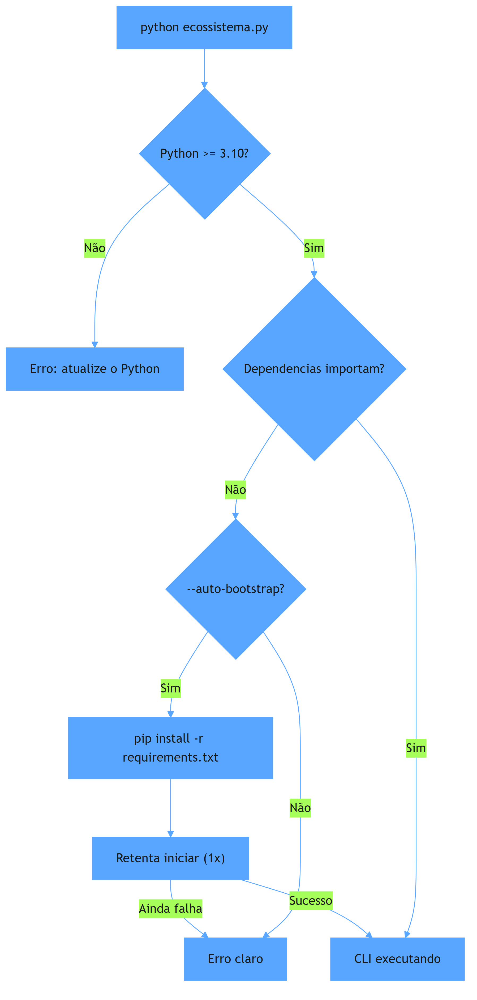

Repare: o auto-bootstrap não é "instalar sempre" — é **instalar sob demanda, apenas quando o usuário pede o flag**, e retentar uma vez. Isso mantém o projeto determinístico: nenhum efeito colateral acontece sem pedido explícito (Dia 2).

## O exemplo real: `load_dotenv` no `ecossistema.py`

No topo do `ecossistema.py`:

```python
load_dotenv(os.path.join(ROOT_DIR, ".env"), override=False)
```

E a função que roda cada ferramenta prepara o ambiente herdando o `os.environ` já mesclado:

```python
merged_env = os.environ.copy()
env = {"PYTHONPATH": forge_dir}
env.update(merged_env)  # na pratica: PYTHONPATH do forge + tudo do .env
```

A lição de ouro escondida aqui: o `load_dotenv` acontece **antes** de qualquer import que possa falhar por faltar credencial, e com `override=False` — o ambiente do shell manda. Quem edita o `.env` esperando trocar a variável do processo vai quebrar o queixo silenciosamente. A prática de configuração que ninguém te contou é: **diagnostique o ambiente com `env | grep` antes de culpar o código** [4].

## Mão na massa

Abra o terminal na pasta `ecossistema-aidd`:

1. Verifique o carregamento do `.env` (não sobrescreve o processo):

   ```bash
   grep -n "load_dotenv\|override" ecossistema.py | head
   ```

2. Veja o `PYTHONPATH` montado por ferramenta:

   ```bash
   grep -n "PYTHONPATH" ecossistema.py
   ```

3. Entenda o pré-flight de versão de Python:

   ```bash
   grep -n "PYTHON_MINIMO" ecossistema.py
   ```

4. Veja se há um `.env.example` como modelo (sem segredos reais):

   ```bash
   ls -la .env* 2>/dev/null; echo "---"; head -20 .env.example 2>/dev/null
   ```

5. Rode o pré-flight explícito (que valida o ambiente antes de qualquer ferramenta):

   ```bash
   python ecossistema.py --help 2>&1 | head -20
   ```

## Três regras que ficam

1. `.env` com `override=False`: o ambiente do processo vence; o `.env` só preenche o que falta.
2. `PYTHONPATH` por ferramenta evita import errado entre 6 diretórios-irmãos — config implícita, mas decisiva.
3. Sempre começar a sessão com um pré-flight de versão/dependência, com bootstrap só sob flag explícita.

## Erros de julgamento deste dia

- Editar o `.env` esperando trocar uma variável que já está exportada no processo — nada muda silenciosamente.
- Rodar a ferramenta sem o `PYTHONPATH` adequado e ver "ModuleNotFoundError" inexplicável.
- Chamar o bootstrap automático sem flag e reclamar que o ambiente instalou coisas sem permissão.

## Checklist do dia

- [ ] Sei a regra `override=False` do `load_dotenv` e quando ela surpreende.
- [ ] Entendo por que `PYTHONPATH` é montado por ferramenta no `ecossistema.py`.
- [ ] Vejo o pré-flight de Python (>= 3.10) e o retry único do auto-bootstrap.
- [ ] Meço o ambiente real com `env | grep` antes de culpar configuração.
- [ ] Sei onde mora o `.env` do projeto e o que ele deve (e não deve) conter.

## Para saber mais

1. `ecossistema.py` — `load_dotenv(..., override=False)` e o merge de ambiente nas ferramentas.
2. `ecossistema.py` — `PYTHON_MINIMO`, `_instalar_requirements()`, `--auto-bootstrap`.
3. `.env.example` — o modelo de variáveis esperadas pelo projeto.
4. Documentação do `python-dotenv` (saurabh-maurya.gitbook.io/python-dotenv) — semântica de `override`.

No Dia 15, os segredos universais: quais princípios deste ecossistema se aplicam a QUALQUER harness que você use.

# Dia 15 — Os segredos universais aplicáveis a qualquer harness

## Meta do dia

Sistematizar as **8 Leis Invioláveis** do `ecossistema-aidd` — e ver como cada uma delas se aplica a qualquer harness (Claude, Antigravity, OpenCode, MimoCode) sem depender de um provedor específico.

## A ideia em uma frase

Há regras que funcionam em qualquer harness porque são leis de engenharia, não convenções de produto: determinismo primeiro, zero stubs, suprema agnóstica e o desenvolvedor no controle.

## A explicação simples

Ao longo de 14 dias, vimos centenas de detalhes do `ecossistema-aidd`. Agora a pergunta é: **quais desses detalhes se aplicam a qualquer projeto, independentemente do harness?** A resposta são as 8 Leis Invioláveis — princípios que o `AGENTS.md` do ecossistema declara como não-negociáveis, e que funcionam em qualquer ambiente [1].

Cada lei é um segredo univers porque seu efeito não depende do modelo nem da ferramenta:

1. **Determinism First** (Lei 1) — scripts determinísticos decidem o que pode ser repetido; o LLM decide o que precisa de julgamento (Dia 2).
2. **Binary Quality** (Lei 2) — exit 0/1, sem "mais ou menos"; gates são a política (Dia 9).
3. **Structured Persistence** (Lei 3) — estado em JSON/SQLite, nunca no histórico conversacional (Dia 8).
4. **Extreme Token Economy** (Lei 4) — cada token conta; pensamento compacto, pipe em comandos (Dia 7).
5. **Zero Stubs, Zero Mocks** (Lei 5) — código stub/moc é código que mentem sobre o que funciona; testes reais substituem (G_TESTES_REAIS).
6. **Supremacy Agnostic** (Lei 6) — governança cannoto a um só provedor; o harness é porta de entrada, não destino (Dia 13).
7. **Developer in Control** (Lei 7) — nenhuma automação roda sem explícito pedido; hook, não instalação silenciosa.
8. **Label Honesty** (Lei 8) — nunca alegar o que não está provado; testes reais definem o que é cobertura (G_HONESTIDADE_ROTULO) [2].

## O exemplo real: como a agnóstica se aplica a qualquer harness

O manifesto `gates/manifesto_harnesses.json` lista os harnesses suportados pelo sync: Claude Code, Antigravity, OpenCode, MimoCode, Gemini CLI. O script `gestor_componentes.py` (`python ecossistema.py components sync`) distribui os componentes de `componentes/compartilhado/skills/` para a pasta de cada harness, corrigindo data de criação.

O que faz isso funcionar em qualquer harness é o princípio: **a pasta canônica (`componentes/`) é a fonte da verdade; as pastas por harness são só destinos de distribuição** [3]. Se amanhã surgir um harness novo, basta uma entrada no manifesto e o sync passa a distribuir.

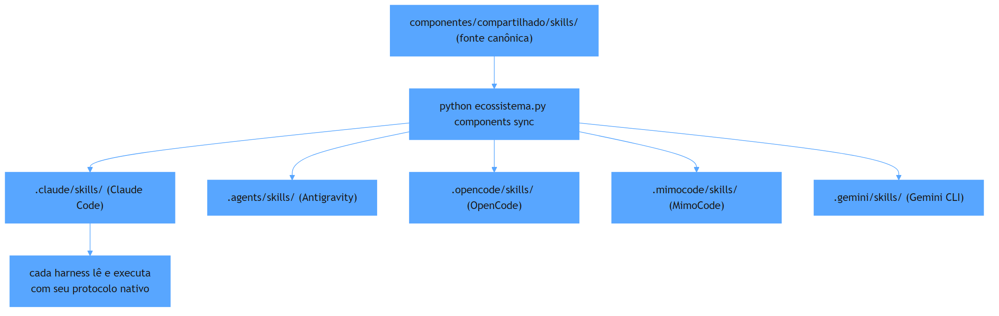

## A universaliade de prática

Considere essas outras práticas que são leis de mercado para qualquer projeto agêntico:

- **Geração contra stubs é fraude**: se o agente gera um teste que dá certo só porque o código é stub, o teste mente (Lei 5).
- **Roteamento declarativo por frente** funciona em qualquer frentes e qualquer harness (Dia 13).
- **Estado serializado em JSON** (`PLANO-EXECUCAO-ESTRUTURADO.json`) é legível por qualquer harness que suporte leitura de arquivo (Dia 5).
- **Python >= 3.10** como mínimo é o preço de usar dataclasses com tipos, `match/case` e `tomllib` — qualquer harness no universo aceita.

## Mão na massa

Abra o terminal na pasta `ecossistema-aidd`:

1. Leia as 8 Leis do AGENTS.md (são ~20 linhas):

   ```bash
   grep -A 20 "Inviolable Laws" AGENTS.md
   ```

2. Veja como o manifesto lista os harnesses:

   ```bash
   cat gates/manifesto_harnesses.json | head -30
   ```

3. Veja os comandos de distribuição:

   ```bash
   python ecossistema.py components --help
   ```

4. Teste a agnóstica: rode o mesmo comando com outro `PYTHONPATH` e veja se muda algo no resultado (não deveria mudar):

   ```bash
   python ecossistema.py status 2>&1 | head -8
   ```

## Três regras que ficam

1. As 8 Leis Invioláveis são leis de engenharia — funcionam em qualquer harness.
2. A agnóstica do ecossistema se materializa num manifesto e num sync — não em heurísticas.
3. Zero stubs + binary quality = o antídoto contra testes que mentem.

## Erros de julgamento deste dia

- Implementar uma lei "quando puder" em vez de tratá-la como não-negociável.
- Manter código stub como "placeholder temporário" que nunca evolui para real.
- Editar a pasta física do harness (`.claude/`) direto em vez de usar `components sync`.

## Checklist do dia

- [ ] Consigo citar as 8 Leis Invioláveis pelo número.
- [ ] Sei onde está o manifesto de harnesses e o que o `components sync` faz.
- [ ] Entendo por que a fonte canônica é `componentes/compartilhado/` e as pastas por harness são só destino.
- [ ] Identifiquei na prática qual lei aplica ao seu próximo projeto, independentemente do harness.
- [ ] Entendi o efeito das leis 5 e 8 no código real (gates `G_TESTES_REAIS` e `G_HONESTIDADE_ROTULO`).

## Para saber mais

1. `AGENTS.md` do ecossistema — "Inviolable Laws" completas (linhas ~10-30).
2. `gates/manifesto_harnesses.json` — a lista de harnesses suportados.
3. Script `scripts/gestor_componentes.py` — `sync` e `verify` de distribuição.
4. `gates/G_HONESTIDADE_ROTULO.py` — a implementação da Lei 8.

No Dia 16, encerramos com o panorama completo: a fábrica agêntica AIDD de ponta a ponta — do ideia ao software testado.

# Dia 16 — Arquitetura para desenvolvimento com IA: o sistema que constrói sistemas

## Meta do dia

Fechar o ciclo compreendendo o **ecossistema AIDD como arquitetura viva**: como as 6 ferramentas, os 16 gates, a orquestração multi-harness e as 8 leis formam um sistema que transforma uma ideia em software testado — e o que disso leva você para qualquer projeto.

## A ideia em uma frase

Um ecossistema agêntico não é "uma IA que programa" — é um **sistema que constrói sistemas**: pipeline declarativo, gates que bloqueiam, orquestração que decide, e a governança que mantém tudo honesto.

## A explicação simples

Ao longo de 15 dias, vimos as camadas: a cabine (Dias 1-3), a bancada (Dias 4-8), a linha de montagem (Dias 9-12) e o ofício do arquiteto (Dias 13-15). Agora vamos juntar tudo num panorama que mostra como o `ecossistema-aidd` se organiza como arquitetura viva.

A premissa central é: **um repositório não é um projeto — é uma fábrica**. E a fábrica tem etapas, portões de qualidade e um orquestrador que decide quem faz o quê [1].

## O exemplo real: o fluxo de ponta a ponta

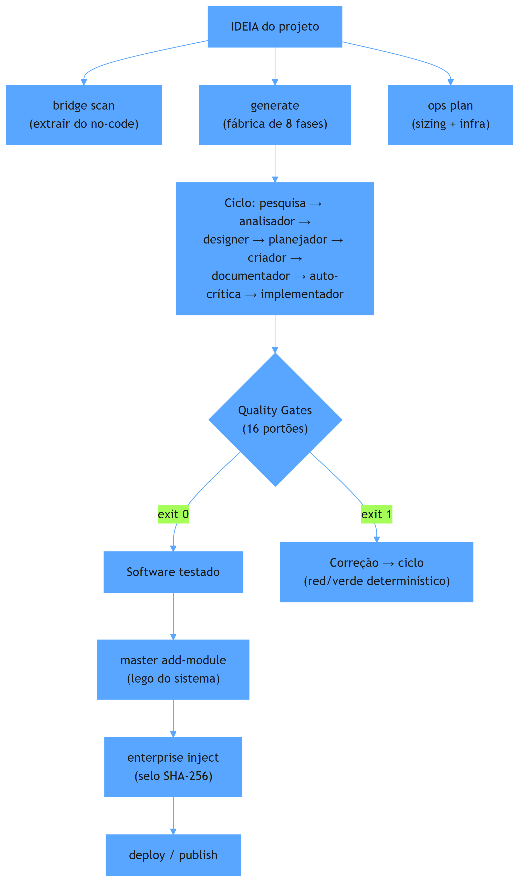

## As 6 ferramentas como etapas de uma fábrica

Relembre a tabela que abrimos no Dia 4, agora com o contexto completo:

| Ferramenta | Papel na fábrica | Analogia |
|---|---|---|
| aidd-forge | Cria ambientes isolados, governança e determinismo básico | O chassi |
| aidd-generator | Converte uma ideia em código por 8 fases com gates | A linha de montagem |
| aidd-master | Organiza o código em módulos modulares com SQLite WAL | Os blocos de Lego |
| aidd-enterprise | Aplica verificação criptográfica e zero-trust | O selo de auditoria |
| aidd-ops | Dimensiona infraestrutura (Docker, VPS, hardening) | A pista e o abastecimento |
| aidd-bridge | Extrai projetos low-code e migra para VPS própria | O tradutor |

O `ecossistema.py` é a porta de entrada: uma CLI unificada que roteia comandos para a ferramenta certa, monta o `PYTHONPATH`, carrega o `.env` e resolve dependências. Quando uma ferramenta vira um subprocesso, o ecossistema mede o resultado com exit code — a mesma moeda binária dos dias 2 e 9 — e esse gerenciamento de fluxo é o que transforma a fábrica num sistema confiável [2].

## Os 16 gates como sistema nervoso

Não são 16 soluções isoladas — é um sistema que valida **em todas as dimensões**:

- Integridade do repositório (`G_ECOSSISTEMA_INTEGRIDADE`, `G_ARQUITETURA_DELIVERABLE`)
- Segurança (`G_SEGREDOS`, `G_HADOLINT`, `G_SAST` implicito)
- Qualidade (`G_TESTES_REAIS`, `G_HONESTIDADE_ROTULO`, `G_COBERTURA`)
- Governança (`G_DRIFT_NUCLEO_COMPARTILHADO`, `G_HARNESS_COMPAT`, `G_UNIVERSAL_HARNESS`)
- Economia (`G_ZERO_HEADLESS`, `G_ESCRITOR_ATOMICO`)

E a lista de allowlists é o compromisso com a transparência: quando algo é dispensado, está documentado, revisado e versionado.

## O modelo que o ecossistema entrega

No Dia 12 vimos a orquestração. No Dia 13, o roteamento. A síntese destes dois é: **a fábrica não executa tarefas — ela executa frentes, com isolamento, em paralelo, e devolve resultados testados**.

Isso muda o paradigma do "programador e a IA": o humano define o plano, o ecossistema o executa, os gates garantem a qualidade, e o resultado é um sistema que se constrói e se mantém com governança.

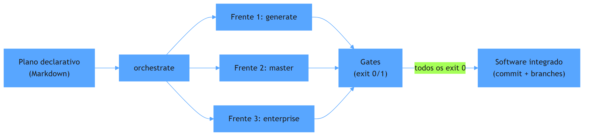

## O que levar para qualquer projeto

Se você entendeu as 8 Leis, aplicou os 3 modos de orquestração e usou pelo menos 2 ferramentas, você já tem o que levar:

1. **Um `AGENTS.md` com leis claras** — não regras vagas; limites binários.
2. **Gates de qualidade mínimos** — pelo menos um que valide o que é real.
3. **Estado em JSON** — não dependa de memória conversacional.
4. **Orquestração por frente** — nem tudo pode rodar no mesmo contexto.
5. **Honestidade do rótulo** — nunca alegar o que não foi testado.

O resultado é que o ecossistema-aidd se apresenta como o "sistema que constrói sistemas": a cada rodada, a linha de montagem produz código, os gates o avaliam, e apenas o que passa de verdade é integrado — sem stubs, sem mocks, sem promessas que os testes não confirmam [3].

O `ecossistema-aidd` é isso: não um software, mas um **método para construir software com IA**. E o método, diferente do modelo, você controla.

## Mão na massa: checklist final

1. Rode o status completo do ecossistema:

   ```bash
   python ecossistema.py status
   ```

2. Liste todos os gates reais (não só os do README):

   ```bash
   ls gates/G_*.py | wc -l
   ```

3. Veja o manifesto de harnesses:

   ```bash
   cat gates/manifesto_harnesses.json | head -10
   ```

4. Rode o audit completo — a inspeção periódica que tudo valida:

   ```bash
   python ecossistema.py audit 2>&1 | tail -20
   ```

5. Leia as 8 Leis uma última vez — e decida quais você vai implementar amanhã.

## Três regras que ficam (as 3 últimas)

1. A fábrica não é a IA — é o **sistema** que orchestra a IA: cli, gates, hooks e governança.
2. Software não é produto; é o resultado de um processo com gates que bloqueiam o que não está pronto.
3. O que você leva para qualquer projeto não é o código — são as leis, os padrões e a mentalidade determinística.

## Erros de julgamento deste dia (finais)

- Pular da ideia direto para o código sem definir o plano de frentes e os gates.
- Achar que "basta ter IA" e ignorar a camada de governança e determinismo.
- Tratar o ecossistema como projeto final em vez de método — o método é que se replica.

## Checklist do dia

- [ ] Consigo descrever o fluxo ponta a ponta de uma ideia a software testado.
- [ ] Sei nomear as 6 ferramentas e o papel de cada uma na fábrica.
- [ ] Entendo por que os 16 gates são um sistema nervoso, não soluções avulsas.
- [ ] Tenho pelo menos 3 ações concretas para implementar no meu projeto amanhã.
- [ ] Sei que o método se replica: as leis e os gates funcionam em qualquer harness.

## Para saber mais (leituras finais)

1. README do ecossistema-aidd — o mapa completo (github.com/heverton-dev/ecossistema-aidd).
2. `AGENTS.md` do ecossistema — as 8 Leis Invioláveis e a governança canônica.
3. `ecossistema.py` — a CLI unificada que orquestra tudo.
4. `docs/protocolos/AGENTS-REFERENCIA-COMPLETA.md` — a referência completa da governança.

Fim da jornada de 16 dias. Você não saiu apenas sabendo "usar um assistente de IA" — saiu com o método para construir assistentes de IA que funcionam, que têm porta, e que se mantêm honestos. Boa sorte com o seu próximo ecossistema.