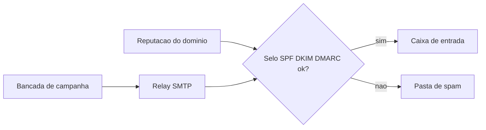

# Capítulo 2: E-mail Marketing: Enviando Campanhas Sem Depender do Mailchimp

## 1. Introdução

No Capítulo 1, você trocou o aluguel do Notion e do Evernote pela posse de uma ferramenta própria — uma peça que você mesmo escolheu, instalou e passou a manter na sua oficina. A régua ali era relativamente simples: instalar, configurar, usar, e a peça funcionava exatamente como prometido, sem depender de nada fora da sua bancada. O e-mail marketing rasga essa régua. Você pode instalar a melhor ferramenta open source do mercado, configurá-la com perfeição e ainda assim ver suas campanhas caírem inteiras na caixa de spam — porque, diferente de uma nota ou um quadro kanban, um e-mail só existe de verdade quando atravessa a porta de outra empresa e passa pelo crivo de um algoritmo de reputação que você não controla.

Neste capítulo você vai entender por que "enviar e-mail" e "ferramenta de e-mail" são duas peças diferentes do catálogo — a confusão mais cara que existe nessa categoria —, vai montar sua própria bancada de campanhas com Listmonk, Mautic e Postal, e vai aprender a auditoria que separa uma peça de código aberto de verdade de uma imitação comercial disfarçada de grátis, usando o EmailEngine como o contraexemplo que ensina essa lição para o resto da vida.

## 2. Explica

Uma campanha de e-mail marketing tem duas responsabilidades que o Mailchimp empacota tão bem que a maioria dos usuários nunca percebe que são coisas distintas. A primeira é a **composição da campanha**: montar a lista de contatos, desenhar o template, agendar o disparo, medir abertura e clique. A segunda é a **entrega**: fazer o e-mail realmente atravessar a internet e chegar à caixa de entrada do destinatário sem ser classificado como spam. Quando você paga o Mailchimp, você paga pelas duas coisas ao mesmo tempo, numa única mensalidade. Quando você monta sua própria stack, precisa resolver as duas separadamente — e é exatamente aí que a maioria das trocas para open source falha.

A parte técnica da entrega chama-se **relay SMTP**: um servidor que aceita o e-mail da sua ferramenta de disparo e o retransmite para o servidor de destino usando o protocolo SMTP (Simple Mail Transfer Protocol). Ferramentas de newsletter como o Listmonk **não incluem um motor SMTP próprio confiável** — elas dependem de um relay externo, seja um serviço comercial (Amazon SES, Postmark, Mailgun) seja uma infraestrutura própria como o Postal [6][9]. Isso já é a primeira quebra de expectativa de quem vem do mundo SaaS: instalar o Listmonk não é o fim da jornada, é o meio.

A segunda peça teórica é a **reputação de domínio**, sustentada por três registros DNS que funcionam como um selo de garantia read-only pelos provedores de e-mail do mundo todo: SPF (Sender Policy Framework, que declara quais servidores têm permissão de enviar em nome do seu domínio), DKIM (DomainKeys Identified Mail, uma assinatura criptográfica que garante que o conteúdo não foi alterado no caminho) e DMARC (Domain-based Message Authentication, Reporting and Conformance, que diz ao provedor de destino o que fazer quando SPF ou DKIM falham). Sem esses três registros configurados corretamente, e-mails caem no spam independentemente da qualidade do conteúdo ou da ferramenta usada para o disparo [6][5]. Um relatório de benchmark de 2025 dedicado inteiramente a esse tema mede, entre outras coisas, a taxa de colocação de e-mails legítimos na caixa de entrada — e é essa métrica, não o número de recursos de uma ferramenta, que decide se sua campanha "funcionou" [1].

A terceira peça, mais sutil, é a diferença entre **código aberto de verdade** e **software gratuito por tempo limitado**. Uma ferramenta pode estar hospedada publicamente no GitHub, ter código totalmente visível e ainda assim não ser open source — o critério não é "posso ler o código", é "a licença me permite rodar, modificar e redistribuir em produção sem pagar". Essa distinção parece jurídica, mas tem consequência prática direta: decide se você está comprando uma peça ou alugando uma peça disfarçada de compra. Você vai ver esse contraste de forma concreta ainda neste capítulo.

## 3. Ilustra

Pense na sua oficina como uma metalúrgica pequena que aceita encomendas por correspondência. A **bancada de campanha** (Listmonk, Mautic) é onde você desenha a peça: escreve a carta, escolhe o papel, decide para quem vai. Mas a bancada não tem uma frota de entregadores — para isso existe uma **esteira de entrega** por trás da parede da oficina (o relay SMTP, como o Postal), que empilha as cartas nos caminhões e as leva até a porta do destinatário. E na porta de cada destinatário existe um porteiro rigoroso, o filtro anti-spam do provedor de e-mail, que só deixa entrar caminhões com um **selo de garantia** válido no para-choque — o conjunto SPF/DKIM/DMARC. Um caminhão sem selo é mandado de volta para o depósito de spam, mesmo que a carta dentro dele seja impecável.

Como Artesão Digital, você já entende que toda peça da sua oficina exige manutenção — mas a esteira de entrega tem uma particularidade que nenhuma outra ferramenta deste livro tem até agora: sua reputação não é sua, é **emprestada e reconstruída a cada envio**. Um caminhão com histórico limpo de entregas ganha passagem livre pelos postos de fiscalização; um caminhão novo, ou um que já levou spam antes, é parado e revistado — mesmo que hoje esteja carregando cartas legítimas. É por isso que a primeira campanha enviada por um domínio novo quase sempre tem taxa de entrega pior do que a décima: a reputação se constrói com o tempo, não se compra com a licença da ferramenta.

Esse é o ponto mais difícil de aceitar para quem vem do SaaS: no Mailchimp, a reputação do domínio de envio pertence, em parte, à infraestrutura compartilhada da própria empresa — você "aluga" um pedaço da reputação coletiva deles junto com a ferramenta. Ao montar sua própria esteira de entrega, você assume a responsabilidade inteira por aquele selo de garantia, sozinho. É a mesma lógica de posse versus aluguel do Capítulo 1, só que agora a peça que você "compra" carrega uma obrigação contínua de manutenção que uma nota do Logseq nunca teve.



## 4. Técnica

### O selo de garantia: publicando SPF, DKIM e DMARC

Antes de instalar qualquer ferramenta, resolva a esteira de entrega — é a parte que, se pulada, faz toda a bancada parecer quebrada mesmo estando perfeita. Os três registros vivem no DNS do seu domínio como entradas do tipo TXT. O exemplo abaixo mostra a estrutura mínima que você publicaria no painel do seu provedor de DNS para um domínio de envio dedicado, prática recomendada para não misturar a reputação do e-mail transacional com a do e-mail de marketing [6][9]:

```yaml
# registros-dns-campanhas.yaml
dominio: campanhas.suaoficina.com.br
registros:
  - tipo: TXT
    nome: campanhas.suaoficina.com.br
    valor: "v=spf1 include:_spf.postal.suaoficina.com.br ~all"
  - tipo: TXT
    nome: postal-dkim._domainkey.campanhas.suaoficina.com.br
    valor: "v=DKIM1; k=rsa; p=MIGfMA0GCSqGSIb3DQEBAQUAA4GNADCBiQKBgQC"
  - tipo: TXT
    nome: _dmarc.campanhas.suaoficina.com.br
    valor: "v=DMARC1; p=quarantine; rua=mailto:dmarc@suaoficina.com.br"
```

Depois de publicar, verifique com uma consulta DNS direta — nunca confie só no painel do provedor, confirme que o registro realmente propagou:

```console
$ dig TXT campanhas.suaoficina.com.br +short
"v=spf1 include:_spf.postal.suaoficina.com.br ~all"

$ dig TXT _dmarc.campanhas.suaoficina.com.br +short
"v=DMARC1; p=quarantine; rua=mailto:dmarc@suaoficina.com.br"
```

Para quem prefere automatizar essa checagem em vez de repetir `dig` manualmente antes de cada campanha, um script pequeno já resolve a parte mais comum de erro humano — esquecer a política de falha no final do registro SPF:

```python
def validar_spf(registro):
    """Confere se um registro SPF tem a forma minima esperada.

    Um registro SPF valido comeca com 'v=spf1' e termina com uma
    politica de falha: '~all' (soft fail, recomendado ao comecar)
    ou '-all' (hard fail, para dominios com reputacao ja madura).
    Sem essa politica, o registro fica incompleto e provedores mais
    rigorosos podem simplesmente ignorar a autorizacao do relay.
    """
    registro = registro.strip()
    if not registro.startswith("v=spf1"):
        return False, "registro nao comeca com 'v=spf1'"
    if not (registro.endswith("~all") or registro.endswith("-all")):
        return False, "registro sem politica de falha (~all ou -all)"
    return True, "registro SPF valido"


if __name__ == "__main__":
    exemplos = [
        "v=spf1 include:_spf.postal.suaoficina.com.br ~all",
        "v=spf1 include:_spf.postal.suaoficina.com.br",
    ]
    for spf in exemplos:
        ok, motivo = validar_spf(spf)
        print(f"{spf!r} -> {ok} ({motivo})")
```

Rodar esse script antes de cada campanha grande é uma daquelas peças de manutenção barata que evita um prejuízo caro: uma campanha inteira devolvida pelo provedor de destino por um `~all` esquecido.

### Montando a bancada: Listmonk, Mautic e Postal — o que cada um resolve

Com o selo de garantia publicado, é hora de escolher as peças da bancada propriamente dita. O mercado de alternativas ao Mailchimp/ActiveCampaign se divide em duas famílias bem distintas, e confundi-las é o erro mais comum de quem começa essa troca.

A primeira família são ferramentas de **newsletter e mailing enxutas**. O **Listmonk** é a referência aqui: um binário único escrito em Go, licenciado sob AGPLv3, sem dependências pesadas além de um banco Postgres [9][6]. A instalação não roda migração de banco automaticamente — é preciso um passo explícito de setup antes do primeiro uso [9][6]. Ele não trata bounces de forma inteligente por padrão e é mais fraco em automações visuais estilo funil do que uma ferramenta de automação completa [5][10], mas é imbatível em simplicidade operacional para quem só precisa disparar newsletters em volume.

A segunda família é a de **automação de marketing full-stack**, cujo representante mais maduro é o **Mautic**. Diferente do Listmonk, o Mautic tenta competir diretamente com o ActiveCampaign: segmentação avançada, jornadas automatizadas, pontuação de leads. O preço dessa ambição é a infraestrutura: os requisitos mínimos reais de produção são 4 GB de RAM, 2 vCPU e 40 GB de disco [13]. Há também um teto conhecido de escala que pega muita gente desprevenida — a partir de segmentos com mais de 50.000 contatos, o processo de construção do segmento estoura o limite padrão de memória do PHP [13][14]. As imagens Docker oficiais da versão 5 adotaram uma abordagem de "microsserviços" que a própria comunidade considera desnecessariamente complexa para instalações pequenas; a recomendação prática é rodar só dois containers — Mautic e MariaDB — em vez do conjunto completo sugerido pela documentação oficial [14]. Um detalhe operacional que quebra silenciosamente: os cron jobs do Mautic são críticos, e se pararem de rodar, campanhas e segmentos "morrem" sem aviso nenhum na interface [14].

A terceira peça — a que a maioria dos tutoriais de internet esquece de mencionar — é a **infraestrutura de envio** propriamente dita. O **Postal** não é uma ferramenta de campanha, é o equivalente self-hosted a um Mailgun ou SendGrid: construído em Rails com MySQL e RabbitMQ, exigindo uma máquina virtual dedicada só para ele [16][17]. A combinação recomendada pela própria comunidade técnica é usar Postal como camada de envio e Listmonk como camada de campanha — cada ferramenta na função para a qual foi desenhada [5]. A deliverability real do Postal depende de fatores que nenhuma ferramenta resolve por você: IP dedicado com reputação própria, porta 25 liberada no provedor de VPS, registros MX/SPF/DKIM/rDNS corretos, e um período de "aquecimento" gradual do IP antes de disparar grandes volumes [17].

A tabela abaixo resume a decisão que você precisa tomar antes de instalar qualquer coisa:

| Sua necessidade | Peça recomendada | O que ela NÃO resolve |
|---|---|---|
| Só disparar newsletter/mailing em volume | Listmonk | Relay SMTP próprio, automação avançada |
| Automação de marketing com jornadas e pontuação | Mautic | Infraestrutura de envio própria; exige servidor robusto |
| Controle total da entrega, IP e reputação | Postal | Interface de campanha; não substitui Listmonk/Mautic |
| Máximo de controle ponta a ponta | Postal + Listmonk juntos | Tempo de configuração inicial e de aquecimento de IP |

Na prática, subir o Listmonk com Postgres via Docker Compose é o primeiro passo mais direto da bancada:

```yaml
# docker-compose.yml
services:
  listmonk-db:
    image: postgres:16-alpine
    restart: unless-stopped
    environment:
      POSTGRES_USER: listmonk
      POSTGRES_PASSWORD: "<senha-forte-aqui>"
      POSTGRES_DB: listmonk
    volumes:
      - listmonk-data:/var/lib/postgresql/data
  listmonk:
    image: listmonk/listmonk:latest
    restart: unless-stopped
    ports:
      - "9000:9000"
    environment:
      LISTMONK_db__user: listmonk
      LISTMONK_db__password: "<senha-forte-aqui>"
      LISTMONK_db__database: listmonk
      LISTMONK_db__host: listmonk-db
    depends_on:
      - listmonk-db
volumes:
  listmonk-data:
```

O passo que a maioria esquece — e que gera o primeiro chamado de suporte de quem está começando — é que o Listmonk não cria o esquema do banco sozinho no primeiro `up`. É preciso rodar o instalador explicitamente antes de subir o serviço em modo normal [9][6]:

```console
$ docker compose run --rm listmonk ./listmonk --install
* Verificando conexao com o banco de dados... ok
* Criando esquema do banco de dados
* Configurando definicoes iniciais
* Criando usuario administrador
Setup concluido. Acesse http://localhost:9000/admin

$ docker compose up -d
[+] Running 2/2
 - Container listmonk-db  Started
 - Container listmonk     Started
```

### Auditando a licença: o contraexemplo do EmailEngine e o alerta do Mailtrain

A última peça deste capítulo não é uma ferramenta para instalar, é um hábito para adquirir: **antes de apostar sua oficina em qualquer projeto do GitHub, audite a licença e a cadência de manutenção, não só a estrela e a lista de recursos**. Dois casos reais desta categoria ilustram por que esse hábito compensa.

O primeiro é o **EmailEngine**, um cliente de e-mail "headless" frequentemente citado em listas de "alternativas grátis" de automação de e-mail. O código está publicamente visível no GitHub, o que faz muita gente assumir, de cara, que é open source [8]. Não é. A documentação oficial de licenciamento é explícita: o uso em produção exige uma licença comercial paga depois de um trial de 14 dias [18]. Código visível não é sinônimo de licença livre — é a diferença entre "posso olhar a peça na vitrine" e "posso levar a peça pra casa sem pagar". Trate qualquer lista de "alternativas open source" que inclua o EmailEngine sem essa ressalva como uma lista que não foi auditada de verdade.

O segundo caso é diferente: o **Mailtrain** é, de fato, open source — grátis, sem limite de assinantes, código sob licença livre [12]. O alerta aqui não é de licença, é de **manutenção**: apesar de reunir cerca de 5.700 estrelas no GitHub, o último release público do projeto é de junho de 2021 [12][11]. Uma peça sem manutenção nova por anos acumula risco silencioso — vulnerabilidades de segurança conhecidas não são corrigidas, e a compatibilidade com versões novas de Node.js e MySQL/MariaDB vai se degradando [11]. Isso não significa "nunca use", significa "se usar, saiba que está sozinho na manutenção — o mesmo tipo de responsabilidade que discutimos na esteira de entrega, mas agora aplicada ao próprio código".

Um checklist rápido de auditoria, na forma de um registro que você pode manter por ferramenta candidata à sua oficina:

```json
{
  "ferramenta": "EmailEngine",
  "licenca": "source-available (nao FOSS)",
  "trial_dias": 14,
  "ultimo_release": "ativo, mas sob licenca comercial apos o trial",
  "veredito": "nao usar como base gratuita de producao"
}
```

Antes de instalar qualquer peça nova nesta oficina — não só de e-mail, qualquer categoria deste livro —, confira estes quatro pontos, nesta ordem: (1) qual é a licença exata, lida na documentação oficial e não em blog de terceiros; (2) quando foi o último release com tag; (3) quantas issues abertas existem em relação a fechadas; (4) se existe comunidade ativa respondendo perguntas recentes. É o mesmo teste que separa uma peça compensadora de um aluguel disfarçado.

## 5. Aplica

Você acabou de subir o Listmonk, importou sua lista de 8.000 contatos que estava presa no Mailchimp há dois anos e disparou a primeira campanha de boas-vindas direto pela porta 25 padrão do seu próprio VPS, sem configurar nenhum relay dedicado. Meia hora depois, o painel de estatísticas mostra uma taxa de abertura visivelmente baixa — abaixo até dos padrões mais modestos do e-mail marketing, motivo de alarme imediato. O instinto nesse momento é culpar o conteúdo do e-mail, reescrever o assunto, trocar a imagem do cabeçalho. Esse é o erro: você está tentando resolver um problema de conteúdo quando o problema real é de reputação. Um domínio novo, sem SPF, sem DKIM, sem DMARC, disparando pela porta 25 de um provedor de VPS genérico — que a esta altura você já sabe que costuma ser bloqueada ou fortemente limitada pelos grandes provedores justamente para conter spam — está sendo silenciosamente filtrado antes mesmo de o destinatário abrir a caixa de entrada. O diagnóstico correto, voltando à seção Explica deste capítulo, é que a bancada de campanha (o Listmonk) fez exatamente o que devia fazer; quem faltou foi a esteira de entrega com o selo de garantia validado. A correção não é reescrever o e-mail — é publicar SPF/DKIM/DMARC, configurar um relay dedicado (Postal ou um serviço comercial de reputação já estabelecida) e reenviar a mesma campanha, sem alterar uma linha do conteúdo, para um grupo de teste menor primeiro.

Como Artesão Digital, essa cena deveria mudar permanentemente a ordem em que você monta qualquer stack de e-mail: primeiro a esteira de entrega, só depois a bancada de campanha — nunca o contrário.

Armadilhas comuns que a cena acima resume, na prática do dia a dia:

- Instalar a ferramenta de disparo e pular a configuração de SPF/DKIM/DMARC, tratando-a como "opcional" ou "para depois".
- Disparar grandes volumes no primeiro dia com um domínio novo, sem período de aquecimento de IP — o equivalente a mandar um caminhão sem histórico de entregas direto para a rota mais concorrida.
- Confiar em uma lista de "melhores alternativas ao Mailchimp" sem verificar se cada item da lista é, de fato, open source (o caso EmailEngine) ou está tecnicamente abandonado (o caso Mailtrain).
- Tratar Mautic como "só mais uma instalação Docker", ignorando que os cron jobs precisam de monitoramento contínuo — quando param, campanhas morrem em silêncio, sem erro visível no painel.

Em termos de escala, vale registrar onde cada peça desta bancada aguenta e onde quebra: o Listmonk, sendo um binário leve em Go, sustenta volumes de disparo grandes sem esforço de infraestrutura adicional — o gargalo nunca é o Listmonk, é sempre a reputação do caminho de entrega [9]. O Mautic, por outro lado, tem teto de escala concreto e documentado: acima de 50.000 contatos por segmento, o processo de segmentação estoura a memória padrão do PHP e passa a exigir ajuste manual de recursos do servidor [13][14]. Nenhuma das duas peças escala "infinitamente sem contrapartida" — e um relatório de benchmark dedicado ao tema mostra que a taxa de colocação na caixa de entrada, não o número de contatos, é a métrica que de fato separa uma operação de e-mail marketing saudável de uma fracassada [1].

### Exercício
- [ ] Publique os três registros DNS (SPF, DKIM, DMARC) do seu domínio de envio e confirme a propagação com `dig` ou `nslookup`
- [ ] Suba o Listmonk com Docker Compose, rode o instalador e envie uma campanha de teste para uma lista pequena (menos de 20 contatos)
- [ ] Rode o script `validar_spf` deste capítulo contra o registro SPF real do seu domínio
- [ ] Monte o checklist de auditoria de licença (formato JSON deste capítulo) para duas ferramentas "open source" que você usa ou pretende usar

## 6. Conclusão

Este capítulo separou o e-mail marketing em três peças que o Mailchimp costuma empacotar como uma só: a esteira de entrega com seu selo de garantia SPF/DKIM/DMARC, a bancada de campanha propriamente dita — Listmonk para newsletter enxuta, Mautic para automação completa, Postal como infraestrutura de envio dedicada —, e o hábito de auditoria de licença que separa código aberto de verdade (Mailtrain, com ressalva de manutenção) de software comercial disfarçado (EmailEngine). Domine essas três peças e você deixa de ser alguém que "instala uma ferramenta de e-mail" e passa a ser alguém que entende por que uma campanha chega — ou não chega — à caixa de entrada.

No Capítulo 3, essa mesma disciplina de separar "o que a ferramenta promete" de "o que ela realmente entrega sem apoio externo" volta a valer, com uma pergunta parecida: até onde um CRM open source cobre pipeline e atendimento antes de você sentir a falta de integrações e suporte formal de um Salesforce. Antes de virar a página, garanta que sua esteira de entrega está publicada e validada — é a fundação sobre a qual qualquer campanha futura, deste capítulo em diante, vai depender.

## 7. Referências Bibliográficas

[1] VALIDITY. *2025 Email Deliverability Benchmark Report*. Disponível em: https://www.validity.com/resource-center/2025-email-deliverability-benchmark-report/. Acesso em: 19 ago. 2026.

[2] AWESOME-SELFHOSTED. *A list of Free Software network services and web applications which can be hosted on your own servers*. Disponível em: https://github.com/awesome-selfhosted/awesome-selfhosted. Acesso em: 19 ago. 2026.

[3] 6SENSE. *ActiveCampaign vs Mautic: Marketing Automation Platforms Comparison*. Disponível em: https://6sense.com/tech/marketing-automation/activecampaign-vs-mautic. Acesso em: 19 ago. 2026.

[4] SOLVOHQ. *awesome-self-host-saas-alternatives: Curated list of strictly self-hostable open-source alternatives to popular SaaS*. Disponível em: https://github.com/SolvoHQ/awesome-self-host-saas-alternatives. Acesso em: 19 ago. 2026.

[5] OCTABYTE. *Best Open Source Alternatives to Mailchimp: Listmonk vs Postal vs Mautic*. Disponível em: https://blog.octabyte.io/posts/open-source-alternative-to-mailchimp/. Acesso em: 19 ago. 2026.

[6] LISTMONK. *Documentation*. Disponível em: https://listmonk.app/docs/. Acesso em: 19 ago. 2026.

[7] POSTAL. *Documentation*. Disponível em: https://docs.postalserver.io/. Acesso em: 19 ago. 2026.

[8] POSTALSYS. *emailengine: Headless email client*. Disponível em: https://github.com/postalsys/emailengine. Acesso em: 19 ago. 2026.

[9] KNADH. *listmonk: High performance, self-hosted, newsletter and mailing list manager*. Disponível em: https://github.com/knadh/listmonk. Acesso em: 19 ago. 2026.

[10] LEINSS, Tobias. *Listmonk vs Mailchimp: the newsletter I self-host instead*. Disponível em: https://leinss.xyz/blog/en/listmonk-vs-mailchimp/. Acesso em: 19 ago. 2026.

[11] SAASHUB. *Mailtrain VS MailChimp - compare differences & reviews*. Disponível em: https://www.saashub.com/compare-mailtrain-vs-mailchimp. Acesso em: 19 ago. 2026.

[12] MAILTRAIN-ORG. *mailtrain: Self hosted newsletter app*. Disponível em: https://github.com/Mailtrain-org/mailtrain. Acesso em: 19 ago. 2026.

[13] MAUTIC. *Mautic Requirements*. Disponível em: https://mautic.org/mautic-requirements/. Acesso em: 19 ago. 2026.

[14] MAUTEAM.ORG. *Mautic Self-Hosted Best Practices*. Disponível em: https://mauteam.org/mautic/mautic-admins/mautic-hosting-mautic-self-hosted-best-practices/. Acesso em: 19 ago. 2026.

[15] MAUTIC. *mautic/mautic: Open Source Marketing Automation Software*. Disponível em: https://github.com/mautic/mautic. Acesso em: 19 ago. 2026.

[16] POSTALSERVER. *postal: A fully featured open source mail delivery platform for incoming & outgoing e-mail*. Disponível em: https://github.com/postalserver/postal. Acesso em: 19 ago. 2026.

[17] POSTAL. *Pre-requisites*. Disponível em: https://docs.postalserver.io/getting-started/prerequisites/. Acesso em: 19 ago. 2026.

[18] EMAILENGINE. *Pricing & Licensing*. Disponível em: https://learn.emailengine.app/docs/licensing. Acesso em: 19 ago. 2026.
