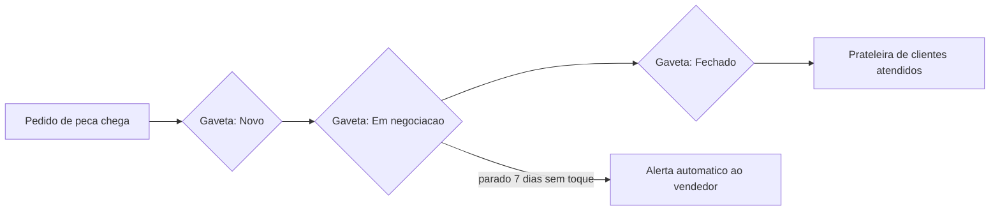
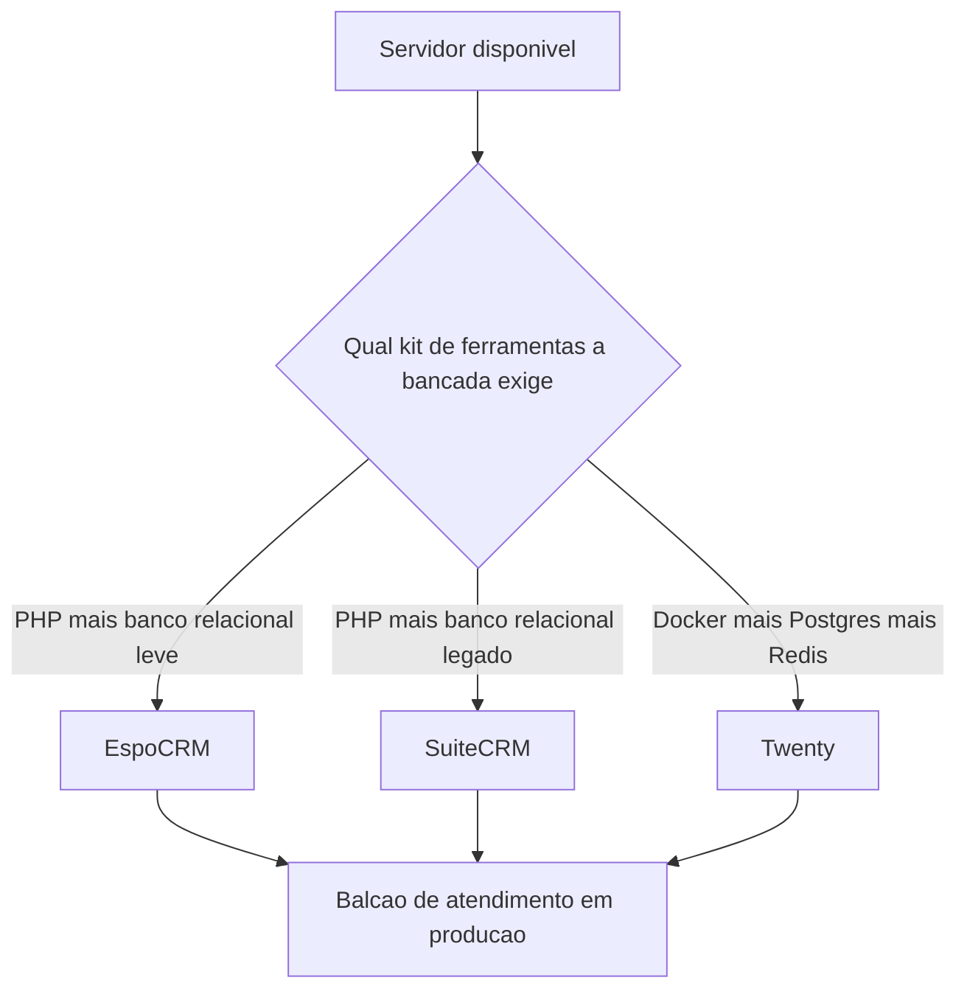
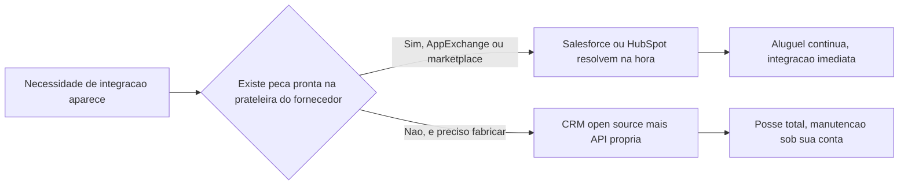

# Capítulo 3: CRM — Vendendo e Atendendo Sem Pagar Salesforce

## 1. Introdução

No Capítulo 2, você descobriu a conta oculta do e-mail marketing "grátis": reputação de domínio e deliverability, dois custos que o Mailchimp escondia dentro da mensalidade e que passaram a ser seu problema no momento em que você montou a própria stack de envio. O CRM guarda a mesma lição, só que com outro nome. Aqui, a conta oculta não é reputação de domínio — é tuning de servidor e maturidade de integração. E, como toda peça boa de oficina, ela vem com uma etiqueta de manutenção que o vendedor da loja de aluguel nunca mostra na vitrine.

Este capítulo resolve uma pergunta prática: até onde um CRM open source substitui de verdade o Salesforce, o HubSpot ou o Pipedrive — e onde a comparação simplesmente para. Você vai instalar e comparar três ferramentas em produção (EspoCRM, Twenty e SuiteCRM), entender o que cada uma cobre bem hoje e sair com um critério de decisão para saber quando vale trocar o aluguel pela posse, e quando a mensalidade ainda compra algo que sua bancada não tem.

## 2. Explica

Um CRM, reduzido ao essencial, é composto por quatro peças: um funil de vendas (pipeline) com estágios nomeados, uma ficha de contato com histórico de interação, uma camada de automação que reage a mudanças de estágio, e uma superfície de relatório que resume tudo isso para quem toma decisão. Toda a mitologia em torno de "inteligência artificial nativa" e "score preditivo" que os grandes fornecedores vendem como diferencial vem depois dessas quatro peças, não no lugar delas.

O mercado de CRM open source maduro se divide em duas gerações claramente distintas. De um lado estão sistemas PHP completos e antigos, como o SuiteCRM e o EspoCRM, com anos de desenvolvimento acumulado e cobertura funcional ampla. Do outro está uma nova geração — o Twenty é o expoente mais visível — escrita em TypeScript, com interface moderna, mas cobertura de funcionalidades ainda incompleta [4]. Essa divisão não é só estética: ela determina o que cada ferramenta já entrega de fábrica e o que ainda exige que você monte na mão.

SuiteCRM nasceu como um fork robusto do extinto SugarCRM e hoje soma 5,7 mil estrelas no GitHub, com a versão 7.15.2 em produção estável [1]. É um projeto maduro no sentido literal da palavra: testado em escala, com muita gente já batendo a cabeça nos mesmos problemas que você vai encontrar. O EspoCRM, por sua vez, tem cadência de release mais rápida e manutenção mais ativa no dia a dia [2] — o tipo de sinal que importa quando você está decidindo em qual "fornecedor" (mesmo sendo open source, você ainda depende de alguém mantendo o projeto vivo) apostar sua operação de vendas.

O ponto cego dos dois é o mesmo: automação de marketing e IA nativa continuam rasas comparadas ao HubSpot. O EspoCRM já inclui campanhas de e-mail na base gratuita — algo que o Salesforce cobra separadamente através do Pardot [5] — mas o motor de regras é mais simples que o de uma plataforma de automação dedicada. Reporting nativo também é um ponto fraco recorrente: uma avaliação independente de 2026 descreve a interface do SuiteCRM como datada e sua automação de workflow como limitada [6].

Isso não é motivo para desistir — é motivo para saber exatamente qual das quatro peças do CRM você está comprando, e qual ainda precisa ser fabricada por você. É essa distinção, peça por peça, que separa quem escolhe ferramenta open source por ideologia de quem escolhe por engenharia.

## 3. Ilustra

Pense na sua operação de vendas como a bancada de uma oficina. Cada lead que chega é um pedido de peça: ele entra por uma porta, passa por gavetas etiquetadas ("Novo", "Em negociação", "Fechado") e, se tudo correr bem, sai como uma peça montada e entregue — um cliente atendido, guardado na prateleira de relacionamento contínuo. Um CRM é literalmente o organizador dessas gavetas. Quando uma gaveta fica parada tempo demais — um negócio sem contato há uma semana —, a automação básica dispara um alerta para o vendedor responsável, do mesmo jeito que uma oficina bem organizada tem um aviso sonoro para peça esquecida na bancada.



Como Artesão Digital, você já sabe que toda ferramenta que entra na sua bancada carrega dois custos: o de comprar (ou instalar) e o de manter afiada. Escolher entre EspoCRM, Twenty e SuiteCRM é escolher qual kit de ferramentas cabe no espaço físico — leia-se, no servidor — que você tem disponível. Aqui o conceito é denso o bastante para merecer duas camadas de analogia, porque a decisão não é só "qual ferramenta é melhor", e sim "qual ferramenta o meu galpão suporta hoje".

A primeira camada é a mecânica geral: cada ferramenta chega numa caixa com seu próprio kit de montagem. EspoCRM e SuiteCRM pedem o kit "PHP + banco relacional" — o equivalente a uma bancada com tomada de 110V, que qualquer galpão já tem. O Twenty pede o kit "contêineres Docker + banco de dados + cache" — uma bancada de 220V trifásico, que exige uma instalação elétrica mais robusta antes mesmo de a primeira peça ser montada.



A segunda camada — o ponto mais contraintuitivo — é que "mais moderno" não é sinônimo de "mais completo". O Twenty tem um kit de montagem exigente e uma comunidade grande (55,1 mil estrelas e cerca de 14,5 mil commits no repositório) [3], mas um relato técnico público resume a limitação com honestidade: falta "99% do que empresas precisam" em recursos como e-mail nativo robusto, dashboards avançados, autenticação SAML corporativa e campanhas de marketing [11]. Ou seja: o kit mais novo e mais bonito nem sempre é o mais equipado. Isso é o oposto do que a intuição de "tecnologia nova = tecnologia melhor" sugere — e é exatamente por isso que essa segunda analogia existe: para você não confundir bancada elegante com bancada completa.

## 4. Técnica

### O que a gaveta de automação já resolve sem você escrever uma linha de código

Antes de instalar qualquer coisa, vale mapear o que a automação básica de um CRM open source já cobre — porque é aqui que a maioria das operações pequenas encontra tudo que precisa, sem gastar um centavo de licença.

| Estágio da gaveta | Sinal observado | Ação automática esperada | Ferramenta que já cobre isso hoje |
|---|---|---|---|
| Novo | Lead sem contato em 48h | Notificação ao vendedor responsável | EspoCRM, SuiteCRM |
| Em negociação | Negócio parado 7 dias | Alerta + reabertura de tarefa | EspoCRM, SuiteCRM, Twenty (parcial) |
| Fechado — ganho | Mudança de estágio | Disparo de e-mail de boas-vindas | EspoCRM (campanha nativa) [5] |
| Fechado — perdido | Mudança de estágio | Tag de motivo de perda + relatório | EspoCRM, SuiteCRM |

Essa tabela de decisão já resolve o pilar mais comum de reclamação sobre CRM pago — a mensalidade por usuário cobrando por um pacote de recursos do qual só uma fração pequena chega a ser usada no dia a dia. A automação de estágio é justamente essa fração essencial — e ela já está na prateleira das ferramentas livres.

Boa parte dos CRMs open source modernos expõe essa mudança de estágio como um evento de webhook, o que permite ligar o CRM a qualquer outra peça da sua oficina (um bot de WhatsApp, uma planilha, um sistema de emissão de nota fiscal) sem depender de um marketplace de integrações prontas. Um payload típico de evento de mudança de estágio se parece com isto:

```json
{
  "event": "Opportunity.stageChanged",
  "entityId": "64f21a3b9c7d4",
  "previousStage": "Negotiation",
  "currentStage": "ClosedWon",
  "daysInPreviousStage": 9,
  "ownerId": "usr-0231"
}
```

Esse é o tipo de peça que você mesmo fabrica quando decide não alugar: em vez de esperar o fornecedor abrir uma integração pronta, você escreve um pequeno receptor de webhook e conecta ao resto da sua oficina.

### Colocando o EspoCRM de pé com Docker

O EspoCRM é, para a maioria das operações pequenas e médias, o ponto de partida mais equilibrado: requisitos modernos (PHP 8.3–8.5, MySQL 8.0+, MariaDB 10.3+ ou PostgreSQL 15) e uma imagem Docker oficial que simplifica bastante o deploy [9][2]. O arquivo de composição abaixo é o suficiente para colocar uma instância em produção leve:

```yaml
version: "3.8"
services:
  espocrm:
    image: espocrm/espocrm:latest
    ports:
      - "8080:80"
    environment:
      ESPOCRM_DATABASE_HOST: espocrm-db
      ESPOCRM_DATABASE_NAME: espocrm
      ESPOCRM_DATABASE_USER: espocrm
      ESPOCRM_DATABASE_PASSWORD: "<sua-senha-forte>"
      ESPOCRM_ADMIN_USERNAME: admin
      ESPOCRM_ADMIN_PASSWORD: "<senha-do-admin>"
      ESPOCRM_SITE_URL: "http://localhost:8080"
    volumes:
      - espocrm-data:/var/www/html
    depends_on:
      - espocrm-db
  espocrm-db:
    image: mariadb:10.11
    environment:
      MARIADB_ROOT_PASSWORD: "<senha-root>"
      MARIADB_DATABASE: espocrm
      MARIADB_USER: espocrm
      MARIADB_PASSWORD: "<sua-senha-forte>"
    volumes:
      - espocrm-db-data:/var/lib/mysql
volumes:
  espocrm-data:
  espocrm-db-data:
```

Subindo o serviço, a sessão de terminal deve se parecer com isto:

```console
$ docker compose up -d
[+] Running 3/3
 - Network gratis-crm_default    Created
 - Container espocrm-db          Started
 - Container espocrm             Started
$ docker compose ps
NAME         IMAGE                    STATUS
espocrm      espocrm/espocrm:latest   Up 46 seconds (healthy)
espocrm-db   mariadb:10.11            Up 49 seconds (healthy)
```

Depois disso, o assistente de instalação web do EspoCRM guia a criação do usuário administrador e a configuração inicial do funil — sem exigir edição manual de arquivo de configuração para o caso básico.

### SuiteCRM: a bancada mais testada, com o preço da idade

O SuiteCRM pede uma pilha um pouco mais tradicional — PHP 8.1 a 8.4 e MariaDB nas versões 10.6, 10.11, 11.4 ou 11.8 [7][8]. Não há imagem Docker oficial mantida com o mesmo nível de suporte do EspoCRM, então a instalação em produção normalmente passa por um servidor LAMP configurado manualmente ou por uma imagem de terceiros. Isso já é, por si só, um dado de decisão: se você não tem tempo para configurar Apache e PHP-FPM manualmente, o SuiteCRM cobra esse pedágio antes mesmo da primeira venda registrada.

Em compensação, é a ferramenta com maior volume de testagem em campo — 5,7 mil estrelas e um histórico de produção de anos [1]. O preço dessa maturidade é um débito técnico visível: o projeto acumula 1.366 issues abertas no repositório [1], e uma avaliação independente de 2026 relata degradação de performance em relatórios pesados sobre bases volumosas, além de uma interface que carrega marcas visuais datadas [6].

### Twenty: a bancada mais nova, com a fatura de infraestrutura mais alta

O Twenty é a aposta mais recente da lista, com Docker Compose oficial que exige ao menos 2GB de RAM disponível, além de PostgreSQL e Redis como dependências obrigatórias — não opcionais [10]. Antes de decidir por ele, vale checar se o servidor de destino realmente tem esse orçamento de memória; é comum operações pequenas tentarem economizar num VPS de 1GB e descobrirem o problema só depois do deploy.

```bash
#!/usr/bin/env bash
RAM_MB=$(free -m 2>/dev/null | awk '/^Mem:/ {print $2}')
RAM_MB=${RAM_MB:-0}
if [ "$RAM_MB" -ge 2048 ]; then
  echo "RAM suficiente para o Twenty (Docker Compose oficial)"
else
  echo "RAM insuficiente para o Twenty - prefira EspoCRM ou SuiteCRM neste servidor"
fi
```

O projeto tem tração real de comunidade (55,1 mil estrelas, cerca de 14,5 mil commits) [3] e um benchmark independente de CRMs open source lhe dá nota 9 em 10 pela qualidade do código [4]. Mas o mesmo benchmark aponta duas limitações concretas: a licença é AGPL-3.0, o que contamina produtos derivados fechados caso você pretenda revender uma versão modificada, e não há aplicativo mobile nativo [4]. A lista de issues abertas no repositório confirma que recursos considerados básicos em CRMs corporativos ainda estão em construção [12].

### Tabela de decisão: qual ferramenta cabe na sua bancada agora

| Critério | EspoCRM | SuiteCRM | Twenty |
|---|---|---|---|
| Stack exigida | PHP 8.3–8.5 + MySQL/MariaDB/PostgreSQL [9] | PHP 8.1–8.4 + MariaDB [7][8] | Docker + PostgreSQL + Redis, ≥2GB RAM [10] |
| Deploy mais simples | Sim — imagem Docker oficial [2] | Não — sem Docker oficial mantido | Sim — Docker Compose oficial [10] |
| Ponto forte | Campanha de e-mail nativa incluída [5] | Maturidade em campo, muito testado [1] | UX moderna, código limpo [4] |
| Ponto de atenção | Reporting nativo raso [5] | Débito técnico: 1.366 issues [1] | Falta cerca de 99% de recursos corporativos avançados, por relato técnico [11] |

### Odoo e Krayin: as peças que ficam no catálogo, não na bancada deste capítulo

Duas outras ferramentas aparecem com frequência em qualquer levantamento de CRM open source, mas não entram na instalação prática deste capítulo por razões específicas — vale registrar por quê, para você não gastar tempo instalando a ferramenta errada para o seu caso.

O Odoo é tecnicamente um ERP completo com um módulo de CRM embutido, exigindo Python 3.10+ e PostgreSQL 13+ [18][19]. Sua edição Community é licenciada em LGPLv3, mas os recursos mais avançados — Studio, Helpdesk avançado, automação de marketing e pontuação de leads por IA — ficam trancados na Enterprise Edition, que é paga [20]. Um benchmark independente avalia o Odoo com nota 4 em 10 como CRM autônomo, descrevendo-o como "excessivamente complexo para necessidades básicas de CRM" [4], e o próprio G2 mostra a distância de maturidade de mercado: 4,0 de 5 estrelas em 166 avaliações contra 4,4 de 5 em 25.397 avaliações do Salesforce Sales Cloud [21]. A avaliação independente do PeerSpot reforça o mesmo padrão de percepção [22]. Se sua necessidade é CRM puro, o Odoo é a ferramenta errada para o problema errado — ele resolve outra dor, de gestão empresarial ampla, não a dor específica de vendas e atendimento [23].

O Krayin CRM, construído em Laravel e licenciado em MIT — a licença mais permissiva da lista —, exige PHP 8.3+, Composer 2.5+, MySQL 8.0.32+ ou MariaDB 10.3+, e pelo menos 3GB de RAM [24][25]. O suporte a Docker é secundário na documentação oficial, o que torna o deploy menos direto que o do EspoCRM. Um benchmark independente dá nota 7 em 10, descrevendo a experiência de uso como "rudimentar" e apontando problemas de performance, ainda que reconheça o valor da licença permissiva [4]. Vale registrar também que uma versão recente do projeto corrigiu uma vulnerabilidade de bypass de autenticação no instalador [26] — um lembrete de que "open source" não significa "auditado por você"; significa "auditável por qualquer um", o que só funciona se alguém de fato auditar.

## 5. Aplica

Imagine a seguinte cena. É sexta-feira, fim de tarde. Você decidiu trocar o Pipedrive pelo Twenty depois de ler sobre a nota alta de qualidade de código no benchmark independente [4], e resolve subir o Docker Compose oficial num VPS de 1GB de RAM que sobrou de outro projeto — "é só para testar, no fim de semana eu migro para um servidor maior". O comando `docker compose up -d` roda, os contêineres sobem, mas em poucos minutos o container do banco de dados começa a reiniciar em loop. A interface do Twenty fica inacessível bem no momento em que você ia mostrar a nova ferramenta para o time de vendas na segunda-feira.

O diagnóstico é simples e está documentado: o Twenty exige explicitamente PostgreSQL e Redis rodando ao lado da aplicação, com um mínimo de 2GB de RAM disponível para o conjunto [10]. Um VPS de 1GB não sustenta os três serviços simultaneamente sob carga real — o kernel do Linux mata o processo que consome mais memória (o famoso OOM killer) para manter o sistema vivo, e esse processo quase sempre é o banco de dados. Não é um bug do Twenty; é o kit de ferramentas certo instalado na bancada errada.

A correção é igualmente simples, mas exige disciplina de checklist, não de instinto: antes de qualquer deploy de CRM em produção, confira os requisitos mínimos de RAM e dependências obrigatórias da ferramenta escolhida — e faça isso num ambiente de homologação, nunca direto na sexta-feira à tarde antes de uma demonstração para o time. Se o servidor disponível não comporta o Twenty, a escolha correta não é "forçar de qualquer jeito" — é migrar a escolha de ferramenta para o EspoCRM ou o SuiteCRM, que rodam confortavelmente numa pilha PHP tradicional com fração da memória exigida.

Como síntese rápida, além da cena acima, vale registrar outras armadilhas comuns nessa migração:

- Migrar contatos e negócios de uma planilha ou de outro CRM sem mapear os campos personalizados antes — o resultado é um funil com metade dos negócios "sem estágio definido".
- Subestimar o tempo de configuração de automação de e-mail transacional: o EspoCRM já inclui campanhas de e-mail na base gratuita [5], mas a configuração de SMTP e autenticação de domínio (o mesmo tema do Capítulo 2) continua sendo seu trabalho.
- Escolher a ferramenta pela nota de benchmark de código sem checar a nota de maturidade de mercado: o Twenty tem ótimo código [4], mas ainda carece de recursos que uma equipe de vendas grande considera básicos [11].

Sobre o limite real de escala: a partir de um funil com muitos milhares de negócios ativos e relatórios cruzados pesados, tanto o SuiteCRM quanto o EspoCRM apresentam degradação de performance segundo avaliação independente de mercado [6][14] — esse é o contorno honesto da comparação. Para uma operação de vendas de porte pequeno a médio, com pipeline, contatos e automação básica, a paridade com Salesforce e HubSpot já é real hoje. Para analytics corporativo pesado, forecast de território multi-nível ou aprovações complexas em várias camadas, a resposta muda: aí entra a lacuna honesta.

É exatamente essa lacuna que separa o amador do profissional nessa decisão. O amador troca de ferramenta porque "open source é sempre melhor". O profissional — o Artesão Digital que você está se tornando ao longo deste livro — troca de ferramenta depois de comparar dado com dado: a nota de mercado do Odoo (4,0 de 5 em 166 avaliações) frente à do Salesforce (4,4 de 5 em 25.397 avaliações) [21] não é motivo para desistir do open source; é motivo para saber, categoria por categoria, onde o catálogo pronto de integrações (o AppExchange do Salesforce, o marketplace do HubSpot) ainda pesa mais do que o custo da mensalidade que você está tentando eliminar.



## 6. Conclusão

Este capítulo respondeu a três perguntas na ordem certa: o que um CRM open source já cobre bem (pipeline, contatos e automação básica de estágio), como colocar essa cobertura de pé em produção (EspoCRM como ponto de partida equilibrado, SuiteCRM como a bancada mais testada e mais pesada de manter, Twenty como a aposta moderna que cobra RAM e maturidade de recursos em troca de código limpo) e onde a comparação com Salesforce e HubSpot ainda para — analytics corporativo pesado, catálogo de integrações prontas e suporte formal com SLA.

Como desafio para fixar o aprendizado, escolha uma das três ferramentas instaladas neste capítulo, suba-a num ambiente de teste seguindo o `docker-compose.yml` apresentado, e migre manualmente cinco negócios fictícios pelas quatro gavetas do funil — Novo, Em negociação, Fechado-ganho, Fechado-perdido — cronometrando quanto tempo a configuração de automação de alerta leva para funcionar. Esse é o mesmo exercício de calibração que você vai repetir, com outra ferramenta, no próximo capítulo.

No Capítulo 4, a bancada ganha uma peça nova: a automação de fluxos entre ferramentas, trocando o Zapier pelo n8n. Você vai perceber que boa parte da automação "básica" de estágio que configurou aqui no CRM é só a ponta de um fio — e que esse fio pode ser esticado para conectar toda a oficina digital que você está montando, capítulo por capítulo.

## 7. Referências Bibliográficas

[1] SUITECRM/SALESAGILITY. *SuiteCRM/SuiteCRM: SuiteCRM - Open source CRM for the world*. Disponível em: https://github.com/SuiteCRM/SuiteCRM. Acesso em: 19 ago. 2026.

[2] ESPOCRM. *espocrm/espocrm: EspoCRM – Open Source CRM Application*. Disponível em: https://github.com/espocrm/espocrm. Acesso em: 19 ago. 2026.

[3] TWENTYHQ. *twenty: The open alternative to Salesforce, designed for AI*. Disponível em: https://github.com/twentyhq/twenty. Acesso em: 19 ago. 2026.

[4] MARMELAB. *Best Open Source CRM for 2026*. Disponível em: https://marmelab.com/blog/2026/01/09/open-source-crm-benchmark-2026.html. Acesso em: 19 ago. 2026.

[5] ESPOCRM. *Server Configuration — EspoCRM Documentation*. Disponível em: https://docs.espocrm.com/administration/server-configuration/. Acesso em: 19 ago. 2026.

[6] CRM.ORG. *SuiteCRM Review 2026: Features, Limits, and Real-World Use*. Disponível em: https://crm.org/news/suitecrm-review. Acesso em: 19 ago. 2026.

[7] SUITECRM. *Downloading & Installing — SuiteCRM Documentation*. Disponível em: https://docs.suitecrm.com/admin/installation-guide/downloading-installing/. Acesso em: 19 ago. 2026.

[8] SUITECRM. *Compatibility Matrix — SuiteCRM Documentation*. Disponível em: https://docs.suitecrm.com/admin/compatibility-matrix/. Acesso em: 19 ago. 2026.

[9] ESPOCRM. *Installation — EspoCRM Documentation*. Disponível em: https://docs.espocrm.com/administration/installation/. Acesso em: 19 ago. 2026.

[10] TWENTY. *Docker Compose — Twenty Documentation*. Disponível em: https://docs.twenty.com/developers/self-host/capabilities/docker-compose. Acesso em: 19 ago. 2026.

[11] HACKER NEWS (Y COMBINATOR). *Twenty: A Modern open-source CRM*. Disponível em: https://news.ycombinator.com/item?id=37805520. Acesso em: 19 ago. 2026.

[12] TWENTYHQ. *Issues · twentyhq/twenty*. Disponível em: https://github.com/twentyhq/twenty/issues. Acesso em: 19 ago. 2026.

[13] TWENTY. *Twenty Documentation*. Disponível em: https://docs.twenty.com/. Acesso em: 19 ago. 2026.

[14] G2. *EspoCRM vs. HubSpot Sales Hub Comparison 2026*. Disponível em: https://www.g2.com/compare/espocrm-vs-hubspot-sales-hub. Acesso em: 19 ago. 2026.

[15] CAPTERRA. *Salesforce Sales Cloud Software Pricing, Alternatives & More — vs. EspoCRM*. Disponível em: https://www.capterra.com/compare/61368-136101/Salesforce-vs-EspoCRM. Acesso em: 19 ago. 2026.

[16] CAPTERRA. *Compare Salesforce Sales Cloud vs SuiteCRM*. Disponível em: https://www.capterra.com/compare/61368-136373/Salesforce-vs-SuiteCRM. Acesso em: 19 ago. 2026.

[17] G2. *SuiteCRM Reviews 2026: Details, Pricing, & Features*. Disponível em: https://www.g2.com/products/suitecrm/reviews. Acesso em: 19 ago. 2026.

[18] ODOO S.A. *odoo: Odoo is a suite of web based open source business apps*. Disponível em: https://github.com/odoo/odoo. Acesso em: 19 ago. 2026.

[19] ODOO S.A. *CRM — Odoo 19.0 documentation*. Disponível em: https://www.odoo.com/documentation/19.0/applications/sales/crm.html. Acesso em: 19 ago. 2026.

[20] ODOO S.A. *Licenses — Odoo 19.0 documentation*. Disponível em: https://www.odoo.com/documentation/19.0/legal/licenses.html. Acesso em: 19 ago. 2026.

[21] G2.COM. *Odoo CRM vs. Salesforce Sales Cloud Comparison*. Disponível em: https://www.g2.com/compare/odoo-crm-vs-salesforce-salesforce-sales-cloud. Acesso em: 19 ago. 2026.

[22] PEERSPOT. *Odoo Reviews, Competitors and Pricing*. Disponível em: https://www.peerspot.com/products/odoo-reviews. Acesso em: 19 ago. 2026.

[23] ODOO S.A. *Odoo vs Salesforce: A CRM software comparison*. Disponível em: https://www.odoo.com/page/odoo-vs-salesforce-crm. Acesso em: 19 ago. 2026.

[24] KRAYIN. *laravel-crm: Krayin CRM is Free & Open Source CRM Built with Laravel*. Disponível em: https://github.com/krayin/laravel-crm. Acesso em: 19 ago. 2026.

[25] KRAYIN. *Requirements | Krayin CRM Developer Portal*. Disponível em: https://devdocs.krayincrm.com/2.2/introduction/requirements.html. Acesso em: 19 ago. 2026.

[26] KRAYIN. *Releases · krayin/laravel-crm*. Disponível em: https://github.com/krayin/laravel-crm/releases. Acesso em: 19 ago. 2026.
