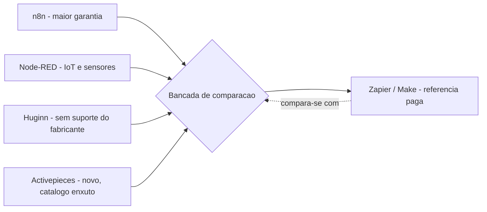
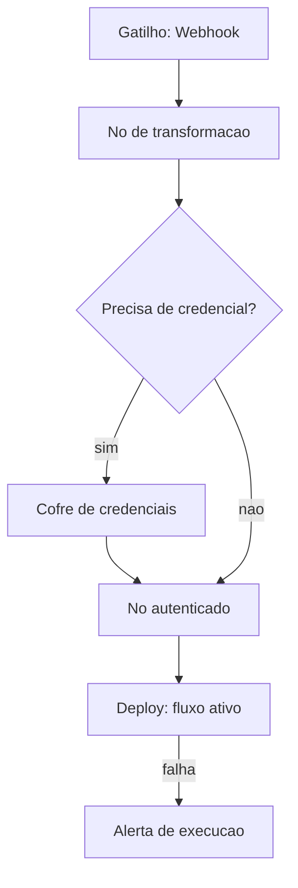

# Capítulo 4: Automação de Fluxos: Trocando o Zapier pelo n8n

## 1. Introdução

No Capítulo 3, você mapeou a Lacuna Honesta do CRM open source — o ponto exato em que EspoCRM, Twenty e SuiteCRM cobrem o essencial, mas Salesforce e HubSpot ainda vencem por integração e maturidade de mercado. Neste capítulo essa mesma lente vai apontar para uma categoria diferente, e o resultado da medição muda: automação de fluxos é, entre tudo o que este livro cobre, o lugar onde a Lacuna Honesta encolhe até quase desaparecer. n8n, Node-RED, Huginn e Activepieces não são substitutos capengas de Zapier e Make — são ferramentas que times reais colocam em produção todos os dias, com trade-offs específicos que você vai aprender a pesar.

Ao final deste capítulo você vai saber qual dessas quatro peças pegar na prateleira da sua oficina para cada cenário, vai ter montado seu primeiro fluxo de ponta a ponta — gatilho, transformação, credencial e publicação — e vai entender exatamente que conta chega depois que a mensalidade do Zapier para de aparecer no seu cartão. Essa última parte é a que mais separa quem brinca de automação de quem administra automação de verdade, e é para lá que a segunda metade do capítulo aponta.

## 2. Explica

Automação de fluxos resolve um problema estrutural simples: sistemas diferentes não falam a mesma língua, e alguém precisa traduzir e disparar essa conversa sem intervenção manual repetida. Zapier e Make cobram justamente por terem feito esse trabalho de tradução uma vez, para milhares de combinações, e revendido o resultado como serviço. A pergunta que este capítulo responde é até onde um motor de automação self-hosted reproduz esse trabalho de tradução sem depender do catálogo proprietário de nenhum dos dois.

A resposta, apoiada no material técnico levantado para este livro, é que a resposta muda por ferramenta — e a maturidade de cada uma se mede por três eixos concretos: tamanho do catálogo de integrações, cadência de manutenção do projeto e capacidade de isolar execuções (multi-tenancy). n8n lidera nos três eixos ao mesmo tempo: é fair-code, tem cerca de 400 integrações nativas e embarca capacidades de IA, com um projeto que já soma mais de 201 mil estrelas no GitHub — um sinal direto de adoção real, não de hype passageiro [1]. Para comparação, o catálogo do Zapier passa de 9.000 aplicativos [2], o que deixa claro que "paridade real" não significa "catálogo idêntico" — significa que os casos de uso mais comuns (webhooks, APIs REST, planilhas, e-mail, bancos de dados) já estão cobertos, e o restante é excepcional, não a regra.

Node-RED nasceu para outro problema: orquestrar sensores e dispositivos IoT, não sincronizar CRMs com ferramentas de e-mail marketing [3]. Herda dessa origem uma limitação arquitetural que pesa: é single-threaded e não isola execuções por cliente ou por fluxo, então um node mal escrito pode travar o event loop inteiro para todos os fluxos que rodam na mesma instância [4]. Isso não o desqualifica — só define o perímetro correto de uso, que é diferente do de um substituto de Zapier.

Huginn é o mais antigo dos quatro e o mais flexível conceitualmente: modela cada tarefa como um "agente" que observa e reage a eventos, em um grafo configurável. Também é o que carrega mais sinais de manutenção incerta — a última versão com tag oficial de release remonta a agosto de 2022, mesmo com atividade contínua de commits [5], e o projeto acumula hoje cerca de 600 issues abertas e 91 pull requests pendentes de revisão [6]. Já Activepieces é o mais jovem: nasceu com arquitetura moderna (workers isolados em sandbox, fila baseada em Redis) e cresceu rápido — mais de 23 mil estrelas em pouco tempo de vida [7] — mas ainda carrega uma biblioteca pequena, algo entre 300 e 500 "pieces", contra os milhares de apps do concorrente pago [8].

## 3. Ilustra

Pense na sua oficina como um estoque com quatro peças específicas na prateleira de automação, cada uma com uma etiqueta de garantia diferente. n8n é a peça com garantia mais longa e mais completa: veio testada por uma comunidade enorme, tem manual de instruções atualizado e um catálogo de acessórios (as integrações) que cobre praticamente toda tarefa comum de bancada. Node-RED é uma peça excelente, mas com etiqueta de garantia que avisa "projetada para eletrônica e sensores" — funciona bem fora dessa faixa, mas o fabricante nunca prometeu isolamento entre projetos diferentes rodando ao mesmo tempo na mesma bancada. Huginn é aquela ferramenta robusta, comprada de um fabricante que parou de responder e-mail — ainda funciona, mas você está por conta própria se quebrar. Activepieces é a ferramenta nova na caixa, bem construída, mas com o catálogo de acessórios ainda enxuto.



Agora, como Artesão Digital, você precisa entender a peça mais importante que vai montar nesta oficina: a esteira de montagem de um fluxo de automação. Toda automação — seja no n8n, no Zapier ou em qualquer motor do mercado — segue a mesma esteira de quatro estações: um **gatilho** dispara o movimento (um webhook chega, um horário bate, um e-mail entra), a peça passa por um ou mais **nós** que transformam ou movem os dados, ela pega uma **credencial** guardada no cofre da oficina para acessar um sistema externo, e finalmente o fluxo é **publicado** (deploy) para rodar sozinho, sem você por perto.

A parte que costuma confundir quem está começando é a estação da credencial, então vale uma segunda analogia, mais específica: pense na credencial não como uma chave qualquer que fica solta na bancada, mas como um crachá de acesso guardado num cofre trancado dentro da própria oficina — o n8n nunca expõe a senha ou o token em texto puro dentro do fluxo, ele guarda o crachá no cofre (o *Credential Store* interno) e só entrega para o nó certo, na hora certa, sem que o restante da esteira veja o conteúdo. Entender essa separação — o fluxo pede acesso, o cofre concede, o fluxo nunca vê a chave crua — é o que separa quem monta uma automação funcional de quem monta uma automação que um dia vaza uma credencial de produção sem perceber.



## 4. Técnica

Chegou a hora de sair da prateleira e montar a peça na bancada. Vamos subir o n8n com Docker, configurar o banco de dados que ele exige em qualquer cenário sério e publicar um fluxo real: um webhook recebe um pedido, um nó transforma o dado e um nó autenticado envia o resultado para um serviço externo usando uma credencial guardada no cofre.

### Por que Docker e por que PostgreSQL desde o primeiro dia

A documentação oficial recomenda Docker com volume persistente e trata o PostgreSQL como obrigatório a partir do momento em que o fluxo sai do "só para testar" — o SQLite embutido (usado por padrão sem configuração) não sobrevive bem a cargas concorrentes [9]. Um benchmark de produção publicado recentemente identificou o banco de dados, o event loop do próprio Node.js e a ausência de isolamento de execução entre workflows como os três gargalos reais quando a instância cresce [10] — não são gargalos hipotéticos, são os pontos que quebram primeiro.

O guia de dimensionamento de infraestrutura para n8n é direto sobre o tamanho da bancada que você precisa: uma instância de desenvolvimento ou teste roda confortavelmente com 2 GB de RAM e 2 vCPUs, mas uma instância de produção — com fila de execução ativa (queue mode) e volume real de fluxos — exige entre 8 e 16 GB de RAM e 4 ou mais vCPUs [11]. Essa diferença de uma ordem de grandeza é exatamente o tipo de custo que a assinatura de SaaS escondia dentro da mensalidade, e ele vai reaparecer com força na seção Aplica.

```yaml
# docker-compose.yml — bancada minima para produção do n8n
version: "3.8"

services:
  postgres:
    image: postgres:16
    restart: unless-stopped
    environment:
      POSTGRES_USER: n8n
      POSTGRES_PASSWORD: "troque-esta-senha-no-deploy"
      POSTGRES_DB: n8n
    volumes:
      - postgres_data:/var/lib/postgresql/data

  n8n:
    image: docker.n8n.io/n8nio/n8n:latest
    restart: unless-stopped
    ports:
      - "5678:5678"
    environment:
      DB_TYPE: postgresdb
      DB_POSTGRESDB_HOST: postgres
      DB_POSTGRESDB_DATABASE: n8n
      DB_POSTGRESDB_USER: n8n
      DB_POSTGRESDB_PASSWORD: "troque-esta-senha-no-deploy"
      N8N_ENCRYPTION_KEY: "<chave-de-32-caracteres-gerada-no-deploy>"
      WEBHOOK_URL: "https://automacao.suaoficina.com.br/"
      GENERIC_TIMEZONE: "America/Sao_Paulo"
    volumes:
      - n8n_data:/home/node/.n8n
    depends_on:
      - postgres

volumes:
  postgres_data:
  n8n_data:
```

### Subindo a bancada e testando o primeiro gatilho

Com o `docker-compose.yml` salvo, a montagem começa com um único comando. A sessão abaixo mostra a subida dos dois serviços e a verificação de que o n8n respondeu na porta esperada.

```console
$ docker compose up -d
[+] Running 2/2
 - Container oficina-postgres-1  Started
 - Container oficina-n8n-1       Started

$ docker compose ps
NAME               IMAGE                         STATUS
oficina-postgres-1 postgres:16                   Up 12 seconds (healthy)
oficina-n8n-1      docker.n8n.io/n8nio/n8n:latest Up 10 seconds

$ curl -s -o /dev/null -w "%{http_code}\n" http://localhost:5678/healthz
200
```

Com a instância no ar, a interface web em `http://localhost:5678` guia a criação de uma conta de administrador local — esse é o único cadastro que existe: nenhum dado do seu fluxo passa por servidor de terceiros a partir daqui.

### O fluxo de ponta a ponta: gatilho, nó, credencial e deploy

O JSON abaixo é a exportação real de um fluxo mínimo: um gatilho `Webhook`, um nó `Set` que normaliza o payload recebido e um nó `HTTP Request` que usa uma credencial de cabeçalho (header auth) para reenviar o dado a um serviço externo — o mesmo desenho de esteira ilustrado na seção anterior, só que agora como artefato real, importável no próprio n8n.

```json
{
  "name": "Pedido recebido -> normaliza -> reenvia",
  "nodes": [
    {
      "id": "gatilho-webhook",
      "name": "Gatilho: Webhook",
      "type": "n8n-nodes-base.webhook",
      "typeVersion": 2,
      "position": [240, 300],
      "parameters": {
        "path": "pedido-novo",
        "httpMethod": "POST",
        "responseMode": "lastNode"
      }
    },
    {
      "id": "no-transformacao",
      "name": "Normaliza payload",
      "type": "n8n-nodes-base.set",
      "typeVersion": 3,
      "position": [460, 300],
      "parameters": {
        "assignments": {
          "assignments": [
            { "name": "cliente", "type": "string", "value": "={{$json.nome}}" },
            { "name": "valor_pedido", "type": "number", "value": "={{$json.total}}" }
          ]
        }
      }
    },
    {
      "id": "no-autenticado",
      "name": "Reenvia com credencial",
      "type": "n8n-nodes-base.httpRequest",
      "typeVersion": 4,
      "position": [680, 300],
      "parameters": {
        "method": "POST",
        "url": "https://api.parceiro-externo.com/pedidos",
        "authentication": "genericCredentialType",
        "genericAuthType": "httpHeaderAuth"
      },
      "credentials": {
        "httpHeaderAuth": {
          "id": "1",
          "name": "Cofre - Parceiro Externo"
        }
      }
    }
  ],
  "connections": {
    "Gatilho: Webhook": {
      "main": [[{ "node": "Normaliza payload", "type": "main", "index": 0 }]]
    },
    "Normaliza payload": {
      "main": [[{ "node": "Reenvia com credencial", "type": "main", "index": 0 }]]
    }
  }
}
```

Note que o bloco `credentials` do último nó só guarda um `id` e um `name` — a chave real (o token de autenticação do parceiro) nunca aparece neste arquivo. Ela vive isolada no cofre interno do n8n, cifrada com a `N8N_ENCRYPTION_KEY` definida no `docker-compose.yml`, exatamente como a analogia do crachá previu: o fluxo pede acesso, o cofre concede, o arquivo do fluxo nunca vê a chave crua.

Depois de importar esse JSON pela interface e clicar em "Activate", o fluxo passa a escutar de verdade. A sessão a seguir mostra o teste do gatilho com uma chamada real, simulando o sistema que dispararia esse pedido em produção:

```console
$ curl -X POST https://automacao.suaoficina.com.br/webhook/pedido-novo \
  -H "Content-Type: application/json" \
  -d '{"nome": "Ana Ferreira", "total": 189.90}'

{"reenviado": true, "cliente": "Ana Ferreira", "valor_pedido": 189.9}
```

### Escolhendo a peça certa: tabela de decisão

Antes de sair da bancada, vale consolidar a comparação da seção Explica em uma tabela de decisão prática — o tipo de referência rápida que você vai consultar de novo antes de montar o próximo fluxo:

| Cenário do leitor | Peça recomendada | Por quê |
|---|---|---|
| Preciso do catálogo mais amplo e ativo hoje | n8n | 400+ integrações nativas, 201 mil+ estrelas, IA embutida [1] |
| Automação de sensores, dispositivos, IoT doméstico | Node-RED | Nasceu para esse domínio; não é multi-tenant [4] |
| Aceito manter Ruby/DevOps sem suporte comercial | Huginn | Flexível, mas sem release tagueado desde 2022 [5] |
| Quero arquitetura moderna e aceito catálogo menor | Activepieces | Workers isolados, mas só 300-500 pieces [8] |
| Dependo de uma integração nichada específica | Nenhuma das quatro — avalie manter o Zapier | Nenhuma cobre o catálogo de 9.000+ apps [2] |

### Backup da bancada: o script que evita perder o fluxo montado

Uma última peça técnica, curta e direta: como qualquer ferramenta da oficina, a instância self-hosted não tem backup automático de fábrica — isso é responsabilidade de quem monta. O script abaixo, agendável via `cron`, exporta o banco PostgreSQL do n8n para um arquivo comprimido diário.

```bash
#!/usr/bin/env bash
set -euo pipefail

DATA=$(date +%F)
DESTINO="/backups/n8n/n8n-${DATA}.sql.gz"

mkdir -p /backups/n8n

docker exec oficina-postgres-1 pg_dump -U n8n n8n | gzip > "${DESTINO}"

echo "Backup gravado em ${DESTINO}"

find /backups/n8n -name "n8n-*.sql.gz" -mtime +30 -delete
```

## 5. Aplica

Imagine a cena: seu fluxo está pronto, testado, publicado. Ele reenvia pedidos para o sistema do parceiro há duas semanas sem incidente. Numa sexta-feira, você decide "otimizar" e edita o nó de credencial direto na tela, copiando o token novo do parceiro e colando-o, por pressa, dentro do campo de texto do nó `HTTP Request` — não no campo de credencial dedicado, mas como um cabeçalho fixo, "só para testar rápido". Funciona. Você esquece de voltar e corrigir depois. Três meses depois, esse fluxo é exportado como JSON para ser versionado no Git do time — e o token do parceiro vai embutido, em texto puro, para o repositório.

O diagnóstico é exatamente o ponto que a seção Ilustra separou com a segunda analogia: o cofre de credenciais existe para que o *arquivo do fluxo* nunca carregue a chave crua — e colar um token dentro de um parâmetro comum, em vez de usar o sistema de credenciais dedicado, quebra essa garantia de forma silenciosa. Nada trava, nada avisa, porque tecnicamente o fluxo continua funcionando. A correção é sempre a mesma: qualquer segredo (token, senha, chave de API) entra pelo tipo de nó de credencial correto, nunca por um campo de texto livre, e uma revisão de fluxo antes de qualquer exportação para controle de versão deveria varrer justamente por esse padrão.

Esse tipo de deslize é comum o suficiente para aparecer como armadilha recorrente entre equipes que adotam automação self-hosted pela primeira vez:

- Colar segredos em campos de texto comuns em vez do nó de credencial dedicado.
- Deixar a instância em modo de desenvolvimento (SQLite, sem fila) rodando fluxos de produção real.
- Nunca testar o que acontece quando o serviço externo cai — sem retry configurado, o fluxo simplesmente perde a execução.
- Achar que "está funcionando" substitui monitoramento — sem alerta de falha, ninguém percebe a automação parada até o cliente reclamar.

No mercado, o profissional que sabe montar essa esteira sozinho — do Docker Compose ao cofre de credenciais — já entrega mais valor do que quem apenas clica em templates prontos de SaaS: ele consegue adaptar o fluxo ao sistema legado da empresa, algo que nenhum catálogo fechado de integrações prevê. É esse domínio de bastidores, e não a interface visual em si, que separa quem opera automação de quem apenas a consome.

A adoção de open source em geral ainda tropeça em processo, não em tecnologia: apenas 34% das organizações têm hoje uma estratégia formal para adotar e manter esse tipo de ferramenta [12]. E a fração que vai além da estratégia informal e mantém um escritório dedicado ao tema (um OSPO) cai para 26% [13] — o que ajuda a explicar por que tanta automação self-hosted é montada por uma única pessoa, sem plano de sucessão, e quebra silenciosamente quando essa pessoa sai de férias ou troca de emprego.

Essa esteira também tem um teto de escala honesto, e vale declará-lo antes que você o descubra em produção: o setup de desenvolvimento (SQLite, sem fila) que serviu para os exemplos deste capítulo não é o recomendado para volume real — a própria documentação de requisitos do n8n já orienta migrar para PostgreSQL em modo queue com 8-16 GB de RAM e 4 ou mais vCPUs a partir daí [4], e um benchmark independente de carga de produção aponta o event loop do Node.js e a ausência de isolamento entre execuções como os gargalos que aparecem primeiro quando o número de fluxos simultâneos cresce [14]. Se a sua automação vai rodar em alto volume ou for compartilhada por várias equipes, planeje essa migração de infraestrutura antes de precisar dela às pressas.

### Exercício
- [ ] Suba o `docker-compose.yml` desta seção em uma VPS de teste (2 GB RAM é suficiente para começar).
- [ ] Importe o fluxo JSON do webhook e ative-o.
- [ ] Dispare o webhook com `curl` usando um payload diferente do exemplo e confirme a resposta.
- [ ] Crie a credencial do nó `HTTP Request` pelo painel de credenciais do n8n — nunca em texto livre no nó.
- [ ] Configure o script de backup via `cron` e confirme que o arquivo `.sql.gz` é gerado no dia seguinte.
- [ ] Escreva, em uma frase, quem na sua equipe (ou você mesmo) fica de guarda se esse fluxo falhar às 3h da manhã.

## 6. Conclusão

Três ideias sustentam este capítulo: automação de fluxos é, dos temas deste livro, o mais próximo de paridade real com o SaaS pago — mas "próximo" não é "idêntico", e a tabela de decisão desta seção Técnica existe justamente para você escolher a peça certa em vez da mais hype; toda automação, em qualquer motor, segue a mesma esteira de gatilho, nó, credencial e deploy, e dominar essa esteira — sobretudo a disciplina do cofre de credenciais — é o que separa uma automação funcional de uma automação segura; e o custo que a mensalidade do Zapier escondia não desapareceu ao trocar de ferramenta, apenas migrou de forma para VPS, backup e, principalmente, para a pergunta que fechou a seção Aplica: quem fica de guarda quando o fluxo quebra.

Como Artesão Digital, você já tem agora duas peças montadas na sua oficina — anotações e automação — e sabe pesar, categoria por categoria, quando a troca vale o esforço. No Capítulo 5, a bancada muda de assunto: design gráfico e edição de imagem, onde GIMP, Inkscape, Krita e Penpot substituem Canva, Photoshop e Illustrator com uma curva de aprendizado bem menos gentil do que a que você acabou de vencer aqui — e que vale conhecer antes de prometer para o seu time que a troca sai de graça.

## 7. Referências Bibliográficas

[1] ACTIVEPIECES. *activepieces/activepieces: AI Agents & MCPs & AI Workflow Automation*. Disponível em: https://github.com/activepieces/activepieces. Acesso em: 19 ago. 2026.

[2] ACTIVEPIECES. *Architecture Overview — Activepieces Docs*. Disponível em: https://www.activepieces.com/docs/install/architecture/overview. Acesso em: 19 ago. 2026.

[3] AUFRANC, Jean-Luc (CNX SOFTWARE). *Huginn is a self-hosted, open-source alternative to IFTTT and Zapier*. Disponível em: https://www.cnx-software.com/2025/04/05/huginn-is-a-self-hosted-open-source-alternative-to-ifttt-and-zapier/. Acesso em: 19 ago. 2026.

[4] CHERRY SERVERS. *n8n Self-Hosting Requirements Guide (2026)*. Disponível em: https://www.cherryservers.com/blog/n8n-self-hosting-requirements. Acesso em: 19 ago. 2026.

[5] CODEREVUE. *Using Node-RED as an open-source alternative to Zapier for workflow automation*. Disponível em: https://coderevue.net/posts/zapier-alternative-node-red/. Acesso em: 19 ago. 2026.

[6] HARDILL, Ben. *Multi Tenant Node-RED*. Disponível em: https://blog.hardill.me.uk/2020/10/01/multi-tenant-node-red/. Acesso em: 19 ago. 2026.

[7] HUGINN. *huginn/huginn: Create agents that monitor and act on your behalf*. Disponível em: https://github.com/huginn/huginn. Acesso em: 19 ago. 2026.

[8] HUGINN. *Releases · huginn/huginn*. Disponível em: https://github.com/huginn/huginn/releases. Acesso em: 19 ago. 2026.

[9] LINUX FOUNDATION RESEARCH. *The State of Global Open Source 2025*. Disponível em: https://www.linuxfoundation.org/blog/the-state-of-open-source-software-in-2025. Acesso em: 19 ago. 2026.

[10] N8N. *n8n Documentation*. Disponível em: https://docs.n8n.io/. Acesso em: 19 ago. 2026.

[11] N8N. *n8n-io/n8n: Fair-code workflow automation platform with native AI capabilities*. Disponível em: https://github.com/n8n-io/n8n. Acesso em: 19 ago. 2026.

[12] OPENLOGIC. *2026 State of Open Source Report*. Disponível em: https://www.openlogic.com/resources/state-of-open-source-report. Acesso em: 19 ago. 2026.

[13] OPENJS FOUNDATION. *node-red/node-red*. Disponível em: https://github.com/node-red/node-red. Acesso em: 19 ago. 2026.

[14] N8N.REVIEWS. *n8n at Scale: Performance Benchmarks Under Real Production Load*. Disponível em: https://n8n.reviews/n8n-at-scale/. Acesso em: 19 ago. 2026.

[15] BETTER STACK COMMUNITY. *Open-Source Workflow Automation with Activepieces*. Disponível em: https://betterstack.com/community/guides/ai/activepieces-workflow-automation/. Acesso em: 19 ago. 2026.

[16] ZAPIER. *n8n vs. Zapier: Which Automation Tool is Right For You?*. Disponível em: https://zapier.com/blog/n8n-vs-zapier/. Acesso em: 19 ago. 2026.
