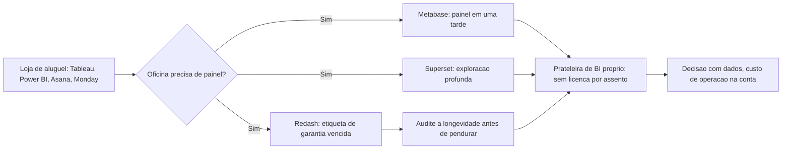

# Capítulo 7: Análise de Dados e Gestão de Projetos: BI e Kanban Sem Licença por Usuário

## 1. Introdução

No capítulo anterior, a prateleira da oficina ganhou as estantes que guardam os arquivos da jornada — vídeo editado, nuvem própria, backup verificado. Agora a Oficina Digital precisa de duas peças que nenhuma bancada séria dispensa: a que transforma dados em decisão — o BI — e a que organiza o trabalho de quem está montando tudo — a gestão de projetos. E aqui o aluguel tem um formato especialmente traiçoeiro: a mensalidade é cobrada por assento. Tableau, Power BI, Asana, Monday.com e Trello não cobram da oficina — cobram de cada pessoa que senta na bancada. Dez pessoas no time é dez mensalidades, todos os meses, para sempre.

Este capítulo mostra o outro lado dessa conta. Você vai aprender, nesta ordem: como subir um painel de vendas próprio com Metabase ou Superset em uma tarde, e por que o Redash merece um alerta de longevidade antes de virar peça fixa da sua prateleira; como escolher entre OpenProject, Taiga e Focalboard a bancada de gestão certa para o tamanho e o ritmo do seu time; e onde essa comparação para — o custo real de operação, e os casos em que a mensalidade ainda compra o que a bancada não entrega. Ao final, você terá um painel de BI no ar e um critério honesto para decidir quando o "grátis por usuário" vale a manutenção.

## 2. Explica

Comece pelo que BI significa na prática, sem o jargão de vendedor: BI é o processo de conectar fontes de dados, escrever consultas, publicar dashboards e agendar o envio desses painéis para quem decide. Não é mágica, é uma rotina — e é exatamente essa rotina que as ferramentas open source já cobrem com maturidade. O Metabase é o caso de entrada mais suave: um repositório com 48,8 mil estrelas no GitHub, requisitos de produção de 2 vCPU, 2 a 4 GB de RAM e 10 GB ou mais de disco, e uma instalação Docker que sobe em minutos [153][154][155]. O Apache Superset tem perfil diferente — é o projeto da Apache Software Foundation, com instalação via Docker Compose oficial e uma pegada mais voltada a analistas que escrevem SQL e exploram dados em profundidade [160][161][162]. As reviews comparativas independentes convergem num veredito: para a fatia de dashboards operacionais e relatórios de vendas, os dois já são páreo técnico para Tableau e Power BI em cenários de pequenas e médias empresas [156][157][163][164]. Há limites documentados de escala — o Superset impõe um teto de cerca de 800 KB por resultado de consulta [160], e o Metabase trava a interface em datasets gigantes, com issues públicas registrando exatamente o comportamento [158][159].

A segunda peça de vocabulário é a gestão de projetos, e aqui o modelo de assinatura por usuário fica ainda mais visível: o custo do Asana ou do Monday.com cresce a cada pessoa adicionada ao quadro. As alternativas da oficina cobrem o espectro com desenhos diferentes. O OpenProject é o mais completo — Gantt, portfólio, visão de PMO — e roda na Community Edition com requisitos honestos de 4 GB de RAM, 2 CPUs e 20 GB de disco para 10 a 20 usuários, exigindo PostgreSQL 16 ou superior [171][172][173]. O Taiga é o campeão do Scrum e do Kanban ágil, construído pela comunidade Kaleidos, com instalação Docker disponível e uma migração conhecida por perder comentários e anexos em planilhas CSV [176][177][178][179]. E o Focalboard, da Mattermost, é o kanban leve — a alternativa direta ao Trello para quem quer o quadro simples sem o peso de um sistema de portfólio [180]. A régua de escolha, como os comparativos mostram, é o formato do time: empresa consolidada com múltiplos projetos pendura o OpenProject na bancada; squad ágil enxuto prefere o Taiga; o autônomo que só quer o quadro na parede monta o Focalboard [175][180][185].

A terceira peça — e a mais honesta deste capítulo — é o risco de longevidade. Projeto open source não tem contrato de suporte: ele vive enquanto houver mantenedores. O Redash é o estudo de caso que todo Artesão Digital deveria conhecer antes de escolher BI: adquirido pela Databricks em 2020, teve a hospedagem paga descontinuada em 2021, com o fim de vida documentado oficialmente [168], e foi reiniciado em 2023 como esforço comunitário com cerca de sete mantenedores voluntários e ritmo lento de releases [165][169][170]. Nenhuma dessas informações é especulação — está no changelog, no FAQ de EOL e nas reviews de mercado. A lição não é "não use Redash": é que a garantia da peça na sua prateleira precisa ser auditada na compra, e o custo da troca futura entra na conta de hoje.

## 3. Ilustra

A imagem mental deste capítulo é a parede de status da oficina — aquele quadro que mostra, em um relance, como anda cada bancada montada nos capítulos anteriores. Na loja de aluguel, essa parede é alugada peça por peça por assento: cada pessoa que olha o quadro paga uma mensalidade, e o quadro em si nunca sai da vitrine. Na sua oficina, a parede é sua: os dados vêm das fontes que você escolheu, o painel é montado com peças que você pode abrir e ajustar, e o custo não cresce quando o time cresce — cresce apenas quando a operação cresce.

A segunda lente, como nos capítulos anteriores, revela o custo escondido: o BI pago não vendia apenas o quadro — vendia a manutenção invisível. Quem atualiza o servidor, faz o backup do painel, renova o certificado TLS e responde quando a consulta quebra de madrugada? Na assinatura, a resposta é "a loja". Na oficina, a resposta é "você". O diagrama abaixo mostra o caminho da decisão: três caixas de peça chegam da loja de aluguel, duas entram na prateleira de BI próprio e uma carrega a etiqueta de garantia vencida — não porque quebrou, mas porque ninguém assumiu o contrato de manutenção dela.



## 4. Técnica

Esta seção segue o padrão do material-fonte: manifestos Docker Compose reais, sessões de terminal com comando e saída esperada, uma consulta SQL de exemplo e tabelas de decisão — sem código de programação, porque o que você precisa aqui é operar as peças, não desenvolvê-las.

### Subindo o Metabase

O Metabase é a porta de entrada mais rápida para o BI próprio. A instalação oficial via Docker é um manifesto mínimo com um único serviço e um volume persistente — o banco de aplicação interno guarda as perguntas, os dashboards e as configurações [155]:

```yaml
# docker-compose.yml — Metabase (referência mínima de produção)
version: "3.9"

services:
  metabase:
    image: metabase/metabase:latest
    restart: unless-stopped
    ports:
      - "3000:3000"
    environment:
      MB_DB_TYPE: postgres
      MB_DB_DBNAME: metabase
      MB_DB_PORT: 5432
      MB_DB_USER: metabase
      MB_DB_PASS: troque-esta-senha
      MB_DB_HOST: db
    volumes:
      - metabase-data:/metabase.db
    depends_on:
      - db

  db:
    image: postgres:15-alpine
    restart: unless-stopped
    environment:
      POSTGRES_DB: metabase
      POSTGRES_USER: metabase
      POSTGRES_PASSWORD: troque-esta-senha
    volumes:
      - db-data:/var/lib/postgresql/data

volumes:
  metabase-data:
  db-data:
```

Subir o painel é um comando, e o primeiro acesso configura o administrador da oficina:

```console
$ docker compose up -d
[+] Running 2/2
 ✔ Container db        Started
 ✔ Container metabase  Started
$ curl -sI http://localhost:3000 | head -1
HTTP/1.1 200 OK
```

Com o painel no ar, a consulta que sustenta o primeiro dashboard do Artesão Digital pode começar a ser escrita — um relatório simples de vendas por período, pronto para virar gráfico na interface do Metabase:

```sql
-- relatorio_vendas.sql — base do primeiro dashboard
SELECT
  date_trunc('month', criado_em) AS mes,
  count(*)                        AS pedidos,
  sum(valor_total)                AS receita
FROM vendas
WHERE criado_em >= now() - interval '12 months'
GROUP BY 1
ORDER BY 1;
```

### A Bancada de Gestão: OpenProject

Para o time que precisa de mais do que um quadro — cronograma, portfólio e papéis de PMO — o OpenProject é a peça da prateleira. A instalação Docker all-in-one oficial é um manifesto com dois serviços, aplicação e banco PostgreSQL 16 [173]:

```yaml
# docker-compose.yml — OpenProject (Community Edition)
version: "3.9"

services:
  openproject:
    image: openproject/openproject:16
    restart: unless-stopped
    ports:
      - "8080:80"
    environment:
      OPENPROJECT_HOST: projetos.suaoficina.com
      OPENPROJECT_SECRET_KEY_BASE: troque-esta-chave
    volumes:
      - op-pgdata:/var/lib/postgresql/14/main
      - op-assets:/var/db/openproject
    command: docker/production/install

volumes:
  op-pgdata:
  op-assets:
```

A subida e a checagem seguem o mesmo ritmo da estante do capítulo anterior:

```console
$ docker compose up -d
[+] Running 1/1
 ✔ Container openproject  Started
$ sleep 20 && curl -sI http://localhost:8080 | head -1
HTTP/1.1 302 Found
```

### O Caminho do Superset: Quando o Analytics Precisa de Profundidade

O Metabase resolve a fatia operacional do BI com velocidade — conectar, consultar, publicar. O Apache Superset entra quando a análise pede profundidade: exploração de dados com SQL avançado, visualizações mais sofisticadas e o ecossistema da Apache Foundation por trás [160]. A instalação oficial via Docker Compose traz um conjunto maior de serviços — o banco de metadados, o Redis de cache, o worker assíncrono e o próprio servidor — porque o Superset foi desenhado para cenários onde o painel serve dezenas de usuários e consultas pesadas [161][162]. O preço dessa profundidade aparece em dois pontos que os comparativos medem com números: o teto de cerca de 800 KB por resultado de consulta, que corta queries indisciplinadas na origem [160], e a curva de configuração, que exige conhecer o modelo de dados antes de montar o primeiro dashboard [163][164].

```console
$ docker compose -f docker-compose.yml up -d
[+] Running 4/4
 ✔ Container superset_db         Started
 ✔ Container superset_cache      Started
 ✔ Container superset_worker     Started
 ✔ Container superset_app        Started
$ docker compose exec superset_app superset fab create-admin \
    --username artesao --firstname Artesao --lastname Digital \
    --email artesao@oficina.com --password troque-esta-senha
$ docker compose exec superset_app superset init
```

A sessão acima mostra o ritual completo de primeira execução: subir os quatro serviços, criar o administrador com um comando e inicializar as tabelas internas de metadados com outro [161]. Depois disso, o Superset fica parecido com o Metabase no uso diário — conectar o banco de vendas, escrever a consulta e arrastar o gráfico para o painel — mas com o motor de exploração mais profundo por baixo [163]. A regra de bolso: Metabase para o painel rápido de decisão; Superset para a análise que precisa de fôlego; e nenhum dos dois quando o requisito é um relatório executivo pronto de fornecedor — esse é o assunto da tabela de decisão da seção 5 [164].

### Tabela de Decisão: Qual Bancada de Gestão Pendurar

A escolha entre as três peças de gestão depende do formato do time, não do tamanho do orçamento. Os critérios abaixo consolidam o que a seção 2 levantou [171][175][180][185]:

| Critério | OpenProject | Taiga | Focalboard |
|----------|-------------|-------|------------|
| Melhor para | Múltiplos projetos, Gantt, PMO | Squad ágil, Scrum/Kanban | Autônomo, quadro leve |
| Requisitos | 4 GB RAM / 2 CPU / 20 GB disco | Docker, leve | Muito leve (pode rodar em 1 GB) |
| Banco | PostgreSQL 16+ obrigatório | PostgreSQL | SQLite |
| Curva de aprendizado | Média | Baixa | Mínima |
| Quando evitar | Time de 2 pessoas, um quadro só | Portfólio pesado multi-projeto | Gestão de portfólio ou Gantt |

A regra de bolso: o custo por assento some da conta, mas não some da planilha — ele vira custo de operação. A tabela da seção 3 do próximo capítulo fecha essa conta com os números da VPS.

### O Quadro Pessoal: Focalboard para o Artesão Solo

O time inteiro nem sempre precisa do OpenProject ou do Taiga — e o Artesão Digital que trabalha sozinho ou com poucos projetos pendura um quadro mais leve na bancada. O Focalboard, criado pela mesma comunidade do Mattermost e hoje mantido como projeto aberto, entrega exatamente esse equilíbrio: quadros Kanban, listas e calendário com uma instalação que roda em minutos num container único, sem banco separado [180]. A simplicidade tem um preço que a própria comunidade documenta: o Focalboard é um quadro pessoal e de time pequeno, não um substituto do OpenProject — faltam cronogramas Gantt, dependências entre tarefas e relatórios de portfólio [171][180]. Por isso a tabela de decisão da seção 4 colocou cada peça no seu perímetro: o Wekan e o Planka brigam no mesmo segmento do quadro leve [185], e a escolha entre eles é mais estética do que técnica — todos entregam o Kanban sem assinatura.

A régua que fecha a seção é a mesma aplicada desde o capítulo 1: a peça certa é a que cabe no formato do trabalho, não a que tem mais estrelas no GitHub [180][185]. Time solo com um quadro: Focalboard. Time de produto com sprints: Taiga. Portfólio multi-projeto com cronograma: OpenProject. E, em qualquer um dos três, o dado que decide é o tamanho da operação — o mesmo dado que a conta final do próximo capítulo soma na planilha.

### O Ciclo de Vida de um Relatório: Do Banco ao E-mail Agendado

A diferença entre usar BI de verdade e apenas instalar um painel está no ciclo de vida do relatório — e é o ciclo que a assinatura automatizava silenciosamente. O fluxo completo tem quatro pontas: a fonte de dados (o banco de vendas), a consulta (a pergunta de negócio), o dashboard (a visualização) e o agendamento (o envio periódico do relatório para quem decide). O Metabase e o Superset cobrem as quatro pontas com maturidade — e o que separa um do outro é onde cada um prefere trabalhar [154][162]. O Metabase agrega valor na interface: qualquer pessoa do time monta dashboards sem escrever SQL, conectando o banco e clicando nas métricas [154][155]. O Superset assume que quem usa entende de dados — e devolve em troca um motor de exploração mais profundo [160][162].

A sessão abaixo mostra a ponta do agendamento no Metabase — o pulso que a assinatura fazia por você e que agora roda na sua infraestrutura:

```console
$ curl -s -X POST http://localhost:3000/api/pulse \
  -H "X-Metabase-Session: SESS_ID" \
  -H "Content-Type: application/json" \
  -d '{"name":"Relatorio semanal de vendas","channel_specs":{"email":{"recipients":["gestor@oficina.com"]}},"cards":[{"id":1,"include_csv":true}],"schedule_type":"weekly","schedule_day":"mon","schedule_hour":8}'
{"id":42,"name":"Relatorio semanal de vendas","schedule_type":"weekly"}
```

O comando cria um envio semanal — toda segunda-feira às 8h, o painel de vendas chega na caixa de entrada do gestor com o CSV anexado, sem nenhum clique humano [155]. Na assinatura, esse ritual era um botão no plano pago; na oficina, é uma chamada de API que qualquer cron dispara. A regra que fecha o ciclo: a automatização do BI não é o diferencial do open source — é o pagamento da operação. Quem monta o relatório, o agendamento e o alerta assume o plantão de manter o pipeline de pé, e é isso que a conta final da seção 5 inclui na planilha.

## 5. Aplica

A jornada prática deste capítulo é a primeira semana do Artesão Digital medindo e organizando a própria oficina. O cenário: você tem vendas acontecendo — o produto digital que o livro deu condições de criar — e um time pequeno de duas ou três pessoas ajudando a montar as próximas peças. Os dados estão espalhados entre uma planilha, o banco do site e o e-mail de confirmação de venda.

**Erro comum:** você escolhe o BI pelo nome — "Tableau é o que as empresas usam" — ou pelo preço zero, sem auditar a longevidade. O primeiro erro paga mensalidade por assento para sempre; o segundo pendura na parede uma peça cuja manutenção morreu. É exatamente o que acontece com o Redash: quem montou a stack em 2019, antes da aquisição pela Databricks, acordou em 2021 com o serviço gerenciado descontinuado — o fim de vida está documentado no FAQ oficial [168] — e precisou migrar num prazo que não escolheu [165][169]. O diagnóstico: escolha de ferramenta sem checklist de garantia é compra no escuro.

**Prática correta:** a escolha começa pelo formato do time e pela necessidade real de relatório. Time de poucas pessoas com vendas num único banco sobe o Metabase na primeira tarde — o manifesto da seção 4 tem o painel no ar antes do café esfriar [153][154]. A régua de escala é conferida antes da decisão, não depois: o Superset corta resultados em ~800 KB por consulta, e datasets gigantes travam a interface do Metabase — limites documentados em issues públicas, lembrando que garantia de open source é a transparência dos rastreadores, não um SLA [158][159][160]. E a gestão do time entra na mesma planilha: OpenProject para o portfólio de projetos, Taiga para o sprint, Focalboard para o quadro pessoal — sem nenhuma mensalidade por assento [171][177][180].

**A decisão que fecha a semana:** com o painel no ar e o quadro organizado, a conta final compara o custo total de operação — a VPS do Metabase, o backup do PostgreSQL, o certificado TLS e as horas de manutenção — contra o que as assinaturas de BI e gestão cobrariam por assento. Quando a soma da operação fica abaixo, a peça é sua e a garantia é a sua auditoria. E quando a soma passa do aceitável, o próximo capítulo mostra o balanço final: a conta honesta de quando o aluguel ainda é a peça mais barata da oficina.

## 6. Conclusão

Este capítulo deu à oficina a parede de status que faltava. Você aprendeu que BI não é mistério — é conectar, consultar, publicar e agendar — e que o Metabase e o Superset já cobrem essa rotina com maturidade real, com limites de escala documentados em issues públicas, não escondidos atrás de SLA [153][158][160]. Aprendeu que gestão de projetos tem três desenhos diferentes — o portfólio do OpenProject, o sprint do Taiga, o quadro leve do Focalboard — e que a escolha certa nasce do formato do time, não do orçamento [171][177][180]. E aprendeu a lição mais valiosa do capítulo, encarnada no Redash: peça open source não vem com contrato de manutenção, e a sua garantia é a auditoria de longevidade que você faz na compra — repositório ativo, releases recentes, manutenção sustentada [165][168][169].

O Artesão Digital que sai deste capítulo sabe medir a própria oficina e organizar a própria bancada sem pagar por assento. Falta uma peça para a jornada fechar o ciclo: a bancada que hospeda todas as outras, e o balanço final que decide quando a soma de VPS, manutenção e risco ainda é mais barata que a assinatura — assunto do próximo capítulo.

## 7. Referências Bibliográficas

[153] METABASE. *metabase/metabase*. Disponível em: https://github.com/metabase/metabase. Acesso em: 19 ago. 2026.
[154] METABASE. *Installing Metabase*. Disponível em: https://www.metabase.com/docs/latest/installation-and-operation/installing-metabase. Acesso em: 19 ago. 2026.
[155] METABASE. *Running Metabase on Docker*. Disponível em: https://www.metabase.com/docs/latest/installation-and-operation/running-metabase-on-docker. Acesso em: 19 ago. 2026.
[156] IKEMO. *Power BI vs Tableau vs Looker Studio vs Metabase: Which BI Platform Should You Choose?*. Disponível em: https://ikemo.io/blog/power-bi-vs-tableau-vs-looker-vs-metabase. Acesso em: 19 ago. 2026.
[157] EDANA. *Business Intelligence: Comparison of Power BI, Tableau, Superset, Metabase*. Disponível em: https://edana.ch/en/2025/04/20/business-intelligence-comparison-of-power-bi-tableau-superset-metabase/. Acesso em: 19 ago. 2026.
[158] METABASE (fórum oficial). *Metabase failing to fetch large dataset*. Disponível em: https://discourse.metabase.com/t/metabase-failing-to-fetch-large-dataset/5789. Acesso em: 19 ago. 2026.
[159] METABASE. *Issue #21985 — Large databases can be very slow to view in Data Model*. Disponível em: https://github.com/metabase/metabase/issues/21985. Acesso em: 19 ago. 2026.
[160] APACHE SOFTWARE FOUNDATION. *apache/superset*. Disponível em: https://github.com/apache/superset. Acesso em: 19 ago. 2026.
[161] APACHE SOFTWARE FOUNDATION. *Using Docker Compose — Apache Superset*. Disponível em: https://superset.apache.org/admin-docs/installation/docker-compose/. Acesso em: 19 ago. 2026.
[162] APACHE SOFTWARE FOUNDATION. *Installation Methods — Apache Superset*. Disponível em: https://superset.apache.org/admin-docs/installation/installation-methods/. Acesso em: 19 ago. 2026.
[163] PRESET.IO. *Apache Superset vs Tableau: A Practical Comparison*. Disponível em: https://preset.io/blog/apache-superset-vs-tableau/. Acesso em: 19 ago. 2026.
[164] PEERSPOT. *Compare Apache Superset vs Tableau Enterprise*. Disponível em: https://www.peerspot.com/products/comparisons/apache-superset_vs_tableau. Acesso em: 19 ago. 2026.
[165] GETREDASH. *getredash/redash*. Disponível em: https://github.com/getredash/redash. Acesso em: 19 ago. 2026.
[166] REDASH. *Setting up a Redash Instance*. Disponível em: https://redash.io/help/open-source/setup/. Acesso em: 19 ago. 2026.
[167] GETREDASH. *getredash/setup — Setup scripts for Redash Cloud Images*. Disponível em: https://github.com/getredash/setup. Acesso em: 19 ago. 2026.
[168] REDASH. *Hosted Redash End of Life*. Disponível em: https://redash.io/help/faq/eol/. Acesso em: 19 ago. 2026.
[169] SAASRAT. *Redash Review 2026: Pricing, Features, and Open-Source SQL BI Buyer Guide*. Disponível em: https://saasrat.com/products/redash. Acesso em: 19 ago. 2026.
[170] GETREDASH. *CHANGELOG.md — redash*. Disponível em: https://github.com/getredash/redash/blob/master/CHANGELOG.md. Acesso em: 19 ago. 2026.
[171] OPENPROJECT (OPF). *opf/openproject*. Disponível em: https://github.com/opf/openproject. Acesso em: 19 ago. 2026.
[172] OPENPROJECT. *System requirements*. Disponível em: https://www.openproject.org/docs/installation-and-operations/system-requirements/. Acesso em: 19 ago. 2026.
[173] OPENPROJECT. *OpenProject on Docker all-in-one container*. Disponível em: https://www.openproject.org/docs/installation-and-operations/installation/docker/. Acesso em: 19 ago. 2026.
[174] THE NEW STACK. *Install OpenProject with Linux and Docker*. Disponível em: https://thenewstack.io/install-openproject-with-linux-and-docker/. Acesso em: 19 ago. 2026.
[175] STACKSHARE. *OpenProject vs monday.com*. Disponível em: https://stackshare.io/stackups/monday-vs-openproject. Acesso em: 19 ago. 2026.
[176] TAIGA (KALEIDOS VENTURES). *taigaio/taiga-back*. Disponível em: https://github.com/taigaio/taiga-back. Acesso em: 19 ago. 2026.
[177] TAIGA. *taigaio/taiga-docker*. Disponível em: https://github.com/taigaio/taiga-docker. Acesso em: 19 ago. 2026.
[178] TAIGA COMMUNITY. *Setting up Taiga (Self-Hosted) From Scratch*. Disponível em: https://community.taiga.io/t/setting-up-taiga-self-hosted-from-scratch/893. Acesso em: 19 ago. 2026.
[179] WIKIPEDIA. *Taiga (project management)*. Disponível em: https://en.wikipedia.org/wiki/Taiga_(project_management). Acesso em: 19 ago. 2026.
[180] HOWTOGEEK. *3 open-source Trello alternatives you can self-host (and keep your data)*. Disponível em: https://www.howtogeek.com/3-open-source-trello-alternatives-you-can-self-host-and-keep-your-data/. Acesso em: 19 ago. 2026.
[181] WEKAN (WEKAN TEAM). *wekan/wekan*. Disponível em: https://github.com/wekan/wekan. Acesso em: 19 ago. 2026.
[182] WEKAN. *Install with Docker Compose | wekan-doc*. Disponível em: https://wekan.github.io/wekan-doc/installation/docker-compose.html. Acesso em: 19 ago. 2026.
[183] WEKAN. *Install Wekan Docker in production — wekan/wekan Wiki*. Disponível em: https://github.com/wekan/wekan/wiki/Install-Wekan-Docker-in-production. Acesso em: 19 ago. 2026.
[184] MEETRIX. *Wekan vs Trello: Self-Hosted Kanban vs SaaS*. Disponível em: https://meetrix.io/blogs/wekan-vs-trello/. Acesso em: 19 ago. 2026.
[185] HOMELABCOMPASS. *Self-Hosted Alternative to Trello (2026): Planka, Wekan, Vikunja*. Disponível em: https://homelabcompass.com/alternatives/self-hosted-alternative-to-trello. Acesso em: 19 ago. 2026.