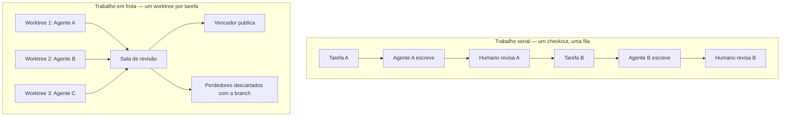

# Capítulo 1: A Crise do Trabalho Serial — O Gargalo Mudou de Lugar

## 1. Introdução

Existe um momento específico na vida de quem adota agentes de código em que a empolgação vira fila. Nas primeiras semanas, a sensação é de ganho puro: você descreve uma tarefa, o agente escreve o código, você revisa e segue. Passadas algumas semanas, o padrão muda de forma silenciosa — você já não está esperando o agente pensar, está esperando a *sua própria vez* de olhar o resultado. Cada tarefa nova precisa que a anterior termine, porque não existe um segundo lugar limpo para o agente trabalhar. O trabalho inteiro foi serializado, e ninguém percebeu.

Este é o problema que dá origem ao Orca ADE. A documentação oficial do produto descreve a categoria com uma precisão incomum: "Orca is a desktop IDE for running multiple AI coding agents side by side. Every task gets its own git worktree, its own agent terminal, and its own browser tab — so you can fan out work across Claude Code, Codex, Cursor CLI, and friends without stashing, branch-juggling, or losing flow" [1]. Note o que a frase promete e o que ela recusa. Ela promete **fan out** — abrir em leque. Ela recusa três desperdícios específicos: fazer stash, ficar trocando de branch e perder o fio da meada.

A tese deste capítulo é simples e incômoda: quando a geração de código deixa de ser o gargalo, o gargalo passa a ser a **serialização do trabalho humano e do contexto técnico**. Você não fica lento porque o modelo demora. Você fica lento porque existe um único checkout, um único terminal e uma única cabeça revisando um diff por vez.

Ao final deste capítulo, você saberá reconhecer os sintomas da serialização, entenderá por que o paralelismo ingênuo (abrir três abas e rodar a mesma coisa) não resolve, e conhecerá as fronteiras explícitas do produto que vamos estudar — incluindo o que ele declara *não* ser. Essa última parte importa mais do que parece: metade dos desastres de adoção de ferramentas agênticas nasce de esperar de uma ferramenta algo que ela nunca prometeu.

## 2. Explica

### 2.1 O gargalo que mudou de lugar

Durante décadas, o gargalo da engenharia de software foi a **produção** de código: escrever sintaxe, lembrar de APIs, manter compilação verde. Com agentes capazes de produzir grandes volumes de código plausível, o gargalo migrou para duas atividades que não escalam por decreto: **revisar** e **isolar**.

A revisão não escala porque exige julgamento humano. A própria documentação do Orca assume isso como premissa de produto ao declarar quem é seu público: "Orca is designed for people who already write code for a living and want to use AI as leverage — not as a replacement. It assumes you read diffs, care about commits, and keep a worktree tidy" [1]. A ferramenta não vende a ausência de revisão; ela vende a **viabilidade** da revisão. Se você não pretende ler diffs, o produto é explicitamente declarado como "not that" [1].

O isolamento não escala porque um checkout é um recurso singular. Enquanto existir apenas um diretório de trabalho, dois agentes que editam o mesmo arquivo colidem, e o segundo precisa esperar o primeiro. A solução não é disciplina — é **duplicar o espaço de trabalho** sem duplicar o repositório. É exatamente isso que a documentação afirma ao explicar o modelo: "Instead of branching and stashing on one checkout, every task gets its own on-disk copy of the repo via `git worktree`. This is what makes parallel agents safe — they never step on each other's files" [4].

Há uma métrica que ilustra a maturidade desse movimento: no momento em que este livro foi escrito, o repositório público da ferramenta acumulava **67,2 mil** estrelas e **4,4 mil** forks [65]. Uma comunidade desse tamanho em torno de um *ambiente* — e não de um modelo — indica que o problema real percebido pelo mercado não era a falta de inteligência, e sim a falta de espaço organizado para usá-la.

### 2.2 Fronteiras declaradas: o que o ambiente não é

Antes de aprender a operar o Orca, é preciso internalizar três negativas. Cada uma desmonta uma expectativa comum e evita uma classe inteira de frustração na adoção [1].

A primeira: **não é um modelo**. "Not a model. Orca runs agents you already use — bring your own Claude, Codex, or OpenCode subscription" [1]. O repositório do projeto repete a mesma ideia: "Run any coding agent with your own subscription" [65]. Isso significa que a qualidade do texto produzido continua sendo responsabilidade do agente que você escolher. O ambiente não melhora o modelo; ele organiza o trabalho em volta dele.

A segunda: **não é um substituto do git**. "Not a git replacement. Every worktree is a real git worktree. You can `cd` in and use plain git whenever you want" [1]. Essa fronteira é uma promessa de soberania: nada do que a ferramenta faz com branches está escondido em um formato proprietário. Você pode ignorar a interface e usar `git worktree` diretamente quando precisar.

A terceira: **não é um produto de VPS hospedado**. "Not a hosted VPS product. Orca runs on your desktop by default. Remote compute uses machines and cloud accounts you control — SSH targets, self-hosted Orca servers, or Cloud VMs / per-workspace environments" [1]. A documentação de modos de execução reforça essa fronteira com todas as letras: "Orca does not sell managed VPS hosting. Remote modes always use machines and cloud accounts you control" [42]. Consequência prática: a fatura de computação remota é do operador, e o desenho de rede é responsabilidade do operador.

### 2.3 Os quatro cenários que justificam uma frota

Nem todo trabalho merece paralelismo. A documentação enumera quatro situações em que a estrutura de frota se paga [1]:

1. **Competir no mesmo bug.** Rodar três agentes na mesma tarefa e escolher o vencedor. A justificativa está escrita de forma direta na receita oficial: "Different agents make different mistakes. Running the same task in parallel is cheaper than sequential retries and surfaces disagreement as a signal. Where three agents agree, the answer is probably right. Where they split, you've found the hard part" [53]. O paralelismo aqui não serve para acelerar: serve para **detectar incerteza**.
2. **Revisar diff gerado por IA a sério.** "You want to review AI-generated diffs seriously before you ship them" [1]. Isso exige instrumentos que veremos no Capítulo 8 — anotação por linha, procedência de linha, staging por trecho.
3. **Unificar assinaturas que você já paga.** "You already pay for Claude Code, Codex, or Cursor CLI and want one place to orchestrate them" [1]. A economia não vem de trocar de assinatura, e sim de parar de alternar entre três janelas com três estados mentais diferentes.
4. **Rodar agentes fora do laptop.** "You want agents to run remotely — over SSH, on a self-hosted Orca server, or in an on-demand VM — without giving up your IDE" [1]. É o caminho para trabalho longo que não deve morrer quando você fecha a tampa do computador.

### 2.4 Quem é o operador de frota

Existe uma mudança de identidade profissional embutida nesse arranjo. O programador serial é dono de uma linha de execução: faz, revisa, integra, repete. O **operador de frota** não escreve mais laços; ele **projeta ambientes** e depois lê sinais. Suas decisões passam a ser de outro tipo: quantos worktrees manter abertos, qual agente mandar em qual tarefa, quando confiar sem ler linha por linha, quando exigir uma segunda opinião automatizada.

Essa mudança não elimina a responsabilidade técnica — ela a concentra. A doc de configuração registra que o ambiente mede o que você consome: o *Resource Manager* da barra de status expõe CPU, memória, sessões, controles de daemon e varreduras de disco por workspace [49]; e o rastreio de uso mostra proximidade de limite de taxa dos provedores [19]. O operador de frota é, portanto, alguém que **mede** antes de opinar.

Há um contrapeso conceitual importante vindo da própria Anthropic, cujo material sobre construção de agentes é referência obrigatória do tema: "we recommend finding the simplest solution possible, and only increasing complexity when needed", reconhecendo que sistemas agênticos "often trade latency and cost for better task performance" [63]. A frota é uma escolha deliberada, não um default. Ela troca dinheiro e complexidade por redução de incerteza — e essa troca precisa ser consciente.

## 3. Ilustra

O diagrama a seguir contrasta o fluxo serial, em que cada tarefa espera a anterior no mesmo espaço de trabalho, com o fluxo de frota, em que o espaço é duplicado por tarefa e o trabalho passa a concorrer.



*Figura 1.1 — A mudança de gargalo. À esquerda, a fila serial imposta por um único checkout. À direita, o leque de worktrees isolados que permite que agentes diferentes ataquem tarefas diferentes — ou a mesma tarefa — sem colisão de arquivos [4][53].*

O ciclo de vida completo de cada worktree na frota segue cinco fases nomeadas pela documentação: criar, trabalhar, revisar, publicar e arquivar ou excluir [4]. O Capítulo 4 detalha cada uma; aqui basta reter a forma do ciclo, que é o que substitui a fila.

## 4. Técnica

O argumento deste capítulo é econômico, então vale medi-lo em vez de afirmá-lo. O script abaixo calcula o **custo de serialização** de um lote de tarefas sob duas políticas: fila serial e frota paralela. Ele não precisa de dependências externas e roda em qualquer Python 3.10 ou superior.

```python
#!/usr/bin/env python3
# -*- coding: utf-8 -*-
"""
custo_serializacao.py — Compara a vazão de um lote de tarefas sob duas políticas:
  (A) fila serial   — uma tarefa por vez, no mesmo espaço de trabalho;
  (B) frota paralela — N worktrees isolados, cada um com seu agente.

Argumento: o gargalo não é o tempo do agente, é a soma do tempo do agente com o
tempo de revisão humana, e a revisão não pode ser paralelizada além de 1.
"""

from __future__ import annotations

import sys
from dataclasses import dataclass


@dataclass(frozen=True)
class Tarefa:
    nome: str
    minutos_agente: int
    minutos_revisao: int


def tempo_serial(tarefas: list[Tarefa]) -> int:
    """Fila: cada tarefa ocupa agente + revisor, sequencialmente."""
    return sum(t.minutos_agente + t.minutos_revisao for t in tarefas)


def tempo_frota(tarefas: list[Tarefa], worktrees: int) -> int:
    """Frota: agentes concorrem; a revisão continua serial (um humano).

    Modela a frota como: tempo do agente mais lento em ondas de `worktrees`,
    seguido do tempo total de revisão — que é o recurso que não escala.
    """
    if worktrees < 1:
        raise ValueError("worktrees deve ser >= 1")

    restantes = sorted((t.minutos_agente for t in tarefas), reverse=True)
    ondas = [restantes[i:i + worktrees] for i in range(0, len(restantes), worktrees)]
    tempo_agentes = sum(max(onda) for onda in ondas if onda)

    tempo_revisao = sum(t.minutos_revisao for t in tarefas)
    return tempo_agentes + tempo_revisao


def resumo(tarefas: list[Tarefa], worktrees: int) -> str:
    serial = tempo_serial(tarefas)
    frota = tempo_frota(tarefas, worktrees)
    ganho = 100 * (serial - frota) / serial if serial else 0.0
    linhas = [
        f"tarefas no lote        : {len(tarefas)}",
        f"worktrees da frota     : {worktrees}",
        f"tempo serial (min)     : {serial}",
        f"tempo frota (min)      : {frota}",
        f"reducao de tempo       : {ganho:.1f} %",
    ]
    return "\n".join(linhas)


def main() -> int:
    lote = [
        Tarefa("corrigir corrida no login", minutos_agente=22, minutos_revisao=9),
        Tarefa("cobrir o módulo de faturas", minutos_agente=35, minutos_revisao=12),
        Tarefa("documentar o fluxo de check-out", minutos_agente=14, minutos_revisao=6),
        Tarefa("atualizar dependências", minutos_agente=18, minutos_revisao=5),
    ]

    print("=" * 58)
    print("CUSTO DE SERIALIZACAO — FILA SERIAL vs FROTA PARALELA")
    print("=" * 58)
    for worktrees in (1, 2, 4):
        print(f"\n--- cenario com {worktrees} worktree(s) ---")
        print(resumo(lote, worktrees))
    print("-" * 58)
    print("Leitura: aumentar worktrees reduz a fatia do agente, mas a")
    print("revisao humana permanece integral — por isso a frota exige")
    print("revisao barata (anotacao em lote e diff por trecho).")
    return 0


if __name__ == "__main__":
    sys.exit(main())
```

O resultado esperado deixa explícito o ponto central: a redução de tempo satura. Passar de um para quatro worktrees reduz a parcela dos agentes, mas **não toca** na parcela de revisão, que é o recurso humano não paralelizável. É por isso que o orçamento de revisão é o verdadeiro limitador da frota — e por isso o ambiente investe tanto em instrumentos de revisão (Capítulo 8) e em anotação em lote, cuja justificativa oficial é comportamental: "Sending comments one at a time causes the agent to swing back and forth. Batching keeps the feedback coherent: one round of thinking, one revision pass, and a much higher hit rate" [26].

Para verificar que o ambiente está instalado e alcançável antes de qualquer experimento de frota, a documentação fornece duas checagens que serão usadas repetidamente neste livro:

```bash
command -v orca
orca status --json
```

<!-- cli-check: fonte=A; confere=true -->

Se o aplicativo não estiver em execução, o ciclo de verificação começa com a abertura explícita do runtime:

```bash
orca open --json
orca status --json
```

<!-- cli-check: fonte=A; confere=true -->

Um exemplo do modelo de isolamento, para fixar o vocabulário. Criar um worktree nomeado, indicar o agente que deve iniciar nele e enviar o primeiro trabalho ao agente são operações distintas:

```bash
orca worktree create --repo id:<repoId> --name fix-login --json
orca worktree create --name review-api --agent claude --setup run --json
orca worktree create --name quick-check --agent codex --prompt "Summarize the diff" --setup skip --json
```

<!-- cli-check: fonte=A; confere=true -->

Cada comando acima carrega uma decisão: `--agent` define qual CLI assume o primeiro terminal, `--prompt` entrega trabalho inicial ao agente, e `--setup run|skip|inherit` decide se os hooks de preparação do repositório rodam, são ignorados ou seguem a política declarada [36].

## 5. Aplica

Para transformar este capítulo em prática, faça o diagnóstico do seu próprio trabalho antes de instalar qualquer coisa:

1. Liste suas últimas dez tarefas concluídas e marque, em cada uma, quanto tempo foi **agente** e quanto foi **revisão**. Se a revisão for menos de um quarto do total, você provavelmente está revisando rápido demais — o Capítulo 8 existe para corrigir isso.
2. Identifique quais dessas dez tarefas eram independentes entre si. Esse número é o tamanho natural da sua frota no início, e será pequeno.
3. Escolha **uma** tarefa repetitiva do dia para virar experimento controlado, como uma atualização de dependências ou uma revisão de PR pendente.
4. Rode a mesma tarefa com dois agentes diferentes em worktrees separados e compare os diffs. Não escolha o vencedor pela aparência do código; escolha por qual diff você consegue defender em voz alta.

Limites honestos que este capítulo estabelece e que valem para todo o resto do livro:

- O paralelismo **não reduz** o tempo de revisão. A revisão é o recurso serial e continuará sendo. Se você não tem tempo para revisar um diff, quatro worktrees apenas produzirão quatro vezes mais código não revisado.
- O paralelismo **consome mais** recursos da máquina. Cada worktree mantém observadores de arquivos vivos, e a orientação oficial em caso de problema de desempenho é fechar worktrees que não estão em uso ativo: "Close worktrees you're not actively using. Each worktree keeps file watchers alive" [51].
- A documentação **não** declara limites numéricos de worktrees simultâneos, agentes por instalação ou memória por aba. Nenhum número desse tipo deve ser assumido; a orientação é qualitativa e o instrumento de medição é o *Resource Manager* da barra de status [49][51].
- A frota **não elimina** a necessidade de ler o que foi gerado. A ferramenta é explícita ao dizer para quem ela existe: quem lê diffs e se importa com commits [1].

## 6. Conclusão

O gargalo mudou de lugar. Produzir código ficou barato; revisar e isolar continuam caros. Um ambiente de desenvolvimento agêntico existe para atacar exatamente essa assimetria: duplicar espaço de trabalho por tarefa, eliminar a colisão entre agentes e reduzir o custo de revisão a ponto de ela deixar de ser o gargalo silencioso.

Você também conheceu as três negativas que definem o perímetro do Orca — não é modelo, não substitui o git, não é VPS hospedado — e os quatro cenários que justificam montar uma frota: competir no mesmo bug, revisar diff de IA a sério, unificar assinaturas já pagas e rodar agentes fora do laptop. Por fim, medimos o argumento: a redução de tempo satura porque a revisão humana é serial.

No próximo capítulo, essa percepção vira vocabulário operacional. Antes de apertar qualquer botão, você vai aprender o que é um ADE, quais são os sete verbos do fluxo canônico e por que o ambiente trata "worktree" como a unidade fundamental de trabalho — não "arquivo", não "branch", não "agente".

## 7. Referências Bibliográficas

[1] ORCA. *What is Orca?* Orca Docs, 2026. Disponível em: <https://www.onorca.dev/docs>. Acesso em: 12 set. 2026. (A)

[4] ORCA. *Worktrees*. Orca Docs, 2026. Disponível em: <https://www.onorca.dev/docs/model/worktrees>. Acesso em: 12 set. 2026. (A)

[19] ORCA. *Usage & rate-limit tracking*. Orca Docs, 2026. Disponível em: <https://www.onorca.dev/docs/agents/usage-tracking>. Acesso em: 12 set. 2026. (A)

[26] ORCA. *Annotate AI Diff*. Orca Docs, 2026. Disponível em: <https://www.onorca.dev/docs/review/annotate-ai-diff>. Acesso em: 12 set. 2026. (A)

[29] ORCA. *GitHub in Orca*. Orca Docs, 2026. Disponível em: <https://www.onorca.dev/docs/review/github>. Acesso em: 12 set. 2026. (A)

[30] ORCA. *Linear in Orca*. Orca Docs, 2026. Disponível em: <https://www.onorca.dev/docs/review/linear>. Acesso em: 12 set. 2026. (A)

[31] ORCA. *Jira in Orca*. Orca Docs, 2026. Disponível em: <https://www.onorca.dev/docs/review/jira>. Acesso em: 12 set. 2026. (A)

[32] ORCA. *Per-worktree browser*. Orca Docs, 2026. Disponível em: <https://www.onorca.dev/docs/browser/overview>. Acesso em: 12 set. 2026. (A)

[35] ORCA. *Orca CLI overview*. Orca Docs, 2026. Disponível em: <https://www.onorca.dev/docs/cli/overview>. Acesso em: 12 set. 2026. (A)

[36] ORCA. *Orca CLI reference*. Orca Docs, 2026. Disponível em: <https://www.onorca.dev/docs/cli/reference>. Acesso em: 12 set. 2026. (A)

[37] ORCA. *Orchestration*. Orca Docs, 2026. Disponível em: <https://www.onorca.dev/docs/cli/orchestration>. Acesso em: 12 set. 2026. (A)

[38] ORCA. *Skills registry & MCP*. Orca Docs, 2026. Disponível em: <https://www.onorca.dev/docs/cli/skills>. Acesso em: 12 set. 2026. (A)

[39] ORCA. *Worktree checkpoints*. Orca Docs, 2026. Disponível em: <https://www.onorca.dev/docs/cli/worktree-checkpoints>. Acesso em: 12 set. 2026. (A)

[42] ORCA. *Ways to run Orca*. Orca Docs, 2026. Disponível em: <https://www.onorca.dev/docs/ways-to-run>. Acesso em: 12 set. 2026. (A)

[47] ORCA. *Notifications & Inbox*. Orca Docs, 2026. Disponível em: <https://www.onorca.dev/docs/notifications>. Acesso em: 12 set. 2026. (A)

[49] ORCA. *Settings reference*. Orca Docs, 2026. Disponível em: <https://www.onorca.dev/docs/settings>. Acesso em: 12 set. 2026. (A)

[51] ORCA. *Troubleshooting & FAQ*. Orca Docs, 2026. Disponível em: <https://www.onorca.dev/docs/troubleshooting>. Acesso em: 12 set. 2026. (A)

[53] ORCA. *Recipe: Race three agents on the same task*. Orca Docs, 2026. Disponível em: <https://www.onorca.dev/docs/recipes/parallel-agents>. Acesso em: 12 set. 2026. (A)

[62] GIT. *git-worktree(1)* — manage multiple working trees. Manual de referência, v2.54.0, 2026. Disponível em: <https://git-scm.com/docs/git-worktree>. Acesso em: 12 set. 2026. (A)

[63] ANTHROPIC. *Building effective agents*. Engineering, 2024. Disponível em: <https://www.anthropic.com/engineering/building-effective-agents>. Acesso em: 12 set. 2026. (A)

[65] STABLY AI. *Orca* — repositório oficial. GitHub, 2026. Disponível em: <https://github.com/stablyai/orca>. Acesso em: 12 set. 2026. (A)

[66] STABLY AI. *Orca Releases*. GitHub, 2026. Disponível em: <https://github.com/stablyai/orca/releases>. Acesso em: 12 set. 2026. (A)

[70] XTERM.JS. *Xterm.js* — terminal front-end component. 2026. Disponível em: <https://xtermjs.org/>. Acesso em: 12 set. 2026. (B)

[71] ELECTRON. *Build cross-platform desktop apps with JavaScript, HTML, and CSS*. 2026. Disponível em: <https://www.electronjs.org/>. Acesso em: 12 set. 2026. (B)
