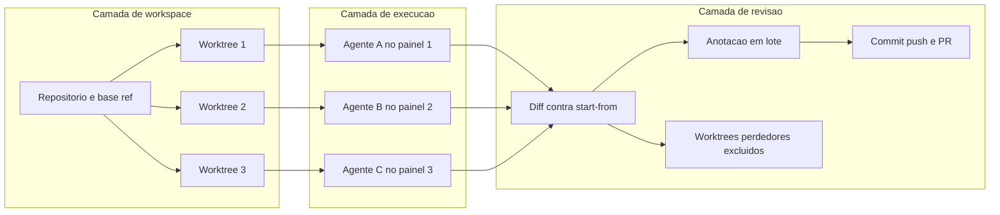

# Capítulo 2: O Que É o Orca ADE — Definições, Fronteiras e o Fluxo em Sete Verbos

## 1. Introdução

Todo ambiente de trabalho poderoso tem um custo de entrada que não é técnico, e sim conceitual. Você consegue instalar qualquer coisa em cinco minutos, mas passa semanas usando o instrumento errado porque ainda pensa na estrutura antiga. Com ambientes agênticos, esse descompasso é especialmente caro: quem tenta operar uma frota com a mentalidade de "um projeto aberto em uma janela" constrói uma fila disfarçada de paralelismo.

Este capítulo existe para pagar esse custo de entrada de uma vez. A documentação do Orca descreve a categoria em uma frase que vale dissecar palavra por palavra: "desktop IDE for running multiple AI coding agents side by side" [1]. Não é um servidor, não é uma extensão, não é um plugin de chat: é um ambiente integrado de desenvolvimento cujo objeto de primeira classe é o **agente em execução**, e não o arquivo aberto. O repositório oficial resume a ambição de outra forma: "The AI Orchestrator for 100x builders. Run Codex, ClaudeCode, OpenCode or Pi side-by-side — each in its own worktree, tracked in one place" [65].

A página mais importante de toda a documentação, segundo ela mesma, é a que descreve a primeira sessão com três agentes: "This is the single most important page in the docs. By the end you'll have three agents running in parallel on three different approaches to the same task, with one PR shipped" [3]. A escolha editorial é reveladora. A documentação não começa ensinando configuração avançada nem catálogo de comandos: começa ensinando **um fluxo completo até a entrega de um pull request**. Todo o restante da documentação é, nas palavras dela, "a deeper look at one of those steps" [3].

Ao final deste capítulo, você terá o vocabulário mínimo para operar qualquer parte do ambiente, conhecerá os sete verbos que resumem o produto inteiro e saberá exatamente o que esperar de cada superfície — da barra lateral ao terminal, do browser embutido ao CLI. Também verá por que "agnóstico de agente" é a decisão arquitetural mais consequente de todo o projeto.

## 2. Explica

### 2.1 ADE: a categoria e o que ela resolve

A sigla ADE significa *Agent Development Environment*, ambiente de desenvolvimento agêntico. A diferença em relação a uma IDE tradicional não está na quantidade de painéis, e sim na unidade de organização. Em uma IDE clássica, a árvore é: projeto → arquivo → buffer. Em um ADE, a árvore é: projeto → **worktree** → **sessão de agente**. O arquivo passa a ser um detalhe dentro de uma unidade maior, que é a tarefa em execução.

Essa inversão tem três consequências práticas imediatas. A primeira é que o estado de trabalho deixa de ser o que está aberto no editor e passa a ser **o que está acontecendo em cada worktree**. A segunda é que a conclusão de uma tarefa é um evento de máquina, não uma inferência humana: o ambiente observa a transição de "trabalhando" para "ocioso" [5]. A terceira é que a revisão ganha instrumentos próprios, porque agora existem muitos diffs concorrentes onde antes havia um.

A categoria explica por que o produto investe em coisas que uma IDE comum não teria: um painel de kanban de agentes [5], hibernação automática de sessões [15], histórico de sessões retomáveis [18], atribuição de procedência por linha de código [27] e um CLI que permite que o próprio agente dirija o ambiente [35].

### 2.2 Os sete verbos do fluxo canônico

A documentação fecha a página da primeira sessão com uma frase que funciona como espinha dorsal de todo o livro: "This flow — add → worktree → agent → split → diff → ship — is the whole of Orca. Every other page in these docs is a deeper look at one of those steps" [3]. Vamos tomar cada verbo como uma promessa verificável.

**Add (adicionar repositório).** Ao apontar o ambiente para um *checkout* local, ele "reads the repo's git state and picks up your default branch as its base ref — the ref every new worktree branches from", com possibilidade de alterar a base ref depois nas configurações do repositório [3]. O verbo é barato e define todo o resto: a base ref determina de onde as tarefas nascem.

**Worktree (criar espaço isolado).** O nome da tarefa é digitado — e, se ficar em branco, o ambiente nomeia sozinho com um nome de criatura marinha [3], comportamento que pode ser substituído por um prefixo customizado em `Default new-worktree name` [49]. O envio do formulário fecha o diálogo imediatamente: "the `git fetch` and `git worktree add` work continues in the background while you keep using Orca" [4]. O novo worktree aparece na barra lateral com uma linha de progresso, a aba mostra o status ao vivo e é possível cancelar; se falhar, o painel expõe o erro com *Retry* [4].

**Agent (escolher o agente).** No worktree recém-criado, um terminal abre com um seletor de agentes. A documentação define o comportamento com precisão: "Orca will launch the agent's CLI with the correct working directory and forward your subscription credentials" [3]. Nada de reautenticação, nada de configurar caminhos à mão: o ambiente entrega ao agente o diretório certo e as credenciais que você já possui.

**Split (dividir painéis).** Arrastar uma aba até a borda de um painel cria uma divisão: borda direita produz divisão horizontal, borda inferior produz divisão vertical; divisões se aninham, e "any tab type can split with any other — agent terminal, diff, browser, editor, PR view all coexist in one pane tree" [6]. O objetivo declarado é assistir vários agentes sem perder contexto [6].

**Diff (comparar).** Cada worktree tem diff contra o seu start-from ref, e o viewer é declarado como ferramenta de revisão séria e não de olhada rápida: "designed for serious review of AI-generated code — not a quick glance" [25].

**Ship (publicar).** O ciclo fecha com commit, push e abertura de revisão hospedada sem sair do ambiente [28].

**Race (a variação que dá nome ao método).** A receita oficial recomenda repetir os verbos anteriores em triplicata: "Create three worktrees from the same start-from ref. Name them `fix-bug`, `fix-bug-2`, `fix-bug-3`. Launch a different agent in each — Claude Code, Codex, Cursor CLI. Paste the same prompt into all three" e, ao final, "Commit, push, open PR from the winning worktree. Delete the two losers — one click removes the worktree and branch" [53].

### 2.3 O mapa de superfícies: onde cada coisa acontece

Um erro comum de iniciante é procurar funcionalidade no painel errado. Vale fixar o mapa das superfícies, porque cada uma tem um propósito distinto e a documentação é explícita sobre fronteiras.

- **Barra lateral (workspaces).** Agrupa worktrees por projeto; o cabeçalho tem filtro próprio, separado da busca global; worktrees não lidos aparecem em negrito; há fixação de itens no topo e um botão de busca que abre o *Worktree Jump Palette* (`Cmd-J`) [4].
- **Terminal.** O mesmo xterm.js que o VS Code usa, com adições pensadas para fluxos agênticos [20][70]: tema importável do Ghostty, escrita de clipboard por TUIs via OSC 52, busca no scrollback com regex, terminal flutuante global e comandos rápidos reutilizáveis [20].
- **Browser por worktree.** "Every Orca worktree has its own browser. It's a real Chromium window — address bar, history, devtools — embedded in a pane. Tabs are scoped to the worktree, so the app you're building against stays out of the way of your other work" [32].
- **Diff e Source Control.** Revisão por trecho, anotação por linha, atribuição de procedência e publicação [25][26][27][28].
- **Cabeçalho e notificações.** O sino mostra não lidas de todos os worktrees e clicar em uma notificação salta para worktree e painel correspondentes [47].
- **CLI `orca`.** Cliente de um runtime em execução, que permite scriptar worktrees, terminais, arquivos, browser e host [35][36].
- **Configurações.** Superfície pesquisável com `Cmd-,` e uma palavra-chave, onde vive praticamente todo o comportamento do ambiente [49].

### 2.4 O catálogo: número e intenção

O ambiente embarca **mais de 30 CLIs** pré-configuradas no seletor de agentes, com lançamento em um clique, e anota quais têm ganchos, status, rastreio de uso ou troca de conta [9]. A variedade não é colecionismo: é a expressão prática de uma decisão de arquitetura que veremos a seguir. O catálogo inclui desde integrações profundas — Claude Code, Codex e Cursor CLI — até agentes com recursos adicionais, como o Prime Agent, que soma histórico de sessão, e o MiniMax, que soma rastreio de uso e de limites de taxa [9].

Merece registro o que isso significa para o iniciante: você não precisa escolher "a ferramenta certa" de uma vez. Você pode manter assinaturas diferentes e usar cada uma onde ela é mais forte, porque o ambiente é o ponto de encontro, não o juiz da disputa.

### 2.5 Agnóstico de agente: a decisão que sustenta tudo

"Orca works with any CLI agent — the agent combobox just launches a process in a terminal" [9]. Essa frase, aparentemente banal, é o coração do projeto. Se o seletor apenas inicia um processo em um terminal, então o valor do ambiente não depende de um fornecedor de modelo específico, e a superfície de integração é o **terminal**, um contrato estável há décadas.

A consequência estratégica é a portabilidade. A documentação oficial publica **61 URLs** de referência organizadas por assunto [61], e a página inicial registra o princípio: "bring your own Claude, Codex, or OpenCode subscription" [1]. Nenhum recurso essencial do livro depende de um fornecedor único — o que muda entre agentes é a profundidade da integração, não a possibilidade de uso.

### 2.6 Distribuição e presença de plataforma

O ambiente é um aplicativo desktop com builds para macOS (Apple Silicon e Intel), Windows (instalador) e Linux (AppImage, .deb e .rpm), além de um cask mantido no Homebrew: `brew install --cask stablyai/orca/orca` [2]. Duas notas de plataforma importam para quem ensina ou dá suporte: no Windows o shell padrão é configurável entre PowerShell, Prompt de Comando e WSL [20], e no Linux o CLI se chama `orca-ide` justamente para não colidir com o leitor de tela GNOME Orca [2].

A presença móvel completa o quadro: há app para iOS distribuído pela App Store e pelo TestFlight, e um APK Android cuja versão registrada no momento desta pesquisa era **0.0.48** [65][46]. A página de uso móvel [45] trata o cenário em que o celular se reconecta às mesmas sessões de um runtime sempre ligado — o que só faz sentido com um servidor de execução, tema do Capítulo 14.

## 3. Ilustra

O diagrama abaixo organiza o ambiente em três camadas visíveis: a camada de workspace (onde as tarefas isoladas vivem), a camada de execução (onde agentes e processos rodam) e a camada de revisão (onde o humano decide). O fluxo de sete verbos atravessa as três.



*Figura 2.1 — As três camadas do ambiente e o percurso dos sete verbos: adicionar, criar worktree, escolher agente, dividir painéis, comparar diffs, publicar e descartar o que não venceu [3][4][6][25][28].*

## 4. Técnica

Nada substitui a leitura do mapa real do seu ambiente. O script a seguir interroga o runtime local e imprime um **relatório de prontidão**: repositórios registrados, base ref de cada um, worktrees existentes, terminais abertos e hosts disponíveis. Ele é deliberadamente somente-leitura e usa apenas a biblioteca padrão.

```python
#!/usr/bin/env python3
# -*- coding: utf-8 -*-
"""
prontidao_ade.py — Relatorio de prontidao do ambiente agentico local.

Le a saida JSON do CLI `orca` e resume o estado do ambiente: repositorios,
base ref, worktrees e hosts. Somente leitura: nao cria, altera nem remove nada.
"""

from __future__ import annotations

import json
import shutil
import subprocess
import sys


def rodar(*args: str, timeout: int = 20) -> dict | list | None:
    """Executa `orca <args> --json` e devolve o JSON, ou None em qualquer falha."""
    exe = shutil.which("orca") or shutil.which("orca-ide") or shutil.which("orca-dev")
    if not exe:
        return None
    try:
        proc = subprocess.run(
            [exe, *args, "--json"],
            capture_output=True, text=True, timeout=timeout, check=False,
        )
    except (OSError, subprocess.SubprocessError):
        return None
    if proc.returncode != 0:
        return None
    try:
        return json.loads(proc.stdout or "null")
    except ValueError:
        return None


def linhas_repositorios(dados) -> list[str]:
    if isinstance(dados, dict):
        itens = dados.get("repos") or dados.get("items") or []
    else:
        itens = dados or []
    saida = []
    for repo in itens:
        if not isinstance(repo, dict):
            continue
        nome = repo.get("name") or repo.get("path") or "(sem nome)"
        base = repo.get("baseRef") or repo.get("base_ref") or "(nao informada)"
        saida.append(f"  - {nome}  |  base ref: {base}")
    return saida


def linhas_worktrees(dados) -> list[str]:
    if isinstance(dados, dict):
        itens = dados.get("worktrees") or dados.get("items") or []
    else:
        itens = dados or []
    saida = []
    for wt in itens:
        if not isinstance(wt, dict):
            continue
        nome = wt.get("name") or wt.get("path") or "(sem nome)"
        branch = wt.get("branch") or "(detached)"
        saida.append(f"  - {nome}  |  branch: {branch}")
    return saida


def linhas_hosts(dados) -> list[str]:
    itens = dados if isinstance(dados, list) else (dados or {}).get("hosts", [])
    saida = []
    for host in itens or []:
        if not isinstance(host, dict):
            continue
        nome = host.get("name") or host.get("id") or "(sem nome)"
        tipo = host.get("kind") or host.get("type") or "local"
        saida.append(f"  - {nome}  ({tipo})")
    return saida


def bloco(titulo: str, linhas: list[str], vazio: str) -> None:
    print(f"\n{titulo}")
    print("-" * len(titulo))
    if linhas:
        print("\n".join(linhas))
    else:
        print(f"  {vazio}")


def main() -> int:
    print("=" * 62)
    print("RELATORIO DE PRONTIDAO DO AMBIENTE AGENTICO")
    print("=" * 62)

    status = rodar("status")
    if status is None:
        print("\n[!] Runtime inalcancavel. Verifique:")
        print("    1. o aplicativo Orca esta aberto?")
        print("    2. o CLI esta registrado (Settings -> General -> Orca CLI)?")
        print("    3. o binario esta no PATH? (no Linux o nome e orca-ide)")
        return 1

    if isinstance(status, dict):
        versao = status.get("version") or status.get("appVersion") or "(nao informada)"
        print(f"\nRuntime: OK  |  versao do app: {versao}")
    else:
        print("\nRuntime: OK")

    bloco("Repositorios registrados", linhas_repositorios(rodar("repo", "list")),
          "nenhum repositorio registrado ainda")
    bloco("Worktrees", linhas_worktrees(rodar("worktree", "ps")),
          "nenhum worktree ativo")
    bloco("Hosts disponiveis", linhas_hosts(rodar("host", "list")),
          "apenas esta maquina")

    print("\n" + "=" * 62)
    print("Proximo passo: crie um worktree e escolha um agente.")
    print("=" * 62)
    return 0


if __name__ == "__main__":
    sys.exit(main())
```

O script depende de que o runtime esteja acessível — e é justamente essa a primeira lição operacional do ambiente. A documentação define o estado esperado com clareza: "The `orca` CLI talks to a running Orca runtime" [36]. Antes de qualquer comando produtivo, a verificação é esta:

```bash
command -v orca
orca status --json
```

<!-- cli-check: fonte=A; confere=true -->

Se o aplicativo não estiver aberto, a sequência é abrir e reconfirmar:

```bash
orca open --json
orca status --json
```

<!-- cli-check: fonte=A; confere=true -->

Para materializar o mapa de superfícies em dados, três consultas bastam no início de qualquer sessão de trabalho — quais repositórios existem, qual é a base ref de cada um e quais worktrees estão vivos neste momento:

```bash
orca repo list --json
orca repo show --repo id:<repoId> --json
orca repo set-base-ref --repo id:<repoId> --ref origin/main --json
orca worktree ps --json
```

<!-- cli-check: fonte=A; confere=true -->

A documentação recomenda fixar a base ref **antes** de criar muitos worktrees, porque ela é o ponto de ramificação padrão de cada tarefa nova [36]. Trocar a base ref depois de abrir vinte worktrees significa conviver com vinte ramificações de origens diferentes sem perceber.

## 5. Aplica

Exercício de reconhecimento de superfície. O objetivo não é produzir código, mas construir o mapa mental que os próximos capítulos vão refinar.

1. Abra o ambiente, registre um repositório que você conhece bem e anote, por escrito, qual é a base ref que ele assumiu [3].
2. Crie **um** worktree com nome descritivo, deixando o campo de nome preenchido por você — usar o nome automático de criatura marinha atrapalha o reconhecimento depois [3][49].
3. Escolha um agente no seletor e observe o diretório de trabalho que ele recebeu. Confirme que é o caminho do worktree novo, e não o do checkout principal [3].
4. Divida a área de trabalho em dois painéis arrastando uma aba até a borda e reproduza, mentalmente, o percurso dos sete verbos até "ship" [6][3].
5. Abra o painel de notificações e localize o sino do cabeçalho; clique em um item e observe o salto para o worktree correspondente [47].
6. Por último, reduza o ambiente à sua interface sem mouse: use a paleta de salto de worktrees (`Cmd-J`) e a busca global [4].

Limites e ressalvas que este capítulo fixa, e que evitam expectativas erradas adiante:

- O ambiente **não** melhora o texto produzido pelo agente. Ele organiza o trabalho em volta de um agente que você traz e paga [1][65].
- O ambiente **não** substitui o git. Todo worktree é um worktree real e pode ser inspecionado com git puro [1][62].
- O ambiente **não** é VPS hospedado. Se você usar execução remota, a infraestrutura é sua e a fatura também [1][42].
- Nada garante que uma CLI de agente que existe hoje continue existindo amanhã — a agnosticidade é justamente a proteção contra essa incerteza [9].
- A documentação envelhece. A própria página de skills declara que as flags vivem no binário "so they cannot drift from the app version" e recomenda carregar o guia da versão antes de usar comandos [38]. Em obra técnica, isso vale como regra de conduta: **confira a versão antes de confiar na memória**.

## 6. Conclusão

Você agora tem o vocabulário mínimo do ambiente: ADE como categoria, worktree como unidade de trabalho, agente como processo descartável, diff como contrato de revisão. Conheceu os sete verbos — adicionar, criar worktree, escolher agente, dividir, comparar, publicar e a variação competitiva que roda três agentes na mesma tarefa — e sabe que todo o restante da documentação é aprofundamento de um deles [3].

Também fixou as fronteiras: não é modelo, não substitui o git, não é VPS hospedado [1]. E reconheceu a decisão de arquitetura que sustenta a portabilidade do conjunto: o seletor apenas inicia um processo em um terminal, o que torna o catálogo de mais de 30 CLIs uma conveniência, e não uma dependência [9].

No próximo capítulo, esse mapa vira movimento. Você vai executar o fluxo completo, do download à publicação de um pull request, incluindo o que fazer quando cada etapa falha — porque a documentação oficial dedicou uma página inteira a você não ficar preso no meio do caminho [51].

## 7. Referências Bibliográficas

[1] ORCA. *What is Orca?* Orca Docs, 2026. Disponível em: <https://www.onorca.dev/docs>. Acesso em: 12 set. 2026. (A)

[2] ORCA. *Install*. Orca Docs, 2026. Disponível em: <https://www.onorca.dev/docs/install>. Acesso em: 12 set. 2026. (A)

[3] ORCA. *Your first 3-agent session*. Orca Docs, 2026. Disponível em: <https://www.onorca.dev/docs/first-session>. Acesso em: 12 set. 2026. (A)

[4] ORCA. *Worktrees*. Orca Docs, 2026. Disponível em: <https://www.onorca.dev/docs/model/worktrees>. Acesso em: 12 set. 2026. (A)

[5] ORCA. *Agents & sessions*. Orca Docs, 2026. Disponível em: <https://www.onorca.dev/docs/model/agents-sessions>. Acesso em: 12 set. 2026. (A)

[6] ORCA. *Tabs, panes & split layouts*. Orca Docs, 2026. Disponível em: <https://www.onorca.dev/docs/model/tabs-panes-splits>. Acesso em: 12 set. 2026. (A)

[7] ORCA. *Quick open*. Orca Docs, 2026. Disponível em: <https://www.onorca.dev/docs/model/quick-open>. Acesso em: 12 set. 2026. (A)

[8] ORCA. *Session restore*. Orca Docs, 2026. Disponível em: <https://www.onorca.dev/docs/model/session-restore>. Acesso em: 12 set. 2026. (A)

[9] ORCA. *Supported agents*. Orca Docs, 2026. Disponível em: <https://www.onorca.dev/docs/agents/supported>. Acesso em: 12 set. 2026. (A)

[15] ORCA. *Agent hibernation*. Orca Docs, 2026. Disponível em: <https://www.onorca.dev/docs/agents/hibernation>. Acesso em: 12 set. 2026. (A)

[18] ORCA. *Agent session history*. Orca Docs, 2026. Disponível em: <https://www.onorca.dev/docs/agents/session-history>. Acesso em: 12 set. 2026. (A)

[20] ORCA. *Terminal*. Orca Docs, 2026. Disponível em: <https://www.onorca.dev/docs/terminal>. Acesso em: 12 set. 2026. (A)

[25] ORCA. *Diff viewer*. Orca Docs, 2026. Disponível em: <https://www.onorca.dev/docs/review/diff-viewer>. Acesso em: 12 set. 2026. (A)

[26] ORCA. *Annotate AI Diff*. Orca Docs, 2026. Disponível em: <https://www.onorca.dev/docs/review/annotate-ai-diff>. Acesso em: 12 set. 2026. (A)

[27] ORCA. *Attribution*. Orca Docs, 2026. Disponível em: <https://www.onorca.dev/docs/review/attribution>. Acesso em: 12 set. 2026. (A)

[28] ORCA. *Commit & push from Orca*. Orca Docs, 2026. Disponível em: <https://www.onorca.dev/docs/review/commit-push>. Acesso em: 12 set. 2026. (A)

[32] ORCA. *Per-worktree browser*. Orca Docs, 2026. Disponível em: <https://www.onorca.dev/docs/browser/overview>. Acesso em: 12 set. 2026. (A)

[35] ORCA. *Orca CLI overview*. Orca Docs, 2026. Disponível em: <https://www.onorca.dev/docs/cli/overview>. Acesso em: 12 set. 2026. (A)

[36] ORCA. *Orca CLI reference*. Orca Docs, 2026. Disponível em: <https://www.onorca.dev/docs/cli/reference>. Acesso em: 12 set. 2026. (A)

[38] ORCA. *Skills registry & MCP*. Orca Docs, 2026. Disponível em: <https://www.onorca.dev/docs/cli/skills>. Acesso em: 12 set. 2026. (A)

[42] ORCA. *Ways to run Orca*. Orca Docs, 2026. Disponível em: <https://www.onorca.dev/docs/ways-to-run>. Acesso em: 12 set. 2026. (A)

[45] ORCA. *Mobile*. Orca Docs, 2026. Disponível em: <https://www.onorca.dev/docs/mobile>. Acesso em: 12 set. 2026. (A)

[46] ORCA. *Android APK*. Orca Docs, 2026. Disponível em: <https://www.onorca.dev/docs/android-apk>. Acesso em: 12 set. 2026. (A)

[47] ORCA. *Notifications & Inbox*. Orca Docs, 2026. Disponível em: <https://www.onorca.dev/docs/notifications>. Acesso em: 12 set. 2026. (A)

[49] ORCA. *Settings reference*. Orca Docs, 2026. Disponível em: <https://www.onorca.dev/docs/settings>. Acesso em: 12 set. 2026. (A)

[51] ORCA. *Troubleshooting & FAQ*. Orca Docs, 2026. Disponível em: <https://www.onorca.dev/docs/troubleshooting>. Acesso em: 12 set. 2026. (A)

[53] ORCA. *Recipe: Race three agents on the same task*. Orca Docs, 2026. Disponível em: <https://www.onorca.dev/docs/recipes/parallel-agents>. Acesso em: 12 set. 2026. (A)

[58] ORCA. *Download*. Orca Docs, 2026. Disponível em: <https://www.onorca.dev/download>. Acesso em: 12 set. 2026. (A)

[59] ORCA. *Enterprise*. Orca Docs, 2026. Disponível em: <https://www.onorca.dev/enterprise>. Acesso em: 12 set. 2026. (A)

[61] ORCA. *Sitemap da documentação oficial* (61 URLs publicadas). Orca Docs, 2026. Disponível em: <https://www.onorca.dev>. Acesso em: 12 set. 2026. (A)

[62] GIT. *git-worktree(1)* — manage multiple working trees. Manual de referência, v2.54.0, 2026. Disponível em: <https://git-scm.com/docs/git-worktree>. Acesso em: 12 set. 2026. (A)

[65] STABLY AI. *Orca* — repositório oficial. GitHub, 2026. Disponível em: <https://github.com/stablyai/orca>. Acesso em: 12 set. 2026. (A)

[70] XTERM.JS. *Xterm.js* — terminal front-end component. 2026. Disponível em: <https://xtermjs.org/>. Acesso em: 12 set. 2026. (B)
