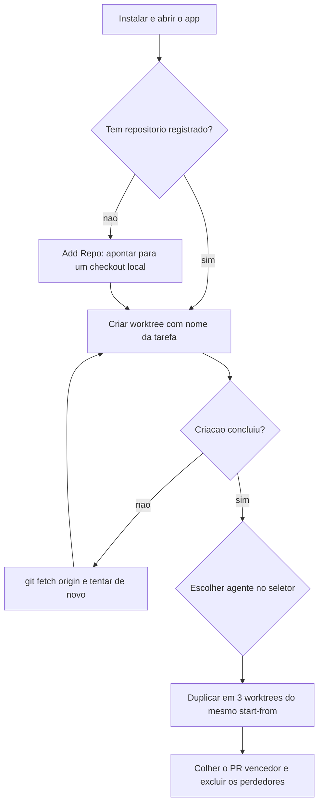

# Capítulo 3: Do Download ao PR — Instalação e Primeira Sessão com Três Agentes

## 1. Introdução

Existe uma diferença entre ler sobre um instrumento e operá-lo. Este capítulo existe para atravessar essa fronteira: ao final, você terá percorrido o caminho completo de um ambiente vazio até um pull request aberto, com três agentes tendo competido na mesma tarefa.

A documentação oficial não esconde a ambição dessa primeira sessão. Ela chama a página de "the single most important page in the docs" e declara o resultado esperado logo na primeira linha: "From empty app to three agents running in parallel in under five minutes" [3]. Esse número — **menos de 5 minutos** para a primeira sessão com três agentes — é uma promessa de produto e, ao mesmo tempo, um teste: se você levar muito mais do que isso, algo no seu ambiente está fora do padrão, e vale diagnosticar antes de continuar.

O capítulo está organizado na ordem em que as coisas acontecem. Primeiro a instalação e o primeiro lançamento, com as peculiaridades de cada sistema operacional. Depois a política de atualização, que em ferramentas com cadência diária é uma decisão de risco consciente. Em seguida a criação do primeiro worktree, com todos os controles que o formulário oferece. Depois a corrida de três agentes. E, por fim, o mapa de falhas mais comuns e como diagnosticá-las — porque a documentação oficial reserva uma página inteira para isso [51], e quem ignora essa página tende a concluir, erradamente, que o instrumento não funciona.

## 2. Explica

### 3.1 Instalação: os três caminhos principais

O ambiente é um aplicativo desktop. A documentação de instalação lista, por plataforma, o seguinte [2]: para macOS há builds para Apple Silicon e para Intel, assinadas e notarizadas; para Windows há um instalador; para Linux há AppImage, pacotes `.deb` e `.rpm`; e há ainda um cask mantido no Homebrew, atualizado automaticamente a cada versão estável:

```bash
brew install --cask stablyai/orca/orca
```

<!-- cli-check: fonte=A; confere=true -->

Versões antigas permanecem sempre disponíveis na página de releases do projeto [2][66]. Essa disponibilidade não é detalhe de conveniência: em ferramentas que publicam diariamente, poder voltar a um build conhecido é parte do plano de contingência.

Uma nota de plataforma merece destaque para quem instala em Linux: o binário do CLI chama-se `orca-ide`, e não `orca`, justamente para não colidir com o leitor de tela GNOME, que também se chama Orca [2]. Esquecer isso produz um erro clássico de primeira sessão: o comando "não existe" simplesmente porque o nome é outro.

No macOS, o aplicativo é assinado e notarizado, mas a documentação avisa que o sistema pode ainda pedir confirmação na primeira execução, comportamento normal para aplicativos construídos sobre Electron [2][71]. No Linux, a escolha do formato tem consequência prática: "Choose the AppImage if you want Orca to update itself. The `.deb` and `.rpm` packages report available updates and give you the package-manager command to install them; quit Orca before running that command" [2].

### 3.2 Primeiro lançamento: três coisas acontecem

Na primeira execução, o aplicativo pede acesso ao diretório pessoal para poder adicionar repositórios, oferece importar configurações existentes de `~/.claude`, `~/.codex` e do terminal Ghostty quando presentes, e entrega uma tela inicial vazia onde o primeiro repositório é adicionado [2]. Cada uma dessas três etapas tem uma consequência que raramente é explicada.

Pedir acesso ao diretório pessoal é o que permite descobrir *checkouts* já existentes no disco e ler o estado do git deles sem que você precise navegar até cada pasta [2]. A importação de configurações é o que faz o terminal nascer com a aparência e o esquema de teclas a que você já está acostumado [2]. E a tela vazia é uma decisão de produto: o ambiente não presume um projeto padrão; ele espera que você declare onde está o seu trabalho [2].

No Windows, há uma decisão adicional na primeira sessão: o shell padrão do terminal, configurável entre PowerShell, Prompt de Comando e WSL, sendo o WSL oferecido automaticamente quando `wsl.exe --status` tem sucesso [20].

### 3.3 Atualizações: estável, release candidate e a decisão de risco

A política de atualização é explícita e merece ser lida como decisão de engenharia, não como configuração: "Orca auto-updates by default, tracking the stable channel. Stable releases are vetted; RC (release candidate) builds ship new features first, often daily" [2].

Não existe um opt-in permanente no canal de pré-lançamento. O acesso a builds RC é feito por gestos modificadores no botão de verificação de atualizações [2][49]: o modificador `Shift` inclui o RC mais recente; `Cmd`/`Ctrl` traz o último pré-lançamento com etiqueta de performance; e `Option` (apenas macOS) permite escolher um build local validado pelos testes de compatibilidade [2]. Se o build local falhar na verificação, a interface reporta "Could Not Use Local Build" e oferece escolher outro [49].

Existe um alívio importante para quem teme perder trabalho: "Older versions are always available on the GitHub Releases page. Orca will not force-downgrade your worktree data if you go back" [2]. Em português direto: voltar de versão não destrói os dados dos seus worktrees.

### 3.4 O primeiro worktree, campo por campo

O primeiro worktree é onde quase todos os mal-entendidos aparecem. Vale percorrer o formulário como quem lê um contrato.

**Nome da tarefa.** Você digita um nome legível — `fix-login-race` é citado como exemplo — e, se deixar em branco, o ambiente escolhe um nome de criatura marinha; o prefixo padrão é configurável em `Default new-worktree name` [3][49]. O nome não é decorativo: ele deriva o nome da branch, aparece no cartão do worktree e é o que você vai procurar na paleta de salto.

**Start-from ref.** Este é o campo mais importante. Você escolhe de onde a tarefa ramifica, e as opções são quatro: a base ref do repositório (o caminho rápido), outra branch local (útil para empilhar trabalho sobre um pull request em revisão), um SHA de commit específico, ou uma branch remota existente, que o ambiente busca e faz checkout [4].

**Criação em segundo plano.** Ao confirmar, o diálogo fecha imediatamente e o trabalho pesado continua fora dele: "the `git fetch` and `git worktree add` work continues in the background while you keep using Orca" [4]. O novo worktree aparece com uma linha de progresso, a aba mostra o status ao vivo e a operação pode ser cancelada; em caso de falha, o painel mostra o erro com *Retry* [4].

**Gaveta avançada.** Expandindo a seção avançada, é possível fixar explicitamente o nome da branch (por exemplo `feature/my-branch`) e escolher um worktree pai, o que apenas aninha os itens na barra lateral sem alterar histórico nem branches [4]. Uma sutileza documentada: o campo de nome de branch **não** é oferecido quando o workspace está atrelado a um item rastreado, porque nesse caso a branch é derivada do item — e um pull request do GitHub vinculado chega a re-resolver a branch no momento do envio [4].

**Vínculo com item de trabalho.** Ainda no campo de nome é possível vincular um PR do GitHub, uma issue do Linear, um merge request do GitLab ou uma issue do Jira, colando a URL ou buscando no modo Jira; itens vinculados aparecem no cartão do worktree [4]. Quando a criação vem de uma issue do Linear, o ambiente usa o nome de branch que o próprio Linear sugere para aquela issue, em vez de apenas transformar o título em slug [4].

### 3.5 A corrida de três agentes

Com o primeiro worktree funcionando, o passo seguinte é deliberadamente redundante: repetir a criação duas vezes, de modo a obter três worktrees ramificados do mesmo start-from ref — `fix-login-race`, `fix-login-race-2`, `fix-login-race-3` — e lançar um agente diferente em cada um: Claude Code, Codex e Cursor CLI [3][53].

Então vem a parte que exige disciplina: colar **o mesmo prompt** nos três [53]. O valor do experimento está justamente em manter constante a variável que você controla (a tarefa) e variar apenas o agente.

Depois, divida os painéis para assistir aos três trabalharem ao mesmo tempo [6]. Quando estabilizarem, abra cada worktree e compare os diffs. A documentação sugere usar anotação por linha no que chegou mais perto e devolver os comentários como um lote único ao agente escolhido [3][26]. Por fim, publique a partir do worktree vencedor e apague os dois perdedores: "one click removes the worktree and branch" [3].

O racional é econômico e epistêmico ao mesmo tempo: "Different agents make different mistakes. Running the same task in parallel is cheaper than sequential retries and surfaces disagreement as a signal. Where three agents agree, the answer is probably right. Where they split, you've found the hard part" [53].

### 3.6 Quando não funciona: o mapa de falhas da primeira sessão

A documentação oficial dedica uma página a solução de problemas [51], e três falhas concentram a maioria dos casos de primeira sessão.

**O agente não inicia.** A ordem de diagnóstico é: abrir o terminal e rodar a CLI do agente manualmente; se ela falhar ali, o problema é de autenticação ou instalação da própria CLI, não do ambiente. Em seguida, conferir se a CLI está no `PATH` que o ambiente enxerga, em `Settings → Agents`. Por último, usar o chip de reinício na aba [51].

**A criação do worktree falha.** As duas causas citadas são: o start-from ref não estar buscado — resolvido com `git fetch origin` no repositório — e o diretório de destino já ter um worktree para aquela branch, o que exige apagar o existente ou escolher outro nome [51].

**O CLI responde "command not found".** É preciso registrar o CLI em `Settings → General → Orca CLI`. No macOS, o registro instala um _shim_ em `~/.local/bin`, e esse diretório precisa estar no `PATH` do seu shell [51]. No Linux, lembre do nome alternativo `orca-ide` [2].

## 3. Ilustra

O diagrama abaixo descreve a primeira sessão como uma sequência com pontos de verificação explícitos. Cada losango é um teste que pode falhar — e a seta de retorno para o diagnóstico é o que a maioria dos tutoriais omite.



*Figura 3.1 — A primeira sessão com pontos de verificação. A criação de worktree pode falhar por referência não buscada; o lançamento de agente pode falhar por CLI fora do PATH; ambos os casos têm diagnóstico documentado [51][4].*

## 4. Técnica

Antes de abrir o aplicativo, vale automatizar a verificação de pré-requisitos. O script a seguir inspeciona a máquina e reporta o que está presente, o que está ausente e qual é o próximo passo — sem instalar nada silenciosamente.

```python
#!/usr/bin/env python3
# -*- coding: utf-8 -*-
"""
pre_requisitos_ade.py — Auditoria de pre-requisitos para a primeira sessao.

Verifica presenca, no PATH, das ferramentas que o ambiente e os agentes
costumam exigir, e reporta o estado do runtime do Orca quando ele responde.
Nao instala nada: apenas diagnostica e imprime o proximo passo.
"""

from __future__ import annotations

import json
import platform
import shutil
import subprocess
import sys

# (comando, descricao, obrigatorio, dica de correcao)
FERRAMENTAS = [
    ("git", "controle de versao (worktrees nativas)", True,
     "instale o git e confirme que esta no PATH"),
    ("orca", "CLI do Orca no macOS e Windows", False,
     "registre em Settings -> General -> Orca CLI"),
    ("orca-ide", "CLI do Orca no Linux (nome alternativo)", False,
     "o nome evita conflito com o leitor de tela GNOME Orca"),
    ("node", "runtime usado por varias CLIs de agente", False,
     "instale o Node.js LTS se o seu agente exigir npm"),
    ("npm", "instalador de CLIs de agente via npm", False,
     "instale com o Node.js; usado por ex.: Claude Code"),
    ("gh", "GitHub CLI, usada em checks de PR e rate limit", False,
     "opcional: instale se for trabalhar com PRs pelo terminal"),
]


def info_sistema() -> str:
    return f"{platform.system()} {platform.release()} ({platform.machine()})"


def checar(comando: str) -> str | None:
    return shutil.which(comando)


def versao(comando: str) -> str:
    for flag in ("--version", "-v"):
        try:
            proc = subprocess.run([comando, flag], capture_output=True,
                                  text=True, timeout=8, check=False)
        except (OSError, subprocess.SubprocessError):
            continue
        if proc.returncode == 0 and proc.stdout.strip():
            return proc.stdout.strip().splitlines()[0][:70]
    return "(versao nao informada)"


def estado_runtime() -> tuple[bool, str]:
    exe = checar("orca") or checar("orca-ide")
    if not exe:
        return False, "CLI nao encontrado no PATH"
    try:
        proc = subprocess.run([exe, "status", "--json"], capture_output=True,
                              text=True, timeout=15, check=False)
    except (OSError, subprocess.SubprocessError):
        return False, "falha ao executar o CLI"
    if proc.returncode != 0:
        return False, "runtime nao responde (o app esta aberto?)"
    try:
        dados = json.loads(proc.stdout or "{}")
    except ValueError:
        return True, "runtime respondeu (saida nao-JSON)"
    versao_app = dados.get("version") or dados.get("appVersion") or "(nao informada)"
    return True, f"runtime OK, versao do app: {versao_app}"


def main() -> int:
    print("=" * 66)
    print("PRE-REQUISITOS — PRIMEIRA SESSAO NO AMBIENTE AGENTICO")
    print("=" * 66)
    print(f"sistema: {info_sistema()}")
    print(f"python : {sys.version.split()[0]}")
    print()

    faltando_obrigatorios, faltando_opcionais = [], []
    for comando, descricao, obrigatorio, dica in FERRAMENTAS:
        caminho = checar(comando)
        if caminho:
            print(f"[OK]   {comando:<10} {versao(caminho)}")
            print(f"       local: {caminho}")
        else:
            marca = "[FALTA]" if obrigatorio else "[OPC]  "
            print(f"{marca} {comando:<10} {descricao}")
            print(f"       dica: {dica}")
            (faltando_obrigatorios if obrigatorio else faltando_opcionais).append(comando)

    print()
    ok, detalhe = estado_runtime()
    print(f"[{'OK' if ok else 'FALTA'}] runtime     {detalhe}")

    print()
    print("-" * 66)
    if faltando_obrigatorios:
        print("BLOQUEIO: instale as ferramentas obrigatorias antes de comecar:")
        for c in faltando_obrigatorios:
            print(f"  - {c}")
        return 1
    if faltando_opcionais:
        print("Pronto para comecar. Opcionais ausentes (instale conforme a")
        print("necessidade do agente escolhido): " + ", ".join(faltando_opcionais))
    else:
        print("Ambiente completo: todos os itens verificados estao presentes.")
    print("Proximo passo: abrir o app, registrar um repositorio e criar um worktree.")
    return 0


if __name__ == "__main__":
    sys.exit(main())
```

Depois da instalação, a sequência de validação do runtime é a mesma do capítulo anterior — e vale repeti-la porque ela é o primeiro comando de toda sessão de trabalho:

```bash
command -v orca
orca status --json
```

<!-- cli-check: fonte=A; confere=true -->

Com o runtime respondendo, criar os três worktrees da corrida é mecânico. Note que o nome é o único campo obrigatório para começar, e que o agente pode ser definido já na criação:

```bash
orca worktree create --repo id:<repoId> --name fix-login-race --agent claude --json
orca worktree create --repo id:<repoId> --name fix-login-race-2 --agent codex --json
orca worktree create --repo id:<repoId> --name fix-login-race-3 --json
```

<!-- cli-check: fonte=A; confere=true -->

Para acompanhar os terminais criados e confirmar que cada agente recebeu o diretório correto, a listagem e a leitura de terminal são os instrumentos:

```bash
orca terminal list --worktree active --json
orca terminal read --terminal <handle> --json
orca terminal wait --terminal <handle> --for tui-idle --timeout-ms 300000 --json
```

<!-- cli-check: fonte=A; confere=true -->

A documentação de referência recomenda uma prática que evita a maior parte dos erros de automação: "Read before sending when you are not sure what the terminal is waiting for" [36]. E registra uma armadilha específica de scripts longos: handles de terminal são escopados ao runtime, então se o aplicativo reiniciar, o handle antigo é inválido e precisa ser readquirido com uma nova listagem [36].

## 5. Aplica

Roteiro da primeira sessão, na ordem exata em que as coisas devem acontecer:

1. Instale o aplicativo para o seu sistema e abra-o. Aceite o acesso ao diretório pessoal e, se oferecido, importe `~/.claude`, `~/.codex` e as configurações do Ghostty [2].
2. Registre um repositório em *Add Repo* e anote a base ref que o ambiente escolheu [3].
3. Crie o primeiro worktree. Use um nome que descreva a tarefa, escolha a base ref como start-from e observe a criação em segundo plano [4].
4. No worktree novo, selecione o agente no seletor e confirme, no terminal, que o diretório de trabalho é o do worktree — não o do checkout principal [3].
5. Repita a criação duas vezes para obter três worktrees do mesmo start-from, lançando um agente diferente em cada um [53].
6. Cole o mesmo prompt nos três e divida os painéis para assisti-los em paralelo [6][53].
7. Compare os três diffs, comente por linha no que chegou mais perto e envie os comentários como **um único lote** [26][3].
8. Faça commit e push do vencedor, abra a revisão hospedada e exclua os dois perdedores com um clique [3].

Limites e ressalvas que este capítulo deixa explícitos:

- A promessa de "menos de 5 minutos" pressupõe que o CLI do agente já esteja instalado e autenticado. O ambiente entrega credenciais e diretório de trabalho, mas não instala nem autentica a CLI por você [3][51].
- O canal de atualização estável é o recomendado; RC é um canal de risco assumido, e não existe opt-in permanente — cada acesso exige o gesto modificador [2].
- O campo de nome de branch **não** aparece quando o workspace está vinculado a um item rastreado, porque a branch vem do item. Não é bug: é proteção contra override silenciosamente ignorado [4].
- A criação de worktree pode ser cancelada ou falhar; o erro aparece com *Retry* e as causas conhecidas são referência não buscada e branch já existente em outro worktree [4][51].
- O vínculo com Linear, Jira, GitLab e GitHub depende de integração e autenticação próprias; a obra não afirma detalhes de fluxo dessas integrações além do que a documentação declara [4][29][30][31].
- Se você trabalha em Linux, o nome do CLI é `orca-ide`; em host headless, os wrappers de skills não exigem Settings nem runtime em execução para instalar skills [2][38].

## 6. Conclusão

Neste capítulo o ambiente deixou de ser conceito. Você percorreu a instalação nos três sistemas operacionais, entendeu o que o primeiro lançamento realmente pede, aprendeu a política de atualização como decisão de risco e montou um worktree campo por campo, sabendo por que o start-from ref é a escolha mais consequente do formulário.

Depois veio a corrida de três agentes, com uma regra não negociável — o mesmo prompt nos três — e um critério de decisão mais honesto que a intuição: onde os agentes concordam, a resposta provavelmente está certa; onde divergem, você encontrou a parte difícil [53]. E, ao final, você recebeu o mapa de falhas da primeira sessão com os três diagnósticos que resolvem a maioria dos travamentos [51].

O próximo capítulo desce um nível técnico e responde a pergunta que ficou no ar: o que exatamente é um `git worktree`, por que ele é seguro para agentes paralelos, e como lidar com o problema mais traiçoeiro do isolamento — dependências, caches e segredos que simplesmente não existem em um checkout recém-criado.

## 7. Referências Bibliográficas

[2] ORCA. *Install*. Orca Docs, 2026. Disponível em: <https://www.onorca.dev/docs/install>. Acesso em: 12 set. 2026. (A)

[3] ORCA. *Your first 3-agent session*. Orca Docs, 2026. Disponível em: <https://www.onorca.dev/docs/first-session>. Acesso em: 12 set. 2026. (A)

[4] ORCA. *Worktrees*. Orca Docs, 2026. Disponível em: <https://www.onorca.dev/docs/model/worktrees>. Acesso em: 12 set. 2026. (A)

[5] ORCA. *Agents & sessions*. Orca Docs, 2026. Disponível em: <https://www.onorca.dev/docs/model/agents-sessions>. Acesso em: 12 set. 2026. (A)

[6] ORCA. *Tabs, panes & split layouts*. Orca Docs, 2026. Disponível em: <https://www.onorca.dev/docs/model/tabs-panes-splits>. Acesso em: 12 set. 2026. (A)

[7] ORCA. *Quick open*. Orca Docs, 2026. Disponível em: <https://www.onorca.dev/docs/model/quick-open>. Acesso em: 12 set. 2026. (A)

[9] ORCA. *Supported agents*. Orca Docs, 2026. Disponível em: <https://www.onorca.dev/docs/agents/supported>. Acesso em: 12 set. 2026. (A)

[10] ORCA. *Claude Code in Orca*. Orca Docs, 2026. Disponível em: <https://www.onorca.dev/docs/agents/claude-code>. Acesso em: 12 set. 2026. (A)

[11] ORCA. *Codex in Orca*. Orca Docs, 2026. Disponível em: <https://www.onorca.dev/docs/agents/codex>. Acesso em: 12 set. 2026. (A)

[13] ORCA. *Cursor CLI in Orca*. Orca Docs, 2026. Disponível em: <https://www.onorca.dev/docs/agents/cursor-cli>. Acesso em: 12 set. 2026. (A)

[20] ORCA. *Terminal*. Orca Docs, 2026. Disponível em: <https://www.onorca.dev/docs/terminal>. Acesso em: 12 set. 2026. (A)

[21] ORCA. *File explorer*. Orca Docs, 2026. Disponível em: <https://www.onorca.dev/docs/editing/file-explorer>. Acesso em: 12 set. 2026. (A)

[25] ORCA. *Diff viewer*. Orca Docs, 2026. Disponível em: <https://www.onorca.dev/docs/review/diff-viewer>. Acesso em: 12 set. 2026. (A)

[26] ORCA. *Annotate AI Diff*. Orca Docs, 2026. Disponível em: <https://www.onorca.dev/docs/review/annotate-ai-diff>. Acesso em: 12 set. 2026. (A)

[28] ORCA. *Commit & push from Orca*. Orca Docs, 2026. Disponível em: <https://www.onorca.dev/docs/review/commit-push>. Acesso em: 12 set. 2026. (A)

[29] ORCA. *GitHub in Orca*. Orca Docs, 2026. Disponível em: <https://www.onorca.dev/docs/review/github>. Acesso em: 12 set. 2026. (A)

[30] ORCA. *Linear in Orca*. Orca Docs, 2026. Disponível em: <https://www.onorca.dev/docs/review/linear>. Acesso em: 12 set. 2026. (A)

[31] ORCA. *Jira in Orca*. Orca Docs, 2026. Disponível em: <https://www.onorca.dev/docs/review/jira>. Acesso em: 12 set. 2026. (A)

[32] ORCA. *Per-worktree browser*. Orca Docs, 2026. Disponível em: <https://www.onorca.dev/docs/browser/overview>. Acesso em: 12 set. 2026. (A)

[35] ORCA. *Orca CLI overview*. Orca Docs, 2026. Disponível em: <https://www.onorca.dev/docs/cli/overview>. Acesso em: 12 set. 2026. (A)

[36] ORCA. *Orca CLI reference*. Orca Docs, 2026. Disponível em: <https://www.onorca.dev/docs/cli/reference>. Acesso em: 12 set. 2026. (A)

[38] ORCA. *Skills registry & MCP*. Orca Docs, 2026. Disponível em: <https://www.onorca.dev/docs/cli/skills>. Acesso em: 12 set. 2026. (A)

[42] ORCA. *Ways to run Orca*. Orca Docs, 2026. Disponível em: <https://www.onorca.dev/docs/ways-to-run>. Acesso em: 12 set. 2026. (A)

[47] ORCA. *Notifications & Inbox*. Orca Docs, 2026. Disponível em: <https://www.onorca.dev/docs/notifications>. Acesso em: 12 set. 2026. (A)

[49] ORCA. *Settings reference*. Orca Docs, 2026. Disponível em: <https://www.onorca.dev/docs/settings>. Acesso em: 12 set. 2026. (A)

[51] ORCA. *Troubleshooting & FAQ*. Orca Docs, 2026. Disponível em: <https://www.onorca.dev/docs/troubleshooting>. Acesso em: 12 set. 2026. (A)

[53] ORCA. *Recipe: Race three agents on the same task*. Orca Docs, 2026. Disponível em: <https://www.onorca.dev/docs/recipes/parallel-agents>. Acesso em: 12 set. 2026. (A)

[58] ORCA. *Download*. Orca Docs, 2026. Disponível em: <https://www.onorca.dev/download>. Acesso em: 12 set. 2026. (A)

[60] ORCA. *Changelog*. Orca Docs, 2026. Disponível em: <https://www.onorca.dev/changelog>. Acesso em: 12 set. 2026. (A)

[62] GIT. *git-worktree(1)* — manage multiple working trees. Manual de referência, v2.54.0, 2026. Disponível em: <https://git-scm.com/docs/git-worktree>. Acesso em: 12 set. 2026. (A)

[66] STABLY AI. *Orca Releases*. GitHub, 2026. Disponível em: <https://github.com/stablyai/orca/releases>. Acesso em: 12 set. 2026. (A)

[71] ELECTRON. *Build cross-platform desktop apps with JavaScript, HTML, and CSS*. 2026. Disponível em: <https://www.electronjs.org/>. Acesso em: 12 set. 2026. (B)
