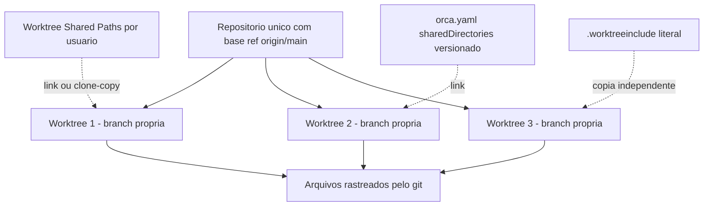

# Capítulo 4: Git Worktrees — A Fundação Técnica do Paralelismo Seguro

## 1. Introdução

Se você só puder guardar uma frase deste livro inteiro, guarde esta: o paralelismo de agentes é seguro porque o **sistema de arquivos** foi duplicado, e não porque os agentes foram instruídos a se comportarem. Todo o resto — revisão, orquestração, execução remota — depende dessa base física.

A documentação oficial declara a arquitetura sem rodeios: "Orca is worktree-native. Instead of branching and stashing on one checkout, every task gets its own on-disk copy of the repo via `git worktree`. This is what makes parallel agents safe — they never step on each other's files" [4]. A frase merece atenção pela ordem dos termos: primeiro o mecanismo (`git worktree`), depois a consequência (segurança). Não o contrário. Não existe promessa de coordenação cooperativa; existe separação de espaço.

E essa separação não é uma invenção proprietária com formato fechado. A segunda negativa do produto é explícita: "Not a git replacement. Every worktree is a real git worktree. You can `cd` in and use plain git whenever you want" [1]. O comando por trás disso é nativo do Git e existe há muitos anos — a documentação do próprio Git o descreve como "Manage multiple working trees", com assinatura estável e sem mudanças registradas entre as versões 2.54.0 e 2.55.0 [62].

Este capítulo ensina o modelo de três invariantes que sustenta o isolamento, o ciclo de vida de cinco fases de cada worktree, os controles de organização da barra lateral e — a parte que quase ninguém antecipa — o problema dos **arquivos que não existem** em um checkout novo: dependências, caches e segredos que vivem em caminhos ignorados pelo Git. A documentação trata esse problema como cidadão de primeira classe, e você vai ver por quê.

## 2. Explica

### 4.1 O modelo: três invariantes

A documentação reduz o modelo a três afirmações que valem para todo worktree existente [4]:

1. Cada repositório tem uma **base ref**, normalmente `origin/main`. É a origem padrão de toda tarefa nova.
2. Cada worktree tem um **start-from ref**, escolhido no momento da criação, que define de onde aquela tarefa específica ramificou.
3. Cada worktree tem **branch própria, arquivos próprios em disco e terminais de agente próprios**.

Juntas, as três invariantes explicam todos os comportamentos que você vai observar. A base ref explica por que alterá-la depois de criar muitos worktrees é uma má ideia: você passa a ter tarefas nascidas de origens diferentes sem perceber [36]. O start-from explica por que o diff de cada worktree é sempre comparável — ele tem uma referência de comparação explícita [4][25]. E a terceira invariante explica por que o ambiente pode tratar "worktree" como a unidade de contexto: abas, painéis, browser e terminais pertencem ao worktree, não à janela [6].

Vale ainda marcar o que o git garante por baixo. A documentação do comando permite `git worktree add` com criação de branch (`-b` / `-B`), modo destacado (`--detach`), bloqueio (`--lock [--reason <string>]`) e árvore órfã (`--orphan`) [62]. Nada disso é exótico: é a interface pública de um recurso consolidado.

### 4.2 Ciclo de vida: as cinco fases

A documentação nomeia cinco fases por funcionalidade [4]: **Create**, **Work**, **Review**, **Ship** e **Archive or delete**. Vamos percorrê-las com o que cada uma exige.

**Create** envolve nome da tarefa, seletor de start-from e — opcionalmente — vínculo com item de trabalho de GitHub, Linear, Jira ou GitLab [4]. A criação roda em segundo plano e o diálogo fecha imediatamente, com progresso visível na barra lateral e status na aba [4].

**Work** é a fase em que terminais de agente, abas de editor, abas de browser e painéis de terminal ficam todos escopados àquele worktree [4]. Trocar de worktree troca a árvore de painéis inteira: "your browser tab, terminal, and diff reappear exactly as you left them" [6].

**Review** é o diff contra o start-from ref, com anotação por linha e atribuição de procedência [4][26][27].

**Ship** é commit, push, abertura de pull request e acompanhamento de verificações, tudo dentro do ambiente [4][28].

**Archive or delete** é o fim do ciclo: "Deleting a worktree removes both the directory and the branch (with confirmation). If git keeps a local branch because it may still have unmerged commits, Orca can offer a review step" [4]. Esse trecho merece destaque porque descreve um comportamento defensivo: quando o Git decide preservar uma branch por haver commits não mesclados, o ambiente oferece uma etapa de revisão em vez de apagar silenciosamente.

### 4.3 O problema que ninguém antecipa: o checkout é limpo

Um worktree recém-criado é um checkout novo. E um checkout novo significa que **tudo o que estava ignorado pelo Git desapareceu**: dependências instaladas, caches de build e, o mais perigoso, segredos locais. A documentação descreve o problema com franqueza: "A brand-new worktree is a clean checkout. Dependencies, caches, and local secrets that live in gitignored paths are missing until you recreate them" [4]. Note que ela classifica os **três** tipos de perda como um único problema, e não como três — porque a solução, embora tenha três mecanismos, é conceitualmente a mesma.

A gravidade é assimétrica entre eles. Dependências ausentes custam tempo (reinstalar). Caches ausentes custam tempo e rede. **Segredos ausentes custam tempo, e por isso as pessoas criam atalhos inseguros** — como versionar um `.env` para "resolver de vez". O ambiente oferece um caminho melhor, e é isso que veremos a seguir.

### 4.4 Os três mecanismos de preenchimento

A documentação oferece exatamente **3** mecanismos complementares para preencher a lacuna, com escopos e semânticas diferentes [4]. Entendê-los como conjunto é o que evita o uso errado.

**Mecanismo 1 — Worktree Shared Paths.** Uma lista por repositório, em `Settings → Repository`, de caminhos que devem existir em cada worktree novo. A materialização usa *clone-copy* APFS quando possível no macOS e, fora disso, um link simbólico [4]. Como a configuração é por máquina/usuário, ela é a via para quem tem diretórios grandes e específicos da sua estação.

**Mecanismo 2 — `worktree.sharedDirectories` em `orca.yaml`.** Aqui a lista é **versionada no repositório**, e por isso vale para todo o time. O uso é para árvores grandes e reconstruíveis, como `node_modules` ou `.cache`, e a semântica é de compartilhamento, não de cópia: "symlink/share, not copy" [4]. Há duas condições documentadas que causam falhas silenciosas: as entradas precisam existir como diretórios no checkout primário **e** estar ignoradas pelo Git — caminhos rastreados ou ausentes são simplesmente pulados [4].

O formato é declarativo e curto:

```yaml
# orca.yaml (raiz do repositorio)
worktree:
  sharedDirectories:
    - node_modules
    - .cache
```

**Mecanismo 3 — `.worktreeinclude` na raiz do repositório.** Esta é a lista de arquivos e diretórios ignorados que devem ser **copiados** (não linkados) em cada worktree novo, para que cada worktree tenha a sua própria cópia [4]. É o mecanismo certo para segredos e configurações locais:

```text
# .worktreeinclude (raiz do repositorio)
.env
.env.local
.vscode/settings.json
```

A documentação é específica sobre o que é aceito: linhas em branco e comentários iniciados por `#` são permitidos; **apenas caminhos literais são suportados hoje** — curingas (*globs*) e negação são ignorados com aviso; e caminhos rastreados pelo Git, ausentes ou não ignorados não são copiados [4].

### 4.5 A regra de composição entre os mecanismos

Os três mecanismos não competem: eles se **somam**, e a ordem importa. A documentação é explícita: entradas de `orca.yaml` somam-se à lista por usuário e nunca a substituem; e caminhos que já foram compartilhados ou linkados não são recopiados a partir do `.worktreeinclude` [4].

Isso tem uma consequência de projeto que vale explicitar: se um diretório está em `sharedDirectories` e o mesmo caminho aparece no `.worktreeinclude`, o comportamento de **compartilhamento vence** — você não obtém uma cópia independente. Não é uma falha; é precedência documentada. O operador atento escolhe deliberadamente entre compartilhar (economiza disco, mas edições contaminam todos os worktrees) e copiar (cada worktree é independente, mas consome disco).

### 4.6 Organização: barra lateral, filtros e múltipla seleção

Com muitos worktrees, a barra lateral deixa de ser lista e passa a ser instrumento. Ela agrupa por projeto por padrão, com filtro próprio no cabeçalho, separado da busca global [4]. O menu de filtro agrupa escopo de host e projeto sob uma seção **Show** e oferece, entre outros, os seguintes controles [4]: workspaces adormecidos, exceção para a branch padrão, workspaces de branch padrão, workspaces criados por automação, workspaces criados pelo CLI, workspaces de outros clientes (relevante em servidor remoto compartilhado) e workspaces em estado destacado (*detached HEAD*) [4].

A operação em lote também é documentada com precisão: manter `Cmd` (ou `Ctrl`) pressionado enquanto clica adiciona itens à múltipla seleção; `Shift` seleciona um intervalo contíguo; e o clique com o botão direito aplica a ação a **todos** os itens selecionados [4]. Para iniciar a exclusão pelo teclado, com o cursor sobre um worktree ou pasta, usa-se `Cmd-Shift-Backspace` no macOS ou `Ctrl-Shift-Backspace` no Windows e Linux, mantendo-se o diálogo de confirmação [4].

Vale registrar dois recursos de leitura que economizam tempo em frotas grandes: a paleta de salto de worktrees (`Cmd-J`), que tem filtros próprios de host e projeto acionados por `Tab` [4]; e a busca global, que cobre worktrees, arquivos, agentes, comandos e contexto do repositório [65]. Um detalhe de usabilidade frequentemente ignorado: worktrees com atividade não lida aparecem em **negrito**, e não com um selo — o que exige uma olhada treinada, e não um clique [4].

### 4.7 Aninhamento: worktrees filhos

Quando você cria um worktree **de dentro** de um worktree gerenciado, o ambiente registra o novo como filho sempre que consegue inferir a relação [36]. É possível ser explícito: `--parent-worktree active` declara a relação e `--no-parent` declara trabalho independente [36]. O campo equivalente no formulário é o *Parent workspace* na gaveta avançada, e a documentação alerta que ele **apenas aninha os workspaces na barra lateral** — não altera histórico nem branches do Git, e o ambiente exclui workspaces arquivados ou escolhas que criariam ciclos [4].

O aninhamento importa para o Capítulo 10, porque é a forma padrão de dar a um worker um espaço próprio: `orca orchestration worker-start --task <taskId> --worktree new-child --name billing-audit --agent codex --setup run --json` [37].

## 3. Ilustra

O diagrama abaixo mostra a anatomia de um repositório com três worktrees e a origem de cada arquivo dentro deles. A parte inferior é a que costuma ser esquecida: dependências, caches e segredos chegam por mecanismos distintos, com semânticas distintas.



*Figura 4.1 — Três worktrees do mesmo repositório e os três mecanismos de preenchimento de caminhos ignorados. Compartilhar economiza disco; copiar dá independência. A precedência entre eles é documentada: compartilhamento vence cópia [4].*

## 4. Técnica

O script a seguir audita a configuração de preenchimento de um repositório antes que você crie worktrees em série. Ele verifica os três mecanismos, reporta o que está declarado e aponta as duas causas de falha silenciosa: caminho ausente e caminho rastreado pelo Git.

```python
#!/usr/bin/env python3
# -*- coding: utf-8 -*-
"""
auditar_worktree_include.py — Verifica a configuracao de preenchimento de
worktrees novos antes de criar um lote.

Le, quando existem:
  - orca.yaml            -> worktree.sharedDirectories
  - .worktreeinclude     -> lista de caminhos a COPIAR em cada worktree

e classifica cada entrada como: pronta (existe e e ignorada pelo git),
ausente (nao existe no checkout primario) ou rastreada (esta no git, sera
pulada). Nao altera nenhum arquivo.
"""

from __future__ import annotations

import re
import subprocess
import sys
from pathlib import Path

# Parser minimo do bloco YAML que nos interessa: worktree.sharedDirectories
RE_DIR_YAML = re.compile(
    r"^worktree:\s*$.*?^\s+sharedDirectories:\s*$(?P<itens>(?:\n[ \t]+-[ \t]*.+)*)",
    re.MULTILINE | re.DOTALL,
)
RE_ITEM_YAML = re.compile(r"^[ \t]+-[ \t]*(?P<valor>.+?)\s*$", re.MULTILINE)


def ler_shared_directories(raiz: Path) -> list[str]:
    arquivo = raiz / "orca.yaml"
    if not arquivo.exists():
        return []
    texto = arquivo.read_text(encoding="utf-8", errors="replace")
    m = RE_DIR_YAML.search(texto)
    if not m:
        return []
    return [i.group("valor").strip().strip('"').strip("'")
            for i in RE_ITEM_YAML.finditer(m.group("itens"))]


def ler_worktreeinclude(raiz: Path) -> list[str]:
    arquivo = raiz / ".worktreeinclude"
    if not arquivo.exists():
        return []
    saida = []
    for linha in arquivo.read_text(encoding="utf-8", errors="replace").splitlines():
        limpa = linha.strip()
        if not limpa or limpa.startswith("#"):
            continue
        if any(c in limpa for c in "*?[") or limpa.startswith("!"):
            saida.append(limpa + "   (aviso: glob ou negacao nao suportados)")
            continue
        saida.append(limpa)
    return saida


def rastreado_pelo_git(raiz: Path, caminho: str) -> bool:
    try:
        proc = subprocess.run(["git", "-C", str(raiz), "ls-files", "--error-unmatch",
                               caminho], capture_output=True, text=True,
                              timeout=10, check=False)
    except (OSError, subprocess.SubprocessError):
        return False
    return proc.returncode == 0


def classificar(raiz: Path, caminho: str) -> str:
    alvo = raiz / caminho.rstrip("/")
    if not alvo.exists():
        return "ausente"
    if rastreado_pelo_git(raiz, caminho):
        return "rastreada"
    return "pronta"


def bloco(titulo: str, itens: list[str], raiz: Path, modo: str) -> None:
    print(f"\n{titulo}")
    print("-" * len(titulo))
    if not itens:
        print("  (nenhuma entrada declarada)")
        print(f"  semantica: {modo}")
        return
    for caminho in itens:
        if "(aviso:" in caminho:
            print(f"  [AVISO]   {caminho}")
            continue
        estado = classificar(raiz, caminho)
        simbolo = {"pronta": "[OK]     ", "ausente": "[AUSENTE]",
                   "rastreada": "[IGNORADA]"}[estado]
        print(f"  {simbolo} {caminho}")
    print(f"  semantica: {modo}")


def main() -> int:
    raiz = Path(sys.argv[1] if len(sys.argv) > 1 else ".").resolve()
    if not (raiz / ".git").exists():
        print(f"[ERRO] {raiz} nao parece ser a raiz de um repositorio git.")
        return 1

    print("=" * 66)
    print("AUDITORIA DE PREENCHIMENTO DE WORKTREES NOVOS")
    print("=" * 66)
    print(f"repositorio: {raiz}")

    bloco("orca.yaml -> worktree.sharedDirectories",
          ler_shared_directories(raiz), raiz,
          "link/compartilhamento; edicoes afetam todos os worktrees")
    bloco(".worktreeinclude", ler_worktreeinclude(raiz), raiz,
          "copia independente por worktree")

    print()
    print("-" * 66)
    print("Regras de precedencia documentadas:")
    print("  1. orca.yaml soma-se a lista por usuario, nunca a substitui.")
    print("  2. caminho ja compartilhado nao e recopiado pelo .worktreeinclude.")
    print("  3. apenas caminhos literais no .worktreeinclude; globs sao ignorados.")
    print("  4. caminhos rastreados pelo git ou ausentes nao sao copiados.")
    return 0


if __name__ == "__main__":
    sys.exit(main())
```

A verificação real do que foi criado pode ser feita com o próprio Git, o que reforça a fronteira de que nada aqui é proprietário. O comando nativo lista as árvores de trabalho registradas no repositório:

```bash
git worktree list
```

Já o ambiente oferece a leitura equivalente, com o estado do worktree corrente e a possibilidade de registrar um checkpoint textual:

```bash
orca worktree ps --json
orca worktree current --json
orca worktree set --worktree active --comment "reproduced auth failure; testing credential-chain fix" --json
```

<!-- cli-check: fonte=A; confere=true -->

A criação com controle explícito de hierarquia e de hooks de preparação fica assim:

```bash
orca worktree create --name child-task --agent codex --prompt "Investigate the flaky login test" --json
orca worktree create --name review-api --agent claude --setup run --json
orca worktree create --name hidden-setup --setup inherit --json
```

<!-- cli-check: fonte=A; confere=true -->

Cada flag carrega uma decisão documentada: `--agent` lança o agente escolhido no primeiro terminal, `--prompt` envia trabalho inicial e `--setup run|skip|inherit` controla se os hooks de preparação do repositório rodam, são pulados ou seguem a política declarada [36].

## 5. Aplica

Roteiro de configuração de repositório para uso em frota. Faça isso **antes** de criar worktrees em série, porque corrigir depois exige auditar o que já foi criado:

1. Escolha a base ref definitiva do repositório e fixe-a: criar dezenas de worktrees a partir de origens diferentes é uma dívida silenciosa [36].
2. Verifique o peso dos diretórios reconstruíveis (`node_modules`, `.cache`) e decida quais entram em `worktree.sharedDirectories` no `orca.yaml` versionado [4].
3. Liste os arquivos locais que cada worktree precisa ter próprio — tipicamente `.env`, `.env.local` e configurações de editor — e coloque-os no `.worktreeinclude`, um por linha, com caminhos literais [4].
4. Rode a auditoria acima e confirme que nenhuma entrada está "ausente" ou "rastreada" — as duas causas documentadas de cópia silenciosamente pulada [4].
5. Crie um worktree de teste e inspecione o conteúdo: dependências presentes, segredo presente e independente do original.
6. Registre um checkpoint textual no worktree novo, descrevendo o que ele contém, para que o próximo a olhar não precise abrir terminal [39].
7. Só então crie o lote de worktrees do trabalho real.

Limites honestos que este capítulo estabelece:

- O `.worktreeinclude` **só** aceita caminhos literais; globs e negação são ignorados com aviso. Quem precisa de padrões terá de listar arquivo por arquivo [4].
- Entradas de `sharedDirectories` que não existirem como diretório no checkout primário ou que estejam rastreadas pelo Git são puladas, sem erro bloqueante — é falha silenciosa por projeto [4].
- Compartilhar não é o mesmo que copiar. Um `.env` compartilhado por link significa que editar em um worktree altera o valor visto pelos outros [4].
- Compartilhamento usa clone-copy APFS **quando possível** no macOS e, fora disso, link simbólico — o comportamento de disco depende do sistema de arquivos [4].
- A exclusão de um worktree remove o diretório **e** a branch, com confirmação; quando há commits não mesclados, o Git pode preservar a branch local e o ambiente oferece uma etapa de revisão em vez de forçar a remoção [4].
- Aninhar worktrees muda apenas a organização na barra lateral; não altera histórico nem branches, e escolhas que criem ciclo são excluídas pelo ambiente [4].
- Nenhum limite numérico de worktrees simultâneos é declarado pela documentação. A orientação é qualitativa — fechar o que não está em uso — e o instrumento de medição é o gerenciador de recursos da barra de status [49][51].

## 6. Conclusão

Você agora entende por que o isolamento por trabalho — e não por disciplina — é o que torna seguro rodar agentes em paralelo. As três invariantes formam o modelo: base ref do repositório, start-from ref da tarefa e branch própria com arquivos e terminais próprios. O ciclo de cinco fases organiza a vida de cada worktree, da criação ao arquivamento, com uma rede de proteção quando existem commits não mesclados.

Mais importante: você aprendeu que um worktree novo é um checkout **limpo**, e que dependências, caches e segredos precisam ser repostos por um dos três mecanismos documentados — Shared Paths por usuário, `sharedDirectories` no `orca.yaml` versionado e `.worktreeinclude` com caminhos literais — lembrando que compartilhamento e cópia têm consequências opostas e que a precedência é do compartilhamento.

Com o espaço de trabalho resolvido, o próximo capítulo sobe para a superfície: a anatomia da interface. Você vai aprender a organizar abas, painéis e fronteiras para assistir a uma frota inteira sem perder o fio de nenhuma tarefa.

## 7. Referências Bibliográficas

[1] ORCA. *What is Orca?* Orca Docs, 2026. Disponível em: <https://www.onorca.dev/docs>. Acesso em: 12 set. 2026. (A)

[3] ORCA. *Your first 3-agent session*. Orca Docs, 2026. Disponível em: <https://www.onorca.dev/docs/first-session>. Acesso em: 12 set. 2026. (A)

[4] ORCA. *Worktrees*. Orca Docs, 2026. Disponível em: <https://www.onorca.dev/docs/model/worktrees>. Acesso em: 12 set. 2026. (A)

[5] ORCA. *Agents & sessions*. Orca Docs, 2026. Disponível em: <https://www.onorca.dev/docs/model/agents-sessions>. Acesso em: 12 set. 2026. (A)

[6] ORCA. *Tabs, panes & split layouts*. Orca Docs, 2026. Disponível em: <https://www.onorca.dev/docs/model/tabs-panes-splits>. Acesso em: 12 set. 2026. (A)

[7] ORCA. *Quick open*. Orca Docs, 2026. Disponível em: <https://www.onorca.dev/docs/model/quick-open>. Acesso em: 12 set. 2026. (A)

[8] ORCA. *Session restore*. Orca Docs, 2026. Disponível em: <https://www.onorca.dev/docs/model/session-restore>. Acesso em: 12 set. 2026. (A)

[16] ORCA. *Agent hooks & memory*. Orca Docs, 2026. Disponível em: <https://www.onorca.dev/docs/agents/hooks-memory>. Acesso em: 12 set. 2026. (A)

[21] ORCA. *File explorer*. Orca Docs, 2026. Disponível em: <https://www.onorca.dev/docs/editing/file-explorer>. Acesso em: 12 set. 2026. (A)

[25] ORCA. *Diff viewer*. Orca Docs, 2026. Disponível em: <https://www.onorca.dev/docs/review/diff-viewer>. Acesso em: 12 set. 2026. (A)

[26] ORCA. *Annotate AI Diff*. Orca Docs, 2026. Disponível em: <https://www.onorca.dev/docs/review/annotate-ai-diff>. Acesso em: 12 set. 2026. (A)

[27] ORCA. *Attribution*. Orca Docs, 2026. Disponível em: <https://www.onorca.dev/docs/review/attribution>. Acesso em: 12 set. 2026. (A)

[28] ORCA. *Commit & push from Orca*. Orca Docs, 2026. Disponível em: <https://www.onorca.dev/docs/review/commit-push>. Acesso em: 12 set. 2026. (A)

[29] ORCA. *GitHub in Orca*. Orca Docs, 2026. Disponível em: <https://www.onorca.dev/docs/review/github>. Acesso em: 12 set. 2026. (A)

[30] ORCA. *Linear in Orca*. Orca Docs, 2026. Disponível em: <https://www.onorca.dev/docs/review/linear>. Acesso em: 12 set. 2026. (A)

[31] ORCA. *Jira in Orca*. Orca Docs, 2026. Disponível em: <https://www.onorca.dev/docs/review/jira>. Acesso em: 12 set. 2026. (A)

[32] ORCA. *Per-worktree browser*. Orca Docs, 2026. Disponível em: <https://www.onorca.dev/docs/browser/overview>. Acesso em: 12 set. 2026. (A)

[34] ORCA. *Browser-use profiles*. Orca Docs, 2026. Disponível em: <https://www.onorca.dev/docs/browser/profiles>. Acesso em: 12 set. 2026. (A)

[36] ORCA. *Orca CLI reference*. Orca Docs, 2026. Disponível em: <https://www.onorca.dev/docs/cli/reference>. Acesso em: 12 set. 2026. (A)

[37] ORCA. *Orchestration*. Orca Docs, 2026. Disponível em: <https://www.onorca.dev/docs/cli/orchestration>. Acesso em: 12 set. 2026. (A)

[39] ORCA. *Worktree checkpoints*. Orca Docs, 2026. Disponível em: <https://www.onorca.dev/docs/cli/worktree-checkpoints>. Acesso em: 12 set. 2026. (A)

[42] ORCA. *Ways to run Orca*. Orca Docs, 2026. Disponível em: <https://www.onorca.dev/docs/ways-to-run>. Acesso em: 12 set. 2026. (A)

[43] ORCA. *SSH worktrees*. Orca Docs, 2026. Disponível em: <https://www.onorca.dev/docs/ssh>. Acesso em: 12 set. 2026. (A)

[49] ORCA. *Settings reference*. Orca Docs, 2026. Disponível em: <https://www.onorca.dev/docs/settings>. Acesso em: 12 set. 2026. (A)

[51] ORCA. *Troubleshooting & FAQ*. Orca Docs, 2026. Disponível em: <https://www.onorca.dev/docs/troubleshooting>. Acesso em: 12 set. 2026. (A)

[54] ORCA. *Recipe: Jump between worktrees*. Orca Docs, 2026. Disponível em: <https://www.onorca.dev/docs/recipes/jump-worktrees>. Acesso em: 12 set. 2026. (A)

[62] GIT. *git-worktree(1)* — manage multiple working trees. Manual de referência, v2.54.0, 2026. Disponível em: <https://git-scm.com/docs/git-worktree>. Acesso em: 12 set. 2026. (A)

[65] STABLY AI. *Orca* — repositório oficial. GitHub, 2026. Disponível em: <https://github.com/stablyai/orca>. Acesso em: 12 set. 2026. (A)
