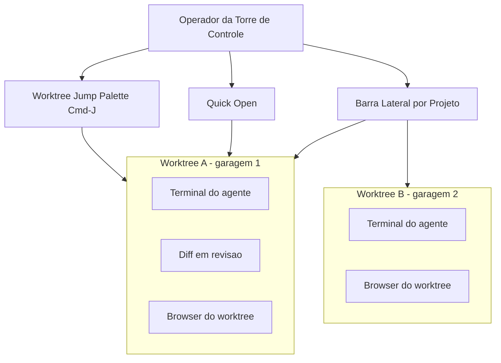

# Capítulo 5: Anatomia da Interface: Projetos, Abas, Painéis e o Gerenciamento Visual de Contexto

## 1. Introdução

No Capítulo 4, você aprendeu que cada worktree é uma garagem isolada: branch própria, arquivos próprios em disco, terminais próprios. Mas uma garagem isolada não serve de nada se você não consegue **ver** o que está acontecendo dentro dela sem precisar sair do carro ao lado. É exatamente esse o problema que este capítulo resolve — não o isolamento em si, mas a maneira como a interface torna esse isolamento *visível* e *navegável* para um único par de olhos humanos assistindo vários veículos ao mesmo tempo.

Você já sentiu essa interface de relance na sua primeira sessão com três agentes [3] — sem tempo de refletir sobre o porquê de cada painel estar onde está. Como Operador de Frota Agêntica, você vai sair deste capítulo enxergando a interface do Orca não como "uma janela com abas", mas como um painel de instrumentos por worktree — abas, splits, barra lateral, busca universal e barra de status compõem, juntos, o instrumento que decide se você consegue supervisionar cinco tarefas em paralelo ou se afoga tentando lembrar em qual aba ficou o quê.

## 2. Explica

### 5.1 A interface como gerenciador de contexto visual

A premissa por trás de todo o design da interface é simples de enunciar e difícil de internalizar: **cada worktree é dono da sua própria árvore de painéis inteira**. Não existe uma única barra de abas global compartilhada por toda a aplicação — existe uma árvore de abas, splits e painéis *por worktree*, e o que você vê na tela a cada momento é sempre a árvore do worktree ativo. A documentação declara isso sem meias palavras: "Each worktree owns its own tab layout. Switching worktrees swaps the entire pane tree — your browser tab, terminal, and diff reappear exactly as you left them" [6].

Essa frase merece ser lida duas vezes, porque ela nega uma expectativa comum de quem vem de um editor de código tradicional. Em um editor comum, trocar de projeto costuma significar fechar um contexto e abrir outro do zero, ou manter uma única barra de abas que mistura arquivos de tarefas diferentes. Aqui não: trocar de worktree é trocar de **painel de instrumentos inteiro**, com tudo exatamente onde você deixou.

### 5.2 O sistema de abas, painéis e splits

Cada aba carrega exatamente um tipo de conteúdo — um terminal, um buffer de editor, um browser, um diff de revisão [25] ou um pull request em acompanhamento [28] — e vive dentro de um *tab group* [6]. Arrastar uma aba verticalmente dentro do próprio grupo a reordena; arrastá-la para outro grupo a move para lá [6]. O terminal, em particular, roda uma CLI do catálogo de agentes suportados pelo ambiente [9] — o Capítulo 6 mapeia esse catálogo inteiro; por ora, o que importa é que esse terminal se comporta como qualquer outra aba: divide, move e persiste com o resto do painel.

A navegação entre abas tem atalhos padrão desde a primeira instalação: `Cmd+Shift+]` / `Cmd+Shift+[` (ou `Ctrl+Shift+]` / `Ctrl+Shift+[` no Windows/Linux) percorre todas as abas; `Cmd+Option+]` / `Cmd+Option+[` (ou `Ctrl+Alt+]` / `Ctrl+Alt+[`) percorre apenas abas do mesmo tipo; e `Ctrl+Tab` alterna para a aba recente anterior [6]. Todos são remapeáveis em `Settings → Shortcuts`, e instalações mais antigas preservam overrides no arquivo `~/.orca/keybindings.json` [6] — algo que você vai auditar com as próprias mãos na seção Técnica.

O mecanismo mais poderoso, porém, é o split. Arrastar uma aba até a borda direita da janela a divide na horizontal (esquerda/direita); até a borda inferior, na vertical (topo/base). E os splits **aninham**: nada impede um terminal de agente à esquerda, um diff no canto superior direito e um browser no canto inferior direito, todos visíveis ao mesmo tempo. A documentação resume a regra de composição em uma frase curta: "Any tab type can split with any other" [6]. Terminais, inclusive, dividem *dentro* da própria aba, por meio do menu *Split terminal right* / *Split terminal down* ou do botão de split no cabeçalho do painel ativo [6].

Um detalhe que separa quem só usa a interface de quem a **opera**: redimensionar a janela não embaralha esse layout. As posições das fronteiras entre painéis são fronteiras fixas, salvas por worktree [6]. Você pode fechar o notebook, abrir de novo no dia seguinte, e o mesmo worktree reabre com os mesmos splits, nos mesmos lugares.

Há ainda um segundo nível de leitura, que dispensa até abrir a aba: cada aba de agente carrega, ao lado do título, um pequeno glifo de estado — um sinal visual compartilhado entre as abas e as linhas de worktree da barra lateral. A documentação lista **6** glifos desse tipo, cobrindo de "trabalhando" a "bloqueado" e "ocioso" [5]; o Capítulo 7 disseca o ciclo de vida completo por trás de cada um deles, incluindo a hibernação de sessões [20]. Por ora, o que você precisa saber é que esse glifo transforma a própria aba em instrumento de leitura — você reconhece o estado da tarefa antes de clicar nela.

### 5.3 Barra lateral, projetos e a busca que não te tira do fluxo

A barra lateral agrupa worktrees **por projeto** por padrão — cada linha de topo é um projeto (um repositório Git, ou um cluster de repositórios relacionados), expandido nos worktrees atualmente em uso. O cabeçalho da barra tem filtro próprio, deliberadamente separado da busca global [4]. Worktrees individuais podem ser fixados no topo do projeto, e o clique direito expõe ações de arquivar, dormir ou deletar diretamente ali [4].

Dois instrumentos de navegação completam a barra lateral, e cada um resolve um problema diferente. O primeiro é o *Quick Open*: uma busca que cobre "worktrees, files, agents, commands, and repo context without leaving your flow" [65] — ela é listada entre os recursos-chave do produto justamente porque elimina a necessidade de trocar de janela mental para lembrar onde algo está [7]. O segundo é a *Worktree Jump Palette* (`Cmd-J`): um salto direto entre worktrees, com filtros próprios de host e projeto acionados pela tecla `Tab`; a busca casa workspaces nomeados com emoji pelo fragmento textual derivado do shortcode, e abrir a paleta vazia mostra recentes e atalhos numéricos que respeitam os mesmos filtros já aplicados na barra lateral [4].

Vale registrar por que os dois convivem sem se sobrepor: Quick Open busca **conteúdo** (um arquivo, um comando, um trecho de contexto do repositório); a Jump Palette busca **destino** (o worktree em si, como unidade). Um profissional que já internalizou essa distinção nunca abre a paleta errada por hábito — ele já sabe, antes de apertar a tecla, se está procurando uma coisa ou um lugar.

## 3. Ilustra

Pense na frota inteira como uma torre de controle, e cada worktree como um veículo estacionado em sua própria garagem — a mesma imagem do Capítulo 4. A novidade aqui é o que existe **dentro** de cada garagem: um painel de instrumentos completo, com seus próprios mostradores. Quando você troca de worktree, você não está apenas trocando de assento — você está sendo teletransportado para dentro de outro veículo, com seu próprio painel, suas próprias luzes e seus próprios espelhos, exatamente como o piloto os deixou da última vez.

Essa primeira analogia explica a mecânica geral. Mas existe um ponto mais difícil de aceitar, e ele merece uma segunda imagem: não é que cada veículo tenha *uma cópia* do mesmo painel — é que o painel **é** o veículo, na prática de quem opera. Um operador de torre de controle que já trabalhou em turnos longos sabe que não adianta memorizar "o botão vermelho fica embaixo à esquerda" como regra universal — cada aeronave tem seu cockpit próprio, com seus próprios botões naquelas posições, e o hábito de generalizar entre cockpits é a origem de erros bobos e caros. É por isso que a fronteira fixa por worktree [6] não é um detalhe estético: é a garantia de que o seu cockpit mental, uma vez aprendido para aquela tarefa, continua válido amanhã.



*A paleta de salto, a busca universal e a barra lateral são três portas de entrada distintas [4] — mas todas levam ao mesmo destino: a árvore de painéis completa daquele worktree, intacta desde a última visita [6].*

## 4. Técnica

### Remapeando a navegação em `~/.orca/keybindings.json`

Antes de automatizar qualquer coisa, vale conhecer o formato do arquivo que guarda os overrides de atalhos herdados de instalações antigas [6]. Ele é um JSON simples, uma entrada por combinação remapeada:

```json
{
  "keybindings": [
    {
      "key": "ctrl+shift+]",
      "command": "orca.tabs.nextAll",
      "when": "tabFocus"
    },
    {
      "key": "ctrl+shift+[",
      "command": "orca.tabs.previousAll",
      "when": "tabFocus"
    },
    {
      "key": "ctrl+alt+]",
      "command": "orca.tabs.nextSameType",
      "when": "tabFocus"
    },
    {
      "key": "ctrl+j",
      "command": "orca.worktree.jumpPalette",
      "when": "always"
    }
  ]
}
```

Cada entrada tem três campos: `key` (a combinação física), `command` (o identificador interno do comando remapeado) e `when` (o contexto em que a combinação vale — por exemplo, apenas com um painel de aba em foco). O ambiente aplica esses overrides por cima do padrão de fábrica descrito na seção anterior [6]; um arquivo vazio ou ausente simplesmente significa "use os atalhos padrão".

### Um script de bancada para auditar seus próprios atalhos

Frotas grandes tendem a acumular remapeamentos esquecidos — alguém troca `Ctrl+J` para outra coisa seis meses atrás e não lembra mais. O script abaixo lê o `keybindings.json` (se existir), separa o que foi remapeado do que continua no padrão, e imprime uma tabela de bancada. Não faz chamada de rede, não altera nenhum arquivo — só leitura e diagnóstico:

```python
#!/usr/bin/env python3
# -*- coding: utf-8 -*-
"""
auditar_keybindings.py — Compara os atalhos de navegacao efetivos com o
padrao de fabrica do Orca e reporta o que foi remapeado.

Uso:
    python auditar_keybindings.py [caminho/para/keybindings.json]

Sem argumento, tenta ~/.orca/keybindings.json.
"""

from __future__ import annotations

import json
import sys
from pathlib import Path

# Padrao de fabrica documentado para navegacao entre abas e worktrees.
PADRAO_FABRICA = {
    "orca.tabs.nextAll": "ctrl+shift+]",
    "orca.tabs.previousAll": "ctrl+shift+[",
    "orca.tabs.nextSameType": "ctrl+alt+]",
    "orca.tabs.previousSameType": "ctrl+alt+[",
    "orca.tabs.recentPrevious": "ctrl+tab",
    "orca.worktree.jumpPalette": "ctrl+j",
    "orca.quickOpen": "ctrl+p",
}


def carregar_overrides(caminho: Path) -> dict[str, str]:
    """Le o keybindings.json e devolve {command: key} para as entradas validas."""
    if not caminho.exists():
        return {}
    bruto = json.loads(caminho.read_text(encoding="utf-8"))
    entradas = bruto.get("keybindings", [])
    overrides: dict[str, str] = {}
    for item in entradas:
        comando = item.get("command")
        tecla = item.get("key")
        if comando and tecla:
            overrides[comando] = tecla
    return overrides


def montar_relatorio(overrides: dict[str, str]) -> list[tuple[str, str, str, bool]]:
    """Retorna (comando, tecla_padrao, tecla_efetiva, remapeado) por comando conhecido."""
    linhas = []
    for comando, padrao in PADRAO_FABRICA.items():
        efetiva = overrides.get(comando, padrao)
        remapeado = efetiva != padrao
        linhas.append((comando, padrao, efetiva, remapeado))
    return linhas


def imprimir(linhas: list[tuple[str, str, str, bool]]) -> None:
    print("=" * 72)
    print("AUDITORIA DE ATALHOS DE NAVEGACAO (abas, splits e worktrees)")
    print("=" * 72)
    for comando, padrao, efetiva, remapeado in linhas:
        marca = "[REMAPEADO]" if remapeado else "[padrao]   "
        print(f"  {marca} {comando:32s} padrao={padrao:12s} efetivo={efetiva}")
    total_remapeado = sum(1 for _, _, _, r in linhas if r)
    print("-" * 72)
    print(f"total de comandos remapeados: {total_remapeado} de {len(linhas)}")


def main() -> int:
    caminho = Path(sys.argv[1]) if len(sys.argv) > 1 else Path.home() / ".orca" / "keybindings.json"
    overrides = carregar_overrides(caminho)
    linhas = montar_relatorio(overrides)
    imprimir(linhas)
    return 0


if __name__ == "__main__":
    sys.exit(main())
```

Rodar esse script antes de gravar um novo hábito de atalho é barato e evita a armadilha clássica: remapear `Ctrl+J` em uma máquina e continuar tentando usá-lo em outra, esperando o mesmo comportamento.

### Painéis de edição, preview e o painel de telemetria

Os painéis de edição cobrem quatro áreas dedicadas: explorador de arquivos [21], editor Markdown [22], editor Monaco [23] e visualizadores de arquivo [24]. O produto resume a proposta de valor sem rodeios: "VS Code's editor with autosave everywhere — drag files or images straight into an agent prompt" [65]. Note a segunda metade da frase — arrastar um arquivo ou uma imagem direto para o prompt de um agente é um atalho de contexto que elimina o passo de "salvar em algum lugar e depois anexar".

Dois ajustes finos evitam confusão comum. O *Word Wrap* do editor de arquivos é ligado por padrão e alternável pelo menu `⋯` da aba ou por `Alt+Z` — mas essa configuração é **separada** do Word Wrap do diff viewer, então desligar um não desliga o outro [49]. E a fonte do editor é *opt-in*: deixada em branco, ela segue a fonte do terminal; preenchida, sobrescreve **apenas** editores de arquivo e diffs, sem afetar o terminal [49].

Painéis ricos de preview cobrem Markdown, imagens, PDFs e documentos do repositório diretamente na área de trabalho — "Preview Markdown, images, PDFs, and repo docs in the workspace" [65] — e há uma página dedicada aos visualizadores [24]. Combinado com o *Session restore* [8], cuja promessa equivalente aparece descrita como "scrollback that survives restarts" [65], o resultado prático é que fechar o aplicativo por engano deixa de ser um evento de perda de contexto — o mesmo comportamento de continuidade que sustenta o diário de bordo da sessão que você vai formalizar como checkpoint no Capítulo 11 [39].

A barra de status merece ser tratada como instrumento, não como rodapé decorativo. Ela é configurável e inclui o *Resource Manager* — CPU, memória, sessões ativas, controles de daemon e varreduras de disco por workspace — além de percentuais de uso de provedor exibidos como % usado ou % restante [49]. O mesmo painel hospeda o controle *Keep computer awake*, com três estados (`On`, `Agent`, `Off`), espelhado por um ícone de café (*Caffeinate*) na própria barra de status, oculto em clientes web pareados [49]. E a aparência de toda a interface — tema, cor de acento, densidade, fonte da UI, minimapa, zoom, ícone do app — é configurável no mesmo lugar [49], incluindo os **6** idiomas de interface disponíveis: System, English, 中文（简体）, 한국어, 日本語 e Español [49].

## 5. Aplica

Imagine a cena: você está com quatro worktrees abertos, cada um com um agente rodando uma tarefa diferente. Um deles termina, você troca de aba para revisar o diff — e o painel que aparece é o do worktree **errado**, porque na semana passada você tinha remapeado `Ctrl+Alt+]` para "próxima aba (todas)" em vez de "próxima aba do mesmo tipo", sem lembrar disso. Você começa a comentar linhas de um diff pensando que é da tarefa A, quando na verdade é da tarefa C. O erro só aparece quando você já publicou um comentário fora de contexto.

O diagnóstico está na própria seção Explica: os atalhos de navegação entre abas têm dois modos — "todas as abas" e "apenas do mesmo tipo" [6] — e um remapeamento silencioso quebra a expectativa que seu corpo já automatizou. A correção não é "prestar mais atenção": é rodar a auditoria de bancada da seção Técnica antes de confiar de novo no atalho, e — mais importante — confirmar visualmente **qual worktree está ativo** pela barra lateral ou pelo título da janela antes de agir sobre qualquer diff, principalmente quando a fronteira entre tarefas é crítica (código de billing, segredo de produção). No mercado, o profissional que trata a barra de status e a barra lateral como instrumentos de leitura obrigatória — não como paisagem — é o que não confunde tarefas quando a frota cresce.

Armadilhas recorrentes, já sintetizadas:

- Confiar de cor em um atalho remapeado há meses sem revalidar — é a causa mais comum de "cliquei na aba errada".
- Ignorar as fronteiras fixas por worktree [6] e tentar impor um layout único "que funcione para tudo": cada tarefa tem sua própria geometria de painéis por um motivo.
- Tratar o Resource Manager e o percentual de uso de provedor [49] como decoração, e só olhar para eles depois que o sintoma já apareceu como lentidão — quando a documentação de solução de problemas já cataloga esses sintomas com antecedência [51].

Sobre escala: o conjunto barra lateral + Quick Open + Jump Palette + barra de status funciona bem enquanto um único operador consegue varrer visualmente a frota — na prática, dezenas de worktrees monitorados por projeto. A partir do ponto em que essa varredura visual deixa de ser confiável (dezenas de tarefas concorrentes, múltiplos operadores, ou hosts remotos misturados), o instrumento correto deixa de ser o olho humano na tela e passa a ser o CLI com saída `--json` [36] e a camada de orquestração supervisionada [37] — assunto dos Capítulos 9 e 10. Tentar escalar a inspeção visual além desse ponto não é heroísmo: é o primeiro sintoma de que a frota já passou do tamanho que um painel sozinho consegue representar.

### Exercício
- [ ] Abra `Settings → Shortcuts` e liste todos os atalhos de navegação entre abas remapeados na sua instalação
- [ ] Rode o script `auditar_keybindings.py` contra o seu `~/.orca/keybindings.json` (ou confirme que o arquivo não existe e você está no padrão de fábrica)
- [ ] Crie dois worktrees do mesmo projeto, monte um layout de splits diferente em cada um, feche e reabra o aplicativo, e confirme que os dois layouts foram preservados
- [ ] Configure o Resource Manager e o percentual de uso de provedor na barra de status, e anote o valor atual de cada um antes de iniciar sua próxima sessão de trabalho

## 6. Conclusão

Você fecha este capítulo enxergando a interface como o que ela realmente é: um gerenciador visual de contexto onde cada worktree possui sua própria árvore de painéis, navegável por três portas distintas — barra lateral, Quick Open e Worktree Jump Palette — e monitorável por uma barra de status que funciona como painel de telemetria, não como rodapé. Você também levou consigo o hábito que separa quem clica por acaso de quem opera: confirmar o worktree ativo antes de agir sobre qualquer diff, e auditar atalhos remapeados antes de confiar neles de novo.

Com o painel de instrumentos entendido, falta o que se senta atrás do volante. O próximo capítulo mostra o catálogo de agentes que o Orca aceita rodar em cada terminal — o harness agnóstico que permite trocar de CLI sem trocar de ambiente.

## 7. Referências Bibliográficas

[1] ORCA. *What is Orca?* Orca Docs, 2026. Disponível em: <https://www.onorca.dev/docs>. Acesso em: 12 set. 2026. (A)

[3] ORCA. *Your first 3-agent session*. Orca Docs, 2026. Disponível em: <https://www.onorca.dev/docs/first-session>. Acesso em: 12 set. 2026. (A)

[4] ORCA. *Worktrees*. Orca Docs, 2026. Disponível em: <https://www.onorca.dev/docs/model/worktrees>. Acesso em: 12 set. 2026. (A)

[5] ORCA. *Agents & sessions*. Orca Docs, 2026. Disponível em: <https://www.onorca.dev/docs/model/agents-sessions>. Acesso em: 12 set. 2026. (A)

[6] ORCA. *Tabs, panes & split layouts*. Orca Docs, 2026. Disponível em: <https://www.onorca.dev/docs/model/tabs-panes-splits>. Acesso em: 12 set. 2026. (A)

[7] ORCA. *Quick open*. Orca Docs, 2026. Disponível em: <https://www.onorca.dev/docs/model/quick-open>. Acesso em: 12 set. 2026. (A)

[8] ORCA. *Session restore*. Orca Docs, 2026. Disponível em: <https://www.onorca.dev/docs/model/session-restore>. Acesso em: 12 set. 2026. (A)

[9] ORCA. *Supported agents*. Orca Docs, 2026. Disponível em: <https://www.onorca.dev/docs/agents/supported>. Acesso em: 12 set. 2026. (A)

[20] ORCA. *Terminal*. Orca Docs, 2026. Disponível em: <https://www.onorca.dev/docs/terminal>. Acesso em: 12 set. 2026. (A)

[21] ORCA. *File explorer*. Orca Docs, 2026. Disponível em: <https://www.onorca.dev/docs/editing/file-explorer>. Acesso em: 12 set. 2026. (A)

[22] ORCA. *Markdown*. Orca Docs, 2026. Disponível em: <https://www.onorca.dev/docs/editing/markdown>. Acesso em: 12 set. 2026. (A)

[23] ORCA. *Monaco editor*. Orca Docs, 2026. Disponível em: <https://www.onorca.dev/docs/editing/monaco>. Acesso em: 12 set. 2026. (A)

[24] ORCA. *Viewers*. Orca Docs, 2026. Disponível em: <https://www.onorca.dev/docs/editing/viewers>. Acesso em: 12 set. 2026. (A)

[25] ORCA. *Diff viewer*. Orca Docs, 2026. Disponível em: <https://www.onorca.dev/docs/review/diff-viewer>. Acesso em: 12 set. 2026. (A)

[28] ORCA. *Commit & push from Orca*. Orca Docs, 2026. Disponível em: <https://www.onorca.dev/docs/review/commit-push>. Acesso em: 12 set. 2026. (A)

[36] ORCA. *Orca CLI reference*. Orca Docs, 2026. Disponível em: <https://www.onorca.dev/docs/cli/reference>. Acesso em: 12 set. 2026. (A)

[37] ORCA. *Orchestration*. Orca Docs, 2026. Disponível em: <https://www.onorca.dev/docs/cli/orchestration>. Acesso em: 12 set. 2026. (A)

[39] ORCA. *Worktree checkpoints*. Orca Docs, 2026. Disponível em: <https://www.onorca.dev/docs/cli/worktree-checkpoints>. Acesso em: 12 set. 2026. (A)

[49] ORCA. *Settings reference*. Orca Docs, 2026. Disponível em: <https://www.onorca.dev/docs/settings>. Acesso em: 12 set. 2026. (A)

[51] ORCA. *Troubleshooting & FAQ*. Orca Docs, 2026. Disponível em: <https://www.onorca.dev/docs/troubleshooting>. Acesso em: 12 set. 2026. (A)

[65] STABLY AI. *Orca* — repositório oficial. GitHub, 2026. Disponível em: <https://github.com/stablyai/orca>. Acesso em: 12 set. 2026. (A)
