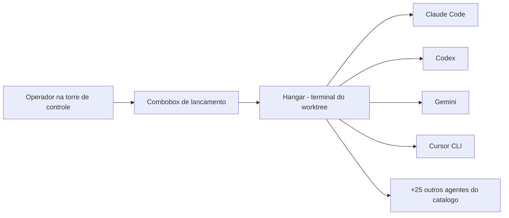
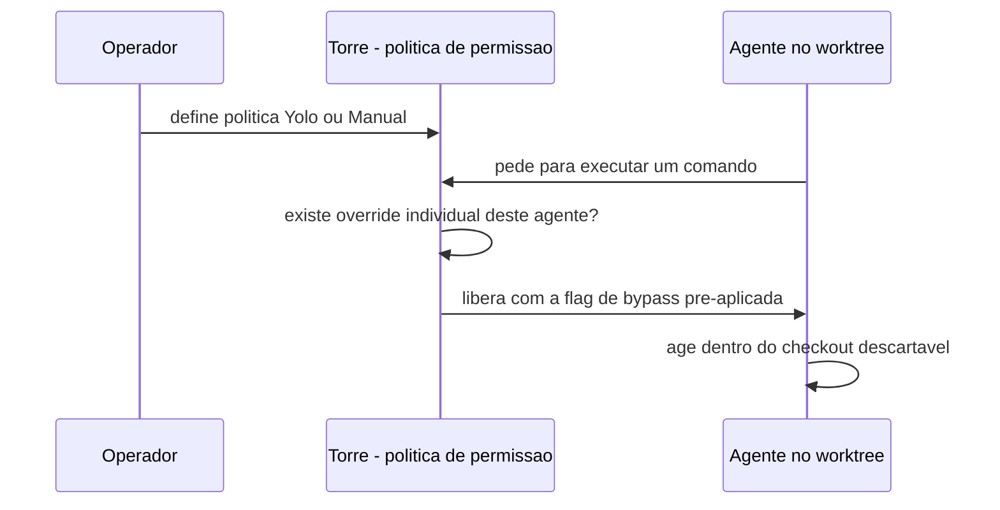
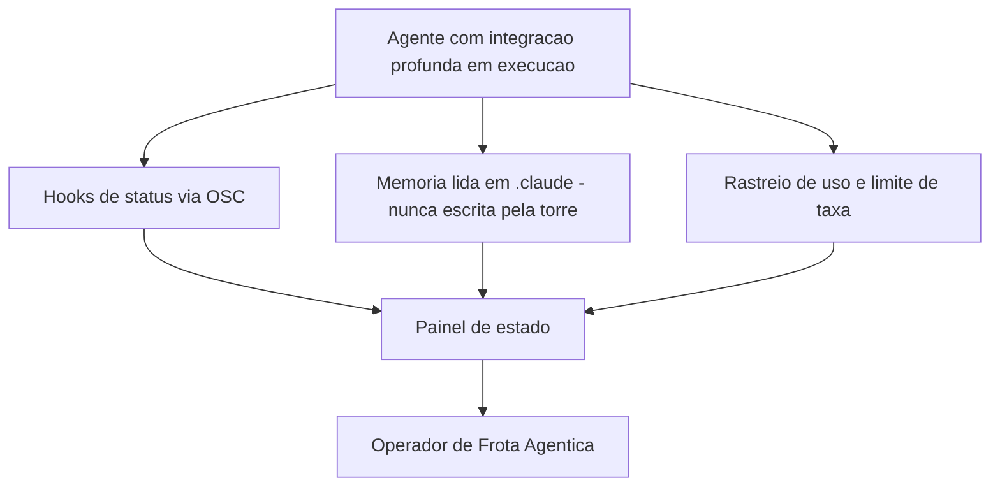

# Capítulo 6: Agentes Suportados: O Harness Agnóstico e o Catálogo de CLIs

## 1. Introdução

No Capítulo 4, você aprendeu que um worktree é um checkout físico, isolado e, sobretudo, **descartável** — a base que torna seguro rodar agentes em paralelo sem que um pise no arquivo do outro [4]. Este capítulo usa essa mesma peça para responder a uma pergunta que todo Operador de Frota Agêntica faz na primeira semana: por que a torre de controle aceita qualquer agente de linha de comando que exista, e por que ela ousa liberar cada um deles para agir sozinho, sem pedir sua confirmação a cada passo?

Você vai sair daqui entendendo os dois lados dessa moeda. De um lado, o princípio de agnosticismo que faz o catálogo de agentes existir e crescer sem que o Orca precise "entender" nenhum deles por dentro. Do outro, o modelo de permissões que decide, comando a comando, quando um agente pode agir sem reconfirmação — e por que essa liberdade só é segura por causa do que você já domina do Capítulo 4. No fim, você vai reconhecer as três integrações que vão além do simples lançamento de um processo: hooks de status, memória do agente e troca de conta a quente.

## 2. Explica

### O princípio por trás do catálogo

A primeira coisa que separa um operador de frota de um simples usuário de chatbot é entender que o Orca não pilota nenhum agente — ele apenas abre a porta do hangar. A documentação oficial resume o princípio de arquitetura com uma frase que parece simples demais para ser importante: "Orca works with any CLI agent — the agent combobox just launches a process in a terminal" [9]. Não existe integração profunda obrigatória, não existe protocolo proprietário de conversa entre o ambiente e o agente. Existe um processo, um terminal, e um worktree como diretório de trabalho.

É esse princípio que explica um número que, à primeira vista, parece só marketing: o seletor de lançamento do Orca já vem com **mais de 30 CLIs** pré-configuradas, prontas para instalar e lançar em um clique [9]. Ao dominar essa distinção — agnosticismo por design, não integração caso a caso —, você entende por que esse catálogo pode crescer todo mês sem que o time do Orca precise reescrever nada: Claude Code, Codex, Gemini, Cursor CLI, OpenCode, Aider, Goose, Amp, Devin e mais duas dezenas de outros nomes convivem na mesma lista [9]. A fronteira declarada reforça o mesmo ponto por um ângulo diferente: "Not a model. Orca runs agents you already use — bring your own Claude, Codex, or OpenCode subscription" [1]. O produto nunca é dono do modelo nem da conta; ele é dono apenas do ambiente ao redor.

### O gatilho que libera o bypass

Aqui está o núcleo técnico deste capítulo, e é também o ponto mais mal-entendido por quem chega de um fluxo de trabalho tradicional. Cada CLI suportada tem uma flag própria que faz o agente parar de pedir confirmação a cada comando, e o Orca pré-aplica essa flag sozinho ao lançar o processo [9]. A página que descreve o modelo de agentes e sessões confirma o mesmo comportamento por outro ângulo, tratando a ausência de reconfirmação como parte do ciclo normal de trabalho dentro do worktree [5]. São **3 famílias distintas de flags de bypass** documentadas: `--dangerously-skip-permissions` para o Claude Code, `--dangerously-bypass-approvals-and-sandbox` para o Codex, e `--yolo` (ou equivalente) para Gemini, Cursor CLI, Crush, Kimi, Rovo Dev, Hermes, GitHub Copilot e Command Code, entre outros [9].

O ponto que separa quem apenas usa o recurso de quem entende o recurso é este: a flag não existe isolada. Ela existe **porque** o worktree em que o agente roda é descartável. A documentação encadeia as duas ideias na mesma frase, não por acaso: "worktrees are disposable: an agent running in its own checkout can experiment without you re-confirming every shell command, and you can still cherry-pick or discard the diff before merging" [9]. Sem o Capítulo 4 — sem a garantia de que aquele checkout pode ser jogado fora sem custo — a mesma flag de bypass seria imprudência pura. Com ela, é apenas velocidade.

Essa liberdade tem dois níveis de controle, não um só. No nível global, `Settings → Agents → Agent Permissions` alterna **todos** os agentes ainda não customizados entre os modos *Yolo* e *Manual* de uma vez [9]. No nível individual, qualquer agente cujos argumentos de lançamento tenham sido editados manualmente sai dessa migração em massa: "Orca treats a non-empty custom value as an explicit override and opts that agent out of future permission-mode migrations" [9]. Ou seja, a política global muda a frota inteira — exceto os veículos que já receberam ordem de serviço própria.

### O que vai além de ligar o processo

Nem todo agente do catálogo recebe o mesmo nível de atenção do ambiente. A documentação nomeia **3 agentes com integração profunda** — Claude Code, Codex e Cursor CLI [9] — que ganham tratamento além do simples "abrir um terminal": hooks de status que alimentam o painel visual, leitura de memória e histórico de sessão, e troca de conta sem reiniciar o processo. O Claude Code, por exemplo, é lido diretamente de `~/.claude` — sem precisar de configuração extra — para mostrar consumo de uso e proximidade de limite de taxa na barra de status, com suporte a múltiplas contas e troca em um clique [10]. Esse mesmo mecanismo de leitura de uso é o que sustenta o rastreio de limite de taxa descrito na página dedicada ao tema [19]. Já o Codex tem uma superfície dedicada de hot-swap, para trocar o login por trás de uma sessão ativa sem derrubá-la [12].

É importante fixar o que essa integração **não** faz. O Orca lê as configurações `.claude/` e `.codex/` de cada repositório, mas nunca toca em `CLAUDE.md` ou `AGENTS.md` — "they belong to the agent", diz a documentação com todas as letras [16]. O ambiente observa e reage a sinais; ele não reescreve a memória do agente.

## 3. Ilustra

Pense na torre de controle recebendo, a cada minuto, pedidos de decolagem de veículos completamente diferentes entre si — alguns fabricados pela Anthropic, outros pela OpenAI, outros por times menores que você talvez nunca tenha ouvido falar. A torre não pergunta o modelo do motor de nenhum deles. Ela pergunta uma única coisa: "você sabe taxiar até o hangar (o terminal) sozinho?". Se a resposta é sim, o veículo entra no catálogo.



*O hangar não muda de formato para receber o Claude Code ou o Gemini — é o mesmo portão, o mesmo terminal, o mesmo worktree. A diferença fica inteiramente por conta de quem entra [9].*

Agora, o ponto mais denso do capítulo merece duas imagens complementares, porque uma frase seca ("o bypass é seguro") esconde mais do que explica.

**Primeira analogia — a mecânica geral.** Pense na flag de bypass como a **carta de dispensa de vistoria** que a torre entrega a cada piloto antes da decolagem. Ela não elimina o risco de o piloto errar — ela elimina apenas a burocracia de perguntar "posso decolar?" a cada dez segundos de voo, porque o espaço aéreo daquele voo específico (o worktree) foi reservado só para ele, e um acidente ali não derruba outro avião.

**Segunda analogia — o ponto mais difícil de aceitar.** A parte que trava o iniciante é a ideia de que **a mesma carta de dispensa, em outro espaço aéreo, vira negligência**. Se você entregasse a mesma dispensa de vistoria para um piloto decolando dentro do pátio principal do aeroporto — o checkout compartilhado por todo mundo, sem isolamento —, a ausência de confirmação deixaria de ser velocidade e passaria a ser risco puro. A flag de bypass não é "sempre segura" nem "sempre perigosa": ela herda a segurança do espaço em que roda.



Por fim, o painel de estado da torre não precisa desligar o rádio de um veículo para trocar de piloto ou para ler seu diário de bordo:



## 4. Técnica

O profissional que sabe operar uma frota mista não decora o catálogo inteiro de cor — ele sabe onde consultar cada regra e como verificar, na prática, o que está configurado. Os três blocos abaixo cobrem o ciclo completo: lançar dois agentes na mesma tarefa, entender qual flag cada um carrega, e confirmar que os hooks de status sobreviveram a um reinício do aplicativo.

### Lançando dois agentes na mesma tarefa

O padrão mais simples de agnosticismo na prática é criar um worktree por agente e comparar abordagens para o mesmo problema, sem que um dependa do outro:

```bash
# Lanca o Claude Code em um worktree dedicado a tarefa
orca worktree create --name revisar-checkout-claude --agent claude --json

# Lanca o Codex em outro worktree, para comparar a solucao
# do mesmo problema com um agente diferente
orca worktree create --name revisar-checkout-codex --agent codex --json
```

<!-- cli-check: fonte=A; confere=true -->

O flag `--agent` escolhe qual processo é lançado no primeiro terminal daquele worktree; `--json` devolve saída estruturada, pensada para automação e não para leitura visual [36]. Repare que nenhuma das duas linhas menciona nada sobre "compatibilidade" entre Claude Code e Codex — não existe tal coisa, porque cada um vive no seu próprio checkout.

### Consultando qual flag de bypass cada agente recebe

Para não depender de memória, um pequeno script consulta a mesma tabela que a documentação declara e devolve, junto com a flag, o lembrete do porquê ela existe:

```bash
#!/usr/bin/env bash
# flag_bypass_por_agente.sh
# Consulta local (nao e um comando oficial do Orca) que documenta,
# agente a agente, qual flag de bypass de permissao a torre pre-aplica.
# Uso: ./flag_bypass_por_agente.sh claude

set -euo pipefail

agente="${1:-}"

if [ -z "$agente" ]; then
  echo "uso: $0 <nome-do-agente>"
  exit 1
fi

case "$agente" in
  claude)
    flag="--dangerously-skip-permissions"
    ;;
  codex)
    flag="--dangerously-bypass-approvals-and-sandbox"
    ;;
  gemini|cursor|crush|kimi|rovo-dev|hermes|github-copilot|command-code)
    flag="--yolo"
    ;;
  *)
    echo "agente '$agente' nao esta nesta tabela local; confira Settings -> Agents."
    exit 2
    ;;
esac

echo "agente: $agente"
echo "flag de bypass pre-aplicada: $flag"
echo "lembrete: essa flag so e segura porque o worktree atual e descartavel (Capitulo 4)."
```

Rodar `./flag_bypass_por_agente.sh codex` imprime a flag exata que o Orca aplica àquele processo — o mesmo dado que você acabou de ler na seção Explica [9], agora numa forma que você pode consultar sem abrir a documentação de novo. O comportamento por trás da flag continua o mesmo descrito na página de agentes e sessões [5].

### Confirmando que os hooks de status sobrevivem a um reinício

Os hooks gerenciados que alimentam o painel de estado (*working / waiting / done*) são desligáveis e religáveis sem reiniciar o Orca, porque seus endpoints ficam gravados em disco e são relidos a cada invocação [16]:

```bash
# Confirma o estado atual dos hooks gerenciados de status
orca agent hooks status --json

# Desliga os hooks gerenciados (remove tambem a reinstalacao automatica)
orca agent hooks off --json

# Religa os hooks gerenciados - volta sem reiniciar o aplicativo
orca agent hooks on --json
```

<!-- cli-check: fonte=A; confere=true -->

Esse trio de comandos é o instrumento certo quando um agente parece "sumir" do painel de estado sem motivo aparente: antes de suspeitar do agente, confira se os hooks estão ligados.

## 5. Aplica

Imagine a cena: você está com pressa, precisa de um ajuste rápido em um serviço de faturamento, e em vez de criar um worktree novo — "é só uma linha, não vale o ritual" — você abre um terminal direto no checkout principal, o mesmo que o time inteiro compartilha, e lança o Claude Code com a política global em *Yolo*. O agente aceita a tarefa, interpreta mal um comando de limpeza de cache e apaga arquivos de configuração local que ninguém tinha commitado ainda. Não há branch descartável para simplesmente jogar fora: o estrago está no único checkout que existe.

O diagnóstico é exatamente o que a seção Explica já previu: a flag de bypass nunca foi perigosa por si — ela é perigosa **fora** do espaço para o qual foi desenhada. O worktree descartável é a rede de segurança que torna o "não perguntar a cada comando" uma troca aceitável entre velocidade e risco [9]. Remova a rede, e a mesma configuração vira exatamente o oposto do que prometia.

A correção prática tem duas camadas, e um Operador de Frota Agêntica maduro aplica as duas por hábito: primeiro, nenhuma sessão de agente com bypass roda fora de um worktree dedicado — é a disciplina do Capítulo 4 aplicada aqui sem exceção. Segundo, quando um repositório específico exige mais cautela mesmo dentro de worktrees (um monólito de pagamento, por exemplo), o operador aplica um override individual naquele agente para forçar o modo *Manual*, sabendo que essa customização o tira das migrações globais futuras de permissão [9].

Armadilhas comuns que valem registrar como síntese:

- Tratar `--yolo` como "modo rápido" sem lembrar que ele pressupõe um checkout descartável.
- Esquecer que um override individual por agente sobrevive a mudanças na política global — e por isso pode surpreender meses depois.
- Assumir integração profunda para qualquer agente do catálogo, quando ela está documentada para apenas 3 deles hoje [9].
- Achar que desligar hooks de status "conserta" um agente lento, quando o problema real costuma estar no próprio processo, não no painel.

Onde isso escala e onde quebra: o modelo de bypass por flag funciona bem para qualquer volume de worktrees simultâneos, porque a segurança vem do isolamento físico, não de um limite de contagem — a documentação não declara teto numérico de worktrees em paralelo [51]. O que **não** escala é aplicar a mesma flag fora do padrão worktree-por-tarefa: a partir do momento em que um agente com bypass roda num checkout compartilhado, a garantia desaparece por completo, independentemente de quantos agentes você está operando.

### Exercício
- [ ] Abra `Settings → Agents → Supported agents` e conte quantos agentes do catálogo já estão instalados na sua máquina
- [ ] Identifique, na lista, quais dos seus agentes têm integração profunda declarada (Claude Code, Codex, Cursor CLI)
- [ ] Rode o script `flag_bypass_por_agente.sh` para dois agentes diferentes e compare as flags retornadas
- [ ] Confirme com `orca agent hooks status --json` se os hooks gerenciados de status estão ativos na sua sessão atual
- [ ] Verifique se algum agente da sua configuração já tem override individual — e anote por que ele foi customizado

## 6. Conclusão

Três ideias sustentam este capítulo. Primeiro, o catálogo de mais de 30 CLIs existe porque o Orca é agnóstico por princípio — ele lança processos em terminais, não modelos [9]. Segundo, a flag de bypass que cada agente recebe só é segura porque herda a garantia do worktree descartável que você já domina desde o Capítulo 4 — e essa garantia tem um interruptor global e um override individual, cada um com sua própria precedência [9]. Terceiro, apenas três agentes hoje recebem integração profunda — hooks, memória lida (nunca escrita) e troca de conta a quente —, e é esse tratamento que faz o painel de estado da torre parecer vivo em vez de uma lista de processos [9]. A regra de que essa memória é lida, mas jamais reescrita pela torre, vem diretamente da documentação de hooks e memória do agente [16].

Com o catálogo de veículos entendido, o próximo capítulo olha para dentro de cada terminal individual: os estados observáveis, o ciclo de vida completo de uma sessão e o que acontece quando um agente fica tempo demais sem trabalhar. É a peça que transforma o terminal de janela passiva em instrumento de gestão da frota.

## 7. Referências Bibliográficas

[1] ORCA. *What is Orca?* Orca Docs, 2026. Disponível em: <https://www.onorca.dev/docs>. Acesso em: 12 set. 2026. (A)

[4] ORCA. *Worktrees*. Orca Docs, 2026. Disponível em: <https://www.onorca.dev/docs/model/worktrees>. Acesso em: 12 set. 2026. (A)

[5] ORCA. *Agents & sessions*. Orca Docs, 2026. Disponível em: <https://www.onorca.dev/docs/model/agents-sessions>. Acesso em: 12 set. 2026. (A)

[9] ORCA. *Supported agents*. Orca Docs, 2026. Disponível em: <https://www.onorca.dev/docs/agents/supported>. Acesso em: 12 set. 2026. (A)

[10] ORCA. *Claude Code in Orca*. Orca Docs, 2026. Disponível em: <https://www.onorca.dev/docs/agents/claude-code>. Acesso em: 12 set. 2026. (A)

[11] ORCA. *Codex in Orca*. Orca Docs, 2026. Disponível em: <https://www.onorca.dev/docs/agents/codex>. Acesso em: 12 set. 2026. (A)

[12] ORCA. *Hot-swap Codex accounts*. Orca Docs, 2026. Disponível em: <https://www.onorca.dev/docs/agents/codex-hot-swap>. Acesso em: 12 set. 2026. (A)

[13] ORCA. *Cursor CLI in Orca*. Orca Docs, 2026. Disponível em: <https://www.onorca.dev/docs/agents/cursor-cli>. Acesso em: 12 set. 2026. (A)

[14] ORCA. *GLM agent*. Orca Docs, 2026. Disponível em: <https://www.onorca.dev/docs/agents/glm-agent>. Acesso em: 12 set. 2026. (A)

[15] ORCA. *Agent hibernation*. Orca Docs, 2026. Disponível em: <https://www.onorca.dev/docs/agents/hibernation>. Acesso em: 12 set. 2026. (A)

[16] ORCA. *Agent hooks & memory*. Orca Docs, 2026. Disponível em: <https://www.onorca.dev/docs/agents/hooks-memory>. Acesso em: 12 set. 2026. (A)

[17] ORCA. *Native chat*. Orca Docs, 2026. Disponível em: <https://www.onorca.dev/docs/agents/native-chat>. Acesso em: 12 set. 2026. (A)

[18] ORCA. *Agent session history*. Orca Docs, 2026. Disponível em: <https://www.onorca.dev/docs/agents/session-history>. Acesso em: 12 set. 2026. (A)

[19] ORCA. *Usage & rate-limit tracking*. Orca Docs, 2026. Disponível em: <https://www.onorca.dev/docs/agents/usage-tracking>. Acesso em: 12 set. 2026. (A)

[20] ORCA. *Terminal*. Orca Docs, 2026. Disponível em: <https://www.onorca.dev/docs/terminal>. Acesso em: 12 set. 2026. (A)

[35] ORCA. *Orca CLI overview*. Orca Docs, 2026. Disponível em: <https://www.onorca.dev/docs/cli/overview>. Acesso em: 12 set. 2026. (A)

[36] ORCA. *Orca CLI reference*. Orca Docs, 2026. Disponível em: <https://www.onorca.dev/docs/cli/reference>. Acesso em: 12 set. 2026. (A)

[37] ORCA. *Orchestration*. Orca Docs, 2026. Disponível em: <https://www.onorca.dev/docs/cli/orchestration>. Acesso em: 12 set. 2026. (A)

[42] ORCA. *Ways to run Orca*. Orca Docs, 2026. Disponível em: <https://www.onorca.dev/docs/ways-to-run>. Acesso em: 12 set. 2026. (A)

[49] ORCA. *Settings reference*. Orca Docs, 2026. Disponível em: <https://www.onorca.dev/docs/settings>. Acesso em: 12 set. 2026. (A)

[51] ORCA. *Troubleshooting & FAQ*. Orca Docs, 2026. Disponível em: <https://www.onorca.dev/docs/troubleshooting>. Acesso em: 12 set. 2026. (A)

[65] STABLY AI. *Orca* — repositório oficial. GitHub, 2026. Disponível em: <https://github.com/stablyai/orca>. Acesso em: 12 set. 2026. (A)
