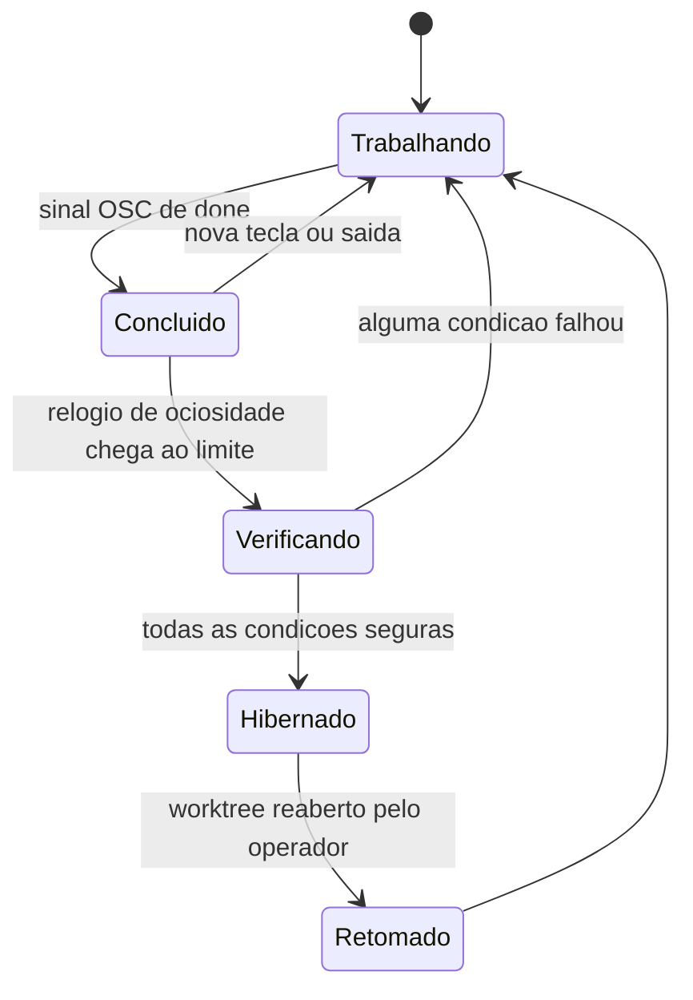

# Capítulo 7: O Terminal Agêntico: Estados, Ciclo de Vida, Hibernação e Histórico

## 1. Introdução

No Capítulo 6, você aprendeu que o Orca é radicalmente agnóstico: qualquer CLI de agente que roda em um terminal roda dentro do ambiente [1], com permissões, hooks e conta do operador sob controle [9]. Mas essa liberdade cria um problema imediato para quem opera mais de três ou quatro agentes ao mesmo tempo: se qualquer CLI pode rodar ali, como saber, sem clicar em cada aba, qual delas está trabalhando, qual travou esperando uma permissão e qual já terminou há vinte minutos? A resposta é que o terminal deixou de ser uma janela passiva de texto rolando e virou um **objeto gerenciado com ciclo de vida** — com estado observável de fora, pausa automática quando ocioso e um histórico auditável de tudo o que já rodou ali.

Este capítulo é onde a metáfora da torre de controle deixa de ser só uma imagem bonita e vira ferramenta de trabalho. Você vai aprender a ler o **painel de estado** da frota inteira sem abrir terminal nenhum, a entender a **linha de vida** que decide quando um agente ocioso pode ser colocado para dormir com segurança, e a tratar cada sessão como um **diário de bordo** recuperável — mesmo depois de fechado o aplicativo. Ao final, você vai operar o terminal como um instrumento de bancada, não como uma tela que você espia de vez em quando torcendo para que nada tenha quebrado.

## 2. Explica

### 7.1 O painel de estado: seis glifos, uma origem

A documentação define sessão de agente com precisão cirúrgica: "An agent session is one CLI agent running in one terminal in one worktree. Orca tracks its lifecycle so you always know which sessions are working and which are idle — without you having to click into each tab to check" [5]. Repare no final da frase: a promessa explícita é eliminar o clique de verificação. Isso só é possível porque existe um vocabulário visual compartilhado entre abas de agente e linhas de worktree — seis glifos, e apenas seis [5]:

| Glifo | Significado |
|---|---|
| Spinner | trabalhando (working) |
| Ponto de interrogação âmbar | esperando você (permissão ou entrada) |
| Check ou ponto esmeralda | concluído / ativo silencioso |
| Ponto vermelho | bloqueado, interrompido ou falhou |
| Ponto cinza | ocioso (idle) |
| Sem indicador | shell puro, não é uma CLI de agente reconhecida |

De onde vem essa leitura? De duas fontes técnicas concretas, não de adivinhação: a **sequência de título OSC** que o próprio terminal emite e os **hooks do agente** [16]. Claude Code [10] e Codex [11] já implementam esse segundo mecanismo nativamente — e é a mesma via de identidade do agente que sustenta a troca de conta a quente sem perder o estado observável do terminal, recurso que você já viu no Capítulo 6 [12]. OSC é um mecanismo antigo de terminal — o mesmo tipo de sinalização que qualquer emulador moderno baseado em xterm.js já sabe interpretar [70] — reaproveitado aqui para um propósito novo: dizer ao ambiente hospedeiro "estou trabalhando" ou "estou esperando você" sem que o operador precise adivinhar pelo conteúdo da tela.

O consumo prático desse sinal é o **Agent Dashboard**, ainda experimental: um kanban com quatro colunas — *Needs You*, *Working*, *Done* e *Idle* (esta última oculta por padrão) [5]. É um painel pensado para a frota crescer — útil bem além de três ou quatro agentes, o cenário em que a torre de controle de fato paga o próprio custo de existir [65]. Clicar em um cartão abre e foca o terminal vivo daquele agente, e cartões de workspace SSH ou de servidor remoto pareado ganham um selo de host para você não confundir onde cada agente está de fato rodando [5][43]. Cartões *Needs You* recebem tom âmbar; *Done* recebem verde — a documentação resume o critério de design em uma frase: "tint means look here" [5]. Não é decoração; é hierarquia visual pensada para varredura rápida, complementada por uma página de Activity que guarda o registro agregado do que já aconteceu, não só o instante presente [48]. E o próprio momento da virada de estado já chega até você antes de olhar para qualquer painel: quando um agente passa de trabalhando para ocioso, o Orca dispara notificação de sistema, som e um chip no worktree [47].

### 7.2 Hibernação: a linha de vida do agente ocioso

Se o painel de estado resolve "o que está acontecendo agora", a hibernação resolve o problema seguinte: "o que fazer quando nada mais está acontecendo". É aqui que a metáfora da linha de vida — o heartbeat que confirma que um veículo da frota ainda está sendo monitorado — ganha o contorno técnico mais rico do capítulo.

A hibernação de agentes é um recurso experimental, desligado por padrão, ligado em `Settings → Experimental → Agent hibernation` [15]. E ela não dorme um terminal por capricho: **todas** as condições a seguir precisam valer ao mesmo tempo [15]:

1. o agente está em estado *done*;
2. o terminal não está no worktree ativo — o mesmo conceito de garagem isolada do Capítulo 4 [4] — nem em um worktree cujo terminal está em primeiro plano;
3. nenhuma tecla foi recebida desde a conclusão;
4. o agente pertence à lista de sessão retomável;
5. o terminal ficou ocioso por, no mínimo, a janela configurada — **30 minutos** é o padrão declarado [15];
6. nenhuma sessão mobile está pilotando aquele terminal;
7. não existe Dispatch de orquestração ainda não liquidado (pendente, despachado ou de status desconhecido);
8. não há roster vivo de subagente ou teammate anexado ao painel.

Falhar em qualquer uma dessas oito checagens mantém o terminal rodando — a documentação é explícita sobre a assimetria: é fácil impedir o sono, difícil autorizá-lo [15]. E há uma regra de unidade que evita o pior dos dois mundos: "If a worktree has multiple agent panes, they hibernate together as a unit so a partially-paused worktree never ships" [15]. Ou seja, um worktree com três painéis de agente nunca fica com um dormindo e dois acordados — dorme junto, ou não dorme.

A janela de ociosidade não é fixa: ela é ajustável de **1 minuto a 24 horas**, e o relógio reinicia a cada tecla, cada linha nova de saída ou cada vez que você reabre a aba daquele agente [15]. Quando o worktree hibernado é reaberto, o Orca não começa uma conversa do zero — ele **relança a CLI com as mesmas flags de retomada** que usaria manualmente a partir do histórico de sessão, como `claude --resume <id>` para Claude Code [10] ou `codex resume <id>` para Codex [11], reaproveitando comando, argumentos e o ambiente privado capturado no lançamento original [15]. Se a CLI não conseguir retomar — transcrição apagada, identificador rotacionado pelo provedor —, o terminal simplesmente abre em um prompt novo, sem apagar a transcrição anterior do histórico [15][18]. Essa retomada de sessão de agente é prima da restauração mais ampla que o próprio ambiente já faz ao reabrir um projeto inteiro, com abas e painéis de volta ao lugar [8].

Vale registrar o limite declarado com a mesma franqueza da documentação: só hibernam os agentes de sessão retomável listados — hoje **11** ao todo: Claude, Codex, Gemini, Antigravity, OpenCode, Pi, MiMo Code, Droid, Grok, Devin e OMP [15]. Cursor CLI, Hermes, Copilot, Trae e outros terminais não retomáveis continuam rodando indefinidamente mesmo ociosos [9][15] — a hibernação depende da capacidade da própria CLI de reconstituir sessão, não é uma mágica universal do ambiente.

### 7.3 O terminal como instrumento e o diário de bordo da sessão

Por baixo da superfície, o terminal do Orca é construído sobre xterm.js — "the same xterm.js-based terminal VS Code uses" [20][70] —, dentro de um shell de aplicativo desktop montado em Electron [71], com renderização WebGL e splits que se aninham sem limite prático declarado, seguindo a mesma lógica de abas e painéis por worktree do resto do ambiente [6][20]. Duas capacidades merecem destaque por resolverem dores específicas de quem trabalha com TUIs e com scrollback longo: o **clipboard TUI via OSC 52**, que permite que Zellij, tmux, Neovim ou fzf escrevam no clipboard do sistema operacional mesmo através de uma sessão SSH [20], e a busca no scrollback (`Cmd-F`), com destaque, distinção de maiúsculas, regex e navegação entre ocorrências [20]. Há também um **terminal flutuante**, ligado por padrão em instalações novas, que hospeda abas próprias e permite iniciar execuções de fundo sem ocupar um painel de worktree [20] — e **Quick Commands**, comandos salvos e prompts de agente reutilizáveis, com escopo *Global* ou *Project*, que aparecem lado a lado entre coleções locais e remotas quando há servidor pareado [20].

Nada disso teria valor duradouro se a sessão morresse com o fechamento da aba. Por isso existe o **Agent Session History**: o Orca varre, em disco, as transcrições que cada CLI já deixa por conta própria — em `~/.codex/sessions`, no histórico de `~/.claude`, nos logs do Cursor, nas sessões do OpenCode ou em `~/.local/share/opencode/opencode.db` [18] — e as lista em um painel com contador no formato "12 shown · 47 recent", busca por título, diretório, branch, modelo ou prévia da conversa, e escopo de *Workspace*, *Project* ou *All* [18]. Cada linha do histórico carrega ações precisas: *Resume*, *Resume in New Chat* (só para sessões locais elegíveis de Claude e Codex — e mover para chat estruturado desabilita depois o Resume em terminal) [17][18], *Copy resume command*, *Copy session ID*, *Copy log path*, *Open log* e *Open cwd* [18]. O caminho de `Resume in New Chat` desemboca no chat nativo do Orca, cujo release mais recente já mostra ali dentro a atividade de subagentes do Claude e as tarefas de fundo do Codex [66]. Em workspace remoto, retomada direta não funciona; o painel orienta copiar o comando e rodá-lo no host [18][43].

## 3. Ilustra

Pense no painel de estado como o quadro luminoso de uma torre de controle real: cada veículo da frota — cada agente — pisca uma cor que qualquer operador reconhece de longe, sem precisar sintonizar o rádio daquele veículo específico para saber se ele está em voo, pousado ou parado na pista esperando autorização. É a mesma lógica dos seis glifos: eles existem para que você leia o estado de vários agentes ao mesmo tempo, na barra lateral e no Agent Dashboard, sem abrir terminal nenhum [5].

A hibernação, por ser o pilar mais denso deste capítulo, merece duas imagens complementares. A primeira é a mecânica geral: pense nela como a linha de vida de um monitor hospitalar — enquanto há sinal de atividade (tecla, saída nova, foco na aba), o traçado continua "acordado"; quando o sinal para por tempo suficiente, o sistema decide, com segurança, reduzir o consumo. A segunda imagem ataca o ponto mais difícil — as **oito** condições que precisam valer simultaneamente: pense numa checklist de pré-decolagem de avião. Não basta um instrumento estar verde; **todos** precisam estar verdes ao mesmo tempo, e um único item pendente — um passageiro (dispatch) ainda não embarcado, um filho (subagente) ainda no corredor — cancela a decolagem inteira. É por isso que um worktree com subagente vivo nunca hiberna sozinho: a checklist falha em um item, e a aeronave inteira permanece em solo, painéis acesos [15].



*Figura 7.1 — O terminal como objeto gerenciado: a passagem de Concluído para Hibernado exige que a checklist de segurança feche por inteiro; qualquer falha devolve o agente ao estado de Trabalhando [15].*

## 4. Técnica

### Classificando o painel de estado a partir de títulos OSC

O primeiro artefato é um script curto que simula o que o Orca faz internamente: recebe um texto de título de terminal (o tipo de string que uma sequência OSC carregaria) e resolve para qual dos seis glifos ele corresponde [5]. É deliberadamente simples — o objetivo é que você enxergue a regra de mapeamento, não a implementação real do produto.

```python
#!/usr/bin/env python3
# -*- coding: utf-8 -*-
"""
classificar_glifos.py - Traduz titulos de terminal (estilo sequencia OSC) para
os seis glifos de estado do painel da torre de controle.

Uso: python classificar_glifos.py
"""

from __future__ import annotations

# Mapa de palavras-chave para o glifo correspondente. Em producao, o Orca le
# a sequencia OSC real emitida pela CLI; aqui simulamos com texto simples.
REGRAS = [
    ("waiting-for-input", "PONTO_INTERROGACAO_AMBAR"),
    ("needs-permission", "PONTO_INTERROGACAO_AMBAR"),
    ("done", "CHECK_ESMERALDA"),
    ("failed", "PONTO_VERMELHO"),
    ("blocked", "PONTO_VERMELHO"),
    ("idle", "PONTO_CINZA"),
    ("working", "SPINNER"),
]


def classificar_titulo(titulo: str) -> str:
    """Retorna o nome do glifo para um titulo de terminal simulado."""
    titulo_normalizado = titulo.strip().lower()
    for palavra_chave, glifo in REGRAS:
        if palavra_chave in titulo_normalizado:
            return glifo
    # Nenhuma palavra-chave de agente reconhecida: shell puro.
    return "SEM_INDICADOR"


def montar_kanban(titulos: list[str]) -> dict[str, int]:
    """Agrupa uma lista de titulos em contagem por coluna do Agent Dashboard."""
    colunas = {"Needs You": 0, "Working": 0, "Done": 0, "Idle": 0, "Outros": 0}
    traducao = {
        "PONTO_INTERROGACAO_AMBAR": "Needs You",
        "SPINNER": "Working",
        "CHECK_ESMERALDA": "Done",
        "PONTO_CINZA": "Idle",
    }
    for titulo in titulos:
        glifo = classificar_titulo(titulo)
        coluna = traducao.get(glifo, "Outros")
        colunas[coluna] += 1
    return colunas


def main() -> None:
    titulos_simulados = [
        "agent: working on auth-fix",
        "agent: needs-permission to run npm install",
        "agent: done - review-api",
        "agent: idle since 14:02",
        "agent: failed - flaky-login-test",
        "bash",
    ]

    print("Painel de estado (simulado):")
    for titulo in titulos_simulados:
        print(f"  {titulo!r:45s} -> {classificar_titulo(titulo)}")

    print("\nMini-kanban por coluna:")
    for coluna, total in montar_kanban(titulos_simulados).items():
        print(f"  {coluna:10s}: {total}")


if __name__ == "__main__":
    main()
```

Rodar esse script deixa uma coisa clara: a tradução de texto bruto para glifo é uma tabela de regras, não inteligência artificial nenhuma. É justamente essa simplicidade que permite ao Orca atualizar o painel em tempo real, para qualquer uma das dezenas de CLIs do catálogo, sem esperar resposta de rede [5][9].

### A checklist de hibernação como função auditável

O segundo artefato traduz literalmente as oito condições da seção Explica em uma função que qualquer pessoa pode ler e conferir — o mesmo espírito de "checklist de pré-decolagem" da seção Ilustra, só que em código.

```python
#!/usr/bin/env python3
# -*- coding: utf-8 -*-
"""
pode_hibernar.py - Aplica as condicoes documentadas de hibernacao de um
terminal de agente, uma por uma, e explica no comentario por que cada
condicao existe.
"""

from __future__ import annotations

JANELA_PADRAO_MINUTOS = 30  # padrao declarado pela documentacao [15]
FAIXA_MINIMA_MINUTOS = 1
FAIXA_MAXIMA_MINUTOS = 24 * 60  # 24 horas, em minutos

AGENTES_RETOMAVEIS = {
    "claude", "codex", "gemini", "antigravity", "opencode",
    "pi", "mimo-code", "droid", "grok", "devin", "omp",
}  # 11 agentes elegiveis a hibernacao, hoje [15]


def pode_hibernar(estado_terminal: dict, janela_minutos: int = JANELA_PADRAO_MINUTOS) -> tuple[bool, str]:
    """Recebe um dicionario descrevendo o estado observavel de um terminal e
    devolve (pode_hibernar, motivo). Para hibernar, TODAS as condicoes abaixo
    precisam ser verdadeiras ao mesmo tempo - falhar em uma so ja basta para
    manter o terminal rodando."""

    if not (FAIXA_MINIMA_MINUTOS <= janela_minutos <= FAIXA_MAXIMA_MINUTOS):
        return False, "janela configurada fora da faixa permitida (1 min a 24h)"

    # 1. o agente precisa estar 'done' - hibernar um agente ainda trabalhando
    #    destruiria progresso em andamento.
    if estado_terminal.get("status_agente") != "done":
        return False, "agente ainda nao esta em estado 'done'"

    # 2. o terminal nao pode estar no worktree ativo nem em primeiro plano -
    #    nunca dormir o que o operador esta olhando agora.
    if estado_terminal.get("worktree_ativo") or estado_terminal.get("terminal_em_primeiro_plano"):
        return False, "worktree esta ativo ou terminal esta em primeiro plano"

    # 3. nenhuma tecla desde a conclusao - reinicia o relogio de ociosidade.
    if estado_terminal.get("teclas_desde_conclusao", 0) > 0:
        return False, "houve entrada de teclado desde a conclusao"

    # 4. o agente precisa pertencer a lista de sessao retomavel - sem isso,
    #    dormir seria perder a sessao para sempre.
    agente = estado_terminal.get("agente", "").lower()
    if agente not in AGENTES_RETOMAVEIS:
        return False, f"agente '{agente}' nao possui sessao retomavel"

    # 5. ociosidade minima: a janela configurada precisa ter decorrido.
    minutos_ocioso = estado_terminal.get("minutos_ocioso", 0)
    if minutos_ocioso < janela_minutos:
        return False, f"ocioso ha {minutos_ocioso} min, abaixo da janela de {janela_minutos} min"

    # 6. nenhuma sessao mobile pilotando este terminal agora.
    if estado_terminal.get("sessao_mobile_ativa"):
        return False, "uma sessao mobile ainda esta pilotando este terminal"

    # 7. nenhum dispatch de orquestracao pendente, despachado ou desconhecido.
    if estado_terminal.get("dispatch_nao_liquidado"):
        return False, "existe dispatch de orquestracao ainda nao liquidado"

    # 8. nenhum subagente ou teammate vivo anexado ao painel.
    if estado_terminal.get("subagentes_vivos", 0) > 0:
        return False, "ha subagente ou teammate ainda vivo no painel"

    return True, "todas as condicoes de seguranca foram satisfeitas"


def main() -> None:
    casos = [
        {"agente": "claude", "status_agente": "done", "worktree_ativo": False,
         "terminal_em_primeiro_plano": False, "teclas_desde_conclusao": 0,
         "minutos_ocioso": 45, "sessao_mobile_ativa": False,
         "dispatch_nao_liquidado": False, "subagentes_vivos": 0},
        {"agente": "cursor-cli", "status_agente": "done", "worktree_ativo": False,
         "terminal_em_primeiro_plano": False, "teclas_desde_conclusao": 0,
         "minutos_ocioso": 45, "sessao_mobile_ativa": False,
         "dispatch_nao_liquidado": False, "subagentes_vivos": 0},
        {"agente": "codex", "status_agente": "done", "worktree_ativo": False,
         "terminal_em_primeiro_plano": False, "teclas_desde_conclusao": 0,
         "minutos_ocioso": 45, "sessao_mobile_ativa": False,
         "dispatch_nao_liquidado": False, "subagentes_vivos": 1},
    ]

    for caso in casos:
        resultado, motivo = pode_hibernar(caso)
        print(f"agente={caso['agente']:12s} pode_hibernar={resultado!s:5s} motivo={motivo}")


if __name__ == "__main__":
    main()
```

Note que o terceiro caso de teste falha mesmo com todas as outras condições satisfeitas, só porque `subagentes_vivos` é maior que zero — exatamente a regra de unidade descrita antes: "o done do provedor sozinho não basta enquanto filhos seguem anexados" [15].

### Inventariando o diário de bordo da sessão

O terceiro artefato varre, de forma simplificada, os diretórios de histórico mais comuns entre CLIs de agente e conta quantos arquivos de sessão cada um guarda — um inventário de bancada do que o Agent Session History faz de forma muito mais completa [18].

```bash
#!/usr/bin/env bash
# inventario_diario_bordo.sh - Conta arquivos de sessao em diretorios de
# historico conhecidos de CLIs de agente, quando existirem no sistema.
set -euo pipefail

echo "=== Inventario do diario de bordo da sessao ==="

DIRETORIOS=(
  "$HOME/.claude"
  "$HOME/.codex/sessions"
  "$HOME/.local/share/opencode"
)

for dir in "${DIRETORIOS[@]}"; do
  if [ -d "$dir" ]; then
    total=$(find "$dir" -type f 2>/dev/null | wc -l | tr -d ' ')
    echo "[OK]      $dir -> $total arquivo(s)"
  else
    echo "[AUSENTE] $dir"
  fi
done

echo "==============================================="
echo "Dica: use 'Copy log path' no painel Agent Session History"
echo "para localizar o arquivo exato de uma sessao especifica [18]."
```

A verificação equivalente e completa, feita pelo próprio ambiente em vez de um script caseiro de bancada, é o painel Agent Session History descrito na seção anterior — com busca, escopo e as ações *Resume*, *Copy resume command* e *Open log* por linha [18][36].

## 5. Aplica

Você percebe tarde demais o custo do hábito errado. Na noite anterior, fechou o laptop com quatro agentes trabalhando — dois em Claude Code, um em Codex, um em Gemini. Na manhã seguinte, reabre o Orca e vê os quatro cartões ainda listados como *Working* no Agent Dashboard, só que nenhum processo real está rodando: a máquina hibernou o sistema operacional inteiro à noite, e você não tinha ideia se os agentes tinham terminado pouco depois de você sair ou se travaram esperando uma permissão horas mais tarde. Você perdeu a noite inteira de sinal. O erro não foi técnico — foi de hábito: tratar o painel de estado como decoração, e não como o primeiro lugar a olhar antes de fechar qualquer coisa.

O diagnóstico, à luz da seção Explica, é simples: o Orca só coloca um agente para hibernar de forma segura quando a checklist de oito condições fecha [15] — e "a máquina hospedeira dormiu" não é uma dessas condições. A correção prática é um hábito de dois segundos: antes de fechar o laptop, olhe o Agent Dashboard, não as abas individuais [5]. Cartões âmbar (*Needs You*) significam que alguém está esperando por você; cartões verdes (*Done*) podem ser revisados e arquivados; só o resto pode continuar rodando sem supervisão. Como Operador de Frota Agêntica, esse hábito de dois segundos é o que separa quem recupera o contexto perdido de quem descobre o estado real só ao abrir cada terminal um por um.

Armadilhas comuns que reforçam a mesma lição:

- Confiar na hibernação automática para agentes não listados entre os 11 retomáveis — Cursor CLI, Hermes, Copilot e Trae simplesmente continuam consumindo recursos [9][15].
- Ativar a hibernação (recurso ainda experimental) sem checar antes se o agente em questão suporta retomada por flag nativa — sem isso, a "retomada" vira sessão nova, e o histórico da conversa fica só como referência de leitura [15][18].
- Tratar `Resume in New Chat` como reversível: mover uma sessão local elegível para o chat estruturado desabilita depois o Resume em terminal para aquela sessão [17][18].
- Esperar retomada automática em workspace remoto: lá o caminho é sempre `Copy resume command` seguido de execução manual no host [18][43].

Onde isso escala e onde quebra, com honestidade: o mecanismo de hibernação e o histórico de sessão foram desenhados para uma frota de dezenas de agentes por operador humano, não para milhares. A documentação não declara um teto numérico de terminais monitoráveis — a orientação é qualitativa, e os instrumentos reais de contenção são a disciplina de fechar o que não está em uso, o rastreio de uso e limite de taxa por agente [19] e o gerenciador de recursos da barra de status [49][51]. O limite prático não é do painel, é do agente: hibernação só existe para os 11 nomes com sessão retomável [15], e histórico de sessão só é tão completo quanto a CLI de origem escolher gravar em disco [18].

### Exercício
- [ ] Abra o Agent Dashboard (mesmo experimental) e identifique, sem clicar em nenhuma aba, quantos agentes estão em *Needs You* agora
- [ ] Ative `Settings → Experimental → Agent hibernation` e ajuste a janela de ociosidade para um valor diferente do padrão de 30 minutos
- [ ] Rode o script `pode_hibernar.py` deste capítulo com um caso de teste seu, simulando um subagente vivo, e confirme que o resultado é `False`
- [ ] Abra o painel Agent Session History e use `Copy resume command` em uma sessão local elegível, sem clicar em Resume

## 6. Conclusão

Três coisas mudaram na forma como você vai olhar para um terminal a partir de agora. Primeiro: estado deixou de ser algo que você verifica clicando — os seis glifos, alimentados por OSC e hooks de agente, colocam o painel da frota inteira a um olhar de distância [5]. Segundo: hibernação não é economia de recursos por capricho, é uma checklist de oito condições de segurança que precisa fechar por inteiro, com janela padrão de 30 minutos e faixa configurável de 1 minuto a 24 horas [15]. Terceiro: nenhuma sessão precisa se perder — o diário de bordo em disco, varrido pelo Agent Session History, guarda o caminho de volta mesmo quando o Resume automático não está disponível [18].

Com o terminal domado como instrumento de ciclo de vida, o próximo passo natural é o que você faz com o que ele produziu: o Capítulo 8 leva você para dentro da sala de revisão, onde cada diff gerado por um desses agentes hibernáveis é lido, anotado e atribuído linha por linha antes de qualquer coisa ser publicada.

## 7. Referências Bibliográficas

[1] ORCA. *What is Orca?* Orca Docs, 2026. Disponível em: <https://www.onorca.dev/docs>. Acesso em: 12 set. 2026. (A)

[4] ORCA. *Worktrees*. Orca Docs, 2026. Disponível em: <https://www.onorca.dev/docs/model/worktrees>. Acesso em: 12 set. 2026. (A)

[5] ORCA. *Agents & sessions*. Orca Docs, 2026. Disponível em: <https://www.onorca.dev/docs/model/agents-sessions>. Acesso em: 12 set. 2026. (A)

[6] ORCA. *Tabs, panes & split layouts*. Orca Docs, 2026. Disponível em: <https://www.onorca.dev/docs/model/tabs-panes-splits>. Acesso em: 12 set. 2026. (A)

[8] ORCA. *Session restore*. Orca Docs, 2026. Disponível em: <https://www.onorca.dev/docs/model/session-restore>. Acesso em: 12 set. 2026. (A)

[9] ORCA. *Supported agents*. Orca Docs, 2026. Disponível em: <https://www.onorca.dev/docs/agents/supported>. Acesso em: 12 set. 2026. (A)

[10] ORCA. *Claude Code in Orca*. Orca Docs, 2026. Disponível em: <https://www.onorca.dev/docs/agents/claude-code>. Acesso em: 12 set. 2026. (A)

[11] ORCA. *Codex in Orca*. Orca Docs, 2026. Disponível em: <https://www.onorca.dev/docs/agents/codex>. Acesso em: 12 set. 2026. (A)

[12] ORCA. *Hot-swap Codex accounts*. Orca Docs, 2026. Disponível em: <https://www.onorca.dev/docs/agents/codex-hot-swap>. Acesso em: 12 set. 2026. (A)

[15] ORCA. *Agent hibernation*. Orca Docs, 2026. Disponível em: <https://www.onorca.dev/docs/agents/hibernation>. Acesso em: 12 set. 2026. (A)

[16] ORCA. *Agent hooks & memory*. Orca Docs, 2026. Disponível em: <https://www.onorca.dev/docs/agents/hooks-memory>. Acesso em: 12 set. 2026. (A)

[17] ORCA. *Native chat*. Orca Docs, 2026. Disponível em: <https://www.onorca.dev/docs/agents/native-chat>. Acesso em: 12 set. 2026. (A)

[18] ORCA. *Agent session history*. Orca Docs, 2026. Disponível em: <https://www.onorca.dev/docs/agents/session-history>. Acesso em: 12 set. 2026. (A)

[19] ORCA. *Usage & rate-limit tracking*. Orca Docs, 2026. Disponível em: <https://www.onorca.dev/docs/agents/usage-tracking>. Acesso em: 12 set. 2026. (A)

[20] ORCA. *Terminal*. Orca Docs, 2026. Disponível em: <https://www.onorca.dev/docs/terminal>. Acesso em: 12 set. 2026. (A)

[36] ORCA. *Orca CLI reference*. Orca Docs, 2026. Disponível em: <https://www.onorca.dev/docs/cli/reference>. Acesso em: 12 set. 2026. (A)

[43] ORCA. *SSH worktrees*. Orca Docs, 2026. Disponível em: <https://www.onorca.dev/docs/ssh>. Acesso em: 12 set. 2026. (A)

[47] ORCA. *Notifications & Inbox*. Orca Docs, 2026. Disponível em: <https://www.onorca.dev/docs/notifications>. Acesso em: 12 set. 2026. (A)

[48] ORCA. *Activity*. Orca Docs, 2026. Disponível em: <https://www.onorca.dev/docs/activity>. Acesso em: 12 set. 2026. (A)

[49] ORCA. *Settings reference*. Orca Docs, 2026. Disponível em: <https://www.onorca.dev/docs/settings>. Acesso em: 12 set. 2026. (A)

[51] ORCA. *Troubleshooting & FAQ*. Orca Docs, 2026. Disponível em: <https://www.onorca.dev/docs/troubleshooting>. Acesso em: 12 set. 2026. (A)

[65] STABLY AI. *Orca* — repositório oficial. GitHub, 2026. Disponível em: <https://github.com/stablyai/orca>. Acesso em: 12 set. 2026. (A)

[66] STABLY AI. *Orca Releases* — v1.4.200. GitHub, 2026. Disponível em: <https://github.com/stablyai/orca/releases>. Acesso em: 12 set. 2026. (A)

[70] XTERM.JS. *Xterm.js* — terminal front-end. Disponível em: <https://xtermjs.org/>. Acesso em: 12 set. 2026. (B)

[71] ELECTRON. *Build cross-platform desktop apps*. Disponível em: <https://www.electronjs.org/>. Acesso em: 12 set. 2026. (B)
