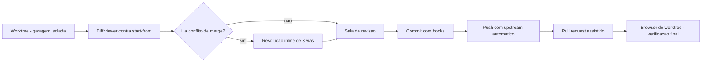
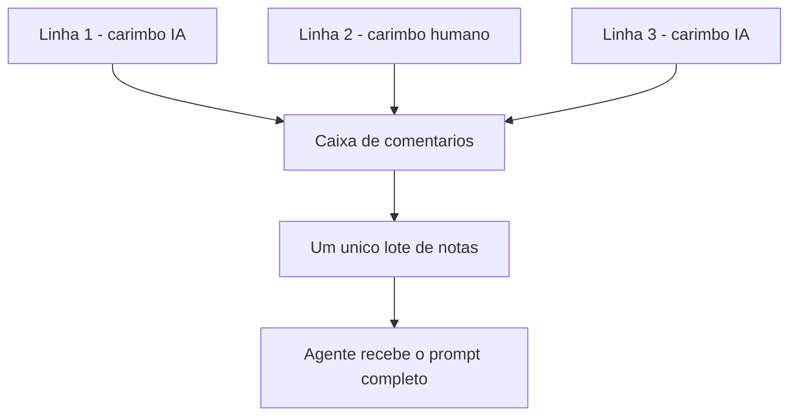

# Capítulo 8: O Ciclo de Revisão: Diff, Anotação, Atribuição e Publicação

## 1. Introdução

No Capítulo 7, você aprendeu a ler o Agent Dashboard como o kanban da frota: o glifo de check esmeralda que sinaliza um agente concluído e silencioso [5]. Aquele check é o começo deste capítulo, não o fim dele. Um trabalho "concluído" pelo agente ainda não é um trabalho **aceito** — e a distância entre essas duas palavras é exatamente o que separa quem apenas coordena agentes de quem, como Operador de Frota Agêntica, responde pelo que entra em produção.

Este capítulo instala a habilidade central do ambiente: revisar código gerado por IA com o mesmo rigor de um pull request humano, sem sair do worktree. Você vai percorrer o diff viewer como sala de revisão séria, o comentário em lote com procedência de linha marcada, e o caminho até o commit, o push e a publicação — inclusive o único momento em que forçar um push é seguro.

## 2. Explica

### 8.1 O diff viewer não é para uma olhada rápida

A documentação oficial é direta sobre o propósito do instrumento: "Orca's diff viewer is designed for serious review of AI-generated code — not a quick glance. Every worktree has a built-in diff against its start-from ref" [25]. Repare na segunda frase: o diff não nasce de um clique — ele já existe, sempre, porque todo worktree carrega consigo a referência contra a qual foi criado [4][25].

Esse diff é combinado: arquivos staged, unstaged e untracked aparecem na mesma visão, com numeração de linha independente para os dois lados (alternável) [25]. Três recursos merecem destaque porque resolvem problemas concretos de revisão. Primeiro, **diffs de imagem** em três modos — lado a lado, swipe e onion-skin — porque comparar dois PNGs como texto é inútil [25]. Segundo, a **UI de conflito de merge** com visão de três vias e resolução inline, que evita abrir um editor externo no meio da revisão [25]. Terceiro, **staging por hunk ou por linha**, descrito na própria documentação como "same as `git add -p` but visual" [25] — você aceita só o pedaço em que já confia, sem tudo-ou-nada.

O escopo da comparação não é fixo: o padrão é o start-from ref, mas a barra de ferramentas troca para qualquer commit, branch ou a base ref do repositório [25]. Isso importa porque um worktree vivo por dias acumula commits — comparar contra o start-from original ainda mostra o trabalho completo da tarefa, enquanto comparar contra o commit anterior mostra só a última rodada do agente.

Para quem revisa o dia inteiro, o atalho de teclado é o que decide se a tarefa é rápida ou cansativa. A documentação lista **8 atalhos dedicados**: `j`/`k` para o próximo/anterior arquivo alterado, `n`/`p` para o próximo/anterior hunk, `F7`/`Shift+F7` para a próxima/anterior mudança no editor ativo, `s` para stage do hunk sob o cursor e `c` para iniciar um comentário [25]. Oito atalhos [25] parecem pouco até você contar quantos cliques cada um substitui numa revisão de vinte arquivos.

### 8.2 Annotate AI Diff: comentar como PR, sem o vaivém

Comentar um diff linha a linha não é novidade em revisão de código. A novidade documentada é **como o comentário chega ao agente**. O fluxo é: passar o mouse sobre qualquer linha de qualquer hunk gerado por IA faz aparecer um `+` na calha; clicar (ou a tecla `c`) abre um campo com suporte a Markdown; `Cmd-Enter` salva, `Esc` cancela [26]. Cada comentário fica fixado à linha exata, e "Orca tracks them across edits so they follow the line if the diff shifts" [26] — ou seja, o comentário sobrevive mesmo que o agente reescreva o arquivo depois.

A parte que realmente muda o ritmo de trabalho é o envio. *Send to Agent*, no topo do diff, compõe **um único prompt** com todos os comentários ancorados por linha, e abre um menu para escolher para qual agente do worktree mandar aquele lote — inclusive iniciar um agente novo [26]. A justificativa de design é explícita e vale ser lida devagar: "Sending comments one at a time causes the agent to swing back and forth. Batching keeps the feedback coherent: one round of thinking, one revision pass, and a much higher hit rate" [26]. Comentário isolado gera agente instável; lote gera uma correção coerente.

Depois que o agente revisa, os comentários continuam fixados para você conferir a correção; *Resolve* colapsa a thread, e o que não foi resolvido entra automaticamente no próximo lote [26]. Nada se perde entre rodadas de revisão.

### 8.3 Attribution: saber quem escreveu cada linha

Em paralelo à anotação, o ambiente resolve um problema que só existe porque o código passou a ter dois tipos de autor. A definição é direta: "Orca tracks provenance on every line it sees an agent touch, so when you read a diff you can tell at a glance which lines were written by a human and which came from an AI" [27]. A mecânica é simples de descrever e poderosa na prática: sempre que um agente escreve em um arquivo pela própria ferramenta, o Orca registra o intervalo de linhas; o diff então renderiza essas linhas com um marcador sutil na calha; e quando um humano edita uma linha de origem IA, a atribuição daquela linha **volta para humano** [27].

Por que isso importa de verdade: saber quais partes de um PR merecem escrutínio extra, permitir que auditorias de segurança e conformidade separem código escrito por IA do escrito por humano, e — na prática do dia a dia — deixar a revisão mais rápida, porque você sabe onde olhar com mais cuidado [27]. Há um limite honesto que o próprio produto declara: a atribuição é **local ao Orca e não é commitada** junto com o código; quem precisa de atribuição persistente exporta o metadado do diff pela barra de ferramentas [27].

### 8.4 Do commit ao pull request, sem trocar de janela

O painel de commit fica ao lado do diff viewer, desenhado para o caso comum: revisar, fazer stage, commitar, empurrar, seguir em frente [28]. *Generate with AI* redige a mensagem de commit a partir do que está em stage, e `Commit` responde a `Cmd-Enter`/`Ctrl-Enter` quando o foco está em Source Control [28]. Hooks de pre-commit do repositório continuam rodando normalmente — se um falhar, a saída aparece inline, e *Fix with AI* inicia o agente padrão com um prompt de reparo restrito: "The agent gets a repair prompt only — it is not asked to bypass hooks, commit, push, or open a review" [28]. O agente corrige o motivo da falha; ele não recebe autorização para pular a barreira.

O push também carrega uma decisão de segurança embutida: ele define upstream na primeira vez e, se a branch remota estiver à frente, "Orca will not silently force-push" [28]. Quando o histórico foi reescrito de propósito — rebase, amend, squash — e o remoto só tem cópias antigas, o **Force push with lease** aparece como ação explícita e separada, nunca como um fallback automático do push comum, usando `--force-with-lease` para que uma visão local desatualizada do remoto **aborte** o push em vez de sobrescrever o trabalho de outra pessoa [28].

Depois do push, o mesmo painel abre o pull request com confirmação de base, título, descrição e estado de rascunho — inclusive redigidos por *Generate pull request details with AI*, que recusa publicar descrição vazia [28]. O vínculo com rastreadores de trabalho é nativo em três frentes, todas com a mesma promessa declarada de "browse PRs, issues, and project boards in-app — open a worktree from any task and review without a context switch": GitHub [29], Linear [30] e, para quem trabalha com times que vivem no Jira, também Jira [31]. E o último carimbo antes de declarar a tarefa pronta é o próprio browser do worktree: "Every Orca worktree has its own browser. It's a real Chromium window — address bar, history, devtools — embedded in a pane" [32], usado para conferir visualmente o que o PR promete entregar.

## 3. Ilustra

Pense na sala de revisão como um posto físico dentro da garagem-worktree: nada sai dali sem passar por uma bancada com três estações — leitura do diff, anotação em lote e o carimbo de procedência — antes de seguir para o portão de publicação.



A analogia geral cobre a esteira inteira, mas o ponto mais denso do capítulo — como um lote de comentários e um carimbo de procedência convivem na mesma bancada — merece uma segunda imagem, mais lenta. Pense em uma correspondência com **remetente carimbado**: cada linha do diff chega com um selo de origem (humano ou IA) já colado no envelope, e você só solta o lote de respostas depois de ler a pilha inteira — nunca carta por carta.



Se você, Operador de Frota Agêntica, já se pegou mandando "corrige a linha 40" e depois "ah, e a linha 87 também" em mensagens separadas, essas duas figuras mostram exatamente o hábito que o ambiente foi desenhado para substituir.

## 4. Técnica

### Checklist de bolso antes de abrir o diff viewer

Antes de confiar no clique, confira o escopo com uma ferramenta que você já tem instalada: o próprio Git. O script abaixo lista, em linguagem simples, tudo que mudou contra o start-from ref informado — é o mesmo escopo que o diff viewer usa por padrão [4][25].

```bash
#!/usr/bin/env bash
# checklist_diff.sh — lista o que mudou contra o start-from ref antes de revisar.
# Uso: ./checklist_diff.sh <start-from-ref>
# Exemplo: ./checklist_diff.sh origin/main

set -euo pipefail

# 1. O parametro e obrigatorio: sem ele nao ha "contra o que" comparar.
if [ "$#" -lt 1 ]; then
  echo "uso: $0 <start-from-ref>"
  exit 1
fi

REF="$1"

echo "=== Checklist de escopo do diff ==="
echo "comparando worktree atual contra: $REF"
echo

# 2. --stat resume por arquivo: quantas linhas entraram e saíram.
#    E o "olhar de longe" antes de abrir arquivo por arquivo.
git diff --stat "$REF"

echo
echo "=== Arquivos nao rastreados (fora do diff acima) ==="
# 3. Untracked files nao aparecem no diff comum, mas o diff viewer os mostra
#    combinados [25] — por isso conferimos aqui tambem.
git status --porcelain | grep '^??' || echo "  (nenhum arquivo novo)"

echo
echo "Proximo passo: abra o diff viewer e confirme que a lista acima bate."
```

<!-- cli-check: fonte=A; confere=true -->

### Por que "um lote" é melhor que "um por vez"

O código a seguir não substitui o produto — ele existe para você **sentir**, em miniatura, por que agrupar comentários antes de enviar produz uma correção mais coerente do que mandar um de cada vez [26]. Ele lê um arquivo simples de anotações (`linha:comentario`) e monta um único bloco de texto, exatamente a forma que o agente recebe.

```bash
#!/usr/bin/env bash
# montar_lote_revisao.sh — agrupa comentarios de revisao em um unico bloco.
# Formato de entrada esperado em anotacoes.txt: "42:Falta tratar excecao aqui"
# Uso: ./montar_lote_revisao.sh anotacoes.txt

set -euo pipefail

ARQUIVO="${1:-anotacoes.txt}"

if [ ! -f "$ARQUIVO" ]; then
  echo "arquivo nao encontrado: $ARQUIVO"
  exit 1
fi

echo "=== Lote unico de revisao (simulando Send to Agent) ==="
echo

# O laco abaixo le linha por linha e concatena tudo em um so prompt,
# em vez de disparar uma mensagem por comentario — a mesma logica
# que evita o "vaivem" documentado para o agente [26].
while IFS=':' read -r linha comentario; do
  [ -z "$linha" ] && continue
  echo "- linha ${linha}: ${comentario}"
done < "$ARQUIVO"

echo
echo "Acima: UM prompt, com TODAS as observacoes ancoradas por linha."
echo "Enviar isso de uma vez produz uma rodada de pensamento, nao varias."
```

<!-- cli-check: fonte=A; confere=true -->

### Do commit ao push seguro

Fechando o ciclo, a sequência abaixo é a versão de linha de comando do que o painel de commit faz visualmente [28]. O ponto que mais confunde quem começa é o último comando — por isso ele vem comentado com cuidado extra.

```bash
#!/usr/bin/env bash
# fluxo_commit_push.sh — do stage por partes ao push seguro.

set -euo pipefail

echo "1) Ver o que esta pronto para revisao"
git status

echo
echo "2) Stage por pedaco (hunk), igual ao staging visual do diff viewer [25]"
# --patch pergunta hunk por hunk: y (aceita), n (recusa), s (divide em pedacos menores)
git add --patch

echo
echo "3) Commit — os hooks de pre-commit do repositorio rodam normalmente [28]"
git commit -m "Corrige validacao de entrada no endpoint de checkout"

echo
echo "4) Push normal — falha se o remoto estiver a frente, nao sobrescreve nada"
git push

echo
echo "5) SO quando voce reescreveu o historico de proposito (rebase/amend/squash)"
echo "   e tem certeza de que ninguem mais commitou por cima:"
# --force-with-lease aborta se a copia local do remoto estiver desatualizada,
# ao contrario de --force, que sobrescreve sem checar [28].
git push --force-with-lease
```

<!-- cli-check: fonte=A; confere=true -->

Note a ordem deliberada: o passo 5 nunca é o caminho padrão — ele existe, comentado à parte, exatamente como o próprio ambiente trata o force-with-lease: uma ação explícita, separada, nunca um fallback silencioso [28].

## 5. Aplica

Você abre o worktree, vê o check esmeralda no dashboard e pensa "ótimo, terminou". Clica direto em *Commit*, sem abrir o diff. O agente tocou em um arquivo de configuração de permissões que não fazia parte do pedido original — mudança de dois caracteres, fácil de não notar. Você faz push. Vinte minutos depois, um colega pergunta por que o endpoint de administração ficou acessível sem autenticação.

O diagnóstico é simples e está inteiro na seção 2: "concluído" é um estado do agente, não um veredito seu [5]. O diff viewer existia, contra o start-from ref, esperando ser aberto [4][25]; a Attribution já tinha marcado aquela linha como escrita por IA na calha [27]; e nenhum comentário foi enviado porque nenhum foi escrito. A correção prática, na próxima vez, é: check esmeralda abre o diff, não o commit. Você usa `n`/`p` para varrer hunk por hunk [25], confere na calha quais linhas são de IA [27], e só então decide o que aceitar.

Cenário de mercado: equipes que tratam revisão de IA como formalidade — "olhar por cima e aprovar" — reportam mais retrabalho do que economia, porque o custo do erro migra para depois do deploy. O próprio Orca cobre três dos agentes de integração mais profunda do catálogo (Claude Code, Codex e Cursor CLI) com hooks e troca de conta a quente [9], o que só compensa se a revisão do que esses agentes produzem for, de fato, feita — e não apenas hospedada.

Limite honesto de escala: a Attribution é local à sua instalação e **não é commitada** — se você depende de rastrear procedência de IA em auditoria formal meses depois, precisa exportar o metadado do diff **antes** de arquivar o worktree, porque ele não viaja com o repositório [27]. Da mesma forma, o *Send to Agent* compõe um prompt com todos os comentários de **um** diff — ele não substitui um processo de aprovação multi-revisor com histórico persistente entre pessoas; para isso, a etapa seguinte é o pull request hospedado em GitHub [29], ou o item equivalente aberto direto no Linear [30] ou no Jira [31], quando é lá que o time acompanha o trabalho.

### Exercício
- [ ] Abra um worktree com mudanças pendentes e rode o diff contra o start-from ref antes de qualquer clique em Commit
- [ ] Identifique, pela calha de Attribution, pelo menos uma linha escrita por IA e uma escrita por você
- [ ] Escreva 2 comentários em linhas diferentes do mesmo diff e envie como um único lote (Send to Agent)
- [ ] Rode o script `fluxo_commit_push.sh` deste capítulo em um repositório de teste e leia em voz alta o motivo do passo 5

## 6. Conclusão

Você fechou o ciclo que começa onde o Capítulo 7 parou: o check esmeralda do terminal agêntico não é permissão para publicar, é convite para revisar. Você aprendeu a ler o diff contra o start-from ref com os mesmos 8 atalhos que um revisor profissional usa [25], a comentar em lote em vez de um por vez [26], a distinguir linha de IA de linha humana pela Attribution [27], e a fechar o trabalho com commit, push seguro e um force-with-lease que só existe como ação explícita [28].

O próximo capítulo muda de escala: em vez de revisar um worktree por vez, você vai aprender a orquestrar vários deles por linha de comando — o Orca CLI, os workers e a espera assíncrona por resultado.

## 7. Referências Bibliográficas

[1] ORCA. *What is Orca?* Orca Docs, 2026. Disponível em: <https://www.onorca.dev/docs>. Acesso em: 12 set. 2026. (A)

[4] ORCA. *Worktrees*. Orca Docs, 2026. Disponível em: <https://www.onorca.dev/docs/model/worktrees>. Acesso em: 12 set. 2026. (A)

[5] ORCA. *Agents & sessions*. Orca Docs, 2026. Disponível em: <https://www.onorca.dev/docs/model/agents-sessions>. Acesso em: 12 set. 2026. (A)

[6] ORCA. *Tabs, panes & split layouts*. Orca Docs, 2026. Disponível em: <https://www.onorca.dev/docs/model/tabs-panes-splits>. Acesso em: 12 set. 2026. (A)

[9] ORCA. *Supported agents*. Orca Docs, 2026. Disponível em: <https://www.onorca.dev/docs/agents/supported>. Acesso em: 12 set. 2026. (A)

[20] ORCA. *Terminal*. Orca Docs, 2026. Disponível em: <https://www.onorca.dev/docs/terminal>. Acesso em: 12 set. 2026. (A)

[25] ORCA. *Diff viewer*. Orca Docs, 2026. Disponível em: <https://www.onorca.dev/docs/review/diff-viewer>. Acesso em: 12 set. 2026. (A)

[26] ORCA. *Annotate AI Diff*. Orca Docs, 2026. Disponível em: <https://www.onorca.dev/docs/review/annotate-ai-diff>. Acesso em: 12 set. 2026. (A)

[27] ORCA. *Attribution*. Orca Docs, 2026. Disponível em: <https://www.onorca.dev/docs/review/attribution>. Acesso em: 12 set. 2026. (A)

[28] ORCA. *Commit & push from Orca*. Orca Docs, 2026. Disponível em: <https://www.onorca.dev/docs/review/commit-push>. Acesso em: 12 set. 2026. (A)

[29] ORCA. *GitHub in Orca*. Orca Docs, 2026. Disponível em: <https://www.onorca.dev/docs/review/github>. Acesso em: 12 set. 2026. (A)

[30] ORCA. *Linear in Orca*. Orca Docs, 2026. Disponível em: <https://www.onorca.dev/docs/review/linear>. Acesso em: 12 set. 2026. (A)

[31] ORCA. *Jira in Orca*. Orca Docs, 2026. Disponível em: <https://www.onorca.dev/docs/review/jira>. Acesso em: 12 set. 2026. (A)

[32] ORCA. *Per-worktree browser*. Orca Docs, 2026. Disponível em: <https://www.onorca.dev/docs/browser/overview>. Acesso em: 12 set. 2026. (A)

[33] ORCA. *Design Mode*. Orca Docs, 2026. Disponível em: <https://www.onorca.dev/docs/browser/design-mode>. Acesso em: 12 set. 2026. (A)

[34] ORCA. *Browser-use profiles*. Orca Docs, 2026. Disponível em: <https://www.onorca.dev/docs/browser/profiles>. Acesso em: 12 set. 2026. (A)

[36] ORCA. *Orca CLI reference*. Orca Docs, 2026. Disponível em: <https://www.onorca.dev/docs/cli/reference>. Acesso em: 12 set. 2026. (A)

[49] ORCA. *Settings reference*. Orca Docs, 2026. Disponível em: <https://www.onorca.dev/docs/settings>. Acesso em: 12 set. 2026. (A)

[51] ORCA. *Troubleshooting & FAQ*. Orca Docs, 2026. Disponível em: <https://www.onorca.dev/docs/troubleshooting>. Acesso em: 12 set. 2026. (A)

[52] ORCA. *Troubleshooting GitHub errors*. Orca Docs, 2026. Disponível em: <https://www.onorca.dev/docs/github-errors>. Acesso em: 12 set. 2026. (A)

[56] ORCA. *Recipe: Review an AI diff*. Orca Docs, 2026. Disponível em: <https://www.onorca.dev/docs/recipes/review-ai-diff>. Acesso em: 12 set. 2026. (A)

[65] STABLY AI. *Orca* — repositório oficial. GitHub, 2026. Disponível em: <https://github.com/stablyai/orca>. Acesso em: 12 set. 2026. (A)
