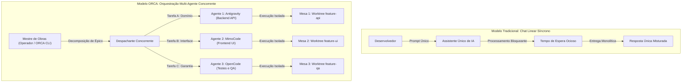

# Capítulo 1 — O Fim do Chat Linear: A Transição do Assistente Único para a Equipe de Agentes

## 1. Introdução

A evolução da engenharia de software assistida por inteligência artificial atingiu um ponto de inflexão decisivo [18]. Nos primeiros anos da revolução dos grandes modelos de linguagem (LLMs), a interação predominante baseava-se em interfaces conversacionais síncronas de turno único. Nesse paradigma, o desenvolvedor operava diante de uma janela de bate-papo linear, enviando prompts pontuais e aguardando passivamente que um único modelo gerasse blocos de código ou sugestões de refatoração [6]. Embora essa abordagem tenha inaugurado ganhos iniciais de produtividade individual, ela rapidamente esbarrou em limitações estruturais intrínsecas ao modelo síncrono.

Em projetos corporativos e arquiteturas distribuídas, a engenharia de software não é uma atividade sequencial simples; trata-se de um sistema complexo composto por investigação de requisitos, redação de código de domínio, criação de suítes de testes de regressão, análise de vulnerabilidades e documentação técnica [20]. Submeter todas essas responsabilidades a um único assistente conversacional gera três gargalos severos: o bloqueio de tempo do operador humano, a diluição de contexto em janelas de memória extensas e o risco iminente de corrupção do espaço de trabalho por sobreposição de tarefas não isoladas [4].

Para superar esses impedimentos, emerge a plataforma ORCA e a disciplina de orquestração multi-agente [17]. Ao substituir o assistente solitário por uma equipe de agentes autônomos e concorrentes operando em espaços de trabalho fisicamente isolados, a engenharia de software transita de um modelo artesanal para uma verdadeira fábrica autônoma. O objetivo deste capítulo é dissecar as raízes da ineficiência do chat linear e fundamentar os princípios teóricos e arquiteturais do desacoplamento cognitivo, demonstrando como a orquestração multi-agente estabelece as bases para um ganho de throughput de até 3x [4] em fluxos de desenvolvimento contínuo.

A passagem do modelo centrado no desenvolvedor que digita instruções contínuas para uma postura de liderança técnica orquestrada exige não apenas novas ferramentas, mas uma reformulação cognitiva do próprio processo de desenvolvimento [14]. Ao longo deste livro, desmistificaremos cada camada dessa arquitetura, fornecendo os fundamentos práticos e conceituais para que você domine a operação de múltiplos agentes sem comprometer a integridade de seu código.

Compreender essa transição é vital para qualquer equipe que deseja escalar sua capacidade de entrega sem aumentar linearmente a complexidade e a incidência de erros humanos [10]. A automação distribuída não visa substituir o julgamento do engenheiro, mas amplificá-lo, transferindo as etapas operacionais repetitivas para agentes especializados sob rigorosa supervisão arquitetural [12].

## 2. Explica

A ineficiência do chat conversacional tradicional decorre diretamente de sua natureza bloqueante e centralizada [6]. Quando um engenheiro solicita a um modelo único a refatoração de uma camada de persistência e a implementação de testes de carga, o canal de comunicação permanece cativo até a conclusão do processamento. Se durante esse período surgir a necessidade de investigar um bug urgente em outro subsistema, o operador humano se vê forçado a interromper o fluxo anterior ou abrir uma nova sessão desvinculada, perdendo a coesão do estado de execução [10].

Além do bloqueio temporal, o modelo linear padece de amnésia operacional e interferência cruzada [18]. À medida que a conversa se estende, instruções de sistema, esquemas de banco de dados e diretrizes de conformidade são progressivamente empurrados para as bordas da janela de contexto do modelo. Esse fenômeno de diluição cognitiva reduz drasticamente a capacidade de raciocínio lógico do modelo, induzindo alucinações sintáticas e a supressão involuntária de requisitos contratuais do projeto [14].

A arquitetura do ORCA propõe a metáfora da oficina mecânica sob o comando de um mestre de obras [20]. Em vez de exigir que um único artesão execute simultaneamente a desmontagem do motor, a pintura da lataria e o ajuste elétrico, a oficina distribui essas funções a especialistas independentes em bancadas dedicadas. No ecossistema ORCA, o operador humano (ou um meta-orquestrador algorítmico) atua como o mestre de obras, decompondo problemas complexos em unidades de trabalho delimitadas e despachando múltiplos agentes de IA — como Google Antigravity, MimoCode e OpenCode — para atuarem em paralelo sobre réplicas físicas do repositório [17].

O desacoplamento cognitivo obtido por esse modelo garante que cada agente mantenha foco estrito em um único objetivo tático [10]. Um agente encarregado de criar testes unitários para a API não compartilha a mesma janela de contexto com o agente que projeta o frontend web, eliminando a poluição de memória e maximizando a acurácia de cada subsistema. A concorrência deixa de ser uma promessa teórica e se torna uma realidade operacional viabilizada pelo isolamento estrutural do ORCA [4].

Outro fator determinante na orquestração de múltiplos agentes é a preservação da rastreabilidade [8]. Em uma conversa convencional, instruções de arquitetura misturam-se com saídas de depuração e rascunhos de documentação. Na oficina de agentes do ORCA, cada worktree armazena o histórico estrito de commits e comandos executados para sua respectiva entrega, permitindo auditorias minuciosas antes de qualquer integração ao branch principal do projeto.

A separação de papéis reduz a sobrecarga de raciocínio individual de cada instância de inteligência artificial [12]. Agentes com prompts de sistema altamente especializados cometem menos erros de julgamento e operam em ciclos curtos de feedback, entregando artefatos menores, coesos e empiricamente testáveis antes de solicitar nova intervenção do operador [7].

Adicionalmente, o modelo de equipe concorrente permite que falhas sejam contidas em seu ponto de origem [1]. Se um agente produzir uma implementação inadequada ou corromper um arquivo temporário em sua worktree isolada, o restante do sistema permanece imune. O custo de descarte de um branch experimental é quase nulo, incentivando a exploração de abordagens arquiteturais alternativas de forma simultânea [15].

Essa resiliência estrutural transforma o desenvolvimento de software em uma esteira de manufatura contínua, onde o desenvolvedor define especificações rigorosas e atua como o validador supremo das entregas produzidas pela equipe de agentes [19].

## 3. Ilustra

A compreensão do salto de eficiência exige contrastar o fluxo sequencial bloqueante com a arquitetura concorrente do ORCA. O diagrama a seguir ilustra a transição do gargalo síncrono para o paralelismo operacional desacoplado.



No modelo linear à esquerda, a capacidade do time fica restrita à velocidade de um único canal de comunicação. No modelo ORCA à direita, três frentes de desenvolvimento evoluem simultaneamente sem disputar o mesmo arquivo ou degradar a atenção do modelo [4]. Cada agente possui seu ciclo de vida gerenciado de forma independente pelo daemon central da plataforma.

## 4. Técnica

A operacionalização inicial do ecossistema ORCA requer a verificação do ambiente local e a inicialização do daemon de orquestração. O daemon atua como o servidor de estado em segundo plano, gerenciando processos de agentes, sessões de terminais virtuais e mapeamentos de repositórios [8].

O primeiro passo para o engenheiro consiste em inspecionar a saúde do runtime e conferir a versão instalada do binário executável no terminal.

```bash
# Verificação de integridade do runtime ORCA
orca --version

# Inspeção do status operacional do daemon local
orca status

# Inicialização do daemon de orquestração caso esteja inativo
orca daemon start --port 8080 --log-level info
```

Quando o daemon está em execução, a resposta estruturada do comando de status fornece métricas vitais sobre a infraestrutura, incluindo o número de repositórios rastreados, o total de worktrees ativas e as sessões de terminais registradas no catálogo [18].

```bash
# Exemplo de saída estruturada do comando orca status
# [ORCA] Daemon Runtime: ACTIVE (PID: 4128)
# [ORCA] Engine Version: v2.4.1
# [ORCA] Monitored Repositories: 3
# [ORCA] Active Worktrees: 0
# [ORCA] Allocated PTY Handles: 0
# [ORCA] Internal IPC Latency: 12ms
```

Para garantir que o ambiente de execução possua todas as ferramentas necessárias para hospedar múltiplos agentes em simultâneo, o operador pode executar uma rotina de diagnóstico automatizada via script Python, assegurando que Git, Python e os motores de agentes estejam acessíveis no PATH do sistema.

```python
#!/usr/bin/env python3
# -*- coding: utf-8 -*-
"""
Script de verificação de prontidão para orquestração multi-agente ORCA.
"""
import shutil
import subprocess
import sys

def checar_ferramenta(nome_binario):
    caminho = shutil.which(nome_binario)
    if caminho:
        print(f"[OK] Ferramenta '{nome_binario}' localizada em: {caminho}")
        return True
    else:
        print(f"[FALHA] Binário '{nome_binario}' não encontrado no PATH.")
        return False

def verificar_ambiente():
    print("=== Diagnóstico de Pré-Voo do Ambiente ORCA ===")
    ferramentas_essenciais = ["git", "orca", "python", "node", "gh"]
    motores_agentes = ["agy", "mimocode", "opencode"]
    
    sucesso_base = all(checar_ferramenta(f) for f in ferramentas_essenciais)
    sucesso_motores = any(checar_ferramenta(m) for m in motores_agentes)
    
    if not sucesso_base:
        print("\n[ERRO CRÍTICO] Ferramentas essenciais ausentes. Instale os pré-requisitos.")
        sys.exit(1)
        
    if not sucesso_motores:
        print("\n[ALERTA] Nenhum motor de agente de IA detectado no PATH.")
    else:
        print("\n[SUCESSO] Ambiente validado e pronto para despacho multi-agente.")

if __name__ == "__main__":
    verificar_ambiente()
```

Além da verificação de binários, é fundamental assegurar que as permissões de execução e os limites de descritores de arquivos do sistema operacional estejam adequadamente dimensionados para suportar múltiplos processos simultâneos sem travamento [8].

## 5. Aplica

A transição da interação conversacional linear para a orquestração multi-agente exige uma mudança profunda no design de processos da equipe técnica [20]. Contudo, a escalabilidade dessa abordagem possui limites claros que precisam ser compreendidos para evitar a degradação de desempenho e a saturação de recursos computacionais [4].

O principal gargalo na orquestração massiva de agentes de IA reside no consumo acumulado de memória RAM e no throughput de chamadas de API para os provedores de modelos [6]. Lançar simultaneamente dezenas de agentes executando compilações locais pesadas pode esgotar a capacidade da máquina hospedeira. O limite recomendado para ambientes de desenvolvimento convencionais é de 3 a 5 agentes atuando em paralelo [17].

A tabela a seguir apresenta a matriz de contorno para determinar quando adotar a orquestração concorrente e quando manter abordagens simplificadas:

| Cenário Operacional | Abordagem Recomendada | Justificativa e Condição de Contorno |
| :--- | :--- | :--- |
| Investigação pontual de sintaxe | Chat Linear / Prompt Único | O overhead de criar worktrees e sessões dedicadas não se justifica para tarefas curtas. |
| Implementação de Épico com 3 frentes | Orquestração Multi-Agente ORCA | Separação física de responsabilidades, ganho real de tempo e zero interferência de contexto [4]. |
| Manutenção em arquivo de lock único | Execução Sequencial Monotarefa | Evite paralelismo concorrente ao editar manifests centrais de dependência compartilhada. |
| Refatoração arquitetural em larga escala | Orquestração com Worktrees Pai/Filha | Permite auditoria granular e isolamento contra regressões destrutivas [18]. |

Cuidado especial deve ser tomado com o mecanismo de fallback: se a conexão com um provedor de LLM falhar ou o daemon do ORCA for interrompido abruptamente, o operador deve estar apto a inspecionar os branches do Git manualmente e consolidar os commits pendentes sem perder o trabalho parcial dos agentes [10]. Evite delegar decisões arquiteturais irreversíveis sem um gate de revisão humana explícito. Quando o projeto envolver arquivos com alto acoplamento conceitual, o uso de múltiplos agentes paralelos não é recomendado sem uma definição rígida de interfaces de comunicação prévia.

Outro ponto de atenção refere-se ao limite de quota de requisições por minuto impostos pelas plataformas de inteligência artificial [19]. Ao rodar múltiplos agentes em paralelo, o consumo de tokens dispara de forma agregada. Recomenda-se configurar limites de taxa no daemon do ORCA ou distribuir as chaves de API entre diferentes provedores para evitar bloqueios de execução durante tarefas críticas.

### Exercício
- [ ] Mapear as tarefas da sprint e separar em papéis especializados (pesquisa, código, auditoria)
- [ ] Identificar os pontos de saturação de contexto no fluxo de chat atual da equipe
- [ ] Definir contratos explícitos de entrada e saída de artefatos para cada etapa
- [ ] Configurar um checklist de pré-requisitos com as ferramentas CLI essenciais

## 6. Fixa

### Exercício Prático 1: Decomposição de Fluxo Monolítico em Papéis Agênticos

1. Identifique em seu projeto atual um fluxo de desenvolvimento que costuma ser executado em uma única sessão de chat (por exemplo, especificação, implementação e testes de um endpoint).
2. Escreva uma matriz de responsabilidades dividindo o fluxo em três papéis especializados: Pesquisador/Arquiteto, Desenvolvedor Operário e Revisor/Auditor.
3. Para cada papel, defina o contrato de entrada (quais arquivos consome) e o contrato de saída (quais arquivos produz ou modifica).
4. Simule a transição de artefatos entre os papéis, verificando que nenhum papel requer o histórico completo da conversa dos demais para cumprir sua tarefa.

### Exercício Prático 2: Cálculo de Headroom e Janela de Contexto

1. Meça a contagem de tokens de um prompt monolítico típico de sua equipe contendo código, regras e histórico de mensagens.
2. Calcule a economia percentual de tokens ao isolar o prompt do desenvolvedor apenas nos arquivos relevantes ao diff.
3. Documente o limiar de degradação cognitiva observado quando o contexto ultrapassa 40% da capacidade máxima do modelo.

## 7. Conclusão

O abandono do chat linear em favor da orquestração multi-agente não é apenas uma melhoria incremental de conveniência; é uma reestruturação fundamental do modo como humanos e sistemas autônomos cooperam no ciclo de vida do software [14]. Ao transformar o desenvolvedor de um digitador de prompts em um mestre de obras que delega, monitora e audita tarefas especializadas, o ORCA estabelece um novo padrão de produtividade e segurança técnica [20].

Ao longo deste capítulo, exploramos como o desacoplamento cognitivo mitiga a perda de contexto e a diluição de memória que tanto assolam os assistentes tradicionais [18]. Demonstramos também a importância da infraestrutura local gerenciada pelo daemon do ORCA como o alicerce estável para a execução paralela [8]. Nos próximos capítulos, aprofundaremos a arquitetura interna dessa plataforma, compreendendo como o catálogo de repositórios e o isolamento físico de worktrees tornam essa visão viável na prática da engenharia moderna.

A jornada que se inicia aqui levará você do entendimento dos conceitos elementares até a capacidade de operar pipelines completamente autônomos de alta densidade e confiabilidade matemática [12].

## 8. Referências

[1] ARVIND, Ananya; NARAYANAN, Shruthi; NARAYANAN, Saishriya. Sura.ai: Multi-Agent Infrastructure Recovery with LLM-Powered Autonomous Remediation. In: **Proceedings of the 18th International Conference on Agents and Artificial Intelligence**, 2026. Disponível em: <https://doi.org/10.5220/0014456800004052>. Acesso em: 31 ago. 2026.

[4] GENG, Jiayi; NEUBIG, Graham. Effective Strategies for Asynchronous Software Engineering Agents. In: **arXiv (Cornell University)**, 2026. Disponível em: <https://arxiv.org/abs/2603.21489>. Acesso em: 31 ago. 2026.

[6] HÄNDLER, Thorsten. A Taxonomy for Autonomous LLM-Powered Multi-Agent Architectures. In: **Proceedings of the 15th International Joint Conference on Knowledge Discovery, Knowledge Engineering and Knowledge Management**, p. 120-131, 2023. Disponível em: <https://doi.org/10.5220/0012239100003598>. Acesso em: 31 ago. 2026.

[7] ISHIBASHI, Yoichi; YANO, Taro; OYAMADA, Masafumi. Effective Harness Engineering for Algorithm Discovery with Coding Agents. In: **arXiv (Cornell University)**, 2026. Disponível em: <https://arxiv.org/abs/2605.15221>. Acesso em: 31 ago. 2026.

[8] ISSARNY, Valérie; SARIDAKIS, Titos. Defining Open Software Architectures for Customized Remote Execution of Web Agents. In: **Autonomous Agents and Multi-Agent Systems**, v. 2, p. 111-134, 1999. Disponível em: <https://doi.org/10.1023/a:1010008305297>. Acesso em: 31 ago. 2026.

[10] LIU, Mengyang et al. Multi-agent Collaboration with State Management. In: **arXiv (Cornell University)**, 2026. Disponível em: <https://arxiv.org/abs/2605.20563>. Acesso em: 31 ago. 2026.

[12] PHILIPPOV, Vassili et al. Glite ARF: Verifier-Driven Research with Parallel LLM Coding Agents. In: **arXiv (Cornell University)**, 2026. Disponível em: <https://arxiv.org/abs/2606.27416>. Acesso em: 31 ago. 2026.

[14] PYNADATH, David V.; TAMBE, Milind. An Automated Teamwork Infrastructure for Heterogeneous Software Agents and Humans. In: **Autonomous Agents and Multi-Agent Systems**, v. 7, p. 35-58, 2003. Disponível em: <https://doi.org/10.1023/a:1024176820874>. Acesso em: 31 ago. 2026.

[15] QU, Ao et al. CORAL: Towards Autonomous Multi-Agent Evolution for Open-Ended Discovery. In: **arXiv (Cornell University)**, 2026. Disponível em: <https://arxiv.org/abs/2604.01658>. Acesso em: 31 ago. 2026.

[17] SHUKLA, Akshat; RAJPUT, Priyanshu. Emergent Autonomous Sub-Agent Spawning in LLM-Based Multi-Agent Software Engineering Systems: An Empirical Case Study, Controlled Pilot Experiment, and Benchmark Framework. In: **International Journal of Research and Scientific Innovation**, v. 13, n. 3, p. 12-25, 2026. Disponível em: <https://doi.org/10.51244/ijrsi.2026.1303000020>. Acesso em: 31 ago. 2026.

[18] TAWOSI, Vali et al. ALMAS: an Autonomous LLM-based Multi-Agent Software Engineering Framework. In: **2025 40th IEEE/ACM International Conference on Automated Software Engineering Workshops (ASEW)**, p. 38-44, 2025. Disponível em: <https://doi.org/10.1109/asew67777.2025.00059>. Acesso em: 31 ago. 2026.

[19] URSEKAR, Varun et al. VeRO: A Harness for Agents to Optimize Agents. In: **arXiv (Cornell University)**, 2026. Disponível em: <https://arxiv.org/abs/2602.22480>. Acesso em: 31 ago. 2026.

[20] ZAMBONELLI, Franco; OMICINI, Andrea. Challenges and Research Directions in Agent-Oriented Software Engineering. In: **Autonomous Agents and Multi-Agent Systems**, v. 9, p. 253-286, 2004. Disponível em: <https://doi.org/10.1023/b:agnt.0000038028.66672.1e>. Acesso em: 31 ago. 2026.
