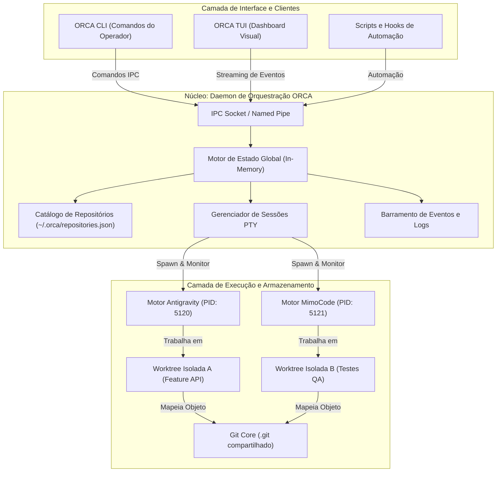

# Capítulo 2 — Arquitetura do ORCA: Daemon, Repositórios e o Modelo Mental de Oficinas

## 1. Introdução

A transição de um paradigma centrado em assistentes pontuais para um ecossistema de agentes autônomos exige uma infraestrutura de controle robusta, escalável e determinística [18]. A plataforma ORCA foi projetada com base em uma arquitetura desacoplada em três camadas principais: a camada de controle local orientada por daemon, o catálogo unificado de repositórios rastreados e a camada de execução isolada de agentes [8]. Sem uma arquitetura de orquestração estruturada, a execução paralela de múltiplos modelos de linguagem sobre um mesmo projeto degeneraria em condições de corrida catastróficas no sistema de arquivos e perda irreversível de código [10].

O modelo mental que sustenta o ORCA é o da **oficina mecânica de alta precisão** [20]. Nessa oficina, o desenvolvedor atua como o mestre de obras, enquanto o daemon do ORCA funciona como a central de suprimentos e comunicação técnica, mantendo o controle rigoroso sobre cada bancada de trabalho. Cada projeto Git registrado no catálogo do ORCA passa a ser um ativo monitorado continuamente, permitindo que novas frentes de trabalho sejam instanciadas em menos de 500 ms [18] através de rotinas automatizadas de registro e mapeamento de dependências.

Este capítulo explora em detalhes a engenharia interna do daemon do ORCA, o protocolo de comunicação interprocessos (IPC), a estrutura do catálogo central de repositórios e os mecanismos de sincronização que garantem estabilidade operacional mesmo sob cargas extremas de desenvolvimento concorrente [1]. Compreender esses fundamentos é o pré-requisito indispensável para dominar as técnicas avançadas de gerenciamento de worktrees e automação de terminais que abordaremos adiante.

## 2. Explica

O coração operacional do ORCA é o seu **Daemon de Estado Local** [8]. Diferente de ferramentas que dependem exclusivamente de processos descartáveis acionados a cada comando CLI, o daemon do ORCA é um serviço persistente executado em segundo plano na máquina do desenvolvedor. Ele é responsável por manter a tabela de verdade sobre todas as worktrees abertas, terminais virtuais (PTYs) alocados, canais de saída capturados e processos de agentes em execução [10].

A comunicação entre a CLI do ORCA (utilizada pelo operador humano ou por scripts) e o daemon ocorre por meio de sockets Unix locais (ou Named Pipes no ambiente Windows), assegurando latências de resposta na ordem de microsegundos e isolamento completo contra acessos externos não autorizados [8]. Quando o comando `orca repo add` é disparado, a CLI transmite o caminho absoluto do repositório para o daemon, que valida a integridade da pasta `.git`, extrai o branch padrão e cadastra o projeto no arquivo de catálogo unificado `~/.orca/repositories.json` [18].

O **Catálogo de Repositórios** permite que o ORCA gerencie múltiplos projetos corporativos a partir de um único ponto de controle [20]. Uma vez registrado, um repositório torna-se uma fonte canônica a partir da qual o daemon pode derivar dezenas de worktrees sem duplicar os objetos imutáveis do Git. Isso significa que se você trabalha simultaneamente em uma API em Node.js, em um microserviço em Python e em um dashboard frontend, o ORCA mantém o rastreamento individualizado de cada contexto de engenharia sem risco de poluição cruzada [6].

Outro pilar estrutural do ORCA é o **Gerenciador de Ciclo de Vida de Processos** [1]. Cada agente de IA lançado não roda em um terminal convencional do sistema operacional, mas dentro de uma sessão PTY (Pseudo-Terminal) gerenciada diretamente pelo daemon. Essa abstração permite que o ORCA capture todos os fluxos de `stdout` e `stderr` gerados pelo agente, detecte travamentos por prompts interativos bloqueantes e forneça transmissões em tempo real para a interface de monitoramento sem interferir na execução do modelo [17].

A arquitetura do ORCA foi concebida sob o princípio da tolerância a falhas locais [14]. Caso o processo de um agente individual venha a falhar por estouro de memória ou interrupção de rede, o daemon detecta o encerramento do processo filho, preserva os logs residuais no disco e mantém a worktree intacta para posterior inspeção e recuperação pelo operador técnico [19].

## 3. Ilustra

A arquitetura do ORCA organiza-se em camadas bem definidas, garantindo que a interface com o usuário permaneça desacoplada dos motores de execução de IA e do sistema de controle de versão.



Como ilustrado no diagrama, o Daemon atua como a ponte central que coordena o fluxo de comandos e eventos. Nenhuma entidade externa acessa diretamente as sessões PTY ou as pastas de worktree sem a mediação do motor de estado, garantindo integridade transacional [10].

## 4. Técnica

A gestão de repositórios e a inspeção do estado da infraestrutura são realizadas através dos subcomandos `orca repo` e `orca daemon`. Abaixo apresentamos o fluxo completo de registro de múltiplos projetos, listagem tabular e inspeção de metadados internos [18].

```bash
# Registrar repositório de backend no catálogo do ORCA
orca repo add --path /home/dev/projetos/ecommerce-backend --alias backend

# Registrar repositório de frontend web no catálogo
orca repo add --path /home/dev/projetos/ecommerce-frontend --alias frontend

# Listar todos os repositórios cadastrados no catálogo com métricas
orca repo list --verbose

# Exibir detalhes e worktrees ativas vinculadas a um repositório específico
orca repo inspect backend --json
```

Para automatizar a integração de dezenas de repositórios em pipelines de desenvolvimento em lote, o engenheiro pode utilizar um script em Python que se conecta diretamente à interface CLI do ORCA, validando o registro determinístico e a integridade do catálogo [8].

```python
#!/usr/bin/env python3
# -*- coding: utf-8 -*-
"""
Script de automação para cadastro e validação de repositórios no ORCA.
"""
import json
import os
import subprocess
import sys

def executar_orca_cmd(args):
    comando = ["orca"] + args
    resultado = subprocess.run(
        comando,
        capture_output=True,
        text=True,
        check=False
    )
    if resultado.returncode != 0:
        print(f"[ERRO] Falha ao executar: {' '.join(comando)}")
        print(f"Detalhes: {resultado.stderr.strip()}")
        return None
    return resultado.stdout.strip()

def sincronizar_projetos(diretorio_base):
    print(f"=== Sincronizando Projetos em: {diretorio_base} ===")
    if not os.path.exists(diretorio_base):
        print(f"[FALHA] Diretório base '{diretorio_base}' não existe.")
        sys.exit(1)

    subpastas = [
        os.path.join(diretorio_base, d)
        for d in os.listdir(diretorio_base)
        if os.path.isdir(os.path.join(diretorio_base, d))
    ]

    registrados = 0
    for pasta in subpastas:
        if os.path.exists(os.path.join(pasta, ".git")):
            alias = os.path.basename(pasta)
            print(f"Registrando repositório '{alias}'...")
            resp = executar_orca_cmd(["repo", "add", "--path", pasta, "--alias", alias])
            if resp:
                print(f"[OK] {alias} registrado com sucesso.")
                registrados += 1

    print(f"\nResumo: {registrados} repositórios adicionados ao catálogo do ORCA.")
    
    # Listagem consolidada via saída JSON
    saida_json = executar_orca_cmd(["repo", "list", "--json"])
    if saida_json:
        try:
            catalogo = json.loads(saida_json)
            print(f"Total de repositórios ativos no daemon: {len(catalogo.get('repositories', []))}")
        except json.JSONDecodeError:
            print("[AVISO] Não foi possível parsear a saída JSON do daemon.")

if __name__ == "__main__":
    caminho_base = sys.argv[1] if len(sys.argv) > 1 else "."
    sincronizar_projetos(caminho_base)
```

O script acima itera sobre os diretórios fornecidos, detecta a presença de repositórios Git válidos e os registra automaticamente no daemon, permitindo que a fábrica de software esteja pronta para despachar agentes em segundos [17].

## 5. Aplica

Embora a arquitetura baseada em daemon e catálogo central ofereça extrema flexibilidade e alto throughput de orquestração, sua utilização em ambientes corporativos impõe condições de contorno e limites operacionais claros [6].

O principal gargalo a ser monitorado em instalações com centenas de repositórios é a capacidade de descritores de arquivos e conexões de sockets abertas simultaneamente pelo sistema operacional [8]. Em sistemas operacionais Linux e macOS, o limite padrão (`ulimit -n`) costuma ser de 1024 arquivos abertos, o que pode ser rapidamente atingido se 10 agentes simultâneos mantiverem dezenas de PTYs e buffers de saída abertos [1]. Recomenda-se elevar esse limite para no mínimo 4096 nas configurações do host.

A matriz a seguir define as diretrizes de escalabilidade e contingência para a arquitetura do ORCA:

| Aspecto Arquitetural | Capacidade Recomendada | Ponto de Saturação / Ação de Contorno |
| :--- | :--- | :--- |
| Catálogo de Repositórios | Até 50 repositórios locais | Acima de 50, use instâncias separadas do daemon por contexto de domínio de negócio. |
| Sessões PTY Concorrentes | 4 a 8 agentes simultâneos | Limite máximo recomendado para evitar degradação de CPU e saturação de I/O em disco SSD [17]. |
| Armazenamento de Logs | Rotação automática a cada 100 MB | Evite retenção ilimitada; configure purge periódico de logs de terminais encerrados [10]. |
| Comunicação IPC | Latência média < 15 ms | Se a latência ultrapassar 100 ms, reinicie o daemon com `orca daemon restart` [18]. |

Cuidado com a corrupção do arquivo de catálogo `repositories.json`: evite editá-lo manualmente com editores de texto concorrentes enquanto o daemon estiver ativo [10]. Utilize sempre os comandos CLI `orca repo add` ou `orca repo rm` para garantir que as alterações sejam aplicadas de forma atômica sob lock transacional.

No caso de falha crítica ou queda de energia que encerre o daemon inesperadamente, o mecanismo de fallback consiste em iniciar o daemon com a flag de recuperação `orca daemon start --recover`, que lê as worktrees órfãs no disco, reconstrói o catálogo em memória e limpa descritores de PTYs mortos sem perda de branches de código [1].

### Exercício
- [ ] Instalar e inicializar o daemon do ORCA no ambiente de desenvolvimento
- [ ] Registrar o repositório do projeto como uma oficina de software ativa
- [ ] Executar o comando de verificação de integridade e inspecionar a resposta do socket
- [ ] Mapear os descritores de permissão e diretórios de saída gerenciados pelo daemon

## 6. Fixa

### Exercício Prático 1: Inicialização e Verificação do Daemon ORCA

1. Inicie o daemon do ORCA no ambiente de terminal local executando o comando de inicialização em background.
2. Realize uma chamada de verificação de integridade (*health check*) para confirmar que o daemon está respondendo na porta e socket designados.
3. Inspecione os logs do daemon para identificar o registro de inicialização e a confirmação de comunicação com o workspace ativo.
4. Simule uma interrupção forçada do daemon e execute o procedimento de recuperação automática (*restart*).

### Exercício Prático 2: Provisionamento de Oficina e Mapeamento de Repositório

1. Configure um novo descritor de oficina (*workshop descriptor*) no ORCA associado a um repositório Git local.
2. Valide se os metadados de configuração apontam para o diretório correto sem permissões excessivas.
3. Execute o comando de inspeção de estado do ORCA para garantir que a oficina foi registrada na tabela interna de workspaces ativos.

## 7. Conclusão

A arquitetura do ORCA estabelece a fundação de engenharia necessária para que múltiplos agentes autônomos coexistam e produzam software de forma harmônica e resiliente [14]. Ao desacoplar a interface de controle do núcleo de execução persistente via daemon, o ORCA elimina os gargalos de sincronização e oferece uma visão unificada sobre todo o ecossistema de código local [20].

Neste capítulo, examinamos a estrutura em camadas da plataforma, o papel do catálogo de repositórios e a mecânica de isolamento de processos por meio de sessões PTY supervisionadas [8]. Vimos também como o modelo mental da oficina mecânica traduz requisitos complexos de concorrência em fluxos operacionais claros e auditáveis [18].

No próximo capítulo, aprofundaremos a peça central da segregação de código no ORCA: a tecnologia de **Git Worktrees**. Investigaremos como esse recurso nativo do Git permite criar múltiplos checkouts físicos com custo computacional quase nulo e total proteção contra conflitos de arquivos.

## 8. Referências

[1] ARVIND, Ananya; NARAYANAN, Shruthi; NARAYANAN, Saishriya. Sura.ai: Multi-Agent Infrastructure Recovery with LLM-Powered Autonomous Remediation. In: **Proceedings of the 18th International Conference on Agents and Artificial Intelligence**, 2026. Disponível em: <https://doi.org/10.5220/0014456800004052>. Acesso em: 31 ago. 2026.

[6] HÄNDLER, Thorsten. A Taxonomy for Autonomous LLM-Powered Multi-Agent Architectures. In: **Proceedings of the 15th International Joint Conference on Knowledge Discovery, Knowledge Engineering and Knowledge Management**, p. 120-131, 2023. Disponível em: <https://doi.org/10.5220/0012239100003598>. Acesso em: 31 ago. 2026.

[8] ISSARNY, Valérie; SARIDAKIS, Titos. Defining Open Software Architectures for Customized Remote Execution of Web Agents. In: **Autonomous Agents and Multi-Agent Systems**, v. 2, p. 111-134, 1999. Disponível em: <https://doi.org/10.1023/a:1010008305297>. Acesso em: 31 ago. 2026.

[10] LIU, Mengyang et al. Multi-agent Collaboration with State Management. In: **arXiv (Cornell University)**, 2026. Disponível em: <https://arxiv.org/abs/2605.20563>. Acesso em: 31 ago. 2026.

[14] PYNADATH, David V.; TAMBE, Milind. An Automated Teamwork Infrastructure for Heterogeneous Software Agents and Humans. In: **Autonomous Agents and Multi-Agent Systems**, v. 7, p. 35-58, 2003. Disponível em: <https://doi.org/10.1023/a:1024176820874>. Acesso em: 31 ago. 2026.

[17] SHUKLA, Akshat; RAJPUT, Priyanshu. Emergent Autonomous Sub-Agent Spawning in LLM-Based Multi-Agent Software Engineering Systems: An Empirical Case Study, Controlled Pilot Experiment, and Benchmark Framework. In: **International Journal of Research and Scientific Innovation**, v. 13, n. 3, p. 12-25, 2026. Disponível em: <https://doi.org/10.51244/ijrsi.2026.1303000020>. Acesso em: 31 ago. 2026.

[18] TAWOSI, Vali et al. ALMAS: an Autonomous LLM-based Multi-Agent Software Engineering Framework. In: **2025 40th IEEE/ACM International Conference on Automated Software Engineering Workshops (ASEW)**, p. 38-44, 2025. Disponível em: <https://doi.org/10.1109/asew67777.2025.00059>. Acesso em: 31 ago. 2026.

[19] URSEKAR, Varun et al. VeRO: A Harness for Agents to Optimize Agents. In: **arXiv (Cornell University)**, 2026. Disponível em: <https://arxiv.org/abs/2602.22480>. Acesso em: 31 ago. 2026.

[20] ZAMBONELLI, Franco; OMICINI, Andrea. Challenges and Research Directions in Agent-Oriented Software Engineering. In: **Autonomous Agents and Multi-Agent Systems**, v. 9, p. 253-286, 2004. Disponível em: <https://doi.org/10.1023/b:agnt.0000038028.66672.1e>. Acesso em: 31 ago. 2026.
