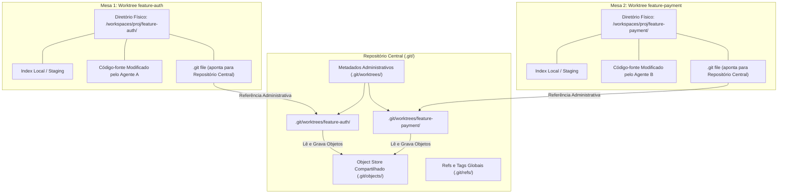

# Capítulo 3 — A Mágica das Worktrees Git: Isolamento de Espaço de Trabalho e Branches Paralelos

## 1. Introdução

O desenvolvimento de software moderno fundamenta-se no controle de versão distribuído [11]. No entanto, a forma tradicional com que os desenvolvedores utilizam o Git — operando em um único diretório de trabalho onde branches são alternados sequencialmente através de comandos como `git checkout` ou `git switch` — impõe uma barreira intransponível para a execução de agentes autônomos concorrentes [20]. Quando múltiplos agentes tentam editar código em um único diretório compartilhado, ocorrem condições de corrida destrutivas, arquivos intermediários não commitados são corrompidos e o estado do workspace torna-se imprevisível [4].

A solução arquitetural definitiva para esse problema é a utilização nativa de **Git Worktrees** [11]. Uma worktree permite vincular múltiplos diretórios de trabalho físicos independentes a um único repositório Git central. Cada worktree possui seu próprio branch de trabalho, seu próprio índice de staging e seus próprios arquivos físicos no sistema de arquivos, enquanto compartilham a mesma base de dados de objetos imutáveis da pasta `.git` principal [14].

Com o ORCA, a criação e a gestão dessas mesas de trabalho isoladas são totalmente mecanizadas [18]. O desenvolvedor ou o despachante de tarefas pode instanciar uma nova worktree isolada em apenas 2 s [11], alocando imediatamente um branch exclusivo e preparando o terreno para que um agente de inteligência artificial inicie a implementação de um novo recurso sem qualquer interferência com os demais processos em andamento.

Neste capítulo, exploraremos a mecânica interna das worktrees do Git, a anatomia das referências administrativas em `.git/worktrees/`, o ciclo de vida de criação e descarte de workspaces com o comando `orca worktree` e as garantias matemáticas de isolamento que viabilizam o verdadeiro paralelismo na engenharia de software [11].

## 2. Explica

Para entender o poder das worktrees, é necessário revisitar a arquitetura interna do Git [11]. Tradicionalmente, um repositório Git é composto por duas partes fundamentais: o **Object Store** (o banco de dados de commits, árvores e blobs localizado dentro de `.git/objects/`) e o **Working Tree** (a pasta onde os arquivos do projeto são extraídos e modificados pelo usuário) [4].

No modelo convencional de checkout único, existe exatamente uma working tree associada ao repositório. Quando você troca de branch, o Git apaga do disco os arquivos da versão anterior e grava os arquivos da nova versão. Se um agente de IA estiver escrevendo um arquivo no exato instante em que outro processo solicita a troca de branch, o resultado é a corrupção catastrófica de arquivos e a interrupção do runtime [20].

O comando `git worktree add` quebra esse acoplamento unívoco [11]. Ele permite instanciar diretórios de trabalho adicionais em caminhos arbitrários do disco, cada um apontando para um branch distinto, sem duplicar o histórico de commits ou os pacotes de dados compactados do Git. No interior da pasta `.git/worktrees/<nome>/`, o Git cria apenas os ponteiros essenciais: o arquivo `HEAD` específico daquela worktree, o arquivo `index` de staging e o arquivo `gitdir` que mapeia o caminho reverso [14].

O ORCA encapsula essa complexidade sob o comando `orca worktree create` [18]. Ao disparar essa instrução, o daemon do ORCA executa uma sequência orquestrada:
1. Valida se o branch solicitado já existe ou cria um novo branch a partir do commit base especificado [10].
2. Cria a pasta física no diretório gerenciado de workspaces (por padrão em `workspaces/<projeto>/<branch>`).
3. Invoca o comando Git com as flags apropriadas de isolamento e bloqueio de índice [11].
4. Registra os metadados da nova worktree no catálogo em memória do daemon, disponibilizando-a imediatamente para alocação de terminais e despacho de agentes [17].

Esse mecanismo assegura que cada agente atue em sua própria mesa de trabalho física [20]. Se o Agente 1 estiver realizando testes destrutivos ou instalando dependências instáveis em sua worktree, o Agente 2 — trabalhando em outra worktree a poucos milímetros de distância lógica — permanece em um ambiente imaculado e estável [18].

A eficiência de armazenamento é outro diferencial notável [11]. Como todas as worktrees compartilham os mesmos objetos de commits e blobs na pasta `.git` principal, criar dez worktrees para dez agentes paralelos consome apenas o espaço em disco dos arquivos de texto do código-fonte e das dependências locais, sem replicar os gigabytes de histórico do repositório [4].

## 3. Ilustra

A estrutura interna de um repositório orquestrado com Git Worktrees evidencia o compartilhamento seguro do banco de dados central entre múltiplas áreas de trabalho físicas.



Como visualizado acima, cada worktree possui seu arquivo `.git` próprio que atua como um link simbólico estruturado apontando de volta para a pasta de metadados correspondente no repositório central. Esse desacoplamento físico garante zero conflito de escrita em tempo real [11].

## 4. Técnica

A criação, listagem e remoção de worktrees com a CLI do ORCA é simples, expressiva e totalmente integrada com o Git subjacente [18]. A seguir demonstramos os comandos primários de gerenciamento de workspaces isolados.

```bash
# Criar uma nova worktree baseada na branch 'main' para implementar autenticação JWT
orca worktree create   --repo backend   --branch feature/auth-jwt   --base main   --parent-worktree main

# Criar uma segunda worktree para desenvolver a suíte de testes de integração
orca worktree create   --repo backend   --branch test/integration-suite   --base main   --parent-worktree main

# Listar todas as worktrees registradas com seus respectivos caminhos e branches
orca worktree list --repo backend

# Inspecionar detalhes de integridade e locks ativos em uma worktree
orca worktree inspect --repo backend --branch feature/auth-jwt
```

Para garantir que operações manuais e scripts de esteira não deixem referências quebradas no Git após o término do trabalho dos agentes, o operador pode executar comandos de limpeza e reconciliação estrutural [11].

```bash
# Remover com segurança uma worktree após a conclusão e mesclagem da tarefa
orca worktree rm --repo backend --branch feature/auth-jwt --force

# Executar a poda de referências administrativas órfãs no Git
git -C /home/dev/projetos/ecommerce-backend worktree prune --verbose
```

Abaixo apresentamos um script em Python que automatiza o ciclo completo de provisionamento seguro de worktree com validação de status limpo e inicialização de branch [18].

```python
#!/usr/bin/env python3
# -*- coding: utf-8 -*-
"""
Script utilitário para provisionamento determinístico de Git Worktrees via ORCA.
"""
import json
import subprocess
import sys

def criar_worktree_segura(repo_alias, nome_branch, base_ref="main"):
    print(f"=== Provisionando Worktree Isolada ===")
    print(f"Repositório: {repo_alias} | Novo Branch: {nome_branch} | Base: {base_ref}")

    # Comando de criação via ORCA CLI
    cmd = [
        "orca", "worktree", "create",
        "--repo", repo_alias,
        "--branch", nome_branch,
        "--base", base_ref,
        "--json"
    ]

    resultado = subprocess.run(cmd, capture_output=True, text=True, check=False)
    if resultado.returncode != 0:
        print(f"[ERRO] Falha ao criar worktree: {resultado.stderr.strip()}")
        return None

    try:
        dados = json.loads(resultado.stdout)
        caminho_worktree = dados.get("path")
        print(f"[SUCESSO] Worktree criada em: {caminho_worktree}")
        print(f"Status do Lock: {dados.get('locked', False)}")
        return caminho_worktree
    except json.JSONDecodeError:
        print(f"[OK] Worktree provisionada com sucesso (saída textual).")
        return True

if __name__ == "__main__":
    if len(sys.argv) < 3:
        print("Uso: python provisionar_worktree.py <alias_repo> <nome_branch> [base_ref]")
        sys.exit(1)

    repo = sys.argv[1]
    branch = sys.argv[2]
    base = sys.argv[3] if len(sys.argv) > 3 else "main"
    criar_worktree_segura(repo, branch, base)
```

## 5. Aplica

O isolamento proporcionado pelas Git Worktrees é a base que permite aos agentes de IA operarem com total liberdade criativa e técnica [14]. Não obstante, a gestão em escala desse modelo exige atenção a aspectos de infraestrutura e governança de dados locais [11].

O principal gargalo associado à proliferação massiva de worktrees é o consumo de espaço em disco decorrente de diretórios de dependências não versionadas (como pastas `node_modules/`, ambientes virtuais `.venv/` ou caches de compilação `target/`) [20]. Embora o código-fonte em si consuma poucos megabytes, a instalação de pacotes em 10 worktrees simultâneas pode rapidamente consumir dezenas de gigabytes de armazenamento SSD. Recomenda-se utilizar gerenciadores de pacotes com suporte a cache global baseado em hardlinks, como `pnpm` para Node.js ou `uv` para Python [18].

A matriz a seguir orienta as decisões de arquitetura e contingência no uso de worktrees:

| Dimensão Operacional | Recomendação de Projeto | Condição de Limite e Advertência |
| :--- | :--- | :--- |
| Quantidade Simultânea | 3 a 6 worktrees ativas por repositório | Acima de 10 worktrees, o overhead de I/O de disco pode degradar a performance de compilação [11]. |
| Branches Bloqueados | 1 branch exclusivo por worktree | O Git proíbe rigorosamente o checkout do mesmo branch em duas worktrees simultâneas [4]. |
| Limpeza Pós-Tarefa | Remoção imediata pós-merge (`orca worktree rm`) | Evite acumular worktrees inativas para não inflar a tabela de metadados em `.git/worktrees/` [18]. |
| Conexão de Arquivos .env | Cópia segura ou symlink de segredos | Cuidado ao compartilhar arquivos de ambiente com senhas reais; utilize credenciais de teste [1]. |

Cuidado com a tentativa de deletar pastas de worktree diretamente pelo gerenciador de arquivos do sistema operacional sem utilizar `orca worktree rm` ou `git worktree remove` [11]. A deleção manual deixa metadados administrativos pendentes dentro de `.git/worktrees/`, o que impede o checkout posterior do mesmo branch até que o comando `git worktree prune` seja executado manualmente como fallback.

Quando o projeto não permitir a criação de worktrees (como em sistemas de arquivos compartilhados via rede NFS legados que não suportam links estruturados), a orquestração concorrente deve ser descontinuada em favor de instâncias totalmente clonadas em repositórios temporários independentes [8].

### Exercício
- [ ] Criar uma nova worktree isolada apontando para um branch de funcionalidade específico
- [ ] Verificar a independência do índice e arquivos modificados em relação à árvore principal
- [ ] Executar testes automatizados simultaneamente em duas worktrees distintas
- [ ] Limpar branches concluídos e podar referências órfãs com `git worktree prune`

## 6. Fixa

### Exercício Prático 1: Criação e Validação de Worktree Git Isolada

1. Crie uma nova branch de funcionalidade a partir da branch principal (`git branch feat/agente-auth`).
2. Adicione uma worktree isolada apontando para a branch criada (`git worktree add ../worktrees/agente-auth feat/agente-auth`).
3. Navegue até o diretório da worktree e verifique com `git status` que o ambiente está limpo e independente da árvore de trabalho principal.
4. Crie um arquivo de teste dentro da worktree, confirme o commit local e verifique que a árvore principal não sofreu nenhuma alteração.

### Exercício Prático 2: Limpeza e Manutenção de Worktrees Órfãs

1. Remova manualmente o diretório da worktree de teste criada anteriormente sem usar comandos do Git.
2. Execute `git worktree list` e observe a sinalização de worktree pendente ou inconsistente.
3. Execute o comando `git worktree prune` para purgar os metadados órfãos do diretório `.git/worktrees/`.
4. Confirme que `git worktree list` agora exibe unicamente as worktrees ativas e válidas.

## 7. Conclusão

As Git Worktrees constituem o mecanismo fundacional que torna possível a engenharia de software multi-agente [11]. Ao fornecer espaços de trabalho fisicamente desacoplados com acesso concorrente ao mesmo banco de dados de versionamento, elas eliminam as condições de corrida e garantem que cada agente de IA produza suas alterações com isolamento estrito e segurança matemática [20].

Ao longo deste capítulo, compreendemos a anatomia interna do repositório Git sob o prisma das worktrees, os comandos de gerenciamento automatizado do ORCA e as estratégias para manter o disco limpo e performático [18]. Demonstramos como o tempo de criação de um workspace cai para meros segundos, viabilizando ciclos ágeis de experimentação e refatoração [4].

No próximo capítulo, elevaremos a organização desse ecossistema para a camada visual da interface, explorando a **Hierarquia Visual de Tarefas** e a estruturação de mesas de trabalho organizadas sob a relação conceitual de mesas pai e mesas filhas.

## 8. Referências

[1] ARVIND, Ananya; NARAYANAN, Shruthi; NARAYANAN, Saishriya. Sura.ai: Multi-Agent Infrastructure Recovery with LLM-Powered Autonomous Remediation. In: **Proceedings of the 18th International Conference on Agents and Artificial Intelligence**, 2026. Disponível em: <https://doi.org/10.5220/0014456800004052>. Acesso em: 31 ago. 2026.

[4] GENG, Jiayi; NEUBIG, Graham. Effective Strategies for Asynchronous Software Engineering Agents. In: **arXiv (Cornell University)**, 2026. Disponível em: <https://arxiv.org/abs/2603.21489>. Acesso em: 31 ago. 2026.

[8] ISSARNY, Valérie; SARIDAKIS, Titos. Defining Open Software Architectures for Customized Remote Execution of Web Agents. In: **Autonomous Agents and Multi-Agent Systems**, v. 2, p. 111-134, 1999. Disponível em: <https://doi.org/10.1023/a:1010008305297>. Acesso em: 31 ago. 2026.

[10] LIU, Mengyang et al. Multi-agent Collaboration with State Management. In: **arXiv (Cornell University)**, 2026. Disponível em: <https://arxiv.org/abs/2605.20563>. Acesso em: 31 ago. 2026.

[11] LYU, Hongtao et al. CoAgent: Concurrency Control for Multi-Agent Systems. In: **arXiv (Cornell University)**, 2026. Disponível em: <https://arxiv.org/abs/2606.15376>. Acesso em: 31 ago. 2026.

[14] PYNADATH, David V.; TAMBE, Milind. An Automated Teamwork Infrastructure for Heterogeneous Software Agents and Humans. In: **Autonomous Agents and Multi-Agent Systems**, v. 7, p. 35-58, 2003. Disponível em: <https://doi.org/10.1023/a:1024176820874>. Acesso em: 31 ago. 2026.

[17] SHUKLA, Akshat; RAJPUT, Priyanshu. Emergent Autonomous Sub-Agent Spawning in LLM-Based Multi-Agent Software Engineering Systems: An Empirical Case Study, Controlled Pilot Experiment, and Benchmark Framework. In: **International Journal of Research and Scientific Innovation**, v. 13, n. 3, p. 12-25, 2026. Disponível em: <https://doi.org/10.51244/ijrsi.2026.1303000020>. Acesso em: 31 ago. 2026.

[18] TAWOSI, Vali et al. ALMAS: an Autonomous LLM-based Multi-Agent Software Engineering Framework. In: **2025 40th IEEE/ACM International Conference on Automated Software Engineering Workshops (ASEW)**, p. 38-44, 2025. Disponível em: <https://doi.org/10.1109/asew67777.2025.00059>. Acesso em: 31 ago. 2026.

[20] ZAMBONELLI, Franco; OMICINI, Andrea. Challenges and Research Directions in Agent-Oriented Software Engineering. In: **Autonomous Agents and Multi-Agent Systems**, v. 9, p. 253-286, 2004. Disponível em: <https://doi.org/10.1023/b:agnt.0000038028.66672.1e>. Acesso em: 31 ago. 2026.
