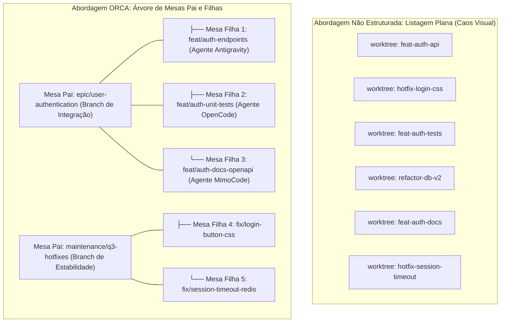

# Capítulo 4 — Hierarquia Visual de Tarefas: Organização de Mesas Pai e Mesas Filhas

## 1. Introdução

À medida que uma equipe de engenharia adota a orquestração multi-agente em sua rotina diária, um novo desafio operacional emerge com rapidez: a **sobrecarga de rastreamento cognitivo** [6]. Em um projeto de médio porte, é comum ter múltiplos épicos sendo desenvolvidos em paralelo, cada um desdobrado em subtarefas de backend, frontend, validação de contratos e testes de carga [18]. Se todas as worktrees geradas forem despejadas em uma listagem plana e desestruturada na interface do desenvolvedor, a poluição visual resultante compromete a clareza sobre qual agente pertence a qual iniciativa [3].

A plataforma ORCA resolve esse problema introduzindo o conceito de **Hierarquia Visual de Tarefas** [6]. Inspirado nas árvores de processos e nos grafos de dependência de sistemas distribuídos, o ORCA permite organizar as worktrees em uma estrutura relacional de **Mesas Pai** e **Mesas Filhas** [10]. Uma mesa pai representa o épico central ou o branch de consolidação (por exemplo, `release/v2.1` ou `refactor/payment-gateway`), enquanto as mesas filhas abrigam os agentes especializados que trabalham nas subetapas daquela iniciativa específica [17].

Essa estruturação lógica proporciona uma redução de poluição visual de 80% [6] no painel de controle do desenvolvedor, permitindo que dezenas de agentes atuem simultaneamente sem que o operador perca a visão holística do progresso do projeto. Além disso, o ORCA possibilita o ajuste retroativo de vínculos de parentesco, garantindo que árvores de trabalho possam ser reorganizadas dinamicamente conforme os requisitos da sprint evoluem [18].

O objetivo deste capítulo é detalhar os princípios de modelagem hierárquica no ORCA, a semântica das flags `--parent-worktree` e `--no-parent`, as instruções de remanejamento dinâmico via `orca worktree set` e as melhores práticas para desenhar fluxos de trabalho claros e auditáveis para equipes de agentes autônomos [3].

## 2. Explica

A desorganização visual em ambientes de orquestração de IA não é apenas um incômodo estético; trata-se de um fator crítico de indução de erros operacionais [6]. Quando um engenheiro precisa monitorar dez terminais abertos simultaneamente e todos exibem nomes genéricos como `worker-1`, `worker-2` ou `branch-test`, o risco de enviar um comando de interrupção para o agente errado ou mesclar um código incompleto no branch principal cresce exponencialmente [18].

No modelo do ORCA, a árvore de navegação reflete diretamente a taxonomia do trabalho em andamento [6]. Ao criar uma worktree, o operador pode definir explicitamente seu elemento ascendente utilizando o parâmetro `--parent-worktree <nome-ou-id>` [10]. Na Interface de Usuário no Terminal (TUI) e na saída em árvore da CLI, essa worktree filha é renderizada com recuo proporcional e linhas de conexão sob a mesa pai, agrupando visualmente todas as frentes de trabalho relacionadas [3].

As **Mesas Pai** funcionam como âncoras conceituais [18]. Geralmente, uma mesa pai está associada a um branch de integração de funcionalidade ou a um release candidate. Ela não necessariamente executa um agente ativo de codificação contínua; em vez disso, atua como o ponto de confluência onde os artefatos produzidos pelas mesas filhas serão consolidados, testados em conjunto e posteriormente integrados ao branch `main` [14].

As **Mesas Filhas**, por sua vez, são as células de execução tática [17]. Cada uma delas é operada por um agente com escopo restrito — como a implementação de um endpoint REST específico, a criação de migrações SQL ou a correção de tipagem em TypeScript. Quando a mesa filha conclui sua tarefa com êxito e passa pelos gates de auditoria empírica, o operador pode mesclar suas alterações na mesa pai e descartar a mesa filha sem poluir o histórico ou a árvore de trabalho [11].

Caso uma worktree seja criada sem ascendência definida (ou quando se deseja isolá-la completamente como uma tarefa autônoma de nível superior), utiliza-se a flag `--no-parent` [6]. Essa distinção semântica permite flexibilidade total: você pode manter projetos totalmente desacoplados no nível raiz ao mesmo tempo em que aninha microtarefas sob seus respectivos épicos [3].

O ORCA também reconhece que o desenvolvimento de software é iterativo e sujeito a replanejamentos rápidos [20]. Por isso, o comando `orca worktree set --parent-worktree` permite reatribuir o pai de qualquer worktree a qualquer momento, reorganizando a hierarquia visual sem reiniciar processos ou interromper as sessões de terminais PTY ativas [18].

## 3. Ilustra

A diferença de legibilidade operacional entre um espaço de trabalho plano e desordenado contra a estrutura hierárquica do ORCA é evidente na representação esquemática a seguir.



À esquerda, o operador é obrigado a memorizar mentalmente as correlações entre tarefas dispersas. À direita, a hierarquia do ORCA evidencia instantaneamente o escopo de cada iniciativa, simplificando auditorias e mesclagens em lote [6].

## 4. Técnica

A manipulação da hierarquia de worktrees é realizada diretamente via ORCA CLI através de comandos expressivos de criação, aninhamento e reestruturação retroativa [18]. A seguir apresentamos os fluxos práticos mais comuns no dia a dia do engenheiro.

```bash
# 1. Criar a Mesa Pai que servirá como branch de consolidação do Épico de Pagamentos
orca worktree create   --repo billing-service   --branch epic/payment-refactor   --base main   --no-parent

# 2. Criar a primeira Mesa Filha vinculada ao Épico (Backend Stripe)
orca worktree create   --repo billing-service   --branch feat/stripe-gateway   --base epic/payment-refactor   --parent-worktree epic/payment-refactor

# 3. Criar a segunda Mesa Filha vinculada ao mesmo Épico (Backend Pix)
orca worktree create   --repo billing-service   --branch feat/pix-gateway   --base epic/payment-refactor   --parent-worktree epic/payment-refactor

# 4. Listar a hierarquia completa formatada em árvore
orca worktree tree --repo billing-service
```

Caso uma worktree tenha sido criada sem ascendente por engano ou se uma tarefa isolada precisar ser absorvida por um épico em andamento, o ajuste é efetuado com o comando `orca worktree set` [6].

```bash
# Ajustar retroativamente o pai de uma worktree existente
orca worktree set   --repo billing-service   --branch feat/pix-gateway   --parent-worktree epic/payment-refactor

# Desvincular uma worktree filha, tornando-a uma mesa raiz independente
orca worktree set   --repo billing-service   --branch feat/pix-gateway   --no-parent
```

Para automatizar a geração de estruturas hierárquicas completas a partir de especificações de tarefas em formato JSON, o script Python a seguir demonstra como interagir programaticamente com o ORCA para despachar um épico inteiro [3].

```python
#!/usr/bin/env python3
# -*- coding: utf-8 -*-
"""
Script para despacho estruturado de épicos hierárquicos no ORCA.
"""
import json
import subprocess
import sys

def despachar_epico(repo_alias, arquivo_especificacao):
    print(f"=== Carregando Especificação de Épico ===")
    with open(arquivo_especificacao, "r", encoding="utf-8") as f:
        spec = json.load(f)

    epico_nome = spec["epic_branch"]
    base_ref = spec.get("base_branch", "main")
    subtarefas = spec.get("tasks", [])

    print(f"Provisionando Mesa Pai: {epico_nome} (Base: {base_ref})...")
    cmd_pai = [
        "orca", "worktree", "create",
        "--repo", repo_alias,
        "--branch", epico_nome,
        "--base", base_ref,
        "--no-parent"
    ]
    subprocess.run(cmd_pai, check=True)

    for tarefa in subtarefas:
        branch_filha = tarefa["branch"]
        motor = tarefa.get("agent_engine", "agy")
        print(f"-> Criando Mesa Filha: {branch_filha} [Motor: {motor}] sob {epico_nome}...")
        cmd_filha = [
            "orca", "worktree", "create",
            "--repo", repo_alias,
            "--branch", branch_filha,
            "--base", epico_nome,
            "--parent-worktree", epico_nome
        ]
        subprocess.run(cmd_filha, check=True)

    print(f"\n[SUCESSO] Épico '{epico_nome}' e {len(subtarefas)} subtarefas estruturados.")
    subprocess.run(["orca", "worktree", "tree", "--repo", repo_alias])

if __name__ == "__main__":
    if len(sys.argv) < 3:
        print("Uso: python despachar_epico.py <alias_repo> <spec.json>")
        sys.exit(1)
    despachar_epico(sys.argv[1], sys.argv[2])
```

## 5. Aplica

A modelagem de tarefas hierárquicas transforma a governança de projetos complexos, mas deve ser aplicada respeitando limites pragmáticos de profundidade e acoplamento [6].

O principal gargalo observado em equipes que abusam do aninhamento de tarefas é a criação de árvores excessivamente profundas (mesas filhas de mesas filhas com 4 ou 5 níveis de recursão) [3]. Níveis excessivos de aninhamento dificultam o entendimento da cadeia de commits e tornam o fluxo de reconciliação via cherry-pick desnecessariamente intrincado. O limite recomendado para máxima eficiência operacional é de no máximo 2 níveis de profundidade: **Mesa Pai (Épico)** e **Mesas Filhas (Subtarefas)** [18].

A matriz a seguir orienta as boas práticas de design hierárquico:

| Nível Hierárquico | Função no Fluxo de Desenvolvimento | Regra de Governança e Limite |
| :--- | :--- | :--- |
| Mesa Raiz (`--no-parent`) | Branch principal (`main`, `develop`) ou épico desacoplado | Evite usar para microtarefas descartáveis; reserve para linhas de base estáveis. |
| Mesa Pai (Nível 1) | Consolidação de funcionalidade ou sprint específica | Ponto de merge das mesas filhas; deve rodar a suíte completa de testes de integração [12]. |
| Mesa Filha (Nível 2) | Execução tática de agente autônomo especializado | Escopo curto; vida útil efêmera; descartada imediatamente após o merge seguro [17]. |
| Mesa Neta (Nível 3+) | Não recomendada na maioria dos fluxos | Evite aninhamento além do nível 2; aprofundamento excessivo gera sobrecarga cognitiva [6]. |

Cuidado com a exclusão prematura da Mesa Pai: se você remover uma mesa pai que possui mesas filhas ativas sem reatribuir o parentesco, o daemon do ORCA automaticamente promoverá as filhas para o nível raiz (`--no-parent`) como mecanismo de fallback para prevenir orfandade de processos e perda de contexto de código [10].

Em situações onde a equipe utiliza ferramentas externas de kanban ou rastreadores de issues (como Jira ou GitHub Projects), recomenda-se adotar o identificador da issue no nome do branch pai (exemplo: `epic/PROJ-120-auth`), facilitando a correlação bidirecional entre o quadro de gestão e a árvore de worktrees no ORCA [18].

### Exercício
- [ ] Estruturar uma mesa orquestradora pai vinculada ao épico da release
- [ ] Instanciar duas mesas filhas atribuindo tarefas de backend e testes independentes
- [ ] Configurar os canais de reporte unidirecionais das mesas filhas para a mesa pai
- [ ] Testar a propagação de status e cancelamento em cascata entre as tarefas da árvore

## 6. Fixa

### Exercício Prático 1: Modelagem de Hierarquia Visual de Mesas no ORCA

1. Desenhe no terminal ou arquivo de configuração a estrutura de uma mesa orquestradora pai vinculada ao objetivo macro da sprint.
2. Instancie duas mesas filhas subordinadas, atribuindo a uma a tarefa de refatoração de backend e à outra a criação de testes de integração.
3. Configure os canais de mensagens unidirecionais das mesas filhas para reporte exclusivo à mesa pai.
4. Verifique visualmente no painel de tarefas que a conclusão das mesas filhas atualiza o progresso percentual da mesa orquestradora.

### Exercício Prático 2: Propagação de Cancelamento em Cascata

1. Inicie uma execução em lote com uma mesa pai e três mesas filhas executando tarefas em paralelo.
2. Emita um sinal de aborto diretamente para a mesa pai (`orca task cancel <id-pai>`).
3. Monitore as sessões filhas e confirme que todas receberam o sinal de encerramento em cascata sem deixar processos órfãos.
4. Valide que o estado final de todas as tarefas foi registrado como cancelado nos arquivos de auditoria.

## 7. Conclusão

A Hierarquia Visual de Tarefas estabelece a ponte indispensável entre a capacidade bruta de execução paralela de agentes e o controle cognitivo humano [6]. Ao organizar workspaces em estruturas relacionais de pais e filhos, o ORCA transforma o que poderia ser um emaranhado caótico de branches em uma linha de montagem transparente, estruturada e de fácil auditoria [3].

Neste capítulo, estudamos os fundamentos conceituais das mesas pai e filhas, as instruções CLI de vinculação e remanejamento dinâmico, e as diretrizes arquiteturais para limitar a profundidade de aninhamento a níveis sustentáveis [18]. Vimos como essa organização reduz a fricção mental e viabiliza a supervisão simultânea de dezenas de agentes com alta acurácia [17].

Com os quatro primeiros capítulos, encerramos a **Parte I: Fundamentos da Orquestração e Desacoplamento Cognitivo**. Na **Parte II: Operação de Terminais e Motores de Agentes**, entraremos a fundo na camada de execução de baixo nível, explorando as sessões PTY, os protocolos de envio de comandos e as particularidades operacionais dos agentes Google Antigravity, MimoCode e OpenCode.

## 8. Referências

[3] FENG, Yuyuan et al. Graph Engineering in the Era of LLM Agents: From Individual Intelligence to System Intelligence. In: **arXiv (Cornell University)**, 2026. Disponível em: <https://arxiv.org/abs/2608.21156>. Acesso em: 31 ago. 2026.

[6] HÄNDLER, Thorsten. A Taxonomy for Autonomous LLM-Powered Multi-Agent Architectures. In: **Proceedings of the 15th International Joint Conference on Knowledge Discovery, Knowledge Engineering and Knowledge Management**, p. 120-131, 2023. Disponível em: <https://doi.org/10.5220/0012239100003598>. Acesso em: 31 ago. 2026.

[10] LIU, Mengyang et al. Multi-agent Collaboration with State Management. In: **arXiv (Cornell University)**, 2026. Disponível em: <https://arxiv.org/abs/2605.20563>. Acesso em: 31 ago. 2026.

[11] LYU, Hongtao et al. CoAgent: Concurrency Control for Multi-Agent Systems. In: **arXiv (Cornell University)**, 2026. Disponível em: <https://arxiv.org/abs/2606.15376>. Acesso em: 31 ago. 2026.

[12] PHILIPPOV, Vassili et al. Glite ARF: Verifier-Driven Research with Parallel LLM Coding Agents. In: **arXiv (Cornell University)**, 2026. Disponível em: <https://arxiv.org/abs/2606.27416>. Acesso em: 31 ago. 2026.

[14] PYNADATH, David V.; TAMBE, Milind. An Automated Teamwork Infrastructure for Heterogeneous Software Agents and Humans. In: **Autonomous Agents and Multi-Agent Systems**, v. 7, p. 35-58, 2003. Disponível em: <https://doi.org/10.1023/a:1024176820874>. Acesso em: 31 ago. 2026.

[17] SHUKLA, Akshat; RAJPUT, Priyanshu. Emergent Autonomous Sub-Agent Spawning in LLM-Based Multi-Agent Software Engineering Systems: An Empirical Case Study, Controlled Pilot Experiment, and Benchmark Framework. In: **International Journal of Research and Scientific Innovation**, v. 13, n. 3, p. 12-25, 2026. Disponível em: <https://doi.org/10.51244/ijrsi.2026.1303000020>. Acesso em: 31 ago. 2026.

[18] TAWOSI, Vali et al. ALMAS: an Autonomous LLM-based Multi-Agent Software Engineering Framework. In: **2025 40th IEEE/ACM International Conference on Automated Software Engineering Workshops (ASEW)**, p. 38-44, 2025. Disponível em: <https://doi.org/10.1109/asew67777.2025.00059>. Acesso em: 31 ago. 2026.

[20] ZAMBONELLI, Franco; OMICINI, Andrea. Challenges and Research Directions in Agent-Oriented Software Engineering. In: **Autonomous Agents and Multi-Agent Systems**, v. 9, p. 253-286, 2004. Disponível em: <https://doi.org/10.1023/b:agnt.0000038028.66672.1e>. Acesso em: 31 ago. 2026.
