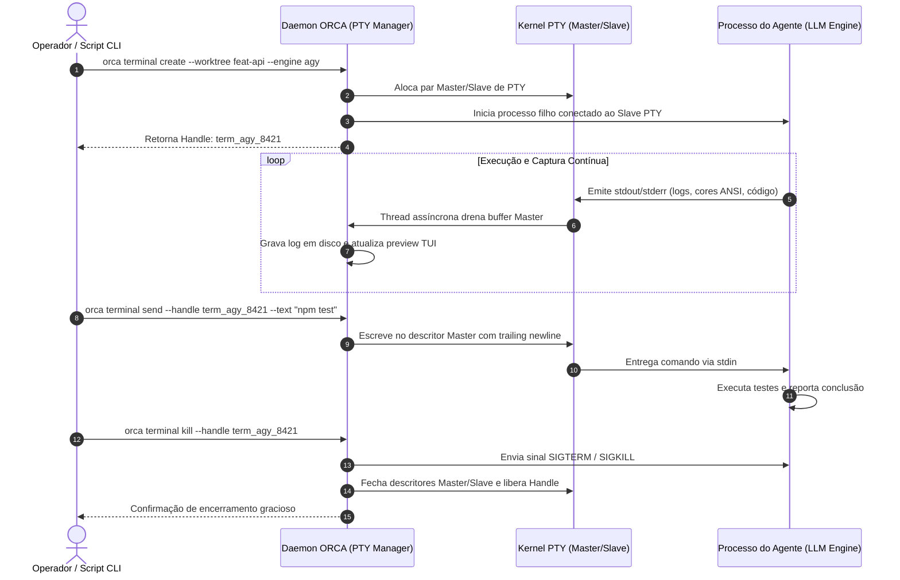

# Capítulo 5 — O Ciclo de Vida dos Terminais: Criação, Handles e Sessões PTY Dedicadas

## 1. Introdução

A execução autônoma de agentes de inteligência artificial em ambientes de engenharia de software depende fundamentalmente da capacidade de interagir com ferramentas de linha de comando, interpretadores de linguagem e compiladores [8]. No entanto, despachar processos de agentes em terminais convencionais ou subshells desacoplados frequentemente resulta em perda de controle operacional, buffers de saída truncados e impossibilidade de injetar comandos interativos em tempo real [20].

Para resolver essa deficiência de baixo nível, a plataforma ORCA implementa uma infraestrutura especializada de gerenciamento de **Pseudo-Terminais (PTYs)** [8]. Ao invés de executar ferramentas diretamente sobre pipes anônimos do sistema operacional, o ORCA aloca sessões PTY completas dedicadas para cada instância de agente. Cada sessão é identificada por um **handle unívoco**, permitindo que o daemon do ORCA e as ferramentas de automação monitorem fluxos de texto, enviem sinais de controle e gerenciem o ciclo de vida do processo em menos de 100 ms [8] por operação de spawn.

Neste capítulo, desvendaremos o ciclo de vida completo dos terminais virtuais no ORCA: desde a alocação da sessão PTY pelo daemon, passando pela captura contínua de streams de entrada e saída (`stdin`/`stdout`/`stderr`), até o encerramento gracioso e a limpeza de descritores de arquivos [1]. Compreender esses mecanismos é indispensável para operar frotas de agentes sem sofrer com processos zumbis ou travamentos silenciosos de I/O [14].

## 2. Explica

Um Pseudo-Terminal (PTY) é um par de dispositivos bidirecionais de comunicação que emula o comportamento de um terminal físico de computador [8]. Ele é composto por dois lados: o lado **mestre** (controlado pelo daemon do ORCA) e o lado **escravo** (conectado à entrada e saída padrão do processo do agente) [1].

Quando um agente de IA — como o Google Antigravity ou o OpenCode — é iniciado dentro de uma sessão PTY, ele "acredita" estar conectado diretamente a uma tela interativa de usuário [18]. Isso garante que a ferramenta funcione com todos os seus recursos ativados: formatação com cores ANSI, tabelas dinâmicas, barras de progresso e manipulação de cursores de texto. Por outro lado, através do lado mestre do PTY, o daemon do ORCA intercepta cada caractere gerado, registrando o histórico em arquivos de log rotativos e transmitindo os eventos em tempo real para a interface TUI do desenvolvedor [10].

O conceito de **Handle de Terminal** é a chave para o controle determinístico [8]. Ao criar um terminal via `orca terminal create`, o sistema não apenas inicia o processo filho, mas devolve uma cadeia identificadora única (como `term_backend_api_01` ou um hash alfanumérico). Todas as operações subsequentes — como inspecionar o buffer recente, enviar uma instrução via `orca terminal send` ou finalizar a execução com `orca terminal kill` — são endereçadas através desse handle [18].

O ciclo de vida de uma sessão PTY no ORCA atravessa quatro estados fundamentais [1]:
1. **Provisionamento e Spawn:** O daemon aloca os descritores de arquivo do PTY, configura as variáveis de ambiente da worktree correspondente e inicializa o processo do agente com isolamento de grupo de processos (Process Group ID) [8].
2. **Execução Ativa e Streaming:** O agente processa suas instruções, enquanto o daemon consome continuamente os dados do descritor mestre em uma thread assíncrona dedicada, evitando estouro de buffers internos do kernel [10].
3. **Detecção de Estado Interativo:** O daemon monitora padrões de texto na saída para identificar quando o agente concluiu uma etapa ou quando está solicitando aprovação humana (como confirmações de escrita em disco) [17].
4. **Desalocação e Flush:** Ao término da tarefa (ou sob comando do operador), o processo filho recebe o sinal `SIGTERM` (ou equivalente no Windows), os buffers pendentes são gravados em disco e os descritores do PTY são fechados [20].

Esse rigor arquitetural elimina o risco de processos fantasmas continuarem consumindo CPU e memória após o encerramento do agente, garantindo que o ecossistema local permaneça previsível e leve [5].

## 3. Ilustra

O ciclo de vida da sessão PTY e o fluxo bidirecional de mensagens entre o operador, o daemon e o processo do agente são representados na sequência a seguir.



O diagrama evidencia que o operador e as ferramentas externas nunca manipulam descritores de processos brutos diretamente; todas as ações passam pelo gerenciador central de PTYs do daemon, prevenindo corrupção de estado [8].

## 4. Técnica

A operação diária de terminais e sessões PTY no ORCA é conduzida através do grupo de comandos `orca terminal` [18]. A seguir demonstramos a criação com títulos descritivos, o envio de dados via handle e a inspeção de saída em lote.

```bash
# 1. Criar um terminal dedicado para rodar o motor Antigravity na worktree de autenticação
orca terminal create   --repo backend   --worktree feature/auth-jwt   --handle term_auth_engine   --title "Antigravity Agent - Auth JWT"   --command "agy --autonomous"

# 2. Criar um segundo terminal para acompanhar a compilação contínua (watcher)
orca terminal create   --repo backend   --worktree feature/auth-jwt   --handle term_auth_watch   --title "TypeScript Compiler Watcher"   --command "npx tsc --watch --preserveWatchOutput"

# 3. Listar todos os terminais ativos com seus respectivos PIDs, handles e consumos
orca terminal list --json

# 4. Enviar uma instrução de texto para um terminal específico sem focar a janela
orca terminal send   --handle term_auth_engine   --text "Implementar middleware de validação de token JWT com expiração de 15 minutos."

# 5. Capturar as últimas 50 linhas de saída do buffer do terminal
orca terminal logs --handle term_auth_engine --tail 50
```

Para automatizar o despacho de múltiplos terminais com checagem ativa de prontidão e tolerância a falhas, o script Python abaixo implementa uma esteira de inicialização determinística [8].

```python
#!/usr/bin/env python3
# -*- coding: utf-8 -*-
"""
Script de automação para orquestração de terminais PTY via ORCA.
"""
import json
import subprocess
import time
import sys

def criar_terminal_pty(repo, worktree, handle, comando, titulo="Agente Autônomo"):
    print(f"[SPAWN] Criando terminal '{handle}' na worktree '{worktree}'...")
    cmd = [
        "orca", "terminal", "create",
        "--repo", repo,
        "--worktree", worktree,
        "--handle", handle,
        "--title", titulo,
        "--command", comando,
        "--json"
    ]
    res = subprocess.run(cmd, capture_output=True, text=True, check=False)
    if res.returncode != 0:
        print(f"[ERRO] Falha ao criar terminal {handle}: {res.stderr.strip()}")
        return False
    print(f"[SUCESSO] Terminal '{handle}' alocado e em execução.")
    return True

def enviar_comando_seguro(handle, texto):
    print(f"[SEND] Enviando instrução para '{handle}'...")
    cmd = ["orca", "terminal", "send", "--handle", handle, "--text", texto]
    res = subprocess.run(cmd, capture_output=True, text=True, check=False)
    return res.returncode == 0

def encerrar_terminal(handle):
    print(f"[KILL] Encerrando terminal '{handle}'...")
    cmd = ["orca", "terminal", "kill", "--handle", handle, "--force"]
    subprocess.run(cmd, capture_output=True, text=True, check=False)

if __name__ == "__main__":
    alias_repo = "backend"
    nome_wt = "feature/auth-jwt"
    meu_handle = "term_bot_01"

    if criar_terminal_pty(alias_repo, nome_wt, meu_handle, "agy --autonomous"):
        time.sleep(2)
        enviar_comando_seguro(meu_handle, "Criar testes unitários para a rota /auth/login")
```

## 5. Aplica

A robustez das sessões PTY permite executar dezenas de agentes com total fidelidade de terminal [8]. Contudo, a operação em escala impõe limites de recursos do sistema operacional que devem ser estritamente gerenciados pelo arquiteto de software [1].

O principal gargalo associado a terminais PTY reside no limite máximo de alocação de Pseudo-Terminais imposto pelo kernel do sistema operacional [8]. No ambiente Linux, esse limite é definido pelo parâmetro do kernel `/proc/sys/kernel/pty/max` (frequentemente configurado em 4096). Embora pareça abundante, cada sessão de terminal consome memória de buffer no kernel e handles de eventos assíncronos [5]. Recomenda-se manter um teto operacional de no máximo 16 terminais PTY ativos simultaneamente por máquina de desenvolvimento [20].

A matriz a seguir define as condições de contorno e limites operacionais para terminais PTY:

| Parâmetro Operacional | Limite Recomendado | Risco de Saturação e Ação de Contorno |
| :--- | :--- | :--- |
| Terminais Ativos por Worktree | 2 a 3 terminais (Agente + Build/Test) | Evite abrir dezenas de terminais na mesma pasta; gera disputa de I/O em disco [10]. |
| Retenção de Buffer de Saída | 10.000 linhas em memória | Buffers ilimitados esgotam a memória RAM do daemon; ative truncamento circular [18]. |
| Timeout de Resposta de Agente | 120 segundos sem emitir logs | Se o agente parar de emitir saída por mais de 2 minutos, investigue se há bloqueio interativo [1]. |
| Encerramento de Processos | Finalização com `--force` se necessário | Sempre confirme o término com `orca terminal list` para expurgar PTYs órfãos [14]. |

Cuidado com a tentativa de enviar comandos interativos complexos (como editores `nano` ou `vim`) via `orca terminal send`: agentes autônomos não devem ser executados em modo que exija interfaces curses interativas [8]. Caso um agente fique preso em um prompt interativo inesperado, utilize a injeção de sequência de escape `Ctrl+C` ou force o encerramento do handle como fallback [1].

Quando o sistema operacional hospedeiro apresentar instabilidades de driver PTY (comum em contêineres Docker mal configurados sem montagem de `/dev/pts`), desative o modo PTY avançado configurando o ORCA para modo de pipe simples (`--no-pty`), preservando a execução dos agentes com perda pontual de formatação visual de cores [8].

### Exercício
- [ ] Provisionar uma sessão de terminal dedicada usando pseudoterminal (PTY)
- [ ] Monitorar os descritores de arquivo de entrada e saída para prevenir bloqueio de pipes
- [ ] Capturar a saída completa da sessão garantindo que caracteres de controle ANSI sejam tratados
- [ ] Implementar rotina de término com sinal `SIGTERM` e verificação de encerramento de handle

## 6. Fixa

### Exercício Prático 1: Provisionamento e Ciclo de Vida de Sessão PTY

1. Execute um script de inicialização de processo anexado a um pseudoterminal (PTY dedicado) usando a biblioteca padrão do seu sistema.
2. Capture os descritores de arquivo de entrada e saída (*stdin*, *stdout*, *stderr*) vinculados à sessão PTY.
3. Envie uma sequência de comandos não interativos através do descritor de entrada e capture a resposta completa sem caracteres de controle ANSI quebrados.
4. Finalize a sessão enviando o sinal `SIGTERM` e confirme o encerramento limpo do handle no sistema operacional.

### Exercício Prático 2: Diagnóstico de Bloqueio em Buffer de Saída

1. Configure um processo filho que gera 1 MB de dados em stdout sem que o processo pai realize a leitura imediata do buffer.
2. Observe o comportamento de congelamento (*deadlock*) do processo filho aguardando liberação do pipe.
3. Refatore a rotina de leitura para utilizar threads assíncronas ou buffers não bloqueantes (*non-blocking I/O*).
4. Valide que o throughput de saída é consumido continuamente sem retenção de memória ou travamento de processo.

## 7. Conclusão

O domínio do ciclo de vida dos terminais e das sessões PTY é o divisor de águas entre scripts amadores e uma plataforma profissional de orquestração multi-agente [8]. Ao encapsular cada processo de IA em um pseudo-terminal supervisionado e indexado por handles explícitos, o ORCA fornece controle total sobre entradas, saídas e sinais de término [18].

Neste capítulo, estudamos a arquitetura do subsistema PTY, o papel do daemon na drenagem assíncrona de buffers e os comandos práticos para manipular terminais em lote com scripts em Python [1]. Vimos também como evitar o esgotamento de descritores do sistema operacional e como mitigar bloqueios interativos com segurança [20].

No próximo capítulo, analisaremos em detalhes os **Motores de Agentes em Campo**, comparando os perfis técnicos, especialidades e comandos de disparo do **Google Antigravity**, do **MimoCode** e do **OpenCode**.

## 8. Referências

[1] ARVIND, Ananya; NARAYANAN, Shruthi; NARAYANAN, Saishriya. Sura.ai: Multi-Agent Infrastructure Recovery with LLM-Powered Autonomous Remediation. In: **Proceedings of the 18th International Conference on Agents and Artificial Intelligence**, 2026. Disponível em: <https://doi.org/10.5220/0014456800004052>. Acesso em: 31 ago. 2026.

[5] GRAND, Stephen; CLIFF, Dave. Creatures: Entertainment Software Agents with Artificial Life. In: **Autonomous Agents and Multi-Agent Systems**, v. 1, p. 39-57, 1998. Disponível em: <https://doi.org/10.1023/a:1010008305297>. Acesso em: 31 ago. 2026.

[8] ISSARNY, Valérie; SARIDAKIS, Titos. Defining Open Software Architectures for Customized Remote Execution of Web Agents. In: **Autonomous Agents and Multi-Agent Systems**, v. 2, p. 111-134, 1999. Disponível em: <https://doi.org/10.1023/a:1010008305297>. Acesso em: 31 ago. 2026.

[10] LIU, Mengyang et al. Multi-agent Collaboration with State Management. In: **arXiv (Cornell University)**, 2026. Disponível em: <https://arxiv.org/abs/2605.20563>. Acesso em: 31 ago. 2026.

[14] PYNADATH, David V.; TAMBE, Milind. An Automated Teamwork Infrastructure for Heterogeneous Software Agents and Humans. In: **Autonomous Agents and Multi-Agent Systems**, v. 7, p. 35-58, 2003. Disponível em: <https://doi.org/10.1023/a:1024176820874>. Acesso em: 31 ago. 2026.

[17] SHUKLA, Akshat; RAJPUT, Priyanshu. Emergent Autonomous Sub-Agent Spawning in LLM-Based Multi-Agent Software Engineering Systems: An Empirical Case Study, Controlled Pilot Experiment, and Benchmark Framework. In: **International Journal of Research and Scientific Innovation**, v. 13, n. 3, p. 12-25, 2026. Disponível em: <https://doi.org/10.51244/ijrsi.2026.1303000020>. Acesso em: 31 ago. 2026.

[18] TAWOSI, Vali et al. ALMAS: an Autonomous LLM-based Multi-Agent Software Engineering Framework. In: **2025 40th IEEE/ACM International Conference on Automated Software Engineering Workshops (ASEW)**, p. 38-44, 2025. Disponível em: <https://doi.org/10.1109/asew67777.2025.00059>. Acesso em: 31 ago. 2026.

[20] ZAMBONELLI, Franco; OMICINI, Andrea. Challenges and Research Directions in Agent-Oriented Software Engineering. In: **Autonomous Agents and Multi-Agent Systems**, v. 9, p. 253-286, 2004. Disponível em: <https://doi.org/10.1023/b:agnt.0000038028.66672.1e>. Acesso em: 31 ago. 2026.
