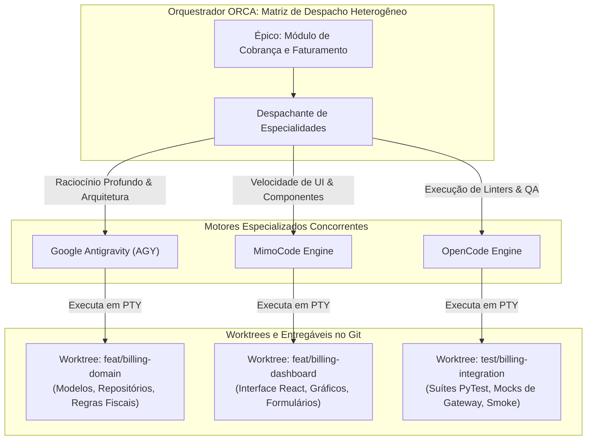

# Capítulo 6 — Motores de Agentes em Campo: Orquestrando Antigravity, MimoCode e OpenCode

## 1. Introdução

A diversidade de ferramentas e modelos de inteligência artificial disponíveis no mercado contemporâneo exige que uma plataforma de orquestração seja agnóstica e poliglota [18]. Na engenharia de software real, não existe um modelo de linguagem ou agente universal que seja ótimo para todas as tarefas possíveis [7]. Tarefas de refatoração profunda de arquiteturas legadas exigem capacidades de raciocínio de contexto estendido, enquanto correções rápidas de estilo e geração de testes unitários podem ser executadas com motores menores, mais rápidos e de menor custo computacional [19].

No ecossistema do ORCA, destacam-se três motores de agentes principais amplamente adotados pela indústria: o **Google Antigravity (AGY)**, o **MimoCode** e o **OpenCode** [17]. Cada um desses motores possui características singulares de execução, formatos específicos de flags para bypass de permissões e pontos fortes bem delineados no ciclo de vida de desenvolvimento de software [16].

A capacidade de despachar e orquestrar simultaneamente a atuação conjunta desses 3 agentes [17] em worktrees distintas é um dos maiores multiplicadores de produtividade da plataforma. Enquanto o Antigravity atua na modelagem de domínio e regras de negócio, o MimoCode pode implementar as interfaces visuais e o OpenCode focar estritamente na geração e execução de suítes de testes automatizados [2].

Este capítulo disseca as particularidades operacionais de cada motor, as flags de linha de comando mandatórias para execução autônoma sem bloqueios interativos, a configuração de níveis de confiança e as estratégias para compor equipes heterogêneas de alta performance técnica [19].

## 2. Explica

Para operar com sucesso uma equipe heterogênea de agentes de IA, o engenheiro precisa compreender o modelo de funcionamento e as especialidades de cada motor [18].

O **Google Antigravity (AGY)** destaca-se por sua capacidade de raciocínio lógico avançado e integração profunda com ecossistemas corporativos complexos [17]. Ele opera com base em loops agenticos de múltiplos passos, utilizando árvores de busca para explorar hipóteses de código antes de realizar alterações físicas nos arquivos do projeto. O Antigravity é a escolha primordial para tarefas de arquitetura, criação de novos microserviços, migrações de esquemas de banco de dados e resolução de bugs com dependências intrincadas [7].

O **MimoCode**, por sua vez, é um motor projetado com ênfase em velocidade e precisão no ecossistema de desenvolvimento web moderno [19]. Ele possui modelos altamente otimizados para manipulação de TypeScript, React, Tailwind CSS, endpoints GraphQL e componentes visuais. Sua latência de resposta é extremamente baixa, tornando-o perfeito para implementar layouts de frontend, estilizações responsivas e formulários complexos a partir de especificações de design [16].

O **OpenCode** posiciona-se como uma engine open-source extensível e orientada a ferramentas de linha de comando e testes automatizados [2]. Sua arquitetura é focada em execução determinística de scripts, análise estática de código (linters) e validação de contratos de API. No ORCA, o OpenCode é frequentemente designado para atuar como o "agente de garantia de qualidade", encarregado de escrever suítes de teste com PyTest, Jest ou Go Test, executá-las no terminal e aplicar correções imediatas até que 100% dos testes passem [12].

A tabela a seguir resume as especialidades e perfis de cada motor:

| Motor de Agente | Especialidade Primária | Modo Autônomo Típico | Perfil de Consumo de Recursos |
| :--- | :--- | :--- | :--- |
| Google Antigravity (AGY) | Arquitetura, Backend e Algoritmos Complexos | `agy --autonomous` | Alto poder de raciocínio, consumo moderado a alto de tokens [17]. |
| MimoCode | Frontend UI, Componentes Web e Estilização | `mimocode --trust` | Alta velocidade de geração, consumo otimizado de tokens [19]. |
| OpenCode | Testes Automatizados, QA e Refatoração de Linters | `opencode run --auto` | Execução determinística baseada em ferramentas locais [2]. |

O segredo para orquestrar esses motores reside na correta parametrização de suas flags de execução [18]. Se um agente for despachado em segundo plano sem a flag que autoriza a modificação autônoma de arquivos no disco, o processo ficará suspenso indefinidamente aguardando uma tecla do usuário, travando a esteira de desenvolvimento [1].

## 3. Ilustra

A orquestração heterogênea no ORCA distribui os papéis do ciclo de desenvolvimento de software conforme os pontos fortes de cada motor de agente.



Como ilustrado, cada motor opera em seu nicho de excelência técnica sobre uma worktree isolada, maximizando a qualidade de cada camada sem comprometer a coesão geral do projeto [17].

## 4. Técnica

A inicialização correta de cada motor de agente requer o uso das flags precisas de bypass de confirmação e concessão de confiança [18]. A seguir apresentamos os comandos canônicos para lançar cada um dos três agentes dentro do ecossistema ORCA.

```bash
# 1. Lançar o Google Antigravity em modo autônomo completo na worktree de domínio
orca terminal create   --repo billing-system   --worktree feature/billing-domain   --handle term_agy_domain   --title "Antigravity - Domain Logic"   --command "agy --autonomous --auto-apply"

# 2. Lançar o MimoCode com flag de pasta confiável na worktree de interface web
orca terminal create   --repo billing-system   --worktree feature/billing-ui   --handle term_mimo_ui   --title "MimoCode - React Frontend"   --command "mimocode --trust --workspace ."

# 3. Lançar o OpenCode com execução não interativa na worktree de testes
orca terminal create   --repo billing-system   --worktree feature/billing-qa   --handle term_opencode_qa   --title "OpenCode - QA & Tests"   --command "opencode run --auto-approve --mode batch"
```

Para gerenciar frotas heterogêneas de forma declarativa, o operador pode utilizar um manifest em formato YAML ou JSON que descreve a equipe e despacha todos os agentes através de um script de automação em Python [19].

```python
#!/usr/bin/env python3
# -*- coding: utf-8 -*-
"""
Script para despacho declarativo de equipe heterogênea de agentes de IA.
"""
import json
import subprocess
import sys

COMANDOS_MOTORES = {
    "antigravity": "agy --autonomous --auto-apply",
    "mimocode": "mimocode --trust --workspace .",
    "opencode": "opencode run --auto-approve --mode batch"
}

def despachar_equipe_heterogenea(config_json):
    print("=== Despachando Equipe de Agentes Heterogênea ===")
    with open(config_json, "r", encoding="utf-8") as f:
        equipe = json.load(f)

    repo = equipe["repo"]
    for membro in equipe["agents"]:
        nome = membro["name"]
        motor = membro["engine"].lower()
        worktree = membro["worktree"]
        tarefa = membro["prompt"]

        cmd_exec = COMANDOS_MOTORES.get(motor)
        if not cmd_exec:
            print(f"[PULADO] Motor '{motor}' não reconhecido para '{nome}'.")
            continue

        handle = f"term_{motor}_{nome}"
        print(f"\n[DESPACHO] Inicializando {nome} [{motor.upper()}] em {worktree}...")
        
        # Criação do terminal PTY
        subprocess.run([
            "orca", "terminal", "create",
            "--repo", repo,
            "--worktree", worktree,
            "--handle", handle,
            "--title", f"{nome} ({motor})",
            "--command", cmd_exec
        ], check=True)

        # Envio do prompt de instrução
        subprocess.run([
            "orca", "terminal", "send",
            "--handle", handle,
            "--text", tarefa
        ], check=True)

    print("\n[SUCESSO] Todos os agentes foram despachados em paralelo.")

if __name__ == "__main__":
    if len(sys.argv) < 2:
        print("Uso: python despachar_heterogeneo.py <equipe.json>")
        sys.exit(1)
    despachar_equipe_heterogenea(sys.argv[1])
```

## 5. Aplica

A utilização simultânea de múltiplos motores de inteligência artificial potencializa os resultados da engenharia, mas impõe limites severos de rate limiting e custos de tokens que precisam ser monitorados com rigor [17].

O principal gargalo na execução de frotas heterogêneas é o limite de requisições por minuto (RPM) e tokens por minuto (TPM) nos provedores de API de cada modelo de linguagem [19]. Se três agentes dispararem requisições volumosas de contexto simultaneamente sobre a mesma chave de API, o provedor retornará erros de status `429 Too Many Requests`, paralisando os agentes [1]. Recomenda-se configurar limites de taxa no daemon do ORCA e manter chaves de contingência cadastradas para alternância automática [7].

A matriz a seguir define as diretrizes de governança para motores de agentes:

| Motor | Condição Ideal de Uso | Quando Não Usar / Advertência de Escala |
| :--- | :--- | :--- |
| Google Antigravity | Refatorações arquiteturais, algoritmos complexos | Evite para pequenos ajustes pontuais de texto; custo de raciocínio é elevado [17]. |
| MimoCode | Telas React, formulários, componentes visuais | Cuidado ao usar para cálculos matemáticos críticos de backend sem testes rígidos [19]. |
| OpenCode | Automação de testes unitários, formatação, linters | Evite delegar decisões de design arquitetural de alto nível sem especificação [2]. |

Cuidado com a flag de confiança total (`--trust` ou `--auto-approve`): ao permitir que um agente escreva livremente em disco sem intervenção humana, garanta que ele esteja confinado estritamente dentro de uma worktree isolada [18]. Nunca execute agentes com permissões autônomas sobre o diretório raiz ou sobre o branch `main` em produção.

No caso de falha de conexão com a API de um motor específico (exemplo: indisponibilidade temporária do serviço do Antigravity), o mecanismo de fallback consiste em redirecionar a instrução pendente para outro motor equivalente através de `orca terminal send`, adaptando os prompts de sistema conforme a ferramenta substituta [1].

### Exercício
- [ ] Configurar o manifesto de agentes com perfis dedicados para Antigravity e OpenCode
- [ ] Direcionar tarefas de planejamento arquitetural para o motor de maior raciocínio
- [ ] Delegar geração de código em massa e refatorações pontuais para o motor operário
- [ ] Configurar política de fallback automático em caso de rate limit no provedor primário

## 6. Fixa

### Exercício Prático 1: Orquestração de Motores Heterogêneos de IA

1. Configure o manifesto de agentes definindo o motor Antigravity para tarefas de planejamento arquitetural e o OpenCode para geração de código.
2. Crie uma tarefa de teste que envia uma especificação de API para o motor de arquitetura gerar o schema OpenAPI.
3. Configure uma trigger automática que repassa o schema OpenAPI gerado diretamente para o motor de codificação.
4. Execute o pipeline ponta a ponta e meça o tempo de resposta e a aderência ao contrato entre os dois motores.

### Exercício Prático 2: Fallback Automático entre Motores de Inferência

1. Simule uma indisponibilidade intencional ou limite de taxa (*rate limit*) no motor primário de inferência.
2. Configure a política de resiliência no ORCA para chavear a execução automaticamente para o motor secundário de fallback.
3. Valide que o contexto da tarefa foi transferido sem corrupção e que a execução foi concluída com sucesso.
4. Inspecione o log de auditoria para confirmar o registro do evento de transbordo entre motores.

## 7. Conclusão

A flexibilidade de operar com motores heterogêneos de IA transforma o ORCA em uma oficina completa e adaptável às mais diversas linguagens e frameworks do mercado [18]. Ao selecionar a ferramenta correta para cada especialidade técnica — unindo o raciocínio do Antigravity, a agilidade do MimoCode e o determinismo do OpenCode —, a equipe atinge o ápice de sua produtividade sem abrir mão do rigor de engenharia [17].

Neste capítulo, estudamos as características e comandos canônicos dos três principais motores, as flags mandatórias de autonomia e a criação de manifestos de despacho programático em Python [19]. Vimos também como mitigar restrições de rate limit e gerenciar custos de forma sustentável [2].

No próximo capítulo, abordaremos um dos temas mais críticos da operação prática em linha de comando: **Protocolos de Envio e Bypass de Permissões**, aprendendo a evitar travamentos por buffers de texto presos e caixas de diálogo interativas na interface do terminal.

## 8. Referências

[1] ARVIND, Ananya; NARAYANAN, Shruthi; NARAYANAN, Saishriya. Sura.ai: Multi-Agent Infrastructure Recovery with LLM-Powered Autonomous Remediation. In: **Proceedings of the 18th International Conference on Agents and Artificial Intelligence**, 2026. Disponível em: <https://doi.org/10.5220/0014456800004052>. Acesso em: 31 ago. 2026.

[2] CHEN, Guhong et al. EvoTrainer: Co-Evolving LLM Policies and Training Harnesses for Autonomous Agentic Reinforcement Learning. In: **arXiv (Cornell University)**, 2026. Disponível em: <https://arxiv.org/abs/2606.03108>. Acesso em: 31 ago. 2026.

[7] ISHIBASHI, Yoichi; YANO, Taro; OYAMADA, Masafumi. Effective Harness Engineering for Algorithm Discovery with Coding Agents. In: **arXiv (Cornell University)**, 2026. Disponível em: <https://arxiv.org/abs/2605.15221>. Acesso em: 31 ago. 2026.

[12] PHILIPPOV, Vassili et al. Glite ARF: Verifier-Driven Research with Parallel LLM Coding Agents. In: **arXiv (Cornell University)**, 2026. Disponível em: <https://arxiv.org/abs/2606.27416>. Acesso em: 31 ago. 2026.

[16] SHEN, Yang et al. An Empirical Study of Multi-Agent Collaboration for Automated Research. In: **arXiv (Cornell University)**, 2026. Disponível em: <https://arxiv.org/abs/2603.29632>. Acesso em: 31 ago. 2026.

[17] SHUKLA, Akshat; RAJPUT, Priyanshu. Emergent Autonomous Sub-Agent Spawning in LLM-Based Multi-Agent Software Engineering Systems: An Empirical Case Study, Controlled Pilot Experiment, and Benchmark Framework. In: **International Journal of Research and Scientific Innovation**, v. 13, n. 3, p. 12-25, 2026. Disponível em: <https://doi.org/10.51244/ijrsi.2026.1303000020>. Acesso em: 31 ago. 2026.

[18] TAWOSI, Vali et al. ALMAS: an Autonomous LLM-based Multi-Agent Software Engineering Framework. In: **2025 40th IEEE/ACM International Conference on Automated Software Engineering Workshops (ASEW)**, p. 38-44, 2025. Disponível em: <https://doi.org/10.1109/asew67777.2025.00059>. Acesso em: 31 ago. 2026.

[19] URSEKAR, Varun et al. VeRO: A Harness for Agents to Optimize Agents. In: **arXiv (Cornell University)**, 2026. Disponível em: <https://arxiv.org/abs/2602.22480>. Acesso em: 31 ago. 2026.
