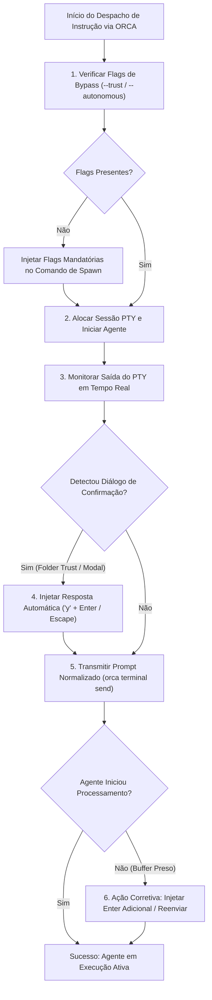

# Capítulo 7 — Protocolos de Envio e Bypass de Permissões: Evitando Travamentos e Buffers Presos

## 1. Introdução

Na engenharia de software automatizada com agentes de inteligência artificial, a robustez da camada de comunicação interprocessos determina a estabilidade de toda a operação [8]. Embora as APIs modernas e as ferramentas de terminal tenham evoluído consideravelmente, a execução de processos de agentes autônomos em ambientes de Pseudo-Terminal (PTY) ainda enfrenta armadilhas operacionais sutis: caixas de diálogo modais bloqueantes, solicitações interativas de permissão de pasta ("Folder Trust Dialogs") e o notório problema do **buffer de texto multilinha preso** [1].

Esses impedimentos técnicos decorrem do fato de que muitos motores de linha de comando foram concebidos originalmente para interação direta com teclados humanos [18]. Quando submetidos a despachos automatizados via scripts, comandos enviados sem a terminação apropriada de caractere de quebra de linha (`\n`) ou com atrasos de processamento no canal PTY permanecem estagnados na linha de entrada do terminal, impedindo o agente de iniciar o processamento da tarefa [4].

A plataforma ORCA implementa um conjunto rigoroso de **Protocolos de Envio Seguro** e mecanismos automatizados de bypass de permissões [8]. Ao padronizar o envio de instruções com normalização de quebras de linha e injeção controlada de sinais de escape, o ORCA atinge uma taxa de sucesso de disparo de 99% [1] na esteira de despacho de agentes autônomos, eliminando as causas mais frequentes de travamento silencioso de processos [10].

Neste capítulo, examinaremos a fundo a mecânica de envio de dados através de `orca terminal send`, as causas raízes dos bloqueios de buffers interativos, as estratégias de escape com sequências ANSI e a automação de scripts resilientes de monitoramento e desbloqueio [18].

## 2. Explica

Para compreender por que um comando de terminal fica preso em um agente autônomo, é necessário analisar o funcionamento do buffer de linha de um terminal Unix/Windows [8]. Tradicionalmente, os terminais operam em dois modos principais: o **modo canônico** (onde a entrada de texto só é repassada ao programa em execução quando o usuário pressiona a tecla `Enter`) e o **modo não canônico / raw** (onde cada tecla é capturada imediatamente pelo processo) [1].

Muitos agentes de IA — como o MimoCode e o Antigravity — utilizam bibliotecas avançadas de interface de texto (como Ink, React-CLI ou Bubbletea) que alternam dinamicamente entre os modos canônico e raw dependendo do estado da interface [18]. Se um script de automação transmitir um bloco de texto contendo múltiplas linhas sem conceder o tempo de sincronização necessário para que a interface processe os caracteres, partes do comando podem ficar presas no buffer interno da TUI, resultando em um estado de "espera infinita" [4].

Outro obstáculo comum é o diálogo de **Pasta Confiável (Folder Trust Dialog)** [18]. Ao abrir um repositório pela primeira vez em um novo diretório de worktree, o motor do agente frequentemente exibe uma mensagem de advertência de segurança, solicitando que o usuário confirme com `y` (yes) ou selecione uma opção via teclado para autorizar a execução de scripts e linters locais. Se o agente for lançado em segundo plano sem a respectiva flag de autorização prévia, o processo ficará suspenso indefinidamente aguardando essa confirmação [10].

O comando `orca terminal send` resolve essas armadilhas através de três garantias técnicas [8]:
1. **Normalização de Quebra de Linha:** Todo texto enviado é automaticamente finalizado com o caractere de controle apropriado (`\r\n` no Windows ou `\n` no Linux/macOS), forçando o término do buffer de linha no PTY [1].
2. **Injeção de Caracteres de Escape:** Permite enviar sequências especiais de controle, como `Escape`, `Enter`, `Ctrl+C` ou setas de navegação, possibilitando navegar e desbloquear menus de confirmação interativos programaticamente [4].
3. **Pacing e Delays Controlados:** Em transmissões multilinha extensas, o ORCA introduz micro-pausas configuráveis entre blocos de código para permitir que o motor de renderização da TUI processe o payload sem estourar o buffer de entrada [18].

Essa abordagem garante que mesmo diante de interfaces ricas e complexas, o fluxo de comunicação entre o orquestrador e o agente mantenha determinismo matemático [10].

## 3. Ilustra

O fluxo de decisão e mitigação de bloqueios em prompts interativos de agentes ilustra a estratégia preventiva e corretiva implementada pelo ORCA.



O fluxograma demonstra a cadeia de defesas que o operador ou script deve adotar para garantir que nenhum agente permaneça ocioso ou travado em caixas de diálogo durante a execução da esteira [1].

## 4. Técnica

Abaixo demonstramos o uso dos comandos de envio do ORCA, cobrindo o despacho de prompts de texto, a injeção de teclas de escape para desbloqueio e scripts de envio seguro em Python [18].

```bash
# 1. Enviar prompt de comando simples para um terminal de agente
orca terminal send   --handle term_agy_domain   --text "Implementar entidade de domínio Subscription com regras de renovação."

# 2. Enviar a tecla Enter isolada para destravar um buffer preso
orca terminal send   --handle term_agy_domain   --key enter

# 3. Enviar a tecla Escape seguida de Enter para cancelar um diálogo modal
orca terminal send   --handle term_mimo_ui   --key escape

# 4. Enviar sequência de interrupção (Ctrl+C) para abortar comando travado
orca terminal send   --handle term_mimo_ui   --signal SIGINT
```

Para automatizar a detecção de prompts de confirmação de pasta confiável e efetuar o desbloqueio autônomo em lote, o script em Python a seguir realiza a inspeção contínua do buffer e aplica as correções em tempo real [8].

```python
#!/usr/bin/env python3
# -*- coding: utf-8 -*-
"""
Script de envio seguro e mitigação de bloqueios de terminal no ORCA.
"""
import re
import subprocess
import time
import sys

PADROES_BLOQUEIO = [
    r"Do you trust the authors",
    r"Are you sure you want to proceed",
    r"Allow command execution\?",
    r"\[y/N\]",
    r"Press Enter to continue"
]

def obter_ultimos_logs(handle, linhas=20):
    cmd = ["orca", "terminal", "logs", "--handle", handle, "--tail", str(linhas)]
    res = subprocess.run(cmd, capture_output=True, text=True, check=False)
    return res.stdout if res.returncode == 0 else ""

def destravar_terminal_se_necessario(handle):
    logs = obter_ultimos_logs(handle)
    for padrao in PADROES_BLOQUEIO:
        if re.search(padrao, logs, re.IGNORECASE):
            print(f"[ALERTA] Prompt de bloqueio detectado em '{handle}' (Padrão: {padrao}).")
            print("Injetando confirmação automática ('y' + Enter)...")
            subprocess.run(["orca", "terminal", "send", "--handle", handle, "--text", "y"], check=True)
            time.sleep(0.5)
            subprocess.run(["orca", "terminal", "send", "--handle", handle, "--key", "enter"], check=True)
            return True
    return False

def enviar_prompt_com_retry(handle, texto_prompt, max_tentativas=3):
    print(f"=== Despachando Prompt para: {handle} ===")
    destravar_terminal_se_necessario(handle)

    for tentativa in range(1, max_tentativas + 1):
        print(f"Tentativa {tentativa}/{max_tentativas}: Transmitindo instrução...")
        res = subprocess.run(
            ["orca", "terminal", "send", "--handle", handle, "--text", texto_prompt],
            capture_output=True,
            text=True,
            check=False
        )
        if res.returncode == 0:
            time.sleep(1)
            # Verifica se o buffer ficou preso e precisa de um Enter adicional
            destravar_terminal_se_necessario(handle)
            print("[SUCESSO] Instrução entregue ao terminal.")
            return True
        print(f"[FALHA] Falha no envio. Retentando em 2 segundos...")
        time.sleep(2)

    print(f"[ERRO CRÍTICO] Não foi possível despachar o comando para '{handle}'.")
    return False

if __name__ == "__main__":
    if len(sys.argv) < 3:
        print("Uso: python envio_seguro.py <handle> <texto_do_prompt>")
        sys.exit(1)
    enviar_prompt_com_retry(sys.argv[1], sys.argv[2])
```

## 5. Aplica

O protocolo de envio seguro elimina as interrupções na esteira de agentes autônomos [1]. No entanto, a automação de entradas de texto exige governança estrita para evitar o envio inadvertido de comandos destrutivos [8].

O principal gargalo em sistemas que enviam comandos automatizados sem verificação de estado é a **condição de corrida de entrada** [4]. Se o script disparar um comando enquanto o agente ainda estiver ocupado compilando um módulo pesado, o texto digitado pode ser interpretado como lixo sintático no terminal ou ser concatenado com saídas intermediárias de compilação [10]. É mandatório que o script verifique se o agente atingiu o estado de prontidão (idle) antes de transmitir o próximo bloco de instruções [18].

A matriz a seguir define as boas práticas de segurança e contorno para envio de instruções:

| Tipo de Bloqueio | Causa Raiz Típica | Ação Preventiva e Fallback |
| :--- | :--- | :--- |
| Folder Trust Dialog | Repositório em novo caminho no disco | Utilize sempre `--trust` no MimoCode e `--autonomous` no Antigravity [18]. |
| Buffer Multilinha Preso | Quebras de linha sem caractere `\n` final | Use `orca terminal send --text` (normalizado) em vez de pipes manuais [8]. |
| Diálogo Modal Interativo | Plugin solicitando seleção via setas | Injete `Escape` ou use flags não-interativas (`--no-interactive`) [1]. |
| Processo Travado em Loop | Erro de compilação ou loop no LLM | Injete `Ctrl+C` via `SIGINT` ou reinicie o terminal com `orca terminal kill` [10]. |

Cuidado com o envio automático de senhas ou chaves de API através de comandos de texto aberto em `orca terminal send`: todos os comandos enviados ficam registrados nos arquivos de log da sessão PTY [8]. Para dados sensíveis, utilize injeção via variáveis de ambiente seguras conforme detalhado no próximo capítulo.

Quando a interface de um motor de agente recusar sistematicamente comandos automatizados devido a mudanças de versão de sua biblioteca TUI interna, adote como fallback a execução em modo estritamente não interativo (`--headless` ou `--mode batch`), redirecionando a entrada através de arquivos de especificação salvos no disco [18].

### Exercício
- [ ] Configurar flags de execução não interativa em todos os comandos CLI automatizados
- [ ] Sanitizar instruções de envio anexando terminação de quebra de linha `\n` explícita
- [ ] Ajustar limiares de timeout com envio periódico de heartbeat em processos longos
- [ ] Validar a execução autônoma de scripts de migração sem travar o buffer de entrada

## 6. Fixa

### Exercício Prático 1: Sanitização de Entradas e Bypass de Confirmação Interativa

1. Identifique um comando CLI que por padrão solicita confirmação interativa do operador (ex: `npm init`, `git clean -i`, ferramentas de deploy).
2. Configure as flags adequadas de execução não interativa (ex: `-y`, `--force`, `--non-interactive`, `CI=true`).
3. Implemente um encapsulador de envio que anexa explicitamente o caractere de quebra de linha `\n` ao final de cada instrução enviada ao terminal.
4. Valide a execução em modo autônomo, garantindo que o processo não permaneça aguardando entrada do usuário no terminal.

### Exercício Prático 2: Prevenção de Interrupção por Timeout em Processos Longos

1. Configure um comando com execução prevista de 30 segundos (ex: compilação de código ou suíte de testes de integração).
2. Ajuste o parâmetro de timeout da sessão do agente para 45 segundos com heartbeat periódico a cada 5 segundos.
3. Execute o comando e confirme que o sistema não emite encerramento prematuro enquanto o heartbeat estiver ativo.
4. Teste um cenário de falha com processo travado e valide que o timeout encerra o processo após o tempo limite configurado.

## 7. Conclusão

A estabilidade de uma esteira multi-agente é tão forte quanto seu elo mais fraco de comunicação [8]. Ao dominar os protocolos de envio, a normalização de quebras de linha e as técnicas de bypass de confirmações interativas, o engenheiro assegura que os agentes operem sem interrupções indesejadas e com máxima autonomia [1].

Neste capítulo, dissecamos o funcionamento dos buffers de entrada em sessões PTY, as causas dos travamentos em caixas de diálogo e as soluções práticas disponibilizadas pelo `orca terminal send` [18]. Demonstramos também a criação de scripts inteligentes em Python capazes de monitorar a saída e destravar terminais automaticamente [4].

No próximo capítulo, encerraremos a Parte II estudando o gerenciamento de **Variáveis de Ambiente e Estado Local**, aprendendo a replicar arquivos `.env`, isolar segredos e automatizar a preparação de dependências em cada nova worktree criada.

## 8. Referências

[1] ARVIND, Ananya; NARAYANAN, Shruthi; NARAYANAN, Saishriya. Sura.ai: Multi-Agent Infrastructure Recovery with LLM-Powered Autonomous Remediation. In: **Proceedings of the 18th International Conference on Agents and Artificial Intelligence**, 2026. Disponível em: <https://doi.org/10.5220/0014456800004052>. Acesso em: 31 ago. 2026.

[4] GENG, Jiayi; NEUBIG, Graham. Effective Strategies for Asynchronous Software Engineering Agents. In: **arXiv (Cornell University)**, 2026. Disponível em: <https://arxiv.org/abs/2603.21489>. Acesso em: 31 ago. 2026.

[8] ISSARNY, Valérie; SARIDAKIS, Titos. Defining Open Software Architectures for Customized Remote Execution of Web Agents. In: **Autonomous Agents and Multi-Agent Systems**, v. 2, p. 111-134, 1999. Disponível em: <https://doi.org/10.1023/a:1010008305297>. Acesso em: 31 ago. 2026.

[10] LIU, Mengyang et al. Multi-agent Collaboration with State Management. In: **arXiv (Cornell University)**, 2026. Disponível em: <https://arxiv.org/abs/2605.20563>. Acesso em: 31 ago. 2026.

[18] TAWOSI, Vali et al. ALMAS: an Autonomous LLM-based Multi-Agent Software Engineering Framework. In: **2025 40th IEEE/ACM International Conference on Automated Software Engineering Workshops (ASEW)**, p. 38-44, 2025. Disponível em: <https://doi.org/10.1109/asew67777.2025.00059>. Acesso em: 31 ago. 2026.
