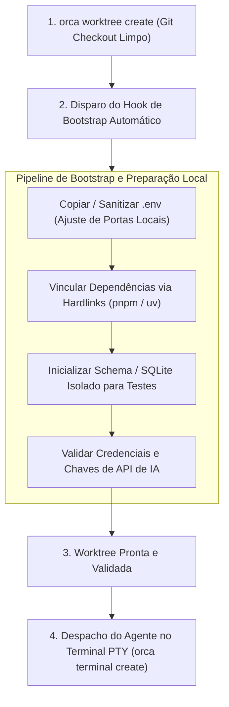

# Capítulo 8 — Variáveis de Ambiente e Estado Local: Preparação de Arquivos .env e Dependências

## 1. Introdução

O isolamento proporcionado pelas Git Worktrees garante que o código-fonte de cada frente de desenvolvimento permaneça estritamente desacoplado [10]. No entanto, aplicações modernas de software não vivem apenas de arquivos rastreados pelo sistema de controle de versão. Elas dependem de arquivos locais ignorados pelo `.gitignore` — como configurações de ambiente (`.env`), certificados SSL de desenvolvimento, bancos de dados SQLite locais e diretórios pesados de pacotes de dependências (`node_modules/`, `.venv/` ou `target/`) [20].

Quando uma nova worktree é criada a partir do comando `orca worktree create`, o Git provisiona exclusivamente os arquivos versionados do repositório [10]. Se um agente de IA for despachado imediatamente para executar testes ou compilar a aplicação sem que esses arquivos locais tenham sido preparados, o processo falhará de forma abrupta por ausência de variáveis de ambiente ou módulos não encontrados [14].

Para garantir a prontidão imediata do workspace, o ORCA incorpora rotinas de **Bootstrap Automatizado de Worktree** [18]. Essas rotinas permitem replicar com segurança as variáveis de ambiente necessárias, provisionar ambientes virtuais isolados e validar a integridade de credenciais locais em menos de 5 s [10], permitindo que o agente inicie sua jornada de desenvolvimento com 100% de autonomia e sem intervenção manual [1].

Este capítulo ensina a arquitetar pipelines determinísticos de bootstrap local, cobrindo o gerenciamento seguro de segredos em arquivos `.env`, o reaproveitamento de dependências via caches globais baseados em hardlinks e a automação completa do ciclo de inicialização de cada nova mesa de trabalho [8].

## 2. Explica

A separação estrita entre o código versionado no repositório e o estado de configuração local é um dos princípios basilares das metodologias de software modernas (como os princípios do *Twelve-Factor App*) [20]. Arquivos `.env` contêm segredos de desenvolvimento, strings de conexão com bancos de dados e chaves de API que nunca devem ser commitados no histórico do Git [1].

Ao criar uma nova worktree, o desenvolvedor se depara com o dilema da **replicação do estado local** [10]. Copiar manualmente arquivos de configuração e reinstalar dependências repetidamente para cada branch paralelo seria um processo lento, tedioso e altamente sujeito a falhas humanas [18].

O ORCA resolve essa questão permitindo a definição de um **script de bootstrap declarativo** vinculado ao repositório [8]. Ao instanciar uma nova worktree, o daemon do ORCA pode acionar automaticamente um hook pós-criação que executa as seguintes etapas estruturadas:
1. **Replicação Segura de Arquivos de Ambiente:** Copia o arquivo `.env.example` ou deriva uma versão do `.env` raiz do repositório principal, ajustando portas de servidores para evitar colisões entre agentes paralelos [10].
2. **Linkagem de Caches de Dependências:** Em projetos Node.js ou Python, configura os gerenciadores de pacotes (`pnpm`, `uv` ou `pip`) para utilizar links físicos compartilhados, reduzindo o tempo de instalação de dependências e economizando dezenas de gigabytes de armazenamento SSD [18].
3. **Migrações e Bancos de Teste Locais:** Cria um banco de dados local temporário (ou aplica migrações em um esquema isolado), garantindo que os testes executados pelo agente não interfiram com o banco de dados principal de desenvolvimento [14].
4. **Verificação de Chaves de API de IA:** Assegura que as chaves de acesso aos modelos de linguagem (`OPENAI_API_KEY`, `ANTHROPIC_API_KEY`, `GOOGLE_API_KEY`) estejam exportadas corretamente no ambiente da sessão PTY daquele terminal [1].

Esse fluxo assegura que quando o motor do agente for inicializado, todo o ecossistema de compilação e teste estará em perfeito estado de funcionamento [20].

## 3. Ilustra

O pipeline de bootstrap automatizado de worktree demonstra a transição do diretório limpo do Git para um ambiente de desenvolvimento 100% operacional [10].



Como ilustrado, o agente de IA só é iniciado após a conclusão bem-sucedida de todas as etapas de preparação de ambiente, eliminando falhas prematuras de compilação [10].

## 4. Técnica

A automação do bootstrap de worktrees no ORCA pode ser estruturada utilizando um script dedicado em Bash ou Python que é invocado imediatamente após a criação do workspace [18]. Abaixo apresentamos os comandos CLI e o script de inicialização completa.

```bash
# 1. Provisionar a worktree isolada para o novo recurso
orca worktree create   --repo backend   --branch feat/auth-service   --base main

# 2. Executar o bootstrap automatizado na pasta da worktree
python scripts/bootstrap_worktree.py backend feat/auth-service

# 3. Iniciar o agente Antigravity na worktree com ambiente 100% validado
orca terminal create   --repo backend   --worktree feat/auth-service   --handle term_auth_ready   --command "agy --autonomous"
```

Abaixo apresentamos a implementação do script `bootstrap_worktree.py`, responsável pela cópia de `.env`, ativação do ambiente virtual e validação de chaves de API [8].

```python
#!/usr/bin/env python3
# -*- coding: utf-8 -*-
"""
Script de bootstrap automatizado de variáveis de ambiente e dependências.
"""
import os
import shutil
import subprocess
import sys

def obter_caminho_worktree(repo_alias, branch_nome):
    cmd = ["orca", "worktree", "inspect", "--repo", repo_alias, "--branch", branch_nome, "--json"]
    res = subprocess.run(cmd, capture_output=True, text=True, check=False)
    if res.returncode == 0:
        import json
        dados = json.loads(res.stdout)
        return dados.get("path")
    return None

def bootstrap_ambiente(caminho_worktree):
    print(f"=== Inicializando Bootstrap em: {caminho_worktree} ===")
    if not os.path.exists(caminho_worktree):
        print(f"[ERRO] Diretório da worktree '{caminho_worktree}' não encontrado.")
        return False

    # 1. Replicação do arquivo .env
    env_origem = os.path.join(os.path.dirname(caminho_worktree), "main", ".env")
    env_exemplo = os.path.join(caminho_worktree, ".env.example")
    env_destino = os.path.join(caminho_worktree, ".env")

    if not os.path.exists(env_destino):
        if os.path.exists(env_origem):
            print("Copiando .env da worktree 'main'...")
            shutil.copy(env_origem, env_destino)
        elif os.path.exists(env_exemplo):
            print("Criando .env a partir de .env.example...")
            shutil.copy(env_exemplo, env_destino)
        print("[OK] Arquivo .env provisionado.")

    # 2. Instalação de dependências ultra-rápida via uv (Python) ou pnpm (Node)
    if os.path.exists(os.path.join(caminho_worktree, "requirements.txt")):
        print("Sincronizando dependências Python com uv...")
        subprocess.run(["uv", "pip", "install", "-r", "requirements.txt"], cwd=caminho_worktree, check=False)
    elif os.path.exists(os.path.join(caminho_worktree, "package.json")):
        print("Sincronizando dependências Node com pnpm...")
        subprocess.run(["pnpm", "install", "--prefer-offline"], cwd=caminho_worktree, check=False)

    # 3. Verificação de chaves de API essenciais
    chaves_obrigatorias = ["OPENAI_API_KEY", "ANTHROPIC_API_KEY"]
    for chave in chaves_obrigatorias:
        if chave in os.environ:
            print(f"[OK] Variável {chave} presente no ambiente.")
        else:
            print(f"[AVISO] Variável {chave} não detectada no ambiente global.")

    print("\n[SUCESSO] Bootstrap da worktree concluído com prontidão operacional.")
    return True

if __name__ == "__main__":
    if len(sys.argv) < 3:
        print("Uso: python bootstrap_worktree.py <alias_repo> <nome_branch>")
        sys.exit(1)
    caminho = obter_caminho_worktree(sys.argv[1], sys.argv[2])
    if caminho:
        bootstrap_ambiente(caminho)
    else:
        print("[FALHA] Não foi possível inspecionar o caminho da worktree.")
```

## 5. Aplica

A preparação automatizada de arquivos `.env` e dependências locais remove um dos maiores gargalos operacionais no uso de worktrees concorrentes [10]. No entanto, a manipulação de segredos e ambientes em escala exige atenção rigorosa a limites de segurança e consumo de disco [20].

O principal gargalo de segurança reside no risco de **vazamento acidental de credenciais de produção** em arquivos `.env` locais replicados em massa [1]. Se uma worktree for criada para testar um agente autônomo e receber um arquivo `.env` contendo credenciais de banco de dados real, um bug no código gerado pelo modelo de linguagem pode disparar migrações destrutivas na base de dados errada [14]. É mandatório que os arquivos `.env` de desenvolvimento apontem exclusivamente para instâncias de bancos de dados locais, contêineres Docker descartáveis ou mocks de teste [8].

A matriz a seguir orienta as boas práticas de gestão de estado local:

| Componente de Estado | Estratégia de Isolamento | Condição de Limite e Advertência |
| :--- | :--- | :--- |
| Variáveis de Ambiente (`.env`) | Cópia de `.env.example` com portas dinâmicas | Nunca aponte múltiplos agentes paralelos para o mesmo banco SQLite ou porta de servidor [10]. |
| Pacotes Node (`node_modules/`) | Instalação via `pnpm` (hardlinks globais) | Evite `npm install` clássico em 10 worktrees simultâneas; gera consumo massivo de disco [18]. |
| Ambientes Python (`.venv/`) | Instalação via `uv` com cache central | Limite o número de venvs duplicados; limpe ambientes órfãos pós-merge [20]. |
| Portas de Servidor Web | Alocação dinâmica de portas (3001, 3002...) | Conflito de portas (`EADDRINUSE`) é a causa número um de falhas de testes de integração [8]. |

Cuidado com a tentativa de criar symlinks diretos apontando para o mesmo arquivo `.env` compartilhado: se um agente editar o arquivo para testar uma variável específica, ele alterará o comportamento de todas as demais worktrees simultâneas [10]. Utilize sempre cópias isoladas de arquivos de ambiente para cada worktree.

Quando a máquina de desenvolvimento operar em um ambiente restrito de memória ou com armazenamento reduzido, o mecanismo de fallback consiste em executar as dependências e o banco de dados dentro de contêineres Docker leves compartilhados via redes virtuais (`docker compose up -d`), expondo apenas portas isoladas para cada worktree [1].

### Exercício
- [ ] Criar o arquivo `.env.template` sem segredos reais versionado no repositório
- [ ] Implementar a injeção automatizada de `.env.local` isolado para cada nova worktree
- [ ] Assegurar que arquivos de configuração local e chaves estejam incluídos no `.gitignore`
- [ ] Executar script de validação de dependências (*pre-flight check*) antes do despacho do agente

## 6. Fixa

### Exercício Prático 1: Isolamento de Arquivos .env por Worktree

1. Crie um arquivo `.env.template` no repositório principal contendo as chaves de configuração necessárias sem segredos reais.
2. Implemente uma rotina de inicialização de worktree que copia o template e injeta variáveis de ambiente simuladas locais em `.env.local`.
3. Garanta que `.env` e `.env.local` estejam incluídos no `.gitignore` para impedir vazamento acidental em commits.
4. Verifique que duas worktrees paralelas executam com configurações de banco de dados ou portas distintas sem conflito de concorrência.

### Exercício Prático 2: Validação Automática de Dependências Pré-Execução

1. Crie um script de pré-voo (*pre-flight check*) que verifica a presença dos binários e versões mínimas exigidas no ambiente local.
2. Configure a verificação de hash do arquivo de dependências (ex: `requirements.txt` ou `package-lock.json`) antes de disparar o agente.
3. Execute o validador em um ambiente com dependência ausente e confirme que o pipeline bloqueia a execução com mensagem de erro clara.
4. Restaure a dependência e valide que a liberação para o agente ocorre de forma 100% autônoma.

## 7. Conclusão

A gestão de variáveis de ambiente e estado local é a última peça necessária para garantir que a orquestração multi-agente funcione com determinismo e previsibilidade técnica [20]. Ao automatizar o provisionamento de arquivos `.env`, a instalação de dependências e a validação de credenciais, o ORCA assegura que os agentes iniciem seus trabalhos em workspaces 100% funcionais [10].

Neste capítulo, estudamos as técnicas de bootstrap determinístico, a importância do isolamento de portas e segredos, e a implementação de scripts em Python para automatizar a preparação de cada novo branch [8]. Encerramos assim a **Parte II: Operação de Terminais e Motores de Agentes** com total domínio sobre o ciclo de vida e a infraestrutura dos agentes autônomos [18].

Na **Parte III: Monitoramento em Tempo Real e Resiliência**, exploraremos as ferramentas de vigilância contínua do ORCA, aprendendo a operar o comando `orca worktree ps` como uma central de câmeras ao vivo, identificar processos zumbis e realizar inspeções visuais de diffs antes de qualquer mesclagem.

## 8. Referências

[1] ARVIND, Ananya; NARAYANAN, Shruthi; NARAYANAN, Saishriya. Sura.ai: Multi-Agent Infrastructure Recovery with LLM-Powered Autonomous Remediation. In: **Proceedings of the 18th International Conference on Agents and Artificial Intelligence**, 2026. Disponível em: <https://doi.org/10.5220/0014456800004052>. Acesso em: 31 ago. 2026.

[8] ISSARNY, Valérie; SARIDAKIS, Titos. Defining Open Software Architectures for Customized Remote Execution of Web Agents. In: **Autonomous Agents and Multi-Agent Systems**, v. 2, p. 111-134, 1999. Disponível em: <https://doi.org/10.1023/a:1010008305297>. Acesso em: 31 ago. 2026.

[10] LIU, Mengyang et al. Multi-agent Collaboration with State Management. In: **arXiv (Cornell University)**, 2026. Disponível em: <https://arxiv.org/abs/2605.20563>. Acesso em: 31 ago. 2026.

[14] PYNADATH, David V.; TAMBE, Milind. An Automated Teamwork Infrastructure for Heterogeneous Software Agents and Humans. In: **Autonomous Agents and Multi-Agent Systems**, v. 7, p. 35-58, 2003. Disponível em: <https://doi.org/10.1023/a:1024176820874>. Acesso em: 31 ago. 2026.

[18] TAWOSI, Vali et al. ALMAS: an Autonomous LLM-based Multi-Agent Software Engineering Framework. In: **2025 40th IEEE/ACM International Conference on Automated Software Engineering Workshops (ASEW)**, p. 38-44, 2025. Disponível em: <https://doi.org/10.1109/asew67777.2025.00059>. Acesso em: 31 ago. 2026.

[20] ZAMBONELLI, Franco; OMICINI, Andrea. Challenges and Research Directions in Agent-Oriented Software Engineering. In: **Autonomous Agents and Multi-Agent Systems**, v. 9, p. 253-286, 2004. Disponível em: <https://doi.org/10.1023/b:agnt.0000038028.66672.1e>. Acesso em: 31 ago. 2026.
